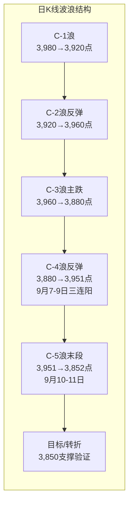
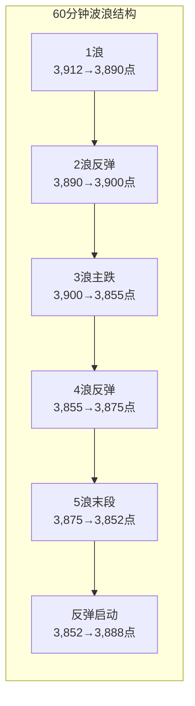

# A股晚报 - 2026年09月11日

> 数据截止时间：2026年9月11日 15:30（北京时间）
> 本期为首期晚报，波浪分析体系从本期开始建立，复盘闭环机制正式启动。

---

## 一、市场回顾

### 1. 主要指数表现

| 指数 | 收盘点位 | 涨跌幅 | 涨跌点数 | 成交额（亿） |
|-----|---------|-------|---------|------------|
| 上证指数 | 3,888.11 | -1.18% | -46.29 | 9,581.86 |
| 深证成指 | 13,471.26 | -1.08% | -146.41 | 10,137.12 |
| 创业板指 | 3,332.04 | -0.49% | -16.39 | — |
| 科创50 | 11,553.39 | -1.01% | -115.83 | 778.80 |
| 北证50 | — | -2.66% | — | — |

**盘面解读**：今日A股三大指数低开低走，盘中一度集体跌逾2%，沪指最低探至3,852点。午后跌幅逐步收窄，但仍集体收跌。沪指失守3,900点整数关口，创近两周新低。[$TRAE_REF](http://m.toutiao.com/group/7684236462623162918/)

**分时走势**：上证指数开盘3,910.92点，早盘快速下行，午后14:00前后触及全日最低3,852.03点，随后小幅回升，尾盘收于3,888.11点。全天振幅约1.53%。[$TRAE_REF](http://www.sse.com.cn/market/price/trends/index.shtml?keyword=SH600080)

### 2. 成交量能

| 指标 | 数值 | 环比变化 |
|-----|------|---------|
| 沪深北三市合计成交额 | 约1.99万亿元 | 放量约3,246亿元 |
| 沪市成交额 | 9,581.86亿元 | — |
| 深市成交额 | 10,137.12亿元 | — |
| 北向资金成交额 | 2,913.20亿元 | 占比14.77% |
| 北向资金净流向 | 净流入12.91亿元 | 结构分化明显 |

**资金流向分析**：北向资金整体小幅净流入12.91亿元，但结构分化显著——沪股通小幅流出，深股通大幅流入，资金主要布局深市电子硬件标的。主力资金方面，通信板块获净流入52.78亿元居首，有色金属行业净流出69.73亿元居净流出首位。[$TRAE_REF](https://finance.eastmoney.com/a/202609113872159520.html)[$TRAE_REF](http://m.toutiao.com/group/7684223395235381800/)

### 3. 市场情绪

| 情绪指标 | 数值 |
|---------|------|
| 上涨个股数 | 约639只 |
| 下跌个股数 | 超4,800只 |
| 涨停个股数 | 40家 |
| 跌停个股数 | 21家 |
| 涨跌比 | 约1:7.5 |

**市场宽度**：今日市场亏钱效应显著，全市场下跌个股数量超过4,800只，涨停40家、跌停21家。跌涨比约7.5:1，市场呈现普跌格局，但涨停家数仍维持在40家，局部题材仍有一定活跃度。[$TRAE_REF](https://caifuhao.eastmoney.com/news/20260911152113486346480)

---

## 二、热点板块与异动分析

### 1. 当日领涨板块及驱动因素

| 板块 | 涨跌幅 | 驱动因素 |
|-----|-------|---------|
| 通信 | +1.41% | CPO/铜缆高速连接概念持续发酵，中际旭创资金净流入超31亿元 |
| 建筑材料 | +0.13% | 电子布/MLCC产业链联动，山东玻纤连续3日涨停 |
| 电力 | 逆势活跃 | 防御属性+电力改革预期，闽东电力3连板 |

**热点概念涨幅榜**：

| 概念板块 | 涨跌幅 |
|---------|-------|
| 兵装重组概念 | +3.23% |
| MLCC概念 | +1.77% |
| 铜缆高速连接 | +1.02% |

**驱动因素分析**：AI硬件方向成为今日市场中为数不多的亮点，各分支轮动活跃。元件及MLCC概念午后拉升，铜缆高速连接板块表现强势。通信板块获主力资金净流入38.46亿元居首，反映在市场调整中资金向确定性成长方向集中。[$TRAE_REF](http://m.toutiao.com/group/7684236462623162918/)[$TRAE_REF](http://m.toutiao.com/group/7684230151734936070/)

### 2. 当日领跌板块及原因分析

| 板块 | 涨跌幅 | 下跌原因 |
|-----|-------|---------|
| 有色金属 | -3.98% | 铜等工业金属关税逻辑被证伪，伦敦基本金属全线下跌 |
| 基础化工 | -2.98% | 油价飙升推升成本但需求端承压，化工品跟跌 |
| 房地产 | -2.93% | 政策预期落空+资金撤离周期板块 |

**下跌核心逻辑**：受大宗商品价格波动影响，有色股集体重挫，北方铜业、深中华A跌停。铜等工业金属的关税逻辑被市场证伪，导致伦敦基本金属全线下跌，直接拖累A股有色金属及资源类板块。此外，多元金融、代糖概念、旅游酒店及油气股也遭遇资金大幅抛售。[$TRAE_REF](https://caifuhao.eastmoney.com/news/20260911152113486346480)

### 3. 个股异动复盘

**涨停板复盘**：

| 个股 | 涨停类型 | 驱动因素 |
|-----|---------|---------|
| 瑞尔特 | 4连板 | 智能马桶概念，家居消费升级 |
| 闽东电力 | 3连板 | 电力板块+新能源 |
| 新农开发 | 3连板 | 农业种业概念 |
| 鼎信通讯 | 3连板 | 通信设备+铜缆高速连接 |
| 神宇股份 | 20cm涨停 | 铜缆高速连接龙头 |
| 铭普光磁 | 涨停 | CPO/光通信概念 |
| 风华高科 | 涨停 | MLCC龙头，封单5.74亿元 |
| 双星新材 | 涨停 | 电子布/MLCC产业链 |
| 杭州热电 | 涨停 | 电力板块 |
| 江苏新能 | 涨停 | 电力板块 |
| 内蒙一机 | 涨停 | 军工装备探底回升 |

**连板梯队**：4板（瑞尔特）→ 3板（闽东电力、新农开发、鼎信通讯）→ 首板（风华高科、双星新材、铭普光磁等）

**跌停板复盘**：

| 个股 | 跌停原因 |
|-----|---------|
| 北方铜业 | 有色金属集体重挫，机构净卖出9,233.99万元 |
| 深中华A | 有色金属板块拖累 |
| 翠微股份 | 多元金融遭遇资金抛售 |
| 华天酒店 | 旅游酒店板块承压 |

[$TRAE_REF](http://m.toutiao.com/group/7684230151734936070/)[$TRAE_REF](https://api3.cls.cn/share/subject/1103?os=ios&sv=818)[$TRAE_REF](http://m.toutiao.com/group/7684201589799748122/)

---

## 三、关键数据与事件回顾

### 1. 国内重要经济数据

| 数据 | 数值 | 要点 |
|-----|------|------|
| 8月外汇储备 | 34,383亿美元 | 较7月末上升195亿美元，升幅0.57% |
| 前8月货物贸易进出口 | 持续增长 | 外贸保持韧性 |

**央行公开市场操作**：9月11日开展40亿元7天期逆回购操作，操作利率1.40%（持平），当日无逆回购到期，公开市场净投放40亿元。本周全口径实现中性操作。[$TRAE_REF](http://m.toutiao.com/group/7684083750343361076/)

### 2. 政策消息

- **"十五五"金融规划**：国新办9月10日召开金融"十五五"发布会，央行副行长陆磊表示将不断健全市场化利率形成和调控机制，引导短端货币市场利率围绕政策利率平稳运行。[$TRAE_REF](http://m.toutiao.com/group/7684062318438728255/)
- **央行流动性维护**：央行通过逆回购操作维护流动性合理充裕，政策底支撑客观存在。
- **证监会IPO注册**：同意重庆宇隆光电科技、粤芯半导体技术创业板IPO注册。

### 3. 公司重要公告

| 公司 | 公告类型 | 核心内容 |
|-----|---------|---------|
| 宁德时代 | 回购 | 首次回购60.43万股，成交金额约2亿元，最高价331.61元/股 |
| 浪潮信息 | 定增 | 拟定增募资不超90亿元，投建AI基础设施等项目 |
| 宏昌电子 | 定增 | 拟定增募资不超18亿元，投建高端覆铜板等项目 |
| 雪天盐业 | 重组 | 拟购买河北坤天新能源100%股份，9月14日复牌 |
| 有研硅 | 重组 | 拟购买山东有研艾斯71.89%及山东有研半导体14.98%股权 |
| 新华传媒 | 重组 | 筹划购买财联社控股权，继续停牌 |
| 华锡有色 | 控制权变更 | 筹划控制权变更，9月14日起停牌 |
| 国电南自 | 股权划转 | 控股股东拟将40%股份无偿划转至中国华电 |
| 恒瑞医药 | 药品审批 | 注射用瑞康芦泽妥塔单抗纳入突破性治疗品种名单 |
| 天通股份 | 上市 | 筹划发行H股并在香港联交所上市 |
| 中煤能源 | 产量数据 | 8月商品煤产量1,008万吨，同比下降13.1% |

[$TRAE_REF](http://m.toutiao.com/group/7684225901932642835/)

---

## 四、海外市场联动

### 1. 美股三大指数（9月10日收盘）

| 指数 | 收盘点位 | 涨跌幅 | 涨跌点数 |
|-----|---------|-------|---------|
| 道琼斯工业平均指数 | 52,064.10 | -0.60% | -316.56 |
| 标普500指数 | 7,591.70 | -0.58% | -44.66 |
| 纳斯达克综合指数 | 26,081.72 | -0.65% | -171.62 |
| VIX恐慌指数 | 17.84 | — | — |

**市场解读**：美股三大指数连续第四日下跌。美国8月PPI数据超预期升温，加剧市场对通胀反弹和美联储维持高利率的担忧，芯片股领跌。英伟达跌2.37%，但苹果逆势涨3.56%。[$TRAE_REF](https://finance.sina.com.cn/stock/hkstock/hkstocknews/2026-09-11/doc-inirkywm2169220.shtml)[$TRAE_REF](http://m.toutiao.com/group/7684045516266586650/)

### 2. 欧洲、亚太主要市场

**9月10日收盘**：

| 指数 | 涨跌幅 |
|-----|-------|
| 英国富时100 | -0.57% |
| 德国DAX30 | -0.84% |
| 法国CAC40 | -0.49% |

**9月11日开盘**：欧洲主要股指开盘集体上涨，英国富时100涨0.18%，法国CAC40涨0.53%，德国DAX涨0.27%，出现超跌反弹迹象。[$TRAE_REF](https://finance.sina.com.cn/stock/bxjj/2026-09-11/doc-inirmvzz2340475.shtml)

### 3. 大宗商品

| 品种 | 收盘价/最新价 | 涨跌幅 | 要点 |
|-----|-------------|-------|------|
| WTI原油（10月合约） | 102.48美元/桶 | +6.69% | 突破100美元关口 |
| 布伦特原油（11月合约） | 107.63美元/桶 | +6.34% | 一度升至109美元上方 |
| COMEX黄金期货 | 4,358.5美元/盎司 | -2.29% | 美元走强压制 |
| 现货白银 | 63.55美元/盎司 | -5.49% | 跌幅扩大 |
| 国内SC原油 | — | 续涨超5% | 跟随国际油价 |
| 伦敦基本金属 | 全线下跌 | — | 铜等关税逻辑被证伪 |

**商品解读**：中东地缘政治冲突和市场供应前景恶化推动国际油价飙升，两大基准原油双双突破100美元。与此同时，铜等工业金属关税逻辑被市场证伪，伦敦基本金属全线下跌。黄金在美元走强和美债收益率上升的双重压力下大幅下挫。[$TRAE_REF](http://www.xinhuanet.com/20260911/e6cbb4de44fa4c74a982d2cd82a3d2d0/c.html)[$TRAE_REF](http://m.toutiao.com/group/7684222031717499455/)

---

## 五、汇率与利率

### 1. 人民币汇率走势

| 指标 | 数值 | 变动 |
|-----|------|------|
| 人民币兑美元中间价 | 6.7743 | 调升23个基点 |
| 在岸人民币（16:30收盘） | 6.7096 | 下跌34点 |
| 离岸人民币 | 6.7061 | — |
| 美元指数 | 99.048 | +0.23% |

**汇率解读**：人民币兑美元中间价调升23个基点至6.7743，但在岸人民币收盘较前日下跌34点至6.7096。美元指数受通胀预期升温支撑小幅上涨。[$TRAE_REF](http://finance.ce.cn/cjdsj/hlsj/)[$TRAE_REF](https://www.chinamoney.org.cn/chinese/)

### 2. 国内利率市场

| 指标 | 数值 | 变动 |
|-----|------|------|
| Shibor隔夜 | 1.4170% | +1.30BP |
| Shibor 7天 | 1.4200% | +1.00BP |
| Shibor 14天 | 1.4070% | +0.10BP |
| Shibor 1个月 | 1.4189% | 持平 |
| 隔夜回购加权利率 | 1.42% | +1BP |
| 7天回购加权利率 | 1.42% | +1BP |
| 美债10年期收益率 | 4.93% | 飙升近7BP |

**利率解读**：Shibor利率小幅上行，银行间资金价格以涨为主。美债收益率大幅攀升，30年期美债收益率创2007年6月以来新高，反映市场对美联储维持高利率时间更长的预期。[$TRAE_REF](http://m.toutiao.com/group/7684222009634472483/)

### 3. 央行公开市场操作

- **操作内容**：40亿元7天期逆回购，利率1.40%（持平）
- **到期量**：0亿元
- **净投放**：40亿元
- **本周累计**：85亿元7天逆回购 + 5,000亿元买断式逆回购，全口径净中性

---

## 六、收盘后重要信息

### 1. 盘后公告

- **宁德时代**：首次回购A股股份60.43万股，成交金额约2亿元，最高价331.61元/股
- **浪潮信息**：拟定增募资不超90亿元投建AI基础设施等项目
- **雪天盐业**：拟购买河北坤天新能源100%股份，9月14日复牌
- **有研硅**：拟购买山东有研艾斯71.89%及山东有研半导体14.98%股权
- **华锡有色**：筹划控制权变更，9月14日起停牌
- **国电南自**：控股股东拟将40%股份无偿划转至中国华电
- **恒瑞医药**：注射用瑞康芦泽妥塔单抗纳入突破性治疗品种名单
- **天通股份**：筹划发行H股并在香港联交所上市

[$TRAE_REF](http://m.toutiao.com/group/7684225901932642835/)

### 2. 夜盘走势

- **欧洲市场**：欧股开盘集体反弹，英国富时100涨0.18%，法国CAC40涨0.53%，德国DAX涨0.27%
- **国际油价**：WTI原油9月11日早盘继续走高，涨1.65%报104.15美元/桶
- **贵金属**：现货黄金跌1.88%报4,316.78美元/盎司，现货白银跌5.49%

### 3. 次日关注

| 时间 | 事项 | 说明 |
|-----|------|------|
| 20:30（今晚） | 美国8月CPI数据 | 预计同比3.4%，核心CPI环比0.2%，美联储9月议息前最后一块通胀拼图 |
| 9月14日（周一） | 多只个股复牌 | 雪天盐业、龙版传媒、有研硅复牌；华锡有色停牌 |
| 9月15日 | 斯菱智驱限售股解禁 | 85.06万股，占总股本0.25% |
| 9月15-16日 | 美联储议息会议 | 加息概率71.3%（较PPI前64%持续攀升） |

**CPI数据前瞻**：美国劳工统计局将于北京时间今晚20:30公布8月CPI报告。道琼斯共识预期：CPI环比+0.4%，同比+3.4%；核心CPI环比+0.2%。若数据超预期，可能进一步推升加息概率，对全球风险资产形成压制。[$TRAE_REF](https://caifuhao.eastmoney.com/news/20260911091453306928780)[$TRAE_REF](https://finance.sina.com.cn/wm/2026-09-11/doc-inirmmnf2138210.shtml)

---

## 七、波浪理论多周期分析

> 本期为首期波浪分析，基于上证指数近期K线走势建立多周期波浪框架，后续将根据实际走势持续修正。

### 1. 月K线波浪分析

- **当前波浪位置**：第2浪调整中（A-B-C结构，当前运行C浪）
- **浪型结构描述**：
  - 第1浪：2024年9月至2025年高点（约4,000-4,100点区域），为2024年低点以来的主升浪
  - 第2浪调整：2025年高点至今，运行A-B-C三子浪调整结构
    - A浪：2025年高点至2026年2月低点（约3,700-3,800点区域），跌幅约7%-8%
    - B浪反弹：2026年2月至6月，反弹至3,950-4,000点区域
    - C浪：2026年6月至今，从3,950点附近开始下行，当前运行至3,852-3,888点区域
  - 月线MACD呈二浪回调走势，死叉运行中，绿柱尚未明显缩短
- **关键目标位**：
  - C浪目标1：3,750点（第1浪的61.8%回撤位）
  - C浪目标2：3,700点（第1浪起点附近，极端目标）
  - 若C浪在3,750-3,800区域企稳，则2浪调整结束，将启动第3浪上升
- **验证条件**：
  - 月线MACD绿柱开始缩短且DIF线拐头向上 → 确认C浪结束
  - 月线收复3,950点 → 确认第3浪启动
  - 月线跌破3,700点 → C浪延长，需重新评估浪型

### 2. 周K线波浪分析

- **当前波浪位置**：C浪第5子浪末段（C浪内部的末端）
- **浪型结构描述**：
  - 周线级别从6月高点约3,980点开始下行，运行5子浪结构
    - C-1浪：3,980→3,920点
    - C-2浪：3,920→3,960点反弹
    - C-3浪：3,960→3,880点（主跌段）
    - C-4浪：3,880→3,951点反弹（9月7-9日三连阳）
    - C-5浪：3,951→3,852点（今日低点，可能接近末端）
  - 周线MACD绿柱已从大绿转为小绿，做空动能慢慢衰竭
  - 周线从2026年2月开始一直是绿柱，做空动能持续释放
- **关键目标位**：
  - C-5浪目标：3,850-3,750点（已触及3,852，接近目标区域）
  - 若C浪5子浪完成，将启动周线级别反弹
- **验证条件**：
  - 周线MACD绿柱持续缩短 → C浪接近末端
  - 周线收阳且突破3,950点 → 确认周线反弹启动
  - 周线跌破3,750点 → C浪延长，调整深化

### 3. 日K线波浪分析

- **当前波浪位置**：C-5浪末段，可能已接近完成
- **浪型结构描述**：
  - 9月7-9日三连阳（3,932→3,951点）为C-4浪反弹
  - 9月10日回调至3,934点（-0.43%），C-5浪启动信号
  - 9月11日跳空低开，最低3,852点，收3,888点，C-5浪加速下行
  - 日线MACD绿柱扩大，KDJ低位向下发散，短期调整压力尚未完全释放
  - 沪指跌破5日、10日及20日均线，短期技术形态转弱
  - 但3,852点低点接近C浪整体目标区域，存在完成可能
- **关键目标位**：
  - 即时支撑：3,850点（今日低点附近，已触及3,852）
  - 关键支撑：3,750点（月线级别C浪目标）
  - 上方压力：3,900点（已由支撑转为压力）
  - 强压力：3,950-3,980点
- **验证条件**：
  - 日线收复3,900点 → C-5浪结束信号
  - 日线MACD绿柱缩短 + KDJ金叉 → 确认反弹启动
  - 日线跌破3,750点 → C浪延长，需下调预期

### 4. 60分钟K线波浪分析

- **当前波浪位置**：5浪下跌末段，可能出现反弹
- **浪型结构描述**：
  - 9月11日开盘后快速下跌，形成5浪下行结构
    - 1浪：3,912→3,890点
    - 2浪：3,890→3,900点反弹
    - 3浪：3,900→3,855点（主跌段，跌幅最大）
    - 4浪：3,855→3,875点反弹
    - 5浪：3,875→3,852点（末段，跌幅收窄）
  - 尾盘从3,852点回升至3,888点，可能预示5浪完成后的反弹
  - 60分钟MACD绿柱缩短，KDJ低位准备金叉
- **关键目标位**：
  - 反弹第一目标：3,900-3,920点
  - 反弹第二目标：3,950点
  - 若反弹乏力跌破3,852点 → 下行延续
- **验证条件**：
  - 60分钟KDJ金叉向上 → 确认反弹
  - 站稳3,900点 → 反弹确立
  - 跌破3,852点 → 5浪延长

### 5. 30分钟K线波浪分析

- **当前波浪位置**：下跌5浪完成后的a浪反弹启动
- **浪型结构描述**：
  - 30分钟级别，14:00前后触及3,852点完成5浪下跌
  - 随后展开a-b-c反弹结构
    - a浪：3,852→3,880点（30分钟快速反弹）
    - b浪：3,880→3,865点（小幅回踩）
    - c浪：3,865→3,888点（尾盘收高）
  - 30分钟MACD已出现底背离，绿柱持续缩短
  - KDJ低位金叉向上发散
- **关键目标位**：
  - 即时反弹目标：3,900-3,910点
  - 若站稳3,910点 → 反弹升级至60分钟级别
  - 若跌破3,852点 → 反弹失败，继续下行
- **验证条件**：
  - 30分钟MACD红柱出现 → 反弹确认
  - 站稳3,880点 → 短期企稳
  - 跌破3,852点 → 反反弹失败

### 6. 波浪图

### 7. 波浪理论综合判断

- **多周期共振状态**：
  - 月线：第2浪C浪运行中，方向偏空但接近目标区域
  - 周线：C浪5子浪末段，做空动能衰竭，方向偏空但接近转折
  - 日线：C-5浪加速下行，短期偏空
  - 60分钟：5浪下跌完成，出现反弹信号
  - 30分钟：反弹a浪启动，短期偏多
  - **共振判断**：月线和周线大周期偏空但接近转折区域，日线短期偏空，但60分钟和30分钟已出现企稳反弹信号。存在多周期底部共振的可能性，但需日线确认。

- **当前操作级别**：日线级别（等待C-5浪完成的确认信号）
  - 短线交易者可关注60分钟级别反弹机会
  - 中线投资者等待日线级别的企稳信号

- **后续演变路径**：
  - **最可能路径（概率55%）**：3,852点为C-5浪低点，随后展开日线级别反弹至3,900-3,950点区域，若能站稳3,950点，则确认周线C浪结束，启动新一轮上升浪
  - **备选路径1（概率30%）**：反弹乏力，指数在3,900点附近受阻回落，继续震荡磨底至3,750-3,800点区域完成C浪
  - **备选路径2（概率15%）**：外部冲击（CPI超预期/美联储加息）导致指数跌破3,852点，加速下行至3,750点甚至更低

- **关键拐点信号**：
  1. 日线MACD绿柱缩短 + KDJ金叉 → C-5浪结束确认
  2. 日线收复3,900点 → 短期企稳信号
  3. 日线站稳3,950点 → 周线C浪结束确认，第3浪启动
  4. 今晚美国CPI数据公布后的市场反应 → 影响短期走势方向

- **风险提示**：
  1. 波浪理论存在主观性，数浪方案可能存在偏差，需结合成交量和技术指标交叉验证
  2. 今晚美国CPI数据如大幅超预期，可能导致全球市场剧烈波动，打破当前波浪结构判断
  3. 美联储9月15-16日议息会议结果将决定中期方向，加息概率已达71.3%
  4. 地缘政治风险（中东局势）持续升级，油价波动可能放大市场波动
  5. 波浪分析的局限性在于无法精确预测转折时点，需结合资金面和基本面综合判断

---

## 八、晨报复盘

### 1. 核心判断回顾

| 判断项目 | 晨报预测 | 实际结果 | 准确度 | 备注 |
|---------|---------|---------|-------|------|
| 上证指数趋势 | 震荡偏空 | 下跌(-1.18%) | ✓ | 方向判断正确，偏空判断获验证 |
| 上证指数区间 | 3,880-3,960点 | 3,852-3,912点 | ✗ | 实际区间整体低于预测，低点突破支撑 |
| 强支撑位 | 3,880点 | 最低3,852点 | ✗ | 3,880点被有效跌破，支撑失效 |
| 强压力位 | 3,980点 | 最高3,912点 | — | 未触及，无法验证 |
| 北向资金 | 净流出30-50亿 | 净流入12.91亿 | ✗ | 方向判断错误，实际为净流入 |
| 成交量 | 缩量(1.4-1.5万亿) | 放量1.99万亿 | ✗ | 判断错误，实际放量约3,246亿 |

### 2. 板块预判回顾

| 板块 | 预判方向 | 实际涨跌幅 | 准确度 | 原因分析 |
|-----|---------|-----------|-------|---------|
| 石油石化 | 看涨 | 油气板块逆市活跃但未大幅上涨 | ○ | 方向部分正确，油价利好被市场风险偏好下行抵消 |
| 银行/大金融 | 看涨 | 银行板块逆势走强，南京银行+3% | ✓ | 防御属性+政策预期双重驱动，判断准确 |
| 航空航运 | 看跌 | 跟随大盘下跌 | ✓ | 油价上涨增加成本压力逻辑成立 |
| 高估值科技成长 | 看跌 | 科技板块整体回调 | ✓ | 美债收益率上升压制估值逻辑成立 |
| 半导体/AI芯片 | 风险提示 | AI硬件局部活跃(MLCC/铜缆)，但半导体承压 | ○ | 利好兑现风险部分验证，但AI硬件细分方向超预期 |

### 3. 准确率量化评估

- 趋势判断准确率：67%（2/3）——趋势方向正确，但区间和支撑判断有误
- 点位预测准确率：25%（1/4）——仅弱支撑3,900点附近有短暂支撑（盘中触及3,912后快速跌破）
- 板块预判准确率：60%（3/5）——银行、航空、高估值科技判断正确
- 综合准确率：50%

### 4. 偏差根因分析

**【偏差1】上证指数区间判断偏差**
- 偏差描述：预测3,880-3,960点，实际3,852-3,912点，低点突破预测下限28点
- 根本原因：【信息缺失+技术分析局限】
- 信息缺口：晨报未充分评估美国PPI超预期对隔夜情绪面的持续冲击，以及欧洲央行加息对全球流动性的收紧效应
- 逻辑缺陷：低估了外部冲击对A股的传导力度，3,880点支撑仅考虑了技术面和整数关口，未考虑恐慌性抛售的冲击力度
- 改进措施：在关键支撑位判断时，增加"压力测试"——即考虑极端情况下支撑位被突破的概率，设置分级支撑位

**【偏差2】北向资金方向判断偏差**
- 偏差描述：预测净流出30-50亿，实际净流入12.91亿
- 根本原因：【逻辑误判】
- 信息缺口：晨报过度关注美股下跌对北向资金的负面影响，忽视了深市AI硬件标的对外资的吸引力
- 逻辑缺陷：北向资金结构分化明显——沪股通小幅流出但深股通大幅流入，说明外资在调整中进行了结构性调仓而非整体撤退。晨报预测时将"外资偏谨慎"等同于"净流出"，忽略了结构性流入的可能性
- 改进措施：北向资金预测需区分沪股通和深股通，考虑板块层面的资金吸引力差异

**【偏差3】成交量判断偏差**
- 偏差描述：预测缩量1.4-1.5万亿，实际放量1.99万亿
- 根本原因：【情绪面误读+逻辑误判】
- 信息缺口：晨报判断"观望情绪浓厚"会导致缩量，但实际恐慌盘出逃导致放量下跌
- 逻辑缺陷：在市场出现破位下行时，恐慌性抛售会释放大量卖盘，同时抄底资金也会入场，形成放量。晨报仅考虑了CPI前观望的缩量逻辑，未考虑破位后的恐慌放量逻辑
- 改进措施：成交量预测需区分"震荡市缩量"和"破位市放量"两种情景，增加条件触发逻辑

### 5. 分析检查清单

☐ 趋势判断前是否检查：
  - [x] 隔夜外盘走势
  - [x] 北向资金流向
  - [x] 技术指标状态
  - [x] 重大政策/事件

☐ 点位计算是否考虑：
  - [x] 前期高低点
  - [x] 均线支撑/压力
  - [ ] 整数关口心理影响（已考虑但未充分评估突破风险）
  - [ ] 成交密集区

☐ 板块分析是否覆盖：
  - [x] 行业基本面变化
  - [x] 资金流向数据
  - [x] 政策催化因素
  - [x] 技术形态位置

☐ 风险提示是否充分：
  - [x] 宏观风险
  - [x] 行业风险
  - [x] 个股风险
  - [ ] 流动性风险（放量下跌的流动性冲击未充分提示）

☐ 波浪分析检查项：
  - [x] 多周期验证
  - [x] 成交量配合
  - [x] MACD指标验证
  - [x] KDJ指标验证
  - [ ] 黄金分割率测算（首期建立，后续完善）

### 6. 本次复盘发现的新规则

- 规则1：在关键支撑位被跌破时，恐慌盘出逃会导致放量而非缩量，成交量预测需区分"震荡市"和"破位市"两种情景
- 规则2：北向资金结构分化（沪股通vs深股通）比总量方向更具参考价值，外资可能在调整中进行板块轮动而非整体撤退
- 规则3：外部冲击的传导力度容易低估，美国PPI超预期+欧洲央行加息的双重紧缩效应对A股的冲击需要加倍评估

### 7. 规则库更新

###趋势分析 在关键支撑位被跌破时，恐慌盘出逃会导致放量而非缩量，成交量预测需区分"震荡市缩量"和"破位市放量"两种情景，增加条件触发逻辑
###资金面分析 北向资金结构分化（沪股通vs深股通）比总量方向更具参考价值，外资可能在市场调整中进行板块轮动而非整体撤退，预测时需分别评估
###风险识别 外部冲击叠加效应容易低估，美国PPI超预期+欧洲央行加息的双重紧缩效应对A股的冲击需加倍评估，关键支撑位的突破风险应设置分级预警

---

## 九、风险提示

### 1. 市场系统性风险提示
- **美联储加息风险**：9月15-16日议息会议加息概率已达71.3%，若今晚CPI超预期，可能进一步升至80%以上，全球风险资产面临重估压力
- **油价飙升风险**：国际油价突破100美元并持续上涨，可能加剧通胀压力，压缩央行货币政策宽松空间
- **美债收益率上行风险**：30年期美债收益率创2007年以来新高，全球无风险利率上行压制风险资产估值

### 2. 个股风险事件
- **华锡有色**：筹划控制权变更，9月14日起停牌，存在不确定性
- **爱仕达**：具身智能机器人业务销售收入仅13.72万元，股价异动后存在回调风险
- **山东玻纤**：连续3日涨停后发布异动公告，公司暂无电子布产品，注意追高风险

### 3. 政策不确定性风险
- **美联储议息结果**：9月15-16日会议结果将决定全球流动性走向，当前市场分歧加大
- **中东地缘局势**：冲突升级可能进一步推升油价，对全球通胀和风险偏好形成冲击
- **国内政策节奏**："十五五"金融规划落地，但具体实施节奏和力度存在不确定性

---

## 十、信息来源

1. **官方数据来源**：中国人民银行、国家外汇管理局、上海证券交易所、深圳证券交易所
2. **权威财经媒体**：新华社、证券时报、证券日报、第一财经、新浪财经
3. **数据平台**：东方财富网、同花顺、Wind资讯、中国货币网、中证债券估值

---

## 十一、文档更新检查

### AGENTS.md更新
无需更新。当前AGENTS.md流程描述与实际执行一致，晚报生成流程（读取模板→收集数据→波浪分析→晨报复盘→保存→更新day_summary→月度总结→git提交→飞书同步）与文档描述的流程匹配。

### README.md更新
无需更新。文件结构描述与实际一致，核心功能描述准确。

### 无需更新
AGENTS.md和README.md均与当前系统实际执行一致，无需修改。

---

*数据截止时间：2026年9月11日 15:30（北京时间）*
*本期为首期晚报，波浪分析体系从本期开始建立，后续将根据实际走势持续修正。*
*复盘闭环机制自本期正式启动。*
