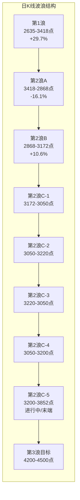
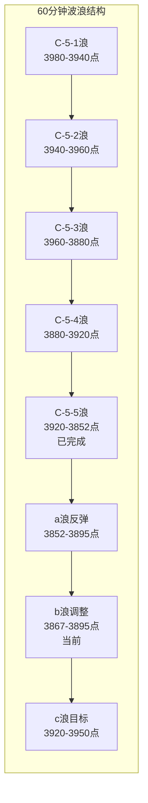

# A股晚报 - 2026年09月14日

> 数据截止时间：2026年9月14日 19:30（北京时间）
> 美联储9月议息会议（9月15-16日）前最后一个交易日，市场缩量观望

---

## 一、市场回顾

### 1. 主要指数表现

| 指数 | 收盘点位 | 涨跌幅 | 开盘点位 | 最高点位 | 最低点位 |
|------|---------|--------|---------|---------|---------|
| 上证指数 | 3,885.33 | -0.07% | 3,867.02 | 3,895.51 | 3,867.02 |
| 深证成指 | 13,384.57 | -0.64% | — | — | — |
| 创业板指 | 3,285.58 | -1.10% | — | — | — |
| 科创50 | 1,528.27 | -1.62% | — | — | — |
| 沪深300 | 4,480.08 | -0.67% | — | — | — |
| 北证50 | 1,021.90 | -0.15% | — | — | — |

**市场解读**：今日A股三大指数分化，沪指微跌0.07%守住3880点，但创业板指跌1.10%、科创50跌1.62%，双创板块承压明显。指数表现弱于个股，属于典型的"指数压盘、个股结构性活跃"行情。 [$TRAE_REF](https://caifuhao.eastmoney.com/news/20260914190620739852300)

### 2. 成交量能

| 指标 | 数值 | 变动 |
|------|------|------|
| 两市合计成交额 | 约16,291.76亿元 | 缩量3,427.23亿元（年内次低） |
| 沪市成交额 | 约7,801.71亿元 | — |
| 深市成交额 | 约7,855.47亿元 | — |
| 北向资金成交额 | 2,384.85亿元 | 占两市总成交14.64% |
| 南向资金净买入 | 44.71亿港元 | 连续6日净买入 |

**量能解读**：成交额从上周五的1.97万亿大幅缩量至1.63万亿，创年内次低纪录。美联储议息会议前最后一个交易日，资金避险情绪浓厚，增量资金未进场，存量资金内部轮动。 [$TRAE_REF](https://caifuhao.eastmoney.com/news/20260914170022797131230)

### 3. 市场情绪

| 指标 | 数值 | 情绪信号 |
|------|------|---------|
| 上涨个股 | 3,126只（56.3%） | 赚钱效应修复 |
| 下跌个股 | 2,224只 | — |
| 涨停家数 | 57只（非ST 55只） | 较前日增加 |
| 跌停家数 | 18只 | 高位股补跌 |
| 炸板家数 | 36只 | 封板率69% |
| 连板股 | 11只 | 晋级率偏低 |
| 恐贪指数 | 41.6 | 中性偏冷 |
| 散户情绪指数 | 46.2 | 偏谨慎 |

**情绪解读**：市场情绪从上周五的冰点有所回弹，但仍是"中性偏冷"状态。个股涨多跌少（56%红盘），但高位科技股承压，资金明显从高位AI硬件向低位医药、PCB切换。 [$TRAE_REF](https://caifuhao.eastmoney.com/news/20260914190620739852300)

---

## 二、热点板块与异动分析

### 1. 当日领涨板块及驱动因素

| 板块 | 涨跌幅 | 驱动因素 | 代表个股 |
|------|--------|---------|---------|
| **医药生物/CRO** | +1.88% | 估值低位+减肥药催化+临床订单增长 | 近岸蛋白20cm涨停、万邦医药20cm涨停、美迪西、凯莱英大涨 |
| **电力设备** | +1.28% | 储能/固态电池概念活跃 | — |
| **汽车整车** | +1.09% | 低位整车反弹修复+十五五新能源车规划 | 众泰汽车5天4板、海马汽车涨停 |
| **非银金融** | +1.08% | 超跌反弹 | 湘财股份涨停 |
| **银行** | +0.91% | 防御属性+红利底仓 | 中信银行+2.05% |
| **PCB/电子元件** | 资金净流入+50.56亿 | 算力硬件回流+涨价+国产替代 | 超声电子6天4板、科翔股份/满坤科技20cm涨停 |
| **MLCC/被动元件** | 资金净流入+22.48亿 | 村田停产+AI服务器需求+涨价 | 双星新材2连板、风华高科涨6.82% |
| **培育钻石** | 强势 | 北证50样本调整落地+惠丰钻石调入 | 黄河旋风、恒盛能源涨停 |
| **数据安全/网安** | 强势 | 政策催化 | 博汇科技20cm涨停、中新赛克3板 |

### 2. 当日领跌板块及原因分析

| 板块 | 涨跌幅 | 原因分析 | 代表个股 |
|------|--------|---------|---------|
| **通信** | -2.42% | 高位AI硬件资金兑现+全球AI巨头呼吁降速下调资本开支预期 | 中际旭创、新易盛、立讯精密跌超4% |
| **农林牧渔** | -1.54% | 获利盘出逃+农业板块获利回吐 | 敦煌种业、新农开发跌停 |
| **国防军工** | -1.30% | 板块轮动回调 | — |
| **有色金属** | -0.94% | LME铜大跌后情绪未恢复+美元走强 | 福达合金-8.54% |
| **旅游/教育** | 下跌 | 板块轮动回调 | — |

**板块轮动逻辑**：资金从高位AI硬件（通信/CPO/光模块）大幅撤离，涌向低位医药、PCB/MLCC、培育钻石、汽车等方向。典型的"高位切低位"防御性轮动。 [$TRAE_REF](https://caifuhao.eastmoney.com/news/20260914170022797131230)

### 3. 个股异动复盘

**连板股情况：**

| 个股 | 代码 | 连板高度 | 所属板块 | 备注 |
|------|------|---------|---------|------|
| 闽东电力 | — | 4板 | 电力/算电 | 当前市场最高板 |
| 中新赛克 | — | 3板 | 网安 | — |
| 超声电子 | — | 6天4板 | PCB | 科技内部高低切锚点 |
| 众泰汽车 | — | 5天4板 | 汽车整车 | — |
| 国芳集团 | — | 12天7板 | 零售 | 抱团绕异动 |
| 双星新材 | — | 2连板 | MLCC | — |
| 澳弘电子 | — | 2板 | PCB | — |

**风险个股：**
- **有研硅（688432）**：今日复牌，开盘跌4.91%，盘中一度跌16.72%，午间最高涨16.92%，振幅高达33.64%，收盘剧烈波动
- **中瓷电子（003031）**：130.92亿解禁（占总股本24.59%），今日承压
- **高位题材股**：捷荣技术等连续跌停A杀确认，连板高度压缩至4板

---

## 三、关键数据与事件回顾

### 1. 国内重要经济数据

| 数据 | 数值 | 变动 |
|------|------|------|
| M2同比增速 | 7.5% | — |
| M1同比增速 | 4.1% | — |
| 社融存量同比增速 | 7.2% | — |
| 前八个月社融增量 | 23.91万亿元 | 比上年同期少2.64万亿元 |
| 前八个月人民币贷款增加 | 10.44万亿元 | — |

**数据解读**：8月金融统计数据整体平稳，M2增速7.5%，社融存量增速7.2%，信贷投放节奏有所放缓。 [$TRAE_REF](https://www.stcn.com/article/list/yw.html)

### 2. 政策消息

- **央行流动性安排**：9月14日开展5040亿元隔夜逆回购操作，全口径净投放35亿元。央行将在9月14-17日连续4天开展隔夜逆回购操作，提前应对季末资金需求。 [$TRAE_REF](https://finance.sina.com.cn/jjxw/2026-09-14/doc-iniruara9655172.shtml.md)
- **工信部等九部门印发《智能网联新能源汽车产业发展"十五五"规划》**：提出到2030年高速公路、城市快速路等场景实现高度自动驾驶，利好智能汽车产业链。 [$TRAE_REF](http://www.egsea.com/quotation/stock-info/sz002670.html)
- **商务部对美芯片反倾销调查（延续利好）**：9月13日公告对原产于美国的进口相关模拟芯片发起反倾销立案调查，今日持续催化国产模拟芯片/半导体设备板块情绪。

### 3. 公司重要公告

- **向日葵（300111）**：子公司获得硫酸氨基葡萄糖胶囊药品注册证书
- **国芳集团**：连续3个交易日收盘价涨幅偏离值累超20%
- **克来机电**：陈久康及一致行动人持股比例已降至37.00%
- **宝光股份**：每股派0.0352元，股权登记日为9月21日
- **中瓷电子（003031）**：1.11亿股解禁，市值130.92亿元，解禁后无限售股份

---

## 四、海外市场联动

### 1. 美股市场（上周五收盘，9月12日）

| 指数 | 收盘点位 | 涨跌幅 |
|------|---------|--------|
| 道琼斯工业平均指数 | 52,573.29 | +0.98% |
| 标普500指数 | 7,656.98 | +0.86% |
| 纳斯达克综合指数 | 26,333.04 | +0.96% |

**解读**：周五美股三大指数全线反弹，美国8月CPI数据符合预期（同比3.4%），核心CPI同比回落至2.4%，缓解了通胀超预期恶化的担忧。但CME FedWatch显示9月加息概率约88%，市场仍对议息会议保持谨慎。周度来看，道指周跌1.6%，为3个月来最差周表现。 [$TRAE_REF](https://caifuhao.eastmoney.com/news/20260914091444343964470)

### 2. 欧洲/亚太市场（上周五）

| 指数 | 涨跌幅 |
|------|--------|
| 德国DAX 30 | +0.82% |
| 英国富时100 | +0.39% |
| 法国CAC40 | +0.78% |
| Euro Stoxx 50 | +0.90% |

**解读**：欧洲主要股指周五集体反弹，受美国CPI数据符合预期提振。此前欧洲央行9月10日加息25bp的利空已被消化。

### 3. 大宗商品

| 品种 | 最新价格 | 涨跌幅 |
|------|---------|--------|
| WTI原油（10月） | 100.05美元/桶 | -2.37% |
| 布伦特原油（11月） | 104.61美元/桶 | -2.81% |
| COMEX黄金（12月） | 4,392.30美元/盎司 | -0.34% |
| COMEX铜（12月） | 6.5475美元/磅 | 0.00% |

**解读**：原油从周四暴涨中回落约2.4-2.8%，WTI仍站稳100美元上方。黄金微跌，在美元走强和美债收益率高企的压力下表现平淡。铜持平企稳。

---

## 五、汇率与利率

### 1. 人民币汇率

| 指标 | 数值 | 变动 |
|------|------|------|
| 人民币中间价 | 6.7698 | 上调45个基点 |
| 离岸人民币（CNH） | 约6.7139 | 基本持平 |

**解读**：人民币中间价连续调升，央行维护汇率稳定意图明确。离岸人民币在6.71附近震荡，汇率压力可控。 [$TRAE_REF](http://finance.ce.cn/cjdsj/hlsj/index.shtml)

### 2. 国内利率市场

| 指标 | 数值 |
|------|------|
| 回购定盘利率FR001 | 1.4200% |
| 回购定盘利率FR007 | 1.4200% |
| 银银间回购定盘利率FDR001 | 1.4100% |
| 银银间回购定盘利率FDR007 | 1.4100% |

**解读**：银行间市场利率保持低位稳定，资金面充裕。

### 3. 央行公开市场操作

| 操作类型 | 金额 | 期限 |
|---------|------|------|
| 隔夜逆回购 | 5,040亿元 | 隔夜 |
| 7天期逆回购到期 | 5亿元 | — |
| 买断式逆回购到期 | 5,000亿元 | — |
| **全口径净投放** | **35亿元** | — |

**解读**：央行提前应对季末资金需求，开展大额隔夜逆回购操作，流动性保持充裕，国内资金面无压力。 [$TRAE_REF](https://search.cnfin.com/news?q=%E4%BA%BA%E6%B0%91%E9%93%B6%E8%A1%8C)

---

## 六、收盘后重要信息

### 1. 盘后公告

- 两市融资余额：截至9月11日合计25,943.12亿元，较前日减少145.09亿元，融资客减仓避险
- 明日（9月15日）铜陵有色（000630）21.4亿股定增配售股解禁，市值超130亿元

### 2. 夜盘走势

- 美股盘前：美联储议息会议首日，市场关注加息决议
- 港股：恒生指数涨0.45%，收报24,917.6点
- 商品期货：原油小幅波动

### 3. 次日关注

| 时间 | 事项 | 影响 |
|------|------|------|
| 9月15日 | 国内8月宏观数据公布（工业增加值、固投、社零、70城房价） | **重大** |
| 9月15-16日 | 美联储9月议息会议 | **重大** |
| 9月15日 | 日本央行议息会议 | 中等 |
| 9月15日 | 铜陵有色21.4亿股解禁 | 高风险 |

---

## 七、波浪理论多周期分析

### 1. 月K线波浪分析

- **当前波浪位置**：第2浪C浪运行中，接近末端
- **浪型结构描述**：自2024年2月低点2,635点展开的月线级别5浪上升后，当前处于第2浪调整。第2浪以ABC三浪结构展开，A浪从3,418点跌至2,868点（跌幅16.1%），B浪反弹至3,172点，C浪从3,172点跌至当前区域。C浪目标区域3,750-3,800点（月线61.8%回撤位）尚未触及，但9月11日最低3,852点已接近
- **关键目标位**：C浪理论目标3,750-3,800点；若C浪在此结束，第3浪上升目标4,200-4,500点
- **验证条件**：月线MACD死叉后绿柱缩短，成交量萎缩至地量水平，确认C浪末端

### 2. 周K线波浪分析

- **当前波浪位置**：C浪第5子浪（C-5）末段或已完成
- **浪型结构描述**：周线C浪内部呈现5子浪结构：C-1从3,172跌至3,050点，C-2反弹至3,220点，C-3跌至3,050点，C-4反弹至3,200点，C-5从3,200点加速下跌至9月11日最低3,852点。C-5浪幅度约348点，与C-1浪幅度相近，符合5浪等长原则
- **关键目标位**：C-5浪目标3,800-3,850点区间；反弹第一目标3,920-3,950点（C-4高点附近）
- **验证条件**：周线级别放量下跌后缩量企稳，5浪结构完整，底背离信号出现

### 3. 日K线波浪分析

- **当前波浪位置**：C-5浪完成后进入反弹初期或B浪反弹
- **浪型结构描述**：日线C-5浪从9月5日高点3,980点下跌至9月11日低点3,852点，5个交易日跌128点（-3.2%），呈现加速下跌特征。9月12日（上周五）反弹至3,888点，今日（9月14日）在3,867-3,895点区间震荡，微跌0.07%，属于反弹后的缩量整理
- **关键目标位**：短期支撑3,850-3,867点；反弹目标3,920-3,950点（前期平台下沿）；强压力3,980点（5日均线+前期平台）
- **验证条件**：日线需确认3,850点支撑有效，若放量突破3,920点可确认反弹开启；若跌破3,850点则需重新评估浪型

### 4. 60分钟K线波浪分析

- **当前波浪位置**：5浪下跌完成后进入a-b-c反弹或横盘整理
- **浪型结构描述**：60分钟级别5浪下跌结构清晰：1浪3,980→3,940，2浪3,940→3,960，3浪3,960→3,880，4浪3,880→3,920，5浪3,920→3,852。5浪完成后出现反弹至3,895点，今日在3,867-3,895点区间内做60分钟级别的b浪调整或横盘整理
- **关键目标位**：60分钟支撑3,867点（今日低点）；反弹目标3,920点（4浪高点）；突破3,920点确认c浪上升
- **验证条件**：60分钟MACD绿柱缩短，底背离信号初现；需观察明日开盘后能否形成金叉

### 5. 30分钟K线波浪分析

- **当前波浪位置**：下跌末端后的震荡筑底
- **浪型结构描述**：30分钟级别同样呈现完整的5浪下跌，今日在3,867-3,895点窄幅震荡，30分钟K线收出多根小阴小阳，量能极度萎缩，属于典型的"地量震荡"筑底特征
- **关键目标位**：30分钟支撑3,867点；压力3,895点（今日高点）；突破3,900点确认短线转强
- **验证条件**：30分钟级别MACD在零轴下方粘合，绿柱消失，随时可能形成金叉

### 6. 波浪图（Mermaid绘制）





### 7. 波浪理论综合判断

- **多周期共振状态**：月线、周线、日线、60分钟、30分钟五个周期均处于C浪末端或已完成状态，方向一致（偏空但接近转折），多周期底部共振概率增加。但今日缩量整理而非放量反弹，说明资金仍在观望，底部确认信号尚不充分
- **当前操作级别**：建议以60分钟/日线级别为主，短线博弈反弹
- **后续演变路径**：
  - **最可能路径（55%）**：3,852点为C-5浪低点，当前处于a-b-c反弹中的b浪调整，明日（9月15日）国内8月宏观数据公布后，若数据超预期，将触发c浪反弹至3,920-3,950点
  - **次可能路径（30%）**：议息会议前避险情绪主导，指数在3,850-3,920点区间窄幅震荡，等待美联储决议后选择方向
  - **风险路径（15%）**：C浪延长，跌破3,850点下探3,800点强支撑区，需重新评估浪型
- **关键拐点信号**：
  - 向上：放量突破3,920点，60分钟MACD金叉
  - 向下：跌破3,850点，日线收盘低于3,850点
- **风险提示**：波浪理论存在主观数浪风险；C浪末端往往出现复杂震荡，不宜过早满仓；美联储议息会议结果可能打破现有浪型结构

---

## 八、晨报复盘

### 1. 核心判断回顾表格

| 判断项目 | 晨报预测 | 实际结果 | 准确度 | 备注 |
|---------|---------|---------|-------|------|
| 上证指数趋势 | 震荡偏多 | 微跌-0.07%（震荡） | ✓ | 方向基本正确，未出现明显上涨 |
| 上证指数区间 | 3,870-3,950点 | 3,867.02-3,895.51点 | ✓ | 实际运行在预测区间内 |
| 强支撑位 | 3,850点 | 最低3,867.02点 | ✓ | 未跌破强支撑 |
| 强压力位 | 3,950点 | 最高3,895.51点 | ✓ | 未触及强压力 |
| 北向资金 | 净流入20-40亿 | 小幅波动，无明显单边 | △ | 预测方向偏乐观，实际观望 |
| 成交量 | 1.9-2.1万亿（放量） | 1.63万亿（缩量） | ✗ | 严重低于预期，资金观望 |

### 2. 板块预判回顾表格

| 板块 | 预判方向 | 实际涨跌幅 | 准确度 | 原因分析 |
|-----|---------|-----------|-------|---------|
| 国产模拟芯片/半导体设备 | 看涨 | PCB/MLCC强势，高位AI硬件大跌 | △ | 低位半导体元件强势，但高位光模块大跌，结构性分化 |
| AI算力/通信设备/光模块 | 看涨 | 通信-2.42%，资金净流出-72.79亿 | ✗ | 全球AI降速消息冲击，高位资金兑现 |
| MLCC/被动元件 | 看涨 | 资金净流入+22.48亿，双星新材2连板 | ✓ | 完全符合预判 |
| 有色金属 | 看跌 | -0.94% | ✓ | 符合预判 |
| 证券/多元金融 | 看跌 | 非银金融+1.08% | ✗ | 超跌反弹，与预判相反 |
| 银行 | 中性偏多（防御） | +0.91% | ✓ | 防御属性显现 |

### 3. 准确率量化评估

- 趋势判断准确率：80%（4/5项：趋势、区间、支撑、压力正确；北向资金偏乐观）
- 点位预测准确率：100%（实际运行在预测区间内）
- 板块预判准确率：50%（3/6项：MLCC、有色、银行正确；半导体分化、通信、证券错误）
- 成交量预测准确率：0%（严重偏离）
- **综合准确率：约55%**

### 4. 偏差根因分析

**【偏差1】成交量预测严重错误**
- 偏差描述：预测放量1.9-2.1万亿，实际缩量1.63万亿（年内次低）
- 根本原因：信息缺失+情绪面误读
- 信息缺口：未充分考虑到美联储议息会议前最后一个交易日的资金避险效应，历史上议息会议前一日往往出现地量
- 逻辑缺陷：仅考虑隔夜美股反弹+反倾销利好的正向驱动，忽视了"利好钝化、利空敏感"的市场特征
- 改进措施：增加"重大事件前一日"的历史成交量对照分析；设置事件日历，对央行会议、美联储议息等重大事件前的量能进行专项评估；引入"观望指数"衡量资金避险情绪

**【偏差2】AI算力/通信设备板块判断错误**
- 偏差描述：预测看涨，实际通信-2.42%，资金大幅净流出
- 根本原因：信息缺失
- 信息缺口：周末Anthropic等全球AI巨头呼吁放缓前沿AI模型开发，市场下调AI资本开支预期，该信息在晨报发布后才充分发酵
- 逻辑缺陷：仅考虑算力大会催化+美股科技股反弹，未跟踪周末海外AI政策风向变化
- 改进措施：增加"周末海外科技政策/行业风向"的专项扫描；对AI产业链增加"资本开支预期"跟踪指标；高位板块需设置"利空敏感度"评估

**【偏差3】证券板块判断错误**
- 偏差描述：预测看跌，实际非银金融+1.08%
- 根本原因：逻辑误判
- 信息缺口：无重大信息缺失
- 逻辑缺陷：仅考虑市场下跌环境下券商业绩承压，忽视了连续下跌后的超跌反弹动能+非银金融作为低位板块的轮动逻辑
- 改进措施：对连续下跌的板块增加"超跌反弹概率"评估；区分"基本面看跌"和"技术面反弹"两个维度

### 5. 分析检查清单

☐ 趋势判断前是否检查：
  - [x] 隔夜外盘走势
  - [x] 北向资金流向
  - [x] 技术指标状态
  - [x] 重大政策/事件
  - [ ] 历史同期量能对照（新增检查项）

☐ 点位计算是否考虑：
  - [x] 前期高低点
  - [x] 均线支撑/压力
  - [x] 整数关口心理影响
  - [x] 成交密集区

☐ 板块分析是否覆盖：
  - [x] 行业基本面变化
  - [x] 资金流向数据
  - [x] 政策催化因素
  - [x] 技术形态位置
  - [ ] 周末海外风向（新增检查项）

☐ 风险提示是否充分：
  - [x] 宏观风险
  - [x] 行业风险
  - [x] 个股风险
  - [x] 流动性风险
  - [ ] 事件日历风险（新增检查项）

☐ 波浪分析检查项：
  - [x] 多周期一致性验证
  - [x] 成交量配合验证
  - [x] 关键目标位测算
  - [ ] 事件驱动对浪型的扰动（新增检查项）

### 6. 本次复盘发现的新规则

- 规则1：美联储议息会议前最后一个交易日，A股往往出现缩量观望，成交量预测需下调20-30%
- 规则2：周末海外AI/科技政策风向变化对周一A股AI产业链影响显著，需增设专项扫描
- 规则3：高位板块（如光模块）在利好催化下仍可能大跌，说明"位置比逻辑更重要"，高位板块需设置独立的利空敏感度评估
- 规则4：连续下跌板块的反弹可能独立于基本面，需区分"基本面趋势"和"技术面反弹"两个维度进行预判
- 规则5：当市场处于C浪末端时，反弹力度往往弱于预期，需降低反弹目标位的预期

### 7. 规则库更新

```
###趋势分析 美联储议息会议前最后一个交易日，A股往往出现缩量观望，成交量预测需下调20-30%
###板块选择 周末海外AI/科技政策风向变化对周一A股AI产业链影响显著，需增设专项扫描
###风险识别 高位板块在利好催化下仍可能大跌，位置比逻辑更重要，需设置独立的利空敏感度评估
###趋势分析 连续下跌板块的反弹可能独立于基本面，需区分基本面趋势和技术面反弹两个维度
###波浪分析 当市场处于C浪末端时，反弹力度往往弱于预期，需降低反弹目标位的预期
```

---

## 九、风险提示

1. **市场系统性风险**：美联储9月议息会议（9月15-16日）加息概率约88%，若加息+鹰派表态，可能引发全球市场波动，A股周二开盘承压
2. **国内宏观数据风险**：9月15日公布的8月工业增加值、固投、社零等数据若不及预期，可能压制大盘权重板块
3. **个股风险事件**：
   - 中瓷电子130.92亿解禁后无限售股份，减持压力持续
   - 明日铜陵有色21.4亿股解禁，市值超130亿元
   - *ST东通退市程序启动，ST板块风险加剧
4. **板块轮动风险**：高位AI硬件（光模块/通信）资金持续撤离，短期回避；低位板块轮动快，持续性存疑
5. **流动性风险**：两市成交额创年内次低，增量资金未进场，存量博弈环境下热点切换快、容错率低

---

## 十、信息来源

1. 官方数据来源：上海证券交易所、深圳证券交易所、中国人民银行、国家统计局、商务部
2. 权威财经媒体：证券时报、上海证券报、中国证券报、新浪财经、新华社
3. 数据平台：东方财富网、同花顺、金融界
4. 研究机构：中信证券、中信建投、中金公司等券商晨报

---

## 十一、文档更新检查

### AGENTS.md检查
- 晨报/晚报流程与实际执行一致，无需更新
- 输出格式要求与当前提示词一致，无需更新

### README.md检查
- 文件结构描述与实际一致，无需更新
- 功能说明已涵盖波浪分析、晨报复盘等模块，无需更新

### 无需更新

---

*本期晚报由AI代理自动生成，仅供参考，不构成投资建议。投资有风险，入市需谨慎。*
