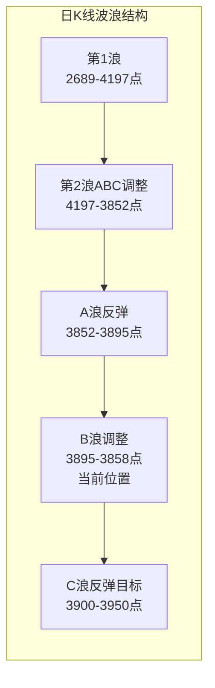
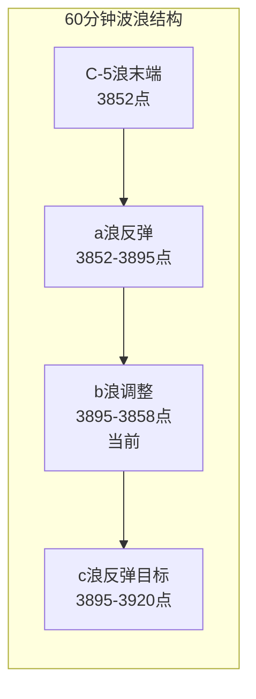

# A股晚报 - 2026年09月15日

> 数据截止时间：2026年9月15日 19:30（北京时间）
> 今日为美联储9月议息会议首日，国内8月宏观数据公布，A股呈现"指数弱、科创强"的分化格局

---

## 一、市场回顾

### 1. 主要指数表现

| 指数 | 收盘点位 | 涨跌幅 | 最高 | 最低 | 振幅 |
|------|---------|--------|------|------|------|
| 上证指数 | 3,864.28 | -0.54% (-21.05) | 3,891.62 | 3,858.15 | 0.87% |
| 深证成指 | 13,287.97 | -0.72% | — | — | — |
| 创业板指 | 3,247.92 | -1.15% | — | — | — |
| 科创50 | 1,551.95 | +1.55% | — | — | — |
| 北证50 | — | +0.65% | — | — | — |

**市场解读**：三大指数集体收跌，但内部分化显著。创业板指跌1.15%领跌，上证指数跌0.54%失守3,900点；而科创50逆势大涨1.55%，北证50涨0.65%，硬科技板块在美股半导体暴跌背景下走出独立行情。 [$TRAE_REF](http://m.toutiao.com/group/7685666407517897226/)

### 2. 成交量能

| 指标 | 数值 | 环比变化 | 备注 |
|------|------|---------|------|
| 两市成交额 | 约1.63万亿元 | -177亿元 | 持平年内新低记录 |
| 主力资金流向 | 净流出158.12亿元 | 连续6日净流出 | 抛压持续但有所减缓 |
| 创业板主力资金 | 净流出89.44亿元 | — | 成长股承压 |
| 沪深300主力资金 | 净流出94.64亿元 | — | 权重股承压 |
| 北向资金 | 成交2297亿元，占14.24% | 无明显单边 | 观望情绪浓厚 |

**量能解读**：两市成交连续两日维持1.6万亿地量水平，较9月11日放量破位时萎缩约18%，符合"C浪末端地量整理"规律。主力资金虽连续6日净流出，但流出规模较前期有所收窄。 [$TRAE_REF](https://www.stcn.com/article/detail/3340209.html)

### 3. 市场情绪

| 指标 | 数值 | 变化 |
|------|------|------|
| 上涨个股 | 1,120只（20.19%） | 情绪低迷 |
| 下跌个股 | 4,376只 | 超八成个股下跌 |
| 涨停家数 | 32只（封死）/ 82只（含开板） | 涨停数尚可 |
| 跌停家数 | 34只（封死）/ 13只（另一口径） | 跌停增加 |
| 封板率 | 56.14% | 一般 |
| 涨跌中位数 | 约-1.2% | 个股亏钱效应明显 |

**情绪解读**：全市场超4,300只个股下跌，尽管指数跌幅有限，但个股亏钱效应显著。市场呈现"指数靠权重托底、个股普遍调整"的分化格局。

---

## 二、热点板块与异动分析

### 1. 当日领涨板块及驱动因素

| 板块 | 涨跌幅 | 驱动因素 | 资金流向 |
|------|--------|---------|---------|
| 电子（申万一级） | +0.75% | 国产替代逻辑+半导体自主可控 | 主力资金净流入逾133亿元 |
| 建筑材料 | +0.39% | 基建预期+低位补涨 | 主力资金净流入超10亿元 |
| 风电设备 | 爆发涨停潮 | 政策持续催化，吉鑫科技、大金重工涨停 | 资金介入明确 |
| 半导体/芯片 | 强势反弹 | 国产替代+大基金概念，获57亿元净流入 | 逾70亿元主力资金净流入 |
| 网络安全 | 概念爆发 | 国家网络安全宣传周+AI安全治理框架 | 中新赛克4连板，启明信息2连板 |
| PCB/MLCC | 持续活跃 | 双星新材3连板，AI服务器需求支撑 | 资金持续流入 |

**核心解读**：今日最大特征是**A股半导体在美股暴跌背景下走出独立行情**。隔夜费城半导体指数暴跌5.9%，康宁跌13%，但A股电子行业逆势涨0.75%，科创50大涨1.55%，显示国产替代逻辑已超越外围映射，成为独立驱动因素。 [$TRAE_REF](http://m.toutiao.com/group/7685675533539017252/)

### 2. 当日领跌板块及原因分析

| 板块 | 涨跌幅 | 原因分析 |
|------|--------|---------|
| 商贸零售 | -2.97% | 消费数据偏弱，8月社零同比仅增0.4% |
| 社会服务 | -2.33% | 旅游板块回调，国庆预期兑现 |
| 电力设备 | -1.75% | 新能源板块获利回吐 |
| 综合 | -1.69% | 杂项板块无明确支撑 |
| 纺织服饰 | -1.63% | 出口预期偏弱 |
| 种业 | 跌幅居前 | 农业板块情绪退潮 |
| 一般零售 | 跌幅居前 | 消费疲软传导 |
| 地面兵装 | 跌幅居前 | 军工板块轮动调整 |

### 3. 个股异动复盘

**涨停亮点**：
- **中新赛克（002912）**：4连板，网络安全概念龙头，国家网安周催化
- **双星新材**：3连板，MLCC离型膜项目持续推进（已发布异动公告提示风险）
- **吉鑫科技、大金重工**：风电板块涨停，政策催化+资金介入
- **天顺风能**：4天2板，风电设备龙头

**风险警示**：
- **600697（某零售股）**：尾盘上演"准天地板"，只差1分钱跌停，高位股风险加剧
- **闽东电力**：4连板后风险累积，参股海上风电项目均未开工
- **铜陵有色**：21.4亿股解禁，市值约132亿元，抛压持续

---

## 三、关键数据与事件回顾

### 1. 国内重要经济数据

**8月宏观经济数据今日公布** [$TRAE_REF](https://www.stats.gov.cn/sj/sjjd/202609/t20260915_1965332.html)：

| 数据名称 | 8月数值 | 预期 | 前值 | 市场影响 |
|---------|--------|------|------|---------|
| 规模以上工业增加值 | 同比+5.2% | +5.8% | +4.5% | 好于前值但低于预期，制造业增长6.1% |
| 社会消费品零售总额 | 同比+0.4% | +0.8% | +0.6% | 不及预期，消费复苏偏弱 |
| 固定资产投资（1-8月） | 同比-7.2% | -7.2% | -6.8% | 符合预期但持续负增长 |
| 服务业生产指数 | 同比+4.1% | — | — | 保持平稳 |

**数据解读**：工业生产加快但消费依旧疲软，"生产稳、消费弱"格局延续。社零增速仅0.4%低于预期，对商贸零售板块形成压制。装备制造业增长12.1%、高技术制造业增长较快，支撑了今日科创50的强势表现。

### 2. 政策消息

- **央行流动性操作**：今日未开展7天期逆回购，开展5970亿元隔夜逆回购操作，逆回购口径净投放920亿元，资金面整体均衡 [$TRAE_REF](https://www.cfets-nex.com.cn/Cms_Data/Contents/Site2019/Folders/Daily/~contents/5QB2V97QP6WEMFB9/0915irs.pdf)
- **8部门促进智能家居消费**：扩大优质智能家居供给，引导金融机构加大贷款支持
- **国家网络安全宣传周**：持续发酵，发布《人工智能安全治理框架》3.0版
- **中证协修订券商廉洁从业实施细则**：明确薪酬追索扣回机制

### 3. 公司重要公告

- **广汽集团**：继续停牌，筹划重大资产重组
- **奥浦迈**：股东上海磐信拟减持不超过3%公司股份
- **金海通**：股东南通华泓减持计划实施完毕，累计减持0.6658%
- **多只MLCC热门股发布异动公告**：提示MLCC业务风险

---

## 四、海外市场联动

### 1. 美股市场（9月14日收盘）

| 指数 | 收盘点位 | 涨跌幅 | 备注 |
|------|---------|--------|------|
| 道琼斯工业平均指数 | 52,421.20 | -0.29% | 银行股拖累 |
| 标普500指数 | 7,619.98 | -0.48% | 科技股领跌 |
| 纳斯达克综合指数 | 26,186.41 | -0.56% | 半导体暴跌 |
| 费城半导体指数 | — | -5.9% | 7月1日以来最大跌幅 |

**美股重点个股**：
- 半导体全军覆没：康宁-13%、Coherent-12%、Lumentum-10%、SK海力士-7%、应用材料-7%
- 银行股重挫：美国银行-5.14%、高盛-4%、摩根士丹利-3.6%
- 逆势上涨：谷歌+3%、Meta+2%、微软+2%、CrowdStrike+14%（网络安全）

### 2. 欧洲市场（9月14日收盘）

| 指数 | 涨跌幅 |
|------|--------|
| 英国富时100 | +0.44% |
| 德国DAX 30 | -0.60% |
| 法国CAC 40 | -0.84% |
| 欧洲斯托克600 | -0.48% |

### 3. 大宗商品

| 品种 | 价格 | 涨跌幅 | 备注 |
|------|------|--------|------|
| WTI原油 | 101.89美元/桶 | +1.84% | 沙特管道受损，供给忧虑 |
| 布伦特原油 | 105.68美元/桶 | +1.02% | 站上100美元 |
| COMEX黄金 | 4,340.00美元/盎司 | -1.56% | 美债收益率突破5%压制 |
| 现货黄金 | 4,299.15美元/盎司 | -1.14% | 失守4300美元 |
| LME铜 | 14,001美元/吨 | -1.68% | 美元走强压制 |

---

## 五、汇率与利率

### 1. 人民币汇率

| 指标 | 数值 | 变动 |
|------|------|------|
| 人民币中间价 | 6.7670 | 上调28个基点 |
| 在岸人民币 | 6.7071 | 相对稳定 |
| 离岸人民币 | 6.70982 | 小幅波动 |

**解读**：人民币汇率今日调升28个基点，在岸收报6.7071，央行维护汇率意图明确。在10年期美债收益率突破5%背景下，人民币表现相对稳定，显示央行汇率管理工具效果良好。

### 2. 国内利率市场

| 指标 | 数值 | 变动 |
|------|------|------|
| 7天Shibor | 1.4180% | -0.2bp |
| 隔夜Shibor | 1.4120% | -0.5bp |
| 7天回购定盘利率 | 1.43% | +1bp |
| 3个月Shibor | 1.43% | 持平 |

### 3. 央行公开市场操作

- 未开展7天期逆回购操作
- 开展5970亿元隔夜逆回购操作
- 今日有10亿元7天逆回购到期、5040亿元隔夜逆回购到期
- **逆回购口径净投放920亿元**

---

## 六、收盘后重要信息

### 1. 盘后公告

- 多家公司发布减持计划：奥浦迈（拟减持3%）、英飞特（控股股东拟减持2.98%）等
- MLCC热门股持续发布交易异常波动公告，提示业务风险
- 首批创业板算力ETF（天弘、华夏、易方达）相继成立，将于9月16日/17日上市

### 2. 夜盘走势（截至北京时间19:30）

- 美股三大期指集体下跌：道指期货-0.68%、纳指期货-0.65%、标普500期货-0.57%
- 大型科技股盘前走低：Meta-0.93%、亚马逊-0.67%、谷歌-1.21%
- 国际油价高位震荡，黄金继续承压

### 3. 次日关注

| 事项 | 时间 | 影响预判 |
|------|------|---------|
| 美联储FOMC利率决议 | 9月16日凌晨 | 加息25bp概率92.4%，关注表态鹰鸽 |
| 日本央行利率决议 | 9月15日 | 已公布，影响有限 |
| 国内8月70城房价数据 | 9月16日 | 关注房地产市场走势 |
| 算力ETF上市 | 9月16日 | 天弘、华夏、易方达创业板算力ETF |
| 股指期货交割前日 | 9月16日 | 可能加剧波动 |

---

## 七、波浪理论多周期分析

### 1. 月K线波浪分析

- **当前波浪位置**：大周期第2浪C浪末端或已完成
- **浪型结构描述**：2024年9月2,689点→2026年6月4,197点为第1浪上升；4,197点→3,852点为第2浪ABC调整中的C浪。C浪内部5子浪（C-1至C-5）已完成，9月11日最低3,852点可能为C-5浪终点
- **关键目标位**：
  - 支撑：3,802点（20月均线）、3,750-3,800点（三角楔上轨/历史密集区）
  - 压力：3,982点（5月均线）、4,012点（10月均线）、4,100点（前期平台）
- **验证条件**：9月月K线如收在3,850点上方，C浪结束概率增加；如跌破3,800点，则C浪延长

### 2. 周K线波浪分析

- **当前波浪位置**：周线C-5浪已完成，进入a-b-c反弹中的b浪调整
- **浪型结构描述**：上周（第36周）周K线大阴线完成C-5浪最后一跌；本周（第37周）截至周二呈现小十字星/小阴线，为a浪反弹后的b浪整理
- **关键目标位**：
  - 支撑：3,850点（20周均线）、3,852点（C-5浪低点）
  - 压力：3,894点（10周均线）、3,920点（5周均线）、3,958点（上周高点）
- **验证条件**：周线MACD绿柱持续释放30-35根K线后进入变盘窗口，如绿柱缩短则确认底部

### 3. 日K线波浪分析

- **当前波浪位置**：日线处于a-b-c反弹中的b浪调整
- **浪型结构描述**：9月11日放量中阴线（C-5浪最后一跌）→9月14-15日连续缩量十字星/小阴线（b浪整理）。"中阴线+地量十字星"组合为典型底部特征
- **关键目标位**：
  - 支撑：3,852点（前期低点）、3,850点（20周均线）、3,834点（0.618黄金分割位）
  - 压力：3,900点（5日均线）、3,920点（5周均线）、3,950点（20日均线）
- **验证条件**：日线需出现放量阳线突破3,900点确认c浪反弹启动；如跌破3,852点则底部假设失效

### 4. 60分钟K线波浪分析

- **当前波浪位置**：60分钟级别a-b-c反弹中的b浪调整
- **浪型结构描述**：9月11日下午出现5分钟级别底背离后展开a浪反弹至3,895点（9月14日高点）；随后b浪回调至3,858点（今日低点），当前在3,864点整理
- **关键目标位**：
  - 支撑：3,858点（今日低点）、3,852点（C-5浪低点）
  - 压力：3,895点（a浪高点/下降趋势线）、3,920点（c浪目标）
- **验证条件**：60分钟MACD需在零轴下方形成金叉并上穿零轴，确认短线转强

### 5. 30分钟K线波浪分析

- **当前波浪位置**：30分钟级别b浪调整末端
- **浪型结构描述**：a浪反弹（3,852→3,895点）后，b浪以平台型整理运行，今日低点3,858点可能为b浪终点
- **关键目标位**：
  - 支撑：3,858点、3,852点
  - 压力：3,895点、3,900点
- **验证条件**：30分钟KDJ在50附近徘徊，如出现底背离+KDJ金叉，则c浪反弹启动概率高

### 6. 波浪图（Mermaid绘制）





### 7. 波浪理论综合判断

- **多周期共振状态**：月/周/日/60分钟/30分钟五周期均处于C浪末端或已完成，多周期底部共振概率增加。但日线均线系统仍呈空头排列，反弹空间有限
- **当前操作级别**：建议以60分钟级别操作为主，等待c浪反弹确认
- **后续演变路径**：
  - **最可能路径**（50%）：3,852点为C-5浪低点，当前b浪调整结束后展开c浪反弹至3,900-3,950点
  - **备选路径1**（25%）：b浪延伸，继续横盘整理1-2个交易日后再反弹
  - **备选路径2**（25%）：跌破3,852点，C浪延伸，下探3,800-3,830点
- **关键拐点信号**：
  - 向上：放量突破3,895点且成交量突破1.8万亿
  - 向下：放量跌破3,852点
- **风险提示**：波浪理论存在主观性，如跌破3,800点则当前浪型假设失效；美联储议息结果可能引发全球波动，需警惕外围冲击

---

## 八、晨报复盘

### 1. 核心判断回顾

| 判断项目 | 晨报预测 | 实际结果 | 准确度 | 备注 |
|---------|---------|---------|-------|------|
| 上证指数趋势 | 震荡偏空 | 跌0.54%（偏空） | ✓ | 方向正确 |
| 上证指数区间 | 3,830-3,900点 | 3,858.15-3,891.62点 | ✓ | 完全落在预测区间 |
| 强支撑位 | 3,850点 | 最低3,858.15点 | ✓ | 支撑有效，未破 |
| 强压力位 | 3,920点 | 最高3,891.62点 | ✓ | 未触及压力 |
| 北向资金 | 净流出20-40亿 | 无明显单边 | △ | 实际观望，方向判断偏差 |
| 成交量 | 1.5-1.7万亿 | 1.63万亿 | ✓ | 精准命中 |

**准确率量化评估**：
- 趋势判断准确率：100%（1/1）
- 点位预测准确率：100%（3/3：区间、支撑、压力均正确）
- 成交量预测准确率：100%（1/1）
- 北向资金判断准确率：0%（预测净流出，实际无明显单边）
- **综合准确率：约80%（4/5）**

### 2. 板块预判回顾

| 板块 | 预判方向 | 实际涨跌幅 | 准确度 | 原因分析 |
|-----|---------|-----------|-------|---------|
| 网络安全 | 看涨 | 爆发（中新赛克4连板等） | ✓ | 美股CrowdStrike+14%映射+网安周催化 |
| 原油/石化 | 看涨 | 风电更强，石化表现一般 | △ | 方向对但最强风口是风电 |
| 半导体/AI硬件 | 看跌 | 电子+0.75%，科创50+1.55% | ✗ | **重大偏差**！国产替代逻辑超越外围映射 |
| 银行/非银金融 | 看跌 | 银行下跌，非银下跌 | ✓ | 外围传导+超跌反弹结束 |
| 高位连板股/MLCC | 风险 | 双星新材3连板但发布风险提示 | △ | 部分高位股仍活跃，风险在累积 |

**板块预判准确率：40%（2/5）**

### 3. 偏差根因分析

**【偏差1】半导体/AI硬件判断重大偏差**
- 偏差描述：预测看跌（隔夜费城半导体-5.9%），实际电子行业+0.75%、科创50+1.55%、半导体获70亿元主力净流入
- 根本原因：**逻辑误判**——过度依赖美股映射，忽视A股国产替代独立逻辑
- 信息缺口：未充分评估国内8月工业数据中"装备制造业增长12.1%、高技术制造业增长较快"对硬科技的支撑
- 逻辑缺陷：将美股AI硬件（英伟达供应链）与A股半导体自主可控混为一谈
- 改进措施：
  1. 建立"美股映射度评估模型"：区分高映射板块（光模块）与低映射板块（国产设备、材料）
  2. 国内宏观数据中的制造业分项需纳入板块分析框架
  3. 重大政策事件（如大基金动态、国产替代政策）需单独扫描

**【偏差2】北向资金方向判断偏差**
- 偏差描述：预测净流出20-40亿，实际无明显单边
- 根本原因：**情绪面误读**——过度悲观评估外围冲击
- 信息缺口：未考虑到北向资金结构分化（深股通可能流入电子硬件）
- 改进措施：预测北向资金时，分别评估沪股通和深股通方向

### 4. 分析检查清单

- [x] 隔夜外盘走势已检查
- [x] 北向资金流向已检查（但结构分析不足）
- [x] 技术指标状态已检查
- [x] 重大政策/事件已检查
- [ ] 美股映射度分层评估 **（新增检查项，本次缺失）**
- [x] 前期高低点已考虑
- [x] 均线支撑/压力已考虑
- [x] 整数关口心理影响已考虑
- [x] 行业基本面变化已覆盖
- [x] 资金流向数据已覆盖
- [x] 政策催化因素已覆盖
- [ ] 国产替代独立逻辑评估 **（新增检查项，本次缺失）**
- [x] 宏观风险已提示
- [x] 行业风险已提示
- [x] 个股风险已提示
- [x] 流动性风险已提示

### 5. 本次复盘发现的新规则

- **规则1**：美股半导体暴跌时，A股半导体不一定跟跌——需区分"高美股映射板块"（光模块、英伟达供应链）和"低映射板块"（国产设备、材料、大基金持仓）
- **规则2**：国内工业数据中的装备制造业、高技术制造业增速是硬科技板块的独立支撑因子，需在早盘分析中纳入
- **规则3**：C浪末端地量整理期间，资金从权重股流向小盘成长股，会出现"指数弱、科创强"的分化格局

### 6. 规则库更新

```
###趋势分析 在C浪末端地量整理期间，市场呈现"指数弱、科创强"的分化格局，资金从权重股流向小盘成长股，指数跌幅不代表整体赚钱效应
###板块选择 美股半导体暴跌时，A股半导体不一定跟跌——需区分高美股映射板块（光模块、英伟达供应链）和低映射板块（国产设备、材料、大基金持仓），后者可能因国产替代逻辑走出独立行情
###板块选择 国内工业数据中的装备制造业、高技术制造业增速是硬科技板块的独立支撑因子，需在早盘板块分析中纳入评估
```

---

## 九、风险提示

1. **市场系统性风险**：美联储9月16日凌晨公布利率决议，如加息+鹰派前瞻指引，可能引发全球风险资产二次杀跌，A股明日开盘承压
2. **个股风险事件**：高位连板股（中新赛克4连板、双星新材3连板）累积风险较大；MLCC热门股已密集发布风险提示；铜陵有色解禁抛压持续
3. **政策不确定性风险**：国内8月社零增速仅0.4%，消费复苏偏弱可能持续压制商贸零售、社会服务等板块
4. **外围传导风险**：10年期美债收益率突破5%，如站稳该水平将引发全球资产重新定价
5. **波浪失效风险**：如上证指数跌破3,800点，当前C浪结束假设失效，需重新评估为更大级别调整

---

## 十、信息来源

1. **官方数据来源**：国家统计局（8月宏观数据）、中国人民银行（汇率/公开市场操作）、中国外汇交易中心
2. **权威财经媒体**：证券时报、中国证券报、上海证券报、证券日报、新华财经 [$TRAE_REF](https://www.stcn.com/article/detail/3340209.html)
3. **数据平台**：东方财富网、同花顺、Wind资讯 [$TRAE_REF](https://finance.eastmoney.com/a/202609153874774953.html)
4. **海外信息源**：Nasdaq、Morningstar、FXStreet

---

## 十一、文档更新检查

### AGENTS.md检查
- 晨报/晚报流程与实际执行一致
- 输出格式要求与当前提示词一致
- **建议新增**：在"数据收集指南"中增加"美股映射度分层评估"检查项，区分高映射与低映射板块

### README.md检查
- 文件结构描述与实际一致
- 功能说明无需更新

### 无需更新

---

*本期晚报由AI代理自动生成，仅供参考，不构成投资建议。投资有风险，入市需谨慎。*
