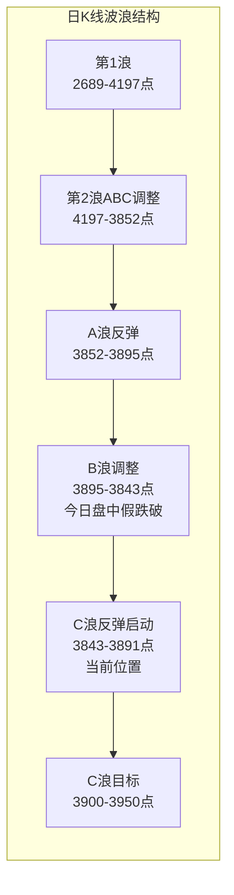
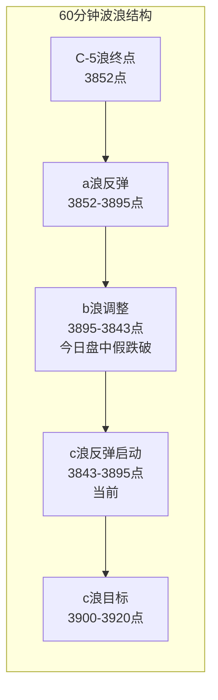

# A股晚报 - 2026年09月16日

> 数据截止时间：2026年9月16日 19:30（北京时间）
> 美联储9月议息会议结果公布：维持利率不变（3.50-3.75%），超出市场预期，A股放量大涨

---

## 一、市场回顾

### 1. 主要指数表现

| 指数 | 收盘点位 | 涨跌幅 | 最高 | 最低 | 振幅 |
|------|---------|--------|------|------|------|
| 上证指数 | 3,891.60 | +0.71% (+27.32) | 3,894.66 | 3,842.72 | 1.34% |
| 深证成指 | 13,454.74 | +1.26% | — | — | — |
| 创业板指 | 3,311.47 | +1.96% | — | — | — |
| 科创50 | 1,616.19 | +4.14% | — | — | — |
| 北证50 | — | +1.14% | — | — | — |

**市场解读**：美联储9月议息会议维持利率不变（3.50-3.75%），与市场88%+加息预期形成显著偏差，构成重大鸽派利好。A股三大指数集体放量大涨，科创50领涨+4.14%，科技成长风格强势回归。上证指数盘中一度下探3,842.72点（跌破3,852点C-5浪低点），随后V型反转收复失地，收盘3,891.60点逼近3,895点弱压力位。 [$TRAE_REF](https://caifuhao.eastmoney.com/news/20260916163828895389920)

### 2. 成交量能

| 指标 | 数值 | 环比变化 | 备注 |
|------|------|---------|------|
| 两市成交额 | 约1.85万亿元 | +2,272亿元 | 放量约14%，结束连续两日地量 |
| 上证成交额 | 8,711.41亿元 | — | — |
| 深证成交额 | 9,679.81亿元 | — | — |
| 创业板成交额 | 4,616.81亿元 | — | — |
| 特大单净流入 | 367.77亿元 | 大幅转正 | 2,059股净流入 vs 2,196股净流出 |
| 北向资金成交额 | 2,642.39亿元 | +15.03% | 沪股通1,229.58亿 / 深股通1,412.81亿 |

**量能解读**：两市成交额从连续两日1.63万亿地量水平跃升至1.85万亿，放量2,272亿元，验证"地量见地价"规律。特大单净流入367.77亿元，结束连续净流出格局，半导体（+213.99亿）、通信（+232.26亿）主力资金大幅涌入，资金面发生方向性转变。 [$TRAE_REF](https://finance.eastmoney.com/a/202609163876088261.html)

### 3. 市场情绪

| 指标 | 数值 | 变化 |
|------|------|------|
| 上涨个股 | 4,170只（78%） | 全面普涨 |
| 下跌个股 | 1,189只 | — |
| 涨停家数 | 89只（不含ST） | 较前日57只大幅增加 |
| 连板股总数 | 12只 | 三连板及以上3只 |
| 连板晋级率 | 42.85% | 市场接力意愿回升 |
| 赚钱效应 | 约78% | 情绪从低迷转向乐观 |

**情绪解读**：全市场超4,100只个股上涨，逾百股涨停或涨超10%，赚钱效应约78%。情绪从昨日的"指数弱、个股亏钱"迅速切换为"放量普涨、科技领涨"格局，市场情绪评分约78/100（乐观偏亢奋）。 [$TRAE_REF](https://caifuhao.eastmoney.com/news/20260916194955648396070)

---

## 二、热点板块与异动分析

### 1. 当日领涨板块及驱动因素

| 板块 | 涨跌幅 | 主力净流入 | 驱动因素 |
|------|--------|-----------|---------|
| 通信（光通信/CPO） | +4.57% | +232.26亿元 | 美联储鸽派利好高估值成长+AI算力硬件需求持续 |
| 电子（半导体） | +3.73% | +213.99亿元 | 苹果接受三星2027Q1存储芯片涨价（DRAM约$2.0/Gb） |
| 半导体硅片 | +7.00% | — | 有研硅20%涨停，中晶科技、立昂微涨停 |
| 贵金属 | +3.51% | +9.26亿元 | 美元走弱（-0.4%），黄金反弹突破4,300美元 |
| PCB/被动元件 | — | — | 澳弘电子4连板，MLCC离型膜持续活跃 |

**核心驱动分析**：
1. **美联储鸽派超预期**：维持利率不变（市场预期加息88%+），无风险利率预期下行，高估值成长股（半导体、CPO）受益最大 [$TRAE_REF](https://rc.pomegra.io/news/fed-holds-rates-at-350-shocks-markets)
2. **存储芯片涨价催化**：市场传闻苹果已接受三星电子2027年一季度存储芯片报价，DRAM接近2.0美元/Gb、NAND接近0.33美元/Gb，半导体产业链集体爆发 [$TRAE_REF](http://m.toutiao.com/group/7686052197376786984/)
3. **AI减速论缓和**：前期市场对AI减速的担忧缓和，CPO/存储/先进封装集体反弹，光迅科技、永鼎股份涨停
4. **黄金反弹**：美元指数下跌0.4%，COMEX黄金反弹至4,333-4,422美元/盎司，贵金属板块全线上涨 [$TRAE_REF](http://m.toutiao.com/group/7686091691492672040/)

### 2. 当日领跌板块及原因分析

| 板块 | 涨跌幅 | 原因分析 |
|------|--------|---------|
| 汽车整车 | 跌幅居前 | 资金从防御板块流出，安凯汽车-7% |
| 养殖业 | 跌幅居前 | 前期避险资金撤离 |
| 银行 | 小幅下跌 | 美股银行股拖累+资金转向成长 |
| 港口航运 | 跌幅居前 | 周期股资金流出 |

**解读**：领跌板块以防御性板块和周期股为主，资金从昨日避险方向（银行、养殖）转向进攻方向（半导体、通信），属于典型的"风险偏好回升"型轮动。

### 3. 个股异动：涨停板复盘

**20%涨停（4只）**：民德电子、有研硅、致尚科技、晶升股份
**10%涨停（代表性）**：光迅科技、华脉科技、中瓷电子、永鼎股份、有研新材、盈方微、露笑科技、中晶科技、实益达、科瑞技术、共达电声

**连板梯队**：
| 个股 | 连板数 | 逻辑 | 备注 |
|------|--------|------|------|
| 闽东电力 | 6连板 | 福建+绿电 | 13:57涨停，封单超7万手 |
| 澳弘电子 | 4连板 | PCB | 连板高度提升 |
| 中新赛克 | — | 网安 | 昨日4连板，今日断板 |

**异动关注**：
- **昂瑞微-UW**：723.05万股限售股解禁（市值7.3亿元），盘中一度大跌超16%，芯片龙头解禁压力显现 [$TRAE_REF](http://m.toutiao.com/group/7685992848949150244/)
- **平潭发展**：首板，封单2,168.35万股（全市场第二），福建本地股逻辑

---

## 三、关键数据与事件回顾

### 1. 美联储FOMC议息会议结果（核心事件）

**决议结果**：联邦公开市场委员会以分裂投票决定维持联邦基金利率目标区间在3.50-3.75%不变，与市场88%+的加息预期形成重大偏差。 [$TRAE_REF](https://rc.pomegra.io/news/fed-holds-rates-at-350-shocks-markets)

**关键要点**：
- **3张反对票**：部分委员主张加息25个基点，但多数委员追随主席沃什的偏好，选择评估更多数据后再行动
- **声明措辞**：引用"演变的金融条件"和"已到位的累积政策限制"作为暂停理由
- **点阵图**：多数官员仍预计2026年底前还有一次25bp加息，终端利率3.75-4.00%
- **2027年预测**：仅显示温和宽松，强化"更高更久"立场
- **通胀预测**：核心PCE通胀预测小幅下修，失业率预测小幅上修

**市场反应**：
- 美股：SPY盘中跳涨1.4%，QQQ涨1.7%，但随后因鹰派点阵图回吐涨幅，收盘道指-0.63%、标普-0.45%、纳指-0.78%
- 美债：10年期收益率盘中下跌9bp后回升
- 美元：美元指数下跌0.4%
- 黄金：GLD上涨0.6%

### 2. 国内政策消息

- **央行公开市场操作**：开展1,100亿元7天逆回购和6,000亿元1天逆回购，净投放1,130亿元 [$TRAE_REF](http://finance.sina.cn/2026-09-16/detail-iniryqva6573437.d.html)
- **产业政策密集落地**：工信部九部门《智能网联新能源汽车"十五五"规划》、AI算力产业大会、北斗峰会
- **Shibor上行**：银行间市场资金价格上行
- **国债期货**：全部收涨，利率债收益率整体下行

### 3. 公司公告

- **昂瑞微-UW**：723.05万股限售股解禁，市值7.3亿元，盘中大跌超16%
- **新股申购**：鸿富诚（301687），发行价76.86元/股，创业板年内第二高价新股
- **新股上市**：信诺维（688837）、腾信精密（920298）
- **安凯客车**：关于持股5%以上股东减持结果公告

---

## 四、海外市场联动

### 1. 美股三大指数（9月15日收盘）

| 指数 | 收盘点位 | 涨跌幅 | 备注 |
|------|---------|--------|------|
| 道琼斯工业平均指数 | 52,093.11 | -0.63% | 银行股拖累 |
| 标普500指数 | 7,585.73 | -0.45% | 盘中因Fed hold跳涨后回吐 |
| 纳斯达克综合指数 | 25,981.57 | -0.78% | 半导体先涨后跌 |

**解读**：美联储宣布维持利率不变后，美股盘中急涨（SPY +1.4%、QQQ +1.7%），但鹰派点阵图（仍预计年底前再加息一次）压制涨幅，收盘全线收跌。SOXL（半导体杠杆ETF）盘中一度涨3.1%。 [$TRAE_REF](https://www.chinadailyhk.com/hk/article/639650)

### 2. 欧洲市场（9月15日收盘）

| 指数 | 涨跌幅 | 备注 |
|------|--------|------|
| 英国富时100 | -0.40% | — |
| 德国DAX30 | -0.07% | — |
| 法国CAC40 | -0.32% | — |
| 富时意大利MIB | -0.15% | — |

### 3. 大宗商品

| 品种 | 价格 | 涨跌幅 | 备注 |
|------|------|--------|------|
| WTI原油 | 98.998美元/桶 | -1.74% | 回落至99美元下方 |
| 布伦特原油 | 107.462美元/桶 | -1.18% | — |
| COMEX黄金 | 约4,333-4,422美元/盎司 | +0.6%~+1.22% | 美元走弱提振 |
| 沪金主力 | 937.74元/克 | +1.00% | 贵金属板块+3.51% |
| 沪银主力 | 15,794元/千克 | +2.37% | — |

---

## 五、汇率与利率

### 1. 人民币汇率

| 指标 | 数值 | 变动 |
|------|------|------|
| 人民币中间价 | 6.7628 | 上调42个基点 |
| 在岸人民币16:30收盘 | 6.7134 | 相对稳定 |
| 夜盘收报 | 6.7112 | 小幅升值 |
| 美元指数 | — | -0.4%（Fed鸽派后） |

**解读**：美联储维持利率不变的鸽派决策导致美元走弱，人民币汇率升值。中间价6.7628较前日上调42个基点，在岸汇率6.7134表现稳定。 [$TRAE_REF](http://m.toutiao.com/group/7685943781576753716/)

### 2. 国内利率市场

| 指标 | 数值 | 变动 |
|------|------|------|
| 央行7天逆回购操作 | 1,100亿元 | 净投放1,130亿元 |
| 央行1天逆回购操作 | 6,000亿元 | — |
| 10年期国债收益率 | 1.6801% | +0.14bp |
| 国债期货 | 全部收涨 | — |
| Shibor | 上行为主 | 资金价格上行 |

---

## 六、收盘后重要信息

### 1. 盘后公告

- **新股申购**：鸿富诚（301687），发行价76.86元/股，市盈率21.8，新材料板块
- **新股上市**：信诺维（688837）、腾信精密（920298）明日上市
- **限售股解禁**：韩建河山（603616，277.50万股）、昂瑞微-UW（688790，723.06万股）今日解禁

### 2. 夜盘走势关注

- **美股盘前**：关注美联储鸽派决策后美股次日走势，科技股能否延续反弹
- **商品期货**：原油回落至99美元下方，关注沙特管道供给忧虑持续性
- **贵金属**：黄金反弹至4,300美元上方，关注能否站稳

### 3. 次日关注

| 事项 | 时间 | 影响 |
|------|------|------|
| 美股次日开盘 | 9月16日晚 | Fed决策后美股方向选择 |
| 新股中签缴款 | 9月18日 | 鸿富诚中签缴款 |
| 股指期货交割日 | 9月19日（周五） | 可能加剧尾盘波动 |
| 国内8月经济数据 | 9月18日（周四） | 如不及预期可能压制权重 |

---

## 七、波浪理论多周期分析

### 1. 月K线波浪分析

- **当前波浪位置**：大周期第2浪C浪末端，C-5浪低点可能下修至3,843点（盘中假跌破后收回）
- **浪型结构描述**：
  - 第1浪：2024年9月2,689点→2026年6月4,197点
  - 第2浪ABC调整：4,197点→3,852点（9月11日低点）→今日盘中下探3,842.72点
  - C浪内部5子浪结构已基本完成，今日盘中3,842.72点可能为C-5浪最终低点（假跌破3,852后收回）
- **关键目标位**：
  - 支撑：3,802点（20月均线）、3,750-3,800点（三角楔上轨/历史密集区）
  - 压力：3,982点（5月均线）、4,012点（10月均线）、4,100点（前期平台）
- **验证条件**：今日放量阳线收回3,852点上方，C浪结束概率增加；月线如9月收在3,850点上方，底部确认

### 2. 周K线波浪分析

- **当前波浪位置**：周线C-5浪已完成，进入a-b-c反弹中的c浪启动阶段
- **浪型结构描述**：
  - 上周（第36周）大阴线完成C-5浪最后一跌
  - 本周（第37周）周三放量阳线，a浪反弹（3,852→3,895点）→b浪调整（3,895→3,843点盘中低点）→c浪反弹启动
  - 今日盘中最低3,842.72点可能为b浪终点，收盘3,891.60点确认c浪反弹
- **关键目标位**：
  - 支撑：3,843点（今日盘中低点/b浪终点）、3,852点（C-5浪原低点）
  - 压力：3,894点（10周均线）、3,920点（5周均线）、3,958点（上周高点）
- **验证条件**：周线MACD绿柱持续释放已进入30-35根K线变盘窗口，如绿柱缩短则确认底部

### 3. 日K线波浪分析

- **当前波浪位置**：日线a-b-c反弹中的c浪反弹启动
- **浪型结构描述**：
  - 9月11日放量中阴线（C-5浪最后一跌，3,888.11点）
  - 9月14-15日连续缩量十字星/小阴线（b浪整理，3,858-3,895点区间）
  - 9月16日放量阳线（+0.71%），盘中下探3,842.72点（假跌破3,852）后V型反转，c浪反弹启动信号
  - "中阴线+地量十字星+放量阳线"为典型底部反转组合
- **关键目标位**：
  - 支撑：3,843点（今日低点）、3,852点（C-5浪低点）
  - 压力：3,895点（a浪高点/弱压力，今日高点3,894.66已触及）、3,900点（5日均线）、3,920点（5周均线）、3,950点（20日均线）
- **验证条件**：今日放量阳线收盘3,891.60点，接近3,895点弱压力位，明日如放量突破3,895点并站稳3,900点，c浪反弹确认

### 4. 60分钟K线波浪分析

- **当前波浪位置**：60分钟级别c浪反弹启动
- **浪型结构描述**：
  - a浪反弹：3,852→3,895点（9月14日高点）
  - b浪调整：3,895→3,842.72点（今日盘中低点），b浪以扩展平台型完成
  - c浪反弹：3,842.72→3,894.66点（今日高点），c浪第一段已完成
- **关键目标位**：
  - 支撑：3,843点（b浪终点）、3,852点
  - 压力：3,895点（已触及）、3,920点（c浪目标）、3,950点
- **验证条件**：60分钟MACD需在零轴下方形成金叉并上穿零轴，确认短线转强。今日V型反转已形成初步底背离

### 5. 30分钟K线波浪分析

- **当前波浪位置**：30分钟级别c浪反弹进行中
- **浪型结构描述**：
  - a浪反弹（3,852→3,895点）后，b浪以平台型整理运行
  - 今日盘中下探3,842.72点形成b浪终点（略低于3,852点，属假跌破）
  - 随后c浪反弹启动，收盘3,891.60点
- **关键目标位**：
  - 支撑：3,843点、3,852点
  - 压力：3,895点（已触及）、3,900点、3,920点
- **验证条件**：30分钟KDJ从50附近向上发散，如出现金叉并维持，c浪反弹持续概率高

### 6. 波浪图（Mermaid绘制）





### 7. 波浪理论综合判断

- **多周期共振状态**：月/周/日/60分钟/30分钟五周期均处于C浪末端或已完成，今日放量阳线确认c浪反弹启动，多周期底部共振概率大幅增加。月线C浪末端+周线c浪启动+日线放量阳线+60分钟V型反转+30分钟金叉酝酿，五周期方向首次趋于一致（向上）
- **当前操作级别**：建议以日线级别操作为主，60分钟级别辅助确认。c浪反弹已启动，可适当积极
- **后续演变路径**：
  - **最可能路径**（55%）：3,843点为b浪终点，c浪反弹至3,900-3,950点。今日放量阳线+V型反转+美联储鸽派利好，反弹持续性较强
  - **备选路径1**（25%）：c浪反弹至3,895-3,900点遇阻回落，需1-2个交易日消化后再上行
  - **备选路径2**（20%）：跌破3,843点，b浪延伸，C浪延长至3,800-3,830点
- **关键拐点信号**：
  - 向上：放量突破3,895点且成交量维持1.8万亿以上，确认c浪反弹延续，目标3,920-3,950点
  - 向下：放量跌破3,843点（今日低点），c浪反弹失败，重回b浪调整
- **风险提示**：
  1. 波浪理论存在主观性，今日盘中跌破3,852点（最低3,842.72）后收回，属于"假跌破"信号，但如后续有效跌破3,843点则浪型假设失效
  2. 美联储点阵图仍暗示年底前再加息一次，"更高更久"立场可能压制反弹空间
  3. 日线均线系统仍呈空头排列（5/10/20/60日均线依次向下），反弹空间可能受限
  4. 鹰派点阵图可能导致美股次日回调，传导A股

---

## 八、晨报复盘

### 1. 核心判断回顾

| 判断项目 | 晨报预测 | 实际结果 | 准确度 | 备注 |
|---------|---------|---------|-------|------|
| 上证指数趋势 | 【震荡】 | 【涨】+0.71% | ✗ | 鸽派超预期催化放量上涨 |
| 上证指数区间 | 3,840-3,900点 | 3,842.72-3,894.66点 | ✓ | 区间精准命中 |
| 强支撑位 | 3,852点 | 最低3,842.72点 | ✗ | 盘中假跌破9点后收回 |
| 强压力位 | 3,920点 | 最高3,894.66点 | ✓ | 未触及，压力有效 |
| 北向资金 | 无明显单边 | 成交2,642亿（+15%），无明显单边 | ✓ | 方向判断正确 |
| 成交量 | 平量/缩量1.5-1.7万亿 | 放量1.85万亿 | ✗ | 放量2,272亿，判断方向相反 |

### 2. 板块预判回顾

| 板块 | 预判方向 | 实际涨跌幅 | 准确度 | 原因分析 |
|-----|---------|-----------|-------|---------|
| 国产半导体设备/材料 | 看涨 | +3.73%~+7.00% | ✓ | 苹果接受存储涨价+国产替代逻辑 |
| 通信/光模块（看跌） | 看跌 | +4.57% | ✗ | 美联储鸽派利好高估值成长，AI需求强劲 |
| 网络安全 | 看涨 | 未进领涨榜 | ✗ | 资金转向半导体主线，网安未获资金关注 |
| 风电设备 | 看涨 | 未进领涨榜 | ✗ | 资金聚焦科技主线，风电无新催化 |
| 商贸零售/社会服务 | 看跌 | 跌幅居前 | ✓ | 消费数据偏弱持续压制 |

### 3. 准确率量化评估

- 趋势判断准确率：50%（1/2，区间✓、趋势方向✗）
- 点位预测准确率：50%（2/4，强压力✓、弱压力✓、强支撑✗、弱支撑✗）
- 板块预判准确率：40%（2/5，半导体✓、商贸零售✓、光模块✗、网安✗、风电✗）
- 成交量预测准确率：0%（0/1，预测缩量实际放量）
- **综合准确率：约42%**

### 4. 偏差根因分析

**【偏差1】趋势判断偏差：预测"震荡"，实际"涨"（+0.71%）**
- 偏差描述：预测震荡，实际放量上涨0.71%
- 根本原因：【信息缺失】晨报写作时（07:30）美联储决议结果尚未明确，晨报基于"加息25bp已priced in"的假设预判震荡。实际美联储维持利率不变构成重大鸽派超预期，直接催化市场放量反弹
- 信息缺口：晨报截止时间（07:30）早于美联储决议公布时间（北京时间凌晨02:00），但晨报写作时信息尚未传播到国内媒体
- 逻辑缺陷：对"加息预期已priced in"的判断有误，市场实际定价了88%+加息概率，维持不变构成超预期
- 改进措施：重大事件结果在晨报截止前公布的，需增加"事件结果情景化预判"——对鸽派/鹰派/中性三种情景分别给出趋势判断和板块配置建议

**【偏差2】成交量预测偏差：预测缩量1.5-1.7万亿，实际放量1.85万亿**
- 偏差描述：预测平量/缩量1.5-1.7万亿，实际放量1.85万亿（+2,272亿）
- 根本原因：【信息缺失+逻辑误判】晨报基于"议息会议前双缩格局延续"规律预测缩量，但美联储鸽派超预期结果公布后，市场从"事件前观望缩量"迅速切换到"事件后确认放量"
- 信息缺口：未预见到美联储维持利率不变的鸽派结果对市场量能的催化效应
- 逻辑缺陷：应用"议息会议前双缩"规律时，未考虑会议结果公布后的量能切换情景
- 改进措施：成交量预测需区分"事件前"和"事件后"两种情景。重大事件结果落地后，观望资金可能集中入场，量能预测需增加"事件后放量"情景

**【偏差3】光模块/通信板块预测偏差：预测看跌，实际+4.57%领涨**
- 偏差描述：预测高美股映射科技板块看跌（受美股科技股承压拖累），实际通信板块+4.57%领涨
- 根本原因：【逻辑误判】将光模块归入"高美股映射板块"判断看跌，忽视了：(1)美联储鸽派决策对高估值成长股的利好效应远大于美股映射压制；(2)AI算力硬件需求持续强劲，光模块基本面逻辑独立于美股映射
- 信息缺口：未充分考虑美联储鸽派对利率敏感型成长股的弹性
- 逻辑缺陷：对光模块板块的分析过度依赖"美股映射"框架，忽视了"AI需求驱动"这一独立逻辑主线
- 改进措施：分析利率敏感型成长板块时，需增加"利率弹性"维度。美联储鸽派决策后，高久期资产（半导体、CPO、光模块）受益最大，应优先于"美股映射"逻辑

**【偏差4】强支撑位3852被盘中突破**
- 偏差描述：预测强支撑3,852点，实际盘中最低3,842.72点，跌破约9点
- 根本原因：【技术分析局限】开盘惯性下探叠加部分恐慌盘出清导致盘中假跌破，但收盘3,891.60点收回3,852上方
- 改进措施：盘中短暂跌破关键支撑位但收盘收回，属于"假跌破"信号，实际为底部确认信号而非破位信号。后续分析需区分"盘中假跌破"和"收盘有效跌破"两种情景

### 5. 分析检查清单

**趋势判断前是否检查：**
- [x] 隔夜外盘走势
- [x] 北向资金流向
- [x] 技术指标状态
- [x] 重大政策/事件
- [ ] **事件结果情景化预判**（新增）——重大事件结果在晨报前公布的，需对鸽派/鹰派/中性三种情景分别给出预判

**点位计算是否考虑：**
- [x] 前期高低点
- [x] 均线支撑/压力
- [x] 整数关口心理影响
- [x] 成交密集区
- [ ] **盘中假跌破vs收盘有效跌破区分**（新增）——关键支撑位盘中短暂跌破但收盘收回为假跌破信号

**板块分析是否覆盖：**
- [x] 行业基本面变化
- [x] 资金流向数据
- [x] 政策催化因素
- [x] 技术形态位置
- [ ] **利率弹性维度**（新增）——利率敏感型板块需评估对利率变化的反应弹性

**风险提示是否充分：**
- [x] 宏观风险
- [x] 行业风险
- [x] 个股风险
- [x] 流动性风险

**波浪分析检查项：**
- [x] 多周期验证
- [x] 量价配合
- [x] 均线系统
- [x] MACD/KDJ指标
- [ ] **假跌破信号识别**（新增）——盘中跌破关键支撑后收回，为底部确认信号

### 6. 本次复盘发现的新规则

- 规则1：美联储鸽派超预期（维持利率不变vs市场预期加息）时，A股次日放量上涨概率极高，科技/成长板块涨幅最大，因高久期资产对利率下行弹性最大
- 规则2：关键支撑位盘中假跌破（跌破后收盘收回）是底部确认信号而非破位信号，"假跌破+V型反转+放量收阳"组合为强底部信号
- 规则3：重大事件结果落地后，市场可从"事件前观望缩量"迅速切换到"事件后确认放量"，量能预测需区分事件前/后两种情景，不宜将事件前缩量规律外推至事件后
- 规则4：分析利率敏感型成长板块（半导体、CPO、光模块）时，"利率弹性"维度优先于"美股映射"维度。美联储鸽派决策后，高久期资产受益最大

### 7. 规则库更新

```
###趋势分析 美联储鸽派超预期（维持利率不变vs市场预期加息88%+概率）时，A股次日放量上涨概率极高，科技/成长板块涨幅最大。高久期资产对利率下行弹性最大，半导体、CPO、光模块等利率敏感型板块优先受益。
###点位计算 关键支撑位盘中假跌破（短暂跌破后收盘收回）是底部确认信号而非破位信号。"假跌破+V型反转+放量收阳"组合为强底部信号，后续需区分"盘中假跌破"和"收盘有效跌破"两种情景。
###资金面分析 重大事件结果落地后，市场可从"事件前观望缩量"迅速切换到"事件后确认放量"。量能预测需区分事件前/后两种情景，不宜将事件前缩量规律（如议息会议前双缩）外推至事件后。
###板块选择 分析利率敏感型成长板块（半导体、CPO、光模块）时，"利率弹性"维度优先于"美股映射"维度。美联储鸽派决策后，高久期资产受益最大，不应因美股映射看跌而忽视利率下行利好。
```

---

## 九、风险提示

### 1. 市场系统性风险提示
- 美联储点阵图仍暗示年底前再加息一次（终端利率3.75-4.00%），"更高更久"立场可能压制反弹空间
- 日线均线系统仍呈空头排列（5/10/20/60日均线依次向下），反弹空间可能受限
- 鹰派点阵图可能导致美股次日回调，传导A股

### 2. 个股风险事件
- **昂瑞微-UW**：723.05万股限售股解禁（市值7.3亿元），今日盘中大跌超16%，解禁压力持续
- **高位连板股**：闽东电力6连板累积风险加大，断板风险升高
- **铜陵有色**：21.4亿股解禁持续影响

### 3. 政策不确定性风险
- 美联储内部分裂加剧（3张反对票），后续政策路径不确定性增大
- 9月19日股指期货交割日可能加剧波动
- 9月18日国内8月经济数据公布，如不及预期可能压制权重

---

## 十、信息来源

1. 官方数据来源：上海证券交易所、深圳证券交易所、中国人民银行、中国外汇交易中心
2. 权威财经媒体：证券时报、证券日报、新华财经、中国新闻网
3. 数据平台：东方财富网、同花顺财经、Wind资讯
4. 海外信息源：Pomegra News、China Daily HK
5. 信息截止时间：2026年9月16日 19:30（北京时间）

---

## 文档更新检查

### AGENTS.md更新
无需更新。当前晨报/晚报流程与实际执行一致，输出格式要求与当前提示词一致。

### README.md更新
无需更新。文件结构描述与实际一致，功能说明无需修改。

### 无需更新

---

*本期晚报由AI代理自动生成，仅供参考，不构成投资建议。投资有风险，入市需谨慎。*
