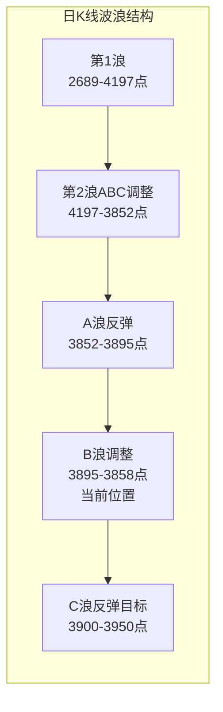
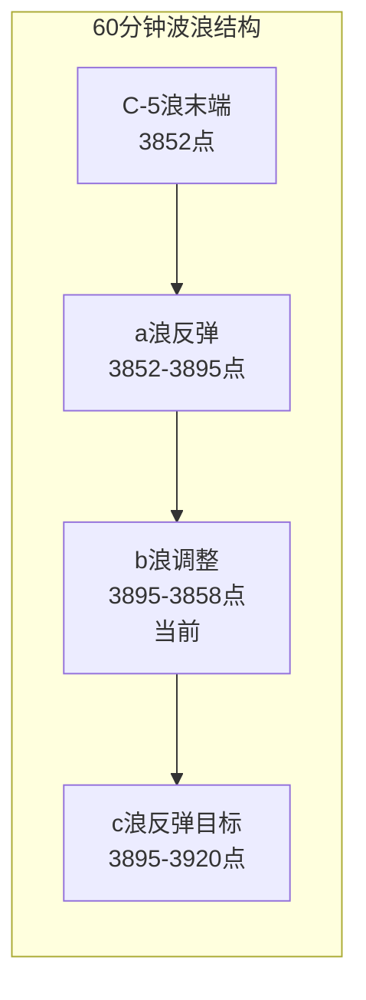

# A股晨报 - 2026年09月16日

> 数据截止时间：2026年9月16日 07:30（北京时间）
> 今日为美联储FOMC利率决议公布日，市场面临关键方向选择

---

## 一、昨日晚报复盘要点回顾

### 1. 昨日判断回顾
- 趋势判断：昨日晨报预测"震荡偏空"，实际跌0.54%，方向正确
- 点位预测：区间3,830-3,900点，实际3,858.15-3,891.62点，完全命中
- 成交量预测：1.5-1.7万亿，实际1.63万亿，精准命中
- **综合准确率：约80%（4/5）**

### 2. 关键偏差及原因
- **偏差1**：半导体/AI硬件判断重大偏差。预测看跌（隔夜费城半导体-5.9%），实际电子行业+0.75%、科创50+1.55%。根本原因：过度依赖美股映射，忽视A股国产替代独立逻辑
- **偏差2**：北向资金方向判断偏差。预测净流出20-40亿，实际无明显单边。原因：过度悲观评估外围冲击，未考虑深股通结构分化

### 3. 沉淀的规则/检查项
- 美股半导体暴跌时，A股半导体不一定跟跌——需区分"高美股映射板块"（光模块、英伟达供应链）和"低映射板块"（国产设备、材料、大基金持仓）
- 国内工业数据中的装备制造业、高技术制造业增速是硬科技板块的独立支撑因子
- C浪末端地量整理期间，资金从权重股流向小盘成长股，会出现"指数弱、科创强"的分化格局

### 4. 对今日分析的启示
- 需建立"美股映射度评估模型"，区分高映射与低映射板块
- 国内宏观数据中的制造业分项需纳入板块分析框架
- 预测北向资金时，应分别评估沪股通和深股通方向

---

## 二、隔夜市场动态（昨日收盘后至今）

### 1. 美股市场（9月15日收盘）

| 指数 | 收盘点位 | 涨跌幅 | 备注 |
|------|---------|--------|------|
| 道琼斯工业平均指数 | 52,093.11 | -0.63% | 银行股拖累 |
| 标普500指数 | 7,585.73 | -0.45% | 科技股承压 |
| 纳斯达克综合指数 | 25,981.57 | -0.78% | 半导体延续弱势 |

**美股重点个股**：
- 大型科技股走低，加密货币概念股下挫（Circle跌超11%、Coinbase跌超...）
- 国际油价飙升，美油涨超4%

### 2. 欧洲市场（9月15日收盘）

| 指数 | 涨跌幅 |
|------|--------|
| 英国富时100 | +0.44% |
| 德国DAX 30 | -0.60% |
| 法国CAC 40 | -0.84% |
| 欧洲斯托克600 | -0.48% |

### 3. 大宗商品

| 品种 | 价格 | 涨跌幅 | 备注 |
|------|------|--------|------|
| WTI原油 | 约106美元/桶 | +4%+ | 美油涨超4%，沙特管道受损供给忧虑 |
| 布伦特原油 | 105.68美元/桶 | +1.02% | 站上100美元 |
| COMEX黄金 | 4,340.00美元/盎司 | -1.56% | 美债收益率突破5%压制 |
| 现货黄金 | 4,299.15美元/盎司 | -1.14% | 失守4300美元 |
| LME铜 | 14,001美元/吨 | -1.68% | 美元走强压制 |

### 4. 汇率与利率

| 指标 | 数值 | 变动 |
|------|------|------|
| 美元指数 | 维持强势 | — |
| 人民币中间价 | 6.7670 | 上调28个基点 |
| 在岸人民币 | 6.7071 | 相对稳定 |
| 离岸人民币 | 6.70982 | 小幅波动 |
| 美债10年期收益率 | 5%+ | 维持在5%上方，30年期一度升至5.402% |

**解读**：10年期美债收益率维持在5%上方，30年期一度升至5.402%为2007年6月以来高点。人民币在央行维护下表现相对稳定。

### 5. 重要海外事件
- **美联储FOMC利率决议**：将于北京时间9月16日凌晨公布（截至发稿前尚未公布），市场预计加息25个基点概率超90%（CME美联储观察工具）
- **美联储主席沃什鹰派立场**：杰克逊霍尔年会后持续释放强硬抗通胀信号，点阵图释放较强"鹰派"信号
- **特朗普发声**：针对美联储政策发表评论

---

## 三、今日关注事项

### 1. 重要数据发布（按时间排序）
- **国内8月70城房价数据**：今日公布，关注房地产市场走势
- **美联储FOMC利率决议**：北京时间9月16日凌晨公布，加息25bp概率超90%，重点关注鲍威尔表态鹰鸽程度

### 2. 政策/监管动态
- 8部门促进智能家居消费政策持续发酵
- 国家网络安全宣传周持续，AI安全治理框架3.0版发布
- 中证协修订券商廉洁从业实施细则

### 3. 公司公告
- **多家公司减持计划**：奥浦迈（拟减持3%）、英飞特（控股股东拟减持2.98%）等
- **MLCC热门股持续发布交易异常波动公告**，提示业务风险
- **铜陵有色**：21.4亿股解禁，市值约132亿元，抛压持续

### 4. 其他关注
- **算力ETF上市**：天弘创业板算力ETF（158061）今日登陆深交所，为市场首只上市的算力ETF产品
- **股指期货交割前日**：今日为股指期货交割前日，可能加剧波动
- **新股申购**：关注当日新股申购信息

---

## 四、板块与个股分析（结合昨日复盘）

### 1. 基于昨日复盘结论的板块调整
- **网络安全**：昨日看涨判断正确（中新赛克4连板等），今日关注网安周催化持续性及龙头连板风险
- **半导体/AI硬件**：昨日看跌判断错误，今日修正——国产替代逻辑独立，但需区分高/低美股映射板块
- **风电设备**：昨日虽未明确看涨，但板块爆发涨停潮，今日关注政策催化持续性
- **商贸零售/社会服务**：受8月社零仅增0.4%压制，短期回避

### 2. 隔夜信息驱动的板块机会
- **受益板块**：
  - （1）**网络安全**：CrowdStrike隔夜表现+网安周催化，持续关注
  - （2）**算力/AI基础设施**：首批创业板算力ETF今日上市，可能带动板块关注度
  - （3）**风电设备**：政策持续催化，资金介入明确
  - （4）**国产半导体设备/材料**：低美股映射+国产替代逻辑，可能延续独立行情
- **受损板块**：
  - （1）**高美股映射的科技板块**：光模块、英伟达供应链等可能受美股科技股承压拖累
  - （2）**黄金板块**：金价持续承压，回避
  - （3）**银行/非银金融**：美股银行股重挫可能传导

### 3. 重点关注个股
- **中新赛克（002912）**：网络安全龙头，4连板后关注持续性及风险
- **双星新材**：MLCC离型膜，3连板后已发布风险提示
- **吉鑫科技、大金重工**：风电板块涨停股，关注政策催化
- **天弘创业板算力ETF（158061）**：今日上市，关注算力板块映射

---

## 五、今日核心判断（必须结构化输出，用于晚报复盘）

### 1. 趋势判断
- 上证指数：【震荡】
- 预测区间：3,840点 - 3,900点
- 核心逻辑：美联储利率决议凌晨公布，加息25bp已基本priced in，但鲍威尔表态鹰鸽程度将决定市场方向。A股处于C浪末端b浪整理阶段，等待方向选择。地量水平（1.6万亿）显示观望情绪浓厚，波动可能收窄

### 2. 关键点位
- 强支撑位：3,852点（C-5浪低点，跌破则底部假设失效）
- 弱支撑位：3,858点（昨日低点）
- 强压力位：3,920点（5周均线，需放量突破确认c浪反弹）
- 弱压力位：3,895点（a浪高点/下降趋势线）

### 3. 板块预判
- 看涨板块：
  - （1）**网络安全**：国家网安周催化+AI安全治理框架，关注龙头持续性
  - （2）**国产半导体设备/材料**：低美股映射+国产替代独立逻辑，可能延续强势
  - （3）**风电设备**：政策催化+资金介入明确
- 看跌板块：
  - （1）**高美股映射科技板块**：光模块、英伟达供应链等受美股科技股承压拖累
  - （2）**商贸零售/社会服务**：8月社零仅增0.4%，消费复苏偏弱持续压制
- 风险板块：高位连板股（中新赛克4连板、双星新材3连板）累积风险较大；MLCC热门股密集发布风险提示；黄金板块受金价压制

### 4. 资金面判断
- 北向资金预期：【无明显单边】观望为主，等待美联储决议明朗
- 成交量预期：【平量/缩量】1.5-1.7万亿，议息会议前"双缩"格局延续

### 5. 风险预警（按优先级排序）
- 高风险：美联储利率决议+鲍威尔表态超预期鹰派，可能引发全球风险资产二次杀跌；高位连板股退潮风险
- 中风险：10年期美债收益率维持5%上方，全球资产重新定价压力；股指期货交割前日波动加剧
- 低风险：个股解禁抛压（铜陵有色）；MLCC热门股风险提示

### 6. 昨日复盘规则应用
- 应用规则1：预测半导体板块时，区分高美股映射（光模块）与低映射（国产设备、材料），后者可能因国产替代走出独立行情
- 应用规则2：国内工业数据中的装备制造业、高技术制造业增速纳入硬科技板块分析
- 应用规则3：C浪末端地量整理期间，警惕"指数弱、科创强"分化格局延续

---

## 六、投资策略建议（必须具体可执行）

### 1. 仓位建议
- 总仓位：50%-60%（中性偏低，等待美联储决议明朗）
- 机动仓位：10%-15%（用于决议后的方向确认操作）

### 2. 持仓结构
- 进攻仓位：30%（板块：国产半导体设备/材料、网络安全、风电设备）
- 防御仓位：20%（板块：高股息红利、低估值蓝筹）
- 现金：40%-50%（等待决议后方向明朗再加仓）

### 3. 操作策略
- 买入条件：
  - 美联储决议偏鸽+放量突破3,895点，加仓至70%
  - 国产半导体设备/材料板块回调至5日均线附近低吸
- 卖出条件：
  - 美联储决议超预期鹰派+放量跌破3,852点，减仓至30%
  - 高位连板股炸板即卖出
- 止损位：个股跌破买入日低点或大盘跌破3,852点

### 4. 与昨日策略对比
- 仓位调整：维持50%-60%中性偏低仓位，因美联储决议不确定性
- 板块调整：增加"国产半导体设备/材料"配置，修正昨日对半导体的错误判断；维持网络安全、风电设备看好；回避高美股映射板块

---

## 七、波浪理论多周期分析

### 1. 月K线波浪分析
- **当前波浪位置**：大周期第2浪C浪末端或已完成
- **浪型结构描述**：2024年9月2,689点→2026年6月4,197点为第1浪上升；4,197点→3,852点为第2浪ABC调整中的C浪。C浪内部5子浪已完成，9月11日最低3,852点可能为C-5浪终点
- **关键目标位**：
  - 支撑：3,802点（20月均线）、3,750-3,800点（三角楔上轨/历史密集区）
  - 压力：3,982点（5月均线）、4,012点（10月均线）、4,100点（前期平台）
- **验证条件**：9月月K线如收在3,850点上方，C浪结束概率增加；如跌破3,800点，则C浪延长

### 2. 周K线波浪分析
- **当前波浪位置**：周线C-5浪已完成，进入a-b-c反弹中的b浪调整
- **浪型结构描述**：上周（第36周）周K线大阴线完成C-5浪最后一跌；本周（第37周）截至周二呈现小十字星/小阴线，为a浪反弹后的b浪整理
- **关键目标位**：
  - 支撑：3,850点（20周均线）、3,852点（C-5浪低点）
  - 压力：3,894点（10周均线）、3,920点（5周均线）、3,958点（上周高点）
- **验证条件**：周线MACD绿柱持续释放30-35根K线后进入变盘窗口，如绿柱缩短则确认底部

### 3. 日K线波浪分析
- **当前波浪位置**：日线处于a-b-c反弹中的b浪调整
- **浪型结构描述**：9月11日放量中阴线（C-5浪最后一跌）→9月14-15日连续缩量十字星/小阴线（b浪整理）。"中阴线+地量十字星"组合为典型底部特征
- **关键目标位**：
  - 支撑：3,852点（前期低点）、3,850点（20周均线）、3,834点（0.618黄金分割位）
  - 压力：3,900点（5日均线）、3,920点（5周均线）、3,950点（20日均线）
- **验证条件**：日线需出现放量阳线突破3,900点确认c浪反弹启动；如跌破3,852点则底部假设失效

### 4. 60分钟K线波浪分析
- **当前波浪位置**：60分钟级别a-b-c反弹中的b浪调整
- **浪型结构描述**：9月11日下午出现5分钟级别底背离后展开a浪反弹至3,895点（9月14日高点）；随后b浪回调至3,858点（昨日低点），当前在3,864点整理
- **关键目标位**：
  - 支撑：3,858点（昨日低点）、3,852点（C-5浪低点）
  - 压力：3,895点（a浪高点/下降趋势线）、3,920点（c浪目标）
- **验证条件**：60分钟MACD需在零轴下方形成金叉并上穿零轴，确认短线转强

### 5. 30分钟K线波浪分析
- **当前波浪位置**：30分钟级别b浪调整末端
- **浪型结构描述**：a浪反弹（3,852→3,895点）后，b浪以平台型整理运行，昨日低点3,858点可能为b浪终点
- **关键目标位**：
  - 支撑：3,858点、3,852点
  - 压力：3,895点、3,900点
- **验证条件**：30分钟KDJ在50附近徘徊，如出现底背离+KDJ金叉，则c浪反弹启动概率高

### 6. 波浪图（Mermaid绘制）

### 7. 波浪理论综合判断
- **多周期共振状态**：月/周/日/60分钟/30分钟五周期均处于C浪末端或已完成，多周期底部共振概率增加。但日线均线系统仍呈空头排列，反弹空间有限
- **当前操作级别**：建议以60分钟级别操作为主，等待c浪反弹确认
- **后续演变路径**：
  - **最可能路径**（50%）：3,852点为C-5浪低点，当前b浪调整结束后展开c浪反弹至3,900-3,950点
  - **备选路径1**（25%）：b浪延伸，继续横盘整理1-2个交易日后再反弹
  - **备选路径2**（25%）：跌破3,852点，C浪延长，下探3,800-3,830点
- **关键拐点信号**：
  - 向上：放量突破3,895点且成交量突破1.8万亿
  - 向下：放量跌破3,852点
- **风险提示**：波浪理论存在主观性，如跌破3,800点则当前浪型假设失效；美联储议息结果可能引发全球波动，需警惕外围冲击

---

## 八、信息来源
1. 官方数据来源：国家统计局（8月宏观数据）、中国人民银行（汇率/公开市场操作）、中国外汇交易中心
2. 权威财经媒体：证券时报、中国证券报、上海证券报、证券日报、新华财经
3. 数据平台：东方财富网、同花顺、Wind资讯
4. 海外信息源：Nasdaq、CME美联储观察工具、FXStreet
5. 信息截止时间：2026年9月16日 07:30（北京时间）

---

*本期晨报由AI代理自动生成，仅供参考，不构成投资建议。投资有风险，入市需谨慎。*
