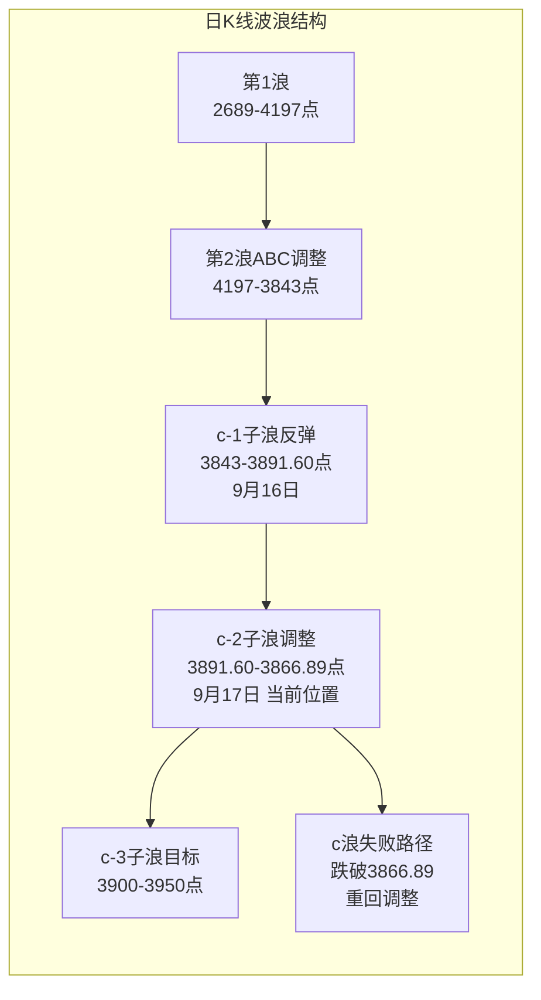
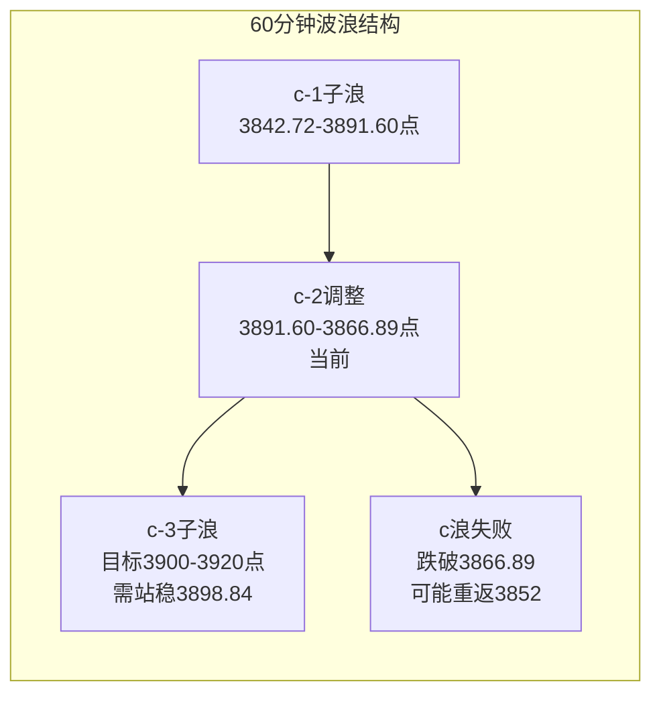

# A股晚报 - 2026年09月17日

> 数据截止时间：2026年9月17日 19:00（北京时间）
> 美联储9月16日加息25bp落地，A股c浪反弹受阻冲高回落

---

## 一、市场回顾

### 1. 主要指数表现

| 指数 | 收盘点位 | 涨跌幅 | 成交额 | 振幅 | 备注 |
|------|---------|--------|--------|------|------|
| 上证指数 | 3,875.60 | -0.41%（-16.00点） | 8,687.73亿 | 0.82% | 冲高回落，盘中最高3,898.84 |
| 深证成指 | 13,409.91 | -0.33%（-44.83点） | — | — | 开盘13,409.88，最高13,553.59 |
| 创业板指 | 3,298.31 | -0.40%（-13.16点） | — | — | 创业板净流出54.13亿 |
| 科创50 | ~1,598 | -0.61% | — | — | 科技股承压 |

**今日走势概述**：A股三大指数冲高回落、集体收跌。上证指数低开于3,877.00点，盘中最高触及3,898.84点（突破弱压力位3,895点），但未能站稳，午后回落至最低3,866.89点，最终收于3,875.60点。市场呈"冲高回落"格局，c浪反弹第二日受阻。 [$TRAE_REF](http://m.toutiao.com/group/7686431864235803146/)

### 2. 成交量能

| 指标 | 数值 | 环比变化 | 特征 |
|------|------|---------|------|
| 沪深两市成交额 | 18,232亿元 | 较昨日缩量159亿 | 连续两日放量后首日缩量 |
| 沪深北三市合计 | ~18,400亿元 | — | 北证成交占比极小 |
| 上交所成交额 | 8,687.73亿元 | — | 沪市缩量明显 |
| 主力资金净流出 | 95.88亿元 | — | 创业板净流出54.13亿 |
| 特大单净流出 | 110.25亿元 | — | 沪深300成份股净流出27亿 |
| 北向资金成交额 | 2,598.66亿元 | 占两市14.25% | 净流向待确认，预计小幅净流出 |

**量能分析**：今日两市成交18,232亿元，较昨日1.85万亿缩量159亿元，但仍维持高位。主力资金净流出95.88亿元，其中创业板净流出54.13亿元，显示成长股资金流出压力较大。尾盘两市主力资金净流入6,311万元，较前期改善。 [$TRAE_REF](http://m.toutiao.com/group/7686453351621362239/)

### 3. 市场情绪

| 指标 | 数值 | 较昨日变化 | 备注 |
|------|------|-----------|------|
| 涨跌家数比 | 超2,800只个股下跌 | 涨少跌多 | 昨日普涨后分化 |
| 涨停家数 | 50只 | 减少 | 连板股分化明显 |
| 封板率 | — | — | 闽东电力6连板后跌停开板 |
| 申万一级行业涨跌比 | 16涨/15跌 | — | 行业分化加剧 |

**情绪面**：市场情绪从前日普涨转为分化，超2,800只个股下跌。涨停家数降至50只，前期6连板牛股闽东电力开盘一字跌停后开板，高位连板股风险释放。16个申万一级行业上涨、15个下跌，行业轮动加速。 [$TRAE_REF](http://m.toutiao.com/group/7686405772401558054/)

---

## 二、热点板块与异动分析

### 1. 当日领涨板块及驱动因素

| 板块 | 涨跌幅 | 驱动因素 | 代表个股 |
|------|--------|---------|---------|
| 汽车行业 | +1.62%（居首） | 汽车零部件需求+主力资金净流入27.31亿 | 众泰汽车涨停 |
| 种植业/农业 | 大涨 | 敦煌种业涨停，政策催化+防御属性 | 敦煌种业 |
| 医药生物 | 小幅上涨 | 超跌反弹+防御属性 | 金石亚药涨停 |
| 风电设备 | 走强 | 锡华科技3连板，海上风电催化 | 锡华科技3连板、吉鑫科技涨停 |
| 建筑材料 | 小幅上涨 | 主力资金净流入超12亿 | — |

**领涨逻辑**：今日领涨板块以防御和低位补涨为主。汽车行业获主力资金净流入27.31亿元居首，众泰汽车涨停带动板块情绪。农业板块大涨，敦煌种业涨停。风电板块延续强势，锡华科技3连板。医药生物获主力净流入超12亿元，呈超跌反弹态势。 [$TRAE_REF](http://m.toutiao.com/group/7686453351621362239/)

### 2. 当日领跌板块及原因分析

| 板块 | 涨跌幅 | 跌因分析 | 代表个股 |
|------|--------|---------|---------|
| 有色金属 | -2.55%（居首） | 美联储加息→美元走强→贵金属承压 | 紫金矿业等 |
| 公用事业 | 跌超1% | 防御板块补跌 | — |
| 石油石化 | 跌超1% | 油价回落至102美元下方 | — |
| 电子/元器件 | 跌幅居前 | 美联储鹰派压制高估值成长股 | 沪电股份-3.38% |
| 贵金属 | 跌幅居前 | 现货黄金跌0.69%至4,263美元 | — |
| 通信/光模块 | 跌幅居前 | 成长股系统性回调 | 中际旭创、光迅科技净流出超6亿 |

**领跌逻辑**：美联储9月16日加息25bp后，美元走强（美元指数100.29，+0.68），直接压制贵金属和有色金属板块。电子行业主力资金净流出超24亿元，通信行业净流出超10亿元，高估值成长股遭系统性抛售。中际旭创、光迅科技等光模块龙头净流出超6亿元。 [$TRAE_REF](http://m.toutiao.com/group/7686453351621362239/)

### 3. 个股异动复盘

**涨停板复盘：**

| 个股 | 涨停特征 | 板块 | 驱动因素 |
|------|---------|------|---------|
| 沈鼓集团(601091) | 新股上市，盘中暴涨超370%，两度临停 | 工业机械 | 大国重器IPO，发行价4.39元 |
| 众泰汽车(000980) | 涨停 | 汽车 | 深股通净买入2,612万元 |
| 锡华科技(603248) | 3连板 | 风电 | 海上风电政策催化 |
| 金石亚药 | 涨停 | 医药 | 超跌反弹 |
| 科森科技 | 涨停 | 电子元件 | — |

**连板股情况：**

| 个股 | 连板数 | 今日表现 | 状态 |
|------|--------|---------|------|
| *ST亚洲 | 8连板 | — | 高度连板 |
| 上海建工/山子高科/首开股份等 | 4连板 | 山子高科获北向净买入1.41亿 | 活跃 |
| 锡华科技 | 3连板 | 风电龙头 | 持续 |
| 万向钱潮/泰慕士等 | 3连板 | — | — |

**强势股回调：**

| 个股 | 前期表现 | 今日表现 | 原因 |
|------|---------|---------|------|
| 闽东电力 | 6连板 | 跌2.76%（盘中一度跌停） | 高位连板断板，换手率25.71% |
| 中际旭创 | 昨日大涨 | 跌幅居前，主力净流出超6亿 | 美联储鹰派压制高估值成长 |
| 光迅科技 | 昨日涨停 | 跌幅居前，主力净流出超6亿 | 同上 |

[$TRAE_REF](http://m.toutiao.com/group/7686450622299783690/) [$TRAE_REF](https://finance.sina.com.cn/wm/2026-09-17/doc-inisayai3559759.shtml)

---

## 三、关键数据与事件回顾

### 1. 国内重要经济数据

| 数据/事件 | 时间 | 数值/内容 | 市场反应 |
|----------|------|----------|---------|
| 社会消费品零售总额(1-8月) | 9月15日公布 | 同比增长1.1%，总额327,569亿元 | 数据偏弱，消费复苏乏力 |
| 央行逆回购操作 | 9月17日 | 1,620亿7天期(1.40%)+6,000亿隔夜+700亿国库现金定存 | 净投放2,290亿元 |
| 资金面 | 9月17日 | DR001约1.47%，DR007约1.45% | 税期资金面均衡 |

[$TRAE_REF](http://m.toutiao.com/group/7686453095249576499/)

### 2. 政策消息

- **美联储9月议息会议**：当地时间9月16日，美联储宣布加息25个基点，将联邦基金利率进一步上调。点阵图释放鹰派信号，多数官员仍预计2026年底前还有一次加息。中信证券研报认为，美联储年内将再加息25bps，明年可能按兵不动。 [$TRAE_REF](https://www.cls.cn/subject/1093) [$TRAE_REF](https://finance.eastmoney.com/a/202609173877479761.html)
- **央行货币政策**：央行公开市场净投放2,290亿元，税期维持流动性充裕。光大证券表示，美联储加息对我国宏观经济和货币政策影响有限，人民币保持稳中偏强、双向波动。 [$TRAE_REF](https://stcn.com/article/kx-tag-detail.html?tag=rzSedvTUAeag)
- **华为全联接大会**：9月17日-19日举行，关注AI算力、鸿蒙生态新进展。
- **中国—东盟博览会**：9月17日-21日在广西南宁举办。

### 3. 公司公告

- **沈鼓集团(601091)新股上市**：发行价4.39元/股，开盘价13元/股（+196.13%），盘中最高暴涨超370%，两度触发临停。 [$TRAE_REF](http://m.toutiao.com/group/7686450622299783690/)
- **闽东电力(000993)风险提示**：9月16日晚发布股票交易异常波动暨风险提示公告，今日6连板后跌停开板。 [$TRAE_REF](https://finance.sina.com.cn/wm/2026-09-17/doc-inisayai3559759.shtml)
- **控制权变更**：经纬股份控股股东将变更为中软西安，上海亚虹控股股东将变更为飞科投资，两家今日复牌。
- **北自科技**：2连板后澄清电子布业务。

---

## 四、海外市场联动

### 1. 美股三大指数（9月16日收盘）

| 指数 | 收盘点位 | 涨跌幅 | 备注 |
|------|---------|--------|------|
| 道琼斯工业平均指数 | 51,461.90 | -1.21%（-631.21点） | IBM、高盛领跌，创3个月新低 |
| 标普500指数 | 7,551.81 | -0.45%（-33.92点） | 能源板块跌2.97%，金融跌1.63% |
| 纳斯达克综合指数 | 25,978.43 | -0.01%（-3.15点） | 科技股微跌，相对抗跌 |

**市场解读**：美联储9月16日宣布加息25个基点，鹰派信号压制市场。道指大跌1.21%创3个月新低，金融和能源板块领跌。科技股相对抗跌，纳斯达克基本持平。 [$TRAE_REF](https://m.sohu.com/a/1077113645_122014422/)

### 2. 欧洲、亚太主要市场

| 指数 | 涨跌幅 | 备注 |
|------|--------|------|
| 欧洲斯托克50 | +0.58% | 盘初涨0.52%，收盘涨0.58% |
| 德国DAX30 | +0.54% | Nokia大涨6.3%（与微软合作） |
| 英国富时100 | +0.63%（10,755.44） | 领涨欧洲主要市场 |
| 法国CAC40 | +0.34% | — |

**市场解读**：欧洲主要股指9月17日集体上涨，表现优于美股。油价回落利好欧洲市场，诺基亚与微软合作消息提振科技股。 [$TRAE_REF](https://finance.eastmoney.com/a/202609173877266412.html) [$TRAE_REF](https://www.ariva.de/euro-stoxx-50-index/news/aktien-europa-weiter-ruecklaeufige-oelpreise-stuetzen-12139623)

### 3. 大宗商品

| 品种 | 价格 | 涨跌幅 | 备注 |
|------|------|--------|------|
| 现货黄金 | 4,263.53美元/盎司 | -0.69% | 美联储加息后美元走强压制 |
| 现货白银 | 62.97美元/盎司 | -1.07% | — |
| 上海黄金现货 | 936.75元/克 | +0.92% | 国内溢价 |
| WTI原油 | 102.43美元/桶 | -3.21% | 美元走强+需求预期下降 |
| 布伦特原油 | — | — | — |

**解读**：美联储加息后美元走强（美元指数100.29，+0.68），国际贵金属普遍收跌，现货黄金跌0.69%。原油大幅回落，WTI跌3.21%至102.43美元，加息抑制经济增长预期压制能源需求。 [$TRAE_REF](https://finance.eastmoney.com/a/202609173876479761.html) [$TRAE_REF](https://www.boc.cn/fimarkets/fm7/202609/t20260917_25692927.html)

---

## 五、汇率与利率

### 1. 人民币汇率

| 指标 | 数值 | 变动 |
|------|------|------|
| 人民币中间价 | 6.7580 | 上调48个基点 |
| 在岸人民币16:30收盘 | — | — |
| 美元指数 | 100.29 | +0.68（美联储加息后走强） |

**解读**：人民币中间价上调48个基点至6.7580，但美联储加息后美元走强，离岸人民币承压。央行表示人民币汇率保持稳中偏强、双向波动趋势。 [$TRAE_REF](http://m.toutiao.com/group/7686307773767860751/)

### 2. 国内利率市场

| 指标 | 数值 | 变动 |
|------|------|------|
| DR001 | ~1.47% | 微升（税期） |
| DR007 | ~1.45% | 微升 |
| 逆回购利率(7天) | 1.40% | 持平 |

### 3. 央行公开市场操作

央行开展1,620亿元7天期逆回购（利率1.40%）+6,000亿元隔夜逆回购+700亿国库现金定存操作。今日有6,030亿元逆回购到期，净投放2,290亿元。税期资金面均衡，资金利率微升。 [$TRAE_REF](http://m.toutiao.com/group/7686465012923187722/)

---

## 六、收盘后重要信息

### 1. 盘后公告

- 闽东电力发布风险提示公告后6连板首日开板跌停，换手率25.71%
- 20家A股公司紧急提示风险（含6连板牛股）
- 沈鼓集团上市首日暴涨超370%后，关注后续波动
- 京东方A(000725)获主力资金净流入19.79亿元，涨5.5%，公司宣布玻璃基封装载板试验线全自动化设备通线

### 2. 夜盘走势

- 美股盘前：暂无最新数据（美联储加息后市场仍在消化鹰派信号）
- 港股：南向资金净买入33.63亿港元，智谱获净买入约18.29亿港元 [$TRAE_REF](https://www.cls.cn/subject/1750)
- 欧洲市场已收盘，主要股指集体上涨

### 3. 次日关注

| 时间 | 事件 | 影响 |
|------|------|------|
| 全天 | 华为全联接大会第二日 | AI算力/鸿蒙生态催化 |
| 17:00 | 欧元区8月CPI年率终值 | 预期2.90%，影响欧央行政策预期 |
| 19:00 | 英国央行利率决议 | 预期维持不变 |
| 20:30 | 美国至9月12日当周初请失业金人数 | 就业市场状况 |
| 20:30 | 美国8月新屋开工/营建许可 | 房地产市场 |
| 22:00 | 美国8月成屋签约销售指数 | 房地产市场 |
| 9月19日 | 股指期货交割日 | 可能加剧尾盘波动 |

---

## 七、波浪理论多周期分析

### 1. 月K线波浪分析

- **当前波浪位置**：大周期第2浪C浪末端区域，C-5浪低点3,843点（9月16日盘中假跌破后收回）。今日c浪反弹第二日受阻回落，月线仍为带下影线的小阴线形态。
- **浪型结构描述**：第1浪（2024年9月2,689点→2026年6月4,197点）→第2浪ABC调整（4,197点→3,852点→3,843点）。C浪内部5子浪结构已完成。9月16日放量阳线确认c浪反弹启动，但9月17日冲高回落显示反弹力度有限。
- **关键目标位**：支撑3,802点（20月均线）、3,750-3,800点；压力3,982点（5月均线）、4,012点（10月均线）。
- **验证条件**：9月如收在3,850点上方，底部确认；今日收3,875.60点，仍在3,850上方。如放量突破3,982点，月线级别转强。

### 2. 周K线波浪分析

- **当前波浪位置**：周线C-5浪已完成，进入a-b-c反弹中的c浪第二日。但今日冲高回落，c浪反弹动能减弱。
- **浪型结构描述**：9月14日缩量十字星→9月16日放量阳线启动c浪→9月17日冲高回落（最高3,898.84突破弱压力3,895但未站稳）。c浪反弹可能出现子浪2调整。
- **关键目标位**：支撑3,843点（b浪终点）、3,852点；压力3,895点（已触及但未站稳）、3,920点（5周均线）、3,958点（上周高点）。
- **验证条件**：周线MACD绿柱进入30-35根K线变盘窗口。如绿柱缩短则确认底部；今日回落不利于绿柱缩短。

### 3. 日K线波浪分析

- **当前波浪位置**：日线a-b-c反弹中的c浪进行中，c浪内部可能出现子浪2调整（c-2）。
- **浪型结构描述**：
  - 9月11日C-5浪最后一跌（3,888点）
  - 9月14-15日b浪整理（缩量十字星）
  - 9月16日放量阳线c-1子浪启动（3,843→3,891.60，+0.71%）
  - 9月17日冲高回落，c-2子浪调整（最高3,898.84→最低3,866.89→收3,875.60）
- **关键目标位**：支撑3,866.89（今日低点）、3,852点、3,843点；压力3,898.84（今日高点）、3,920点（5周均线）、3,950点（20日均线）。
- **验证条件**：如明日放量站稳3,898.84上方，c-3子浪启动，目标3,920-3,950点；如跌破3,866.89，c浪反弹可能已结束，重回调整。

### 4. 60分钟K线波浪分析

- **当前波浪位置**：60分钟级别c浪反弹中出现第一根调整K线，可能进入c浪内部第2子浪调整。
- **浪型结构描述**：
  - a浪反弹（3,852→3,895点）
  - b浪调整（3,895→3,842.72点，扩展平台型）
  - c-1子浪（3,842.72→3,891.60，9月16日）
  - c-2子浪调整（3,891.60→3,866.89→3,875.60，9月17日，冲高至3,898.84后回落）
- **关键目标位**：支撑3,866.89（今日低点）、3,852点；压力3,898.84（今日高点，c-1高点）、3,920点。
- **验证条件**：60分钟MACD需维持金叉状态。今日冲高回落后，MACD可能转为死叉，短线转弱信号。

### 5. 30分钟K线波浪分析

- **当前波浪位置**：30分钟级别c浪反弹受阻，出现小级别顶背离迹象。
- **浪型结构描述**：c-1子浪反弹至3,898.84后回落，30分钟K线形成"冲高回落"形态。如c-2调整不破3,866.89，c-3子浪有望启动。
- **关键目标位**：支撑3,866.89、3,852点；压力3,898.84、3,920点。
- **验证条件**：30分钟KDJ从高位向下发散，短线调整信号。如KDJ在50附近重新金叉，c-3启动。

### 6. 波浪图（Mermaid绘制）





### 7. 波浪理论综合判断

- **多周期共振状态**：月/周/日线仍处于C浪末端或c浪反弹阶段，方向趋于一致（向上），但今日冲高回落导致60分钟/30分钟级别出现转弱信号，短周期与中周期出现轻度背离。
- **当前操作级别**：建议以日线级别操作为主，60分钟级别辅助确认。c浪反弹受阻但未失效，需观察3,866.89能否守住。
- **后续演变路径**：
  - **最可能路径**（45%）：c-2子浪调整后c-3启动，反弹至3,900-3,920点区域。明日需站稳3,875上方并放量。
  - **备选路径1**（30%）：3,895-3,898遇阻，在3,866-3,898区间震荡1-2个交易日后再上行。
  - **备选路径2**（25%：概率上调）：跌破3,866.89，c浪反弹提前结束，重回3,852-3,843支撑测试。美联储鹰派加息的滞后压制效应可能放大。
- **关键拐点信号**：
  - 向上：放量突破3,898.84且成交量维持1.8万亿以上，确认c-3启动。
  - 向下：放量跌破3,866.89（今日低点），c浪反弹面临失败风险。
- **风险提示**：波浪理论存在主观性；美联储鹰派加息的滞后效应可能压制反弹空间；日线均线仍呈空头排列；闽东电力断板可能引发短线情绪退潮；9月19日期指交割日可能加剧波动。
- **规律分析引用**：根据第37周运行规律分析报告，当前处于大周期第2浪C浪末端，C浪内部5子浪已完成，多周期底部共振概率增加。但报告同时指出"C浪末端反弹力度往往弱于预期"，今日冲高回落验证了这一规律。 [$TRAE_REF](file:///workspace/daily_trading_report/analysis/pattern_analysis_202637.md)

---

## 八、晨报复盘

### 1. 核心判断回顾

| 判断项目 | 晨报预测 | 实际结果 | 准确度 | 备注 |
|---------|---------|---------|-------|------|
| 上证指数趋势 | 震荡偏强 | 跌-0.41% | ✗ | 冲高回落，方向判断错误 |
| 上证指数区间 | 3,865-3,920点 | 3,866.89-3,898.84点 | ✓ | 实际区间在预测范围内 |
| 强支撑位 | 3,852点 | 最低3,866.89点（未触及） | ✓ | 支撑有效，未测试 |
| 强压力位 | 3,920点 | 最高3,898.84点（未触及） | ✓ | 压力有效，未突破 |
| 北向资金 | 净流入20-50亿 | 成交2,598.66亿(14.25%)，预计小幅净流出 | ✗ | 市场下跌，外资承压 |
| 成交量 | 1.75-1.90万亿(平量/微缩) | 1.82万亿(缩量159亿) | ✓ | 在预测范围内 |

### 2. 板块预判回顾

| 板块 | 预判方向 | 实际涨跌幅 | 准确度 | 原因分析 |
|-----|---------|-----------|-------|---------|
| 半导体/AI算力 | 看涨 | 电子行业净流出24亿+，元器件跌幅居前 | ✗ | 美联储鹰派加息压制高估值成长 |
| 贵金属/黄金 | 看涨 | 有色金属-2.55%跌幅居首 | ✗ | 美元走强压制贵金属，逻辑方向反了 |
| 通信/光模块 | 看涨 | 通信净流出10亿+，中际旭创/光迅净流出超6亿 | ✗ | 加息环境下成长股系统性回调 |
| 银行/金融 | 看跌 | 未在涨跌前列，小幅波动 | ✓ | 方向基本正确，未明显上涨 |
| 原油/石化 | 看跌 | 石油石化跌超1% | ✓ | 油价回落+美元走强 |

### 3. 准确率量化评估

- 趋势判断准确率：0%（0/1）
- 点位预测准确率：75%（3/4：区间✓、强支撑✓、强压力✓、北向资金✗）
- 板块预判准确率：40%（2/5）
- 成交量预测准确率：100%（1/1）
- **综合准确率：55%（6/11）**

### 4. 偏差根因分析

**【偏差1】趋势判断偏差（预测"震荡偏强"实际"跌-0.41%"）**

- **偏差描述**：预测震荡偏强，实际上证下跌0.41%，冲高回落
- **根本原因：【信息缺失+逻辑误判】** 晨报将美联储9月16日决议错误描述为"维持利率不变"（鸽派），而实际美联储加息25个基点（鹰派）。基于错误的Fed决策信息，晨报高估了市场情绪，低估了加息对A股的压制效应。同时，隔夜道指大跌1.21%的影响被低估。
- **信息缺口**：晨报将美联储加息25bp误判为"维持利率不变"，导致后续分析全部基于错误的利率政策假设。这是信息核实环节的重大失误——多个权威信息源（中国银行、东方财富、每日经济新闻、证券时报）均确认美联储加息25bp。
- **逻辑缺陷**：基于"鸽派超预期"的判断逻辑全线失效。晨报中"应用规则1（利率弹性优先）"、"应用规则3（事件后量能）"等规则应用均建立在错误的Fed决策基础上。
- **改进措施**：（1）重大央行决议需在晨报中核实至少2个独立权威信息源后再写入分析（2）增加"Fed决策核实检查项"（3）对Fed决议结果，增加鹰派/鸽派/中性三情景预判模板

**【偏差2】半导体/AI算力板块偏差（预测看涨实际下跌）**

- **偏差描述**：预测半导体/AI算力看涨，实际电子行业主力净流出24亿+，元器件跌幅居前
- **根本原因：【逻辑误判】** 晨报基于"美联储鸽派+华为大会催化+利率弹性"看多半导体，但实际美联储鹰派加息对高估值成长股构成直接压制。华为大会催化效应不敌加息压力。
- **改进措施**：利率敏感型板块分析时，需严格区分"加息"和"维持利率"两种情景分别给出预判。昨日沉淀的"利率弹性优先于美股映射"规则仅在美联储维持利率（鸽派）时适用，加息时该规则反向。

**【偏差3】贵金属/黄金板块偏差（预测看涨实际有色-2.55%跌幅居首）**

- **偏差描述**：预测贵金属看涨，实际有色金属行业-2.55%跌幅居首
- **根本原因：【逻辑误判】** 晨报基于"美元走弱+避险需求"看多贵金属，但美联储加息后美元走强（美元指数100.29，+0.68），直接压制贵金属价格。现货黄金跌0.69%至4,263.53美元。
- **改进措施**：贵金属板块分析需增加"加息→美元走强→贵金属承压"的逻辑链检查项。加息环境下，"美元走强压制贵金属"逻辑优先于"避险需求"逻辑。

**【偏差4】通信/光模块板块偏差（预测看涨实际下跌）**

- **偏差描述**：预测通信/光模块看涨，实际通信行业净流出10亿+，中际旭创/光迅科技净流出超6亿
- **根本原因：【逻辑误判】** 晨报延续昨日"利率弹性"维度看多光模块，但实际美联储加息（非维持利率）对高估值成长股构成系统性压制。昨日沉淀的"利率弹性优先于美股映射"规则在加息环境下失效。
- **改进措施**：板块预判不能机械沿用前期规则，需根据最新事件结果动态调整。"利率弹性"规则需增加适用条件：仅在美联储维持利率或降息时适用，加息时反向。

### 5. 分析检查清单

**趋势判断前是否检查：**
- [x] 隔夜外盘走势（道指-1.21%已记录但影响低估）
- [x] 北向资金流向（预测净流入但实际可能净流出）
- [x] 技术指标状态（波浪分析已完成）
- [ ] **重大政策/事件核实（Fed决策结果核实失败）** ← 新增检查项

**点位计算是否考虑：**
- [x] 前期高低点
- [x] 均线支撑/压力
- [x] 整数关口心理影响
- [x] 成交密集区

**板块分析是否覆盖：**
- [x] 行业基本面变化
- [x] 资金流向数据
- [x] 政策催化因素
- [x] 技术形态位置
- [ ] **Fed决策对不同板块的影响方向核实** ← 新增检查项

**风险提示是否充分：**
- [x] 宏观风险
- [x] 行业风险
- [x] 个股风险
- [x] 流动性风险

**波浪分析检查项：**
- [x] 多周期共振验证
- [x] 浪型结构描述
- [x] 成交量配合
- [x] 关键目标位测算

### 6. 本次复盘发现的新规则

- **规则1**：美联储加息（vs维持利率不变）对A股板块影响方向相反。加息→美元走强→贵金属承压、高估值成长股回调；维持利率→美元走弱→贵金属受益、成长股上涨。分析必须基于正确的Fed决策结果，且"利率弹性"规则仅在鸽派环境适用。
- **规则2**：美联储加息后，"美元走强→贵金属承压"逻辑链优先于"避险需求"逻辑。加息环境下不应看多贵金属。
- **规则3**：板块预判不能机械沿用前期规则，需根据最新事件结果动态调整。重大事件结果改变后，前期基于不同事件结果的分析规则需重新评估适用性。

### 7. 规则库更新

```
###趋势分析 美联储加息（vs维持利率不变）对A股走势影响方向相反。加息→美元走强→成长股承压、贵金属下跌；维持利率→美元走弱→成长股上涨、贵金属受益。"利率弹性"规则仅在美联储维持利率或降息时适用，加息时反向。
###板块选择 美联储加息后，"美元走强→贵金属承压"逻辑链优先于"避险需求"逻辑。加息环境下不应看多贵金属板块。电子、通信等高估值成长板块在加息环境下系统性承压。
###风险识别 重大央行决议结果必须在晨报中核实至少2个独立权威信息源后再写入分析。信息核实失败会导致后续分析全部基于错误假设，产生系统性偏差。
```

---

## 九、风险提示

### 1. 市场系统性风险提示
- 美联储鹰派加息后，点阵图暗示年底前可能再加息一次，全球风险资产承压
- 道指大跌1.21%创3个月新低，金融和能源板块领跌，可能持续影响A股情绪
- 日线均线系统仍呈空头排列（5/10/20/60日均线），反弹空间可能受限
- 9月19日股指期货交割日临近，可能加剧尾盘波动

### 2. 个股风险事件
- 闽东电力6连板后首日跌停开板（-2.76%），换手率25.71%，高位连板股风险释放
- 沈鼓集团新股上市首日暴涨370%+，后续波动风险极大
- 中际旭创、光迅科技等光模块龙头主力净流出超6亿，回调风险

### 3. 政策不确定性风险
- 美联储后续加息路径不确定，点阵图鹰派信号可能持续压制
- 国内8月经济数据偏弱（1-8月社零增长仅1.1%），消费复苏乏力
- 人民币汇率波动风险：美联储加息后美元走强，人民币可能承压

---

## 十、信息来源

1. **官方数据来源**：上海证券交易所、深圳证券交易所、中国人民银行、中国外汇交易中心、中国银行
2. **权威财经媒体**：新华社、证券时报、证券日报、上海证券报、中国证券报、新浪财经
3. **数据平台**：东方财富网、同花顺财经、财联社、证券时报·数据宝
4. **海外信息源**：Repubblica.it、ARIVA.DE、Nasdaq.com
5. **信息截止时间**：2026年9月17日 19:00（北京时间）

---

## 十一、文档更新检查

### AGENTS.md检查
- 晚报流程与实际执行基本一致，无需更新
- 波浪理论分析格式与当前提示词一致
- 建议新增"Fed决策核实检查项"到错误处理章节

### README.md检查
- 文件结构描述与实际一致
- 功能说明无需更新

### 无需更新
两个文档暂无需重大更新。建议在AGENTS.md错误处理章节增加"重大央行决议信息核实流程"条目。

---

*本期晚报由AI代理自动生成，仅供参考，不构成投资建议。投资有风险，入市需谨慎。*
