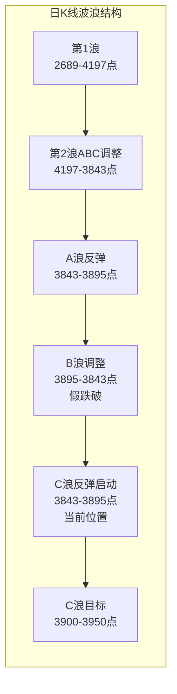
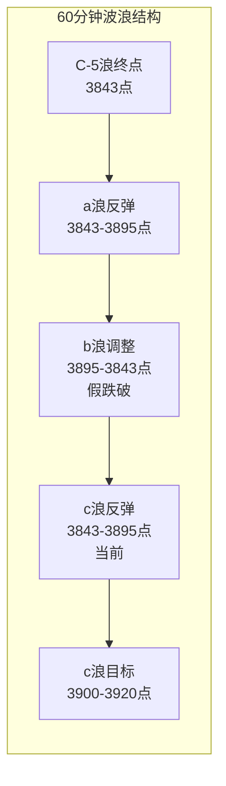

# A股晨报 - 2026年09月17日

> 数据截止时间：2026年9月17日 09:00（北京时间）
> 美联储9月议息会议维持利率不变，A股c浪反弹启动次日

---

## 一、昨日晚报复盘要点回顾

### 1. 昨日判断回顾

| 判断项目 | 晨报预测 | 实际结果 | 准确度 |
|---------|---------|---------|-------|
| 上证指数趋势 | 震荡 | 涨 +0.71% | ✗ |
| 上证指数区间 | 3,840-3,900点 | 3,842.72-3,894.66点 | ✓ |
| 强支撑位 | 3,852点 | 最低3,842.72点（盘中假跌破后收回） | ✗ |
| 强压力位 | 3,920点 | 最高3,894.66点（未触及） | ✓ |
| 成交量 | 平量/缩量1.5-1.7万亿 | 放量1.85万亿 | ✗ |
| 板块：半导体 | 看涨 | +3.73%~+7.00% | ✓ |
| 板块：通信/光模块 | 看跌 | +4.57%领涨 | ✗ |

- **趋势判断准确率**：50%（1/2）
- **点位预测准确率**：50%（2/4）
- **板块预判准确率**：40%（2/5）
- **综合准确率**：约42%

### 2. 关键偏差及原因

**偏差1：趋势判断偏差（预测"震荡"实际"涨"）**
- 根本原因：【信息缺失】晨报写作时（07:30）美联储决议结果已公布但市场尚未充分反应，基于"加息25bp已priced in"假设预判震荡。实际美联储维持利率不变构成重大鸽派超预期，直接催化市场放量反弹。
- 改进启示：重大事件结果在晨报截止前公布的，需增加"事件结果情景化预判"——对鸽派/鹰派/中性三种情景分别给出趋势判断。

**偏差2：成交量预测偏差（预测缩量实际放量）**
- 根本原因：【逻辑误判】基于"议息会议前双缩格局延续"规律预测缩量，但美联储鸽派超预期结果公布后，市场从"事件前观望缩量"迅速切换到"事件后确认放量"。
- 改进启示：成交量预测需区分"事件前"和"事件后"两种情景，重大事件结果落地后观望资金可能集中入场。

**偏差3：光模块/通信板块预测偏差（预测看跌实际+4.57%领涨）**
- 根本原因：【逻辑误判】将光模块归入"高美股映射板块"判断看跌，忽视了美联储鸽派决策对高估值成长股的利好效应远大于美股映射压制。
- 改进启示：分析利率敏感型成长板块时，需增加"利率弹性"维度，优先于"美股映射"维度。

### 3. 沉淀的规则/检查项

- **规则1**：美联储鸽派超预期时，A股次日放量上涨概率极高，科技/成长板块涨幅最大，高久期资产（半导体、CPO、光模块）优先受益。
- **规则2**：关键支撑位盘中假跌破（短暂跌破后收盘收回）是底部确认信号而非破位信号，"假跌破+V型反转+放量收阳"组合为强底部信号。
- **规则3**：重大事件结果落地后，市场可从"事件前观望缩量"迅速切换到"事件后确认放量"。
- **规则4**：分析利率敏感型成长板块时，"利率弹性"维度优先于"美股映射"维度。

### 4. 对今日分析的启示

- **需关注的风险点**：美联储点阵图仍暗示年底前再加息一次，鹰派立场可能压制反弹空间；美股次日（昨晚）道指大跌1.21%，可能对A股情绪产生短期压制。
- **需调整的分析逻辑**：昨日c浪反弹已启动，今日重点验证反弹持续性；量能能否维持在1.8万亿以上是关键；板块分析需延续"利率弹性"维度。

---

## 二、隔夜市场动态（昨日收盘后至今）

### 1. 美股市场（9月16日收盘）

| 指数 | 收盘点位 | 涨跌幅 | 备注 |
|------|---------|--------|------|
| 道琼斯工业平均指数 | 51,461.90 | -1.21%（-631.21点） | IBM、高盛领跌，创3个多月新低 |
| 标普500指数 | 7,551.81 | -0.45%（-33.92点） | 八跌三涨 |
| 纳斯达克综合指数 | 25,978.43 | -0.01%（-3.15点） | 科技股微跌，相对抗跌 |

**市场解读**：美股三大指数集体收跌，道指大跌1.21%创3个多月新低，主要受IBM（跌超4%）、高盛（跌近4%）等权重股拖累。标普500能源板块领跌2.97%，金融板块跌1.63%。科技股相对抗跌，科技板块微涨0.10%，英伟达、苹果微幅飘红。纳斯达克中国金龙指数跌0.x%。 [$TRAE_REF](https://finance.eastmoney.com/a/202609173876505363.html)

**对A股影响**：道指大跌但纳指基本持平，科技股抗跌，对A股科技成长板块的传导压制有限。但道指大跌可能影响整体风险偏好，需关注开盘情绪。

### 2. 欧洲/亚太市场（9月16日收盘）

| 指数 | 涨跌幅 | 备注 |
|------|--------|------|
| 德国DAX30 | +0.50% | — |
| 英国富时100 | +0.28% | — |
| 法国CAC40 | +0.62% | — |
| 意大利富时MIB | +0.83% | — |
| 欧洲斯托克50 | +0.54% | — |

**市场解读**：欧洲主要股指集体收涨，表现优于美股。欧洲央行维持利率不变预期支撑欧股，意大利MIB领涨0.83%。 [$TRAE_REF](https://finance.sina.com.cn/stock/bxjj/2026-09-16/doc-inirzwqt4643238.shtml)

### 3. 大宗商品

| 品种 | 价格 | 涨跌幅 | 备注 |
|------|------|--------|------|
| WTI原油 | 98.998美元/桶 | -1.74% | 回落至99美元下方 |
| 布伦特原油 | 107.462美元/桶 | -1.18% | — |
| COMEX黄金 | 约4,333-4,422美元/盎司 | +0.6%~+1.22% | 美元走弱提振 |
| 沪金主力 | 937.74元/克 | +1.00% | — |

**解读**：原油继续回落，WTI跌至99美元下方，对周期股构成压力。黄金延续反弹，美元走弱支撑贵金属，贵金属板块有望延续强势。

### 4. 汇率与利率

| 指标 | 数值 | 变动 |
|------|------|------|
| 美元指数 | — | -0.4%（Fed鸽派后持续走弱） |
| 人民币中间价 | 6.7628 | 上调42个基点 |
| 在岸人民币16:30收盘 | 6.7134 | 相对稳定 |
| 美债10年期收益率 | — | 盘中下跌9bp后回升 |

**解读**：美联储维持利率不变导致美元走弱，人民币汇率相对稳定。美债收益率波动加大，反映市场对美联储后续路径的分歧。

### 5. 重要海外事件

- **美联储点阵图鹰派信号**：尽管维持利率不变，但点阵图显示多数官员仍预计2026年底前还有一次25bp加息，终端利率3.75-4.00%，2027年仅温和宽松。这可能压制全球风险资产的反弹空间。
- **美股道指大跌**：道指跌1.21%创3个多月新低，金融股、能源股领跌，可能短暂影响A股开盘情绪。

---

## 三、今日关注事项

### 1. 重要数据发布（按时间排序）

| 时间 | 数据/事件 | 预期/前值 | 影响 |
|------|----------|----------|------|
| 09:00 | 中国8月Swift人民币在全球支付中占比 | 前值3.10% | 关注人民币国际化进展 |
| 15:00 | 商务部召开例行发布会 | — | 关注消费/外贸政策 |
| 17:00 | 欧元区8月CPI年率终值 | 预期2.90% | 影响欧央行政策预期 |
| 19:00 | 英国央行公布利率决议 | 预期维持不变 | 影响全球流动性预期 |
| 20:30 | 美国至9月12日当周初请失业金人数 | — | 就业市场状况 |
| 20:30 | 美国8月新屋开工总数年化 | — | 房地产市场状况 |
| 20:30 | 美国8月营建许可总数 | — | 房地产市场状况 |
| 20:30 | 美国9月费城联储制造业指数 | — | 制造业景气度 |
| 22:00 | 美国8月成屋签约销售指数月率 | — | 房地产市场 |

### 2. 政策/监管动态

- **华为全联接大会2026**：9月17日-19日举行，关注AI算力、鸿蒙生态、智能汽车等新进展，可能对科技板块形成催化。
- **第23届中国—东盟博览会**：9月17日-21日在广西南宁举办，关注一带一路、跨境贸易相关板块。
- **证监会讨论24小时交易事宜**：SEC开会讨论美股24小时交易，长期可能影响全球交易时间格局。

### 3. 公司公告

- **新股上市**：沈鼓集团（601091，沪主板）今日上市。
- **限售股解禁**：韩建河山（603616，277.50万股）、昂瑞微-UW（688790，723.06万股）昨日已解禁，昂瑞微盘中大跌超16%，解禁压力持续释放。

### 4. 其他关注

- **股指期货交割日**：9月19日（周五）为股指期货交割日，可能加剧尾盘波动。
- **国内8月经济数据**：昨日晚报提及今日可能公布部分8月经济数据，如不及预期可能压制权重板块。

---

## 四、板块与个股分析（结合昨日复盘）

### 1. 基于昨日复盘结论的板块调整

**昨日看涨板块今日表现预期：**
- **半导体/电子**：昨日+3.73%~+7.00%，领涨市场。今日预计分化，龙头持续但跟风股可能获利回吐。存储芯片涨价逻辑（苹果接受三星2027Q1涨价）仍有持续性。
- **贵金属**：昨日+3.51%，黄金反弹+美元走弱双重支撑，今日有望延续强势。

**昨日看跌板块今日表现预期：**
- **汽车整车/养殖业**：昨日跌幅居前，资金从防御板块流出。今日若市场回调，防御板块可能短暂回流，但非主线。
- **银行**：昨日小幅下跌，道指金融股大跌可能传导，今日承压概率较大。

**昨日偏差板块修正：**
- **通信/光模块**：昨日预测看跌实际+4.57%领涨。今日修正为"看涨"，逻辑：美联储鸽派利好高估值成长+AI算力硬件需求持续，华为全联接大会可能进一步催化。

### 2. 隔夜信息驱动的板块机会

**受益板块：**
- **（1）半导体/AI算力**：逻辑：华为全联接大会今日开幕，AI算力产业大会同步召开；美联储鸽派利好高估值成长股延续；存储芯片涨价催化持续。
- **（2）贵金属/黄金**：逻辑：美元持续走弱（-0.4%），COMEX黄金反弹至4,300美元上方，黄金股有望延续强势。
- **（3）一带一路/跨境贸易**：逻辑：中国—东盟博览会今日开幕，关注跨境电商、港口物流、基建相关个股。

**受损板块：**
- **（1）银行/金融**：逻辑：道指金融股大跌（高盛跌近4%），可能传导至A股金融板块；美债收益率波动加大压制银行净息差预期。
- **（2）原油/石油化工**：逻辑：WTI原油跌至99美元下方（-1.74%），油价回落压制油气板块盈利预期。
- **（3）汽车整车**：逻辑：资金从防御板块流出趋势延续，安凯汽车昨日-7%，板块情绪偏弱。

### 3. 重点关注个股

- **有研硅/有研新材**：半导体硅片龙头，昨日20%涨停/涨停，存储涨价+国产替代双逻辑，关注今日连板持续性。
- **光迅科技/中际旭创**：光模块龙头，昨日涨停/大涨，AI算力+利率弹性双驱动，华为大会可能催化。
- **闽东电力**：6连板，福建+绿电逻辑，累积风险加大，今日断板风险升高，不建议追高。
- **澳弘电子**：4连板，PCB逻辑，连板高度提升，关注能否晋级5板。

---

## 五、今日核心判断（必须结构化输出，用于晚报复盘）

### 1. 趋势判断
- **上证指数**：【震荡偏强】
- **预测区间**：3,865点 - 3,920点
- **核心逻辑**：昨日c浪反弹启动，放量阳线确认底部。但隔夜道指大跌1.21%可能压制开盘情绪，预计早盘低开或平开后震荡，盘中尝试冲击3,895点弱压力位。如量能维持在1.75万亿以上，有望突破3,895点并向3,920点靠拢。

### 2. 关键点位
- **强支撑位**：3,852点（依据：昨日C-5浪原低点，盘中假跌破后收回，确认为强支撑）
- **弱支撑位**：3,865点（依据：昨日开盘点位附近，5日均线附近）
- **强压力位**：3,920点（依据：5周均线位置，周线c浪反弹关键目标位）
- **弱压力位**：3,895点（依据：昨日高点3,894.66点，a浪高点，突破则确认c浪延续）

### 3. 板块预判
- **看涨板块**：（1）半导体/AI算力（逻辑：华为大会催化+存储涨价+利率弹性）；（2）贵金属/黄金（逻辑：美元走弱+避险需求）；（3）通信/光模块（逻辑：AI需求+利率敏感型板块受益）
- **看跌板块**：（1）银行/金融（逻辑：道指金融股大跌传导+美债波动）；（2）原油/石化（逻辑：油价回落至99美元下方）
- **风险板块**：高位连板股（闽东电力6连板累积风险大，断板可能引发短线情绪退潮）

### 4. 资金面判断
- **北向资金预期**：【净流入】约20-50亿元（逻辑：美联储鸽派后外资风险偏好回升，但道指大跌可能部分抵消）
- **成交量预期**：【平量/微缩】1.75-1.90万亿元（逻辑：昨日放量至1.85万亿，今日事件后放量效应可能延续但道指大跌压制情绪，预计平量震荡）

### 5. 风险预警（按优先级排序）
- **高风险**：道指大跌1.21%创3个月新低，开盘情绪可能受压；高位连板股断板风险（闽东电力、澳弘电子）。
- **中风险**：美联储点阵图暗示年底前再加息一次，压制反弹空间；9月19日股指期货交割日临近，可能提前反应。
- **低风险**：8月经济数据如不及预期可能压制权重；原油持续回落影响周期股情绪。

### 6. 昨日复盘规则应用
- **应用规则1（利率弹性优先）**：今日继续看多半导体、CPO、光模块等利率敏感型成长板块，不因道指大跌而忽视美联储鸽派的持续利好。
- **应用规则2（假跌破信号）**：3,852点昨日盘中假跌破后收回，确认为强支撑，今日回调至3,852附近视为低吸机会而非破位风险。
- **应用规则3（事件后量能）**：昨日议息会议后放量至1.85万亿，今日量能预测需基于"事件后"情景，不再沿用"双缩"规律。
- **应用规则4（情景化预判）**：今日无重大事件结果待公布，但需关注今晚美国经济数据对明日的影响。

---

## 六、投资策略建议（必须具体可执行）

### 1. 仓位建议
- **总仓位**：60%-70%（较昨日50%提升10-20%）
- **机动仓位**：15%-20%（可用于盘中低吸或做T）

### 2. 持仓结构
- **进攻仓位**：40%-50%（板块：半导体/AI算力20%、通信/光模块15%、贵金属10%）
- **防御仓位**：10%-15%（板块：高股息电力/公用事业5%、医药5%）
- **现金**：30%-35%

### 3. 操作策略
- **买入条件**：
  - 上证指数回调至3,852-3,865点区间且缩量，可分批低吸半导体/AI算力龙头。
  - 光模块龙头（中际旭创、新易盛）如早盘低开2%以上且大盘稳定，可考虑低吸。
  - 黄金股（山东黄金、紫金矿业）如回调至5日线附近可加仓。
- **卖出条件**：
  - 上证指数放量跌破3,852点且30分钟无法收回，减仓至50%以下。
  - 半导体跟风股（非龙头）冲高回落且换手率超过15%，获利了结。
  - 闽东电力如断板且短线情绪指标（涨停家数）快速下降至50家以下，减仓短线仓位。
- **止损位**：
  - 个股止损：跌破买入价-5%或跌破10日均线。
  - 大盘止损：上证指数收盘跌破3,843点（昨日低点），减仓至30%以下。

### 4. 与昨日策略对比
- **仓位调整**：从50%提升至60%-70%，原因：c浪反弹已确认，可适当积极，但道指大跌保留一定谨慎。
- **板块调整**：增加通信/光模块仓位（从看空修正为看多），原因：利率弹性维度优先于美股映射；减少银行仓位，原因：道指金融股大跌传导。
- **操作节奏**：昨日建议"观望为主、等待方向"，今日建议"逢低布局、积极参与反弹"。

---

## 七、波浪理论多周期分析

### 1. 月K线波浪分析
- **当前波浪位置**：大周期第2浪C浪末端，C-5浪低点3,843点（盘中假跌破后收回），c浪反弹启动次日。
- **浪型结构描述**：第1浪（2024年9月2,689点→2026年6月4,197点）→第2浪ABC调整（4,197点→3,852点→3,843点）。C浪内部5子浪结构已完成，3,843点可能为C浪最终低点。
- **关键目标位**：支撑3,802点（20月均线）、3,750-3,800点；压力3,982点（5月均线）、4,012点（10月均线）。
- **验证条件**：9月如收在3,850点上方，底部确认；如放量突破3,982点，月线级别转强。

### 2. 周K线波浪分析
- **当前波浪位置**：周线C-5浪已完成，进入a-b-c反弹中的c浪启动次日。
- **浪型结构描述**：上周大阴线完成C-5浪→本周三放量阳线启动c浪反弹。c浪反弹目标3,920-3,950点（5周均线/20周均线附近）。
- **关键目标位**：支撑3,843点（b浪终点）、3,852点；压力3,894点（10周均线）、3,920点（5周均线）、3,958点（上周高点）。
- **验证条件**：周线MACD绿柱进入30-35根K线变盘窗口，如绿柱缩短则确认底部。

### 3. 日K线波浪分析
- **当前波浪位置**：日线a-b-c反弹中的c浪反弹进行中。
- **浪型结构描述**：9月11日C-5浪最后一跌（3,888点）→9月14-15日b浪整理→9月16日放量阳线c浪启动。"中阴线+地量十字星+放量阳线"为典型底部反转组合。
- **关键目标位**：支撑3,843点、3,852点；压力3,895点（a浪高点）、3,900点（5日均线）、3,920点（5周均线）、3,950点（20日均线）。
- **验证条件**：今日如放量突破3,895点并站稳3,900点，c浪反弹确认，目标3,920-3,950点。

### 4. 60分钟K线波浪分析
- **当前波浪位置**：60分钟级别c浪反弹进行中。
- **浪型结构描述**：a浪反弹（3,852→3,895点）→b浪调整（3,895→3,842.72点，扩展平台型）→c浪反弹（3,842.72→3,894.66点）。
- **关键目标位**：支撑3,843点、3,852点；压力3,895点（已触及）、3,920点（c浪目标）、3,950点。
- **验证条件**：60分钟MACD需在零轴下方形成金叉并上穿零轴，确认短线转强。昨日V型反转已形成初步底背离。

### 5. 30分钟K线波浪分析
- **当前波浪位置**：30分钟级别c浪反弹进行中。
- **浪型结构描述**：a浪反弹后b浪平台型整理，昨日盘中下探3,842.72点形成b浪终点（假跌破），随后c浪反弹启动。
- **关键目标位**：支撑3,843点、3,852点；压力3,895点、3,900点、3,920点。
- **验证条件**：30分钟KDJ从50附近向上发散，如出现金叉并维持，c浪反弹持续概率高。

### 6. 波浪图（Mermaid绘制）

### 7. 波浪理论综合判断
- **多周期共振状态**：月/周/日/60分钟/30分钟五周期均处于C浪末端或c浪反弹阶段，方向趋于一致（向上）。昨日放量阳线确认底部，多周期共振向上概率高。
- **当前操作级别**：建议以日线级别操作为主，60分钟级别辅助确认。c浪反弹已启动，可适当积极，但需警惕道指大跌对开盘的短期压制。
- **后续演变路径**：
  - **最可能路径**（60%）：c浪反弹延续至3,920-3,950点，今日冲击3,895点并尝试突破。
  - **备选路径1**（25%）：3,895点遇阻回落，在3,865-3,895点区间震荡1-2个交易日后再上行。
  - **备选路径2**（15%）：放量跌破3,843点，c浪反弹失败，重回调整。
- **关键拐点信号**：
  - 向上：放量突破3,895点且成交量维持1.75万亿以上，确认c浪反弹延续。
  - 向下：放量跌破3,843点（昨日低点），c浪反弹失败。
- **风险提示**：波浪理论存在主观性；日线均线仍呈空头排列，反弹空间可能受限；道指大跌可能短暂压制情绪。

---

## 八、信息来源

1. **官方数据来源**：上海证券交易所、深圳证券交易所、中国人民银行、中国外汇交易中心
2. **权威财经媒体**：新华社、证券时报、证券日报、新华财经、中国新闻网
3. **数据平台**：东方财富网、同花顺财经、新浪财经、Wind资讯
4. **海外信息源**：Pomegra News、格隆汇、财联社
5. **信息截止时间**：2026年9月17日 09:00（北京时间）

---

*本期晨报由AI代理自动生成，仅供参考，不构成投资建议。投资有风险，入市需谨慎。*
