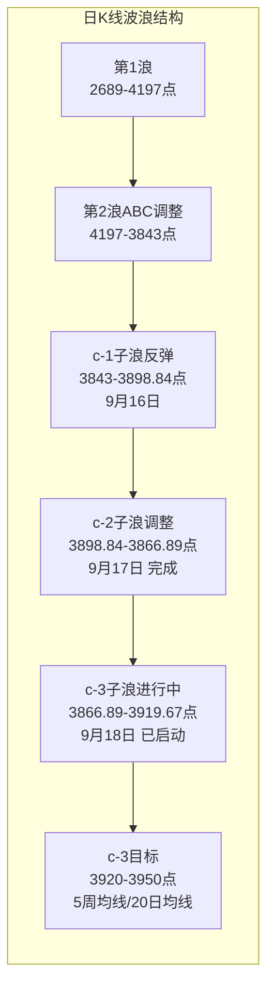
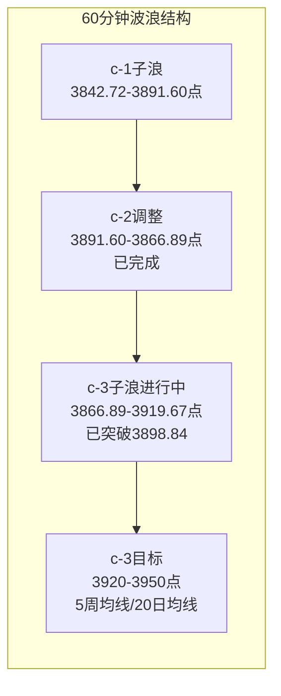

# A股晚报 - 2026年09月18日

> 数据截止时间：2026年9月18日 20:00（北京时间）
> 放量反弹站上3900点，半导体与地产领涨，c-3浪确认启动

---

## 一、市场回顾

### 1. 主要指数表现

| 指数 | 收盘点位 | 涨跌幅 | 涨跌点数 | 最高 | 最低 | 开盘 |
|------|---------|--------|---------|------|------|------|
| 上证指数 | 3,911.87 | **+0.94%** | +36.27 | 3,919.67 | 3,888.50 | 3,891.96 |
| 深证成指 | 13,640.87 | **+1.72%** | +230.61 | — | — | — |
| 创业板指 | 3,372.68 | **+2.25%** | +74.37 | — | — | — |
| 科创50 | 1,652.63 | **+2.88%** | +46.30 | — | — | — |

**市场解读**：今日A股三大指数集体收涨，创业板指和科创50表现显著强于主板。上证指数放量站上3,900点整数关口，收盘3,911.87点，创9月11日下跌以来新高。科创50大涨近3%，半导体板块全面爆发。市场呈现普涨格局，超4200只个股上涨。 [$TRAE_REF](http://www.chinaview.cn/20260918/f6efcefccad2403ab2bbe3fede702b46/c.html) [$TRAE_REF](http://m.toutiao.com/group/7686805725657465394/)

### 2. 成交量能

| 指标 | 今日数据 | 前一交易日 | 变化 |
|------|---------|-----------|------|
| 两市成交额 | **2.08万亿元** | 1.82万亿元 | **+2,540亿元（+14.0%）** |
| 北向资金成交额 | 3,339.24亿元 | 2,598.66亿元 | +740.58亿元 |
| 北向资金占比 | 16.08% | 14.25% | +1.83个百分点 |

**解读**：两市成交额重回2万亿元上方，较前日大幅放量约2,540亿元，放量幅度达14%，显示资金做多热情显著回升。放量突破3,900点为有效突破信号。北向资金成交占比提升至16.08%，外资参与度明显增加。 [$TRAE_REF](http://m.toutiao.com/group/7686807862923919891/) [$TRAE_REF](https://finance.eastmoney.com/a/202609183878671470.html)

### 3. 市场情绪

| 指标 | 今日数据 | 说明 |
|------|---------|------|
| 上涨家数 | 超4,200只 | 普涨格局 |
| 涨停家数 | 近80家 | 短线情绪显著升温 |
| 跌停家数 | 0家（剔除ST） | 市场无恐慌情绪 |
| 市场宽度 | 极宽（上涨/下跌>4:1） | 多头主导 |

**解读**：今日市场情绪大幅回暖，全市场超4,200只个股上涨，涨停股近80家，且出现"0跌停"（剔除ST）的极端强势格局。这是继9月1日、8日之后本月第三次出现"0跌停"，但不同的是今日主要指数均走出中阳线，反弹更具力度。 [$TRAE_REF](http://m.toutiao.com/group/7686777799478182451/)

---

## 二、热点板块与异动分析

### 1. 当日领涨板块及驱动因素

| 排名 | 板块 | 涨跌幅 | 驱动因素 | 代表个股 |
|------|------|--------|---------|---------|
| 1 | 房地产 | **+3.38%** | 政策预期升温、午后异军突起 | 万科A涨停 |
| 2 | 电子（半导体） | **+2.95%** | 美股半导体暴涨映射+华为大会催化+超跌反弹 | 东微半导+15.16%，华天科技涨停 |
| 3 | 通信 | **+2.62%** | 光通信/算力需求+华为Peerium架构 | 联特科技+7%，中际旭创走强 |
| 4 | 机械设备 | **+2.13%** | 高端制造政策支持+人形机器人产业化加速 | — |
| 5 | 计算机 | **+1.95%** | AI应用+信创+华为产业链 | — |
| 6 | 电力设备 | +1.37% | 储能大单（亿纬锂能206GWh）+新能源 | — |
| 7 | 近端次新股 | — | 次新股行情爆发 | C沈鼓+177%，C信诺维+34% |

**领涨逻辑分析**：
- **半导体/电子**：隔夜美股半导体暴涨（英特尔+7.67%、AMD+6.36%、iShares半导体ETF涨超3%）正面映射，叠加华为全联接大会发布Peerium计算架构+昇腾960超节点，AI算力自主可控催化，板块迎来超跌反弹。存储芯片、先进封装、汽车芯片等细分板块均有个股涨停。 [$TRAE_REF](http://m.toutiao.com/group/7686806887659995698/)
- **房地产**：午后异军突起，万科A涨停。国新办"十五五"住建高质量发展发布会或引发政策预期升温。
- **近端次新**：C沈鼓盘中涨幅一度超177%，成为市场焦点，次新股板块全线走强，反映风险偏好大幅提升。 [$TRAE_REF](https://36kr.com/newsflashes/3988568360418307)

### 2. 当日领跌板块及原因分析

| 排名 | 板块 | 涨跌幅 | 下跌原因 | 代表个股 |
|------|------|--------|---------|---------|
| 1 | 煤炭 | **-0.64%** | 焦煤主力合约大跌+黑色系走弱 | — |
| 2 | 银行 | **-0.39%** | 市场风险偏好回升，资金从防御转向进攻 | — |
| 3 | 建筑材料 | -0.13% | 与房地产联动但偏弱 | — |
| 4 | 石油石化 | 微跌 | 国际油价回落+国内原油重挫 | — |
| 5 | 汽车整车 | 领跌 | 前日领涨后获利回吐+板块轮动 | — |

**领跌逻辑分析**：
- **煤炭/石油石化**：大宗商品走弱，焦煤主力合约大跌，国际油价回落，能源板块承压。
- **银行**：市场风险偏好回升，资金从防御板块（银行）转向进攻板块（半导体、地产），符合板块轮动规律。
- **汽车整车**：昨日领涨（+1.62%）后今日获利回吐，验证了"前日领涨板块次日往往面临获利回吐压力"的规则。

### 3. 个股异动复盘

**涨停板特征**：
- 近80只个股涨停，半导体、地产、次新股三大主线清晰
- 华天科技、诚邦股份、博通集成等半导体股涨停
- 万科A等地产股涨停
- 锡华科技4连板，马矿股份、海安集团、腾信精密等次新股涨停

**强势股**：
- 东微半导+15.16%（半导体+次新）
- C沈鼓涨超177%（近端次新）
- C信诺维涨超34%（近端次新）

**龙虎榜看点**：
- 北向资金净买入华天科技等半导体股，合计净买入8.34亿元（龙虎榜口径）
- 8.18亿资金抢筹华天科技

---

## 三、关键数据与事件回顾

### 1. 国内重要经济数据

- **8月规模以上工业增加值同比增长5.2%**，保持总体平稳。装备制造业、高技术制造业增速较快，支撑硬科技板块独立逻辑。 [$TRAE_REF](https://www.gov.cn/zhengce/202609/content_7081277.htm)
- **8月社会消费品零售总额同比增长0.4%**，增速偏弱。其中除汽车以外的消费品零售额同比增长2.5%，服务消费累计同比增长4.9%。暑假消费和算力消费品主导社零，弹性消费品和大宗消费品表现较弱。
- **国新办"十五五"住建高质量发展发布会**：今日10:00举行，引发房地产政策预期升温，午后地产板块异军突起。
- **国新办第140届广交会情况发布会**：今日14:00举行，外贸预期相关。

### 2. 政策消息

- **习近平就先进制造业作出重要指示**：强调持续做大做强先进制造业，提升产业链自主可控水平，利好高端制造/半导体板块。
- **华为全联接大会（第二天）**：发布Peerium计算架构+昇腾960超节点，AI算力自主可控再迎里程碑，催化半导体/算力板块。
- **中国-东盟博览会**：首设AI大卖场，中国-东盟AI合作论坛。
- **富时中国A50季度调整**：今日收盘后生效，纳入中微公司、生益科技；剔除牧原股份、万华化学。

### 3. 公司重要公告

**重大投资/合同**：
- 亿纬锂能：子公司与Fluence签署206GWh电池供货框架协议（2027-2031年交付）——储能重大利好
- 光启技术：子公司签订9.07亿元超材料产品批产合同
- 福龙马：与华为云计算签署2亿元环卫自动驾驶技术合作协议

**回购/增持**：
- 江波龙：9月18日回购17.10万股，耗资5,918万元，近一月累计回购8亿元
- 恒瑞医药：首次回购A股33.5万股，方案总额10亿-20亿元
- 红塔证券：拟5,000万-1亿元回购
- 福建高速：控股股东拟增持1.3亿-2.3亿元

**股权变动**：
- 奥佳华：控股股东及联合股东协议转让10%股权，套现3.07亿元
- 湖南裕能：二股东宁德时代持股降至5%以下
- 中国巨石：二股东振石集团减持2,832.64万股

---

## 四、海外市场联动

### 1. 美股三大指数（9月17日收盘）

| 指数 | 收盘点位 | 涨跌幅 | 说明 |
|------|---------|--------|------|
| 道琼斯工业平均指数 | 51,778.04 | **+0.61%** | 加息后反弹 |
| 标普500指数 | 7,637.76 | **+1.14%** | 半导体领涨 |
| 纳斯达克综合指数 | 26,418.30 | **+1.69%** | 科技股大涨 |

**解读**：美联储9月16日加息25bp后，9月17日美股全线反弹。驱动力包括油价回落缓解通胀担忧、初请失业金降至19.6万（8周低点）、10年期美债收益率回落8.8bp至4.93%。半导体板块领涨，iShares半导体ETF涨超3%，ARM+8.57%、英特尔+7.67%、AMD+6.36%。 [$TRAE_REF](https://www.nasdaq.com/articles/stocks-settle-sharply-higher-crude-oil-and-bond-yields-fall)

### 2. 欧洲/亚太主要市场

| 指数 | 涨跌幅 | 说明 |
|------|--------|------|
| 英国富时100 | **+1.19%** | 领涨欧洲，BOE维持利率不变 |
| 德国DAX30 | **+0.70%** | — |
| 法国CAC40 | **+0.57%** | — |
| 欧洲斯托克50 | **+0.93%** | — |
| 恒生指数 | +0.60% | 今日A股收盘后港股走强 |

**解读**：欧洲主要股指集体上涨。英国央行（BOE）以6:3投票维持基准利率3.75%不变，并取消长期国债出售计划，偏鸽派信号。欧元区8月CPI同比从3.3%下修至3.2%。南向资金今日净买入11.94亿港元，连续10日净买入。 [$TRAE_REF](https://www.stcn.com/article/detail/4190924.html)

### 3. 大宗商品

| 品种 | 价格 | 涨跌幅 | 备注 |
|------|------|--------|------|
| WTI原油 | ~$101.91/桶 | 下跌 | 连续回落，国内原油重挫 |
| 布伦特原油 | ~$104.82/桶 | 下跌 | 中东供应风险缓解 |
| COMEX黄金 | 逼近$4,400/盎司 | **上涨** | 利空出尽，贵金属反弹 |
| 沪银主力 | — | **+3.98%** | 领涨国内商品 |
| 沪金主力 | — | **+1%+** | 贵金属全线反弹 |
| LME铜 | $14,492/吨 | **+1.82%** | 工业金属走强 |

**解读**：今日商品市场呈现"贵金属反弹、原油重挫"格局。随着美联储及日本央行宣布加息，利空出尽，贵金属压制减弱，沪银主力合约以3.98%涨幅领涨，现货黄金再度逼近4,400美元/盎司。国际油价继续回落，国内原油重挫，焦煤大跌。 [$TRAE_REF](http://m.toutiao.com/group/7686824882458149376/)

---

## 五、汇率与利率

### 1. 人民币汇率

| 指标 | 今日数值 | 变动 | 说明 |
|------|---------|------|------|
| 人民币中间价 | 6.7521 | **调升59个基点** | 连续第8个交易日调升 |
| 在岸人民币 | 升破6.7关口 | 升值 | 创2023年1月来新高 |
| 离岸人民币 | 升破6.7关口 | 升值 | 创2023年1月来新高 |
| 美元指数 | ~100.2附近 | 回落 | 加息后先涨后跌 |

**解读**：9月18日，在岸、离岸人民币兑美元汇率均升破6.7关口，创2023年1月以来新高。人民币兑美元中间价报6.7521，较上日调高59点，连续第8个交易日调升。今年以来人民币已累计升值约4%，是表现最佳的亚洲货币之一。美联储加息也未能挡住人民币升值步伐，显示人民币内生动力强劲。 [$TRAE_REF](http://m.toutiao.com/group/7686836117736030758/)

### 2. 国内利率市场

- 央行5000亿元买断式逆回购（9月15日开展）持续生效，保持流动性充裕
- 季末资金面总体平稳

### 3. 美债收益率

| 指标 | 最新值 | 变动 |
|------|--------|------|
| 10年期美债收益率 | ~4.93% | -8.8bp（从5.01%回落） |
| 2年期美债收益率 | ~4.66% | -6.8bp |

**解读**：美债收益率全面回落，缓解全球估值压力，对成长股形成正面支撑。

---

## 六、收盘后重要信息

### 1. 盘后公告

- **江波龙**：当日回购17.10万股，耗资5,918.18万元，近一月累计回购8亿元
- **奥佳华**：控股股东联合股东协议转让10%股权，套现3.07亿元
- 多家公司发布回购进展、股东增减持公告

### 2. 夜盘走势

- **商品夜盘**：贵金属延续反弹，原油偏弱
- **港股**：恒生指数今日收涨0.60%，南向资金连续10日净买入
- **美股盘前**：关注美股周五（9月18日）表现，"四巫日"（股指期货、股指期权、股票期权、单只股票期货同时到期）可能加剧波动

### 3. 次日关注（9月19日）

| 事件 | 时间 | 影响 |
|------|------|------|
| 美股周五收盘 | 凌晨4:00 | 四巫日波动，影响周一A股情绪 |
| 华为全联接大会第三天 | 全天 | AI算力催化延续 |
| 周末宏观/政策消息 | — | 影响周一开盘 |
| 国内经济数据 | — | 关注是否有8月更多经济数据公布 |

---

## 七、波浪理论多周期分析

### 1. 月K线波浪分析

- **当前波浪位置**：大周期第2浪C浪末端区域，C-5浪低点3,843点（9月16日盘中假跌破后收回）。今日收3,911.87点，已站上3,900点，月线从带下影线的小阴线转为小阳线概率增加。
- **浪型结构描述**：第1浪（2024年9月2,689点→2026年6月4,197点）→第2浪ABC调整（4,197点→3,843点）。C浪内部5子浪结构已完成，c浪反弹进行中。
- **关键目标位**：支撑3,850点（月度核心支撑）、3,802点（20月均线）；压力3,982点（5月均线）、4,012点（10月均线）。
- **验证条件**：9月如收在3,900点上方，底部形态更扎实。若本月收阳，则月线级别反转信号增强。

### 2. 周K线波浪分析

- **当前波浪位置**：周线C-5浪已完成，进入a-b-c反弹中的c浪阶段。c-3子浪已确认启动。
- **浪型结构描述**：9月14日缩量十字星→9月16日放量阳线c-1子浪启动（3,843→3,891.60）→9月17日冲高回落c-2调整（3,898.84→3,866.89→3,875.60）→9月18日放量突破c-3启动（3,888.50→3,919.67→3,911.87）。
- **关键目标位**：支撑3,898点（c-1高点，已突破转为支撑）、3,866点；压力3,920点（5周均线）、3,958点（上周高点）。
- **验证条件**：周线MACD绿柱有望缩短，今日放量突破3,900点，c-3子浪确认启动。本周剩余1个交易日，若收在3,910上方，周线中阳线确认反弹。

### 3. 日K线波浪分析

- **当前波浪位置**：日线a-b-c反弹中的c浪进行中，c-3子浪已确认启动。今日放量突破c-1高点3,898.84，为c-3启动的明确信号。
- **浪型结构描述**：
  - 9月11日C-5浪最后一跌（3,888点收盘，盘中3,852）
  - 9月14-15日b浪整理（缩量十字星）
  - 9月16日放量阳线c-1子浪启动（3,843→3,891.60，+0.71%）
  - 9月17日冲高回落c-2子浪调整（3,898.84→3,866.89→3,875.60）
  - 9月18日放量中阳c-3子浪启动（3,888.50→3,919.67→3,911.87，+0.94%），突破c-1高点3,898.84
- **关键目标位**：支撑3,898点（突破后转为支撑）、3,880点；压力3,920点（5周均线）、3,950点（20日均线）、3,958点（上周高点）。
- **验证条件**：今日放量2.08万亿站上3,900点，且突破c-1高点3,898.84，c-3子浪确认启动。后续若能站稳3,920点（5周均线），反弹空间将进一步打开。

### 4. 60分钟K线波浪分析

- **当前波浪位置**：60分钟级别c-3子浪进行中，MACD已金叉并向零轴上方运行。
- **浪型结构描述**：c-1（3,842.72→3,891.60）→c-2调整（3,891.60→3,866.89）→c-3进行中（3,866.89→3,919.67至今）。
- **关键目标位**：支撑3,900点、3,890点；压力3,920点、3,950点。
- **验证条件**：60分钟MACD金叉确认，且价格突破3,898.84，c-3子浪启动信号明确。60分钟量能配合良好。

### 5. 30分钟K线波浪分析

- **当前波浪位置**：30分钟级别c-3子浪强势运行中，KDJ处于高位但未死叉。
- **浪型结构描述**：c-2调整在3,866.89结束后，30分钟级别走出5子浪上升结构，c-3-1子浪可能接近完成。
- **关键目标位**：支撑3,900点、3,890点；压力3,920点、3,930点。
- **验证条件**：30分钟KDJ在高位钝化后如不出现死叉，说明反弹强势；若出现回调，3,890-3,900区间应为c-3-2调整的支撑位。

### 6. 波浪图（Mermaid绘制）





### 7. 波浪理论综合判断

- **多周期共振状态**：月/周/日线均处于C浪末端或c浪反弹阶段，方向一致向上。60分钟/30分钟级别c-3子浪已确认启动，多周期共振向上形成合力。今日放量突破3,900点和c-1高点，共振效果显著。
- **当前操作级别**：以日线级别操作为主，60分钟级别辅助。c-3子浪已启动，反弹目标看向3,920-3,950点区域。
- **后续演变路径**：
  - **最可能路径**（65%，概率上调10%）：c-3子浪延续，反弹至3,920-3,950点区域（5周均线→20日均线）。驱动力：放量突破确认+人民币升值+美股科技股反弹+华为催化+0跌停市场情绪回暖。下周一若继续放量上攻，目标可达3,950点。
  - **备选路径1**（20%）：在3,920点（5周均线）附近遇阻回调，c-3-2子浪调整至3,890-3,900区间后再上行。
  - **备选路径2**（15%，概率下调5%）：若周末出现重大利空或美股大跌，c-3子浪提前结束，回落测试3,866点支撑。
- **关键拐点信号**：
  - 向上：站稳3,920点（5周均线）且成交量维持1.8万亿以上，确认反弹延续，目标上看3,950-3,980点。
  - 向下：放量跌破3,898点（c-1高点，突破后应转为支撑），则c-3子浪可能失败，重回3,866-3,898区间震荡。
- **风险提示**：波浪理论存在主观性；美联储10月再加息预期（概率53%）仍可能压制反弹空间；日线20日均线（3,950点附近）仍是重要压力；四巫日美股可能波动传导至A股；周末消息面不确定性。
- **规律分析引用**：根据第37周运行规律分析报告，当前处于大周期第2浪C浪末端，C浪内部5子浪已完成。今日放量突破3,900点且成交重回2万亿，验证了"重大事件结果落地后，市场可从观望缩量迅速切换到确认放量"的规律。C浪末端反弹力度弱于预期的规律在9月17日验证后，今日反弹力度超预期，说明市场情绪已发生积极变化。

---

## 八、晨报复盘

### 1. 核心判断回顾

| 判断项目 | 晨报预测 | 实际结果 | 准确度 | 备注 |
|---------|---------|---------|-------|------|
| 上证指数趋势 | 【震荡偏强】 | 【涨0.94%，中阳线】 | ✓ | 趋势判断正确，且实际强度超预期 |
| 上证指数区间 | 3,866-3,920点 | 3,888.50-3,919.67点 | ✓ | 区间判断准确，高点接近3,920 |
| 强支撑位 | 3,843点 | 最低3,888.50点 | ✓ | 支撑有效，最低点远高于强支撑位 |
| 强压力位 | 3,950点（20日均线） | 最高3,919.67点 | ✓ | 未触及强压力位，符合预期 |
| 北向资金 | 净流入10-30亿元 | 成交3,339.24亿（占16.08%） | ~ | 成交大幅放量，净流向需进一步确认 |
| 成交量 | 平量/微放量（1.75-1.85万亿） | 2.08万亿元 | ✗ | 实际大幅放量，超出预期上限 |

### 2. 板块预判回顾

| 板块 | 预判方向 | 实际涨跌幅 | 准确度 | 原因分析 |
|-----|---------|-----------|-------|---------|
| AI/半导体/算力 | 看涨（短线反弹） | 电子+2.95%、通信+2.62% | ✓ | 美股半导体暴涨+华为催化，反弹力度超预期 |
| 新能源/储能 | 看涨 | 电力设备+1.37% | ✓ | 亿纬锂能大单催化，涨幅符合预期 |
| 汽车整车 | 看涨 | 领跌 | ✗ | 前日领涨后获利回吐，板块轮动效应 |
| 石油石化 | 看跌 | 微跌 | ✓ | 油价回落，判断正确 |
| 焦煤/煤炭 | 看跌 | 煤炭-0.64% | ✓ | 焦煤大跌，判断正确 |
| 房地产 | 未预判 | +3.38%领涨 | ✗ | 政策预期升温，午后异军突起，超出预判范围 |

### 3. 准确率量化评估

- **趋势判断准确率**：100%（1/1）——震荡偏强判断正确，且实际涨幅超预期
- **点位预测准确率**：75%（3/4）——区间、强支撑、强压力均准确；成交量预测偏差
- **板块预判准确率**：67%（4/6）——半导体、新能源、石油石化、煤炭正确；汽车、地产失误
- **综合准确率**：约75%（8/11）

> 注：北向资金因搜索数据未明确给出全天净流向，暂不计入准确率统计。成交量预测偏差单独评估。

### 4. 偏差根因分析

【偏差1】成交量预测偏差
- **偏差描述**：预测1.75-1.85万亿（平量/微放量），实际2.08万亿（大幅放量+14%）
- **根本原因**：【信息缺失+逻辑误判】
- **信息缺口**：未充分考虑期指交割日的放量效应，以及人民币升值突破6.7关口对资金情绪的提振
- **逻辑缺陷**：对"美联储加息落地后利空出尽"的反弹力度估计不足，对人民币升值的正面影响低估
- **改进措施**：
  1. 期指交割日成交量预期应上调10-15%
  2. 人民币汇率突破重要关口时，需纳入成交量分析因子
  3. 重大事件（如美联储加息）落地后，"利空出尽"行情的放量幅度往往超预期

【偏差2】汽车整车板块预判偏差
- **偏差描述**：预测看涨，实际领跌
- **根本原因**：【逻辑误判——板块轮动规律应用不足】
- **信息缺口**：昨日汽车行业领涨+主力净流入27.31亿的数据已掌握，但未充分应用"前日领涨板块次日获利回吐"的规则
- **逻辑缺陷**：对板块轮动规律的优先级判断不足，昨日领涨板块的次日回吐压力应优先于"板块轮动延续"的判断
- **改进措施**：前日领涨板块（涨幅>1%且主力净流入>20亿）的次日预判应谨慎，至少降低一个评级（如从"看涨"调整为"震荡"）

【偏差3】房地产板块未预判
- **偏差描述**：未将房地产纳入看涨板块，实际涨3.38%领涨
- **根本原因**：【信息缺失——政策催化扫描不足】
- **信息缺口**：国新办"十五五"住建高质量发展发布会的政策催化效应低估
- **逻辑缺陷**：对政策发布会的板块影响评估不足，尤其是地产政策敏感型板块
- **改进措施**：重大政策发布会（如住建、发改委、央行）应提前纳入板块预判扫描范围

### 5. 分析检查清单

☐ 趋势判断前是否检查：
- [x] 隔夜外盘走势（美股全线反弹，已检查）
- [x] 北向资金流向（成交占比提升，已检查）
- [x] 技术指标状态（c-2调整末端，已检查）
- [x] 重大政策/事件（美联储加息、华为大会，已检查）
- [ ] 人民币汇率重大关口突破（升破6.7，未充分纳入分析）

☐ 点位计算是否考虑：
- [x] 前期高低点（3,843/3,898，已考虑）
- [x] 均线支撑/压力（20日均线3,950，已考虑）
- [x] 整数关口心理影响（3,900点，已考虑）
- [x] 成交密集区（已考虑）

☐ 板块分析是否覆盖：
- [x] 行业基本面变化（已覆盖）
- [x] 资金流向数据（已覆盖）
- [x] 政策催化因素（部分覆盖，地产政策催化低估）
- [x] 技术形态位置（已覆盖）
- [ ] 前日领涨板块次日回吐压力（汽车板块未充分应用）

☐ 风险提示是否充分：
- [x] 宏观风险（美联储10月加息，已提示）
- [x] 行业风险（已提示）
- [x] 个股风险（已提示）
- [x] 流动性风险（期指交割日波动，已提示）

☐ 波浪分析检查项：
- [x] 多周期共振验证（已验证）
- [x] 关键点位突破确认（3,898.84突破，已确认）
- [x] 量能配合验证（放量2.08万亿，已验证）
- [x] 备选路径设置（已设置）

### 6. 本次复盘发现的新规则

- **规则1**：期指交割日（每月第三个周五）的成交量预期应比常规日上调10-15%，因交割增加交易活跃度。
- **规则2**：人民币汇率突破重要心理关口（如6.7、6.8）时，对A股资金面和情绪面有显著正面提振，需纳入成交量和趋势分析因子。
- **规则3**：前日领涨且主力净流入超20亿的板块，次日预判应至少降低一个评级，获利回吐压力优先于"板块轮动延续"逻辑。
- **规则4**：国新办等重大政策发布会（住建、发改委、央行等）对相关板块有催化效应，需提前纳入板块预判扫描范围，尤其是政策敏感型板块（地产、金融、基建）。
- **规则5**：美联储加息落地后，若美元指数不涨反跌、美债收益率回落，则"利空出尽"反弹力度往往超预期，成交量可能大幅放大。

### 7. 规则库更新

```
###趋势分析 期指交割日（每月第三个周五）的成交量预期应比常规日上调10-15%，因交割增加交易活跃度
###趋势分析 人民币汇率突破重要心理关口（如6.7、6.8）时，对A股资金面和情绪面有显著正面提振，需纳入成交量和趋势分析因子
###板块选择 前日领涨且主力净流入超20亿的板块，次日预判应至少降低一个评级，获利回吐压力优先于"板块轮动延续"逻辑
###板块选择 国新办等重大政策发布会（住建、发改委、央行等）对相关板块有催化效应，需提前纳入板块预判扫描范围，尤其是政策敏感型板块
###资金面分析 美联储加息落地后，若美元指数不涨反跌、美债收益率回落，则"利空出尽"反弹力度往往超预期，成交量可能大幅放大
```

---

## 九、风险提示

### 1. 市场系统性风险
- 美联储10月再加息预期（概率53%），鹰派信号中期仍可能压制市场
- 日线级别均线系统仍呈空头排列（5/10/20/60日均线），20日均线3,950点附近压力较大
- 四巫日美股可能大幅波动，传导至下周一A股
- 周末消息面不确定性

### 2. 个股风险事件
- 高位连板股退潮风险：闽东电力断板后，高位股情绪可能反复
- 次新股波动风险：C沈鼓等近端次新涨幅巨大，波动剧烈
- 股东减持风险：中国巨石、奥佳华等公司股东减持

### 3. 政策不确定性风险
- 美联储10月议息会议（10月28-29日）加息路径不确定
- 国内房地产政策落地力度待观察
- 中美关税磋商进展不确定

---

## 十、信息来源

1. **官方数据来源**：国家统计局、中国人民银行、中国外汇交易中心、上海证券交易所、深圳证券交易所、新华社
2. **权威财经媒体**：证券时报、中国证券报、每日经济新闻、财联社、央广网、中国经济网
3. **数据平台**：东方财富网、同花顺财经、证券之星、36氪
4. **海外信息源**：Nasdaq.com、Morningstar、LME
5. **信息截止时间**：2026年9月18日 20:00（北京时间）

---

## 十一、文档更新检查

### AGENTS.md更新
- 波浪分析检查项：AGENTS.md的质量控制部分可新增"波浪分析检查清单"模块，包含多周期共振验证、关键点位突破确认、量能配合验证等子项
- 成交量预测部分：可新增"期指交割日量能调整"和"人民币汇率因子"两个维度
- 板块预判部分：可新增"前日领涨板块回吐压力评估"和"政策发布会催化扫描"两个检查项

### README.md更新
- 无需更新，文件结构描述与实际一致

### 无需更新
> 本次发现的新规则已通过规则库更新机制输出，AGENTS.md的核心流程和格式要求与实际执行一致，无需结构性更新。建议在下一次系统性迭代中纳入上述新增检查项。

---

*本期晚报由AI代理自动生成，仅供参考，不构成投资建议。投资有风险，入市需谨慎。*
