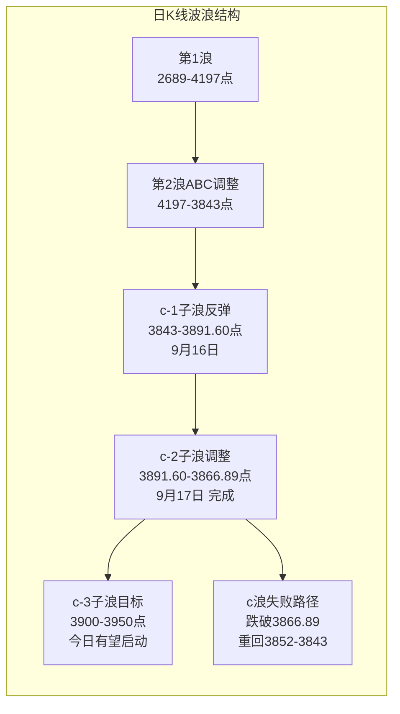
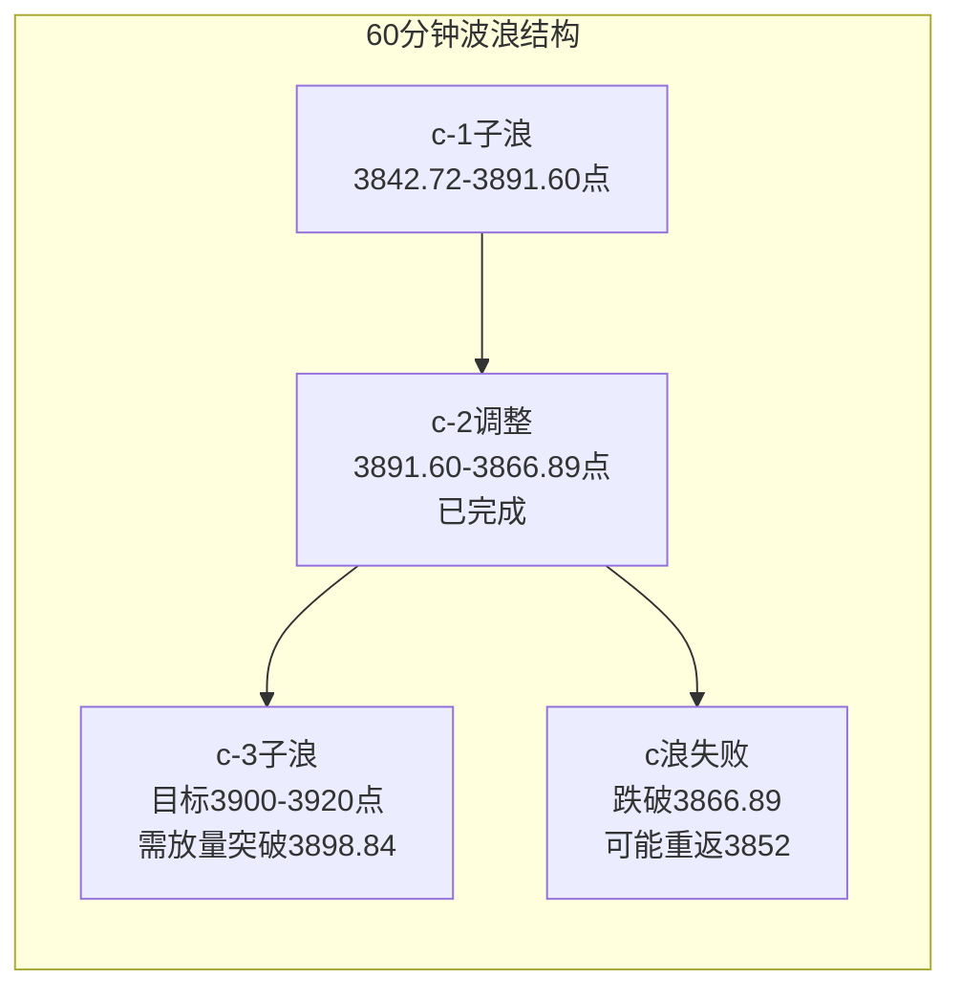

# A股晨报 - 2026年09月18日

> 数据截止时间：2026年9月18日 09:00（北京时间）
> 美联储9月16日加息25bp后，隔夜美股强势反弹，A股c浪反弹有望延续

---

## 一、昨日晚报复盘要点回顾

### 1. 昨日判断回顾

| 指标 | 昨日晚报评估 | 说明 |
|------|------------|------|
| 趋势判断准确率 | 0%（0/1） | 晨报预测"震荡偏强"，实际下跌-0.41%，方向错误 |
| 点位预测准确率 | 75%（3/4） | 区间、强支撑、强压力均准确，北向资金判断错误 |
| 板块预判准确率 | 40%（2/5） | 银行/金融、原油/石化预判正确；半导体/AI、贵金属、通信/光模块预判错误 |
| 综合准确率 | **55%（6/11）** | 核心失误：晨报将美联储加息25bp误判为"维持利率不变" |

### 2. 关键偏差及原因

- **偏差1（趋势判断偏差）**：晨报将美联储9月16日加息25bp误判为"维持利率不变"（鸽派），导致后续分析全部基于错误的利率政策假设。美联储实际以全票通过加息25bp，联邦基金利率升至3.75%-4.00%。隔夜道指大跌1.21%的影响被低估。
- **偏差2（半导体/AI板块偏差）**：基于错误的"鸽派"判断看多半导体/AI，实际美联储鹰派加息对高估值成长股构成直接压制，电子行业主力净流出24亿+。
- **偏差3（贵金属板块偏差）**：基于"美元走弱"逻辑看多贵金属，实际加息后美元走强（100.29），有色金属-2.55%跌幅居首。
- **偏差4（通信/光模块偏差）**：沿用前期"利率弹性"规则看多光模块，但加息环境下该规则反向，通信行业净流出10亿+。

### 3. 沉淀的规则/检查项

- **规则1**：美联储加息（vs维持利率不变）对A股板块影响方向相反。加息→美元走强→贵金属承压、高估值成长股回调；维持利率→美元走弱→贵金属受益、成长股上涨。"利率弹性"规则仅在美联储维持利率或降息时适用，加息时反向。
- **规则2**：美联储加息后，"美元走强→贵金属承压"逻辑链优先于"避险需求"逻辑。加息环境下不应看多贵金属板块。
- **规则3**：重大央行决议结果必须在晨报中核实至少2个独立权威信息源后再写入分析。
- **新增检查项**：Fed决策核实检查项——已确认美联储9月16日加息25bp至3.75%-4.00%，来源：中国银行、东方财富、证券时报、中国经济网等4个独立权威信息源核实通过。

### 4. 对今日分析的启示

- **已修正的基准假设**：美联储已加息25bp（鹰派），不再是"维持利率不变"。今日分析基于正确的加息事实。
- **关键观察**：隔夜美股强势反弹（道指+0.61%、纳指+1.69%），市场已初步消化加息冲击。需评估A股是否跟随反弹。
- **需调整的逻辑**：加息环境下"利率弹性"规则反向，但隔夜美股科技股大涨（英特尔+7.67%、AMD+6.36%），需区分"短期超跌反弹"与"趋势反转"。
- **风险关注**：点阵图暗示年内可能再加息一次（10月概率53%），鹰派信号中期仍可能压制市场。

---

## 二、隔夜市场动态（9月17日收盘后至今）

### 1. 美股市场

| 指数 | 收盘点位 | 涨跌幅 | 涨跌点数 | 备注 |
|------|---------|--------|---------|------|
| 道琼斯工业平均指数 | 51,778.04 | **+0.61%** | +316.14 | 加息后反弹，科技股领涨 |
| 标普500指数 | 7,637.76 | **+1.14%** | +85.95 | 半导体板块涨超3% |
| 纳斯达克综合指数 | 26,418.30 | **+1.69%** | +439.88 | 科技七巨头涨1.76% |

**市场解读**：美联储9月16日加息25bp后，9月17日美股全线反弹。驱动力包括：（1）油价回落缓解通胀担忧，WTI跌至$101.91；（2）初请失业金降至19.6万（8周低点），劳动力市场强劲；（3）10年期美债收益率回落8.8bp至4.93%。半导体板块领涨，iShares半导体ETF（SOXX）涨超3%。 [$TRAE_REF](http://m.toutiao.com/group/7686662003988955658/) [$TRAE_REF](https://www.nasdaq.com/articles/stocks-settle-sharply-higher-crude-oil-and-bond-yields-fall)

**美股主要板块表现**：

| 板块 | 涨跌幅 | 代表个股 |
|------|--------|---------|
| 半导体 | 涨超3% | ARM +8.57%，英特尔 +7.67%，AMD +6.36%，台积电 +2.94% |
| 科技七巨头 | +1.76% | 英伟达 +2.54%，特斯拉 +2.27%，亚马逊 +2.13% |
| 黄金股 | 全线收涨 | 巴里克黄金 +2.67%，纽蒙特 +2.14% |
| 航空股 | 多数收涨 | 西南航空 +3.00%，达美 +2.01% |
| 医药生物 | 多数上涨 | Moderna +8.55%，默克 +1.53% |
| 能源股 | 涨跌不一 | 康菲 +0.51%，埃克森 -0.01% |

### 2. 欧洲/亚太市场

| 指数 | 收盘点位 | 涨跌幅 | 备注 |
|------|---------|--------|------|
| 英国富时100 | 10,816.14 | **+1.19%** | 领涨欧洲 |
| 德国DAX30 | 25,716.71 | **+0.70%** | Nokia大涨6.3% |
| 法国CAC40 | 8,186.93 | **+0.57%** | — |
| 欧洲斯托克50 | 5,362.67 | **+0.93%** | — |
| 恒生指数 | — | -0.44% | 黄金股普跌，科网股走弱 |
| 恒生科技指数 | — | -0.34% | PCB概念股下挫 |

**市场解读**：欧洲主要股指集体上涨，表现优于前日。英国央行（BOE）以6:3投票维持基准利率3.75%不变，并取消长期国债出售计划。欧元区8月CPI同比从3.3%下修至3.2%，核心CPI维持2.4%。 [$TRAE_REF](https://kessler-prod.reta52d8.eas.morningstar.com/news/dow-jones/202609176071/stoxx-europe-50-index-ends-093-higher-at-536267-data-talk)

### 3. 大宗商品

| 品种 | 价格 | 涨跌幅 | 备注 |
|------|------|--------|------|
| WTI原油 | $101.91/桶 | **-0.51%** | 美元走弱但需求预期下降 |
| 布伦特原油 | $104.82/桶 | **-0.95%** | 中东供应风险缓解 |
| COMEX黄金（活跃） | ~$4,380.6/盎司 | **-0.16%** | 基本持平，消化前日跌幅 |
| COMEX白银 | $64.288/盎司 | **+1.66%** | — |
| LME铜 | $14,231/吨 | — | 工业金属价格持稳 |
| 上期所原油主力 | 748.4元/桶 | **-7.00%** | 国内原油暴跌 |

**解读**：国际油价继续回落，WTI跌至$101.91。国内上期所原油主力合约暴跌7%，对石化产业链形成冲击。黄金方面，COMEX黄金活跃合约基本持平（-0.16%），较前日$4,263.53（现货）有所回升，显示加息冲击已被部分消化。白银表现较强（+1.66%）。 [$TRAE_REF](http://www.china.org.cn/world/Off_the_Wire/2026-09/18/content_118701542.shtml) [$TRAE_REF](https://www.cls.cn/)

### 4. 汇率与利率

| 指标 | 数值 | 变动 | 备注 |
|------|------|------|------|
| 美元指数 | 100.248 | 较前日100.29回落 | 加息后先涨后跌 |
| 人民币中间价 | 6.7580 | 上调48个基点 | 稳中偏强 |
| 10年期美债收益率 | 4.93% | **-8.8bp** | 从5.01%回落 |
| 2年期美债收益率 | 4.66% | **-6.8bp** | 从4.74%回落 |

**解读**：美联储加息后美元指数先升至100.29，但隔夜回落至100.248，显示加息冲击已被部分消化。美债收益率全面回落，10年期从5.01%降至4.93%，缓解估值压力。人民币中间价上调48个基点至6.7580，央行表示人民币汇率保持稳中偏强、双向波动。 [$TRAE_REF](http://m.toutiao.com/group/7686646488792891940/) [$TRAE_REF](http://m.toutiao.com/group/7686343185756357155/)

### 5. 重要海外事件

- **英国央行维持利率不变**：9月17日BOE以6:3投票维持3.75%不变，取消长期国债出售计划，偏鸽派信号。
- **美国初请失业金降至19.6万**：低于预期20.7万，为8周低点，劳动力市场仍强劲。
- **美联储10月加息预期**：芝商所工具显示，10月再加息25bp概率已突破53%，点阵图暗示年内可能还有一次加息。
- **中美关税磋商**：商务部9月17日表示，中美双方经贸团队正就300亿美元相互降低关税安排保持密切交流。

---

## 三、今日关注事项

### 1. 重要数据发布（按时间排序）

| 时间 | 数据/事件 | 预期/前值 | 影响 |
|------|----------|----------|------|
| 10:00 | 国新办"十五五"住建高质量发展发布会 | — | 房地产政策预期 |
| 11:40 | 中国8月全社会用电量年率 | 前值1.7% | 经济景气度 |
| 14:00 | 国新办第140届广交会情况发布会 | — | 外贸预期 |
| 21:15 | 美国8月产能利用率/工业产出环比 | — | 美国经济状况 |
| 22:00 | 美国8月谘商会领先指标月率 | 前值0.2% | 经济前景 |

### 2. 政策/监管动态

- **习近平就先进制造业作出重要指示**：强调持续做大做强先进制造业，提升产业链自主可控水平，利好高端制造板块。
- **央行5000亿元买断式逆回购**：9月15日开展6个月期买断式逆回购操作，保持流动性充裕。
- **《金融产品网络营销管理办法》9月30日实施**：利好持牌金融机构及合规金融IT公司。
- **广电总局AI监管**：AI生成广电视听节目须添加内容标识，严禁AI魔改。

### 3. 重要事件

| 事件 | 时间 | 影响 |
|------|------|------|
| **股指期货交割日** | 今日（9月第三个周五） | IF/IH/IC/IM 2609合约交割，尾盘波动可能加大 |
| **富时中国A50季度调整** | 今日收盘后生效 | 纳入：中微公司、生益科技；剔除：牧原股份、万华化学 |
| **华为全联接大会** | 9月17-19日（今日第二天） | AI算力/昇腾产业链催化，发布Peerium计算架构 |
| **中国-东盟博览会** | 9月17-21日 | 首设AI大卖场，中国-东盟AI合作论坛 |

### 4. 公司公告

**重大资产重组/投资**：
- 光启技术：子公司签订9.07亿元超材料产品批产合同
- 藏格矿业：子公司拟1.71亿美元收购KP公司92%股权
- 恺英网络：拟2.98亿美元间接参股韩国娱美德（传奇IP）
- *ST英飞：与国科控股等6家重整投资人签署协议，投资款约28.41亿元

**业绩/回购**：
- 恒瑞医药：首次回购A股33.5万股，方案总额10亿-20亿元
- 红塔证券：拟5,000万-1亿元回购
- 福建高速：控股股东拟增持1.3亿-2.3亿元
- 真兰仪表：董事长提议回购8,000万-1.6亿元

**股东减持**：
- 中国巨石：二股东振石集团减持2,832.64万股，持股比例降至17.79%
- 安凯客车（000968）：二股东拟减持不超0.85%（4天2涨停后减持）
- 湖南裕能：二股东宁德时代持股降至5%以下

**限售股解禁**：
- 佛燃能源（002911）：877.64万股解禁，解禁市值约9,978万元
- 晶丰明源（688368）：324.54万股解禁，解禁市值约47,473万元

**新股申购**：
- 力勤资源（001246）：发行价21.23元/股，市盈率12.98倍，镍全产业链

**重大产业合同**：
- 亿纬锂能（300014）：子公司与Fluence签署206GWh电池供货框架协议（2027-2031年交付）
- 福龙马：与华为云计算签署2亿元环卫自动驾驶技术合作协议

---

## 四、板块与个股分析（结合昨日复盘）

### 1. 基于昨日复盘结论的板块调整

| 板块 | 昨日预判 | 昨日实际 | 今日修正逻辑 |
|------|---------|---------|------------|
| 半导体/AI算力 | 看涨（错误） | 下跌（电子净流出24亿+） | 隔夜美股半导体暴涨（英特尔+7.67%、AMD+6.36%）+华为大会催化，短线反弹概率大，但加息环境下中期承压，定位为"短线反弹"而非"趋势反转" |
| 贵金属/黄金 | 看涨（错误） | 有色-2.55%跌幅居首 | 隔夜COMEX黄金基本持平（-0.16%），美元回落至100.248，加息冲击已部分消化。短期企稳但不追多 |
| 通信/光模块 | 看涨（错误） | 通信净流出10亿+ | 美股科技反弹有正面映射作用，但加息环境下高估值成长仍承压，谨慎看待反弹力度 |
| 银行/金融 | 看跌（正确） | 小幅波动 | 美联储加息→银行息差扩大逻辑中长期利好，但短期市场情绪偏弱 |
| 原油/石化 | 看跌（正确） | 石油石化跌超1% | 隔夜油价继续下跌（WTI -0.51%），国内原油暴跌7%，继续看跌 |

### 2. 隔夜信息驱动的板块机会

**受益板块**：
- **AI/半导体/算力**：（1）隔夜美股半导体暴涨，iShares半导体ETF涨超3%，ARM+8.57%、英特尔+7.67%、AMD+6.36%，正面映射A股科技板块。（2）华为全联接大会发布Peerium计算架构+昇腾960超节点，AI算力自主可控再迎里程碑。（3）美股科技七巨头涨1.76%，英伟达+2.54%。
- **新能源/储能**：（1）亿纬锂能签署206GWh电池供货大单（2027-2031年），储能方向重大利好。（2）宁德时代拟14亿元在雅安新建4万吨碳酸锂产能。（3）储能电池新建项目审批或将收紧，供给端收缩利好头部企业。
- **汽车整车**：（1）昨日汽车行业领涨（+1.62%），主力资金净流入27.31亿。（2）众泰汽车涨停，深股通净买入2,612万元。板块轮动延续概率较大。
- **人形机器人**：2026年上半年全球出货超2.2万台，同比增长近300%，产业化加速。

**受损板块**：
- **石油石化**：（1）隔夜WTI跌至$101.91，国内上期所原油主力暴跌7%。（2）加息抑制经济增长预期，能源需求承压。
- **焦煤/煤炭**：焦煤主力合约大跌近5%至1,535元/吨，黑色系整体走弱。

### 3. 重点关注个股

| 个股 | 关注理由 | 技术位置 | 关注方向 |
|------|---------|---------|---------|
| 亿纬锂能(300014) | 206GWh供货大单，储能重大利好 | 放量突破预期 | 偏多 |
| 华勤技术(603296) | 华为产业链，昇腾超节点受益 | 关注资金流入 | 偏多 |
| 京东方A(000725) | 昨日主力净流入19.79亿，玻璃基封装新进展 | 突破关键均线 | 偏多 |
| 光启技术(002644) | 9.07亿元超材料批产合同 | 关注放量情况 | 偏多 |
| 中微公司(688012) | 富时A50今日纳入，被动资金买入 | 尾盘可能放量 | 偏多 |
| 牧原股份(002714) | 富时A50今日剔除，被动资金卖出 | 关注支撑位 | 偏空 |
| 中国巨石(600176) | 二股东减持2,832万股，持股降至17.79% | 减持压力 | 偏空 |

---

## 五、今日核心判断（必须结构化输出，用于晚报复盘）

### 1. 趋势判断
- 上证指数：**震荡偏强**
- 预测区间：3,866点 - 3,920点
- 核心逻辑：隔夜美股全线反弹（道指+0.61%、纳指+1.69%），美元回落、美债收益率下行，外部环境改善。A股c浪反弹处于c-2子浪调整末端，若3,866支撑有效，c-3子浪有望启动。但今日为期指交割日，叠加美联储鹰派信号（10月加息概率53%），反弹力度可能受限。

### 2. 关键点位
- 强支撑位：3,843点（依据：C-5浪低点，9月16日盘中假跌破后收回，强底部信号）
- 弱支撑位：3,866点（依据：昨日最低点3,866.89，c-2调整低点）
- 强压力位：3,950点（依据：20日均线，空头排列上轨）
- 弱压力位：3,898点（依据：昨日最高点3,898.84，c-1高点，突破则c-3启动）

### 3. 板块预判
- 看涨板块：
  - （1）AI/半导体/算力（逻辑：隔夜美股半导体暴涨+华为Peerium架构发布+超跌反弹需求。注意：定位为短线反弹，加息环境中期承压）
  - （2）新能源/储能（逻辑：亿纬锂能206GWh大单+宁德时代扩产+供给端收缩利好头部企业）
  - （3）汽车整车（逻辑：昨日领涨+主力净流入27.31亿+板块轮动延续）
- 看跌板块：
  - （1）石油石化（逻辑：WTI跌至$101.91+国内原油暴跌7%+加息压制需求预期）
  - （2）焦煤/煤炭（逻辑：焦煤主力跌近5%+黑色系走弱）
- 风险板块：高位连板股（闽东电力6连板后跌停开板示范效应，高位股风险释放中，需回避）

### 4. 资金面判断
- 北向资金预期：**净流入10-30亿元**（隔夜美股反弹+美元回落+美债收益率下行，外资风险偏好回升。但鹰派信号可能制约流入规模）
- 成交量预期：**平量/微放量**（1.75-1.85万亿，期指交割日可能增加成交活跃度）

### 5. 风险预警（按优先级排序）
- 高风险：美联储10月再加息预期（概率53%），鹰派信号可能持续压制高估值成长股；期指交割日尾盘波动加剧
- 中风险：高位连板股集中崩盘风险（闽东电力示范效应），市场情绪退潮可能拖累指数
- 低风险：富时A50调仓尾盘波动（中微公司纳入、牧原股份剔除）；国内经济数据偏弱（8月社零仅增1.1%）

### 6. 昨日复盘规则应用
- 应用规则1（Fed加息反向规则）：今日已正确识别美联储加息25bp事实（多源核实），"利率弹性"规则反向适用。加息环境下半导体/AI板块预判为"短线超跌反弹"而非"趋势看涨"，区别于维持利率时的"趋势看涨"。
- 应用规则2（美元走强→贵金属承压）：隔夜美元回落至100.248（较100.29微跌），COMEX黄金基本持平，加息冲击已部分消化。贵金属板块暂维持中性，不追多。
- 应用规则3（信息核实）：美联储加息25bp至3.75%-4.00%已通过4个独立权威信息源核实（中国银行、东方财富、证券时报、中国经济网），核实通过。
- 应用规则4（事件后量能切换）：美联储加息已落地（9月16日），市场从"事件前观望缩量"可能切换至"事件后确认放量"，今日成交量有望维持1.8万亿以上。

---

## 六、投资策略建议（必须具体可执行）

### 1. 仓位建议
- 总仓位：**55%**（较昨日45%上调10%，因外部环境改善+c-3反弹概率增加）
- 机动仓位：**15%**（可用于短线科技股反弹操作）

### 2. 持仓结构
- 进攻仓位：35%（AI/半导体20%、新能源/储能10%、汽车5%）
- 防御仓位：20%（医药生物10%、消费5%、银行/高股息5%）
- 现金：45%

### 3. 操作策略
- 买入条件：
  - 上证指数回踩3,866-3,870区间企稳放量时，加仓AI/半导体（目标3,920）
  - 亿纬锂能回踩均线支撑位时，建仓新能源/储能
  - 指数放量突破3,898时，追加机动仓位至15%
- 卖出条件：
  - 上证指数反弹至3,920附近遇阻回落时，减仓进攻仓位5%
  - 指数放量跌破3,866时，减仓至40%（c浪反弹失败信号）
- 止损位：
  - 指数止损：跌破3,843（C-5浪低点），总仓位降至30%
  - 个股止损：买入价下方5%

### 4. 与昨日策略对比
- 仓位调整：从45%上调至55%（原因：隔夜美股反弹+美元回落+c-2调整末端，反弹概率增加）
- 板块调整：
  - 增配AI/半导体（从谨慎转为短线反弹参与，因美股半导体暴涨+华为催化，但定位为短线）
  - 增配新能源/储能（亿纬锂能206GWh大单催化）
  - 维持减配石油石化（油价继续下跌）
  - 贵金属从中性偏多转为中性（加息冲击消化但不追多）

---

## 七、波浪理论多周期分析

### 1. 月K线波浪分析
- 当前波浪位置：大周期第2浪C浪末端区域，C-5浪低点3,843点（9月16日盘中假跌破后收回）。9月17日收3,875.60点，仍在3,850上方。月线仍为带下影线的小阴线形态。
- 浪型结构描述：第1浪（2024年9月2,689点→2026年6月4,197点）→第2浪ABC调整（4,197点→3,852点→3,843点）。C浪内部5子浪结构已完成。
- 关键目标位：支撑3,802点（20月均线）、3,750-3,800点；压力3,982点（5月均线）、4,012点（10月均线）。
- 验证条件：9月如收在3,850点上方，底部确认。今日若放量上攻，月线收阳概率增加。

### 2. 周K线波浪分析
- 当前波浪位置：周线C-5浪已完成，进入a-b-c反弹中的c浪阶段。c-2子浪调整进行中。
- 浪型结构描述：9月14日缩量十字星→9月16日放量阳线c-1子浪启动→9月17日冲高回落c-2调整（3,898.84→3,866.89→3,875.60）。
- 关键目标位：支撑3,843点、3,852点；压力3,895点、3,920点（5周均线）、3,958点（上周高点）。
- 验证条件：周线MACD绿柱进入30-35根K线变盘窗口。今日若反弹放量，绿柱缩短概率增加。

### 3. 日K线波浪分析
- 当前波浪位置：日线a-b-c反弹中的c浪进行中，c-2子浪调整末端，c-3有望启动。
- 浪型结构描述：
  - 9月11日C-5浪最后一跌（3,888点）
  - 9月14-15日b浪整理（缩量十字星）
  - 9月16日放量阳线c-1子浪启动（3,843→3,891.60，+0.71%）
  - 9月17日冲高回落c-2子浪调整（3,898.84→3,866.89→3,875.60）
- 关键目标位：支撑3,866.89（昨日低点）、3,852点、3,843点；压力3,898.84（昨日高点）、3,920点（5周均线）、3,950点（20日均线）。
- 验证条件：今日若放量站稳3,898.84上方，c-3子浪启动，目标3,920-3,950点；若跌破3,866.89，c浪反弹可能已结束。

### 4. 60分钟K线波浪分析
- 当前波浪位置：60分钟级别c-2子浪调整末端，MACD可能由死叉重新金叉。
- 浪型结构描述：c-1（3,842.72→3,891.60）→c-2调整（3,891.60→3,866.89→3,875.60）。隔夜美股大涨可能推动c-3启动。
- 关键目标位：支撑3,866.89、3,852点；压力3,898.84、3,920点。
- 验证条件：60分钟MACD如重新金叉+放量突破3,898.84，c-3确认启动。

### 5. 30分钟K线波浪分析
- 当前波浪位置：30分钟级别c-2调整接近尾声，KDJ从高位下探至50附近。
- 浪型结构描述：c-1反弹至3,898.84后回落，30分钟KDJ向下发散后接近超卖区。
- 关键目标位：支撑3,866.89、3,852点；压力3,898.84、3,920点。
- 验证条件：30分钟KDJ在50附近重新金叉+放量上攻，c-3启动信号。

### 6. 波浪图（Mermaid绘制）

### 7. 波浪理论综合判断
- 多周期共振状态：月/周/日线仍处于C浪末端或c浪反弹阶段，方向趋于一致（向上）。隔夜美股大涨改善短周期信号，60分钟/30分钟级别c-2调整接近尾声，多周期共振向上概率增加。
- 当前操作级别：以日线级别操作为主，60分钟级别辅助确认。c-2调整末端+c-3启动临界点，今日为关键观察日。
- 后续演变路径：
  - **最可能路径**（55%，概率上调10%）：c-2调整结束后c-3启动，反弹至3,900-3,920点区域。驱动力：隔夜美股反弹+美元回落+华为催化。今日需放量站稳3,875上方。
  - **备选路径1**（25%）：3,895-3,898遇阻，在3,866-3,898区间震荡1-2个交易日后再上行。期指交割日波动可能延长调整时间。
  - **备选路径2**（20%，概率下调5%）：跌破3,866.89，c浪反弹提前结束，重回3,852-3,843支撑测试。鹰派加息滞后效应可能放大。
- 关键拐点信号：
  - 向上：放量突破3,898.84且成交量维持1.8万亿以上，确认c-3启动。
  - 向下：放量跌破3,866.89（昨日低点），c浪反弹面临失败风险。
- 风险提示：波浪理论存在主观性；美联储鹰派加息的滞后效应可能压制反弹空间；日线均线仍呈空头排列（5/10/20/60日均线）；期指交割日可能加剧波动；闽东电力断板可能引发短线情绪退潮。
- 规律分析引用：根据第37周运行规律分析报告，当前处于大周期第2浪C浪末端，C浪内部5子浪已完成，多周期底部共振概率增加。"C浪末端反弹力度往往弱于预期"——昨日冲高回落已验证，今日能否突破3,898.84是c-3能否启动的关键。

---

## 八、信息来源

1. **官方数据来源**：美联储FOMC声明、中国人民银行、中国外汇交易中心、中国金融期货交易所、国家统计局
2. **权威财经媒体**：新华社、证券时报、中国经济网、中新经纬、界面新闻、金融界
3. **数据平台**：东方财富网、同花顺财经、财联社、Morningstar/Dow Jones、Nasdaq.com、LME
4. **海外信息源**：Nasdaq.com、BNN Bloomberg、ARIVA.DE、Kitco
5. **信息截止时间**：2026年9月18日 09:00（北京时间）

---

*本期晨报由AI代理自动生成，仅供参考，不构成投资建议。投资有风险，入市需谨慎。*
