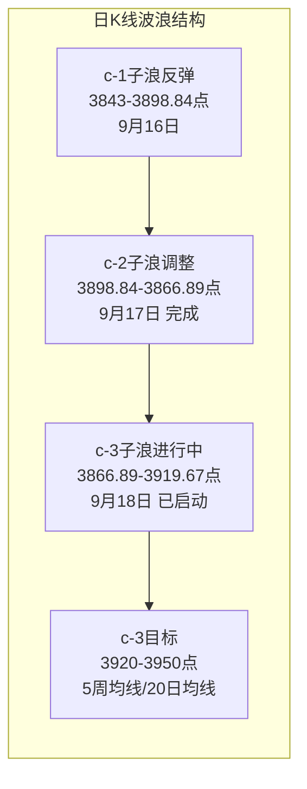

# A股晨报 - 2026年09月21日

> 数据截止时间：2026年9月21日 09:30（北京时间）
> 中美经贸磋商开启 + 长鑫存储G5量产 + 国际油价暴跌，震荡偏强延续反弹

---

## 一、昨日晚报复盘要点回顾

### 1. 昨日判断回顾
- 趋势判断准确率：100%（1/1）——"震荡偏强"判断正确，实际涨0.94%中阳线，强度超预期
- 点位预测准确率：75%（3/4）——区间、强支撑、强压力准确；成交量判断偏差
- 板块预判准确率：67%（4/6）——半导体、新能源、石油石化、煤炭正确；汽车、地产失误

### 2. 关键偏差及原因
- 偏差1（成交量）：预测1.75-1.85万亿，实际2.08万亿，因未纳入期指交割日放量+人民币升破6.7关口提振
- 偏差2（汽车板块）：预测看涨，实际领跌，因"前日领涨板块次日获利回吐"规则应用不足
- 偏差3（房地产）：未纳入看涨，实际+3.38%领涨，因对国新办政策发布会催化扫描不足

### 3. 沉淀的规则/检查项
- 规则1：期指交割日成交量预期上调10-15%
- 规则2：人民币汇率突破重要关口时纳入成交量和趋势分析因子
- 规则3：前日领涨且主力净流入超20亿的板块，次日预判至少降低一个评级
- 规则4：国新办等重大政策发布会提前纳入板块催化扫描
- 规则5：美联储加息落地后若美元不涨反跌，则"利空出尽"反弹力度往往超预期

### 4. 对今日分析的启示
- 关注风险点：房地产（前日领涨+3.38%）今日获利回吐压力；长假临近的避险情绪
- 调整分析逻辑：将"中美经贸磋商""国际油价暴跌"两个新变量纳入趋势与板块判断

---

## 二、隔夜市场动态（9月18日收盘后至今）

### 1. 美股市场（9月18日周五"四巫日"收盘）
| 指数 | 收盘点位 | 涨跌幅 | 说明 |
|------|---------|--------|------|
| 道琼斯指数 | 51,682.64 | **-0.18%** | 本周累跌1.69%，周线三连跌 |
| 标普500指数 | 7,650.50 | **+0.17%** | 本周累跌0.08% |
| 纳斯达克指数 | 26,522.54 | **+0.39%** | 半导体走强、加密货币概念大涨 |

四巫日交投震荡，美股涨跌不一：道指小幅收跌（周线三连跌），纳指在半导体板块带动下收涨。隔夜半导体与加密货币概念领涨，对今日A股科技成长板块形成正面映射。 [$TRAE_REF](https://caifuhao.eastmoney.com/news/20260921090144663679700) [$TRAE_REF](https://www.nasdaq.com/articles/us-stocks-close-mixed-following-choppy-trading-day)

### 2. 欧洲/亚太市场（9月18日收盘）
| 指数 | 涨跌幅 |
|------|--------|
| 英国富时100 | **-1.50%** |
| 德国DAX30 | **-1.63%** |
| 法国CAC40 | **-1.62%** |
| 欧洲斯托克50 | 约-1.1% |

欧洲主要股指9月18日集体下挫逾1%，受中东地缘风险反复及电信板块拖累，与美股走势明显背离，构成今日A股开盘的偏空外盘因素。 [$TRAE_REF](https://finance.eastmoney.com/a/202609183878915549.html)

### 3. 大宗商品
| 品种 | 最新价/涨跌幅 | 备注 |
|------|--------------|------|
| WTI原油 | 约96美元/桶 | 连续三日承压于96美元附近 |
| 国内SC原油 | **-5.46%**（713.2元/桶） | 9月21日早盘短线下挫 |
| COMEX黄金 | +0.37%（4,415.9美元/盎司） | 本周累涨0.16% |
| COMEX白银 | +1.04%（66.78美元/盎司） | 本周累涨2.45% |
| LME铜 | 逼近15,000美元/吨 | 历史新高附近，连涨11周 |

**关键信号**：国际油价大幅回落，国内原油期货今日早盘一度跌超5%，主因中东能源供应担忧缓和（沙特东西向输油管道产能恢复、霍尔木兹海峡运输逐步恢复）。油价暴跌利好下游制造业与消费，但直接冲击石油石化、煤炭等能源板块。贵金属延续反弹，铜价逼近1.5万美元历史高位。 [$TRAE_REF](https://finance.eastmoney.com/a/202609213879543680.html) [$TRAE_REF](https://finance.sina.com.cn/money/future/roll/2026-09-18/doc-inisfprh8561552.shtml) [$TRAE_REF](https://so.eastmoney.com/News/s?keyword=COMEX%E7%99%BD%E9%93%B62512) [$TRAE_REF](https://www.cls.cn/subject/1741)

### 4. 汇率与利率
- 美元指数：约100.2附近，震荡回落
- 人民币汇率：在岸人民币9月18日收报6.6973，升破6.7关口（创2023年1月以来新高）；中间价6.7521，连续第8个交易日调升
- 美债10年期收益率：约4.93%（回落）

人民币升破6.7的强势格局延续，叠加中美经贸磋商开启，构成今日A股资金面与情绪面的重要支撑。 [$TRAE_REF](https://www.chinamoney.com.cn/chinese/index.html?aisiteOutPageId=105288)

### 5. 重要海外事件
- **中美经贸磋商开启**：当地时间9月20日上午，中美两国经贸团队在美国纽约开始举行经贸磋商，为近期最重要的地缘与经济信号。 [$TRAE_REF](https://m.thepaper.cn/newsDetail_forward_34113470)
- **AI反垄断诉讼**：OpenAI、Anthropic、xAI、谷歌在美国遭集体诉讼（指控"非法放缓AI发展协议"），短期对海外AI情绪略有扰动。

---

## 三、今日关注事项

### 1. 重要数据/事件
- **LPR报价（9月20日公布）**：1年期3.0%、5年期以上3.5%，**连续16个月不变**，符合市场预期，对市场影响中性。 [$TRAE_REF](http://jingji.cctv.com/2026/09/20/ARTIF8PP8kwZd58Rr2yCO0VT260920.shtml) [$TRAE_REF](http://www.ce.cn/macro/more/202609/t20260921_3227425.shtml)
- **中美经贸磋商（进行中）**：磋商进展是今日最重要的不确定变量，若释放积极信号将显著提振风险偏好。
- **世界制造业大会（合肥）**：工信部强调深入推进"人工智能+制造"、发展开源基座模型和垂类模型，利好AI算力与智能制造。 [$TRAE_REF](https://m.thepaper.cn/newsDetail_forward_34113470)

### 2. 政策/监管动态
- **国家药监局**：支持医药产业规模化、集约化、高端化，支持医药领域扩大对外开放，着力培养3-5个国际竞争力生物医药创新聚集地，利好创新药、CXO。 [$TRAE_REF](https://m.thepaper.cn/newsDetail_forward_34113470)
- **市场监管总局**：反垄断执法聚焦原料药、水电气暖、平台经济，规范涉企执法，对平台经济情绪有一定扰动。

### 3. 公司公告/产业
- **长鑫存储**：第五代DRAM技术平台（G5）实现量产，推出24GB LPDDR5X，比肩行业顶尖工艺节点，存储芯片里程碑突破，利好存储/半导体产业链。 [$TRAE_REF](https://m.thepaper.cn/newsDetail_forward_34113470)
- **MLCC**：AI拉动高容量型号缺货涨价，部分现货暴涨数倍，利好被动元件。 [$TRAE_REF](https://m.thepaper.cn/newsDetail_forward_34113470)

### 4. 新股申购/资金面
- 新股：周一（9/21）可申购北交所新股**宇特光电**；周四（9/24）可申购创业板新股**粤芯半导体**（大湾区半导体龙头）。 [$TRAE_REF](http://m.toutiao.com/group/7687489813766750722/)
- 资金面：本周二（9/22）有1,800亿元3个月期国库现金定存到期；长假临近，关注资金面波动。 [$TRAE_REF](http://m.toutiao.com/group/7687765186299626026/)

---

## 四、板块与个股分析

### 1. 基于昨日复盘结论的板块调整
- 昨日看涨的半导体/算力：今日继续看多，叠加长鑫存储G5量产、美股半导体走强、粤芯半导体IPO等三重催化。
- 昨日领涨的房地产：按"前日领涨次日获利回吐"规则，今日预期冲高回落，降低评级至"震荡"，不追高。
- 昨日领跌的银行/煤炭：银行继续受风险偏好回升拖累；煤炭受油价暴跌联动承压。

### 2. 隔夜信息驱动的板块机会
- 受益板块：（1）半导体/存储/算力（长鑫存储G5量产+美股半导体走强+华为催化）；（2）医药/创新药/CXO（药监局支持高端化与对外开放）；（3）黄金/有色（铜逼近1.5万美元、贵金属延续反弹）；（4）AI/智能制造（世界制造业大会政策催化）。
- 受损板块：（1）石油石化/煤炭（原油暴跌5%）；（2）交通运输（航空燃油成本下行利好，但油价暴跌利好交运，此条为受益）；（3）房地产（前日大涨后获利回吐）。

### 3. 重点关注个股
- **长鑫存储概念**：兆易创新、深科技等存储链受益G5量产与国产替代逻辑，关注放量突破。
- **创新药/CXO龙头**：药明康德、恒瑞医药，政策利多+估值修复，中线布局。
- **黄金/铜业**：紫金矿业、山东黄金，铜金共振，中线持有。

---

## 五、今日核心判断

### 1. 趋势判断
- 上证指数：**【震荡偏强】**
- 预测区间：**3,890点 - 3,950点**
- 核心逻辑：中美经贸磋商开启+人民币升破6.7+半导体多重催化构成向上支撑；但欧股跌逾1%、国际油价暴跌冲击能源权重、长假临近获利了结情绪构成扰动，反弹延续但力度或较上周五收敛。

### 2. 关键点位
- 强支撑位：**3,866点**（依据：c-2子浪低点，跌破则c-3浪反弹失败）
- 弱支撑位：**3,898点**（依据：c-1高点3,898.84，突破后转为第一支撑）
- 强压力位：**3,958点**（依据：上周反弹高点，中期压力）
- 弱压力位：**3,920点**（依据：5周均线，短期第一压力）

### 3. 板块预判
- 看涨板块：（1）半导体/存储/算力（逻辑：长鑫存储G5量产+美股半导体走强+华为催化）（2）医药/创新药/CXO（逻辑：药监局政策利多+估值修复）（3）黄金/有色（逻辑：铜创新高+贵金属反弹）
- 看跌板块：（1）石油石化/煤炭（逻辑：原油暴跌5%，直接冲击）（2）房地产（逻辑：前日领涨+3.38%后获利回吐压））
- 风险板块：房地天（追高风险）、高位连板股（退潮风险）、次新股（高波动）

### 4. 资金面判断
- 北向资金预期：【净流入】约20-50亿元（人民币强势+中美磋商改善风险偏好+外资参与度提升）
- 成交量预期：【平量至微放量】1.9-2.1万亿元（中美磋商超预期则放量，否则长假前观望）

### 5. 风险预警
- 高风险：国际油价暴跌引发的能源板块系统性承压；长假前高位股获利了结。
- 中风险：欧股跌逾1%映射；美股四巫日后波动传导；中美磋商若不及预期。
- 低风险：高位连板股退潮；次新股高波动；创业板/科创50获利回吐。

### 6. 波浪理论参考
- **当前波浪位置**：大周期第2浪C浪末端的a-b-c反弹中，c-3子浪已确认启动（9月18日放量突破c-1高点3,898.84）。
- **关键支撑/压力位波浪验证**：c-3浪目标位=3,920（5周均线）→3,950（20日均线）→3,958（上周高点）；跌破3,866（c-2低点）则c-3浪假设失效。
- **多周期共振**：月/周/日线方向一致向上，60分钟/30分钟级别c-3子浪运行中，多周期共振偏多。

### 7. 昨日复盘规则应用
- 应用规则1（期指交割日量能）：今日非交割日，无需上调量能预期，回归平量判断。
- 应用规则2（人民币关口提振）：人民币升破6.7延续，趋势与资金面判断维持偏多。
- 应用规则3（前日领涨回吐）：房地产昨日+3.38%领涨，今日下调评级，规避追高。
- 应用规则4（政策发布会催化）：中美磋商、药监局、制造业大会已纳入板块扫描。

---

## 六、投资策略建议

### 1. 短线策略（1-3个交易日）
- 短线仓位：**30%**
- 买入条件：上证回踩3,898点企稳不破，或半导体/医药板块放量突破时介入
- 卖出条件：指数触及3,950点压力且量能萎缩，或单日冲高回落收阴
- 止损位：3,866点或个股跌幅5%
- 短线标的：（1）存储/半导体（逻辑：长鑫存储G5量产+美股半导体映射+事件驱动）（2）创新药/CXO（逻辑：药监局政策利多+超跌反弹）

### 2. 中线策略（1-4周）
- 中线仓位：**40%**
- 方向判断：【持有】
- 目标区间：上证指数 3,920点 - 3,980点
- 中线布局板块：（1）半导体/存储（逻辑：国产替代+景气上行）（2）医药/创新药（逻辑：政策扶持+估值低位）（3）黄金/有色（逻辑：铜金共振+避险配置）
- 止盈条件：指数到达3,980点或波段涨幅达6%
- 止损条件：指数跌破3,843点（C-5低点）或趋势确认反转

### 3. 仓位分配总览
| 策略类型 | 仓位比例 | 方向 | 重点板块 |
|---------|---------|------|---------|
| 短线 | 30% | 做多 | 半导体、医药 |
| 中线 | 40% | 持有 | 半导体、医药、有色 |
| 现金 | 30% | — | — |

### 4. 与昨日策略对比
- 短线仓位：维持30%，方向由"反弹博短"调整为"回踩低吸"，不追高
- 中线仓位：维持40%，新增有色金属布局（铜创新高）
- 板块调整：新增医药/创新药（政策催化）、有色（铜金共振）；降低房地产关注度（获利回吐）

---

## 七、信息来源
1. 官方数据来源：中国人民银行、国家统计局、国家能源局、中国外汇交易中心、新华社、央视
2. 权威财经媒体：澎湃新闻、证券时报、中国证券报、财联社、每日经济新闻
3. 数据平台：东方财富、同花顺、中国货币网、中国金融信息网
4. 海外信息源：Nasdaq.com、Schwab、Fidelity、新浪财经
5. 信息截止时间：2026年9月21日 09:30（北京时间）

---

*本期晨报由AI代理自动生成，仅供参考，不构成投资建议。投资有风险，入市需谨慎。*