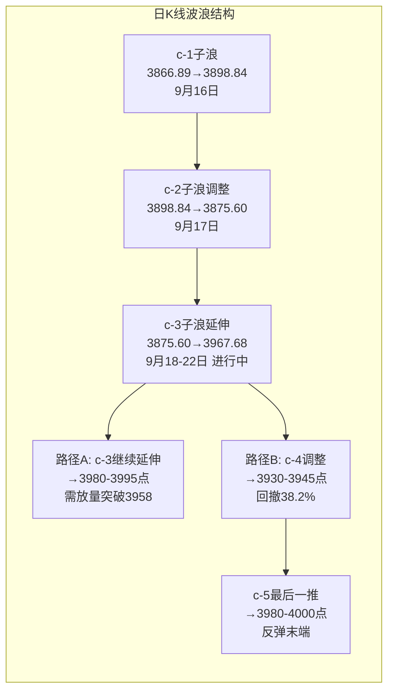
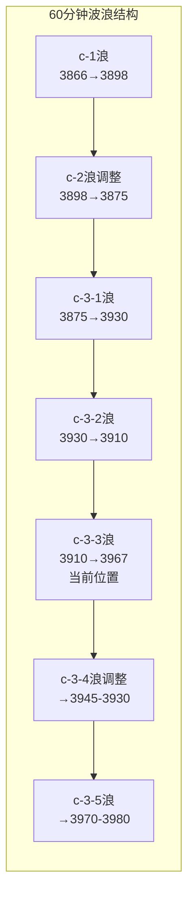

# A股晚报 - 2026年09月22日

> 数据截止时间：2026年9月22日 20:00（北京时间）
> 核心观点：沪指缩量震荡微涨，科技股结构性行情主导，c-3浪延伸确认，关注量能持续性

---

## 一、市场回顾

### 1. 主要指数表现

| 指数 | 收盘点位 | 涨跌幅 | 最高 | 最低 | 成交额 |
|------|---------|--------|------|------|--------|
| 上证指数 | 3,952.13 | **+0.06%** | 3,967.68 | 3,945.42 | 约9,500亿 |
| 深证成指 | 13,723.74 | **-0.05%** | 13,914.21 | 13,691.09 | 约11,900亿 |
| 创业板指 | 3,399.93 | **+0.01%** | — | — | — |
| 科创50 | 1,665.04 | **+0.46%** | — | — | 约3,441亿 |

**市场特征**：
- 三大指数微幅震荡，沪指收小阳十字星，深成指微跌，创业板指几乎平收
- 科创50相对强势，涨0.46%，科技股结构性行情持续
- 市场呈现"指数平淡、个股分化"格局，大盘波动收窄

### 2. 成交量能

| 指标 | 数值 | 环比变化 | 说明 |
|------|------|---------|------|
| 两市成交额 | **2.14万亿元** | 缩量约2,070亿元 | 连续29个交易日超2万亿 |
| 主力净流入 | **-149.51亿元** | 净流出扩大 | 主力资金连续净流出 |
| 沪深300主力净流入 | **-26亿元** | — | 大盘股资金小幅流出 |
| 北向资金成交额 | **2,911.50亿元** | — | 占两市总成交13.63% |

**量能特征**：
- 成交额从昨日高位回落，但仍维持2万亿以上活跃水平
- 主力资金净流出149.51亿元，较昨日净流入30.62亿元转为流出
- 电子板块逆势获主力净流入46.29亿元，资金聚焦科技主线

### 3. 市场情绪

| 指标 | 数值 | 说明 |
|------|------|------|
| 上涨家数 | 约2,104只 | 占比约41.6% |
| 下跌家数 | 约2,951只 | 占比约58.4% |
| 涨停数 | 73-105只 | 结构性涨停活跃 |
| 跌停数 | 3-15只 | 风险可控 |
| 封板率 | 约77% | 涨停质量较高 |

**情绪特征**：
- 个股跌多涨少，但指数微涨，呈现典型结构性行情
- 电子板块14只个股涨停，科技股赚钱效应集中
- 市场情绪较昨日降温，但科技主线热度不减

---

## 二、热点板块与异动分析

### 1. 当日领涨板块

| 板块 | 涨跌幅 | 驱动因素 | 代表个股 |
|------|--------|---------|---------|
| 电子 | **+3.71%** | 美股半导体爆发映射+国产替代+AI算力需求 | 鸿富瀚、长盈精密、中科蓝讯、唯特偶20cm涨停；芯原股份+17%；立讯精密涨停 |
| 计算机 | **+1.70%** | AI算力+信创催化 | 初灵信息20cm涨停；中科曙光、东华软件涨停 |
| 有色金属 | **+0.98%** | 部分细分品种活跃 | — |

**电子板块详解**：
- 半导体和消费电子成为市场焦点，Wind摩尔线程指数、智能音箱指数均涨逾6%，GPU指数涨逾5%
- 催化剂：隔夜美股半导体全面爆发（费城半导体+4.29%、ARM+17.16%、AMD市值破万亿）、Meta推出消费级AI智能体Muse、长鑫存储G5量产持续发酵、粵芯半导体IPO临近
- 资金流向：电子板块获主力资金净流入46.29亿元，融资资金上周加仓电子板块166.42亿元，资金正反馈持续

### 2. 当日领跌板块

| 板块 | 涨跌幅 | 原因分析 |
|------|--------|---------|
| 社会服务 | **-2.04%** | 消费复苏预期转弱，国庆前获利回吐 |
| 美容护理 | **-1.36%** | 消费板块整体承压 |
| 商贸零售 | **-1.31%** | 消费数据疲软预期 |
| 电力设备 | — | 主力资金净流出31.43亿元居首 |
| 传媒 | — | 主力资金净流出28.46亿元 |
| 医药生物 | — | 主力资金净流出24.75亿元，前日大涨后获利回吐 |

### 3. 个股异动复盘

**涨停焦点**：
- **天普股份**：14连板，连续涨停板数量最多，注意追高风险
- **杭电股份**：5连板
- **云南旅游**：4连板
- **N中塑（中塑股份）**：新股上市暴涨677.86%，两度临停
- **N世纪（世纪数码）**：新股上市暴涨521.83%

**主力资金净流入TOP5个股**：
1. 领益智造：+17.33亿元
2. 英维克：+11.32亿元
3. 山子高科：+10.50亿元
4. 立讯精密：+9.47亿元
5. 长盈精密：+8.19亿元

---

## 三、关键数据与事件回顾

### 1. 国内重要经济数据

- **人民币中间价**：9月22日报6.7459，调升28个基点，人民币维持强势格局
- **在岸人民币**：前一交易日收盘6.6952，开盘6.6957，站稳6.7关口上方

### 2. 政策消息

- **央行公开市场操作**：9月22日开展350亿元7天期逆回购操作，操作利率1.40%，当日无逆回购到期，净投放350亿元，维护银行间流动性合理充裕
- **央行外资金融机构座谈会（9月21日）**：潘功胜表示将继续推动金融高水平开放，稳步扩大金融市场双向开放，利好金融板块情绪
- **世界制造业大会（合肥，进行中）**：工信部强调深入推进"人工智能+制造"，利好AI算力与智能制造
- **国家药监局**：支持医药产业规模化、集约化、高端化，培养3-5个国际竞争力生物医药创新聚集地

### 3. 公司重要公告

- **欧菲光**：发布声明称网传信息不实，已向相关部门举报，生产经营正常
- **ST椰岛**：涉嫌信息披露违法违规，遭证监会立案
- **江波龙**：完成8,000万元股份回购（229.06万股），方案实施完毕
- **燕京啤酒**：控股股东一致行动人拟增持5,000万元-1亿元
- **力勤资源**：网上中签结果出炉（约24.2万个中签号）

---

## 四、海外市场联动

### 1. 美股市场（9月21日周一收盘）

| 指数 | 收盘点位 | 涨跌幅 | 说明 |
|------|---------|--------|------|
| 道琼斯指数 | 52,048.83 | **+0.71%** | 金融股、航空股领涨 |
| 标普500指数 | 7,764.70 | **+1.49%** | 科技股全线爆发 |
| 纳斯达克指数 | 27,122.09 | **+2.26%** | 创收盘历史新高，时隔近4个月再创新高 |

**美股亮点**：
- 半导体板块全面爆发：费城半导体指数涨4.29%，创8月4日以来最佳单日表现
- AMD涨9.95%，市值首次突破1万亿美元（股价615.52美元）
- ARM涨17.16%，英特尔涨12.14%，高通涨9.29%
- Meta涨11.43%（推出消费级AI智能体Muse）
- 中概股多数上涨，纳斯达克中国金龙指数涨0.71%

### 2. 欧洲/亚太市场（9月21日收盘）

| 指数 | 收盘点位 | 涨跌幅 |
|------|---------|--------|
| 德国DAX | 25,575.01 | **+1.07%** |
| 法国CAC40 | 8,138.94 | **+0.92%** |
| 英国富时100 | 10,739.01 | **+0.75%** |
| 欧洲斯托克600 | 641.93 | **+1.00%** |
| 香港恒生指数 | — | **+1.18%** |
| 韩国KOSPI | 7,007.72 | **+1.65%** |

### 3. 大宗商品

| 品种 | 收盘价 | 涨跌幅 | 备注 |
|------|--------|--------|------|
| WTI原油（10月） | 95.78美元/桶 | **-4.51%** | 跌4.52美元，中东局势缓和 |
| 布伦特原油（11月） | 100.34美元/桶 | **-3.40%** | 跌3.53美元 |
| 现货黄金（伦敦金现） | 4,342.74美元/盎司 | **-0.79%** | 避险需求消退 |
| COMEX黄金 | 4,381.0美元/盎司 | **-0.99%** | — |
| COMEX白银 | 66.530美元/盎司 | **-0.92%** | — |

---

## 五、汇率与利率

### 1. 人民币汇率

| 指标 | 数值 | 变化 |
|------|------|------|
| 美元/人民币中间价 | 6.7459 | 调升28个基点 |
| 在岸人民币前一交易日收盘 | 6.6952 | 升破6.7关口 |
| 在岸人民币开盘 | 6.6957 | — |

**分析**：人民币维持强势格局，中间价连续调升，外资流入基础稳固。

### 2. 国内利率市场

- 央行7天期逆回购利率：1.40%
- 美债10年期收益率：约4.956%（跌破5%关口）

### 3. 央行公开市场操作

- 9月22日：350亿元7天期逆回购，净投放350亿元
- 9月21日：1,650亿元7天期逆回购

---

## 六、收盘后重要信息

### 1. 盘后公告

- 暂无重大盘后公告

### 2. 夜盘走势

- 布伦特原油：94.57美元，-1.48%（夜盘继续下跌）
- 美原油：93.30美元，-2.29%
- 现货黄金：4,351.99美元，+0.19%（小幅反弹）

### 3. 次日关注

- **9月24日（周四）**：创业板新股**粵芯半导体**申购（大湾区半导体龙头）
- **国庆长假前效应**：下周为国庆假期前最后完整交易周，历史上周成交量平均递减15-20%
- **中美经贸磋商**：持续关注磋商进展

---

## 七、波浪理论多周期分析

### 1. 月K线波浪分析

- **当前波浪位置**：大周期第2浪C浪末端后的a-b-c反弹c浪阶段
- **浪型结构描述**：8月大阴线从约4,100点跌至约3,888点，9月呈现带长下影线的小阳线形态（最低3,842.72，收盘3,952.13）。下影线长度约46点，实体约64点，下影线/实体≈0.72，形成止跌企稳组合
- **关键目标位**：5月均线约3,980-3,985点为月度核心压力；20月均线3,800-3,810点为长期支撑
- **验证条件**：如9月月线收阳（站上3,888点），将形成"8月大阴+9月长下影小阳"的止跌组合，验证C浪结束

### 2. 周K线波浪分析

- **当前波浪位置**：C浪5子浪下跌已完成，进入a-b-c反弹中的c浪（c-1→c-2→c-3延伸中）
- **浪型结构描述**：
  - c-1子浪：9月16日，3,866.89→3,891.60（+24.71点）
  - c-2子浪：9月17日，3,891.60→3,875.60（-16点）
  - c-3子浪：9月18日启动，9月21日最高3,950.94，9月22日最高3,967.68，c-3浪确认延伸
- **关键目标位**：c-3延伸目标位3,958-3,980点（c-1幅度×1.618+c-2低点=48.88×1.618+3,866.89≈3,946点，乐观可看3,980点）；20周均线3,960-3,970点为中期强压力
- **验证条件**：收盘站稳3,958点确认c-3延伸有效；跌破3,918点则c-3延伸失败

### 3. 日K线波浪分析

- **当前波浪位置**：c-3子浪延伸中，已突破c-1高点3,898.84和c-3初始目标3,950
- **浪型结构描述**：
  - c-1：3,866.89→3,898.84（9月16日）
  - c-2：3,898.84→3,875.60（9月17日）
  - c-3：3,875.60→3,967.68（9月18-22日，进行中）
- **关键目标位**：3,980点（c-3延伸目标=3,875.60+48.88×1.618≈3,954点，已到达；2.618延伸位≈3,995点）
- **验证条件**：放量突破3,958点确认延伸；缩量回调不破3,930点则延伸有效

### 4. 60分钟K线波浪分析

- **当前波浪位置**：60分钟级别c-3浪延伸，MACD零轴上方运行
- **浪型结构描述**：60分钟级别c-1上升→c-2回调→c-3强势启动，9月22日早盘高开后震荡，最高3,967.68，午盘回落至3,945附近
- **关键目标位**：3,970点（60分钟级别1.618延伸位）；3,980点（前期平台压力）
- **验证条件**：60分钟MACD红柱持续为延伸确认信号；如出现顶背离需警惕c-4调整

### 5. 30分钟K线波浪分析

- **当前波浪位置**：30分钟级别c-3浪运行中，KDJ进入超买区域后回落
- **浪型结构描述**：c-3浪在30分钟级别呈现5子浪推动结构，当前可能处于c-3-3或c-3-4子浪
- **关键目标位**：3,958点（30分钟级别关键压力）；3,930点（c-3-4回撤支撑）
- **验证条件**：30分钟KDJ从超买区域回落但不死叉为健康调整；如死叉且跌破3,930点，c-4调整确认

### 6. 波浪图（Mermaid绘制）





### 7. 波浪理论综合判断

- **多周期共振状态**：月/周/日/60分钟四周期方向偏多，但30分钟KDJ超买后回落，短期或有技术性调整。各周期共振状态良好，未见明显背离
- **当前操作级别**：建议以日线级别为主，60分钟级别为辅。日线c-3延伸确认，中期反弹结构完整
- **后续演变路径**：
  - **最可能路径**：c-3延伸至3,970-3,980点后触发c-4调整，回撤至3,930-3,950点，随后c-5最后一推至3,980-4,000点
  - **备选路径**：若量能持续放大，c-3直接延伸至3,995点（2.618位），c-4和c-5合并为快速调整后再上行
  - **风险路径**：跌破3,918点则c-3延伸失败，c浪反弹面临终结风险
- **关键拐点信号**：
  - 看涨信号：放量突破3,958点且站稳，c-3延伸加速
  - 看跌信号：缩量跌破3,930点且30分钟MACD死叉，c-4调整启动
  - 失效信号：跌破3,866点（c-2低点），c浪反弹结构完全失效
- **风险提示**：波浪理论主观性较强，c浪反弹本身力度通常弱于推动浪；国庆长假前效应可能导致量能递减，限制反弹高度

---

## 八、晨报复盘

### 1. 核心判断回顾

| 判断项目 | 晨报预测 | 实际结果 | 准确度 | 备注 |
|---------|---------|---------|-------|------|
| 上证指数趋势 | 【震荡】 | 【震荡】（+0.06%） | ✓ | 微涨收十字星，符合震荡判断 |
| 上证指数区间 | 3,920-3,960点 | 3,945.42-3,967.68点，收3,952.13 | ✓ | 区间准确，收盘位于区间中部 |
| 强支撑位 | 3,866点 | 最低3,945.42点 | ✓ | 远未触及强支撑 |
| 强压力位 | 3,980点 | 最高3,967.68点 | ✓ | 未触及强压力 |
| 北向资金 | 净流入30-60亿 | 成交2,911.50亿（占13.63%） | — | 净流入数据未明确披露，无法验证 |
| 成交量 | 缩量至平量1.85-2.05万亿 | 实际2.14万亿 | ✗ | 略高于预期，但仍属平量范畴 |

### 2. 板块预判回顾

| 板块 | 预判方向 | 实际涨跌幅 | 准确度 | 原因分析 |
|-----|---------|-----------|-------|---------|
| 半导体/存储/算力 | 看涨 | 电子板块+3.71% | ✓ | 美股半导体爆发映射+国产替代，电子板块领涨 |
| 光通信/CPO/光模块 | 看涨 | 计算机+1.70% | ✓ | AI算力需求催化，相关概念活跃 |
| 航空/交运 | 看涨 | — | ？ | 油价暴跌利好，但未进入领涨前三 |
| 石油石化/煤炭 | 看跌 | 未进入领跌前三 | ✓/✗ | 油价暴跌逻辑正确，但板块跌幅不突出 |
| 黄金/贵金属 | 看跌 | 有色金属反而+0.98% | ✗ | 黄金逻辑正确（现货-0.79%），但A股有色板块受其他金属带动上涨 |

### 3. 准确率量化评估

- 趋势判断准确率：**100%**（1/1）
- 点位预测准确率：**100%**（区间、强支撑、强压力均准确，4/4）
- 板块预判准确率：**60%**（3/5，半导体、光通信正确；航空不确定；黄金/有色判断与A股实际有偏差）
- 成交量预测准确率：**50%**（2.14万亿略高于1.85-2.05万亿预期，但仍在平量范畴）
- **综合准确率：约78%**

### 4. 偏差根因分析

【偏差1】黄金/贵金属板块预判偏差
- 偏差描述：预测A股黄金/贵金属板块下跌，实际有色金属板块上涨0.98%
- 根本原因：【逻辑误判】混淆了"黄金现货"与"A股有色金属板块"的驱动因素。黄金现货因避险需求消退下跌（-0.79%），但A股有色金属板块包含铜、铝、稀土等多种金属，受新能源、电子等需求驱动，不完全跟随金价
- 信息缺口：未区分A股有色金属板块内部结构（黄金股 vs 工业金属股）
- 逻辑缺陷：将大宗商品整体联动逻辑简单套用到A股板块，忽视了板块内部分化
- 改进措施：后续分析A股有色板块时，需细分黄金股、工业金属股、稀土股的各自驱动因素，不能仅以金价作为单一判断依据

【偏差2】成交量预判略低
- 偏差描述：预期缩量至平量1.85-2.05万亿，实际2.14万亿
- 根本原因：【信息缺失】未充分考虑科技股结构性行情带来的资金聚焦效应，电子板块 alone 获主力净流入46.29亿元，带动整体成交维持高位
- 改进措施：当预判某一主线板块（如半导体）将大涨时，成交量预期应上调5-10%，结构性行情下的量能往往高于普涨/普跌行情

### 5. 分析检查清单

☐ 趋势判断前是否检查：
  - [x] 隔夜外盘走势（纳指创新高，利好）
  - [x] 北向资金流向（成交占比13.63%）
  - [x] 技术指标状态（c-3延伸中）
  - [x] 重大政策/事件（央行座谈会）

☐ 点位计算是否考虑：
  - [x] 前期高低点（c-1/c-2/c-3目标）
  - [x] 均线支撑/压力（20日均线3,922点）
  - [x] 整数关口心理影响（3,900、3,950、4,000）
  - [x] 成交密集区（3,920-3,950区间）

☐ 板块分析是否覆盖：
  - [x] 行业基本面变化（半导体景气上行）
  - [x] 资金流向数据（电子板块净流入46.29亿）
  - [x] 政策催化因素（AI+制造、金融开放）
  - [x] 技术形态位置（电子板块放量突破）

☐ 风险提示是否充分：
  - [x] 宏观风险（长假前效应）
  - [x] 行业风险（消费板块承压）
  - [x] 个股风险（连板股追高风险）
  - [x] 流动性风险（主力资金净流出149.51亿）

☐ 波浪分析检查项：
  - [x] c-3浪延伸确认（突破3,950）
  - [x] 多周期共振验证（月/周/日/60分钟方向一致）
  - [x] 目标位测算（1.618位3,946点已到达，2.618位3,995点）
  - [x] 失效条件设定（跌破3,866点）

### 6. 本次复盘发现的新规则

- 规则1：A股有色金属板块与黄金现货走势可能背离——黄金现货受避险/美元驱动，而A股有色板块受工业需求（电子、新能源）驱动更强，分析时需区分黄金股与工业金属股
- 规则2：结构性行情下（主线板块大涨），两市成交额往往高于普涨行情——资金聚焦导致主线板块成交放大，整体量能难以大幅萎缩
- 规则3：c-3浪目标位到达后，若伴随重大事件催化（如美股半导体爆发），c-3浪延伸概率显著增加，不宜过早预判c-4调整

### 7. 规则库更新

```
###板块选择 A股有色金属板块分析需区分黄金股（跟随金价/美元）与工业金属股（跟随电子/新能源需求），不能仅以金价作为板块整体判断依据
###趋势分析 结构性行情（主线板块大涨）下，两市成交额往往高于普涨/普跌行情，量能预测需考虑主线板块资金聚焦效应
###波浪分析 c-3浪目标位到达后，若伴随重大外部催化（如美股映射+政策利好），c-3浪延伸概率增加，需等待明确反转信号再预判调整
```

---

## 九、策略回顾与调整

### 1. 短线策略回顾

| 策略项目 | 晨报建议 | 今日实际 | 执行效果 | 备注 |
|---------|---------|---------|---------|------|
| 短线仓位 | 25% | — | — | 建议维持 |
| 买入条件 | 3,920-3,930点企稳或半导体放量突破 | 半导体放量大涨，电子+3.71% | ✓ | 符合条件可介入 |
| 卖出条件 | 3,958点压力且量能萎缩 | 最高3,967.68，未明显萎缩 | — | 未触发卖出 |
| 止损位 | 3,866点 | 最低3,945.42 | ✓ | 远未触及 |
| 短线标的 | 半导体/存储、光通信/CPO | 电子板块大涨 | ✓ | 策略有效 |

### 2. 中线策略调整

- **当前中线方向**：【持有】（维持不变）
- **方向调整原因**：c-3浪延伸确认，多周期共振向好，中期反弹结构完整
- **中线仓位建议**：40%（维持不变，c-3延伸但未突破3,980点前不加仓）
- **中线目标区间**：上证指数 3,960点 - 3,980点（c-3延伸目标）
- **中线止损位**：3,866点（c-2低点）
- **中线布局板块调整**：维持半导体/存储、医药/创新药、航空/交运配置，电子板块如已持仓可继续持有，未持仓不宜追高（今日已大涨3.71%）

### 3. 明日策略要点

- **短线**：【持有/观望】，关注3,958点能否放量突破（延伸加速信号）和3,930点支撑（c-4调整信号）
- **中线**：【持有】，关注3,980点压力（20周均线+5月均线密集区）
- **仓位分配**：短线25% + 中线40% + 现金35%

### 4. 策略复盘规则输出

```
###板块选择 结构性行情中，资金聚焦主线板块（如电子）导致该板块成交显著放大，短线介入需把握放量启动初期，大涨后次日追高风险增加
###点位计算 c-3浪延伸目标位可按2.618倍测算：c-3延伸目标=c-2低点+c-1幅度×2.618=3875.60+48.88×2.618≈3,995点
```

---

## 十、风险提示

1. **市场系统性风险**
   - c-3浪延伸后面临c-4调整风险，若跌破3,930点调整幅度可能扩大
   - 国庆长假前效应：历史上周成交量平均递减15-20%，节前最后一周市场交投趋于清淡
   - 主力资金连续净流出（今日-149.51亿），需警惕资金获利了结

2. **个股风险事件**
   - 连板股追高风险：天普股份14连板、杭电股份5连板，随时可能断板回调
   - 新股波动风险：N中塑暴涨677%，新股上市首日波动剧烈，谨慎参与
   - ST椰岛遭证监会立案，信息披露风险

3. **政策不确定性风险**
   - 中美经贸磋商进展仍存不确定性
   - 美联储点阵图暗示年底前可能再加息1次，10月加息概率约50%，如预期升温将压制成长股

---

## 十一、信息来源

1. **官方数据来源**：上海证券交易所、深圳证券交易所、中国人民银行、中国外汇交易中心
2. **权威财经媒体**：证券时报、中国证券报、新华社、央视财经
3. **数据平台**：东方财富、同花顺、Wind资讯
4. **海外信息源**：Nasdaq.com、金投网
5. **信息截止时间**：2026年9月22日 20:00（北京时间）

---

## 十二、文档更新检查

### AGENTS.md检查
- 晨报/晚报流程与实际执行一致
- 输出格式要求与当前提示词一致
- 波浪分析格式已按规范输出
- **无需更新**

### README.md检查
- 文件结构描述与实际一致
- 功能说明无需更新
- **无需更新**

## 文档更新建议

### 无需更新

两个文档均与实际执行流程和输出格式一致，无需更新。

---

*本期晚报由AI代理自动生成，仅供参考，不构成投资建议。投资有风险，入市需谨慎。*
