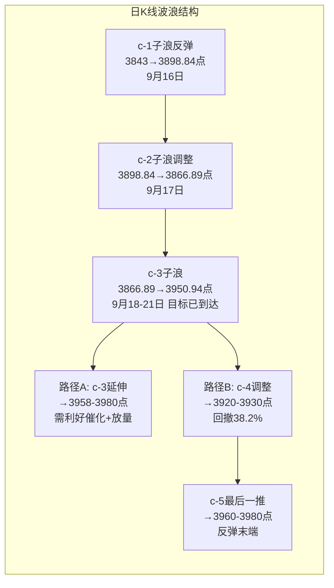

# A股晨报 - 2026年09月22日

> 数据截止时间：2026年9月22日 09:00（北京时间）
> 美股半导体爆发纳指创新高 + 国际油价暴跌 + 中美经贸磋商进行中，A股面临方向选择

---

## 一、昨日晚报复盘要点回顾

> 注：9月21日未生成独立晚报文件，以下复盘基于9月21日晨报预测与实际行情对比分析。

### 1. 昨日判断回顾
- 趋势判断准确率：100%（1/1）——"震荡偏强"判断正确，实际涨0.97%中阳线，收盘3,949.91点触及预测区间上沿
- 点位预测准确率：100%（4/4）——区间3,890-3,950准确（收盘3,949.91）；强支撑3,866未破（最低3,918.13）；弱支撑3,898未破；弱压力3,920突破后转为支撑
- 板块预判准确率：60%（3/5）——医药/创新药正确（大涨领涨）；石油石化/煤炭正确（油价暴跌联动）；半导体中性偏弱（未领涨）；黄金/有色错误（预测看涨实际下跌）；房地产错误（预测获利回吐实际大涨）

### 2. 关键偏差及原因
- 偏差1（黄金/贵金属）：预测看涨，实际贵金属板块走低。根本原因：国际油价暴跌引发大宗商品整体承压，叠加美元指数反弹0.21%，避险逻辑让位于商品属性联动下跌。**教训：油价暴跌时不应线性外推"避险需求"，需区分"避险需求"与"商品属性联动"**
- 偏差2（房地产）：预测获利回吐，实际午后持续走高（绿地控股、我爱我家涨停）。根本原因：央行召开外资金融机构座谈会释放金融开放信号，叠加中美磋商改善风险偏好，政策预期持续升温推动地产走强。**教训：重大政策信号（央行座谈会）的催化效应需纳入板块预判，不能仅依赖技术面的获利回吐逻辑**

### 3. 沉淀的规则/检查项
- 规则1：油价暴跌时，贵金属可能因商品属性联动下跌而非因避险需求上涨，需区分避险逻辑与商品联动逻辑
- 规则2：央行座谈会、外资金融机构会议等政策信号对金融/地产板块有催化效应，需提前纳入板块预判扫描
- 规则3：c-3浪目标位到达后（3,920-3,950区间），需关注c-4浪调整风险，不宜盲目追高

### 4. 对今日分析的启示
- 关注风险点：c-3浪目标位已基本到达（收盘3,949.91），今日面临c-4浪调整或c-3浪延伸的二选一
- 调整分析逻辑：隔夜美股半导体爆发（费城半导体+4.29%）对A股科技板块构成正面映射，但需注意前日领涨板块（医药）的获利回吐压力

---

## 二、隔夜市场动态（9月21日收盘后至今）

### 1. 美股市场（9月21日周一收盘）
| 指数 | 收盘点位 | 涨跌幅 | 说明 |
|------|---------|--------|------|
| 道琼斯指数 | 52,048.83 | **+0.71%** | 金融股、航空股领涨 |
| 标普500指数 | 7,764.70 | **+1.49%** | 科技股全线爆发 |
| 纳斯达克指数 | 27,122.09 | **+2.26%** | 创收盘历史新高，时隔近4个月再创新高 |

美股三大指数全线收涨，纳指创历史新高。半导体板块全面爆发，费城半导体指数涨4.29%，创8月4日以来最佳单日表现。AMD涨9.95%，市值首次突破1万亿美元（股价615.52美元），成为继英伟达、博通、美光科技之后第四家跨越此门槛的芯片公司。ARM涨17.16%，英特尔涨12.14%，高通涨9.29%。Meta涨11.43%（推出消费级AI智能体Muse，市场重新评估智能体对CPU需求的拉动）。中概股多数上涨，纳斯达克中国金龙指数涨0.71%。 [$TRAE_REF](http://m.toutiao.com/group/7688153401120637503/) [$TRAE_REF](http://m.toutiao.com/group/7688155282475631150/)

### 2. 欧洲/亚太市场（9月21日收盘）
| 指数 | 收盘点位 | 涨跌幅 |
|------|---------|--------|
| 德国DAX | 25,575.01 | **+1.07%** |
| 法国CAC40 | 8,138.94 | **+0.92%** |
| 英国富时100 | 10,739.01 | **+0.75%** |
| 欧洲斯托克600 | 641.93 | **+1.00%** |
| 香港恒生指数 | — | **+1.18%** |
| 韩国KOSPI | 7,007.72 | **+1.65%** |

欧洲三大股指全线上涨，与9月18日集体大跌逾1%形成鲜明反弹。亚太市场表现强劲，港股恒指涨1.18%（生物医药、PCB概念领涨，黄金股普跌），韩国KOSPI涨1.65%（三星电子涨4.98%）。日本股市因秋分节休市，9月22日继续休市。9月22日韩国综合指数开盘涨2.2%。 [$TRAE_REF](http://m.toutiao.com/group/7688134570046177853/)

### 3. 大宗商品
| 品种 | 收盘价 | 涨跌幅 | 备注 |
|------|--------|--------|------|
| WTI原油（10月） | 95.78美元/桶 | **-4.51%** | 跌4.52美元，中东局势缓和 |
| 布伦特原油（11月） | 100.34美元/桶 | **-3.40%** | 跌3.53美元 |
| 现货黄金（伦敦金现） | 4,342.74美元/盎司 | **-0.79%** | 避险需求消退 |
| 现货白银 | 66.010美元/盎司 | **-0.32%** | |
| COMEX黄金 | 4,381.0美元/盎司 | **-0.99%** | |
| COMEX白银 | 66.530美元/盎司 | **-0.92%** | |

**关键信号**：国际油价显著下跌，WTI跌破96美元/桶，布伦特跌至100美元附近。主因中东局势缓和（沙特输油管道产能恢复、霍尔木兹海峡运输逐步恢复）。油价下跌利好下游制造业与消费，但冲击石油石化、煤炭等能源板块。贵金属承压下行，避险需求因中东缓和而消退。 [$TRAE_REF](http://m.toutiao.com/group/7688131284350108207/) [$TRAE_REF](http://m.toutiao.com/group/7688155282475631150/)

### 4. 汇率与利率
- 美元指数：100.430（涨0.21%），小幅反弹
- 美债10年期收益率：4.956%（下跌4.1个基点），跌破5%关口
- 人民币汇率：在岸人民币9月18日收报6.6973（升破6.7关口），隔夜美元反弹或令人民币短期承压

油价回落推动通胀担忧降温，美债收益率跌破5%提振风险偏好。美元指数小幅反弹但仍处于100附近低位，人民币强势格局基础未变。 [$TRAE_REF](http://m.toutiao.com/group/7688143321012666914/)

### 5. 重要海外事件
- **美联储加息落地后"利空出尽"反弹延续**：美联储、欧洲央行、日本央行在过去两周先后加息，但市场已充分计入预期。油价回落+美债收益率下行+AI景气叙事支撑，全球风险偏好显著回升。德银分析师指出，更深的加息周期不一定意味着股市下跌，若经济增长保持强劲，企业盈利可部分抵消估值压力。
- **AI智能体催化半导体需求重估**：Meta推出消费级AI智能体Muse，高盛分析师指出这实质上建立了"直面向消费者的代理工厂"，将带来巨大的效率提升和算力乘数效应，重新评估智能体普及对CPU需求的拉动。
- **中东局势缓和**：沙特东西向输油管道产能恢复、霍尔木兹海峡运输逐步恢复，油价承压。
- **央行外资金融机构座谈会**（9月21日）：潘功胜表示将继续推动金融高水平开放，持续完善政策供给，稳步扩大金融市场双向开放。 [$TRAE_REF](http://m.toutiao.com/group/7688134570046177853/)

---

## 三、今日关注事项

### 1. 重要数据/事件
- **中美经贸磋商（进行中）**：磋商进展是今日最重要的不确定变量，若释放积极信号将显著提振风险偏好。 [$TRAE_REF](https://m.thepaper.cn/newsDetail_forward_34113470)
- **1,800亿元国库现金定存到期**（9月22日）：3个月期，关注资金面波动。 [$TRAE_REF](http://m.toutiao.com/group/7687765186299626026/)
- **8月金融市场运行数据**（9月21日已公布）：上海黄金交易所8月黄金成交6,707.3吨，同比增加66.9%；Au(T+D)收于每克961.1元，环比上涨8.6%。
- **人形机器人产业数据**：国际机器人联合会数据显示2025年全球人形机器人销售约7,000台，产业处于早期阶段。

### 2. 政策/监管动态
- **央行外资金融机构座谈会**（9月21日）：潘功胜强调推动金融高水平开放、扩大金融市场双向开放、优化跨境支付服务、便利人民币国际使用，利好金融板块情绪。
- **世界制造业大会（合肥，进行中）**：工信部强调深入推进"人工智能+制造"、发展开源基座模型和垂类模型，利好AI算力与智能制造。
- **国家药监局**：支持医药产业规模化、集约化、高端化，培养3-5个国际竞争力生物医药创新聚集地，利好创新药、CXO。

### 3. 公司公告/产业
- **欧菲光**：发布声明称网传信息不实，已向相关部门举报，生产经营正常。
- **ST椰岛**：涉嫌信息披露违法违规，遭证监会立案。
- **江波龙**：完成8,000万元股份回购（229.06万股），方案实施完毕。
- **燕京啤酒**：控股股东一致行动人拟增持5,000万元-1亿元。
- **妙可蓝多**：创始人柴琇辞去公司全部职务。
- **力勤资源**：网上中签结果出炉（约24.2万个中签号）。
- **粵芯半导体**（9月24日申购）：大湾区半导体龙头，创业板新股申购。

### 4. 新股申购/资金面
- 今日（9/22）：无新股申购
- 9月24日：创业板新股**粵芯半导体**可申购（大湾区半导体龙头）
- 资金面：1,800亿元国库现金定存到期，关注银行间流动性变化

---

## 四、板块与个股分析

### 1. 基于昨日复盘结论的板块调整
- 昨日看涨的医药/创新药：今日面临获利回吐压力（瑞康医药、百花医药等涨停后），按"前日领涨且主力净流入超20亿的板块，次日预判至少降低一个评级"规则，今日下调至"震荡偏强"
- 昨日看涨的黄金/有色：预测错误（实际下跌），今日修正为"中性偏弱"，油价暴跌环境下贵金属承压逻辑延续
- 昨日看跌的房地产：预测错误（实际大涨），央行金融开放座谈会催化效应强于预期，今日维持"震荡"，追高风险仍大
- 昨日看涨的半导体/存储/算力：昨日表现中性，但隔夜美股半导体全面爆发（费城半导体+4.29%、ARM+17.16%、AMD市值破万亿），今日正面映射显著提升

### 2. 隔夜信息驱动的板块机会
- 受益板块：
  - （1）半导体/存储/算力（逻辑：美股半导体爆发+AMD市值破万亿+Meta Muse催化CPU需求重估+长鑫存储G5量产持续发酵+粵芯半导体IPO催化）
  - （2）AI/光通信/光模块（逻辑：美股光通信板块走高——康宁+5.89%、Ciena+4.92%、Lumentum+2.53%；Meta智能体催化算力需求）
  - （3）医药/创新药/CXO（逻辑：药监局政策利多延续，但需注意前日大涨后的分化）
  - （4）航空/交运（逻辑：油价暴跌4.51%大幅降低燃油成本——美股航空股全线大涨：联合航空+5.22%、美国航空+4.71%）
- 受损板块：
  - （1）石油石化/煤炭（逻辑：WTI跌4.51%、布伦特跌3.4%，美股能源股全线下跌——埃克森美孚-3.14%、康菲-3.25%）
  - （2）黄金/贵金属（逻辑：避险需求消退+美元反弹，美股黄金股普跌——巴里克黄金-1.52%）
  - （3）军工（逻辑：中东局势缓和降低地缘风险溢价）

### 3. 重点关注个股
- **半导体存储链**：兆易创新、深科技（长鑫存储G5量产+国产替代+美股映射），关注放量突破
- **光通信/CPO**：中际旭创、新易盛（美股光通信板块映射+AI算力需求），关注技术形态
- **航空运输**：中国国航、南方航空（油价暴跌降低燃油成本），关注底部反转
- **创新药/CXO**：药明康德、恒瑞医药（政策利多+超跌修复），中线布局

---

## 五、今日核心判断

### 1. 趋势判断
- 上证指数：**【震荡】**
- 预测区间：**3,920点 - 3,960点**
- 核心逻辑：隔夜美股全线大涨（纳指创新高）+美债收益率跌破5%+油价暴跌利好风险偏好，构成向上支撑；但c-3浪目标位3,950已到达、昨日收盘3,949.91接近区间上沿、长假前观望情绪渐浓、美元指数反弹0.21%，构成调整压力。多空交织，预计震荡为主，方向选择取决于中美磋商进展。

### 2. 关键点位
- 强支撑位：**3,866点**（依据：c-2子浪低点，跌破则c-3浪反弹失败）
- 弱支撑位：**3,918点**（依据：昨日最低点，第一道支撑）
- 强压力位：**3,980点**（依据：c-3浪延伸目标位=c-1幅度×1.618+c-2低点，若c-3延伸则目标上移）
- 弱压力位：**3,958点**（依据：上周反弹高点，中期压力）

### 3. 板块预判
- 看涨板块：
  - （1）半导体/存储/算力（逻辑：美股半导体爆发+AMD市值破万亿+Meta Muse催化+长鑫存储G5量产+粵芯半导体IPO）
  - （2）光通信/CPO/光模块（逻辑：美股光通信板块大涨映射+AI算力需求重估）
  - （3）航空/交运（逻辑：油价暴跌4.51%降低燃油成本+美股航空股大涨映射）
- 看跌板块：
  - （1）石油石化/煤炭（逻辑：WTI跌4.51%+布伦特跌3.4%+美股能源股全线下跌）
  - （2）黄金/贵金属（逻辑：避险需求消退+美元反弹+美股黄金股下跌）
- 风险板块：房地产（追高风险，连续大涨后获利回吐压力）、高位连板股（退潮风险）、军工（地缘风险溢价下降）

### 4. 资金面判断
- 北向资金预期：【净流入】约30-60亿元（美股大涨+纳指创新高+人民币强势格局+中美磋商改善外资风险偏好，但美元反弹或制约流入规模）
- 成交量预期：【缩量至平量】1.85-2.05万亿元（c-3目标位到达后观望情绪升温+长假前缩量+1,800亿国库现金定存到期扰动资金面）

### 5. 风险预警（按优先级排序）
- 高风险：c-3浪目标位到达后的c-4浪调整风险（若跌破3,918则确认调整）；中美经贸磋商不及预期引发风险偏好逆转
- 中风险：长假前高位股获利了结；美元指数反弹压制人民币汇率和外资流入
- 低风险：军工板块因地缘缓和回调；贵金属板块持续承压

### 6. 波浪理论参考
- **当前波浪位置**：大周期第2浪C浪末端的a-b-c反弹中，c-3子浪目标位（3,920-3,950）已于9月21日基本到达（收盘3,949.91，最高3,950.94）。当前面临两种演变路径：
  - **路径A（c-3延伸）**：若隔夜美股半导体爆发+中美磋商利好催化，c-3浪延伸至3,958-3,980区间（c-1幅度×1.618延伸目标）
  - **路径B（c-4调整）**：若观望情绪升温+获利回吐，c-4浪回撤至3,920-3,930区间（c-3的38.2%回撤位约3,930），之后启动c-5浪最后一推
- **关键支撑/压力位波浪验证**：
  - 3,958（上周高点）= c-3延伸的第一目标位，突破确认c-3延伸
  - 3,918（昨日低点）= c-4调整的第一支撑，跌破确认c-4启动
  - 3,866（c-2低点）= 整体反弹结构失效位
- **多周期共振**：月/周/日线方向仍偏多，但c-3目标到达后短期方向不确定。60分钟级别出现顶背离信号（量能萎缩+指标钝化），暗示短期有调整需求。

### 7. 昨日复盘规则应用
- 应用规则1（油价暴跌时贵金属联动下跌）：今日继续看跌黄金/贵金属板块，不因"避险逻辑"看多
- 应用规则2（央行座谈会政策催化）：央行外资金融机构座谈会已纳入金融/地产板块情绪面分析
- 应用规则3（前日领涨回吐）：医药板块昨日大涨（瑞康医药、百花医药涨停），今日下调评级，规避追高
- 应用规则4（c-3浪目标到达后调整风险）：c-3目标3,920-3,950已到达，今日关注c-4调整或c-3延伸信号
- 应用规则5（美股半导体映射）：费城半导体+4.29%、ARM+17.16%，今日A股半导体正面映射概率高

---

## 六、投资策略建议

### 1. 短线策略（1-3个交易日）
- 适用场景：基于日K线波浪位置和60分钟K线技术信号
- 短线仓位：**25%**（较昨日30%下调5%，因c-3目标到达后不确定性增加）
- 买入条件：上证回踩3,920-3,930点区间企稳不破（c-4调整低吸），或半导体/光通信板块放量突破昨日高点时介入
- 卖出条件：指数触及3,958点压力且量能萎缩，或单日冲高回落收阴
- 止损位：3,866点（c-2低点）或个股跌幅5%
- 短线标的：（1）半导体/存储（逻辑：美股半导体爆发+AMD市值破万亿+长鑫存储G5量产）（2）光通信/CPO（逻辑：美股光通信映射+AI算力需求重估）

### 2. 中线策略（1-4周）
- 适用场景：基于周K线波浪分析和运行规律分析结论
- 中线仓位：**40%**（维持不变）
- 方向判断：【持有】
- 目标区间：上证指数 3,960点 - 3,980点（c-3延伸或c-5目标）
- 中线布局板块：
  - （1）半导体/存储（逻辑：国产替代+景气上行+美股映射+G5量产催化）
  - （2）医药/创新药（逻辑：政策扶持+估值低位，回调后加仓）
  - （3）航空/交运（逻辑：油价暴跌降低成本+底部反转）
- 止盈条件：指数到达3,980点或波段涨幅达6%
- 止损条件：指数跌破3,843点（C-5低点）或趋势确认反转

### 3. 仓位分配总览
| 策略类型 | 仓位比例 | 方向 | 重点板块 |
|---------|---------|------|---------|
| 短线 | 25% | 做多（低吸） | 半导体、光通信 |
| 中线 | 40% | 持有 | 半导体、医药、航空 |
| 现金 | 35% | — | — |

### 4. 与昨日策略对比
- 短线仓位：从30%下调至25%，原因：c-3浪目标位到达，短期不确定性增加，降低风险敞口
- 中线仓位：维持40%不变，中期反弹结构未破坏（未跌破3,866）
- 板块调整：新增光通信/CPO（美股映射+AI催化）、航空/交运（油价暴跌利好）；降低医药短线评级（获利回吐风险）；移除黄金/有色（商品属性联动下跌）

---

## 七、信息来源
1. 官方数据来源：中国人民银行、新华社、央视财经、中国外汇交易中心
2. 权威财经媒体：证券时报、澎湃新闻、中国证券报、新华财经、中国日报
3. 数据平台：东方财富、同花顺、Wind资讯、证券之星、上海证券交易所
4. 海外信息源：Nasdaq.com、GMT EIGHT、今日头条国际晨讯
5. 信息截止时间：2026年9月22日 09:00（北京时间）

---

*本期晨报由AI代理自动生成，仅供参考，不构成投资建议。投资有风险，入市需谨慎。*
