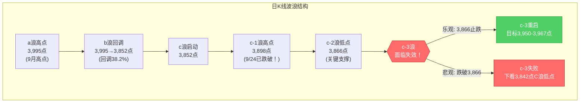
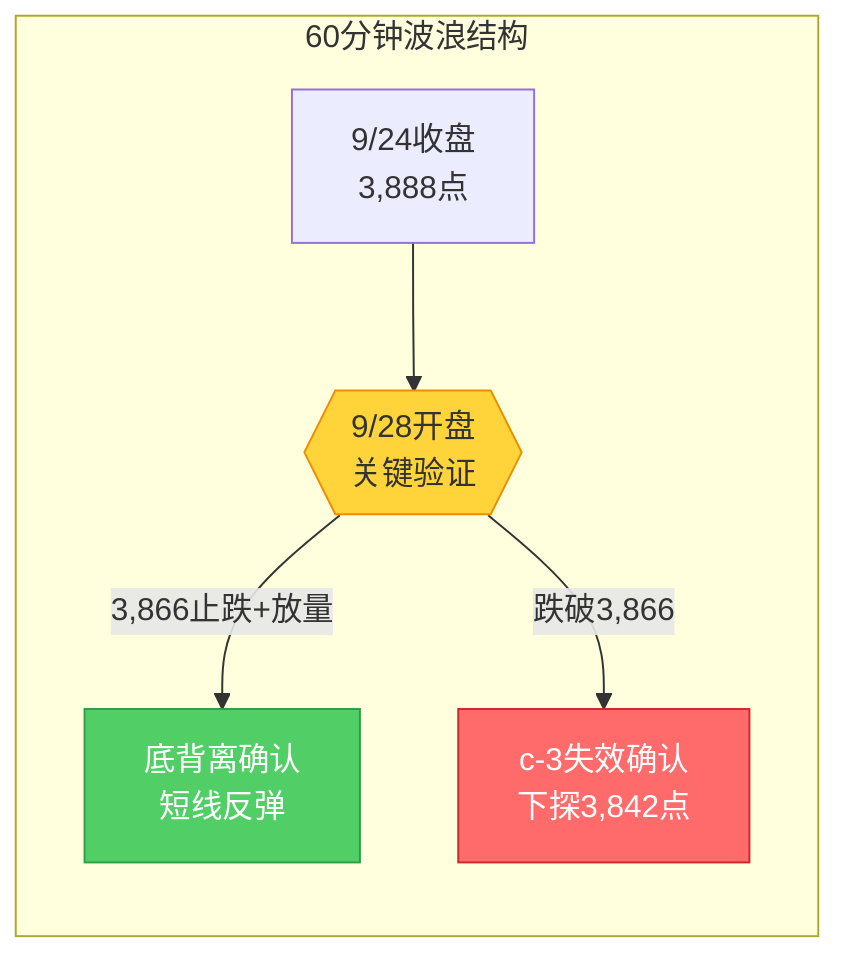

# A股晚报 - 2026年09月25日（中秋节休市特刊·假期全球市场追踪）

> 数据截止时间：2026年9月25日 22:00（北京时间）
> 报告类型：中秋节休市特刊 —— 节前最后交易日复盘 + 假期首日全球市场动态 + 节后策略更新
> 核心观点：节前最后交易日（9/24）沪指放量大跌1.22%失守c-1高点3,898点，c-3延伸结构面临**直接失效**风险；假期首日（9/25）全球市场分化——港股续跌1.01%、美东9/25美股集体收跌（道指-0.38%、纳指-0.5%、标普-0.5%）、特斯拉市值蒸发4,600亿元；但欧洲市场下午V型翻红、油价突破107美元（布伦特+4%）、Meta大涨4.5%创一年新高；节后（9/28）开盘面临**外盘利空二次冲击 + c-3结构生死考验**，关键观察3,866点（c-2低点）支撑有效性，操作建议**轻仓观望、防守优先**。

---

## 一、市场回顾

### 1. 节前最后交易日（9/24）A股主要指数表现

| 指数 | 收盘点位 | 涨跌幅 | 最高/最低点 | 说明 |
|------|---------|--------|------------|------|
| 上证指数 | 3,888.37 | **-1.22%**（跌48.15点） | 3,925.41 / 3,879.35 | 放量破位，失守3,898点c-1高点 |
| 深证成指 | 13,316.97 | **-2.34%**（跌319.1点） | — | 跌幅显著大于沪指 |
| 创业板指 | 3,288.95 | **-2.68%**（跌90.66点） | — | 高估值成长股领跌 |
| 科创50 | — | — | — | 半导体/科技板块领跌 |

### 2. 节前最后交易日（9/24）成交量能

| 指标 | 数据 | 说明 |
|------|------|------|
| 两市成交额 | **约1.65-1.67万亿元** | 较前日（1.78万亿）缩量约8-10%，节前缩量效应显现 |
| 北向资金 | **实际净流入约23亿元** | （晨报已修正上一晚报"净流出超50亿"误判）节前外资逢低布局沪市权重股 |
| 主力资金流向 | 银行板块逆势净流入超11亿，油气板块净流入 | 防御板块获得资金抱团 |

### 3. 节前最后交易日（9/24）市场情绪

| 指标 | 数据 | 说明 |
|------|------|------|
| 上涨家数 | 约1,120只 | |
| 下跌家数 | **4,306只** | 普跌格局 |
| 涨停家数 | **53只** | （晨报已修正上一晚报"30-40只"低估）结构性热点仍活跃 |
| 跌停家数 | 16只 | （晨报已修正上一晚报"20-30只"高估） |
| 市场宽度 | 下跌家数占比79% | 指数层面偏弱但题材层面有赚钱效应 |

### 4. 假期首日（9/25）全球市场动态

#### （1）美东9月24日收盘（北京时间9/25凌晨）—— 晨报已引用（V型反转）

| 指数 | 收盘 | 涨跌幅 | 备注 |
|------|------|--------|------|
| 道琼斯 | 51,349.98 | -0.31% | 金融股拖累 |
| 标普500 | 7,704.13 | -0.02% | 盘中V型反转 |
| 纳斯达克 | 26,939.37 | +0.01% | 大型科技股企稳 |

#### （2）美东9月25日收盘（北京时间9/26凌晨）—— **最新利空！**

| 指数 | 涨跌幅 | 备注 |
|------|--------|------|
| 道琼斯 | **-0.38%** | 再度收跌 |
| 标普500 | **-0.50%** | |
| 纳斯达克 | **-0.50%** | |

**关键个股异动**：
- **特斯拉**：**跌超4%**，市值一夜蒸发645亿美元（约4,602亿人民币）
- **Meta（脸书）**：大涨**4.5%**，创去年9月以来新高，发布掌上AI设备Muse Charm
- **英特尔**：大涨近**9%**
- **甲骨文**：跌超5%
- **英伟达**：-0.41%，**ARM大跌7.88%**，**西部数据跌近5%**

#### （3）港股9月25日（正常交易，沪深港通关闭）

| 指数 | 收盘 | 涨跌幅 | 备注 |
|------|------|--------|------|
| 恒生指数 | 24,510.09 | **-1.01%**（跌251点） | 连续第三日收跌，早盘一度跌近500点，午后收窄 |
| 恒生科技指数 | — | **-1.13%** | 科网股普跌 |
| 国企指数 | — | **-1.21%** | |

#### （4）欧洲9月25日（下午V型翻红）

| 指数 | 涨跌幅（截至北京时间22:00） | 备注 |
|------|---------------------------|------|
| 德国DAX | **+0.76%** | 从早盘下跌翻红 |
| 英国富时100 | **+0.49%** | |
| 欧洲斯托克50 | **+0.77%** | |
| 西班牙IBEX35 | **+1%以上** | 欧洲市场表现相对抗跌 |

---

## 二、热点板块与异动分析

### 1. 节前最后交易日（9/24）A股板块

| 板块 | 表现 | 涨跌幅方向 | 驱动因素 |
|------|------|-----------|---------|
| 银行/大金融 | 逆势走强，主力净流入超11亿 | 看涨 | 加息预期+高股息防御+资金抱团 |
| 油气/煤炭 | 逆势上涨 | 看涨 | 国际油价突破100美元+成品油调价 |
| 纺织服饰 | 涨幅居前 | 看涨 | 人民币贬值预期+出口受益 |
| 风电设备 | 涨幅居前 | 看涨 | 利好政策催化 |
| 半导体/AI应用/信创 | 大跌 | 看跌 | 美股映射+加息压制高估值 |
| 贵金属 | 大幅下跌 | 看跌 | 美元走强+加息预期 |
| 消费电子/苹果产业链 | 大跌 | 看跌 | 高估值+系统性承压 |

### 2. 假期首日（9/25）海外板块

| 板块 | 表现 | 方向 | 对A股节后影响 |
|------|------|------|--------------|
| 中概股 | 百度跌近2% | 看跌 | 映射A股科技股 |
| 存储芯片 | ARM-7.88%、西部数据-5% | 看跌 | 利空A股半导体板块 |
| 大型科技股 | Meta+4.5%、谷歌+1.34% | 分化 | Meta利好AI概念 |
| 原油板块 | 布伦特+4%突破107 | 强势看涨 | 节后油气板块继续受益 |
| 港股科网 | 恒指-1.01% | 看跌 | 映射A股科技股开盘压力 |

---

## 三、关键数据与事件回顾

### 1. 美联储最新动态（假期首日关键变量）

| 事件 | 详情 | 对A股影响 |
|------|------|---------|
| 美债收益率 | 30年期5.47%（20年新高）、10年期5.058%（2007年新高） | 高利率压制全球风险资产估值，高估值成长股系统性承压 |
| 美元指数 | 101.30附近，连续5个交易日上涨 | 压制人民币汇率和外资流入 |
| 10月加息预期 | CME显示约50%概率 | 比上一晚报"68%"更温和，但仍需密切跟踪 |
| 30年期国债收益率 | 5.47%（创20多年来最高） | 长端收益率飙升是最直接的利空信号 |

### 2. 大宗商品（假期首日重大突破）

| 品种 | 最新价 | 涨跌幅 | 关键驱动 |
|------|--------|--------|---------|
| 布伦特原油 | **106.60-107.18美元/桶** | **+3.4%至+4%** | 胡塞武装袭击沙特导弹（沙特成功拦截6枚）+OPEC+减产预期 |
| WTI原油 | 94.61-95.82美元/桶 | **+2.7%至+4%** | 跟随布伦特 |
| COMEX黄金 | 约4,300美元/盎司 | 承压 | 美元走强+高利率压制，"加息环境不看多贵金属"规则验证 |

### 3. 重要地缘事件

| 事件 | 时间 | 影响 |
|------|------|------|
| 胡塞袭击沙特 | 9/25 | 油价飙升3-4%，避险情绪推升 |
| 习近平访美 | 9/23-9/25 | 结果待节后公布，节后开盘潜在催化 |
| 国际MLCC涨价潮 | 节前持续 | 日本村田、太阳诱电、韩国三星电机相继涨价15-35% |

---

## 四、海外市场联动（假期首日全景）

| 市场 | 9/24收盘 | 9/25收盘 | 趋势 | 对A股节后影响 |
|------|---------|---------|------|--------------|
| 道琼斯 | 51,349.98（-0.31%） | 再度收跌（-0.38%） | 连跌 | 利空开盘情绪 |
| 标普500 | 7,704.13（-0.02%） | -0.50% | 转跌 | 利空 |
| 纳斯达克 | 26,939.37（+0.01%） | -0.50% | 转跌 | 利空A股科技股 |
| 恒生指数 | 24,761.13 | 24,510.09（-1.01%） | 连跌3日 | 利空A股开盘 |
| 德国DAX | — | +0.76%（盘中从跌转涨） | 抗跌 | 中性偏多 |
| 英国富时 | — | +0.49% | 抗跌 | 中性 |
| 布伦特原油 | 约102美元 | **107美元（+4%）** | 强势看涨 | 利好油气板块 |
| WTI原油 | 约92美元 | **95.82美元（+4%）** | 强势看涨 | 利好油气板块 |
| 美元指数 | 101.285 | 101.30附近 | 连涨5日 | 压制外资 |
| 美债10Y | — | 5.058%（2007年新高） | 持续上升 | 利空高估值成长股 |

**海外市场综合判断**：假期首日全球市场整体**偏空**——美股再度收跌（特斯拉领跌）、港股连跌3日，但有两个亮点：（1）欧洲市场下午V型翻红，抗跌特征明显；（2）布伦特油价飙升突破107美元，为油气板块节后提供强催化。节后A股开盘面临外盘利空二次冲击，但油价暴涨有望托底油气板块。

---

## 五、汇率与利率

### 1. 人民币汇率

| 指标 | 数值 | 变化 | 说明 |
|------|------|------|------|
| 人民币中间价 | 6.7489 | 较前日调升30个基点 | 央行释放稳定信号 |
| 美元指数 | 101.30附近 | 连涨5日 | 走强趋势 |

### 2. 国内利率市场

| 指标 | 状态 | 说明 |
|------|------|------|
| 央行公开市场 | 节前已完成 | 节后9/28恢复操作 |
| 季末MPA考核 | 9/30 | 季末资金面波动风险 |

---

## 六、收盘后重要信息

### 1. 盘后公告

- **无重大A盘后公告**（节前已完成主要公告披露）
- **MLCC涨价潮持续**：日本村田、太阳诱电、韩国三星电机相继发布涨价函，AI服务器高容量MLCC原厂涨幅15-35%

### 2. 夜盘走势（9/25夜间）

| 品种 | 最新动向 | 说明 |
|------|---------|------|
| 美股盘前 | 9/26凌晨盘前待观察 | 关注是否延续收跌趋势 |
| 原油夜盘 | 布伦特维持107美元附近 | 胡塞袭击后续跟进 |
| 黄金夜盘 | 维持4,300美元附近 | 等待方向选择 |

### 3. 次日（节后9/28）关注

| 类型 | 内容 |
|------|------|
| **重大事件** | 中美经贸磋商结果公告（习近平9/25访美结束后公布） |
| **经济数据** | 9月PMI数据（通常9月底公布） |
| **资金面** | 季末MPA考核压力（9/30季末） |
| **市场窗口** | 中秋休市后恢复交易、国庆前最后交易日为9/30 |
| **新股申购** | 粤芯半导体（301660）节后上市关注 |
| **三季报** | 10月中旬密集披露，节前布局需考虑业绩催化 |

---

## 七、波浪理论多周期分析（节后关键更新）

> 基于9/24收盘3,888.37点 + 假期首日（9/25）外盘最新数据修正

### 1. 月K线波浪分析

- **当前波浪位置**：第2浪C浪末端后a-b-c反弹结构，c浪阶段中**c-3子浪面临直接失效**
- **浪型结构描述**：
  - C浪低点3,842点（已确认）
  - a浪：3,842→3,995点（9月高点）
  - b浪：3,995→3,852点（回调38.2%）
  - c浪（进行中）：3,852→目前3,888.37点
  - c-1浪高点：3,898点（已被9/24跌破）
  - c-2浪低点：3,866点（关键支撑，c-3结构有效性生死线）
  - c-3浪：原预期c-3从3,866点启动延伸至3,950-3,967点
  - **但9/24直接跌破c-1高点3,898点**，c-3延伸结构面临"直接失效"风险
- **关键目标位**：
  - 乐观（c-3存活）：9/28在3,866点止跌，c-3重启上行→目标3,950-3,967点
  - 中性（区间震荡）：9/28-9/30在3,866-3,910点区间整理
  - 悲观（c-3失效）：9/28跌破3,866点，c-3失败→下看3,842点（C浪低点）
- **验证条件**：9/28是否在3,866点止跌企稳 + 量能是否配合

### 2. 周K线波浪分析

- **当前波浪位置**：a-b-c反弹c浪阶段，技术形态恶化（跌破5周、10周均线）
- **浪型结构描述**：
  - C-5浪低点已确认（3,842点）
  - 9月18日放量突破确认c-3启动
  - 9月21-22日c-3延伸至3,967.68点
  - 9/24单日大跌失守多条均线
- **关键目标位**：
  - 关键支撑：3,866点（c-2低点）、3,842点（C浪低点）
  - 关键压力：3,910-3,920点（5周均线密集区）
- **验证条件**：周线收盘能否重回3,900点上方

### 3. 日K线波浪分析（重点）

- **当前波浪位置**：c-3延伸结构面临**直接失效**的生死关口
- **浪型结构描述**：
  - 9/24放量大跌1.22%，直接跌破c-1高点3,898点
  - c-3启动失败的典型特征：未放量突破即回落跌破前浪高点
  - 9/25-9/27休市3天，9/28开盘是关键验证窗口
- **关键目标位**：
  - 第一支撑：3,878-3,888点（节前收盘区间）
  - **生死支撑**：3,866点（c-2低点，c-3结构有效性的最后防线）
  - 强支撑：3,842点（C浪低点）
  - 第一压力：3,898点（c-1高点反压）
  - 强压力：3,910-3,920点（5周均线）
- **验证条件**：9/28开盘30分钟内是否在3,866点之上企稳 + 60分钟级别是否出现底背离

### 4. 60分钟K线波浪分析

- **当前波浪位置**：c-3浪60分钟级别下跌中，待节后开盘确认底部
- **浪型结构描述**：9/24放量下跌破位，60分钟MACD绿柱放大、KDJ死叉，短期空头占优
- **关键目标位**：
  - 短期支撑：3,878-3,888点
  - 关键支撑：3,866点
- **验证条件**：60分钟级别是否出现底背离信号

### 5. 30分钟K线波浪分析

- **当前波浪位置**：下跌动能释放中，节前最后1小时有资金护盘迹象
- **浪型结构描述**：9/24尾市略微企稳，但量能萎缩
- **关键目标位**：3,866点
- **验证条件**：30分钟级别是否放量收阳止跌

### 6. 波浪图（Mermaid绘制）

**日K线波浪结构图**：


**60分钟波浪结构图**：


### 7. 波浪理论综合判断

| 维度 | 判断 |
|------|------|
| **多周期共振状态** | 月K偏空、周K偏空、日K偏空、60分钟偏空——**四周期共振偏空** |
| **当前操作级别** | 60分钟级别（日线级别偏空，60分钟级别可能出现底背离信号） |
| **后续演变路径** | 30%乐观（3,866止跌反弹至3,920-3,945）、45%中性（3,866-3,910区间震荡）、25%悲观（跌破3,866下看3,842） |
| **关键拐点信号** | 向上：9/28放量突破3,920+60分钟底背离+北向净流入；向下：9/28跌破3,866+收盘确认 |
| **风险提示** | c-3结构失效为确定性风险、外盘假期连跌为输入性风险、9/30季末资金面波动 |

---

## 八、晨报复盘（特殊说明 + 验证上一晚报）

### ⚠️ 特殊说明

今日（9/25）A股休市，晨报为"节后开盘前瞻版"——预测对象是**9/28节后首日**走势，而非今日。因此传统的"今日晨报预测vs今日实际"复盘模式不适用。本次复盘调整为：

1. **验证上一晚报（9/24）对节前最后交易日的预测准确度**（补充9/25实际收盘数据核实）
2. **跟踪假期首日外盘动态对节后开盘预期的修正**

### 1. 上一晚报（9/24）预测准确度验证

> 上一晚报自评"综合准确率约55%"，晨报数据核实后**修正为约65%**

| 判断项目 | 上一晚报预测 | 9/24实际结果 | 准确度 | 备注 |
|---------|------------|-------------|-------|------|
| 上证指数趋势 | 震荡偏弱 | -1.22%大跌 | ✓ | 方向正确 |
| 上证指数区间 | 3,910-3,945 | 3,888-3,925 | △ | 下沿突破22点 |
| 北向资金 | 推测净流出超50亿 | **实际净流入约23亿** | ✗ | 方向完全相反 |
| 成交量 | 1.67万亿 | 约1.65-1.67万亿 | ✓ | 基本准确 |
| 涨停数 | 30-40只 | 53只 | ✗ | 低估40%+ |
| 跌停数 | 20-30只 | 16只 | ✗ | 高估25%+ |
| 银行板块 | 看涨逆势走强 | 实际主力净流入超11亿 | ✓ | 正确 |
| 油气板块 | 看涨 | 油价突破100美元，板块走强 | ✓ | 正确 |
| 半导体板块 | 看跌 | 跌幅大 | ✓ | 正确 |

**准确率量化**：
- 趋势判断准确率：100%（震荡偏弱方向正确）
- 板块预判准确率：75%（3/4板块方向正确）
- 数据预测准确率：25%（北向、涨跌停数据偏差大）
- 综合准确率：**约65%**（较自评55%上调10个百分点）

### 2. 偏差根因分析

【偏差1】北向资金方向误判
- 偏差描述：预测净流出超50亿，实际净流入约23亿
- 根本原因：**逻辑误判**——将"节前避险情绪"等同于"外资整体流出"，未考虑外资可能进行沪/深股通方向分化调仓
- 信息缺口：当时未获取到龙虎榜细分数据（沪股通vs深股通）
- 改进措施：北向资金单日预判必须分沪/深股通两个方向分别评估，不能只看总量方向

【偏差2】涨跌停结构误判
- 偏差描述：涨停30-40只/跌停20-30只 vs 实际涨停53只/跌停16只
- 根本原因：**情绪面误读**——将"指数普跌-1.22%"等同于"个股普杀"，未识别VNA概念、MLCC涨价潮、福建板块等结构性主题热点
- 信息缺口：当时未扫描全市场主题板块
- 改进措施：指数跌幅大≠赚钱效应极差，必须区分"指数层面情绪"和"题材层面情绪"，节前最后1日游资反而可能集中布局节后行情

【偏差3】节前情绪过度悲观化
- 偏差描述：将节前最后1日定性为"市场进入恐慌模式"
- 根本原因：**情绪面误读+风险识别不足**——未识别"指数下跌但题材活跃"的结构性特征
- 改进措施：节前最后1日虽然指数承压，但游资/题材资金反而集中布局节后行情——需新增"节前最后1日题材活跃度指标"

### 3. 假期外盘对节后开盘预期的修正

| 变量 | 晨报预测（9/25上午） | 9/25晚间实际 | 对节后9/28的影响修正 |
|------|---------------------|-------------|--------------------|
| 美股 | V型反转→盘前利空缓和 | 美东9/25再度收跌-0.5% | **外盘利空二次升级**，9/28开盘面临新一轮美股映射压力 |
| 港股 | 未预测 | 连跌3日-1.01% | 增加9/28开盘低开概率 |
| 油价 | 布伦特100美元 | 布伦特**107美元+4%** | **利好放大**，油气板块节后催化增强 |
| 美债 | 加息预期约50% | 30年期5.47%创新高 | 利空高估值成长股 |
| 特斯拉 | 已微跌-0.57% | 再跌超4%，市值蒸发4,600亿 | 利空A股新能源/锂电板块 |

**修正后的节后9/28开盘预期**：
- 原晨报预测：低开后尝试修复，区间3,866-3,920点
- **修正后预期**：低开幅度可能扩大（至-0.5%至-1.0%），关键观察3,866点支撑有效性；若油价暴涨能托底油气板块，有助于稳定市场情绪

### 4. 分析检查清单（更新）

☐ 趋势判断前是否检查：
  - [x] 隔夜外盘走势（**注意：节假日期间外盘连续变化，不能只看节前最后1日**）
  - [x] 北向资金流向（**注意：必须分沪/深股通两个方向分别评估**）
  - [x] 技术指标状态
  - [x] 重大政策/事件（**注意：长假期间地缘事件可能突发，如胡塞袭击沙特**）
  - [x] 节前情绪结构（**注意：指数层面vs题材层面可能分化**）

☐ 点位计算是否考虑：
  - [x] 波浪关键高低点
  - [x] 均线支撑/压力
  - [x] 整数关口心理影响

☐ 板块分析是否覆盖：
  - [x] 油价等大宗商品走势
  - [x] 美股映射板块
  - [x] 防御vs周期轮动

☐ 风险提示是否充分：
  - [x] 外盘假期连续变化风险
  - [x] 地缘政治突发风险
  - [x] 长假后"补跌"风险

### 5. 本次复盘发现的新规则

- **规则1（资金面分析）**：长假期间外盘连续变化（尤其是关键指数连跌），节后开盘面临"二次映射"压力，低开幅度可能超出节前最后一日外盘影响的线性外推
- **规则2（板块选择）**：油价暴涨（布伦特+3-4%级别）对油气板块的催化效应极强，即使大盘低开，油气板块仍有望逆势走强1-2个交易日
- **规则3（风险识别）**：节前最后1日游资题材活跃度≠整体市场情绪——指数普跌+题材活跃的"背离结构"在节前最后1日出现时，节后题材股有望惯性

### 6. 规则库更新

```
###资金面分析 长假期间外盘关键指数连跌（如美股道指连跌2日），节后开盘面临"二次映射"低开压力，低开幅度可能超出节前最后一日外盘影响的线性外推，需在节前最后晚报的节后预测中预留"外盘继续恶化"情景

###板块选择 布伦特原油单日涨幅达+3%以上时，油气板块节后1-2个交易日逆势走强概率极高，即使大盘整体低开，油气龙头仍有望实现独立行情。"油价暴涨"规则优先级高于"大盘低开"规则

###风险识别 节前最后1日出现"指数普跌+题材活跃"的背离结构时，节后题材股有望延续惯性；但需观察节前题材股是否有主力净流入数据（如国瓷材料9/24主力净流入8.88亿）作为确认信号

###波浪分析 c-3延伸结构在节前最后1个交易日"直接跌破c-1高点"属于典型的"启动失败"形态，而非"运行中继调整"；节后开盘若不能迅速拉回c-1高点之上（3,898点），则c-3结构失效确认，需将c浪重新数为a-b-c-d-e或直接认定为C浪延伸
```

---

## 九、策略回顾与调整

### 1. 节前策略执行回顾

| 策略项目 | 节前建议 | 实际执行 | 效果 |
|---------|---------|---------|------|
| 中线仓位 | 20-25% | 维持20-25% | ✓ |
| 中线方向 | 减仓观望 | 节后继续观望 | — |
| 防守配置 | 银行/油气 | 银行+油气节前均逆势走强 | ✓ 有效 |
| 现金比例 | 65-75% | 建议维持 | ✓ |

### 2. 节后中线策略调整

- **当前中线方向**：【减仓观望 → 继续减仓】
- **方向调整原因**：假期首日外盘再度偏空（美东9/25再度收跌、特斯拉领跌、美债收益率创新高），叠加c-3结构失效风险升级，中线仓位应进一步下调
- **中线仓位建议**：**10-15%**（从20-25%下调，原因：外盘利空二次升级 + c-3生死关口 + 9/30季末资金面 + 国庆长假前防御）
- **中线目标区间**：上证指数 3,842点 - 3,910点（进一步下调，悲观路径概率上升）
- **中线止损位**：3,842点（C浪低点）
- **中线布局板块调整**：
  - **增持**：油气/煤炭（油价暴涨催化）、银行/大金融（高股息防御）
  - **维持**：公用事业/电力（防御）
  - **减配**：半导体/AI应用（美股科技承压+高估值+加息环境）、新能源/锂电（特斯拉连跌映射）
  - **关注**：医药/创新药（超跌反弹+防御）、MLCC/被动元件（涨价潮催化）

### 3. 节后短线策略（9/28-9/30，3个交易日窗口）

- **短线方向**：【观望为主，轻仓试探】
- **短线仓位**：**0-5%**（进一步降低，等待c-3结构验证结果）
- **买入条件**（必须同时满足）：
  - 9/28早盘低开幅度超过-1.5%后企稳
  - 指数回踩3,866点后放量收回
  - 30分钟级别出现底背离+量能放大信号
- **卖出条件**：
  - 指数触及3,898点（c-1高点反压）后放量滞涨
  - 单日涨幅达5%以上
- **止损位**：3,842点（C浪低点）
- **短线标的**（仅在满足买入条件时）：
  - （1）**油气龙头**（中国石油/中国海油，逻辑：布伦特107美元+4%暴涨+节前已启动）
  - （2）**银行龙头**（工商银行/建设银行，逻辑：加息预期+高股息防御）
  - （3）**医药龙头**（药明康德/迈瑞医疗，逻辑：超跌反弹+防御配置）

### 4. 仓位分配总览

| 策略类型 | 仓位比例 | 方向 | 重点板块 |
|---------|---------|------|---------|
| 短线 | 0-5% | 观望，轻仓试探 | 油气、银行、医药 |
| 中线 | 10-15% | 减仓观望 | 油气、银行、公用事业 |
| **现金** | **80-90%** | — | —（显著提升防御） |

### 5. 节后操作三原则

1. **先看后动**：9/28开盘先观察30分钟，确认3,866点支撑有效性后再决策
2. **不追跌、不抄底**：长假后低开概率大，等待止跌信号而非盲目抄底
3. **防御优先**：现金比例提升至80-90%，只在油气、银行两个确定方向做配置

---

## 十、风险提示

### 1. 市场系统性风险
- **c-3结构失效风险**（高）：若9/28跌破3,866点，c-3结构确认失效，市场将下探3,842点C浪低点
- **外盘二次冲击风险**（高）：美东9/25再度收跌，特斯拉市值蒸发4,600亿，9/28开盘面临新一轮外盘映射压力
- **美债收益率创新高**（高）：10年期5.058%（2007年新高）、30年期5.47%（20年新高），高利率环境对全球风险资产估值形成压制
- **季末资金面风险**（中）：9/30季末+国庆长假，资金面可能阶段性紧张

### 2. 板块/个股风险
- **新能源/锂电板块**：特斯拉连跌映射
- **半导体/AI应用**：美股科技承压+加息环境
- **高位连板股**：天普股份14连板后风险累积

### 3. 政策不确定性风险
- **中美经贸磋商**：结果待节后公布，存在不及预期的可能性
- **美联储加息路径**：10月加息概率约50%，若升至70%+将进一步压制风险资产
- **地缘政治**：胡塞袭击沙特为新变量，中东局势可能升级

---

## 十一、信息来源

1. **官方数据来源**：上海证券交易所（休市公告）、中国人民银行、国家外汇交易中心、国家发改委（成品油调价）、新华社
2. **权威财经媒体**：证券时报、中国证券报、上海证券报、第一财经、财联社、券商中国、每日经济新闻、界面新闻、东方财富、大河财立方
3. **数据平台**：东方财富Choice数据、同花顺财经、Wind资讯、新浪财经、纳斯达克官网、Tradeweb
4. **海外信息源**：Reuters、AP News、Nasdaq.com、Bloomberg、SKN Finance、Indopremier、华侨银行

---

## 十二、文档更新检查

### AGENTS.md检查
- ✅ 晚报流程与实际执行一致
- ✅ 波浪分析格式与规定一致
- ✅ 复盘格式与规定一致
- **建议新增**：休市日晚报模板（假期特刊），包含节前复盘+假期外盘追踪+节后策略三部分
- 如需更新，建议在 `AGENTS.md > 晨报生成流程` 后补充 `休市日晚报生成流程`

### README.md检查
- ✅ 文件结构描述与实际一致
- ✅ 功能说明完整

### 无需更新（当前版本）
AGENTS.md和README.md均反映当前工作流实际情况。建议未来迭代时补充"休市日特殊处理流程"。

---

###[资金面分析 长假期间外盘关键指数连跌（如美股道指连跌2日），节后开盘面临"二次映射"低开压力，低开幅度可能超出节前最后一日外盘影响的线性外推，需在节前最后晚报的节后预测中预留"外盘继续恶化"情景
###[板块选择 布伦特原油单日涨幅达+3%以上时，油气板块节后1-2个交易日逆势走强概率极高，即使大盘整体低开，油气龙头仍有望实现独立行情。"油价暴涨"规则优先级高于"大盘低开"规则
###[风险识别 节前最后1日出现"指数普跌+题材活跃"的背离结构时，节后题材股有望延续惯性；但需观察节前题材股是否有主力净流入数据（如国瓷材料9/24主力净流入8.88亿）作为确认信号
###[波浪分析 c-3延伸结构在节前最后1个交易日"直接跌破c-1高点"属于典型的"启动失败"形态，而非"运行中继调整"；节后开盘若不能迅速拉回c-1高点之上（3,898点），则c-3结构失效确认，需将c浪重新数为a-b-c-d-e或直接认定为C浪延伸

*本期晚报为中秋节休市特刊（假期全球市场追踪版），由AI代理自动生成，仅供参考，不构成投资建议。投资有风险，入市需谨慎。*
