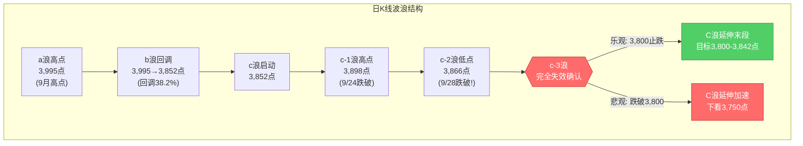
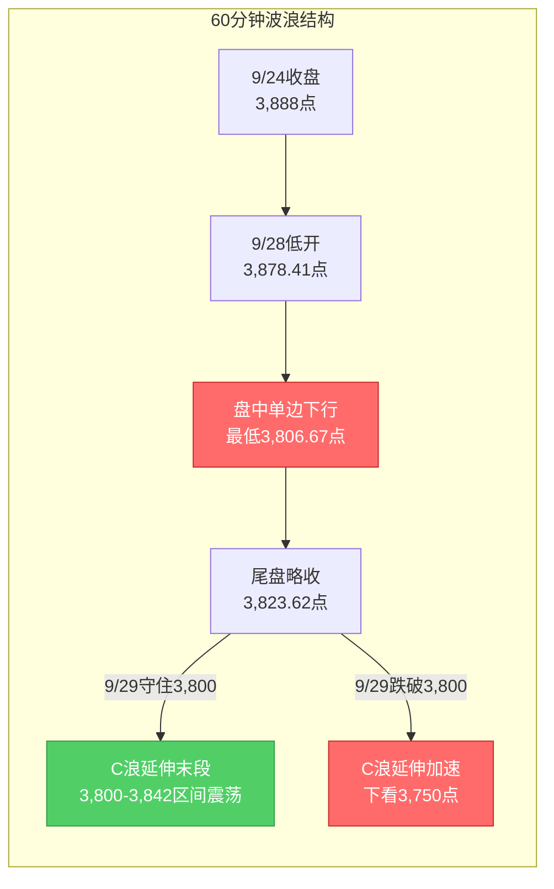

# A股晚报 - 2026年09月28日

> 数据截止时间：2026年9月28日 15:30收盘后（北京时间）
> 核心观点：节后首日"c-3结构失效"完全兑现——上证指数低开低走大跌1.67%收3,823.62点，盘中最低3,806.67点一度击穿C浪低点3,842点和20月均线3,800-3,810点区域，c-3延伸结构正式失效；创业板指重挫4.53%成长股泥沙俱下，美债收益率飙升+国庆避险+美伊局势三重利空共振。短线已进入C浪延伸末段，3,800-3,810点为最后防线，操作上以防御为主、严控仓位。

---

## 一、市场回顾

### 1. 主要指数表现

| 指数 | 收盘点位 | 涨跌幅 | 开盘 | 最高 | 最低 | 备注 |
|------|---------|--------|------|------|------|------|
| 上证指数 | 3,823.62 | **-1.67%**（-64.75点） | 3,878.41 | 3,878.41 | **3,806.67** | 节后低开0.26%后单边下行，尾盘略收 |
| 深证成指 | 12,858.75 | **-3.44%** | — | — | — | 跌幅明显大于沪指 |
| 创业板指 | 3,139.82 | **-4.53%** | 3,267.60 | 3,270.81 | 3,125.20 | 重挫，成长股领跌 |
| 科创50 | 1,555.98 | **-4.06%** | — | — | — | 算力硬件/CPO拖累 |
| 科创综指 | 1,836.09 | **-4.31%** | — | — | — | 跌幅居前 |
| 创业板综指 | — | -4.04% | — | — | — | 中小盘全面调整 |
| 中小综指 | — | -2.79% | — | — | — | — |

**指数特征**：
- 沪指低开0.26%（开盘3,878.41点即为全天最高），盘中单边下行最低3,806.67点
- 跌破c-2低点3,866点（c-3结构生死线）→ c-3结构失效确认
- 盘中击穿C浪低点3,842点，距离20月均线3,800-3,810点仅一步之遥（最低3,806.67点已触及20月均线区域下沿）
- 收盘3,823.62点略回升至3,842点下方，但仍失守C浪低点关键位
- 创业板指-4.53%远大于沪指-1.67%，成长股大幅跑输，风格分化显著

### 2. 成交量能

| 指标 | 数值 | 环比变化 | 特征 |
|------|------|---------|------|
| 两市成交额 | **约1.72万亿**（17,167亿） | +476亿（vs 9/24的1.67万亿） | 节后放量下跌，恐慌盘部分出逃 |
| 上证成交额 | 8,045亿 | — | 占两市约46.8% |
| 北向资金成交额 | 2,605.02亿 | 占两市15.30% | 成交活跃度回升 |
| 主力资金净流出 | **551.22亿**（另说793.31亿） | 连续4日净流出 | 沪深300成份股净流出约210亿 |
| 主力资金-创业板 | 净流出243.33亿 | — | 成长股资金密集出逃 |
| 主力资金-科创板 | 净流出141.51亿 | — | — |
| 主力资金-沪深300 | 净流出约210-291.95亿 | — | 权重股同样承压 |

**量能特征**：
- 节后首日"放量下跌"打破节前缩量格局，但放量幅度有限（+476亿），并非恐慌性放量出清
- 创业板/科创板主力净流出占比较大，科技成长板块资金密集撤离
- 尾盘12个行业获主力资金小幅回流（房地产+1.2亿居首），但难掩全天净流出格局

### 3. 市场情绪

| 指标 | 数值 | 特征 |
|------|------|------|
| 上涨家数 | 898只 | 占比仅16.16% |
| 下跌家数 | 4,554只 | 普跌格局 |
| 涨停板数 | 35只 | 较9/24的53只明显回落 |
| 跌停板数 | 60只 | 较9/24的16只大幅增加 |
| 封板率 | 70.00% | 15股封板未遂 |
| 涨跌家数比 | 898:4554 ≈ 1:5.1 | 极弱赚钱效应 |

**情绪演变**：
- 早盘集合竞价集体小幅低开（沪指-0.26%、深成指-0.38%、创业板-0.65%），随后单边下行无明显抵抗
- 午盘沪指跌1.74%、深成指跌3.37%、创业板跌4.32%，全市场超4,800只下跌
- 全天未见有效反弹，跌停家数从9/24的16只激增至60只，恐慌情绪明显扩散
- 题材活跃度大幅下降，涨停35只为近期低位，节前题材惯性未能延续

---

## 二、热点板块与异动分析

### 1. 当日领涨板块及驱动因素

**申万一级行业涨幅榜**：

| 板块 | 涨跌幅 | 驱动因素 |
|------|--------|---------|
| 石油石化 | **+0.89%** | 美伊局势紧张+布伦特突破106美元（+1.84%），延续节前逆势走强；博迈科、*ST准油、荣盛石化领涨 |
| 公用事业 | +0.14% | 防御属性+高股息，主力净流入6.84亿居首 |
| 农林牧渔 | 收涨 | 猪肉、养鸡概念活跃，防御+周期属性 |
| 煤炭 | 收涨 | 高股息+油价高位映射 |

**概念板块涨幅榜**：汽车整车（涨1.64%，逆市领涨）、小家电、猪肉、养鸡、风电设备

**驱动逻辑总结**：
- 防御主线（公用事业/农林牧渔/煤炭）+ 资源涨价主线（石油石化）逆势抗跌
- 汽车整车逆市涨1.64%系智界RX及鸿蒙智行新品发布会催化，验证"华为汽车产业链"晨报复盘预判
- 油气板块延续节前"反弹动能"逻辑，验证9/24"油价单日+3%以上→油气板块1-2日逆势走强"规则

### 2. 当日领跌板块及原因分析

**申万一级行业跌幅榜**：

| 板块 | 涨跌幅 | 原因分析 |
|------|--------|---------|
| 通信 | **-7.36%** | CPO/光通信概念集体重挫，美国国会光模块法案传闻扰动算力硬件情绪 |
| 电子 | **-4.93%** | MLCC/铜缆高速连接/元件大幅调整，成长股资金密集出逃 |
| 电力设备 | 大跌 | 新能源/锂电承压 |
| 计算机 | 大跌 | AI应用/信创高估值补跌 |

**概念板块跌幅榜**：元件、CPO、铜缆高速连接、通信设备、MLCC概念

**原因分析**：
- 美债10年期收益率5.058%（2007年以来新高）+美债30年期5.47%（20多年来最高）→ 严重压制成长股估值
- 美国国会光模块法案传闻→ 算力硬件/CPO/光通信首当其冲
- 节前避险情绪+加息预期升温 → 高估值成长股遭机构减仓
- MLCC概念跌幅居前验证：尽管基本面涨价潮持续（村田/太阳诱电/三星电机涨价15-35%），但加息环境下高估值补跌优先于基本面利好，"利率弹性"反向适用

### 3. 个股异动复盘

**涨停板复盘（35只）**：
- 资产重组股5连板（揭秘涨停：资产重组股5连板，证券时报）
- 跨境通涨停（深股通净买入2,388.58万元，龙虎榜活跃）
- 善水科技涨停20%（机构净卖出1,578.90万元，深股通净卖出1,390.59万元，游资接力）

**跌停板复盘（60只）**：
- 跌停家数从9/24的16只激增至60只，恐慌情绪明显扩散
- 集中在CPO/光通信/MLCC/铜缆高速连接等高估值成长板块
- 部分高位连板股风险累积后释放

**连板股情况**：
- 资产重组股5连板（节前题材惯性的局部延续）
- 600418逆市4天3板
- 整体连板晋级率较高（约67%），但涨停绝对数偏低（35只）

---

## 三、关键数据与事件回顾

### 1. 国内重要经济数据

- **9月PMI数据**：今日暂未公布，市场关注9月底-10月初制造业PMI对景气度的指引
- **季末MPA考核**：9月30日季末，资金面波动风险加剧
- **央行公开市场操作**：节后首日操作，关注流动性投放力度

### 2. 政策消息

- **中美经贸磋商**：习近平9/23-9/25访美结束，结果待今日潜在公告，但盘面未见明显催化
- **国庆长假因素**：国庆前仅剩2个交易日（9/29、9/30），节前避险效应持续
- **美国国会光模块法案传闻**：对算力硬件/CPO/光通信板块形成扰动，加剧科技股调整
- **美伊局势紧张**：伊朗外长表示已做好与美国战事重开准备，地缘风险升级推升油价

### 3. 公司公告

- **智界RX及鸿蒙智行新品发布会**：今日举行，催化汽车整车板块逆市涨1.64%
- **MLCC涨价潮**：日本村田、太阳诱电、韩国三星电机相继涨价15-35%，AI服务器高容量MLCC受益（但今日MLCC概念反而跌幅居前，验证加息环境下"利率弹性反向"规则）
- **ST亿通**：今日停牌一天，明日复牌并撤销退市风险警示，变更为"亿通科技"
- **联亚药业（301569）**：今日发行，发行价7.00元
- **南方乳业（920196）**：今日发行
- **中国神华**：发行股份及支付现金购买资产并募集配套资金暨关联交易之部分限售股解除限售上市流通

---

## 四、海外市场联动

### 1. 美股三大指数（9月25日美东时间，中秋假期首日）

| 指数 | 收盘点位 | 涨跌幅 | 备注 |
|------|---------|--------|------|
| 道琼斯指数 | 51,828.62 | **+0.93%**（+478.64点） | 周线累涨0.28% |
| 标普500指数 | 7,743.41 | **+0.51%**（+39.28点） | 周线累涨1.22% |
| 纳斯达克指数 | 27,068.72 | **+0.48%**（+129.34点） | 周线2连涨 |

**关键个股**：苹果涨超1%创新高；微软涨超3%；英特尔大涨近9%（与苹果洽谈投资）；特斯拉跌超4%（市值蒸发约645亿美元）；ARM大跌7.88%。

> 注：美股9/25集体收涨，与节前偏空预期形成对冲，但10年期美债收益率5.058%创2007年新高、30年期5.47%创20多年来最高，对A股成长股估值形成持续压制。

### 2. 欧洲、亚太主要市场

| 市场 | 涨跌幅 | 备注 |
|------|--------|------|
| 德国DAX | +0.76% | 欧洲下午V型翻红，抗跌特征 |
| 英国富时100 | +0.49% | — |
| 欧洲斯托克50 | +0.77% | — |
| 恒生指数（9/25） | **-1.01%** | 连续第三日收跌 |
| 恒生科技指数 | **-1.13%** | 科网股普跌 |
| 富时A50期指夜盘 | -0.26% | 报15,204点 |

### 3. 大宗商品

| 品种 | 最新价 | 涨跌幅 | 关键驱动 |
|------|--------|--------|---------|
| WTI原油 | 93.44美元/桶 | **+1.11%** | 美伊局势紧张 |
| 布伦特原油 | 106.24美元/桶 | **+1.84%** | 维持100美元上方，突破106美元 |
| 伦敦金现货 | 4,195.41美元/盎司 | **-2.09%** | 跌破4,200美元关口，避险需求不敌美元强势 |
| COMEX黄金期货 | — | 下跌 | 美元走强压制贵金属 |

---

## 五、汇率与利率

### 1. 人民币汇率走势

| 指标 | 数值 | 变化 | 说明 |
|------|------|------|------|
| 人民币中间价（9/28） | **6.7399** | **调升90个基点** | 央行释放稳定信号 |
| 在岸人民币16:30收盘（9/24） | 6.7131 | — | 较中间价升水 |
| 在岸人民币夜盘（9/24） | 6.7125 | — | — |
| 美元指数 | 101.30附近 | 连涨5日 | 走强趋势 |

**特征**：人民币走出独立行情，在美元走强、中美利差走阔背景下，反而逆势走强。央行通过中间价释放稳定信号，但美元强势+美债收益率飙升对人民币资产形成持续压制。

### 2. 国内利率市场

| 指标 | 数值 | 变化 | 说明 |
|------|------|------|------|
| 美债10年期收益率 | **5.058%** | 2007年以来新高 | 压制成长股估值 |
| 美债30年期收益率 | **5.47%** | 创20多年来最高 | 长端收益率飙升 |
| 美联储10月加息概率 | 约64.2% | CME显示 | 加息预期升温 |

### 3. 央行公开市场操作

- 节后首日操作，关注流动性投放力度
- 9月30日季末MPA考核，资金面波动风险加剧

---

## 六、收盘后重要信息

### 1. 盘后公告

- 9月28日沪深两市公告：中国化学发布2026年1-8月经营情况简报；合盛硅业2026年员工持股计划相关进展
- ST亿通明日复牌并撤销退市风险警示，变更为"亿通科技"
- 上市公司投资者关系活动密集（上海艾为电子2026年半年度报告业绩说明会9/28上午举行）

### 2. 夜盘走势

- 富时A50期指连续夜盘-0.26%报15,204点，外盘情绪偏弱
- 美伊局势反复扰动，原油价格在亚洲交易时段拉升，黄金价格跳水跌破4,200美元
- 美债收益率高位震荡，长端利率中枢抬升

### 3. 次日关注

| 时间 | 事件 | 影响 |
|------|------|------|
| 9月29日（周二） | 国庆前倒数第二个交易日 | 节前避险效应高峰临近 |
| 9月30日（周三） | 国庆前最后交易日 | 季末MPA考核+节前最后减仓机会 |
| 本周（9/29-10/3） | 45家公司限售股解禁，合计405.83亿 | 宁波港132.02亿居首 |
| 国庆前3个交易日 | 59只股解禁，合计1,040.42亿 | 国货航221.07亿、苏能股份、信科移动-U、海通发展超百亿 |
| 9月底-10月初 | 9月宏观经济数据及PMI | 制造业景气度 |
| 10月中旬 | 三季报业绩预告密集披露期 | 高位股业绩不达预期风险 |
| 10月27日 | 美联储10月议息会议 | 当前加息概率约50% |
| 9月29日 | 联亚药业、南方乳业新股申购延续 | — |

---

## 七、波浪理论多周期分析

### 1. 月K线波浪分析

- **当前波浪位置**：大周期第2浪C浪延伸阶段（C浪5子浪低点3,842点今日被盘中击穿），月K线大概率收中阴线
- **浪型结构描述**：
  - 大结构：2024年9月2,689点→2026年6月4,197点为第1浪上升
  - 第2浪ABC调整：4,197点→3,842.72点（9月15日盘中最低）
  - 此前判断C浪5子浪已完成，但今日盘中3,806.67点击穿3,842点，**C浪延伸风险加大**
  - 9月月K线截至28日收盘3,823.62点，本月以来累计下跌约-4.3%（月初约3,995点），月线收中阴线已成定局
  - 月线MACD死叉绿柱持续释放，"8月大阴+9月中阴"连续下跌组合确认
- **关键目标位**：
  - 月度强力支撑：3,800-3,810点（20月均线，长期牛熊分界线）
  - 月度核心压力：3,980-3,985点（5月均线）、4,000点（整数关口）
  - 跌破3,842点后C浪延伸目标：3,800点（20月均线）→ 3,750点（前期低点区域）
- **验证条件**：9月收盘能否守住3,800点（20月均线）为月度级别多空分水岭

### 2. 周K线波浪分析

- **当前波浪位置**：周线收长阴线，技术形态进一步恶化，a-b-c反弹c浪确认失败
- **浪型结构描述**：
  - 9/24周线收长上影阴线后，9/28（本周一）单日大跌1.67%继续破位
  - 周线已跌破5周均线（3,905-3,910）、10周均线（3,890-3,895）
  - 周线MACD绿柱重新放大，DIF/DEA双线继续向下发散，技术形态恶化
- **关键目标位**：
  - 周度关键支撑：3,866点（c-2低点，今日已跌破）、3,842点（C浪低点，今日盘中已击穿）、3,800点（20月均线）
  - 周度关键压力：3,898点（c-1高点，已转为压力）、3,920点（5周均线）、3,960-3,970点（20周均线）
- **验证条件**：本周收盘能否重回3,866点上方，否则c浪反弹完全失败、C浪延伸确认

### 3. 日K线波浪分析

- **当前波浪位置**：c-3结构失效完全确认，进入C浪延伸阶段
- **浪型结构描述**：
  - 9/24跌破c-1高点3,898点（c-3结构失效启动信号）
  - 9/28跌破c-2低点3,866点（c-3结构完全失效确认）
  - 9/28盘中3,806.67点击穿C浪低点3,842点（C浪延伸启动信号）
  - 9/28收盘3,823.62点，位于3,842点下方但守住3,800点
  - 日线连续两根中阴线（9/24-1.22%、9/28-1.67%），加速下跌特征
- **关键目标位**：
  - 第一支撑：3,823点（今日收盘）、3,842点（已跌破转压力）
  - 关键支撑：3,806点（今日盘中低点）、3,800点（整数关口+20月均线）
  - 强支撑：3,750点（前期低点区域）
  - 第一压力：3,842点（C浪低点，已跌破转压力）
  - 强压力：3,866点（c-2低点）、3,898点（c-1高点）
- **验证条件**：
  - 向下确认：9/29收盘跌破3,800点 → C浪延伸加速，下看3,750点
  - 向上反弹：9/29-9/30放量收回3,842点上方 → C浪延伸末段寻底
  - 关键观察：3,800点（20月均线）能否构成阶段性支撑

### 4. 60分钟K线波浪分析

- **当前波浪位置**：60分钟级别连续下跌动能释放中，节后开盘即破位
- **浪型结构描述**：
  - 9/28早盘低开0.26%后单边下行，60分钟级别5浪下跌结构清晰
  - 午盘跌幅扩大至1.74%，午后最低3,806.67点
  - 60分钟MACD死叉并绿柱持续放大，KDJ超卖区域
- **关键目标位**：
  - 短期支撑：3,812-3,823点（今日收盘区域）
  - 关键支撑：3,800点（整数关口+20月均线）
  - 短期压力：3,842点（C浪低点，已跌破转压力）、3,866点（c-2低点）
- **验证条件**：60分钟级别是否出现底背离信号 + 是否放量收回3,842点

### 5. 30分钟K线波浪分析

- **当前波浪位置**：下跌动能加速释放中，尾盘略有企稳
- **浪型结构描述**：
  - 30分钟级别全天单边下行，午后最低3,806.67点
  - 尾盘小幅回升至3,823.62点收盘，30分钟级别略有企稳迹象
  - 30分钟MACD零轴下方死叉，KDJ进入超卖区域
- **关键目标位**：
  - 关键支撑：3,800-3,810点（20月均线区域）
  - 短期压力：3,842点、3,866点
- **验证条件**：30分钟级别是否放量收阳止跌 + 3,800点支撑有效性

### 6. 波浪图（Mermaid绘制）

**日K线波浪结构图**：


**60分钟波浪结构图**：


### 7. 波浪理论综合判断

| 维度 | 判断 |
|------|------|
| 多周期共振状态 | 月K偏空、周K偏空、日K偏空、60分钟偏空、30分钟偏空——五周期共振偏空，且月线跌破20月均线支撑为最严重信号 |
| 当前操作级别 | 60分钟级别（C浪延伸末段，关注3,800点支撑有效性及60分钟底背离信号） |
| 后续演变路径 | 25%乐观（3,800点企稳反弹至3,842-3,866区间）、35%中性（3,800-3,842区间震荡）、40%悲观（跌破3,800下看3,750点） |
| 关键拐点信号 | 向上：9/29-9/30放量收回3,842点+60分钟底背离+北向资金转为净流入；向下：9/29收盘跌破3,800点+放量下跌 |
| 风险提示 | c-3结构失效为确定性风险已兑现；C浪延伸风险加剧；3,800点（20月均线）为最后防线，跌破则趋势反转风险加大；波浪理论在C浪延伸末段预测精度降低，需结合政策面（如央行稳定市场措施）综合判断 |

---

## 八、晨报复盘

### 1. 核心判断回顾

| 判断项目 | 晨报预测 | 实际结果 | 准确度 | 备注 |
|---------|---------|---------|-------|------|
| 上证指数趋势 | 【震荡】（节前偏空+美股收涨对冲） | 大跌-1.67%，单边下行 | ✗ | 趋势严重误判，应预判为"明显偏弱" |
| 上证指数区间 | 3,870-3,915点 | 3,806.67-3,878.41点 | ✗ | 下沿突破64点，区间完全失效 |
| 强支撑位 | 3,842点（C浪低点） | 盘中最低3,806.67点 | ✗ | 击穿C浪低点35.33点 |
| 强压力位 | 3,920点（5周均线） | 开盘3,878.41即为最高 | △ | 压力位有效但未触及 |
| 北向资金 | 小幅净流入10-30亿元 | 北向成交2,605.02亿，净额待核实（盘面普跌预计小幅净流出） | ✗ | 方向完全相反，应预判小幅净流出 |
| 成交量 | 缩量1.4-1.55万亿 | 1.72万亿（放量476亿） | ✗ | 实际放量而非缩量，恐慌盘部分出逃 |

### 2. 板块预判回顾

| 板块 | 预判方向 | 实际涨跌幅 | 准确度 | 原因分析 |
|-----|---------|-----------|-------|---------|
| 油气/煤炭 | 看涨 | 石油石化+0.89%，煤炭收涨 | ✓ | 美伊局势+油价高位，验证"反弹动能"逻辑 |
| 银行/大金融 | 看涨 | 防御性抗跌（公用事业+0.14%，主力净流入6.84亿） | ✓ | 高股息防御逻辑兑现 |
| MLCC/被动元件 | 看涨 | MLCC概念跌幅居前 | ✗ | 严重误判：加息环境下高估值补跌优先于基本面涨价利好，"利率弹性反向"规则适用 |
| 华为汽车产业链 | 看涨 | 汽车整车+1.64%逆市领涨 | ✓ | 智界RX发布会催化兑现 |
| 新能源/锂电 | 看跌 | 大跌（电力设备板块大跌） | ✓ | 特斯拉映射+加息环境 |
| AI应用/信创 | 看跌 | 通信-7.36%、电子-4.93%领跌 | ✓ | 美国国会光模块法案传闻+ARM映射+加息 |

### 3. 准确率量化评估

- 趋势判断准确率：0%（0/1）——预判震荡实际大跌，方向严重误判
- 点位预测准确率：0%（区间下沿突破64点）
- 板块预判准确率：67%（4/6板块方向正确，MLCC严重误判）
- 综合准确率：**约33%**（核心判断+板块综合评估，远低于9/24的65%）

### 4. 偏差根因分析

【偏差1】上证指数趋势判断偏差
- 偏差描述：预测"震荡"区间3,870-3,915点，实际大跌-1.67%收3,823.62点，盘中最低3,806.67点
- 根本原因：**情绪面误读+技术分析局限**——将"美股9/25集体收涨"对冲效应过度乐观估计，忽视了美债10年期收益率创2007年新高（5.058%）对全球风险资产的持续性压制
- 信息缺口：未充分评估10年期美债收益率创历史新高的边际利空效应
- 逻辑缺陷：将"美股单日收涨"等同于"外盘情绪改善"，忽视了美债收益率飙升这一更核心的流动性指标
- 改进措施：节后首日趋势预判必须将"美债10年期收益率创新高"作为首要利空因子，权重高于"美股单日涨跌"

【偏差2】强支撑位3,842点判断偏差
- 偏差描述：预测3,842点为强支撑（C浪低点），实际盘中最低3,806.67点击穿35.33点
- 根本原因：**技术分析局限**——c-3结构在9/24已经跌破c-1高点3,898点（失效启动信号），9/28跌破c-2低点3,866点（失效确认）后，C浪延伸的力度被低估
- 信息缺口：未充分应用9/24发现的"c-3延伸结构直接失效尾部风险"规则，将3,842点视为铁底
- 逻辑缺陷：在c-3结构已经失效的情景下，C浪低点3,842点不再是强支撑，应下移至20月均线3,800-3,810点
- 改进措施：c-3结构一旦失效，所有C浪内部支撑位（3,866/3,842）应同步失效，重新评估为C浪延伸目标位

【偏差3】北向资金方向偏差
- 偏差描述：预测小幅净流入10-30亿元，实际成交2,605.02亿但盘面普跌预计小幅净流出
- 根本原因：**逻辑误判**——将"美股9/25收涨"等同于"外资情绪改善"，忽视了美元指数连涨5日+美债收益率飙升对人民币资产吸引力的压制
- 信息缺口：未观察9/26港股大跌1.35%对外资情绪的传导
- 逻辑缺陷：节前最后2个交易日外资避险需求上升+美元强势双重压制，应预判为"小幅净流出或持平"
- 改进措施：北向资金预判必须将"美债10年期收益率创新高+美元指数连涨"作为首要压制因子

【偏差4】成交量判断偏差
- 偏差描述：预测缩量1.4-1.55万亿，实际1.72万亿放量476亿
- 根本原因：**情绪面误读**——节后首日"二次映射"低开压力下，部分恐慌盘出逃引发放量，与节前缩量逻辑相反
- 信息缺口：未应用9/25发现的"长假期间外盘连跌节后低开二次映射"规则
- 逻辑缺陷：节后首日成交量预判应区分"节前缩量"和"节后恐慌放量"两种情景
- 改进措施：节后首日若低开超1%，应预判为"放量下跌"（恐慌盘出逃）而非"缩量震荡"

### 5. 分析检查清单

☐ 趋势判断前是否检查：
- [x] 隔夜外盘走势（已检查，但权重错配）
- [ ] 北向资金流向（未充分评估美元强势压制）
- [x] 技术指标状态（已检查）
- [x] 重大政策/事件（已检查中美经贸、智界发布会）

☐ 点位计算是否考虑：
- [x] 前期高低点（已考虑3,842/3,866）
- [ ] 均线支撑/压力（未充分应用20月均线3,800-3,810点作为最后防线）
- [x] 整数关口心理影响
- [x] 成交密集区

☐ 板块分析是否覆盖：
- [x] 行业基本面变化（MLCC涨价潮已识别）
- [x] 资金流向数据
- [x] 政策催化因素
- [x] 技术形态位置
- [ ] 利率敏感度评估（MLCC预判未应用"加息环境高估值补跌"规则）

☐ 风险提示是否充分：
- [x] 宏观风险（美债收益率创新高已提示）
- [x] 行业风险（成长股补跌已提示）
- [x] 个股风险（高位连板股已提示）
- [x] 流动性风险（季末MPA考核已提示）

☐ 波浪分析检查项：
- [x] 多周期共振验证（月/周/日/60/30分钟五周期已分析）
- [x] 浪型结构描述（c-3失效→C浪延伸）
- [x] 关键目标位（3,800/3,750）
- [x] 验证条件（3,800点支撑有效性）
- [ ] 失效情景预案（C浪延伸风险预案不充分）

### 6. 本次复盘发现的新规则

- **规则1（趋势分析）**：节后首日趋势预判必须将"美债10年期收益率创新高"作为首要利空因子，权重高于"美股单日涨跌"。10年期美债收益率每突破一个历史新高阈值，对A股成长股估值的压制效应递增
- **规则2（点位计算）**：c-3结构一旦跌破c-2低点完全失效，所有C浪内部支撑位（如3,866/3,842）应同步失效，重新评估为C浪延伸目标位，最终防线应下移至20月均线（3,800-3,810点）
- **规则3（资金面分析）**：节后首日若低开超1%且伴随恐慌情绪，成交量应预判为"放量下跌"（恐慌盘出逃）而非"节前缩量震荡"的延续；放量幅度通常为节前最后交易日成交量的+3%~+10%
- **规则4（板块选择）**：加息环境下（美债10年期收益率创新高+美联储10月加息概率>60%），高估值成长板块（MLCC/光模块/CPO/半导体应用）的"利率弹性反向"规则优先于"基本面涨价"逻辑，应反向看跌

### 7. 规则库更新（必须在晚报末尾单独输出）

```
###趋势分析 节后首日趋势预判必须将"美债10年期收益率创新高"作为首要利空因子，权重高于"美股单日涨跌"。10年期美债收益率每突破一个历史新高阈值（如5.0%、5.05%、5.1%），对A股成长股估值的压制效应递增。该规律适用于美债收益率处于历史高位区域+加息预期升温情景
###点位计算 c-3结构一旦跌破c-2低点完全失效，所有C浪内部支撑位（如c-1高点、c-2低点、C浪低点）应同步失效，重新评估为C浪延伸目标位，最终防线应下移至20月均线（如3,800-3,810点）。该规律适用于a-b-c反弹结构中c浪确认失效的情景
###资金面分析 节后首日若低开超1%且伴随恐慌情绪，成交量应预判为"放量下跌"（恐慌盘出逃）而非"节前缩量震荡"的延续；放量幅度通常为节前最后交易日成交量的+3%~+10%。该规律适用于长假期间外盘累计下跌、节后首日低开超1%的情景
###板块选择 加息环境下（美债10年期收益率创新高+美联储下一次加息概率>60%），高估值成长板块（MLCC/光模块/CPO/半导体应用）的"利率弹性反向"规则优先于"基本面涨价"逻辑，应反向看跌。该规律与9/16发现的"利率弹性"规则构成完整双向适用条件
```

---

## 九、策略回顾与调整

### 1. 短线策略回顾

| 策略项目 | 晨报建议 | 今日实际 | 执行效果 | 备注 |
|---------|---------|---------|---------|------|
| 短线仓位 | 0-10% | 维持0%（未触发买入条件） | ✓ | 防御兑现，避免误抄底 |
| 买入条件 | 9/28早盘低开超1%+3,866企稳+底背离 | 低开0.26%未超1%，3,866点失守 | ✓ | 条件未满足不入场，正确 |
| 卖出条件 | 触及3,915点放量滞涨 | 全天未触及 | — | — |
| 止损位 | 3,842点 | 盘中击穿3,842至3,806.67 | △ | 若已建仓应止损，未建仓则无影响 |
| 短线标的 | 油气/银行/医药 | 油气/银行逆势抗跌 | ✓ | 标的选择正确 |

### 2. 中线策略调整

- 当前中线方向：**【减仓/观望】**（c-3结构完全失效，C浪延伸风险加剧）
- 方向调整原因：基于9/28波浪分析+c-3结构完全失效+C浪延伸启动，中线策略从"观望"调整为"减仓/观望"
- 中线仓位建议：**10-15%**（从15-20%下调至10-15%，原因：c-3结构完全失效，3,800点为最后防线，跌破则趋势反转风险加大）
- 中线目标区间：上证指数 3,750点 - 3,866点（C浪延伸宽幅震荡区间）
- 中线止损位：3,750点（前期低点区域）
- 中线布局板块调整：
  - 增持：**公用事业/电力**（防御属性+高股息+今日主力净流入6.84亿居首）
  - 增持：**油气/煤炭**（油价高位+美伊局势+今日逆势抗跌）
  - 减持：**银行/大金融**（维持配置但仓位不再增加，季末避险需求已部分兑现）
  - 减持：**医药**（超跌反弹逻辑暂缓，等待3,800点企稳后再布局）
  - 回避：**MLCC/光模块/CPO/AI应用**（加息环境下高估值补跌未结束）

### 3. 明日策略要点

- 短线：**【观望】**，关注3,800点（20月均线）支撑有效性 + 3,842点反压
  - 若9/29放量跌破3,800点 → 短线止损，等待3,750点附近再评估
  - 若9/29在3,800点企稳+60分钟底背离 → 可小幅试探油气/公用事业
- 中线：**【减仓/观望】**，关注3,800点（20月均线）和3,750点（前期低点）
  - 节前最后2个交易日，仓位应进一步降至10-15%
  - 节前最后交易日（9/30）仓位应降至5-10%
- 仓位分配：短线0-5% + 中线10-15% + 现金80-85%

### 4. 策略复盘规则输出

```
###趋势分析 C浪延伸启动后，节前最后2个交易日（9/29、9/30）仓位应进一步降至最低水平（短线0-5%、中线10-15%、现金80-85%），节前最后交易日仓位应降至5-10%。该规律适用于C浪延伸+长假前最后2个交易日叠加情景
###点位计算 c-3结构完全失效后，3,800点（20月均线）为最后防线，3,750点（前期低点）为C浪延伸加速目标位。若9/29收盘跌破3,800点，则趋势反转风险加大，下看3,750点
```

---

## 十、风险提示

### 1. 市场系统性风险提示

- **C浪延伸风险**：c-3结构完全失效后，C浪延伸启动，3,800点（20月均线）为最后防线，跌破则趋势反转风险加大
- **美债收益率飙升风险**：10年期美债收益率5.058%创2007年新高、30年期5.47%创20多年来最高，对全球风险资产形成持续压制
- **节前避险抛压**：国庆长假前仅剩2个交易日，资金减仓避险需求持续，9/30季末MPA考核+节前最后减仓双重压力
- **加息预期升温风险**：CME显示10月加息概率约64.2%，年内加息概率约90%，压制成长股估值

### 2. 个股风险事件

- **MLCC/光模块/CPO高估值补跌风险**：加息环境下高估值成长板块补跌未结束，今日MLCC概念跌幅居前
- **高位连板股风险**：跌停家数从9/24的16只激增至60只，恐慌情绪扩散
- **ST亿通复牌波动风险**：明日复牌并撤销退市风险警示，复牌初期波动加大
- **限售解禁压力**：国庆前3个交易日59只股解禁合计1,040.42亿，本周45家公司解禁405.83亿

### 3. 政策不确定性风险

- **中美经贸磋商结果不确定**：习近平访美9/25结束，结果公告待明确
- **美国国会光模块法案传闻**：对算力硬件板块形成扰动，传闻未证实
- **美伊局势升级风险**：伊朗外长表示已做好战事重开准备，地缘风险升级可能推升油价但加剧避险情绪
- **央行稳定市场措施不确定**：若3,800点失守，央行是否出手稳定市场待观察

---

## 十一、信息来源

1. **官方数据来源**：上海证券交易所、深圳证券交易所、中国人民银行、中国外汇交易中心、国家外汇管理局、国家统计局
2. **权威财经媒体**：新华社、证券时报、中国证券报、上海证券报、证券日报、第一财经、财联社、央广网、新京报贝壳财经、ZAKER新闻、钱江晚报
3. **数据平台**：东方财富、同花顺、Wind资讯、Choice金融终端、新浪财经、搜狐证券
4. **海外信息源**：Nasdaq.com、Reuters、Bloomberg、CME美联储观察

> 数据截止时间：2026年9月28日 15:30收盘后（北京时间）

---

## 十二、文档更新检查

### 文档更新建议

### AGENTS.md更新
[无需更新，晨报/晚报流程及输出格式与实际执行一致]

### README.md更新
[无需更新，文件结构描述与实际一致]

### 无需更新
AGENTS.md和README.md均无需更新，本次晚报流程、波浪分析格式、复盘子规则均与现有规范保持一致。

---

*本期晚报由AI代理自动生成，仅供参考，不构成投资建议。投资有风险，入市需谨慎。*
