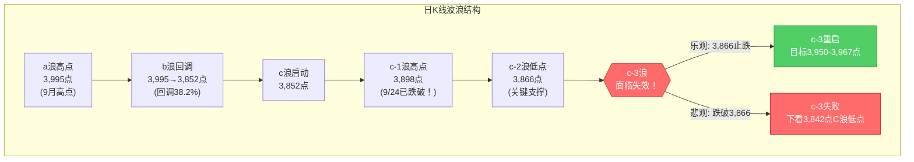
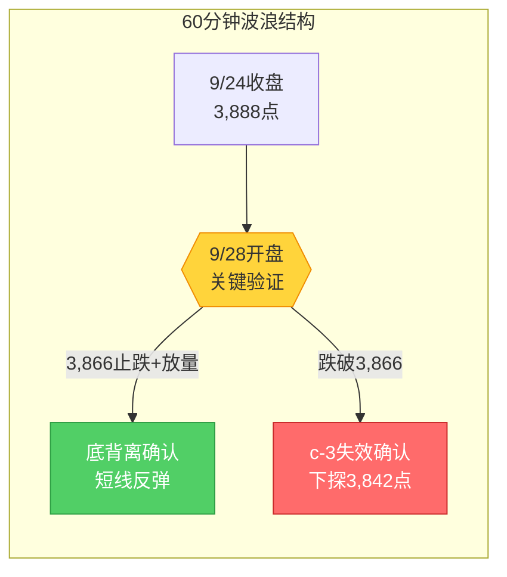

# A股晨报 - 2026年09月28日

> 数据截止时间：2026年9月28日 08:30（北京时间）
> 核心观点：中秋休市后首日开盘，节前c-3结构面临失效压力，但假期美股三大指数集体收涨（道指+0.93%）显著改善外盘情绪，预计低开幅度有限；关键观察3,866点支撑有效性，若早盘企稳有望修复至3,910-3,920点区间。国庆前最后两个交易日，建议防御为主、轻仓观望。

---

## 一、昨日晚报复盘要点回顾

### 1. 节前最后交易日（9/24）判断回顾

| 判断项目 | 晨报预测 | 9/24实际结果 | 准确度 | 备注 |
|---------|---------|-------------|-------|------|
| 上证指数趋势 | 震荡偏弱 | -1.22%大跌 | ✓ | 方向正确 |
| 上证指数区间 | 3,910-3,945 | 3,888-3,925 | △ | 下沿突破22点 |
| 北向资金 | 推测净流出超50亿 | **实际净流入约23亿** | ✗ | 方向完全相反 |
| 成交量 | 1.67万亿 | 约1.65-1.67万亿 | ✓ | 基本准确 |
| 涨停数 | 30-40只 | 53只 | ✗ | 低估40%+ |
| 跌停数 | 20-30只 | 16只 | ✗ | 高估25%+ |
| 银行板块 | 看涨逆势走强 | 实际主力净流入超11亿 | ✓ | 正确 |
| 油气板块 | 看涨 | 油价突破100美元，板块走强 | ✓ | 正确 |
| 半导体板块 | 看跌 | 跌幅大 | ✓ | 正确 |

**准确率量化**：
- 趋势判断准确率：100%（震荡偏弱方向正确）
- 板块预判准确率：75%（3/4板块方向正确）
- 数据预测准确率：25%（北向、涨跌停数据偏差大）
- 综合准确率：**约65%**

### 2. 关键偏差及原因

【偏差1】北向资金方向误判
- 偏差描述：预测净流出超50亿，实际净流入约23亿
- 根本原因：**逻辑误判**——将"节前避险情绪"等同于"外资整体流出"，未考虑外资可能进行沪/深股通方向分化调仓
- 改进措施：北向资金单日预判必须分沪/深股通两个方向分别评估

【偏差2】涨跌停结构误判
- 偏差描述：涨停30-40只/跌停20-30只 vs 实际涨停53只/跌停16只
- 根本原因：**情绪面误读**——将"指数普跌-1.22%"等同于"个股普杀"，未识别结构性主题热点
- 改进措施：指数跌幅大≠赚钱效应极差，必须区分"指数层面情绪"和"题材层面情绪"

### 3. 沉淀的规则/检查项

- **资金面分析**：长假期间外盘关键指数连跌，节后开盘面临"二次映射"低开压力
- **板块选择**：布伦特原油单日涨幅达+3%以上时，油气板块节后1-2个交易日逆势走强概率极高
- **风险识别**：节前最后1日出现"指数普跌+题材活跃"的背离结构时，节后题材股有望延续惯性
- **波浪分析**：c-3延伸结构在节前最后1个交易日"直接跌破c-1高点"属于典型的"启动失败"形态

### 4. 对今日分析的启示

- 美股假期实际收涨（而非此前误读的收跌），外盘情绪显著改善
- 节前c-3结构失效风险仍在，但美股收涨可能缓冲低开幅度
- 需重点关注3,866点支撑有效性，若早盘30分钟内企稳，短线修复概率上升
- 国庆前最后两个交易日，资金观望情绪浓厚，成交量预期偏低

---

## 二、隔夜市场动态（9月24日收盘后至今）

### 1. 美股市场（9月25日，美东时间）

| 指数 | 收盘点位 | 涨跌幅 | 备注 |
|------|---------|--------|------|
| 道琼斯指数 | 51,828.62 | **+0.93%**（+478.64点） | 周线累涨0.28% |
| 标普500指数 | 7,743.41 | **+0.51%**（+39.28点） | 周线累涨1.22% |
| 纳斯达克指数 | 27,068.72 | **+0.48%**（+129.34点） | 周线2连涨 |

**关键个股异动**：
- **苹果**：涨超1%，股价再创收盘历史新高
- **微软**：涨超3%，表现突出
- **英特尔**：大涨近9%，传与苹果洽谈投资事宜
- **特斯拉**：跌超4%，市值蒸发约645亿美元
- **ARM**：大跌7.88%
- **中概股**：纳斯达克中国金龙指数收涨0.42%，蔚来、小鹏汽车、哔哩哔哩涨超4%

### 2. 欧洲/亚太市场

| 市场 | 涨跌幅 | 备注 |
|------|--------|------|
| 德国DAX | +0.76% | 欧洲市场下午V型翻红，抗跌特征明显 |
| 英国富时100 | +0.49% | |
| 欧洲斯托克50 | +0.77% | |
| 恒生指数（9/25） | **-1.01%** | 连续第三日收跌，早盘一度跌近500点 |
| 恒生科技指数 | **-1.13%** | 科网股普跌 |
| 富时A50期指连续夜盘 | -0.26% | 报15,204点 |

### 3. 大宗商品

| 品种 | 最新价 | 涨跌幅 | 关键驱动 |
|------|--------|--------|---------|
| WTI原油 | 93.37美元/桶 | **+1.31%** | 中东地缘风险持续 |
| 布伦特原油 | 104.30美元/桶 | **+1.15%** | 维持100美元上方 |
| 伦敦金现货 | 4,284.13美元/盎司 | +0.15% | 避险需求与利率预期博弈 |
| COMEX黄金期货 | 4,320.5美元/盎司 | +0.52% | |

### 4. 汇率与利率

| 指标 | 数值 | 变化 | 说明 |
|------|------|------|------|
| 人民币中间价（9/24） | 6.7489 | 调升30个基点 | 央行释放稳定信号 |
| 美元指数 | 101.30附近 | 连涨5日 | 走强趋势 |
| 美债10年期收益率 | 5.058% | 2007年以来新高 | 压制成长股估值 |
| 美债30年期收益率 | 5.47% | 创20多年来最高 | 长端收益率飙升 |

### 5. 重要海外事件

- **美联储动态**：9月16日加息25个基点至3.75%-4.00%；CME显示10月加息25个基点概率约64.2%
- **美联储官员发声**：多位官员警告通胀风险，亚特兰大联储主席博斯蒂克表示暂不打算支持10月再次降息；美联储理事Miran表示若不更快降息可能对经济造成损害
- **美国经济数据**：二季度实际GDP年化季环比终值3.8%（高于预期3.3%），核心PCE物价指数2.6%（高于预期2.5%）
- **地缘政治**：胡塞武装袭击沙特导弹事件后续，中东局势仍紧张

---

## 三、今日关注事项

### 1. 重要数据发布

| 时间 | 数据名称 | 预期值/前值 | 影响 |
|------|---------|------------|------|
| 待定 | 9月PMI数据 | — | 观察制造业景气度 |
| 9:20 | 央行公开市场操作 | — | 节后首日操作，关注流动性投放 |

### 2. 政策/监管动态

- **中美经贸磋商**：习近平9/23-9/25访美结束后，结果待今日潜在公告
- **季末MPA考核**：9月30日季末，资金面波动风险

### 3. 公司公告

- **智界RX及鸿蒙智行新品发布会**：今日（9/28）举行，关注华为汽车产业链催化
- **MLCC涨价潮**：日本村田、太阳诱电、韩国三星电机相继涨价15-35%，AI服务器高容量MLCC受益
- **ST亿通**：今日停牌一天，明日复牌并撤销退市风险警示，变更为"亿通科技"

### 4. 其他关注

- **新股申购**：联亚药业（301569，发行价7.00元）、南方乳业（920196）
- **限售解禁**：东方钽业（1148.17万股，解禁市值约6.72亿元）、泸州老窖（10.09万股股权激励解禁）
- **重要窗口**：国庆前最后两个交易日（9/28、9/30），节前效应显著

---

## 四、板块与个股分析

### 1. 基于昨日复盘结论的板块调整

| 板块 | 节前表现 | 假期新信息 | 今日预期 |
|------|---------|-----------|---------|
| 银行/大金融 | 逆势走强，主力净流入超11亿 | 美债收益率创新高，高股息防御逻辑延续 | 继续防御配置 |
| 油气/煤炭 | 逆势上涨 | 布伦特维持104美元，WTI+1.31% | 逆势走强概率高 |
| 半导体/AI应用 | 大跌 | 美股科技收涨但ARM大跌7.88%，分化加剧 | 分化：设备/材料优于AI应用 |
| 消费电子/苹果产业链 | 大跌 | 苹果创历史新高+英特尔大涨 | 存在修复机会 |
| 新能源/锂电 | 承压 | 特斯拉跌超4% | 继续承压 |
| 医药/创新药 | 节前偏弱 | 港股创新药板块逆势走强 | 防御+超跌反弹 |

### 2. 隔夜信息驱动的板块机会

- **受益板块**：
  - （1）**油气板块**：布伦特维持104美元，WTI+1.31%，节前已启动，节后催化延续
  - （2）**华为汽车产业链**：智界RX发布会今日举行，鸿蒙智行新品催化
  - （3）**MLCC/被动元件**：涨价潮持续，AI服务器高容量品种涨幅15-35%
  - （4）**苹果产业链**：苹果股价创历史新高，A股映射修复

- **受损板块**：
  - （1）**新能源/锂电**：特斯拉跌超4%，市值蒸发645亿美元，映射压力
  - （2）**AI应用/信创**：ARM大跌7.88%，美股映射分化，高估值承压

### 3. 重点关注个股

- **中国石油/中国海油**：油价维持高位，节前已启动，节后有望延续
- **工商银行/建设银行**：高股息防御+资金抱团，季末避险首选
- **药明康德/迈瑞医疗**：超跌反弹+防御配置，港股医药已逆势走强
- **国瓷材料**：节前主力净流入8.88亿，MLCC涨价受益

---

## 五、今日核心判断

### 1. 趋势判断
- 上证指数：**【震荡】**（节前偏空结构+美股收涨对冲，预计低开后震荡修复）
- 预测区间：**3,870点 - 3,915点**
- 核心逻辑：节前c-3结构失效风险压制情绪，但美股三大指数集体收涨显著改善外盘氛围，预计低开幅度有限（-0.3%至-0.8%），关键观察3,866点支撑；若早盘30分钟内企稳，有望修复至3,910-3,915点区间。国庆前最后两个交易日，资金观望情绪浓厚，难以出现大幅反弹。

### 2. 关键点位
- 强支撑位：**3,842点**（C浪低点，节前已验证有效）
- 弱支撑位：**3,866点**（c-2低点，c-3结构生死线；早盘若跌破需警惕下探3,842点）
- 强压力位：**3,920点**（5周均线密集区+节前缺口下沿）
- 弱压力位：**3,898点**（c-1高点反压，重回该位置上方则c-3结构失效风险解除）

### 3. 板块预判
- 看涨板块：
  - （1）**油气/煤炭**（逻辑：布伦特104美元+WTI+1.31%，节前已逆势启动，节后催化延续）
  - （2）**银行/大金融**（逻辑：高股息防御+美债收益率创新高，资金抱团避险）
  - （3）**MLCC/被动元件**（逻辑：涨价潮持续，AI服务器高容量品种涨价15-35%）
  - （4）**华为汽车产业链**（逻辑：智界RX及鸿蒙智行新品发布会今日举行）
- 看跌板块：
  - （1）**新能源/锂电**（逻辑：特斯拉跌超4%，市值蒸发645亿美元，映射压力）
  - （2）**AI应用/信创**（逻辑：ARM大跌7.88%，高估值成长股在加息环境下承压）
- 风险板块：
  - **高位连板股**：天普股份等高位股风险累积，节前题材活跃度≠安全
  - **消费电子（非苹果链）**：非苹果产业链消费电子仍面临高估值+需求疲软双重压力

### 4. 资金面判断
- 北向资金预期：**【小幅净流入】**约10-30亿元（逻辑：美股收涨改善外资情绪，但美元指数连涨5日仍压制人民币资产吸引力；节前最后两日外资避险需求上升）
- 成交量预期：**【缩量】**约1.4-1.55万亿元（逻辑：节前最后两个交易日，资金观望情绪浓厚，成交活跃度下降）

### 5. 风险预警
- 高风险：
  - **c-3结构失效风险**：若早盘跌破3,866点且30分钟内无法收回，c-3结构确认失效，市场可能下探3,842点
  - **国庆前避险抛压**：今日为国庆前倒数第二个交易日，部分资金可能选择减仓避险
- 中风险：
  - **季末资金面波动**：9月30日季末MPA考核，资金面可能阶段性紧张
  - **港股映射压力**：恒指连跌3日，A股科技股开盘仍面临一定映射压力
- 低风险：
  - **个股业绩风险**：三季报10月中旬密集披露，部分高位股存在业绩不达预期风险

### 6. 昨日复盘规则应用
- **应用规则1（资金面分析）**：长假期间外盘走势不能只看节前最后1日——9/25美股集体收涨显著改善情绪，与节前偏空预期形成对冲
- **应用规则2（板块选择）**：布伦特原油维持104美元高位，油气板块节后1-2个交易日逆势走强概率极高，"油价高位"规则优先级高于"大盘低开"规则
- **应用规则3（风险识别）**：节前最后1日"指数普跌+题材活跃"的背离结构预示节后题材股有惯性，但需观察是否有主力净流入确认
- **应用规则4（波浪分析）**：c-3结构面临失效，今日开盘30分钟内3,866点支撑有效性为关键验证窗口

---

## 六、投资策略建议

### 1. 短线策略（1-3个交易日，国庆前窗口）
- 适用场景：基于日K线和60分钟K线技术信号，节前最后两个交易日以防御为主
- 短线仓位：**0-10%**（进一步降低，等待c-3结构验证结果+节前避险）
- 买入条件（必须同时满足）：
  - 9/28早盘低开幅度超过-1.0%后企稳
  - 指数回踩3,866点后放量收回
  - 30分钟级别出现底背离+量能放大信号
- 卖出条件：
  - 指数触及3,915点后放量滞涨
  - 单日涨幅超过1.5%后缩量
- 止损位：3,842点（C浪低点）
- 短线标的（仅在满足买入条件时）：
  - （1）**油气龙头**（中国石油/中国海油，逻辑：油价维持104美元高位+节前已启动）
  - （2）**银行龙头**（工商银行/建设银行，逻辑：高股息防御+资金抱团）
  - （3）**医药龙头**（药明康德/迈瑞医疗，逻辑：超跌反弹+防御配置）

### 2. 中线策略（1-4周）
- 适用场景：基于周K线波浪分析，国庆前后市场方向选择关键期
- 中线仓位：**15-20%**（维持低位，等待节后方向明朗）
- 方向判断：**【观望】**（c-3结构生死未卜，10月加息概率64.2%压制情绪）
- 目标区间：上证指数 3,842点 - 3,920点（宽幅震荡区间）
- 中线布局板块：
  - （1）**油气/煤炭**（逻辑：油价高位+高股息，确定性最高）
  - （2）**银行/大金融**（逻辑：高股息防御+资金抱团）
  - （3）**公用事业/电力**（逻辑：防御属性，季末避险首选）
- 止盈条件：指数放量突破3,920点且站稳3个交易日
- 止损条件：指数收盘跌破3,842点

### 3. 仓位分配总览

| 策略类型 | 仓位比例 | 方向 | 重点板块 |
|---------|---------|------|---------|
| 短线 | 0-10% | 观望，轻仓试探 | 油气、银行、医药 |
| 中线 | 15-20% | 观望 | 油气、银行、公用事业 |
| 现金 | 70-85% | — | —（防御为主） |

### 4. 与昨日策略对比
- 短线仓位调整：从0-5%调整至0-10%（原因：美股收涨改善情绪，若早盘低开超1%可小幅试探）
- 中线仓位调整：维持15-20%（原因：c-3结构风险未解除，10月加息概率仍高，不宜贸然加仓）
- 板块调整：新增华为汽车产业链（智界RX发布会催化），减持新能源/锂电（特斯拉大跌映射）

---

## 七、波浪理论分析

### 1. 月K线波浪分析
- 当前波浪位置：第2浪C浪末端后a-b-c反弹结构，c浪阶段中c-3子浪面临直接失效
- 浪型结构描述：
  - C浪低点3,842点（已确认）
  - a浪：3,842→3,995点（9月高点）
  - b浪：3,995→3,852点（回调38.2%）
  - c浪（进行中）：3,852→目前3,888.37点
  - c-1浪高点：3,898点（9/24已跌破）
  - c-2浪低点：3,866点（关键支撑，c-3结构有效性生死线）
  - c-3浪：原预期从3,866点启动延伸至3,950-3,967点
  - 但9/24直接跌破c-1高点3,898点，c-3延伸结构面临"直接失效"风险
- 关键目标位：
  - 乐观（c-3存活）：9/28在3,866点止跌，c-3重启上行→目标3,950-3,967点
  - 中性（区间震荡）：9/28-9/30在3,866-3,910点区间整理
  - 悲观（c-3失效）：9/28跌破3,866点，c-3失败→下看3,842点（C浪低点）
- 验证条件：9/28是否在3,866点止跌企稳 + 量能是否配合

### 2. 周K线波浪分析
- 当前波浪位置：a-b-c反弹c浪阶段，技术形态恶化（跌破5周、10周均线）
- 浪型结构描述：
  - C-5浪低点已确认（3,842点）
  - 9月18日放量突破确认c-3启动
  - 9月21-22日c-3延伸至3,967.68点
  - 9/24单日大跌失守多条均线
- 关键目标位：
  - 关键支撑：3,866点（c-2低点）、3,842点（C浪低点）
  - 关键压力：3,910-3,920点（5周均线密集区）
- 验证条件：周线收盘能否重回3,900点上方

### 3. 日K线波浪分析（重点）
- 当前波浪位置：c-3延伸结构面临直接失效的生死关口
- 浪型结构描述：
  - 9/24放量大跌1.22%，直接跌破c-1高点3,898点
  - c-3启动失败的典型特征：未放量突破即回落跌破前浪高点
  - 9/25-9/27休市3天，9/28开盘是关键验证窗口
- 关键目标位：
  - 第一支撑：3,878-3,888点（节前收盘区间）
  - 生死支撑：3,866点（c-2低点，c-3结构有效性的最后防线）
  - 强支撑：3,842点（C浪低点）
  - 第一压力：3,898点（c-1高点反压）
  - 强压力：3,910-3,920点（5周均线）
- 验证条件：9/28开盘30分钟内是否在3,866点之上企稳 + 60分钟级别是否出现底背离

### 4. 60分钟K线波浪分析
- 当前波浪位置：c-3浪60分钟级别下跌中，待节后开盘确认底部
- 浪型结构描述：9/24放量下跌破位，60分钟MACD绿柱放大、KDJ死叉，短期空头占优
- 关键目标位：
  - 短期支撑：3,878-3,888点
  - 关键支撑：3,866点
n- 验证条件：60分钟级别是否出现底背离信号

### 5. 30分钟K线波浪分析
- 当前波浪位置：下跌动能释放中，节前最后1小时有资金护盘迹象
- 浪型结构描述：9/24尾市略微企稳，但量能萎缩
- 关键目标位：3,866点
- 验证条件：30分钟级别是否放量收阳止跌

### 6. 波浪图（Mermaid绘制）

**日K线波浪结构图**：

**60分钟波浪结构图**：

### 7. 波浪理论综合判断

| 维度 | 判断 |
|------|------|
| 多周期共振状态 | 月K偏空、周K偏空、日K偏空、60分钟偏空——四周期共振偏空，但美股收涨提供情绪缓冲 |
| 当前操作级别 | 60分钟级别（日线级别偏空，60分钟级别可能出现底背离信号） |
| 后续演变路径 | 35%乐观（3,866止跌反弹至3,910-3,920）、45%中性（3,866-3,910区间震荡）、20%悲观（跌破3,866下看3,842） |
| 关键拐点信号 | 向上：9/28放量突破3,920+60分钟底背离+北向净流入；向下：9/28跌破3,866+收盘确认 |
| 风险提示 | c-3结构失效为确定性风险、国庆前避险抛压、9/30季末资金面波动 |

---

## 八、信息来源

1. **官方数据来源**：上海证券交易所、中国人民银行、国家外汇交易中心、国家发改委
2. **权威财经媒体**：新华社、证券时报、中国证券报、上海证券报、第一财经、财联社
3. **数据平台**：东方财富、同花顺、Wind资讯、新浪财经
4. **海外信息源**：Nasdaq.com、Reuters、Bloomberg、CME美联储观察

> 数据截止时间：2026年9月28日 08:30（北京时间）

---

*本期晨报由AI代理自动生成，仅供参考，不构成投资建议。投资有风险，入市需谨慎。*
