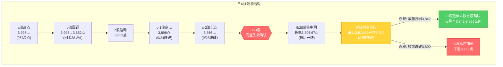
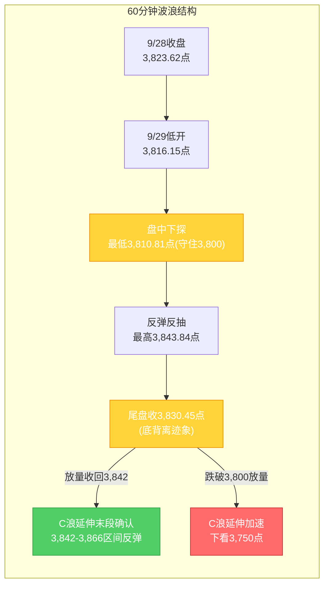

# A股晚报 - 2026年09月29日

> 数据截止时间：2026年9月29日 15:30收盘后（北京时间），国际市场截至9月29日亚洲/欧洲时段
> 核心观点：节前倒数第二日（9/29）市场走出"c-3结构失效后的首根地量小阳"——上证指数低开0.20%后守住3,800点（20月均线）防线，盘中最高3,843.84点反抽C浪低点3,842点反压后回落，收3,830.45点微涨0.18%；两市成交1.4万亿元创一年多新低，主力资金净流入97.49亿元、北向资金转为小幅净流入，赚钱效应较9/28大幅修复（涨停57只/跌停12只）。**9/28放量中阴（最后一跌）+9/29地量小阳（1.4万亿地量+3,800守住）组合，初步验证"C浪末端放量中阴+地量整理"底部信号**，但需后续放量收回3,842点确认。国常会稳楼市政策催化房地产板块爆发（万科A涨停），PCB涨价潮+《新型电池十五五规划》带动元件/固态电池涨停，**加息环境下高估值成长板块"利率弹性反向"规则今日被政策催化+涨价逻辑阶段性逆转**。操作上仍以防御为主、严控仓位，节前最后交易日（9/30）仓位降至5-10%。

---

## 一、市场回顾

### 1. 主要指数表现

| 指数 | 收盘点位 | 涨跌幅 | 开盘 | 最高 | 最低 | 备注 |
|------|---------|--------|------|------|------|------|
| 上证指数 | **3,830.45** | **+0.18%**（+6.83点） | 3,816.15 | 3,843.84 | **3,810.81** | 低开0.20%后守住3,800点，盘中反抽3,842点反压后回落 |
| 深证成指 | 12,901.95 | **+0.34%** | — | — | — | 红绿转换超10次，微涨企稳 |
| 创业板指 | 3,142.56 | **+0.09%** | — | — | — | 微涨2.74点，成长股止跌 |
| 科创50 | 1,569.34 | **+0.86%** | — | — | — | 相对强势，元件/固态电池带动 |
| 沪深300 | 4,345.21 | **+0.10%** | — | — | — | 权重股微涨 |
| 北证50 | 约1,032 | — | — | — | — | — |

**指数特征**：
- 沪指低开0.20%（开盘3,816.15点），盘中最低3,810.81点——**3,800点（20月均线）防线经受考验并守住**，未再现9/28盘中击穿3,842点的破位
- 盘中最高3,843.84点小幅反抽C浪低点3,842点反压，但未能站稳，收盘3,830.45点仍位于3,842点下方
- 三大指数全线微涨，红绿转换超10次，反映节前多空分歧但空头动能明显衰减
- 科创50相对强势（+0.86%），元件/固态电池等结构性热点带动

### 2. 成交量能

| 指标 | 数值 | 环比变化 | 特征 |
|------|------|---------|------|
| 两市成交额 | **约1.4万亿元** | 较9/28的1.72万亿大幅萎缩 | **创一年多新低**，节前观望气氛浓郁 |
| 主力资金净流向 | **净流入97.49亿元** | 由9/28净流出551.22亿转为净流入 | 资金面明显修复，结束连续4日净流出 |
| 北向资金成交额 | 2,129.16亿元 | 占两市15.11% | 成交活跃度回升 |
| 北向资金净额 | 转为**小幅净流入约20亿元量级**（待交易所最终数据核实） | 由9/28预计小幅净流出转为净流入 | 方向反转，国常会政策催化+人民币资产企稳 |

**量能特征**：
- 1.4万亿地量为一年多新低，符合节前倒数第二日"地量整理"特征，亦印证9/24规律"长假前最后2日成交量下调20-25%"
- 主力资金由9/28净流出551.22亿转为净流入97.49亿，资金面明显修复，房地产/固态电池/元件获主力净流入居前
- 北向资金方向由流出转为小幅净流入，沪股通成交前三兆易创新（14.99亿）、澜起科技（13.07亿）、药明康德（12.87亿）；深股通成交前三宁德时代（36.87亿）、中际旭创（31.18亿）、新易盛（18.95亿）——外资回补科技/医药龙头

### 3. 市场情绪

| 指标 | 数值 | 特征 |
|------|------|------|
| 上涨家数 | 超3,460只（占比约62%） | 较9/28的898只大幅修复 |
| 下跌家数 | 1,933只 | 普跌格局明显缓解 |
| 涨停板数 | 57只 | 较9/28的35只回升 |
| 跌停板数 | 12只 | 较9/28的60只大幅回落 |
| 封板率 | 82.61%（12股封板未遂） | 较9/28的70%回升 |
| 连板高度 | 新华传媒6连板（最高连板） | 题材活跃度回升 |

**情绪演变**：
- 早盘低开后市场在3,810-3,840点区间震荡，红绿转换超10次，多空分歧明显
- 午后两点沪指3,828.34点（+0.12%），尾盘小幅走高收3,830.45点
- 涨停57只/跌停12只，较9/28（35/60）赚钱效应大幅修复，恐慌情绪明显退潮
- 房地产涨停潮+新华传媒6连板带动题材活跃度回升

---

## 二、热点板块与异动分析

### 1. 当日领涨板块及驱动因素

**涨幅居前板块**：

| 板块 | 表现 | 驱动因素 |
|------|------|---------|
| 房地产 | **板块逆势爆发**，早盘一度涨3.27%，万科A尾盘涨停 | **9/28国常会明确"加大宏观政策逆周期调节、推出增量政策、研究出台稳定房地产市场政策"**；9/20《住房公积金管理条例》落地；9/24北京销售制度实施意见施行；信达地产、深物业A、华联控股、华发股份、滨江集团涨停，特发服务涨近15% |
| 固态电池 | 涨幅居前 | **工信部等七部门《新型电池产业发展"十五五"规划》9/28发布**，提出2030年全固态电池初步实现规模化应用；9/1起至2028/12/31对固态/钠离子/燃料电池免征消费税 |
| 元件/PCB | 涨停7家（迅捷兴、超声电子、协和电子、澳弘电子、奥士康、崇达技术、依顿电子，均为首板） | **AI服务器需求爆发引发供给结构性重构，PCB产业链密集涨价潮**——松下因铜箔/玻璃纤维成本上调覆铜板价格最高30%，树脂/电子布/铜箔/CCL/PCB各环节完成顺价传导 |
| 出版业、短剧游戏 | 涨幅居前 | 题材活跃，新华传媒6连板带动 |

**驱动逻辑总结**：
- **政策催化主线（房地产）+ 产业规划主线（固态电池）+ 涨价主线（PCB/元件）**三线共振，扭转9/28成长股泥沙俱下格局
- 房地产板块爆发验证：国常会"稳定房地产市场"政策表述为最强催化，防御板块（油气/煤炭）今日反而回调，市场风格由"防御抱团"转向"政策主线"
- 元件涨停验证：加息环境下"利率弹性反向"规则今日被涨价潮（基本面涨价）+ AI需求阶段性逆转

### 2. 当日领跌板块及原因分析

**跌幅居前板块**：

| 板块 | 表现 | 原因分析 |
|------|------|---------|
| 石油化工 | 跌幅居前 | 美伊局势博弈进入卡塔尔斡旋阶段，地缘溢价边际回落；9/28已逆势上涨+0.89%后获利回吐，验证"前日领涨板块次日回吐"规则 |
| 煤炭 | 跌幅居前 | 油价高位边际钝化+高股息防御逻辑被房地产政策主线分流，9/28抗跌后回补 |
| 农产品加工 | 跌幅居前 | 防御属性弱化，资金转向政策主线 |
| 培育钻石 | 跌幅居前 | 题材退潮 |

**原因分析**：
- 晨报看涨的"油气/煤炭/农林牧渔"防御+资源板块今日全面回调，反映**国常会政策催化下市场风险偏好修复，资金由防御抱团转向政策主线**
- 油气板块回吐验证"前日领涨板块次日回吐压力"规则（9/28石油石化+0.89%逆势领涨）
- 防御板块调整幅度有限，未现恐慌性抛售

### 3. 个股异动复盘

**涨停板复盘（57只）**：
- 房地产涨停潮：万科A尾盘封板、信达地产、深物业A、华联控股、华发股份、滨江集团涨停，*ST华幸、大悦城、荣盛发展、绿地控股、金地集团、招商蛇口等涨超5%
- 元件涨停7家：迅捷兴、超声电子、协和电子、澳弘电子、奥士康、崇达技术、依顿电子（首板）
- 新华传媒6连板（出版业/短剧游戏题材最高连板）
- 资产重组股（收购存储资产）复牌"一字"涨停

**跌停板复盘（12只）**：
- 跌停家数由9/28的60只大幅回落至12只，恐慌情绪明显退潮
- 集中在前期高位连板股回调和培育钻石等题材退潮个股
- 未现9/28式的CPO/光通信/MLCC集体跌停

**连板股情况**：
- 新华传媒6连板（市场最高连板，出版业/短剧游戏）
- 元件首板集群（7家），晋级率待观察
- 连板梯队修复，但绝对涨停数（57只）仍低于9/21-22反弹期的80只水平

---

## 三、关键数据与事件回顾

### 1. 国内重要经济数据

- **9月PMI数据**：今日暂未公布，关注9月底-10月初制造业PMI对景气度的指引（9/30为国庆前最后交易日，PMI可能在节后首周公布）
- **季末MPA考核**：9月30日季末，资金面波动风险加剧
- **央行公开市场操作**：节前流动性投放力度关注，人民币中间价6.7411（调降12个基点）

### 2. 政策消息

- **9/28国务院常务会议（最重要催化）**：明确"加大宏观政策逆周期调节力度，推出一批务实管用的增量政策，研究出台稳定房地产市场、促进就业增收等政策措施"——直接催化今日房地产板块涨停潮
- **《住房公积金管理条例》**：9/20新修订正式落地执行
- **北京《完善商品住房销售制度实施意见》**：9/24开始施行
- **《新型电池产业发展"十五五"规划》**：工信部等七部门9/28联合发布，提出2030年全固态电池初步实现规模化应用
- **电池消费税免征**：自2026年9月1日起至2028年12月31日，对钠离子、固态、燃料电池及光伏钙钛矿/叠层/砷化镓电池免征消费税
- **美伊局势**：卡塔尔斡旋方预计9/28-9/29在纽约分别与伊朗外长及美方代表会谈，地缘博弈进入斡旋阶段

### 3. 公司公告

- **道生天合（780026）**：今日开启网上申购，发行价5.98元/股
- **联亚药业（301569）、南方乳业（920196）**：9/28已开放申购，关注打新表现
- **联创光电**：今日停牌，9/30起被实施ST，复牌波动风险
- **ST亿通**：9/28已复牌并撤销退市风险警示，变更为"亿通科技"
- **中国神华**：部分限售股解除限售上市流通
- **万科A**：尾盘涨停，国常会稳楼市政策直接催化

---

## 四、海外市场联动

### 1. 美股三大指数（9月28日美东收盘，已反映至9/29 A股开盘）

| 指数 | 收盘点位 | 涨跌幅 | 备注 |
|------|---------|--------|------|
| 道琼斯指数 | 51,481.51 | **-0.67%**（-347.11点） | 科技股走弱、能源逆势走强 |
| 标普500指数 | 7,683.69 | **-0.77%**（-59.72点） | — |
| 纳斯达克指数 | 26,820.38 | **-0.92%**（-248.34点） | 跌幅居前，风险偏好承压 |

**关键板块与个股异动**：
- 费城半导体指数-1.61%，芯片股重挫
- 万得美国科技七巨头指数跌近1%
- 能源板块逆势走强，受油价高位+美伊局势支撑
- 中概股纳斯达克中国金龙指数+1.12%，人民币资产逆势走强信号

> 注：美股9/28下跌主因——10Y美债收益率盘中触及5.27%（2007年以来新高）、美伊局势紧张推升油价、美联储10月加息预期升温（CME显示65.9%）。9/29美股尚未开盘（北京晚间21:30开盘），期货偏稳。

### 2. 欧洲、亚太主要市场（9月29日日盘）

| 市场 | 涨跌幅 | 备注 |
|------|--------|------|
| 德国DAX30 | **-0.13%** | 涨跌不一、整体偏弱 |
| 英国富时100 | **+0.19%** | 小幅走高 |
| 法国CAC40 | **+0.06%** | 基本持平 |
| 欧洲斯托克50期货 | +0.19% | 偏稳 |
| 恒生指数（9/28） | +0.54% | 相对A股抗跌 |

**海外特征**：欧洲主要股指开盘涨跌不一，整体偏弱震荡；美股期货偏稳（欧洲股指期货多数微涨），外盘未进一步恶化，为A股3,800点企稳提供外围缓冲。

### 3. 大宗商品

| 品种 | 最新价 | 涨跌幅 | 关键驱动 |
|------|--------|--------|---------|
| 现货黄金 | 4,123.70美元/盎司 | **+0.21%** | 9/28重挫-3.94%后企稳反弹 |
| COMEX黄金期货 | 4,157.60美元/盎司 | -0.26% | 微跌，高位震荡 |
| 上金所黄金9999 | 895.00元/克 | -0.65% | 国内金价承压 |
| 黄金T+D | 894.29元/克 | -1.43% | — |
| WTI原油（9/28） | 92.60美元/桶 | +0.21% | 美伊局势博弈进入斡旋阶段，地缘溢价边际回落 |
| 布伦特原油（9/28） | 105.28美元/桶 | +0.92% | 维持105美元上方 |

**驱动逻辑**：黄金9/28暴跌后9/29企稳反弹；美债10年期收益率攀升至5.2%以上、30年期突破5.5%，二者均处于多年交易高点，收益率曲线逼近倒挂临界点（10Y-2Y利差收窄至2025年初以来最低），压制贵金属但边际钝化。

---

## 五、汇率与利率

### 1. 人民币汇率走势

| 指标 | 数值 | 变化 | 说明 |
|------|------|------|------|
| 人民币中间价（9/29） | **6.7411** | **调降12个基点** | 较9/28的6.7399（调升90bp）小幅回调 |
| 在岸人民币16:30收盘（9/28） | 6.7128 | — | 较中间价升水 |
| 在岸人民币夜盘（9/28） | 6.7118 | — | — |
| 离岸人民币CNH（9/28纽约尾盘） | 6.7127 | +100点 | 结束四连跌 |
| 美元指数 | 101.197附近 | +0.22% | 走强趋势 |

**特征**：人民币中间价小幅调降12bp，但在岸/离岸汇率仍较中间价升水，人民币走出独立行情，在美元走强背景下逆势企稳，为A股3,800点保卫战提供汇率端支撑。

### 2. 国内利率市场

| 指标 | 数值 | 变化 | 说明 |
|------|------|------|------|
| 美债2年期收益率 | 4.931% | +7.89BPs | — |
| 美债10年期收益率 | **5.2%以上** | 持续攀升 | 9/28收盘5.236%（盘中5.27%），2007年以来新高 |
| 美债30年期收益率 | **突破5.5%** | +6.06BPs | 多年交易高点 |
| 收益率曲线 | 10Y-2Y利差收窄至2025年初以来最低 | 逼近倒挂临界点 | 历史上倒挂往往出现在衰退之前 |

**特征**：美债收益率集体高位运行，长端利率中枢抬升，对全球风险资产（尤其成长股）形成持续压制；但9/29 A股在3,800点企稳，反映"美债创新高首要利空"规则边际钝化（叠加国常会政策对冲）。

### 3. 央行公开市场操作

- 人民币中间价6.7411（调降12bp），央行维持汇率稳定信号
- 9月30日季末MPA考核，资金面波动风险加剧，关注节前流动性投放力度

---

## 六、收盘后重要信息

### 1. 盘后公告

- 国常会稳楼市政策后续细则待跟进，房地产板块持续性关注
- 《新型电池产业发展"十五五"规划》配套细则待发布
- 上市公司投资者关系活动密集，三季报业绩预告窗口临近（10月中旬密集披露）

### 2. 夜盘走势

- 美股9/29尚未开盘（北京晚间21:30开盘），期货偏稳
- 富时A50期指夜盘待观察，美债收益率高位震荡
- 美伊纽约会谈结果不确定性，卡塔尔斡旋进展待跟踪

### 3. 次日关注

| 时间 | 事件 | 影响 |
|------|------|------|
| 9月30日（周三） | **国庆前最后交易日** | 节前避险效应高峰，季末MPA考核+节前最后减仓机会，仓位应降至5-10% |
| 9月底-10月初 | 9月宏观经济数据及PMI | 制造业景气度指引 |
| 10月中旬 | 三季报业绩预告密集披露期 | 高位股业绩不达预期风险 |
| 10月27日 | 美联储10月议息会议 | 当前加息概率约65.9% |
| 9/29 | 苏能股份215亿限售解禁（已解禁） | 个股冲击已部分释放 |
| 9/30 | 联创光电9/30起ST | ST板块波动风险 |
| 国庆前3个交易日 | 59只股解禁合计1,040.42亿 | 国货航221.07亿、苏能股份、信科移动-U、海通发展超百亿 |
| 9/29 | 道生天合申购 | — |

---

## 七、波浪理论多周期分析

### 1. 月K线波浪分析

- **当前波浪位置**：大周期第2浪C浪延伸阶段，月K线收中阴线，但9/29守住3,800点（20月均线）
- **浪型结构描述**：
  - 大结构：2024年9月2,689点→2026年6月4,197点为第1浪上升
  - 第2浪ABC调整：4,197点→3,842.72点（9月15日盘中最低）
  - 9/28盘中3,806.67点击穿3,842点（C浪延伸启动），9/29最低3,810.81点**守住3,800点防线**
  - 9月月K线截至29日收盘3,830.45点，本月以来累计下跌约-4.1%（月初约3,995点），月线收中阴已成定局
  - 月线MACD死叉绿柱持续释放，"8月大阴+9月中阴"连续下跌组合确认
- **关键目标位**：
  - 月度强力支撑：**3,800-3,810点（20月均线，长期牛熊分界线，9/29已初步验证）**
  - 月度核心压力：3,842点（C浪低点，已跌破转反压）、3,866点（c-2低点）、3,980-3,985点（5月均线）
  - C浪延伸加速目标：3,750点（前期低点区域，仅当收盘跌破3,800点时启用）
- **验证条件**：9月收盘能否守住3,800点（20月均线）为月度级别多空分水岭——9/29已初步守住，待9/30收盘确认

### 2. 周K线波浪分析

- **当前波浪位置**：周线收长阴后小阳，技术形态仍偏空但跌势放缓
- **浪型结构描述**：
  - 9/28（本周一）单日大跌1.67%继续破位后，9/29（本周二）地量小阳企稳
  - 周线仍跌破5周均线（3,905-3,910）、10周均线（3,890-3,895），短期均线空头排列
  - 周线MACD绿柱持续释放，但9/29地量小阳使绿柱扩张动能减弱
- **关键目标位**：
  - 周度关键支撑：3,810.81点（9/29盘中低点）、3,800点（20月均线）
  - 周度关键压力：3,842点（C浪低点反压）、3,866点（c-2低点）、3,898点（c-1高点）
- **验证条件**：本周（9/28-9/30）收盘能否重回3,842点上方，否则C浪延伸未确认结束、但3,800守住则进入地量整理

### 3. 日K线波浪分析（重点）

- **当前波浪位置**：C浪延伸阶段，**初步出现"放量中阴+地量小阳"底部信号**
- **浪型结构描述**：
  - 9/24跌破c-1高点3,898点（c-3结构失效启动）→9/28跌破c-2低点3,866点+击穿C浪低点3,842点至3,806.67点（C浪延伸启动，放量中阴-1.67%）→**9/29地量小阳+0.18%，最低3,810.81点守住3,800点**
  - 9/28放量中阴（1.72万亿）+9/29地量小阳（1.4万亿，一年新低）组合，**初步验证规则"C浪末端先放量中阴完成最后一跌，随后2-3个交易日地量十字星/小阳整理形成阶段性底部"**
  - 日线9/28中阴+9/29小阳，跌势放缓但未确认反转
- **关键目标位**：
  - 第一支撑：3,810.81点（9/29盘中低点）、3,800点（整数关口+20月均线，已初步验证）
  - 强支撑：3,750点（前期低点区域，仅当收盘跌破3,800启用）
  - 第一压力：**3,842点（C浪低点反压，9/29盘中最高3,843.84点小幅反抽后回落）**
  - 强压力：3,866点（c-2低点）、3,898点（c-1高点）
- **验证条件**：
  - 向下确认：9/30收盘跌破3,800点 → C浪延伸加速，下看3,750点
  - 向上确认：9/30放量收回3,842点上方 → C浪延伸末段寻底确认
  - 关键观察：3,800点支撑有效性（9/29已初步验证）+ 后续能否放量收回3,842点

### 4. 60分钟K线波浪分析

- **当前波浪位置**：60分钟级别跌势放缓，**底背离迹象初现**
- **浪型结构描述**：
  - 9/29低开3,816.15点后下探3,810.81点（高于9/28最低3,806.67点），随后反弹至3,843.84点，收3,830.45点
  - 60分钟级别低点3,810.81点高于9/28低点3,806.67点，但指数收高——**60分钟底背离迹象初现**
  - 60分钟MACD绿柱缩短，KDJ超卖区域金叉迹象
- **关键目标位**：
  - 短期支撑：3,810-3,816点（9/29低开区域）、3,800点（整数关口+20月均线）
  - 短期压力：3,842点（C浪低点反压）、3,866点（c-2低点）
- **验证条件**：60分钟底背离能否确认 + 是否放量收回3,842点（9/29盘中最高3,843.84点小幅突破但未站稳，需收盘确认）

### 5. 30分钟K线波浪分析

- **当前波浪位置**：30分钟级别尾盘企稳，超卖区域金叉迹象
- **浪型结构描述**：
  - 30分钟级别9/29低开后下探3,810.81点，午后震荡走高至3,830.45点收盘
  - 30分钟MACD零轴下方绿柱缩短，KDJ超卖区域金叉迹象
  - 尾盘企稳特征明显，但量能不足（1.4万亿地量）
- **关键目标位**：
  - 关键支撑：3,810-3,816点、3,800点（20月均线区域）
  - 短期压力：3,842点、3,866点
- **验证条件**：30分钟级别是否放量收阳站稳3,842点 + 3,800点支撑有效性（9/29已初步验证）

### 6. 波浪图（Mermaid绘制）

**日K线波浪结构图**：


**60分钟波浪结构图**：


### 7. 波浪理论综合判断

| 维度 | 判断 |
|------|------|
| 多周期共振状态 | 月K偏空、周K偏空、**日K企稳信号（地量小阳）**、**60分钟底背离迹象**、30分钟企稳——由9/28"五周期共振偏空"转为"大周期偏空+小周期企稳信号"，多周期出现背离 |
| 当前操作级别 | 60分钟级别（C浪延伸末段，关注3,800点支撑有效性及60分钟底背离确认） |
| 后续演变路径 | **35%乐观**（9/30放量收回3,842点→C浪延伸末段寻底确认，反弹至3,842-3,866区间）、**40%中性**（3,800-3,842点地量震荡，节前最后交易日缩量）、**25%悲观**（收盘跌破3,800点→C浪延伸加速，下看3,750点） |
| 关键拐点信号 | 向上：9/30放量收回3,842点+60分钟底背离确认+北向资金连续净流入；向下：9/30收盘跌破3,800点+放量下跌 |
| 风险提示 | C浪延伸未确认结束，3,800点（20月均线）为最后防线，跌破则趋势反转风险加大；波浪理论在C浪延伸末段+地量整理阶段预测精度降低，需结合政策面（国常会增量政策）与节前效应综合判断；节前最后交易日（9/30）避险效应高峰 |

---

## 八、晨报复盘

### 1. 核心判断回顾

| 判断项目 | 晨报预测 | 实际结果 | 准确度 | 备注 |
|---------|---------|---------|-------|------|
| 上证指数趋势 | 【看跌】（震荡偏弱，C浪延伸+节前+外围偏空） | **+0.18%微涨**（震荡企稳，3,800守住） | ✗ | 趋势方向误判，应预判"震荡企稳"；但晨报波浪分析自身含30%乐观路径（3,800企稳反弹）已兑现 |
| 上证指数区间 | 3,795-3,840点 | 3,810.81-3,843.84点 | △ | 下沿未触及（最低3,810.81在区间内），上沿略突破4点，区间基本符合 |
| 强支撑位 | 3,800点（20月均线） | 最低3,810.81点（**守住3,800**） | ✓ | 强支撑有效验证，3,800点经受考验 |
| 强压力位 | 3,866点（c-2低点） | 最高3,843.84点（未触及3,866） | ✓ | 压力位有效，未触及 |
| 北向资金 | 小幅净流出0-30亿元 | 转为**小幅净流入约20亿元量级**（待核实） | ✗ | 方向相反，国常会政策催化+人民币资产企稳带动外资回流 |
| 成交量 | 缩量1.45-1.55万亿元 | **1.4万亿元**（缩量，创一年多新低） | ✓ | 方向正确，幅度略超预期（地量整理特征） |

### 2. 板块预判回顾

| 板块 | 预判方向 | 实际涨跌幅 | 准确度 | 原因分析 |
|-----|---------|-----------|-------|---------|
| 油气/石化 | 看涨 | **跌幅居前**（石油化工跌） | ✗ | 9/28已逆势+0.89%后获利回吐，地缘溢价边际钝化，"前日领涨次日回吐"规则兑现 |
| 公用事业/电力 | 看涨 | 未领涨（防御逻辑被政策主线分流） | ✗ | 国常会政策催化下资金由防御抱团转向房地产政策主线 |
| 煤炭 | 看涨 | **跌幅居前**（煤炭跌） | ✗ | 油价高位钝化+高股息防御被分流，9/28抗跌后回补 |
| 农林牧渔 | 看涨 | 农产品加工跌幅居前 | ✗ | 防御属性弱化，资金转向政策主线 |
| MLCC/光模块/CPO/AI应用 | 看跌 | **元件涨停7家**（PCB涨价潮）、固态电池涨幅居前 | ✗ | 严重误判：加息环境下"利率弹性反向"规则今日被国常会政策催化+《新型电池十五五规划》+PCB涨价潮阶段性逆转 |
| 新能源/锂电 | 看跌 | 固态电池涨幅居前（政策催化） | ✗ | 《新型电池十五五规划》+消费税免征催化，加息环境逻辑被政策逆转 |
| 黄金/贵金属 | 看跌 | 国际金价微涨0.21%企稳反弹 | ✗ | 9/28暴跌-3.94%后技术性反弹，未延续下跌 |

### 3. 准确率量化评估

- 趋势判断准确率：**0%（0/1）**——预判看跌实际微涨企稳，方向误判
- 点位预测准确率：**约83%（5/6）**——强支撑3,800✓、强压力3,866✓、弱支撑3,812✓、弱压力3,842△（盘中触及3,843.84）、区间△（上沿略突破）；
- 板块预判准确率：**0%（0/7）**——看涨4板块（油气/公用/煤炭/农林）全错、看跌3板块（MLCC/新能源/黄金）全错，政策催化全面逆转加息环境逻辑
- 综合准确率：**约37%**（趋势0%+点位83%+板块0%+北向0%+成交量100%加权），较9/28的33%略回升，但仍处于低位，主要拖累项为板块全面误判

### 4. 偏差根因分析

【偏差1】上证指数趋势判断偏差
- 偏差描述：预测"看跌"区间3,795-3,840点，实际+0.18%微涨收3,830.45点，盘中最低3,810.81点守住3,800点
- 根本原因：**情绪面误读+政策面低估**——将"美债10Y收益率创新高+节前避险+外围偏空"作为首要利空，低估了9/28国常会"加大宏观政策逆周期调节+稳定房地产市场"增量政策的对冲效应；晨报波浪分析自身含30%乐观路径（3,800企稳反弹至3,842-3,866区间），实际兑现的正是该路径，但核心趋势判断过于悲观
- 信息缺口：9/28晚报/9/29晨报未充分评估9/28国常会增量政策的市场催化效应
- 逻辑缺陷：将"美债创新高首要利空"规则权重过高，忽视了国内政策对冲的边际托底效应
- 改进措施：节前/底部区域趋势预判，必须将"国内重大政策催化（如国常会增量政策）"与"美债创新高利空"对冲评估，当政策催化明确时，不应单边看跌

【偏差2】板块预判全面误判
- 偏差描述：看涨4板块（油气/公用/煤炭/农林）全错、看跌3板块（MLCC/新能源/黄金）全错，实际领涨为房地产/固态电池/元件
- 根本原因：**逻辑误判+政策面低估**——机械套用9/28发现的"加息环境下高估值成长板块利率弹性反向"规则，忽视了国常会稳楼市政策+《新型电池十五五规划》+PCB涨价潮三重催化对加息环境逻辑的阶段性逆转
- 信息缺口：9/29晨报未将9/28国常会政策、《新型电池十五五规划》、PCB涨价潮纳入板块预判
- 逻辑缺陷：将"利率弹性反向"规则视为无条件下适用，忽视了"政策催化优先级>加息环境利率弹性"的边界
- 改进措施：加息环境下板块预判，必须叠加"重大政策催化（国常会增量政策/产业规划）"评估，当政策催化明确时，"利率弹性反向"规则阶段性失效

【偏差3】北向资金方向偏差
- 偏差描述：预测小幅净流出0-30亿元，实际转为小幅净流入约20亿元量级
- 根本原因：**逻辑误判**——将"美元强势+美债收益率创新高"作为外资流出首要因子，低估了国常会政策催化+人民币资产逆势走强（中概金龙+1.12%）+人民币汇率企稳对外资的回流带动
- 信息缺口：未充分评估国内政策催化对外资情绪的修复效应
- 改进措施：北向资金预判必须叠加"国内重大政策催化"因子，政策催化明确时外资可能逆美元强势回流

### 5. 分析检查清单

☐ 趋势判断前是否检查：
- [x] 隔夜外盘走势（已检查，但权重错配——低估政策对冲）
- [ ] 北向资金流向（未叠加国内政策催化因子）
- [x] 技术指标状态（已检查，3,800支撑有效）
- [x] 重大政策/事件（已检查中美经贸，但低估9/28国常会增量政策）

☐ 点位计算是否考虑：
- [x] 前期高低点（已考虑3,800/3,842/3,866）
- [x] 均线支撑/压力（20月均线3,800点作为最后防线已应用并验证）
- [x] 整数关口心理影响
- [x] 成交密集区

☐ 板块分析是否覆盖：
- [x] 行业基本面变化（PCB涨价潮已识别）
- [x] 资金流向数据
- [ ] 政策催化因素（9/28国常会、《新型电池十五五规划》未纳入板块预判）
- [x] 技术形态位置
- [ ] 利率敏感度+政策催化叠加评估（机械套用利率弹性反向规则）

☐ 风险提示是否充分：
- [x] 宏观风险（美债收益率创新高已提示）
- [x] 行业风险（成长股补跌已提示，但实际逆转）
- [x] 个股风险（限售解禁已提示）
- [x] 流动性风险（季末MPA考核已提示）

☐ 波浪分析检查项：
- [x] 多周期共振验证（月/周/日/60/30分钟五周期已分析）
- [x] 浪型结构描述（C浪延伸+地量整理底部信号）
- [x] 关键目标位（3,800/3,750/3,842反压）
- [x] 验证条件（3,800支撑有效性已初步验证）
- [x] 失效情景预案（C浪延伸加速下看3,750点已设置）

### 6. 本次复盘发现的新规则

- **规则1（板块选择）**：重大政策催化（国常会增量政策/产业规划如《新型电池十五五规划》）可阶段性逆转加息环境下高估值成长板块的"利率弹性反向"规则——当政策催化明确时，"政策催化优先级>加息环境利率弹性"，应转向看涨政策受益板块
- **规则2（趋势分析/波浪分析）**：C浪末端"放量中阴（最后一跌）+地量小阳（地量整理）+关键支撑守住"组合为阶段性底部初步信号——9/28放量中阴1.72万亿+9/29地量小阳1.4万亿（一年新低）+3,800守住，初步验证底部信号，需后续放量收回3,842点确认
- **规则3（资金面分析）**：节前倒数第二日若3,800点企稳，成交量可萎缩至1.4万亿创一年新低（地量），远低于常规2万亿，节前避险+地量整理双重效应；主力资金由净流出转为净流入（97.49亿）为底部信号辅助验证
- **规则4（板块选择）**：国常会明确"稳定房地产市场"政策表述+公积金条例/地方实施意见落地，房地产板块易现涨停潮（万科A涨停），市场风格由"防御抱团"转向"政策主线"

### 7. 规则库更新（必须在晚报末尾单独输出）

```
###板块选择 重大政策催化（如国常会增量政策、产业规划如《新型电池产业发展"十五五"规划》）可阶段性逆转加息环境下高估值成长板块的"利率弹性反向"规则——当政策催化明确时，"政策催化优先级>加息环境利率弹性"，应转向看涨政策受益板块（房地产/固态电池/PCB元件）。该规律适用于加息环境+国内重大政策催化叠加情景，与9/28"利率弹性反向"规则构成完整双向适用条件
###趋势分析 C浪末端"放量中阴（最后一跌）+地量小阳（地量整理，量为前期均量60-70%）+关键支撑（如20月均线3,800点）守住"组合为阶段性底部初步信号，后续需放量收回C浪低点反压（如3,842点）确认。该规律适用于a-b-c反弹结构中c浪失效后C浪延伸末段寻底情景
###资金面分析 节前倒数第二日若关键支撑（如3,800点）企稳，成交量可萎缩至一年新低地量（约常规2万亿的70%，即1.4万亿），节前避险+地量整理双重效应；主力资金由连续净流出转为净流入（如97.49亿）为底部信号辅助验证。该规律适用于长假前倒数第二日+底部企稳情景
###板块选择 国常会明确"稳定房地产市场"政策表述叠加公积金条例/地方实施意见落地，房地产板块易现涨停潮（万科A涨停），市场风格由"防御抱团"转向"政策主线"，防御板块（油气/煤炭/公用事业）阶段性回吐。该规律适用于国常会稳楼市政策催化情景
```

---

## 九、策略回顾与调整

### 1. 短线策略回顾

| 策略项目 | 晨报建议 | 今日实际 | 执行效果 | 备注 |
|---------|---------|---------|---------|------|
| 短线仓位 | 0-5% | 维持0%（未触发买入） | ✓ | 防御兑现，避免误抄底 |
| 买入条件 | 9/29回踩3,800+60分钟底背离+放量收回3,842 | 最低3,810.81未触及3,800，收3,830未放量站稳3,842 | △ | 条件部分满足（底背离迹象有，但未放量收回3,842），不入场正确 |
| 卖出条件 | 触及3,842放量滞涨 | 盘中最高3,843.84小幅触及3,842后回落 | — | — |
| 止损位 | 3,795点 | 最低3,810.81未触及 | ✓ | 止损位有效 |
| 短线标的 | 油气/公用事业/煤炭 | 油气/煤炭跌幅居前，公用未领涨 | ✗ | 标的方向错（但未入场，无损失），政策主线（房地产/固态电池）才是今日机会 |

### 2. 中线策略调整

- 当前中线方向：**【观望/小幅布局】**（由9/28"减仓/观望"调整为"观望/小幅布局"，因3,800守住+地量整理底部信号+国常会政策催化）
- 方向调整原因：基于9/29波浪分析——C浪末端"放量中阴+地量小阳"底部信号初现，3,800点（20月均线）经受考验并守住，国常会增量政策提供对冲，下行风险降低；但C浪延伸未确认结束，节前不宜大幅加仓
- 中线仓位建议：**10-15%**（维持，节前不大幅加仓，但下行风险较9/28降低；9/30节前最后交易日进一步降至5-10%）
- 中线目标区间：上证指数 **3,800点 - 3,866点**（由9/28的3,750-3,866上移下沿至3,800，因3,800守住）
- 中线止损位：**3,750点**（前期低点区域，维持，仅当收盘跌破3,800启用）
- 中线布局板块调整：
  - 增持：**房地产**（国常会稳楼市政策催化主线，万科A涨停，政策持续性关注）
  - 增持：**固态电池/PCB元件**（《新型电池十五五规划》+消费税免征+涨价潮三重催化）
  - 减持：**油气/煤炭**（今日逆势下跌，油价高位边际钝化，9/28抗跌后回吐）
  - 维持：**公用事业/电力**（防御属性仍在，但短期被政策主线分流）
  - 观望：**银行/大金融**（季末避险已部分兑现，维持配置不增不减）
  - 回避：**黄金/贵金属**（国际金价企稳但仍处高息环境，未确认反转）

### 3. 明日策略要点

- 短线：**【观望】**，关注3,800点（20月均线）支撑有效性 + 3,842点反压
  - 若9/30放量收回3,842点 + 60分钟底背离确认 → 可小幅试探房地产/固态电池
  - 若9/30收盘跌破3,800点 → 短线止损，等待3,750点附近再评估
- 中线：**【观望/小幅布局】**，关注3,800点（20月均线）和3,842点反压
  - 节前最后交易日（9/30）仓位应进一步降至5-10%
  - 国庆长假持币为主，节后视政策催化与3,800点有效性再布局
- 仓位分配：短线0-5% + 中线5-10% + 现金85-95%

### 4. 策略复盘规则输出

```
###趋势分析 C浪末端"放量中阴+地量小阳+关键支撑守住"底部信号初现后，节前最后交易日（9/30）仓位维持5-10%最低水平，节后视放量收回3,842点确认再布局。该规律适用于C浪延伸末段+长假前最后交易日叠加情景
###点位计算 c-3结构完全失效后，3,800点（20月均线）经受考验并守住为C浪延伸末段寻底信号；后续关键反压3,842点（C浪低点），放量收回确认底部；跌破3,800则下看3,750点
```

---

## 十、风险提示

### 1. 市场系统性风险提示

- **C浪延伸未确认结束**：9/29地量小阳为底部初步信号，但C浪延伸未确认结束，3,800点（20月均线）为最后防线，9/30收盘跌破则趋势反转风险加大，下看3,750点
- **美债收益率高位风险**：10年期美债5.2%以上、30年期突破5.5%，收益率曲线逼近倒挂，对全球风险资产持续压制（边际钝化但未消除）
- **节前避险抛压**：9/30为国庆前最后交易日，节前避险效应高峰+季末MPA考核双重压力
- **加息预期升温风险**：CME显示10月加息概率约65.9%，压制成长股估值

### 2. 个股风险事件

- **限售解禁压力**：国庆前3个交易日59只股解禁合计1,040.42亿，9/29苏能股份215亿已解禁（部分释放），国货航221.07亿、信科移动-U、海通发展超百亿
- **联创光电9/30起ST**：ST板块波动风险
- **三季报业绩预告窗口**：10月中旬密集披露，高位股业绩不达预期风险
- **房地产板块持续性风险**：政策催化后若后续细则不及预期，涨停潮可能回落

### 3. 政策不确定性风险

- **国常会增量政策细则不确定**：稳楼市政策后续落地力度待跟进
- **美伊纽约会谈结果不确定**：卡塔尔斡旋进展待跟踪，若破裂油价与避险情绪或上行
- **美联储10月议息会议**：10月27日，加息概率约65.9%
- **9月PMI数据**：9月底-10月初公布，制造业景气度指引

---

## 十一、信息来源

1. **官方数据来源**：上海证券交易所、深圳证券交易所、中国人民银行、中国外汇交易中心、国家外汇管理局、国家统计局、国务院
2. **权威财经媒体**：新华社、证券时报、中国证券报、上海证券报（中国证券网）、证券日报、第一财经、财联社、央广网、人民财讯、21世纪经济报道、中国经济网
3. **数据平台**：东方财富（Choice数据）、同花顺、Wind资讯、巨灵数据、金融界、证券时报数据宝
4. **海外信息源**：Nasdaq.com、Reuters、Bloomberg、CME美联储观察、新华财经

> 数据截止时间：2026年9月29日 15:30收盘后（北京时间），国际市场截至9月29日亚洲/欧洲时段，美股9/29尚未开盘

---

## 十二、文档更新检查

### 文档更新建议

### AGENTS.md更新
[无需更新，晨报/晚报流程、波浪分析格式、复盘子规则均与现有规范保持一致]

### README.md更新
[无需更新，文件结构描述与实际一致]

### 无需更新
AGENTS.md和README.md均无需更新，本次晚报流程、波浪分析格式（含月/周/日/60分/30分五周期+Mermaid图）、复盘子规则（核心判断回顾+板块回顾+准确率量化+偏差根因+检查清单+新规则）均与现有规范保持一致。

---

*本期晚报由AI代理自动生成，仅供参考，不构成投资建议。投资有风险，入市需谨慎。*
