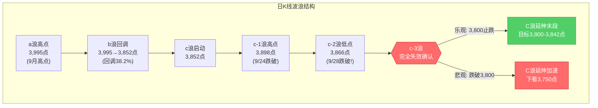
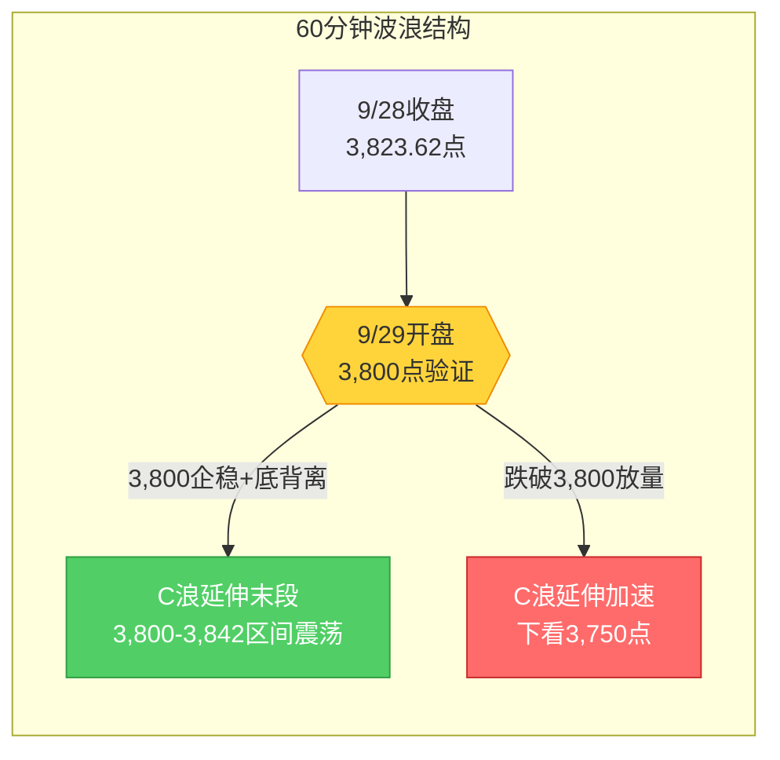

# A股晨报 - 2026年09月29日

> 数据截止时间：2026年9月29日 08:30（北京时间）
> 核心观点：节前c-3结构已完全失效、C浪延伸启动后第二日，隔夜外围偏空（美股三指收跌、10Y美债飙升至5.236%创2007新高、金价重挫4%、加息概率65.9%）但未现崩盘式恶化，A50期指夜盘持平（-0.01%）、人民币资产逆势走强（离岸CNH结束四连跌、中概金龙+1.12%）提供缓冲。3,800点（20月均线）为C浪延伸最后防线，预计低开后测试该位支撑，国庆前倒数第二个交易日以防御为主、仓位降至最低。

---

## 一、昨日晚报复盘要点回顾

### 1. 节后首日（9/28）判断回顾

| 判断项目 | 晨报预测 | 9/28实际结果 | 准确度 | 备注 |
|---------|---------|-------------|-------|------|
| 上证指数趋势 | 震荡（节前偏空+美股收涨对冲） | 大跌-1.67%收3,823.62，单边下行 | ✗ | 趋势严重误判，应预判明显偏弱 |
| 上证指数区间 | 3,870-3,915点 | 3,806.67-3,878.41点 | ✗ | 下沿突破64点，区间完全失效 |
| 强支撑位 | 3,842点（C浪低点） | 盘中最低3,806.67点 | ✗ | 击穿C浪低点35.33点 |
| 北向资金 | 小幅净流入10-30亿元 | 成交2,605.02亿，预计小幅净流出 | ✗ | 方向完全相反 |
| 成交量 | 缩量1.4-1.55万亿 | 1.72万亿（放量476亿） | ✗ | 实际放量而非缩量，恐慌盘出逃 |
| 油气/煤炭 | 看涨 | 石油石化+0.89%，煤炭收涨 | ✓ | 美伊局势+油价高位，逻辑兑现 |
| 银行/大金融 | 看涨 | 防御性抗跌（公用事业主力净流入6.84亿居首） | ✓ | 高股息防御逻辑兑现 |
| 华为汽车产业链 | 看涨 | 汽车整车+1.64%逆市领涨 | ✓ | 智界RX发布会催化兑现 |
| MLCC/被动元件 | 看涨 | MLCC概念跌幅居前 | ✗ | 加息环境下高估值补跌优先于基本面涨价 |

**准确率量化**：
- 趋势判断准确率：0%（0/1）——预判震荡实际大跌，方向严重误判
- 板块预判准确率：67%（4/6板块方向正确，MLCC严重误判）
- 综合准确率：**约33%**（远低于9/24的65%）

### 2. 关键偏差及原因

【偏差1】上证指数趋势判断偏差
- 偏差描述：预测"震荡"区间3,870-3,915点，实际大跌-1.67%收3,823.62点，盘中最低3,806.67点
- 根本原因：**情绪面误读+技术分析局限**——将"美股9/25集体收涨"对冲效应过度乐观估计，忽视了10年期美债收益率创2007年新高（5.058%）对全球风险资产的持续性压制
- 改进措施：节后首日趋势预判必须将"美债10年期收益率创新高"作为首要利空因子，权重高于"美股单日涨跌"

【偏差2】强支撑位3,842点判断偏差
- 偏差描述：预测3,842点为强支撑（C浪低点），实际盘中最低3,806.67点击穿35.33点
- 根本原因：**技术分析局限**——c-3结构在9/24跌破c-1高点3,898点（失效启动信号）、9/28跌破c-2低点3,866点（失效确认）后，C浪延伸力度被低估
- 改进措施：c-3结构一旦失效，所有C浪内部支撑位（3,866/3,842）应同步失效，最终防线下移至20月均线3,800-3,810点

【偏差3】成交量判断偏差
- 偏差描述：预测缩量1.4-1.55万亿，实际1.72万亿放量476亿
- 根本原因：**情绪面误读**——节后首日"二次映射"低开压力下，部分恐慌盘出逃引发放量
- 改进措施：节后首日若低开超1%，应预判为"放量下跌"（恐慌盘出逃）而非"节前缩量震荡"的延续

### 3. 沉淀的规则/检查项

- **趋势分析**：节后首日趋势预判必须将"美债10年期收益率创新高"作为首要利空因子，权重高于"美股单日涨跌"；10Y美债收益率每突破一个历史新高阈值（5.0%/5.05%/5.1%），对A股成长股估值压制递增
- **点位计算**：c-3结构一旦跌破c-2低点完全失效，所有C浪内部支撑位应同步失效，重新评估为C浪延伸目标位，最终防线下移至20月均线（3,800-3,810点）；3,800点为最后防线，3,750点为C浪延伸加速目标位
- **资金面分析**：节后首日若低开超1%且伴随恐慌情绪，成交量应预判为"放量下跌"（恐慌盘出逃）而非"节前缩量震荡"的延续
- **板块选择**：加息环境下（10Y美债创新高+下一次加息概率>60%），高估值成长板块（MLCC/光模块/CPO/半导体应用）的"利率弹性反向"规则优先于"基本面涨价"逻辑，应反向看跌
- **仓位管理**：C浪延伸启动后，节前最后2个交易日（9/29、9/30）仓位应进一步降至最低水平（短线0-5%、中线10-15%、现金80-85%），节前最后交易日仓位降至5-10%

### 4. 对今日分析的启示

- c-3结构已完全失效、C浪延伸启动，3,800点（20月均线）为最后防线，所有分析锚点已下移
- 隔夜美债10Y收益率进一步飙升至5.236%（盘中5.27%），"美债创新高首要利空"规则持续适用，成长股估值压制递增
- 节前倒数第二日（9/29），节前避险效应叠加C浪延伸，仓位必须降至最低
- 关注A50期指夜盘企稳（-0.01%）+人民币资产逆势走强的缓冲作用，但难改C浪延伸弱势格局

---

## 二、隔夜市场动态（9月28日收盘后至今）

### 1. 美股市场（9月28日，美东时间）

| 指数 | 收盘点位 | 涨跌幅 | 备注 |
|------|---------|--------|------|
| 道琼斯指数 | 51,481.51 | **-0.67%**（-347.11点） | 科技股走弱、能源逆势走强 |
| 标普500指数 | 7,683.69 | **-0.77%**（-59.72点） | — |
| 纳斯达克指数 | 26,820.38 | **-0.92%**（-248.34点） | 跌幅居前，风险偏好承压 |

**关键板块与个股异动**：
- **费城半导体指数**：-1.61%，芯片股重挫，对A股半导体/AI应用形成负面映射
- **万得美国科技七巨头指数**：跌近1%，科技股集体承压
- **能源板块**：逆势走强，受油价高位+美伊局势支撑
- **中概股**：纳斯达克中国金龙指数**+1.12%**，人民币资产逆势走强信号

> 注：美股下跌主因——10Y美债收益率盘中触及5.27%（2007年以来新高）、美伊局势紧张推升油价、美联储10月加息预期升温（CME显示65.9%，盘中升至约70%）。

### 2. 欧洲/亚太市场

| 市场 | 收盘点位 | 涨跌幅 | 备注 |
|------|---------|--------|------|
| 英国富时100 | 10,684.88 | **-0.10%** | 谨慎观望 |
| 德国DAX30 | 25,374.42 | **-0.13%** | — |
| 法国CAC40 | 8,078.48 | **+0.01%** | 基本持平 |
| 欧洲斯托克50 | 6,309.35 | **+0.10%** | 涨跌不一、整体偏弱 |
| 恒生指数（9/28） | 24,642.51 | **+0.54%** | 相对A股抗跌，未跟随-1.67%大跌 |
| 恒生科技指数 | 4,296.00 | **-0.37%** | 光通信/PCB/AI/黄金板块回调 |
| 富时A50期指夜盘 | 13,923点 | **-0.01%** | 基本持平，未进一步恶化 |

**港股关键异动**：长飞光纤光券-16%、中际旭创-12%、剑桥科技-12%，光通信龙头重挫，对A股CPO/光模块板块形成负面映射。

### 3. 大宗商品

| 品种 | 最新价 | 涨跌幅 | 关键驱动 |
|------|--------|--------|---------|
| WTI原油 | 92.60美元/桶 | **+0.21%** | 盘中一度涨超4%至94.2美元后尾盘回落 |
| 布伦特原油 | 105.28美元/桶 | **+0.92%** | 维持105美元上方，地缘溢价集中Brent端 |
| 伦敦金现货 | 4,115.24美元/盎司 | **-3.94%** | 跌破4,200美元，避险需求不敌美元强势 |
| COMEX黄金期货 | 4,148.5美元/盎司 | **-4.00%** | 美元走强+加息预期压制 |
| 伦敦银现货 | 60.628美元/盎司 | -5.65% | 贵金属集体重挫 |
| LME伦铜（3月期） | 14,743.64美元/吨 | -0.09% | 微跌，工业金属相对抗跌 |

**驱动逻辑**：特朗普拒绝伊朗"7日内重开霍尔木兹海峡"提议推升油价；油价反弹强化美联储加息预期（通胀路径），叠加美元与美债收益率双双走强，贵金属估值遭系统性压制。

### 4. 汇率与利率

| 指标 | 数值 | 变化 | 说明 |
|------|------|------|------|
| 人民币中间价（9/28） | 6.7399 | 调升90个基点 | 央行释放稳定信号 |
| 在岸人民币16:30收盘 | 6.7131 | — | 较中间价走强268bp |
| 离岸人民币CNH（纽约尾盘） | 6.7127 | **+100点** | 结束四连跌 |
| 美元指数 | 101.197 | **+0.22%** | 走强趋势 |
| 美债2年期收益率 | 4.931% | +7.89BPs | — |
| 美债10年期收益率 | **5.236%** | +7.98BPs | 盘中触及5.27%，2007年以来新高 |
| 美债30年期收益率 | 约5.43% | +6.06BPs | 长端收益率高位震荡 |

**特征**：美债收益率集体大幅飙升、10Y收盘5.236%再创2007年以来新高，对全球风险资产（尤其成长股）形成持续压制；人民币走出独立行情，离岸CNH逆势走强结束四连跌，为A股提供一定支撑。

### 5. 重要海外事件

- **美联储加息预期**：CME"美联储观察"显示10月加息25BP（至4.00%-4.25%）概率65.9%，盘中油价反弹后一度升至约70%；美联储官员近期鹰派言论密集
- **美伊局势**：特朗普拒绝伊朗"7日内重开霍尔木兹海峡"计划（9/26）推升油价；伊朗称"已为与美战事重开做好准备，但未放弃外交途径"（9/28）；卡塔尔斡旋方预计9/28或9/29在纽约分别与伊朗外长阿拉格齐及美方代表会谈
- **美国经济数据**：本周关注美国非农数据（影响12月加息预期）；8月规上工业企业利润已公布

---

## 三、今日关注事项

### 1. 重要数据发布

| 时间 | 数据名称 | 预期值/前值 | 影响 |
|------|---------|------------|------|
| 9/30（待定） | 中国9月官方制造业PMI | — | 制造业景气度，9/29关注先行指标/财新PMI预览 |
| 本周 | 美国非农就业数据 | — | 影响12月加息预期 |
| 9:20 | 央行公开市场操作 | — | 节前流动性投放力度 |

### 2. 政策/监管动态

- **央行表态**："下阶段建议加强货币政策调控"，关注节前是否出手稳定市场（若3,800点失守）
- **季末MPA考核**：9月30日季末，资金面波动风险加剧
- **上证创新药科创领先等两条指数**正式发布

### 3. 公司公告

- **道生天合（780026）**：今日（9/29）开启网上申购，发行价5.98元/股
- **联亚药业（301569）、南方乳业（920196）**：9/28已开放申购，关注打新表现
- **联创光电**：今日（9/29）停牌，9/30起被实施ST，复牌波动风险
- **ST亿通**：9/28已复牌并撤销退市风险警示，变更为"亿通科技"

### 4. 限售解禁（节前高潮）

- 节前3个交易日（9/28-9/30）共**59只个股**解禁，合计市值**约1,040亿元**（147.81亿股）
- **9/29当日**：苏能股份（解禁市值约215.54亿元，占总股本76.69%）、海通发展解禁市值居前
- 解禁市值居前：国货航（221.07亿）、苏能股份、信科移动-U、海通发展（均超百亿）

### 5. 其他关注

- **交易日历**：A股本周仅2个交易日（9/29周二、9/30周三），10/1-10/7国庆休市
- **重要窗口**：9/29为国庆长假前倒数第二个交易日，节前避险与持币过节需求升温

---

## 四、板块与个股分析（结合昨日复盘）

### 1. 基于昨日复盘结论的板块调整

| 板块 | 9/28表现 | 隔夜新信息 | 今日预期 |
|------|---------|-----------|---------|
| 油气/石化 | +0.89%逆势抗跌 | Brent 105.28美元（+0.92%）、美伊局势紧绷 | 继续逆势抗跌，反弹动能延续 |
| 公用事业/电力 | +0.14%，主力净流入6.84亿居首 | 美债收益率飙升强化高股息防御逻辑 | 防御主线，继续抱团 |
| 煤炭 | 收涨 | 油价高位映射+高股息 | 防御+资源双逻辑 |
| 农林牧渔 | 收涨（猪肉/养鸡活跃） | 防御+周期属性 | 防御延续 |
| MLCC/光模块/CPO | 跌幅居前（通信-7.36%、电子-4.93%） | 美股费城半导体-1.61%、港股光通信重挫（长飞-16%/中际旭创-12%） | 加息环境利率弹性反向，继续看跌 |
| 新能源/锂电 | 电力设备大跌 | 特斯拉9/25跌4%映射延续 | 继续承压 |
| 黄金/贵金属 | — | 金价重挫-4%、银-5.65% | 加息环境不应看多贵金属，看跌 |
| 银行/大金融 | 防御性抗跌 | 美债收益率新高，高股息防御逻辑延续 | 维持配置但仓位不再增加（避险已部分兑现） |

### 2. 隔夜信息驱动的板块机会

- **受益板块**：
  - （1）**油气/石化**（逻辑：Brent 105.28美元高位+美伊局势紧绷+9/28已+0.89%逆势启动，"油价高位+反弹动能"规则延续）
  - （2）**公用事业/电力**（逻辑：高股息防御+美债收益率飙升强化避险抱团+9/28主力净流入6.84亿居首）
  - （3）**煤炭**（逻辑：高股息+油价高位映射，防御+资源双逻辑）
  - （4）**农林牧渔**（逻辑：防御+周期属性，猪肉/养鸡概念活跃）

- **受损板块**：
  - （1）**MLCC/光模块/CPO/AI应用**（逻辑：加息环境利率弹性反向+美股费城半导体-1.61%+港股光通信龙头重挫，高估值补跌未结束）
  - （2）**新能源/锂电**（逻辑：特斯拉9/25跌4%映射延续+加息环境成长股承压）
  - （3）**黄金/贵金属**（逻辑：金价重挫-4%、银-5.65%，加息环境"美元走强→贵金属承压"逻辑链优先于"避险需求"）

### 3. 重点关注个股

- **中国石油/中国海油**：油价维持Brent 105美元高位+美伊局势，9/28已逆势启动，今日有望延续
- **长江电力/华能国际**：公用事业高股息防御+主力净流入居首，季末避险首选
- **中国神华/陕西煤业**：煤炭高股息+油价高位映射，防御+资源双逻辑
- **牧原股份/温氏股份**：农林牧渔防御+猪肉周期活跃

---

## 五、今日核心判断

### 1. 趋势判断
- 上证指数：**【看跌】**（震荡偏弱，C浪延伸末段+节前倒数第二日避险+外围偏空）
- 预测区间：**3,795点 - 3,840点**
- 核心逻辑：c-3结构已完全失效、C浪延伸启动，3,800点（20月均线）为最后防线；隔夜美债10Y飙升至5.236%创2007新高、美股三指收跌、金价重挫4%、加息概率65.9%，外围偏空但A50夜盘持平（-0.01%）+人民币资产逆势走强提供缓冲，预计低开（-0.3%至-0.6%）后测试3,800点支撑；国庆前倒数第二日避险效应叠加C浪延伸，难有有效反弹。

### 2. 关键点位
- 强支撑位：**3,800点**（依据：20月均线，长期牛熊分界线，C浪延伸最后防线，9/28盘中最低3,806.67已触及该区域下沿）
- 弱支撑位：**3,812点**（依据：9/28收盘3,823.62区域，短期整理支撑）
- 强压力位：**3,866点**（依据：c-2低点，9/28跌破后转为强压力，c-3结构完全失效确认位）
- 弱压力位：**3,842点**（依据：C浪低点，9/28跌破后转为首道反压）

### 3. 板块预判
- 看涨板块：
  - （1）**油气/石化**（逻辑：Brent 105.28美元高位+美伊局势紧绷+9/28已+0.89%逆势启动，反弹动能延续）
  - （2）**公用事业/电力**（逻辑：高股息防御+美债收益率飙升强化避险抱团+9/28主力净流入6.84亿居首）
  - （3）**煤炭**（逻辑：高股息+油价高位映射，防御+资源双逻辑）
  - （4）**农林牧渔**（逻辑：防御+周期属性，猪肉/养鸡概念活跃）
- 看跌板块：
  - （1）**MLCC/光模块/CPO/AI应用**（逻辑：加息环境利率弹性反向+美股费城半导体-1.61%+港股光通信龙头重挫，高估值补跌未结束）
  - （2）**新能源/锂电**（逻辑：特斯拉9/25跌4%映射延续+加息环境成长股承压）
  - （3）**黄金/贵金属**（逻辑：金价重挫-4%、银-5.65%，加息环境"美元走强→贵金属承压"逻辑链优先于"避险需求"）
- 风险板块：
  - **限售解禁个股**：9/29苏能股份（215.54亿，占总股本76.69%）、海通发展解禁市值居前，解禁抛压风险
  - **高位连板股**：9/28跌停60只（较9/24的16只激增），恐慌情绪扩散，高位股风险释放未结束
  - **联创光电**：9/29停牌9/30起ST，ST板块波动风险

### 4. 资金面判断
- 北向资金预期：**【小幅净流出】**约0-30亿元（逻辑：节前倒数第二日避险+美元强势+10Y美债创新高压制人民币资产吸引力，9/28已净流出约19.3亿；但人民币资产逆势走强+中概金龙+1.12%缓冲，流出幅度温和）
- 成交量预期：**【缩量】**约1.45-1.55万亿元（逻辑：节前倒数第二日，资金观望情绪浓厚，成交活跃度较9/28放量1.72万亿回落；若低开超1%可能再现放量下跌情景）

### 5. 风险预警（按优先级排序）
- 高风险：
  - **3,800点（20月均线）跌破风险**：若9/29收盘跌破3,800点，C浪延伸加速，趋势反转风险加大，下看3,750点（前期低点区域）
  - **美债收益率持续创新高**：10Y美债5.236%（盘中5.27%）创2007新高，对成长股估值压制递增，"美债创新高首要利空"规则持续适用
  - **美联储10月加息风险**：CME显示加息概率65.9%（盘中70%），加息落地将进一步压制成长股
- 中风险：
  - **节前避险抛压**：9/29为国庆前倒数第二日，资金减仓避险需求持续
  - **限售解禁高峰**：9/29苏能股份215亿解禁，节前3日59只1,040亿解禁，个股冲击
  - **美伊纽约会谈结果不确定**：若卡塔尔斡旋破裂，油价与避险情绪或进一步上行
- 低风险：
  - **季末资金面波动**：9/30季末MPA考核，资金面可能阶段性紧张
  - **中美经贸结果待公告**：习近平访美9/25结束，结果待明确

### 6. 昨日复盘规则应用
- **应用规则1（趋势分析）**：9/28晚报复盘发现"美债10Y创新高首要利空"规则，隔夜10Y美债进一步飙升至5.236%（盘中5.27%），今日趋势预判以该利空因子为首要权重，看跌
- **应用规则2（点位计算）**：c-3结构完全失效后，所有C浪内部支撑位（3,866/3,842）已同步失效，今日强支撑直接锚定20月均线3,800点，3,750为C浪延伸加速目标位
- **应用规则3（仓位管理）**：C浪延伸+节前最后2个交易日叠加，仓位降至最低（短线0-5%、中线10-15%、现金80-85%）
- **应用规则4（板块选择）**：加息环境（10Y美债创新高+加息概率65.9%>60%），高估值成长板块（MLCC/光模块/CPO）"利率弹性反向"规则优先于"基本面涨价"逻辑，反向看跌

---

## 六、投资策略建议（分短线+中线）

### 1. 短线策略（1-3个交易日，国庆前窗口）
- 适用场景：基于日K线和60分钟K线技术信号，C浪延伸末段+节前倒数第二日以防御为主
- 短线仓位：**0-5%**（降至最低，等待3,800点支撑验证+节前避险）
- 买入条件（必须同时满足）：
  - 9/29指数回踩3,800点（20月均线）后企稳
  - 60分钟级别出现底背离+量能放大信号
  - 放量收回3,842点（C浪低点反压）上方
- 卖出条件：
  - 指数触及3,842点后放量滞涨
  - 反弹至3,866点（c-2低点强压力）缩量
- 止损位：**3,795点**（收盘跌破3,800点即止损，等待3,750点附近再评估）
- 短线标的（仅在满足买入条件时）：
  - （1）**油气龙头**（中国石油/中国海油，逻辑：Brent 105美元高位+美伊局势+9/28已逆势启动）
  - （2）**公用事业/电力龙头**（长江电力/华能国际，逻辑：高股息防御+主力净流入居首）
  - （3）**煤炭龙头**（中国神华/陕西煤业，逻辑：高股息+油价高位映射）

### 2. 中线策略（1-4周）
- 适用场景：基于周K线波浪分析，C浪延伸阶段+国庆前后市场方向选择关键期
- 中线仓位：**10-15%**（维持低位，减仓/观望）
- 方向判断：**【减仓/观望】**（c-3结构完全失效，C浪延伸风险加剧，10月加息概率65.9%压制情绪）
- 目标区间：上证指数 **3,750点 - 3,866点**（C浪延伸宽幅震荡区间）
- 中线布局板块：
  - （1）**公用事业/电力**（增持，逻辑：防御属性+高股息+9/28主力净流入6.84亿居首）
  - （2）**油气/煤炭**（增持，逻辑：油价高位+美伊局势+9/28逆势抗跌）
  - （3）**银行/大金融**（维持配置但仓位不再增加，逻辑：季末避险需求已部分兑现）
  - 回避：**MLCC/光模块/CPO/AI应用**（加息环境高估值补跌未结束）、**黄金/贵金属**（加息环境美元走强压制）
  - 暂缓：**医药**（超跌反弹逻辑暂缓，等待3,800点企稳后再布局）
- 止盈条件：指数放量收回3,866点且站稳3个交易日
- 止损条件：**指数收盘跌破3,750点**（前期低点区域，趋势确认反转）

### 3. 仓位分配总览

| 策略类型 | 仓位比例 | 方向 | 重点板块 |
|---------|---------|------|---------|
| 短线 | 0-5% | 观望，防御为主 | 油气、公用事业、煤炭 |
| 中线 | 10-15% | 减仓/观望 | 公用事业、油气/煤炭、银行 |
| 现金 | 80-85% | — | —（防御为主，节前持币） |

### 4. 与昨日策略对比
- 短线仓位调整：从0-5%（9/28晚报建议）维持0-5%（原因：C浪延伸+节前倒数第二日，仓位已降至最低，等待3,800点验证）
- 中线仓位调整：从10-15%（9/28晚报建议）维持10-15%（原因：c-3结构完全失效+C浪延伸风险加剧，不宜贸然加仓；节前最后交易日9/30应进一步降至5-10%）
- 板块调整：减持银行/大金融（避险已部分兑现，仓位不再增加），增持公用事业/电力+油气/煤炭（防御主线强化），回避黄金/贵金属（金价重挫-4%），暂缓医药（等待3,800点企稳）

---

## 七、波浪理论多周期分析

### 1. 月K线波浪分析
- 当前波浪位置：大周期第2浪C浪延伸阶段（C浪5子浪低点3,842点9/28已被盘中击穿），月K线收中阴线
- 浪型结构描述：
  - 大结构：2024年9月2,689点→2026年6月4,197点为第1浪上升
  - 第2浪ABC调整：4,197点→3,842.72点（9月15日盘中最低）
  - 此前判断C浪5子浪已完成，但9/28盘中3,806.67点击穿3,842点，**C浪延伸风险加大**
  - 9月月K线截至28日收盘3,823.62点，本月以来累计下跌约-4.3%，月线收中阴已成定局
  - 月线MACD死叉绿柱持续释放，"8月大阴+9月中阴"连续下跌组合确认
- 关键目标位：
  - 月度强力支撑：3,800-3,810点（20月均线，长期牛熊分界线）
  - 月度核心压力：3,980-3,985点（5月均线）、4,000点（整数关口）
  - 跌破3,842点后C浪延伸目标：3,800点（20月均线）→3,750点（前期低点区域）
- 验证条件：9月收盘能否守住3,800点（20月均线）为月度级别多空分水岭

### 2. 周K线波浪分析
- 当前波浪位置：周线收长阴线，技术形态进一步恶化，a-b-c反弹c浪确认失败
- 浪型结构描述：
  - 9/24周线收长上影阴线后，9/28单日大跌1.67%继续破位
  - 周线已跌破5周均线（3,905-3,910）、10周均线（3,890-3,895）
  - 周线MACD绿柱重新放大，DIF/DEA双线继续向下发散
- 关键目标位：
  - 周度关键支撑：3,842点（C浪低点，9/28盘中已击穿）、3,800点（20月均线）
  - 周度关键压力：3,866点（c-2低点，已转为压力）、3,898点（c-1高点）、3,960-3,970点（20周均线）
- 验证条件：本周收盘能否重回3,866点上方，否则c浪反弹完全失败、C浪延伸确认

### 3. 日K线波浪分析（重点）
- 当前波浪位置：c-3结构失效完全确认，进入C浪延伸阶段
- 浪型结构描述：
  - 9/24跌破c-1高点3,898点（c-3结构失效启动信号）
  - 9/28跌破c-2低点3,866点（c-3结构完全失效确认）
  - 9/28盘中3,806.67点击穿C浪低点3,842点（C浪延伸启动信号）
  - 9/28收盘3,823.62点，位于3,842点下方但守住3,800点
  - 日线连续两根中阴线（9/24-1.22%、9/28-1.67%），加速下跌特征
- 关键目标位：
  - 第一支撑：3,823点（9/28收盘）、3,842点（已跌破转压力）
  - 关键支撑：3,806点（9/28盘中低点）、3,800点（整数关口+20月均线）
  - 强支撑：3,750点（前期低点区域）
  - 第一压力：3,842点（C浪低点，已跌破转压力）
  - 强压力：3,866点（c-2低点）、3,898点（c-1高点）
- 验证条件：
  - 向下确认：9/29收盘跌破3,800点→C浪延伸加速，下看3,750点
  - 向上反弹：9/29-9/30放量收回3,842点上方→C浪延伸末段寻底
  - 关键观察：3,800点（20月均线）能否构成阶段性支撑

### 4. 60分钟K线波浪分析
- 当前波浪位置：60分钟级别连续下跌动能释放中，9/28开盘即破位
- 浪型结构描述：
  - 9/28早盘低开0.26%后单边下行，60分钟级别5浪下跌结构清晰
  - 午盘跌幅扩大至1.74%，午后最低3,806.67点
  - 60分钟MACD死叉并绿柱持续放大，KDJ超卖区域
- 关键目标位：
  - 短期支撑：3,812-3,823点（9/28收盘区域）
  - 关键支撑：3,800点（整数关口+20月均线）
  - 短期压力：3,842点（C浪低点，已跌破转压力）、3,866点（c-2低点）
- 验证条件：60分钟级别是否出现底背离信号+是否放量收回3,842点

### 5. 30分钟K线波浪分析
- 当前波浪位置：下跌动能加速释放中，9/28尾盘略有企稳
- 浪型结构描述：
  - 30分钟级别9/28全天单边下行，午后最低3,806.67点
  - 尾盘小幅回升至3,823.62点收盘，30分钟级别略有企稳迹象
  - 30分钟MACD零轴下方死叉，KDJ进入超卖区域
- 关键目标位：
  - 关键支撑：3,800-3,810点（20月均线区域）
  - 短期压力：3,842点、3,866点
- 验证条件：30分钟级别是否放量收阳止跌+3,800点支撑有效性

### 6. 波浪图（Mermaid绘制）

**日K线波浪结构图**：

**60分钟波浪结构图**：

### 7. 波浪理论综合判断

| 维度 | 判断 |
|------|------|
| 多周期共振状态 | 月K偏空、周K偏空、日K偏空、60分钟偏空、30分钟偏空——五周期共振偏空，月线跌破20月均线支撑为最严重信号 |
| 当前操作级别 | 60分钟级别（C浪延伸末段，关注3,800点支撑有效性及60分钟底背离信号） |
| 后续演变路径 | 30%乐观（3,800点企稳反弹至3,842-3,866区间）、35%中性（3,800-3,842区间震荡）、35%悲观（跌破3,800下看3,750点） |
| 关键拐点信号 | 向上：9/29-9/30放量收回3,842点+60分钟底背离+北向资金转为净流入；向下：9/29收盘跌破3,800点+放量下跌 |
| 风险提示 | c-3结构失效为确定性风险已兑现；C浪延伸风险加剧；3,800点（20月均线）为最后防线，跌破则趋势反转风险加大；波浪理论在C浪延伸末段预测精度降低，需结合政策面（如央行稳定市场措施）综合判断 |

---

## 八、信息来源

1. **官方数据来源**：上海证券交易所、深圳证券交易所、中国人民银行、中国外汇交易中心、国家外汇管理局、国家统计局
2. **权威财经媒体**：新华社、证券时报、中国证券报、上海证券报、第一财经、财联社、央广网
3. **数据平台**：东方财富、同花顺、Wind资讯、新浪财经、金融界
4. **海外信息源**：Nasdaq.com、Reuters、Bloomberg、CME美联储观察、新华财经

> 数据截止时间：2026年9月29日 08:30（北京时间），美股数据截止9月28日美东收盘

---

*本期晨报由AI代理自动生成，仅供参考，不构成投资建议。投资有风险，入市需谨慎。*
