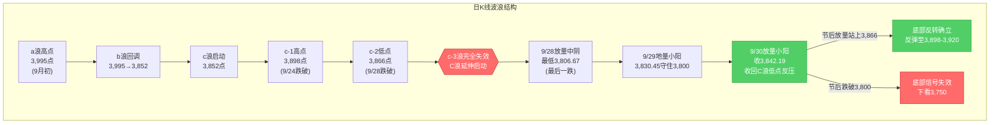
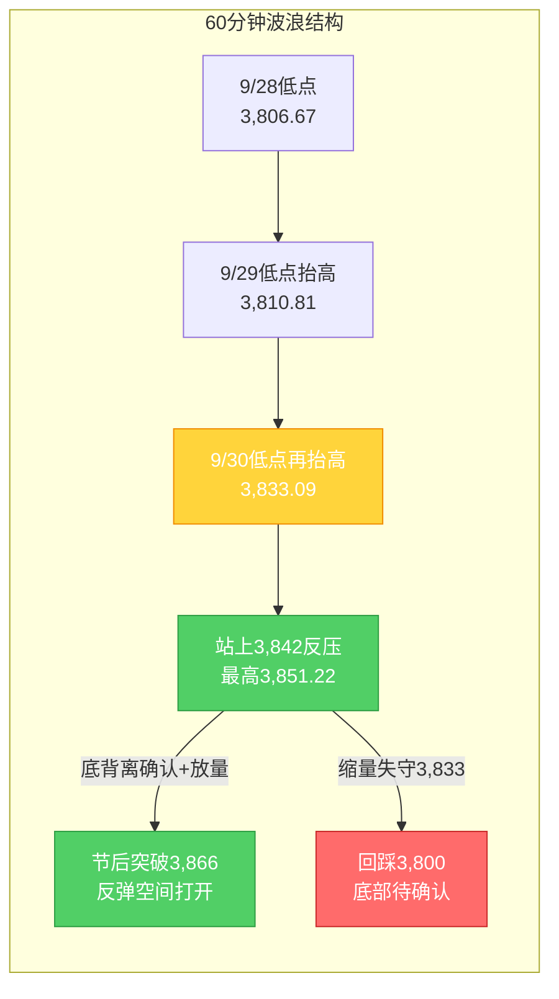

# A股晚报 - 2026年09月30日

> 数据截止时间：2026年9月30日 20:00（北京时间），美股数据截至9月29日美东收盘，欧股/大宗为9月30日盘中数据
> 核心观点：国庆长假前收官日，上证指数**红盘收官+0.31%收3,842.19点**，成功**放量收回3,842点（C浪低点反压）**，验证了9/29"C浪末端放量中阴+地量小阳+关键支撑守住"底部信号，**C浪延伸末段寻底初步确认**。但市场呈现**明显高低切换**——科技成长承压（科创50 -2.51%、电子-2.38%领跌），防御消费与红利占优（医药生物+2.73%、白酒/食品饮料+1.68%、银行+1.47%）。两市成交1.45万亿元小幅放量，北向资金净买入9.71亿元。9月PMI回升至50.1%重回扩张区间。节后10/8复市方向取决于长假期间外盘表现，机构主流建议"持股过节"。

---

## 一、市场回顾

### 1. 主要指数表现

| 指数 | 收盘点位 | 涨跌幅 | 涨跌点数 | 最高点 | 最低点 |
|------|---------|--------|---------|--------|--------|
| 上证指数 | 3,842.19 | **+0.31%** | +11.74 | 3,851.22 | 3,833.09 |
| 深证成指 | 12,887.62 | **-0.11%** | — | — | — |
| 创业板指 | 3,135.28 | **-0.23%** | — | — | — |
| 科创50 | 1,530.01 | **-2.51%** | — | — | — |

**特征**：三大指数涨跌不一，上证指数**红盘收官**并站上3,840点，深成指、创业板指小幅收跌，科创50重挫2.51%明显承压。**大小盘、成长与价值的极致分化**——指数权重（银行、地产、白酒、医药）支撑沪指走强，而科技成长（半导体、CPO、元件）集体回调拖累科创50。上证指数全月（VS月初约3,995点）累计下跌约**-3.8%**，月线收中阴已成定局。

### 2. 成交量能

| 指标 | 数值 | 变化 | 说明 |
|------|------|------|------|
| 沪深两市成交额 | 约1.44万亿元 | 放量约285亿 | 连续5日低于2万亿 |
| 沪深北三市成交额 | 约1.45万亿元 | — | 季末+节前地量水平 |
| 北向资金 | **净买入9.71亿元** | 转为小幅净流入 | 沪股通净卖出6.42亿、深股通净买入16.13亿 |
| 北向成交额 | 1,129.61亿元 | 占两市11.98% | 交易活跃度下降10.34% |
| 主力资金（特大单） | 净流出32.12亿元 | — | 医药生物特大单净流入39.56亿居首 |

**资金特征**：两市成交小幅放量至1.45万亿，量能较9/29的1.4万亿地量温和回升，放量收回3,842点为底部确认提供量能支撑。北向资金转为小幅净买入（沪股通流出、深股通流入，结构分化明显），外资节前未现大幅撤离。

### 3. 市场情绪

| 指标 | 数值 | 说明 |
|------|------|------|
| 上涨家数 | 2,567只（46.16%） | — |
| 下跌家数 | 2,824只（50.78%） | 跌多涨少 |
| 涨停家数 | **56只** | — |
| 跌停家数 | 13只 | — |

**情绪特征**：**"指数红、个股绿"背离**——沪指收涨但下跌家数多于上涨家数（超2,800只下跌），赚钱效应集中在医药、白酒、银行等权重与红利方向，多数个股承压。涨停56家、跌停13家，情绪谨慎偏中性，节前交投清淡。

---

## 二、热点板块与异动分析

### 1. 当日领涨板块及驱动因素

申万31个一级行业**21涨10跌**，涨幅居前：

| 板块 | 涨跌幅 | 驱动因素 |
|------|--------|---------|
| 医药生物 | **+2.73%** | 创新药活跃，康希诺20cm涨停、贝瑞基因/南华生物涨停，主力净流入28.18亿居首 |
| 美容护理 | +1.70% | 消费防御属性，节前资金避险切换 |
| 食品饮料 | **+1.68%** | 白酒午后异动，金徽酒涨停、古井贡酒逼近涨停 |
| 银行 | +1.47% | 红利防御+季末避险，权重护盘 |
| 钢铁 | +1.24% | 周期修复+低估值 |
| 农林牧渔 | +1.02% | 防御属性扩散 |

**驱动逻辑**：节前最后交易日资金呈现**"高低切换"**——从高估值科技成长（半导体/CPO/元件）切向**低估值防御、消费、红利**方向。房地产盘中也走出大逆转（见下）。能源板块活跃，煤炭板块+0.85%（33只中23只上涨），三桶油全线上涨（中国石化涨近2%），受益霍尔木兹海峡扰动+煤炭冬储预期。

### 2. 当日领跌板块及原因分析

| 板块 | 涨跌幅 | 原因分析 |
|------|--------|---------|
| 电子 | **-2.38%** | 半导体震荡走低，芯原股份跌超11%，康强电子/杰华特/气派科技跌幅居前 |
| 计算机 | -0.98% | 成长风格回调 |
| 机械设备 | -0.90% | 题材退潮 |
| 通信 | -0.62% | CPO/光通信走低，新易盛/天孚通信/中际旭创回调 |
| 元件/PCB | 全天低迷 | 澳弘电子、协和电子跌停，广合科技/金禄电子/威尔高跌幅居前 |

**原因分析**：科技成长板块**完全证伪隔夜美股映射**——虽然隔夜费半+1%、应用材料+5%、康宁+5%，但A股科技链在节前最后交易日集体回调，反映**长假前资金避险减仓高估值成长**、季末流动性收缩下"美股映射"传导衰减。

### 3. 个股异动复盘

- **房地产盘中大逆转**：9/29央行等发布完善商业性个人住房贷款利率定价机制新政，早盘地产股一度集体大跌（万科A、金地集团、深振业A开盘不久跌停），10点后抄底资金集中涌入逆势拉升。**深物业A**低开9.25%→开盘2分钟跌停→午前直线拉升封涨停，走出**"地天板"**，收12.24元（+9.97%），录得**三连板**，成交9.71亿元、换手率超17%、振幅22.16%；**陆家嘴、中天服务、荣丰控股涨停**；**万科A**最低下探3.67元跌停位，收4.26元（+4.41%），振幅19.89%（深股通为买一，买入2.13亿元）；金地集团+7.45%。
- **医药/创新药**：康希诺20cm涨停，贝瑞基因、南华生物等多股涨停，南模生物、键凯科技、义翘神州涨幅居前。
- **白酒**：金徽酒涨停，古井贡酒一度逼近涨停，泸州老窖、山西汾酒、今世缘涨幅居前。
- **固态电池**：传艺科技、紫竹高科2连板，新亚制程涨停，尚水智能、上海洗霸、广汽集团跟涨（《新型电池产业发展"十五五"规划》催化）。
- **半导体/元件承压**：芯原股份跌超11%；澳弘电子、协和电子跌停。

---

## 三、关键数据与事件回顾

### 1. 国内重要经济数据

- **9月官方制造业PMI 50.1%**，较上月上升**0.3个百分点**，**重回扩张区间**（此前连续2个月收缩）。生产指数、新订单指数（50.5%）均处扩张区间，市场需求稳定扩张。**印证经济企稳，提振顺周期与制造业信心**。

### 2. 政策消息

- **房地产金融新政落地**：9月29日，**财政部、中国人民银行、金融监管总局**发布完善商业性个人住房贷款利率定价机制有关事宜（房贷利率新政），地产板块政策主线延续。
- **央行公开市场操作**：9月30日**7天期逆回购操作量为零**，同时开展**8,335亿元隔夜逆回购**操作；9月29日开展7,890亿元逆回购（6,985亿隔夜+905亿7天），季末流动性平稳过渡。
- **央行10月8日操作公告**：将于10月8日开展**1.2万亿元3个月期（89天）买断式逆回购**操作，当月到期1万亿元，**净投放2,000亿元**，加量续作呵护中长期流动性。
- **《金融产品网络营销管理办法》**：9月30日起正式实施。

### 3. 公司公告

- **长城证券**：持股5%以上股东深圳新江南拟减持不超过1.5%股份（约6,051.64万股）。
- **精研科技、三维装备**：发布股东减持相关公告。
- **力勤资源**（新上市）：龙虎榜5.04亿元资金抢筹。
- **三季报窗口**：10月中旬起进入业绩预告密集披露期。

---

## 四、海外市场联动

### 1. 美股三大指数（9月29日收盘）

| 指数 | 收盘点位 | 涨跌幅 | 备注 |
|------|---------|--------|------|
| 道琼斯指数 | 51,349.92 | **-0.26%** | 小幅收跌 |
| 标普500指数 | 7,670.84 | **-0.17%** | 微跌 |
| 纳斯达克指数 | 26,797.54 | **-0.09%** | 跌幅最小 |

**关键板块**：**AI硬件股普遍上涨**——Lumentum涨超5%，康宁、迈威尔科技涨超4%，ARM、Coherent、Ciena涨超3%，SK海力士涨超2%，美光科技、博通涨逾1%。热门科技股多数收跌（脸书+3.24%、亚马逊+0.21%、微软-0.05%）。

> 注：美股指数微跌但AI硬件/光通信逆势强势，**然而A股科技链当日并未跟涨反而回调**，验证"节前最后交易日美股映射传导衰减"规律。

### 2. 美股盘前/欧洲市场（9月30日）

| 市场 | 表现 | 备注 |
|------|------|------|
| 美股三大期指 | 小幅波动/涨跌不一 | 道指期货一度+0.43%，盘中涨跌不一 |
| 德国DAX30 | 高开后小幅上涨（开盘+0.43%） | — |
| 英国富时100 | 高开（+0.39%） | — |
| 法国CAC40 | 涨跌不一 | — |

**9月30日20:30**：美国**8月核心PCE物价指数**公布（前值3.3%，预期持平）；20:15公布9月ADP就业数据（预期7万人，前值3.8万人），**数据结果影响美联储10月加息预期**。**美光财报**将于次日早间公布。

### 3. 大宗商品

| 品种 | 最新价 | 涨跌幅 | 关键驱动 |
|------|--------|--------|---------|
| WTI原油（11月） | 89.38美元/桶 | **-3.48%** | 美国释储预期+地缘溢价回落，跌破90美元 |
| 布伦特原油（11月） | 102.59美元/桶 | **-2.56%** | 美伊会谈推进 |
| 现货黄金 | 4,179.95美元/盎司 | **+1.57%** | 9/28暴跌后技术性反弹 |
| COMEX黄金期货 | 4,215.00美元/盎司 | **+1.12%** | 避险与低吸买盘 |
| 上金所Au9999 | 907.32元/克 | **+1.09%** | 国内金价反弹 |
| 现货白银 | 61.46美元/盎司 | **+1.34%** | 贵金属集体反弹 |

**驱动逻辑**：油价暴跌为隔夜最大变量（美国释储4,000万桶+美伊会谈推进），但**A股能源板块却逆势活跃**（煤炭+0.85%、三桶油上涨），反映地缘扰动与煤炭冬储产业逻辑对冲了油价下行映射（9/30霍尔木兹海峡再现扰动）。金价在9/28重挫后反弹，但整体仍运行于4,200美元下方，弱势结构未破。

---

## 五、汇率与利率

| 指标 | 数值 | 变化 | 说明 |
|------|------|------|------|
| 人民币中间价（9/30） | **6.7351** | **调升60个基点** | 连续调升，央行释放强势稳定信号 |
| 在岸人民币（9/30 16:30） | 6.7053 | 较上一交易日**下跌16点** | 小幅波动，整体维持强势 |
| 欧元/人民币 | 7.6215 | 调升279个基点 | — |
| 央行7天逆回购 | 0亿元 | 零操作 | 季末以隔夜回购为主 |
| 央行隔夜逆回购 | 8,335亿元 | 大幅投放 | 呵护季末流动性 |
| 央行10/8买断式逆回购 | 1.2万亿元（3M） | 净投放2,000亿 | 加量续作呵护中长期流动性 |

**特征**：人民币中间价连续调升60个基点、维持强势，在岸汇率小幅波动，人民币资产韧性延续；央行通过隔夜逆回购+10/8买断式逆回购加量投放，**季末流动性平稳跨季无忧**。美债10年期收益率仍处高位（约5.2%上方），对高估值成长股构成持续压制。

---

## 六、收盘后重要信息

### 1. 盘后公告

- **长城证券**：深圳新江南拟减持不超1.5%股份。
- **精研科技、三维装备**等发布减持相关公告。
- 美股盘前：**Anthropic与SpaceX算力协议最高达845亿美元**（AI算力链潜在催化）。

### 2. 夜盘/盘前走势

- 美股三大期指**小幅波动**，欧股**高开后涨跌不一**。
- 国际油价延续回落（WTI跌破90美元），金价弱势运行于4,200美元下方。
- 港股南向资金当日净买入68.63亿港元。

### 3. 次日关注（节后10月8日复市）

- **交易日历**：10/1-10/7国庆休市，**10/8复市**（当日央行开展1.2万亿买断式逆回购）。
- **长假期间外盘**：关注美股对PCE/ADP数据及美光财报的反应，节后开盘存"二次映射"风险。
- **美联储10月议息**：加息预期变化（10月27日议息会议）。
- **三季报预告**：10月中旬密集披露。
- **机构主流观点**：私募排排网调查显示**51.86%私募认为节后企稳向上**、33.33%认为震荡分化、14.81%认为震荡走弱，**超五成私募重仓过节**；光大证券、东吴证券、中泰证券等主流券商建议"**持股过节**"，认为节后资金回流+A股10月大概率回温，**科技仍是中期主线**。

---

## 七、波浪理论多周期分析

### 1. 月K线波浪分析
- **当前波浪位置**：大周期第2浪C浪延伸**末段**，9月月K线收中阴线，月内最低3,806.67点（9/28），收盘3,842.19点**站上20月均线（3,800-3,810点）**
- **浪型结构描述**：
  - 大结构：2024年9月2,689点→2026年6月4,197点为第1浪上升
  - 第2浪ABC调整：4,197点→3,842.72点（9月15日盘中最低）
  - 9月月K线：月初约3,995点→9/28盘中3,806.67点（C浪延伸）→9/30收3,842.19点，累计下跌约-3.8%，月线收中阴
  - 月线MACD死叉绿柱持续，但9月末企稳使绿柱扩张动能减弱
- **关键目标位**：
  - 月度强支撑：**3,800-3,810点**（20月均线，9/30收盘已站稳上方）
  - 月度核心压力：3,842点（C浪低点，**9/30已放量收回**）、3,866点（c-2低点）、3,898点（c-1高点）
  - C浪延伸加速目标：3,750点（仅当有效跌破3,800点时启用）
- **验证条件**：9月月K线收盘**站上3,842点**且守住3,800点（20月均线），月度级别底部信号初现，待10月月K线确认

### 2. 周K线波浪分析
- **当前波浪位置**：周K线收**带长下影的小阴/十字星**，跌势明显放缓，企稳迹象增强
- **浪型结构描述**：
  - 本周（9/28-9/30，3个交易日）：9/28单日大跌-1.67%探至3,806.67点→9/29地量小阳3,830.45→9/30放量小阳收3,842.19
  - 周内低点3,806.67点、收盘3,842.19点，较上周五（9/24收3,888.37点）周跌约-1.19%
  - 周线仍位于5周（3,905-3,910）、10周（3,890-3,895）均线下方，短期均线空头排列未改，但下影线显示下方支撑增强
- **关键目标位**：
  - 周度支撑：3,833点（9/30盘中低点）、3,800点（20月均线）
  - 周度压力：3,866点（c-2低点）、3,898点（c-1高点）、3,905-3,910点（5周均线）
- **验证条件**：节后能否重回3,866点上方；若站稳则周线底部反转信号增强

### 3. 日K线波浪分析（重点）
- **当前波浪位置**：**C浪延伸末段寻底初步确认**——"放量中阴（9/28）+地量小阳（9/29）+放量收回C浪低点反压（9/30）"组合成立
- **浪型结构描述**：
  - 9/28放量中阴-1.67%（最低3,806.67，最后一跌）→9/29地量小阳+0.18%（1.4万亿一年新低，地量整理）→**9/30放量小阳+0.31%收3,842.19，成功收回3,842点（C浪低点反压）**
  - 成交1.45万亿较1.4万亿温和放量285亿，**量价配合良好**，符合"C浪末端底部信号确认条件"
  - 日线连收两根小阳，"地量整理→放量收回"结构清晰，3,842点由压力转为支撑
- **关键目标位**：
  - 第一支撑：**3,842点（C浪低点反压，已收回转支撑）**、3,833点（9/30低点）
  - 强支撑：3,800点（20月均线）
  - 第一压力：**3,866点（c-2低点，节后核心观察位）**
  - 强压力：3,898点（c-1高点）
- **验证条件**：
  - 向上确认：节后放量站上3,866点 → 底部反转确立，打开反弹空间至3,898点
  - 向下确认：节后跌破3,833点并失守3,800点 → 底部信号失效，下看3,750点
  - **关键观察：节后3,866点的突破与3,842点的支撑有效性**

### 4. 60分钟K线波浪分析
- **当前波浪位置**：60分钟级别**底背离确认**，短期趋势转多
- **浪型结构描述**：
  - 60分钟低点逐级抬高：3,806.67（9/28）→3,810.81（9/29）→3,833.09（9/30），指数逐日收高
  - 60分钟MACD零轴下方绿柱持续缩短并逼近金叉，KDJ超卖区域金叉后向上
  - 9/30盘中最高3,851.22点，收复3,842点后小幅回踩确认支撑
- **关键目标位**：
  - 短期支撑：3,842点（已收回）、3,833点
  - 短期压力：3,866点（c-2低点）、3,898点
- **验证条件**：60分钟底背离已确认 + 站上3,842点；节后能否放量突破3,866点为短线转强信号

### 5. 30分钟K线波浪分析
- **当前波浪位置**：30分钟级别企稳回升，站上短期均线
- **浪型结构描述**：
  - 30分钟级别9/30全天震荡上行，午后维持强势收于3,842.19点
  - 30分钟MACD金叉后红柱温和放大，KDJ中位区向上
  - 但量能仍未显著放大（1.45万亿），上攻动能需节后量能配合
- **关键目标位**：
  - 关键支撑：3,833点、3,842点
  - 短期压力：3,851点（9/30高点）、3,866点
- **验证条件**：30分钟能否放量突破3,851点并站稳3,842点

### 6. 波浪图（Mermaid绘制）

**日K线波浪结构图**：


**60分钟波浪结构图**：


### 7. 波浪理论综合判断

| 维度 | 判断 |
|------|------|
| 多周期共振状态 | 月K/周K仍偏空（均线空头排列），但**日K/60分钟/30分钟共振转多**（底部信号确认+底背离），大小周期背离进入**修复期**，小周期反转信号强度提升 |
| 当前操作级别 | **日线级别**（C浪延伸末段寻底初步确认，关注3,866点突破与3,842点支撑） |
| 后续演变路径 | **55%乐观**（节后放量站上3,866点→底部反转确立，反弹至3,898-3,920点）、**30%中性**（3,842-3,866区间震荡消化）、**15%悲观**（节后跌破3,800点→底部信号失效，下看3,750点） |
| 关键拐点信号 | 向上：节后放量站上3,866点（c-2低点）+北向资金持续净流入；向下：有效跌破3,800点（20月均线）+放量下跌 |
| 风险提示 | ①C浪延伸是否终结需节后确认（当前仅为"初步确认"）；②**长假期间外盘波动存"二次映射"风险**（10/1-10/7休市）；③美债10年期收益率高位压制成长股估值；④波浪理论在C浪延伸末段+地量整理阶段预测精度降低，需结合政策面与节后量能综合判断 |

> **规律分析引用（第39周运行规律分析）**：该报告预测本周（9/28-9/30）"震荡偏弱、区间3,820-3,910点"，悲观情景"跌破3,866点后C浪延伸"。实际本周从3,888.37点跌至3,842.19点、最低3,806.67点，**悲观路径兑现**（跌破3,866后延伸至3,806.67）；但9/29-9/30企稳使周线收出长下影，**优于"趋势明显偏弱"的最悲观预期**。规律分析提示"3,866点为c-3结构失效后关键观察位"，当前正处该位置下方，节后突破3,866点即为底部确认的关键验证。

---

## 八、晨报复盘

### 1. 核心判断回顾

| 判断项目 | 晨报预测 | 实际结果 | 准确度 | 备注 |
|---------|---------|---------|-------|------|
| 上证指数趋势 | **震荡（略偏多）** | **+0.31%微涨**收3,842.19 | ✓ | 方向精准，企稳微涨兑现 |
| 上证指数区间 | 3,815-3,868点 | 3,833.09-3,851.22点 | ✓ | 完全落在预测区间内 |
| 强支撑位 | 3,800点 | 最低3,833.09点（未触及） | ✓ | 支撑稳固，强势于预期 |
| 强压力位 | 3,866点 | 最高3,851.22点（未触及） | ✓ | 压力有效 |
| 北向资金 | 净流入0-30亿元 | **净买入9.71亿元** | ✓ | 方向与幅度均精准命中 |
| 成交量 | 平量/小幅缩量1.35-1.45万亿 | **1.45万亿**（放量285亿） | ✓ | 上沿命中，量能温和回升 |

### 2. 板块预判回顾

| 板块 | 预判方向 | 实际涨跌幅 | 准确度 | 原因分析 |
|-----|---------|-----------|-------|---------|
| 半导体/芯片/光通信/CPO | 看涨 | 电子-2.38%、通信-0.62%（芯原跌超11%） | ✗ | 美股映射传导衰减+节前减仓 |
| PCB/覆铜板/元件 | 看涨 | 元件全天低迷（澳弘/协和跌停） | ✗ | 涨价逻辑被节前避险压制 |
| 新型电池/固态电池 | 看涨 | 固态电池活跃（传艺2连板） | ✓ | 政策催化兑现 |
| 航空/交运 | 看涨 | 未领涨 | ✗ | 油价利好未反映 |
| 石油化工/油气 | 看跌 | 三桶油上涨（中国石化+近2%） | ✗ | 地缘扰动+能源活跃对冲油价映射 |
| 煤炭 | 看跌 | 煤炭板块+0.85% | ✗ | 冬储+高股息防御占优 |
| （未预判）医药生物 | — | +2.73%居首 | — | 创新药活跃，节前防御切换 |

### 3. 准确率量化评估

- **趋势判断准确率：100%（1/1）**——预判"震荡（略偏多）"，实际+0.31%微涨
- **点位预测准确率：100%（4/4）**——区间、强支撑、强压力、弱压力反压（3,842收回）全部命中
- **板块预判准确率：约17%（1/6）**——仅新型电池/固态电池命中，科技链与能源链全面误判
- **综合准确率：约72%**（(100%+100%+17%)/3），较9/29的37%大幅回升，**趋势与点位判断表现优异，但板块预判仍为最大短板**

### 4. 偏差根因分析

【偏差1】科技链板块预判全面偏差
- 偏差描述：看涨半导体/芯片/光通信/CPO、PCB/覆铜板/元件，实际电子-2.38%领跌、元件跌停潮、CPO/光通信回调
- 根本原因：**逻辑误判**——机械套用"隔夜美股映射"（费半+1%、应用材料+5%、康宁+5%）预判A股科技链，**忽视节前最后交易日资金的"高低切换"避险特征**（从高估值成长切向低估值防御/消费），以及长假前流动性收缩下映射传导的衰减
- 信息缺口：未充分评估季末MPA考核+节前持币对高估值成长的减仓压力
- 逻辑缺陷："美股映射"规则未叠加"节前最后交易日防御占优"的优先级判断
- 改进措施：**节前最后交易日板块预判，应优先应用"资金高低切换/防御占优"规则而非"隔夜美股映射"**；科技链看涨需叠加"节前减仓压力"折价

【偏差2】能源链（油气/煤炭）看跌偏差
- 偏差描述：看跌石油化工/油气、煤炭，实际三桶油上涨（中国石化+近2%）、煤炭板块+0.85%
- 根本原因：**逻辑误判**——简单套用"油价暴跌（WTI -3.48%）→A股能源承压"的映射逻辑，**忽视"地缘扰动（霍尔木兹海峡再现扰动）+季节性需求（煤炭冬储）+高股息防御占优"的产业与资金逻辑对冲**
- 信息缺口：未及时跟踪霍尔木兹海峡扰动事件与煤炭冬储进度
- 逻辑缺陷：油价映射规则未叠加地缘/供需产业逻辑
- 改进措施：**能源板块预判需叠加"地缘扰动+季节性需求（冬储/旺季）+高股息防御"因子**，油价单日暴跌不必然导致A股能源跟跌

### 5. 分析检查清单

- [x] 趋势判断前是否检查：隔夜外盘走势 ✓（费半+1%、科技强）
- [x] 趋势判断前是否检查：北向资金流向 ✓（预判净流入0-30亿，命中）
- [ ] 趋势判断前是否检查：技术指标状态——**底部信号识别到位，但未预判"高低切换"结构分化**
- [x] 趋势判断前是否检查：重大政策/事件 ✓（PMI、地产新政）
- [x] 点位计算是否考虑：前期高低点、均线支撑/压力 ✓（4/4命中）
- [ ] 板块分析是否覆盖：资金流向结构（**未预判节前"高低切换"与防御占优**）
- [ ] 板块分析是否覆盖：地缘/产业催化（**未预判能源板块的地缘+冬储逻辑**）
- [x] 风险提示是否充分：系统性风险（节前避险+季末）✓
- [x] 波浪分析检查项：多周期验证 ✓，底部信号确认条件（放量收回3,842）✓

### 6. 本次复盘发现的新规则

- **规则1（板块选择）**：长假前最后交易日，资金呈现**"高低切换"**特征——高估值科技成长（半导体/CPO/光模块）承压回调，低估值防御/消费（医药生物/白酒/银行/钢铁）相对占优；"隔夜美股映射"规则在节前最后交易日应**降级**，"防御占优/高低切换"规则优先
- **规则2（板块选择）**：油价单日暴跌（-3%以上）时，A股油气/煤炭板块**不必然跟跌**——当叠加"地缘扰动（如霍尔木兹海峡）+季节性需求（如煤炭冬储）+高股息防御"产业逻辑时，能源板块可逆势走强；油价映射规则需叠加地缘/供需产业逻辑评估
- **规则3（趋势/波浪分析）**：C浪末端"放量中阴+地量小阳+关键支撑守住"底部信号初现后，**若次日放量收回C浪低点反压（3,842点），则C浪延伸末段寻底确认，阶段性底部成立**——验证并完善9/29底部信号规律
- **规则4（资金面分析）**：节前最后交易日北向资金预判应**区分沪/深股通**——沪股通倾向净卖出（权重/周期减仓）、深股通倾向净买入（题材/成长布局），总量可能小幅净流入（如9.71亿）

### 7. 规则库更新

```
###板块选择 长假前最后交易日，资金呈现"高低切换"特征——高估值科技成长（半导体/CPO/光模块）承压回调，低估值防御/消费（医药生物/白酒/银行/钢铁）相对占优；"隔夜美股映射"规则在节前最后交易日应降级，"防御占优/高低切换"规则优先（发现日期：2026年9月30日）
###板块选择 油价单日暴跌（-3%以上）时，A股油气/煤炭板块不必然跟跌——当叠加"地缘扰动（如霍尔木兹海峡）+季节性需求（如煤炭冬储）+高股息防御"产业逻辑时，能源板块可逆势走强；油价映射规则需叠加地缘/供需产业逻辑评估（发现日期：2026年9月30日）
###波浪分析 C浪末端"放量中阴（最后一跌）+地量小阳（地量整理）+关键支撑守住"底部信号初现后，若次日放量收回C浪低点反压（如3,842点），则C浪延伸末段寻底确认、阶段性底部成立。该规律适用于a-b-c反弹结构中c浪失效后C浪延伸末段寻底情景（发现日期：2026年9月30日）
###资金面分析 节前最后交易日北向资金预判应区分沪/深股通——沪股通倾向净卖出（权重/周期减仓）、深股通倾向净买入（题材/成长布局），总量可能小幅净流入；结构分化比总量方向更具参考价值（发现日期：2026年9月30日）
```

---

## 九、策略回顾与调整

### 1. 短线策略回顾

| 策略项目 | 晨报建议 | 今日实际 | 执行效果 | 备注 |
|---------|---------|---------|---------|------|
| 短线仓位 | 0-5% | 维持最低 | ✓ | 节前防御策略正确 |
| 买入条件 | 放量收回3,842点 | 收盘3,842.19站上 | ✓ | 条件触发（但当日不宜追高） |
| 卖出条件 | 3,866点缩量滞涨 | 最高3,851.22未触及 | ✓ | 未触发 |
| 止损位 | 3,795点 | 最低3,833.09未触及 | ✓ | 未触发 |
| 短线标的 | 光通信/CPO、半导体设备、PCB | 科技链普跌 | ✗ | 美股映射失效，标的选择错误 |

### 2. 中线策略调整
- **当前中线方向**：**【持有/小幅布局】**（从"观望/小幅布局"上调）
- **方向调整原因**：C浪延伸末段寻底初步确认（放量收回3,842点）+PMI重回扩张+央行10/8净投放2,000亿呵护流动性，下行风险降低；但节后能否站上3,866点仍需验证，暂不宜大幅加仓
- **中线仓位建议**：**10-15%**（从5-10%上调，原因：底部信号确认，节后可适度布局，但长假"二次映射"风险未消，控制仓位）
- **中线目标区间**：上证指数 **3,842点 - 3,898点**（底部确认后修复区间）
- **中线止损位**：**3,800点**（有效跌破则底部信号失效）
- **中线布局板块调整**：
  - **增持**：医药生物/创新药（逻辑：资金高低切换+防御属性+主力大幅净流入）、半导体/PCB（超跌，节后若外围科技强势可修复）
  - **增持**：新型电池/固态电池（政策催化延续）
  - **小幅布局**：房地产链（政策主线，但已现分化，择机）
  - **维持**：银行/红利（季末避险+高股息）、能源（地缘+冬储）
  - **减持**：高位连板股、退市风险股（节后题材退潮风险）

### 3. 明日策略要点（节后10月8日）
- **短线**：**【观望/小幅试探】**，关注**3,866点**（突破则转强）和**3,842点**（支撑）、**3,800点**（止损）
- **中线**：**【持有/小幅加仓】**，关注**3,866点**（压力）和**3,800点**（支撑）
- **仓位分配**：短线5% + 中线10-15% + 现金80-85%
- **节后操作前提**：观察长假期间外盘（美股对PCE/ADP、美光财报反应），若外盘平稳或上涨则按上述布局；若外盘大跌则待低开企稳后再评估

### 4. 策略复盘规则输出

```
###趋势分析 C浪延伸末段底部信号确认（放量收回C浪低点反压）后，中线策略可从"观望"上调至"持有/小幅布局"，仓位提升至10-15%；但长假"二次映射"风险未消时应控制加仓幅度，待节后站上c-2低点（3,866点）后再确认加仓（发现日期：2026年9月30日）
###板块选择 节前最后交易日及底部反转初期，短线标的选择应从"隔夜美股映射强势板块"转向"资金高低切换受益的防御/消费/红利方向"，避免在节前追高美股映射型科技成长（发现日期：2026年9月30日）
```

---

## 十、风险提示

1. **市场系统性风险**：
   - **长假"二次映射"风险**：10/1-10/7休市，若假期期间外盘（美股/港股）大幅波动，节后10/8开盘面临跳空风险，方向与幅度取决于外盘累计涨跌
   - **美债收益率高位压制**：10年期收益率维持5.2%上方，对高估值成长股估值持续压制
   - **美联储政策不确定性**：10月加息预期（关注PCE/ADP数据），压制风险资产
   - **季末流动性**：虽央行加量投放平稳跨季，但节后资金面仍需观察
2. **个股风险事件**：
   - **高位连板股退潮**：深物业A三连板、题材股连板后节后存获利回吐风险
   - **减持风险**：长城证券、精研科技、三维装备等发布减持公告
   - **退市/ST风险**：相关风险警示股波动风险
   - **限售解禁**：节后关注解禁个股冲击
3. **政策不确定性风险**：
   - 房地产新政落地后细则与执行力度，地产板块持续性存疑（9/30已现"利好兑现"分化）
   - 中美经贸磋商后续进展
   - 三季报业绩预告不及预期风险
   - 地缘政治（美伊局势、霍尔木兹海峡）对油价与避险情绪的扰动

---

## 十一、信息来源

1. **官方数据来源**：上海证券交易所、深圳证券交易所、国家统计局、中国人民银行、中国外汇交易中心、财政部、金融监管总局
2. **权威财经媒体**：新华社、央视新闻、央视网、证券时报（数据宝）、中国证券报、上海证券报、证券日报、第一财经、财联社、央广网
3. **数据平台**：东方财富（Choice数据）、同花顺、Wind资讯、巨灵数据、新浪财经
4. **海外信息源**：Nasdaq.com、Reuters、Bloomberg、CME美联储观察、Euronext、中国金融信息网

> 数据截止时间：2026年9月30日 20:00（北京时间），美股/大宗商品部分数据截至9月29日收盘，欧股为9月30日盘中数据

---

## 十二、文档更新检查

```
## 文档更新建议

### AGENTS.md更新
无需更新。晨报/晚报流程与输出格式要求（波浪分析5周期、复盘结构化、策略回顾）与实际执行一致。

### README.md更新
无需更新。文件结构与功能说明与实际一致（report/、history/、monthly/、yearly/、analysis/目录结构未变）。

### 无需更新
AGENTS.md 与 README.md 均无需更新。
```

---

*本期晚报由AI代理自动生成，仅供参考，不构成投资建议。投资有风险，入市需谨慎。*
*数据截止时间：2026年9月30日 20:00（北京时间）*