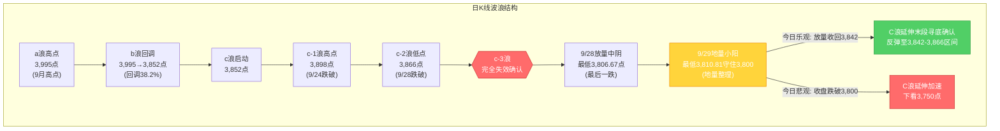
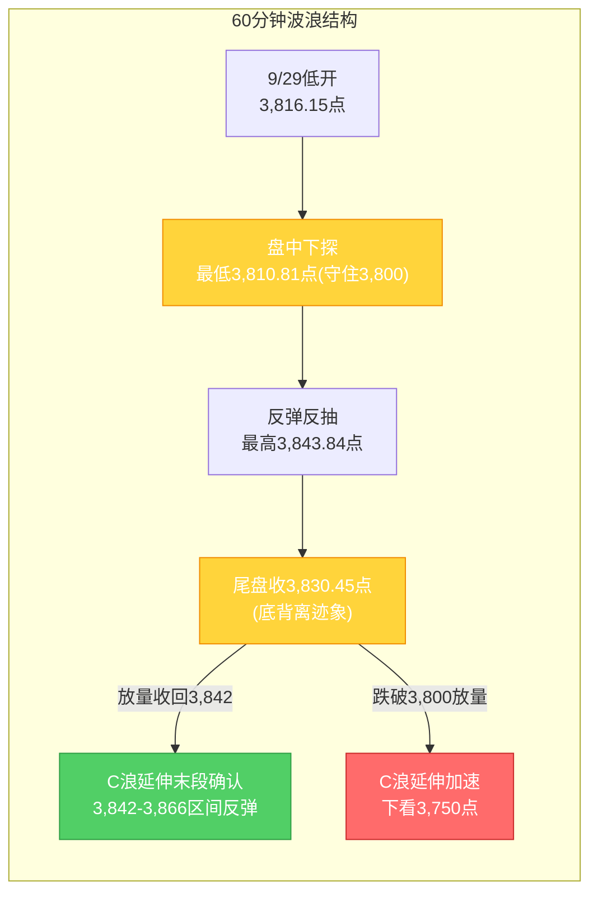

# A股晨报 - 2026年09月30日

> 数据截止时间：2026年9月30日 08:30（北京时间），美股截至9月29日美东收盘
> 核心观点：国庆前最后交易日（9/30）。隔夜外围"科技强、周期弱"分化——美股三大指数微跌但**芯片/光通信逆势大涨（费半+1%、应用材料+5%、康宁+5%）**、中概金龙指数大涨2%，**国际油价暴跌（WTI -3.48%、Brent -2.56%）**、金价反弹1.64%；国内9月官方制造业PMI预期回升至50.1%（前值49.8，9:30公布），**人民币中间价调升60个基点至6.7351**延续强势。9/29上证收3,830.45点（+0.18%）守住3,800点（20月均线），地量小阳+C浪末端底部信号初现。今日预计高开震荡，关注能否**放量收回3,842点（C浪低点反压）**确认底部；节前最后交易日以防御为主，仓位维持低位（短线0-5%、中线5-10%）。

---

## 一、昨日晚报复盘要点回顾

### 1. 9/29 判断回顾

| 判断项目 | 晨报预测 | 9/29实际结果 | 准确度 | 备注 |
|---------|---------|-------------|-------|------|
| 上证指数趋势 | 看跌（震荡偏弱） | **+0.18%微涨**收3,830.45 | ✗ | 方向误判，实际3,800点企稳 |
| 上证指数区间 | 3,795-3,840点 | 3,810.81-3,843.84点 | △ | 上沿略突破4点，区间基本符合 |
| 强支撑位 | 3,800点（20月均线） | 最低3,810.81点（守住） | ✓ | 强支撑有效验证 |
| 强压力位 | 3,866点（c-2低点） | 最高3,843.84点（未触及） | ✓ | 压力位有效 |
| 北向资金 | 小幅净流出0-30亿元 | 转为小幅净流入约20亿元量级 | ✗ | 国常会政策催化+人民币企稳带动 |
| 成交量 | 缩量1.45-1.55万亿元 | **1.4万亿元**（一年新低） | ✓ | 地量整理特征兑现 |

**准确率量化**：
- 趋势判断准确率：0%（0/1）——预判看跌实际微涨企稳
- 点位预测准确率：约83%（5/6）——强支撑3,800✓、强压力3,866✓
- 板块预判准确率：0%（0/7）——看涨4板块、看跌3板块全面误判
- 综合准确率：**约37%**（较9/28的33%略回升，主要拖累项为板块全面误判）

### 2. 关键偏差及原因

【偏差1】上证指数趋势判断偏差
- 偏差描述：预测"看跌"，实际+0.18%微涨收3,830.45点，盘中最低3,810.81点守住3,800点
- 根本原因：**情绪面误读+政策面低估**——将"美债10Y创新高+节前避险+外围偏空"作为首要利空，低估9/28国常会"加大宏观政策逆周期调节+稳定房地产市场"增量政策的对冲效应
- 改进措施：节前/底部区域趋势预判必须将"国内重大政策催化"与"美债创新高利空"对冲评估，政策催化明确时不应单边看跌

【偏差2】板块预判全面误判
- 偏差描述：看涨4板块（油气/公用/煤炭/农林）全错、看跌3板块（MLCC/新能源/黄金）全错，实际领涨为房地产/固态电池/元件
- 根本原因：**逻辑误判+政策面低估**——机械套用9/28"加息环境利率弹性反向"规则，忽视国常会稳楼市政策+《新型电池十五五规划》+PCB涨价潮三重催化
- 改进措施：加息环境下板块预判必须叠加"重大政策催化"评估，政策催化明确时"利率弹性反向"规则阶段性失效

【偏差3】北向资金方向偏差
- 偏差描述：预测小幅净流出，实际转为小幅净流入约20亿元量级
- 根本原因：**逻辑误判**——低估国常会政策催化+人民币资产逆势走强对外资的回流带动
- 改进措施：北向资金预判必须叠加"国内重大政策催化"因子

### 3. 沉淀的规则/检查项

- **板块选择**：重大政策催化（国常会增量政策/产业规划）可阶段性逆转加息环境下高估值成长板块"利率弹性反向"规则——"政策催化优先级>加息环境利率弹性"
- **趋势分析/波浪分析**：C浪末端"放量中阴（最后一跌）+地量小阳（地量整理，量60-70%）+关键支撑守住"组合为阶段性底部初步信号，需后续放量收回C浪低点反压（3,842点）确认
- **资金面分析**：节前倒数第二日若关键支撑企稳，成交量可萎缩至一年新低地量（约常规70%），主力资金由净流出转净流入为底部信号辅助验证
- **板块选择**：国常会明确"稳定房地产市场"政策表述，房地产板块易现涨停潮，市场风格由"防御抱团"转向"政策主线"，防御板块阶段性回吐
- **仓位管理**：C浪延伸末段+长假前最后交易日叠加，仓位维持最低水平（5-10%）

### 4. 对今日分析的启示

- C浪末端底部信号初现（9/28放量中阴+9/29地量小阳+3,800守住），今日核心观察点转为**能否放量收回3,842点**确认底部
- 隔夜外围"科技强（费半+1%、光通信大涨）、周期弱（油价暴跌）"分化，需据此调整板块预判（科技/AI链转多、油气/煤炭转空）
- 9月制造业PMI预期重返扩张（50.1%），若兑现将强化经济企稳预期
- 节前最后交易日避险效应高峰叠加季末MPA考核，仓位不宜激进，但底部信号+C浪末端不宜过度看空

---

## 二、隔夜市场动态（9月29日收盘后至今）

### 1. 美股市场（9月29日，美东时间）

| 指数 | 收盘点位 | 涨跌幅 | 备注 |
|------|---------|--------|------|
| 道琼斯指数 | 51,349.92 | **-0.26%**（-131.59点） | 窄幅震荡收跌 |
| 标普500指数 | 7,670.84 | **-0.17%**（-12.85点） | 微跌 |
| 纳斯达克指数 | 26,797.54 | **-0.09%**（-22.84点） | 跌幅最小，科技逆势走强 |

**关键板块与个股异动**：
- **费城半导体指数**：涨幅超1%，**芯片股集体大涨**——应用材料涨超5%、迈威尔科技涨超4%、Arm/阿斯麦涨逾3%、博通/美光涨逾1%（对A股半导体/AI算力链形成**正面映射**）
- **光通信概念走强**：康宁涨近5%、AXT涨超6%、Lumentum涨超5%、Coherent涨超3%；消息面上**美国电信巨头AT&T与康宁签订多年协议**
- **中概股**：纳斯达克中国金龙指数**大涨2%**，人民币资产强势信号
- **能源板块**：受国际油价暴跌拖累走弱

> 注：美股指数微跌但结构分化明显——"科技强、周期弱"，主因油价暴跌拖累能源权重、而芯片/光通信受AI需求+产业订单催化逆势上攻。这与9/28"科技普跌、能源抗跌"呈完全反向，对A股映射由"科技偏空"转为"科技偏多"。

### 2. 欧洲/亚太市场（9月29日日盘）

| 市场 | 收盘点位 | 涨跌幅 | 备注 |
|------|---------|--------|------|
| 德国DAX30 | 25,392.30 | **+0.10%** | 小幅收涨 |
| 英国富时100 | 10,632.21 | **-0.49%** | 跌幅居前 |
| 法国CAC40 | 8,035.87 | **-0.53%** | 跌幅居前 |
| 欧洲斯托克50 | — | 涨跌不一 | 整体偏弱 |

**海外特征**：欧洲三大股指涨跌不一、整体偏弱；但美股科技板块与中概股走强，外围情绪对A股偏中性略偏多。

### 3. 大宗商品

| 品种 | 最新价 | 涨跌幅 | 关键驱动 |
|------|--------|--------|---------|
| WTI原油（11月） | 89.38美元/桶 | **-3.48%**（-3.22美元） | 美国计划通过"互换"释放4,000万桶战略石油储备 |
| 布伦特原油（11月） | 102.59美元/桶 | **-2.56%**（-2.69美元） | 地缘溢价回落+释储预期 |
| 现货黄金 | 4,181.79美元/盎司 | **+1.64%** | 9/28重挫-3.94%后强势反弹 |
| COMEX黄金期货 | 4,215.00美元/盎司 | **+1.12%** | 避险与低吸买盘推动 |
| 伦敦银现货 | 61.4美元/盎司 | **+1.4%** | 贵金属集体反弹 |

**驱动逻辑**：**油价暴跌为隔夜最大变量**——美国释储计划+美伊纽约间接会谈推进（双方通过卡塔尔调解方交换信息、均保留军事选项）令地缘溢价集中回落，WTI跌破90美元；贵金属在9/28暴跌后技术性反弹。**油价暴跌利空A股油气/石化/煤炭，利好航空/交运/化工中下游**。

### 4. 汇率与利率

| 指标 | 数值 | 变化 | 说明 |
|------|------|------|------|
| 人民币中间价（9/30） | **6.7351** | **调升60个基点** | 连续两日调升，央行释放强势稳定信号 |
| 人民币中间价（9/29） | 6.7411 | 调降12个基点 | — |
| 在岸人民币16:30收盘（9/29） | 6.7037 | **+91点** | 较中间价大幅升水，人民币走强 |
| 美元指数（9/30） | 101.380 | **+0.19%** | 高位小幅走强 |
| 美债10年期收益率 | 仍处5.2%上方 | 高位运行 | 9/28收盘5.236%（2007年以来新高） |
| 美债30年期收益率 | 仍处5.4%上方 | 高位运行 | 长端利率中枢抬升 |

**特征**：人民币中间价连续调升、在岸汇率升水，人民币走出独立强势行情；但美债收益率维持历史高位，对全球高估值成长股仍构成潜在压制（边际钝化）。

### 5. 重要海外事件

- **美伊局势**：美伊通过卡塔尔调解方交换信息，伊朗外长称已提出重开霍尔木兹海峡条件，双方均保留军事选项；调解进展推动地缘溢价回落、油价暴跌
- **美国释储**：美国计划通过"互换"方式释放4,000万桶战略石油储备，压制油价
- **美联储加息预期**：10月加息概率仍偏高（CME约65%量级），美债收益率高位运行
- **美国经济数据**：本周关注美国非农数据（影响后续加息路径）

---

## 三、今日关注事项

### 1. 重要数据发布

| 时间 | 数据名称 | 预期值/前值 | 影响 |
|------|---------|------------|------|
| 9/30 09:30 | **中国9月官方制造业PMI** | **预期50.1 / 前值49.8** | 若兑现将**结束连续2个月收缩、重回扩张区间**，提振顺周期与制造业信心 |
| 9:20 | 央行公开市场操作 | — | 季末+节前流动性投放力度 |
| 全周 | 美国非农就业数据 | — | 影响美联储加息路径 |

### 2. 政策/监管动态

- **《金融产品网络营销管理办法》**：9月30日起正式实施，规范金融产品线上营销，关注券商/基金销售相关影响
- **国新办发布会**：9月30日就"加快建设现代化水网"有关情况举行新闻发布会（水利/基建板块催化）
- **国常会稳楼市政策**：后续细则待跟进，房地产政策主线延续性关注
- **季末MPA考核**：9月30日季末，资金面波动风险加剧
- **恒生科技指数编算方法修订**：预计9月底公布并于9/30指数检讨中实施

### 3. 公司公告

- **力勤资源（001246.SZ）**：今日登陆深交所主板，发行价21.23元/股，募资约36.70亿元，主营镍矿资源开发及镍钴湿法冶炼（"A+H"两地上市）
- ***ST元道（301139.SZ）**：今日复牌进入退市整理期，风险警示
- **芯联集成-U**：9/28晚披露前三季度业绩预告，预计营收约77.66亿元（+43.23%）、归母净利润约6.81亿元大幅扭亏，9/29收盘涨近5%（科技赛道景气验证）
- **三季报窗口**：10月中旬进入业绩预告密集披露期

### 4. 限售解禁

- **9/30当日**：**23家公司**限售股解禁，合计解禁量2.53亿股、**解禁市值约133.82亿元**（较9/29苏能股份215亿回落）
- 解禁量居前：日联科技、*ST发展、瑞立科密
- 国庆前3个交易日合计59只个股解禁约1,040亿元（大部分已于9/28-9/29释放）

### 5. 其他关注

- **交易日历**：9/30为**国庆长假前最后一个交易日**，10/1-10/7休市，10/8复市
- **新股申购**：今日无新股申购
- **机构观点**：多数券商建议"**持股过节**"，认为节后资金回流+上行逻辑未破坏，10月大概率回温，**科技仍是中期主线**；方向上关注政策催化（地产链、新型电池设备/材料）与景气可验证（PCB）

---

## 四、板块与个股分析（结合昨日复盘）

### 1. 基于昨日复盘结论的板块调整

| 板块 | 9/29表现 | 隔夜新信息 | 今日预期 |
|------|---------|-----------|---------|
| 房地产 | 涨停潮（万科A涨停） | 国常会政策延续、今日高开预期，但涨停潮后持续性存疑 | 政策主线，注意**冲高回落**风险 |
| 固态电池/新型电池 | 涨幅居前 | 《新型电池十五五规划》+消费税免征 | 政策+产业双催化，延续活跃 |
| 元件/PCB | 涨停7家（涨价潮） | 隔夜美股光通信/芯片大涨+AT&T康宁协议 | 涨价+AIDC需求，**映射转多** |
| 半导体/光通信/CPO | 9/28重挫后企稳 | **费半+1%、应用材料+5%、康宁+5%** | **外围映射转多**，超跌反弹 |
| 油气/石化 | 跌幅居前 | **WTI -3.48%、Brent -2.56%**、美国释储 | **转空**，承压明显 |
| 煤炭 | 跌幅居前 | 油价暴跌映射 | 转空，高股息防御被分流 |
| 黄金/贵金属 | 国际金价企稳 | 金价**反弹+1.64%**、银+1.4% | 短期反弹，但高息环境未反转 |
| 公用事业/电力 | 未领涨（被政策主线分流） | 高股息防御+季末避险 | 防御属性仍在，弱势企稳 |

### 2. 隔夜信息驱动的板块机会

- **受益板块**：
  - （1）**半导体/芯片/光通信/CPO**（逻辑：隔夜费半+1%、应用材料+5%、康宁涨近5%、AT&T与康宁签多年协议，**外围映射由偏空转偏多**，叠加PCB涨价潮）
  - （2）**PCB/覆铜板/元件**（逻辑：AI服务器需求放量+产业链涨价潮延续，与美股光通信强势共振）
  - （3）**新型电池/固态电池**（逻辑：《新型电池十五五规划》+消费税免征，政策+产业双催化）
  - （4）**航空/交运/化工中下游**（逻辑：油价暴跌-3.5%显著降低燃油/原料成本，成本改善逻辑）
  - （5）**房地产链**（逻辑：国常会稳楼市政策延续，但涨停潮后需防冲高回落）

- **受损板块**：
  - （1）**石油化工/油气**（逻辑：WTI -3.48%、Brent -2.56%，美国释放4,000万桶SPR，地缘溢价回落）
  - （2）**煤炭**（逻辑：油价暴跌映射+高股息防御被政策主线分流）
  - （3）**高位连板股/退市风险股**（逻辑：*ST元道进入退市整理期，风险警示）

### 3. 重点关注个股

- **中际旭创/新易盛/天孚通信**：光通信龙头，隔夜美股光通信大涨映射+北向资金成交居前，超跌反弹关注
- **北方华创/中微公司**：半导体设备，费半强势映射
- **芯联集成-U**：三季报业绩预告大幅扭亏，科技赛道景气验证
- **宁德时代**：固态电池/新型电池政策催化（北向深股通成交居首36.87亿）
- **中国石油/中国海油**：油价暴跌承压，注意回避

---

## 五、今日核心判断

### 1. 趋势判断
- 上证指数：**【震荡】**（略偏多，C浪末端底部信号+PMI预期重返扩张+外围科技强势，但节前最后交易日避险制约上行）
- 预测区间：**3,815点 - 3,868点**
- 核心逻辑：9/29地量小阳（1.4万亿一年新低）+3,800点守住，C浪末端底部信号初现；隔夜外围"科技强、周期弱"、中概金龙+2%、人民币中间价调升60bp、9月PMI预期回升至50.1%重回扩张区间，多重因素支撑高开；但9/30为国庆前最后交易日，节前避险效应高峰叠加季末MPA考核，量能难有效放大，指数预计**高开后区间震荡**，关键看能否放量收回3,842点。

### 2. 关键点位
- 强支撑位：**3,800点**（依据：20月均线，长期牛熊分界线，C浪延伸最后防线，9/29最低3,810.81已初步验证）
- 弱支撑位：**3,815点**（依据：9/29收盘3,830下方+今日高开缺口区域，短期整理支撑）
- 强压力位：**3,866点**（依据：c-2低点，9/28跌破后转为强压力）
- 弱压力位：**3,842点**（依据：C浪低点反压，9/29盘中最高3,843.84小幅反抽未站稳，**今日核心观察位**）

### 3. 板块预判
- 看涨板块：
  - （1）**半导体/芯片/光通信/CPO**（逻辑：隔夜费半+1%、应用材料+5%、康宁+5%、AT&T康宁多年协议，外围映射转多）
  - （2）**PCB/覆铜板/元件**（逻辑：AI服务器需求+涨价潮，与美股光通信强势共振）
  - （3）**新型电池/固态电池**（逻辑：《新型电池十五五规划》+消费税免征双催化）
  - （4）**航空/交运**（逻辑：油价暴跌-3.5%成本改善）
- 看跌板块：
  - （1）**石油化工/油气**（逻辑：WTI -3.48%、Brent -2.56%、美国释放4,000万桶SPR）
  - （2）**煤炭**（逻辑：油价暴跌映射+防御逻辑被政策主线分流）
- 风险板块：
  - **高位连板股**：题材退潮+获利回吐风险
  - **退市风险股**：*ST元道进入退市整理期，ST板块波动风险
  - **限售解禁个股**：9/30日联科技、*ST发展、瑞立科密等23股解禁133.82亿元
  - **房地产**：涨停潮后注意冲高回落

### 4. 资金面判断
- 北向资金预期：**【小幅净流入】**约0-30亿元（逻辑：人民币中间价连续调升60bp+在岸升水+PMI预期改善+外围科技强势+中概金龙+2%，但节前最后交易日外资亦有避险减仓需求，流入幅度温和）
- 成交量预期：**【平量/小幅缩量】**约1.35-1.45万亿元（逻辑：节前最后交易日，机构普遍建议持股过节、集中减仓大体完成，成交或维持地量；若高开后放量收回3,842点则为底部确认信号）

### 5. 风险预警（按优先级排序）
- 高风险：
  - **节前最后交易日避险抛压**：9/30为国庆前最后交易日，季末MPA考核+持币过节需求，短期抛压集中
  - **3,800点（20月均线）有效性**：虽9/29守住，但C浪延伸未确认结束，若今日收盘跌破则下看3,750点
  - **美债收益率高位**：10Y维持5.2%以上（2007年以来新高），对高估值成长股估值压制持续
- 中风险：
  - **油价暴跌拖累能源股**：WTI -3.48%，油气/石化/煤炭面临补跌
  - **美联储10月加息预期**：概率约65%，压制成长股估值
  - **消息面真空**：长假期间外盘波动风险，A股休市期间"二次映射"不确定性
- 低风险：
  - **限售解禁**：9/30解禁133.82亿元，个股层面冲击
  - **美伊会谈不确定**：若谈判反复，油价与避险情绪或再波动

### 6. 昨日复盘规则应用
- **应用规则1（板块选择）**：政策催化优先级>加息环境利率弹性——今日继续看涨政策受益板块（新型电池/PCB），并据隔夜外围科技强势，将半导体/光通信由"看跌"调整为"看涨"
- **应用规则2（趋势/波浪分析）**：C浪末端"放量中阴+地量小阳+关键支撑守住"底部信号初现，今日核心观察**放量收回3,842点**确认；3,800点为最后防线，跌破下看3,750点
- **应用规则3（资金面分析）**：节前最后交易日，成交量维持地量；北向资金受人民币强势+PMI改善支撑，预判小幅净流入
- **应用规则4（仓位管理）**：C浪延伸末段+长假前最后交易日叠加，仓位维持最低（短线0-5%、中线5-10%）

---

## 六、投资策略建议（分短线+中线）

### 1. 短线策略（1-3个交易日，跨节窗口）
- 适用场景：基于日K线和60分钟K线技术信号，C浪末端+节前最后交易日以防御为主
- 短线仓位：**0-5%**（维持最低，不建议新开仓，跨节持仓风险较高）
- 买入条件（仅在满足以下条件时小幅试探）：
  - 今日放量收回3,842点（C浪低点反压）上方并站稳
  - 半导体/光通信板块在隔夜外围映射下放量走强
  - 60分钟级别底背离确认
- 卖出条件：
  - 指数触及3,866点（c-2低点强压力）缩量滞涨
  - 科技板块高开冲高回落、量能萎缩
- 止损位：**3,795点**（收盘跌破3,800点即止损，等待3,750点附近再评估）
- 短线标的（仅在满足买入条件时）：
  - （1）**光通信/CPO**（中际旭创/新易盛，逻辑：隔夜美股光通信大涨映射+北向成交居前+超跌）
  - （2）**半导体设备**（北方华创，逻辑：费半+1%、应用材料+5%映射）
  - （3）**PCB/元件**（逻辑：涨价潮+AIDC需求）

### 2. 中线策略（1-4周）
- 适用场景：基于周K线波浪分析，C浪末端+国庆前后市场方向选择关键期
- 中线仓位：**5-10%**（较9/29的10-15%进一步下调至最低，持币过节为主）
- 方向判断：**【观望/小幅布局】**（C浪末端底部信号初现，下行风险降低，但C浪延伸未确认结束+节前不宜加仓）
- 目标区间：上证指数 **3,800点 - 3,866点**（底部信号确认后修复区间）
- 中线布局板块：
  - （1）**半导体/光通信/PCB元件**（增持，逻辑：AI需求+涨价潮+外围科技强势映射，科技中期主线）
  - （2）**新型电池/固态电池**（增持，逻辑：《新型电池十五五规划》+消费税免征政策催化）
  - （3）**房地产链**（小幅布局，逻辑：国常会稳楼市政策主线，但注意持续性）
  - 减持：**油气/煤炭**（油价暴跌-3.5%，地缘溢价回落）
  - 观望：**黄金/贵金属**（金价反弹但高息环境未反转）
  - 维持：**银行/大金融**（季末避险，仓位不增不减）
- 止盈条件：指数放量收回3,866点且站稳3个交易日
- 止损条件：**指数收盘跌破3,750点**（趋势确认反转）

### 3. 仓位分配总览

| 策略类型 | 仓位比例 | 方向 | 重点板块 |
|---------|---------|------|---------|
| 短线 | 0-5% | 观望，防御为主 | 光通信/半导体、PCB |
| 中线 | 5-10% | 观望/小幅布局 | 半导体/光通信、新型电池、地产链 |
| 现金 | 85-95% | — | —（节前持币为主） |

### 4. 与昨日策略对比
- 短线仓位调整：维持0-5%（原因：节前最后交易日+C浪延伸末段，仓位已降至最低）
- 中线仓位调整：从10-15%**下调至5-10%**（原因：9/30为节前最后交易日，遵守"最后交易日仓位降至5-10%"规则，跨节降仓）
- 板块调整：**半导体/光通信由看跌转为看涨**（隔夜费半+1%、光通信大涨映射），**油气/煤炭由看涨/维持转为减持**（油价暴跌-3.5%），增持新型电池/PCB

---

## 七、波浪理论多周期分析

### 1. 月K线波浪分析
- 当前波浪位置：大周期第2浪C浪延伸末段，月K线收中阴线，9/29守住3,800点（20月均线）
- 浪型结构描述：
  - 大结构：2024年9月2,689点→2026年6月4,197点为第1浪上升
  - 第2浪ABC调整：4,197点→3,842.72点（9月15日盘中最低）
  - 9/28盘中3,806.67点击穿3,842点（C浪延伸启动），9/29最低3,810.81点**守住3,800点防线**
  - 9月月K线截至9/29收盘3,830.45点，本月以来累计下跌约-4.1%，月线收中阴已成定局
  - 月线MACD死叉绿柱持续释放，"8月大阴+9月中阴"连续下跌组合确认
- 关键目标位：
  - 月度强力支撑：**3,800-3,810点**（20月均线，长期牛熊分界线，9/29已初步验证）
  - 月度核心压力：3,842点（C浪低点，已跌破转反压）、3,866点（c-2低点）、3,980-3,985点（5月均线）
  - C浪延伸加速目标：3,750点（前期低点区域，仅当收盘跌破3,800点时启用）
- 验证条件：9月收盘（9/30）能否守住3,800点（20月均线）为月度级别多空分水岭——9/29已初步守住，待9/30收盘确认

### 2. 周K线波浪分析
- 当前波浪位置：周线收长阴后小阳，技术形态偏空但跌势放缓
- 浪型结构描述：
  - 9/28（本周一）单日大跌1.67%破位后，9/29（本周二）地量小阳企稳
  - 周线仍跌破5周均线（3,905-3,910）、10周均线（3,890-3,895），短期均线空头排列
  - 周线MACD绿柱持续释放，但9/29地量小阳使绿柱扩张动能减弱
- 关键目标位：
  - 周度关键支撑：3,810.81点（9/29盘中低点）、3,800点（20月均线）
  - 周度关键压力：3,842点（C浪低点反压）、3,866点（c-2低点）、3,898点（c-1高点）
- 验证条件：本周（9/28-9/30）收盘能否重回3,842点上方，否则C浪延伸未确认结束、但3,800守住则进入地量整理

### 3. 日K线波浪分析（重点）
- 当前波浪位置：C浪延伸阶段，**"放量中阴+地量小阳"底部信号初现，待放量确认**
- 浪型结构描述：
  - 9/24跌破c-1高点3,898点（c-3结构失效启动）→9/28跌破c-2低点3,866点+击穿C浪低点3,842点至3,806.67点（C浪延伸启动，放量中阴-1.67%）→**9/29地量小阳+0.18%，最低3,810.81点守住3,800点**
  - 9/28放量中阴（1.72万亿）+9/29地量小阳（1.4万亿，一年新低）组合，**初步验证"C浪末端放量中阴+地量整理形成阶段性底部"**
  - 日线9/28中阴+9/29小阳，跌势放缓但**未确认反转**（尚未放量收回3,842点）
- 关键目标位：
  - 第一支撑：3,810.81点（9/29盘中低点）、3,800点（整数关口+20月均线，已初步验证）
  - 强支撑：3,750点（前期低点区域，仅当收盘跌破3,800启用）
  - 第一压力：**3,842点（C浪低点反压，9/29盘中最高3,843.84点小幅反抽后回落，今日核心观察位）**
  - 强压力：3,866点（c-2低点）、3,898点（c-1高点）
- 验证条件：
  - 向上确认：今日放量收回3,842点上方 → C浪延伸末段寻底确认，打开反弹空间
  - 向下确认：今日收盘跌破3,800点 → C浪延伸加速，下看3,750点
  - 关键观察：3,800点支撑有效性（9/29已初步验证）+ 能否放量收回3,842点

### 4. 60分钟K线波浪分析
- 当前波浪位置：60分钟级别跌势放缓，**底背离迹象初现**
- 浪型结构描述：
  - 9/29低开3,816.15点后下探3,810.81点（高于9/28最低3,806.67点），随后反弹至3,843.84点，收3,830.45点
  - 60分钟级别低点抬高、指数收高——**60分钟底背离迹象初现**
  - 60分钟MACD绿柱缩短，KDJ超卖区域金叉迹象
- 关键目标位：
  - 短期支撑：3,810-3,816点（9/29低开区域）、3,800点（整数关口+20月均线）
  - 短期压力：3,842点（C浪低点反压）、3,866点（c-2低点）
- 验证条件：60分钟底背离能否确认 + 是否放量收回3,842点（今日高开利于背离确认）

### 5. 30分钟K线波浪分析
- 当前波浪位置：30分钟级别尾盘企稳，超卖区域金叉迹象
- 浪型结构描述：
  - 30分钟级别9/29低开后下探3,810.81点，午后震荡走高至3,830.45点收盘
  - 30分钟MACD零轴下方绿柱缩短，KDJ超卖区域金叉迹象
  - 尾盘企稳特征明显，但量能不足（1.4万亿地量）
- 关键目标位：
  - 关键支撑：3,810-3,816点、3,800点（20月均线区域）
  - 短期压力：3,842点、3,866点
- 验证条件：30分钟级别是否放量收阳站稳3,842点 + 3,800点支撑有效性

### 6. 波浪图（Mermaid绘制）

**日K线波浪结构图**：

**60分钟波浪结构图**：

### 7. 波浪理论综合判断

| 维度 | 判断 |
|------|------|
| 多周期共振状态 | 月K偏空、周K偏空、**日K企稳信号（地量小阳）**、**60分钟底背离迹象**、30分钟企稳——延续"大周期偏空+小周期企稳信号"结构，多周期背离待修复 |
| 当前操作级别 | 60分钟级别（C浪延伸末段，关注3,800点支撑有效性及60分钟底背离确认） |
| 后续演变路径 | **40%乐观**（今日放量收回3,842点→C浪延伸末段寻底确认，反弹至3,842-3,866区间）、**40%中性**（3,800-3,842点地量震荡，节前缩量收官）、**20%悲观**（收盘跌破3,800点→C浪延伸加速，下看3,750点） |
| 关键拐点信号 | 向上：今日放量收回3,842点+60分钟底背离确认+半导体/光通信强势；向下：收盘跌破3,800点+放量下跌 |
| 风险提示 | C浪延伸未确认结束，3,800点（20月均线）为最后防线，跌破则趋势反转风险加大；波浪理论在C浪延伸末段+地量整理阶段预测精度降低，需结合政策面（国常会增量政策）与节前效应综合判断；节前最后交易日（9/30）避险效应高峰，长假期间外盘波动存"二次映射"风险 |

---

## 八、信息来源

1. **官方数据来源**：上海证券交易所、深圳证券交易所、中国人民银行、中国外汇交易中心、国家统计局、国务院
2. **权威财经媒体**：新华社、央视新闻、证券时报（数据宝）、中国证券报、上海证券报（中国证券网）、第一财经、财联社、央广网、金融界
3. **数据平台**：东方财富（Choice数据）、同花顺、Wind资讯、巨灵数据、新浪财经
4. **海外信息源**：Nasdaq.com、Reuters、Bloomberg、CME美联储观察、Euronext

> 数据截止时间：2026年9月30日 08:30（北京时间），美股/欧股/大宗商品数据截至9月29日收盘，人民币汇率为9月30日中间价

---

*本期晨报由AI代理自动生成，仅供参考，不构成投资建议。投资有风险，入市需谨慎。*