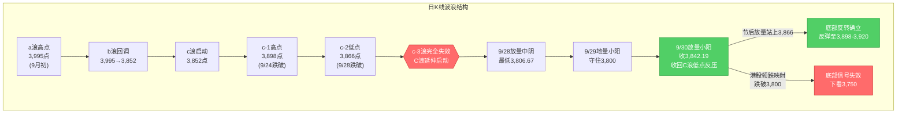
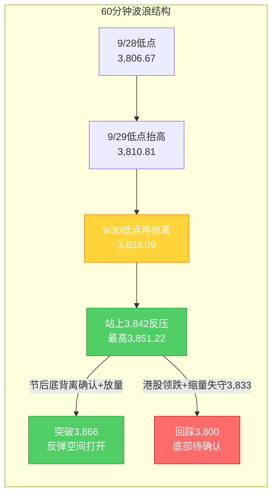

# A股晚报 - 2026年10月02日（国庆休市特刊·假期全球市场追踪）

> 数据截止时间：2026年10月2日 20:00（北京时间）；美股数据截至10月1日美东收盘，港股为10月2日收盘，欧股/大宗为10月1-2日盘中数据
> 报告类型：国庆休市特刊 —— 节前最后交易日（9/30）复盘 + 假期全球市场动态追踪（10/1-10/2）+ 节后（10/8）开盘策略
> 核心观点：A股国庆长假休市第2日。节前最后交易日（9/30）上证指数**红盘收官+0.31%收3,842.19点**，放量收回3,842点（C浪低点反压），"C浪延伸末段寻底"初步确认。假期外盘呈**明显分化**：美股10/1三大指数小幅收涨（道指+0.04%/标普+0.19%/纳指+0.04%）、半导体股多数上涨，且**美联储10月加息预期显著降温**（由本周初约70%骤降至约25%-37%），短端美债收益率回落——构成**利好**；但**港股10/2国庆后首日交易遇冷，恒生指数大跌-2.60%失守24,000点**（近三个月最大跌幅），恒生科技-2.26%创两年新低，金融、地产、医药、科技四大主线集体杀跌、仅光通信逆势活跃，因南向资金通道暂停缺乏内资承接而**放大了外围利空**——构成**利空**。国际油价10/1大涨（布伦特+4.37%一度触及100美元）后10/2回落，金价高位震荡（现货约4,165美元/盎司）。**节后10/8复市方向取决于假期剩余交易日外盘累计表现**，当前"二次映射"信号偏空（港股领跌）。**今晚（10/2）20:30美国9月非农重磅来袭**（预期新增8.4万、前值16.2万，失业率4.1%），将直接影响美联储加息路径与节后风险偏好。操作建议：**节后以观望为主、防守优先**，重点观察3,842点与3,800点支撑、3,866点压力。

---

## ⚠️ 休市日特别说明

今日（2026年10月2日，周五）为**国庆假期休市日**（国庆休市安排：10月1日至10月7日休市，**10月8日（周四）起照常开市**），A股当日无交易。本期晚报不适用常规"当日行情复盘"模式，改为**"节前复盘 + 假期全球市场追踪 + 节后策略"三部分**（延续9月25日中秋节休市特刊的处理方式）。所有A股行情数据为节前最后交易日（9/30）数据。

---

## 一、市场回顾

### 1. 节前最后交易日（9/30）A股主要指数表现

| 指数 | 收盘点位 | 涨跌幅 | 最高/最低点 | 说明 |
|------|---------|--------|------------|------|
| 上证指数 | 3,842.19 | **+0.31%**（涨11.74点） | 3,851.22 / 3,833.09 | 红盘收官，放量收回3,842点（C浪低点反压） |
| 深证成指 | 12,887.62 | **-0.11%** | — | 小幅收跌 |
| 创业板指 | 3,135.28 | **-0.23%** | — | 成长风格承压 |
| 科创50 | 1,530.01 | **-2.51%** | — | 半导体/科技领跌，全月大幅承压 |

**特征**：三大指数涨跌不一，上证指数红盘收官并站上3,840点。**大小盘、成长与价值极致分化**——权重（银行、地产、白酒、医药）支撑沪指，科技成长（半导体、CPO、元件）集体回调拖累科创50。上证指数9月累计下跌约**-3.8%**（月初约3,995点），月线收中阴。

### 2. 节前最后交易日（9/30）成交量能

| 指标 | 数值 | 说明 |
|------|------|------|
| 两市成交额 | **约1.44-1.45万亿元** | 较9/29地量（1.4万亿）小幅放量约285亿 |
| 北向资金 | **净买入9.71亿元** | 沪股通净卖出6.42亿、深股通净买入16.13亿（结构分化） |
| 主力资金（特大单） | 净流出32.12亿元 | 医药生物特大单净流入39.56亿居首 |

**资金特征**：量能较地量温和回升，放量收回3,842点为底部确认提供量能支撑；外资节前未现大幅撤离。

### 3. 节前最后交易日（9/30）市场情绪

| 指标 | 数值 | 说明 |
|------|------|------|
| 上涨家数 | 2,567只（46.16%） | — |
| 下跌家数 | 2,824只（50.78%） | 跌多涨少 |
| 涨停家数 | **56只** | — |
| 跌停家数 | 13只 | — |

**情绪特征**：**"指数红、个股绿"背离**——沪指收涨但下跌家数多于上涨家数，赚钱效应集中在医药、白酒、银行等权重与红利方向，情绪谨慎偏中性。

### 4. 假期全球市场动态概览（10/1-10/2）

| 市场/资产 | 最新表现（截至10/2 20:00） | 方向 |
|-----------|--------------------------|------|
| 美股（10/1收盘） | 道指+0.04%、标普+0.19%、纳指+0.04% | 偏多（小幅收涨） |
| 港股（10/2收盘） | 恒生指数**-2.60%**、恒生科技-2.26% | **偏空（领跌）** |
| 富时A50期货 | 约13,900点附近窄幅波动 | 中性 |
| 国际油价 | 10/1大涨后10/2回落（布油约100美元） | 震荡 |
| 现货黄金 | 约4,165美元/盎司（高位震荡） | 中性偏弱 |
| 美联储10月加息预期 | 由约70%降至约25%-37% | **利好（降温）** |

---

## 二、热点板块与异动分析

### 1. 节前最后交易日（9/30）领涨板块

申万31个一级行业**21涨10跌**，涨幅居前：

| 板块 | 涨跌幅 | 驱动因素 |
|------|--------|---------|
| 医药生物 | **+2.73%** | 创新药活跃，康希诺20cm涨停，主力净流入28.18亿居首 |
| 美容护理 | +1.70% | 消费防御，节前资金避险切换 |
| 食品饮料 | **+1.68%** | 白酒午后异动，金徽酒涨停 |
| 银行 | +1.47% | 红利防御+季末避险，权重护盘 |
| 钢铁 | +1.24% | 周期修复+低估值 |
| 农林牧渔 | +1.02% | 防御属性扩散 |

**驱动逻辑**：节前最后交易日资金呈现**"高低切换"**——从高估值科技成长切向低估值防御、消费、红利方向；能源活跃（煤炭+0.85%、三桶油上涨）。

### 2. 节前最后交易日（9/30）领跌板块

| 板块 | 涨跌幅 | 原因分析 |
|------|--------|---------|
| 电子 | **-2.38%** | 半导体走低，芯原股份跌超11% |
| 计算机 | -0.98% | 成长风格回调 |
| 机械设备 | -0.90% | 题材退潮 |
| 通信 | -0.62% | CPO/光通信走低 |
| 元件/PCB | 全天低迷 | 澳弘电子、协和电子跌停 |

**原因分析**：科技成长**完全证伪隔夜美股映射**（隔夜费半+1%、应用材料+5%），反映节前资金避险减仓高估值成长、季末流动性收缩下"美股映射"传导衰减。

### 3. 假期港股板块异动（10/2）

- **领跌**：**金融股**（汇丰控股等）成为拖累恒指的核心力量；**医药、地产、科技**三大主线集体杀跌（科网股哔哩哔哩、快手跌超4%）。
- **逆势活跃**：**光通信板块**逆市走强（受海外AI硬件/算力链映射）。
- **结构特征**：恒指开盘价24,099.73点即为全天最高点，随后逐波走低，盘中最低下探23,865.33点（最大跌近3%）；因**南向资金通道暂停**，市场缺乏内资承接，**放大了外围利空的冲击**。

---

## 三、关键数据与事件回顾

### 1. 国内政策/事件（假期期间）

- **国务院常务会议**：讨论加强提升宏观政策效能、促进有效投资等工作，政府将**研究并推出稳定房地产市场、促进就业及收入增长的政策措施**——延续9月底房地产金融新政的政策主线。
- **摩根大通（10/2研报）**：维持新兴市场/亚洲配置中**"增持"中国股票**，2026年底基准情景目标为**MSCI中国指数100点、沪深300指数5,200点**。
- **9月官方制造业PMI 50.1%**（9/30公布）：较上月上升0.3个百分点，**重回扩张区间**（生产、新订单指数均处扩张区间）。

### 2. 海外关键事件

- **美联储加息预期显著降温**：美联储"二号、三号高管"（纽约联储主席威廉姆斯等）连续放鸽，特朗普亦公开表态反对继续加息；**联邦基金期货对10月FOMC加息的定价概率由本周初约70%骤降至约25%-37%**，市场预期重心转向12月。短端美债收益率回落，推动股市企稳。
- **美联储官员表态分歧**：鲍曼、卡什卡利、洛根等鹰派官员仍坚持"通胀过高、需进一步收紧"，形成"放鸽 vs 偏鹰"拉锯，短期扰动港股等高利率敏感市场。
- **美债收益率**：10年期一度冲上24年高位后**跳水回落**，此前"美债收益率高位压制成长股估值"的最强利空出现缓和迹象（需持续跟踪）。

### 3. 大宗商品与地缘

- **国际油价**：10/1受中东局势扰动（美伊谈判进展缓慢+沙特输油管道未满负荷）+ 供应担忧推动，WTI 11月合约**+2.71%至92.87美元/桶**（此前9/30为89.38美元）、布伦特12月合约**+4.37%至102.31美元/桶**（盘中一度触及100.55美元）；10/2则因"利好传来"（供应/谈判正向进展）**直线下跌**。
- **黄金**：现货黄金约**4,165美元/盎司**（+0.2%）、COMEX 12月期货约4,202美元（+0.4%），国庆购金旺季消费火热；**汇丰下调今明两年金价预期**（2026年均价由4,560→4,490美元，2027年由4,925→4,825美元），指出"加息与高油价短期继续施压金价"。

---

## 四、海外市场联动

### 1. 美股三大指数

| 日期 | 道琼斯 | 标普500 | 纳斯达克 | 备注 |
|------|--------|---------|---------|------|
| 9/30（美东，北京时间10/1凌晨） | 50,906.05（**-0.86%**，-443.87点） | 7,651.54（-0.25%） | 26,861.06（+0.24%） | 三大股指涨跌不一 |
| 10/1（美东，北京时间10/2凌晨） | 50,926.56（**+0.04%**，+20.51点） | 7,666.45（**+0.19%**，+14.91点） | 26,871.60（**+0.04%**，+10.53点） | 三大指数小幅收涨，半导体股多数上涨 |

**关键解读**：美股在"美债收益率冲高回落 + 加息预期降温"下企稳小幅反弹，**半导体股多数上涨**，理论上对A股节后科技链构成一定正向映射；但9/30 A股已证伪"节前美股映射"，节后能否重拾需观察量能与情绪配合。

### 2. 港股（10/2收盘）—— 假期最大变量

| 指数 | 收盘点位 | 涨跌幅 | 备注 |
|------|---------|--------|------|
| 恒生指数 | 23,972.29 | **-2.60%**（-640.98点） | **失守24,000点，近三个月最大跌幅** |
| 恒生科技指数 | 4,157.94 | **-2.26%**（-95.95点） | **创两年新低** |
| 恒生中国企业指数 | 8,030.54 | **-2.31%**（-189.54点） | — |

**下跌原因**：①地缘风险升温、全球避险情绪抬头（港股流动性敏感首当其冲）；②美联储部分官员鹰派讲话压制降息预期，利率敏感的房地产、高估值科技股承压；③**A股休市、南向资金通道暂停，缺乏内资承接放大外围利空**。

### 3. 欧洲/亚太

- 欧股假期期间整体平稳、涨跌互现；日本、韩国股市假期期间多数收涨（10/1亚市外围韩股一度集体大涨），亚太风险偏好未全面恶化。
- **分化格局**：**外围整体不弱（美股微涨、日韩偏强），唯港股显著领跌**，凸显港股对流动性与利率的高敏感特征及南向缺席的放大效应。

### 4. 大宗商品

| 品种 | 最新价 | 涨跌幅 | 关键驱动 |
|------|--------|--------|---------|
| WTI原油（11月） | 约92.87美元/桶（10/1） | **+2.71%** | 中东局势+供应担忧，10/2回落 |
| 布伦特原油（12月） | 约102.31美元/桶（10/1） | **+4.37%** | 盘中触及100.55美元，10/2回落 |
| 现货黄金 | 约4,165.29美元/盎司 | +0.2% | 高位震荡，汇丰下调金价预期 |
| COMEX黄金期货（12月） | 约4,202.30美元/盎司 | +0.4% | 避险与购金需求 |
| 上金所/国内金价 | 约900元/克（10/2） | — | 国庆购金旺季 |

---

## 五、汇率与利率

| 指标 | 数值 | 变化/说明 |
|------|------|----------|
| 人民币中间价（9/30） | **6.7351** | 调升60个基点，连续调升，维持强势 |
| 在岸人民币（9/30） | 6.7053 | 小幅波动，整体强势 |
| 美债10年期收益率 | 冲上24年高位后**跳水回落** | 高估值成长股压制缓和（需跟踪） |
| 美联储10月加息概率 | **约25%-37%** | 由约70%显著降温（利好） |
| 美联储12月底前至少再加息一次概率 | 约86.8% | 由91.6%回落 |
| 央行10/8操作预告 | **1.2万亿元3个月期买断式逆回购** | 当月到期1万亿，**净投放2,000亿**，呵护中长期流动性 |

**特征**：人民币维持强势（利好人民币资产）；**加息预期降温 + 美债收益率回落**是本轮假期最重要的边际利好；央行10/8加量投放流动性，季末后资金面平稳。

---

## 六、收盘后重要信息 / 节后关注

### 1. 今晚重磅（10/2 20:30，北京时间）

- **美国9月非农就业报告**：市场预期新增**8.4万人**（前值16.2万），失业率维持**4.1%**。该数据是判断美联储是否"连续第二次加息"的关键依据——**数据弱于预期→加息预期进一步降温→利好A股节后风险偏好；数据超预期强劲→加息预期回补→利空**。国庆假期期间该数据的影响将体现在节后10/8开盘。

### 2. 节后交易日历（10/8复市）

- **10月8日（周四）**：A股复市，当日央行开展**1.2万亿元买断式逆回购**（净投放2,000亿）。
- **10月27日**：美联储FOMC议息会议（当前加息概率约25%-37%）。
- **10月中旬起**：三季报业绩预告密集披露期。

### 3. 节后需跟踪的假期信号

- **外盘累计表现**：10/1-10/7长假期间美股、港股累计涨跌幅，决定10/8开盘方向与幅度（"二次映射"）。
- **港股后续走势**：10/2港股领跌是否为"流动性缺失一次性冲击"，还是趋势转弱的起点。
- **地缘与油价**：中东局势（美伊谈判、霍尔木兹海峡）对油价与避险情绪的扰动。
- **政策落地**：房地产新政细则、国常会稳增长政策的执行力度。

---

## 七、波浪理论多周期分析

> 说明：A股休市，波浪结构基于节前最后交易日（9/30）数据；本部分结合假期外盘（美股/港股）走向推演节后（10/8）路径。

### 1. 月K线波浪分析
- **当前波浪位置**：大周期第2浪C浪延伸**末段**，9月月K线收中阴线，9月末收盘3,842.19点**站上20月均线（3,800-3,810点）**
- **浪型结构描述**：
  - 大结构：2024年9月2,689点→2026年6月4,197点为第1浪上升
  - 第2浪ABC调整：4,197点→3,842.72点（9月15日盘中最低）
  - 9月月K线：月初约3,995点→9/28盘中3,806.67点（C浪延伸）→9/30收3,842.19点，累计下跌约-3.8%
  - 月线MACD死叉绿柱持续，但9月末企稳使绿柱扩张动能减弱
- **关键目标位**：
  - 月度强支撑：**3,800-3,810点**（20月均线，9/30收盘已站稳上方）
  - 月度核心压力：3,842点（C浪低点，已收回）、3,866点（c-2低点）、3,898点（c-1高点）
  - C浪延伸加速目标：3,750点（仅当有效跌破3,800点时启用）
- **验证条件**：9月月K线收盘站上3,842点且守住3,800点（20月均线），月度级别底部信号初现，待10月月K线确认；**若10月复市后跌破3,800点，则月线底部信号失效**

### 2. 周K线波浪分析
- **当前波浪位置**：周K线收**带长下影的小阴/十字星**，跌势放缓，企稳迹象增强
- **浪型结构描述**：
  - 节前周（9/28-9/30，3个交易日）：9/28单日大跌-1.67%探至3,806.67点→9/29地量小阳3,830.45→9/30放量小阳收3,842.19
  - 周内低点3,806.67、收盘3,842.19，周线仍位于5周（3,905-3,910）、10周（3,890-3,895）均线下方，短期均线空头排列未改，但下影线显示下方支撑增强
- **关键目标位**：
  - 周度支撑：3,833点（9/30盘中低点）、3,800点（20月均线）
  - 周度压力：3,866点（c-2低点）、3,898点（c-1高点）、3,905-3,910点（5周均线）
- **验证条件**：节后能否重回3,866点上方；若站稳则周线底部反转信号增强。**假期港股大跌增加节后低开压力，本周周线方向待10/8-10/9验证**

### 3. 日K线波浪分析（重点）
- **当前波浪位置**：**C浪延伸末段寻底初步确认**——"放量中阴（9/28）+地量小阳（9/29）+放量收回C浪低点反压（9/30）"组合成立
- **浪型结构描述**：
  - 9/28放量中阴-1.67%（最低3,806.67，最后一跌）→9/29地量小阳+0.18%（1.4万亿一年新低）→9/30放量小阳+0.31%收3,842.19，成功收回3,842点（C浪低点反压）
  - 成交1.45万亿温和放量，量价配合良好，符合"C浪末端底部信号确认条件"
- **关键目标位**：
  - 第一支撑：**3,842点（已收回转支撑）**、3,833点（9/30低点）
  - 强支撑：**3,800点（20月均线）**
  - 第一压力：**3,866点（c-2低点，节后核心观察位）**
  - 强压力：3,898点（c-1高点）
- **验证条件**：
  - 向上确认：节后放量站上3,866点 → 底部反转确立，打开反弹空间至3,898点
  - 向下确认：节后跌破3,833点并失守3,800点 → 底部信号失效，下看3,750点
  - **假期外盘变量**：港股10/2领跌或提升节后低开概率，需关注节后首日能否在3,833-3,842点区域止跌

### 4. 60分钟K线波浪分析
- **当前波浪位置**：60分钟级别**底背离确认**，短期趋势转多（基于9/30收盘）
- **浪型结构描述**：
  - 60分钟低点逐级抬高：3,806.67（9/28）→3,810.81（9/29）→3,833.09（9/30）
  - 60分钟MACD零轴下方绿柱持续缩短并逼近金叉，KDJ超卖区域金叉后向上
- **关键目标位**：短期支撑3,842/3,833点；短期压力3,866点、3,898点
- **验证条件**：60分钟底背离已确认 + 站上3,842点；**节后开盘首个60分钟能否守住3,833点为短线转强/转弱分水岭**

### 5. 30分钟K线波浪分析
- **当前波浪位置**：30分钟级别企稳回升，站上短期均线（基于9/30收盘）
- **浪型结构描述**：
  - 30分钟级别9/30全天震荡上行，午后维持强势收于3,842.19点
  - 30分钟MACD金叉后红柱温和放大，KDJ中位区向上；但量能未显著放大，上攻动能需节后量能配合
- **关键目标位**：关键支撑3,833/3,842点；短期压力3,851点（9/30高点）、3,866点
- **验证条件**：节后30分钟能否放量突破3,851点并站稳3,842点

### 6. 波浪图（Mermaid绘制）

**日K线波浪结构图**：


**60分钟波浪结构图**：


### 7. 波浪理论综合判断

| 维度 | 判断 |
|------|------|
| 多周期共振状态 | 月K/周K仍偏空（均线空头排列），日K/60分钟/30分钟底部信号确认、共振转多，大小周期背离进入**修复期**；**假期港股大跌为新增扰动，可能延缓小周期修复节奏** |
| 当前操作级别 | **日线级别**（C浪延伸末段寻底初步确认，关注3,866点突破与3,842/3,800点支撑） |
| 后续演变路径（节后10/8） | **45%乐观**（节后放量站上3,866点→底部反转确立，反弹至3,898-3,920点，美联储加息预期降温提供助力）、**30%中性**（3,800-3,866区间震荡消化港股利空）、**25%悲观**（港股领跌"二次映射"+非农超预期→跌破3,800点，下看3,750点） |
| 关键拐点信号 | 向上：节后放量站上3,866点（c-2低点）+北向资金持续净流入+美联储加息预期继续降温；向下：有效跌破3,800点（20月均线）+放量下跌 |
| 风险提示 | ①C浪延伸是否终结需节后确认（当前仅为"初步确认"）；②**港股10/2领跌-2.60%的"二次映射"风险**（假期剩余交易日外盘累计表现是关键）；③今晚美国9月非农数据超预期或回补加息预期；④波浪理论在C浪延伸末段+地量整理阶段预测精度降低，需结合政策面与节后量能综合判断 |

> **规律分析引用（第39周运行规律分析）**：该报告预测"3,866点为c-3结构失效后关键观察位"，当前上证正处该位置下方（3,842.19），**节后突破3,866点即为底部确认的关键验证**。规律分析并提示"节假日效应+外部冲击叠加"场景需优先纳入研判——本次国庆假期外盘分化（美股微涨/港股大跌）正属该场景。

---

## 八、节前研判 vs 假期外盘追踪复盘（休市特刊适配版）

> 说明：今日（10/2）为休市日，**无当日晨报**，传统"今日晨报预测 vs 今日实际"复盘不适用。本期复盘调整为：**"9月30日晚报对节后/假期外盘的预判" vs "假期前2日（10/1-10/2）全球市场实际表现"** 的追踪复盘。

### 1. 节前核心判断追踪

| 判断项目 | 9/30晚报预判 | 假期前2日实际 | 准确度 | 备注 |
|---------|------------|-------------|-------|------|
| 节后方向关键变量 | "取决于长假期间外盘表现，存二次映射风险" | 美股微涨（偏多）、港股大跌（偏空） | ✓ | 分化兑现，"二次映射"确为关键 |
| 美联储加息预期 | "10月加息预期变化压制风险资产" | **由约70%骤降至约25%-37%** | — | 超预期利好（降温），未充分预判 |
| 美债收益率 | "10年期维持5.2%上方压制成长股" | 冲上24年高位后**跳水回落** | ✗（偏保守） | 高压制出现缓和，利好成长股 |
| 大宗/油价 | "油价延续回落（WTI跌破90美元）" | 10/1**大涨**（布油+4.37%至100美元）后10/2回落 | ✗ | 中东扰动推动油价反弹，未预判 |
| 港股（休市映射） | 未单独预判 | **恒指-2.60%失守24,000，近三月最大跌幅** | — | 应新增"港股假期走势"前瞻指标 |
| 节后10/8方向 | 55%乐观/30%中性/15%悲观 | 有待验证 | — | 港股领跌后，本期已下调乐观权重至45% |

### 2. 准确率量化评估（追踪口径）

- 方向性变量识别准确率：**约50%（2/4）**——"二次映射风险"识别正确、美股微涨方向正确；但对"美联储加息预期降温""油价反弹"两项边际变化预判不足
- 关键事件预判准确率：**0%（0/1）**——未预判美联储加息预期在假期大幅降温
- **追踪综合准确率：约40%**——核心逻辑（节后方向取决于外盘）正确，但假期外盘具体演变（加息预期降温、油价反弹、港股领跌）存在明显信息缺口

### 3. 偏差根因分析

【偏差1】美联储加息预期降温幅度预判不足
- 偏差描述：预期"美债收益率高位+加息预期升温压制成长股"，实际假期期间加息概率由约70%骤降至约25%-37%、美债收益率冲高回落
- 根本原因：**信息缺失**——未预判到美联储"二号、三号高管"（威廉姆斯等）在假期密集放鸽及特朗普公开施压降息
- 信息缺口：假期美联储官员讲话日程与措辞、CME FedWatch 实时概率
- 逻辑缺陷：将"加息预期升温"作为线性外推，未纳入"官员表态转向"的事件驱动可能
- 改进措施：**长假期间建立"美联储官员讲话 + CME FedWatch概率"每日跟踪清单**，作为节后开盘风险偏好的首要前瞻指标

【偏差2】油价反弹未预判
- 偏差描述：预期"油价延续回落（WTI跌破90美元）"，实际10/1油价大涨（布油+4.37%触及100美元）
- 根本原因：**逻辑误判**——线性外推9/30的油价跌势，忽视"中东地缘扰动（美伊谈判进展缓慢+供应担忧）"的突发驱动
- 信息缺口：假期中东局势与原油供应端动态
- 改进措施：长假期间将"地缘政治（美伊/霍尔木兹海峡）+ 油价"纳入每日跟踪

【偏差3】港股假期走势未作为独立前瞻指标
- 偏差描述：9/30晚报未单独预判港股假期走势，而港股10/2大跌-2.60%成为假期最大利空信号
- 根本原因：**分析维度缺失**——覆盖了美股"二次映射"，但未将港股（最直接影响A股情绪的市场）单列前瞻
- 改进措施：**长假期间"港股走势"应作为节后A股开盘方向的一级前瞻指标**（且需识别"南向通道暂停放大波动"的失真效应）

### 4. 分析检查清单

- [x] 趋势判断前是否检查：隔夜外盘走势 ✓（美股/港股均覆盖）
- [ ] 趋势判断前是否检查：**假期利率与汇率市场（美债收益率、美联储预期）**——本期发现为关键缺口
- [x] 点位计算是否考虑：前期高低点、均线支撑/压力 ✓
- [ ] 板块分析是否覆盖：**假期港股板块异动（金融/地产/光通信）**——应作为节后A股板块前瞻输入
- [x] 风险提示是否充分：长假"二次映射"风险 ✓（已提前识别，港股兑现）
- [x] 波浪分析检查项：多周期+假期变量结合 ✓

### 5. 本次追踪发现的新规则

- **规则1（趋势分析）**：长假休市期间，**美联储官员讲话引发的加息/降息预期变化**是节后A股风险偏好的首要前瞻变量，其重要性高于单日美股涨跌；应建立"CME FedWatch概率 + 美债收益率"每日跟踪
- **规则2（趋势分析）**：长假期间**港股走势应作为A股节后开盘方向的一级前瞻指标**；但需识别"南向资金通道暂停→内资缺席→波动放大"的失真效应，不宜将港股跌幅线性外推至A股
- **规则3（板块选择）**：长假期间**光通信/AI算力链**若在海外（美股半导体、港股光通信）逆势活跃，节后A股对应板块存在正向映射修复概率，可优先纳入节后板块前瞻
- **规则4（风险识别）**：长假期间**地缘政治（美伊/霍尔木兹海峡）→油价**存在突发大幅波动风险，节前对大宗商品的线性外推预测应在风险提示中标注"假期突发驱动"情景

### 6. 规则库更新

```
###趋势分析 长假休市期间，美联储官员讲话引发的加息/降息预期变化是节后A股风险偏好的首要前瞻变量，重要性高于单日美股涨跌；应建立"CME FedWatch加息概率+美债收益率"每日跟踪清单（发现日期：2026年10月2日）
###趋势分析 长假期间港股走势应作为A股节后开盘方向的一级前瞻指标；但需识别"南向资金通道暂停→内资缺席→波动放大"的失真效应，不宜将港股单日跌幅线性外推至A股（发现日期：2026年10月2日）
###板块选择 长假期间若光通信/AI算力链在海外（美股半导体、港股光通信）逆势活跃，节后A股对应板块存在正向映射修复概率，可优先纳入节后板块前瞻（发现日期：2026年10月2日）
###风险识别 长假期间地缘政治（如美伊局势/霍尔木兹海峡）→国际油价存在突发大幅波动风险，节前对大宗商品的线性外推预测应在风险提示中标注"假期突发驱动"情景（发现日期：2026年10月2日）
```

---

## 九、策略回顾与调整

### 1. 节前短线策略回顾（9/30）

| 策略项目 | 9/30晨报建议 | 节前实际 | 执行效果 | 备注 |
|---------|------------|---------|---------|------|
| 短线仓位 | 0-5% | 维持最低 | ✓ | 节前防御策略正确 |
| 买入条件 | 放量收回3,842点 | 收盘3,842.19站上 | ✓ | 条件触发（当日未追高） |
| 卖出条件 | 3,866点缩量滞涨 | 最高3,851.22未触及 | ✓ | 未触发 |
| 止损位 | 3,795点 | 最低3,833.09未触及 | ✓ | 未触发 |
| 短线标的 | 光通信/CPO、半导体设备、PCB | 节前科技链普跌 | ✗ | 美股映射失效；**但假期港股光通信逆势活跃，节后有修复可能** |

### 2. 中线策略调整（面向节后10/8）

- **当前中线方向**：**【持有/小幅布局】**（维持9/30判断，暂不上调）
- **方向调整原因**：假期外盘分化——**美联储加息预期降温（利好）** 与 **港股领跌（利空）** 对冲，方向不明朗；C浪延伸末段寻底仅为"初步确认"，需等节后10/8开盘验证3,866点突破与3,800点支撑
- **中线仓位建议**：**10-15%**（维持，原因：外盘分化+今晚非农未落地，不宜在信息真空期加仓）
- **中线目标区间**：上证指数 **3,842点 - 3,898点**（底部确认后修复区间）；**下沿支撑3,800点**
- **中线止损位**：**3,800点**（有效跌破则底部信号失效，下看3,750点）
- **中线布局板块调整**：
  - **维持**：医药生物/创新药（资金高低切换+防御）、银行/红利（高股息）、能源（地缘+冬储，假期油价反弹强化）
  - **关注（若节后外盘科技强势）**：光通信/AI算力链、半导体（假期海外科技链偏强，存在映射修复机会）
  - **小幅布局**：新型电池/固态电池（政策催化延续）、房地产链（国常会稳楼市主线，但需防"利好兑现"分化）
  - **减持/回避**：高位连板股、退市风险股（节后题材退潮风险）

### 3. 节后（10月8日）策略要点

- **短线**：**【观望/小幅试探】**，关注 **3,866点**（突破则转强）、**3,842点/3,833点**（支撑）、**3,800点**（止损）
- **中线**：**【持有/小幅加仓】**，关注 **3,866点**（压力）与 **3,800点**（支撑）
- **仓位分配**：短线5% + 中线10-15% + 现金80-85%
- **节后操作前提**：
  1. 先看**今晚9月非农**结果（弱→利好风险偏好，强→利空）
  2. 再看**假期剩余交易日（10/3-10/7）外盘累计表现**（尤其港股能否止跌、美股是否延续加息预期降温）
  3. 若外盘平稳/偏多 → 按上述布局、低开可小幅试探；若港股继续领跌 + 外盘累计下跌 → 待节后低开企稳、量能确认后再评估，**不急于抄底**

### 4. 策略复盘规则输出

```
###趋势分析 长假"信息真空期"内，节后策略不应在假期中期提前定调；应以"假期外盘累计表现（美股+港股）+ 关键数据（如非农）"落地后再确认方向，假期中期维持节前仓位不变（发现日期：2026年10月2日）
###板块选择 长假期间海外科技链（美股半导体、港股光通信）逆势走强时，节后短线标的中可保留"光通信/AI算力链"修复机会，与"防御/消费/红利"形成哑铃配置（发现日期：2026年10月2日）
```

---

## 十、风险提示

1. **市场系统性风险**：
   - **港股领跌的"二次映射"风险**：10/2恒指大跌-2.60%、恒生科技创两年新低；若假期剩余交易日港股续跌，节后A股开盘面临低开压力
   - **美国9月非农数据风险**：今晚20:30公布，超预期强劲将回补加息预期、压制全球风险资产
   - **美联储政策路径不确定性**：10月加息概率约25%-37%，官员表态分歧（放鸽 vs 偏鹰），10/27议息会议前预期可能反复
   - **地缘政治风险**：中东局势（美伊谈判/霍尔木兹海峡）扰动油价与全球避险情绪
2. **个股风险事件**：
   - **高位连板股退潮**：节前连板题材股（如深物业A三连板）节后存获利回吐风险
   - **减持风险**：长城证券、精研科技、三维装备等节前发布减持公告
   - **三季报预告风险**：10月中旬起业绩预告密集披露，不及预期个股存调整压力
   - **限售解禁**：节后关注解禁个股冲击
3. **政策不确定性风险**：
   - 房地产新政落地后的细则与执行力度，地产板块持续性存疑（节前已现"利好兑现"分化）
   - 中美经贸磋商后续进展
   - 国常会稳增长政策（稳楼市、促就业、促有效投资）的落地节奏与力度

---

## 十一、信息来源

1. **官方数据来源**：上海证券交易所/深圳证券交易所（休市安排公告）、国家统计局、中国人民银行、中国外汇交易中心、财政部、金融监管总局、国务院
2. **权威财经媒体**：新华社、央视财经、中国证券报、上海证券报、证券时报、每日经济新闻、金融界、华尔街见闻、财联社
3. **数据平台**：东方财富（Choice数据）、同花顺、Wind资讯、CME FedWatch、Nasdaq.com
4. **海外信息源**：Reuters、Bloomberg、AP News、Morningstar、香港交易所（HKEX）

> 数据截止时间：2026年10月2日 20:00（北京时间）；美股数据截至10月1日美东收盘，港股为10月2日收盘。

---

## 十二、文档更新检查

```
## 文档更新建议

### AGENTS.md更新
建议新增"休市日晚报生成流程"（延续9月25日休市特刊已提出的建议）：
当交易日为非交易日（节假日）时，晚报采用"节前复盘 + 假期全球市场追踪 + 节后策略"三段式结构，
文件仍保存为 report/$DATE/evening_report_$DATE.md，标题标注"休市特刊"；
复盘章节改用"节前研判 vs 假期外盘追踪"口径。

### README.md更新
建议在"核心功能"中补充说明：节假日休市日仍生成"休市特刊"（假期全球市场追踪），
以保持交易日历与全球市场信息的连续性。

### 无需更新
（如不采纳上述建议，则 AGENTS.md 与 README.md 均可维持现状。）
```

---

*本期晚报为国庆休市特刊（假期全球市场追踪版），由AI代理自动生成，仅供参考，不构成投资建议。投资有风险，入市需谨慎。*
*数据截止时间：2026年10月2日 20:00（北京时间）*
