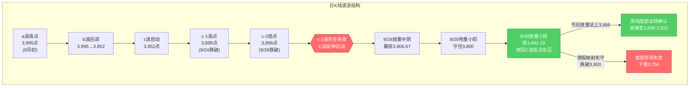
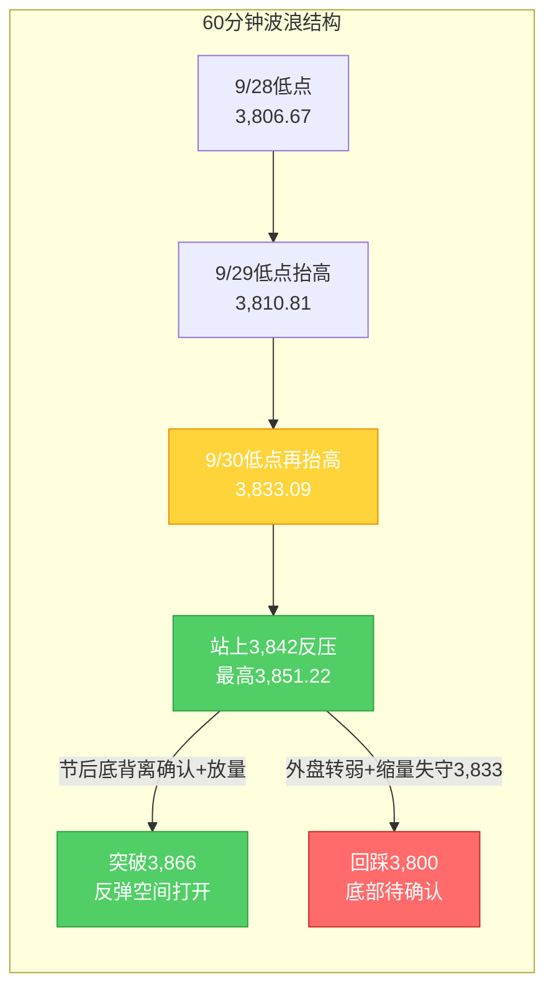

# A股晚报 - 2026年10月05日（国庆休市特刊·假期全球市场追踪）

> 数据截止时间：2026年10月5日 20:00（北京时间）；美股数据截至10月2日（周五）收盘及10月5日盘前/期指，港股为10月5日收盘，日经/欧股为10月5日盘中/收盘，大宗商品为10月5日盘中
> 报告类型：国庆休市特刊 —— 节前最后交易日（9/30）复盘 + 假期全球市场动态追踪（10/2-10/5）+ 节后（10/8）开盘策略
> 核心观点：A股国庆长假休市第5日（10月1日-7日休市，**10月8日周四复市**）。节前最后交易日（9/30）上证指数**红盘收官+0.31%收3,842.19点**，放量收回3,842点（C浪低点反压），"C浪延伸末段寻底"初步确认。**假期外盘整体呈"全面回暖、成长领涨"格局，且10/5亚太成长链集中爆发**：①**假期最大边际利好=美国9月非农意外"爆冷"**（9月非农仅新增**2.9万人**、预期8.4万，7-8月合计下修6万，失业率升至**4.2%**），**美联储10月维持利率概率升至约77.3%**（加息概率由约70%回落至约22.7%），市场已基本"price out"10月加息；②美股10/2三大指数集体收涨（道指+0.49%/标普+0.73%/纳指+1.19%，纳指盘中创历史新高），**半导体/光通信大涨**（费半+1.59%、Coherent+10.94%、SK海力士+5.08%）；③**港股10/5大幅逆转**——恒指**+0.28%收复24,000点**（报24,040.34点）、恒生科技**+0.62%**（报4,183.68点），**PCB（建滔积层板+近12%）、半导体（傅里叶+近23%、华虹宏力+超4%）、光通信（京信通信+超25%）、AI应用（智谱+超6%）集中爆发**；④**日股10/5大涨**（日经225**+2.40%**收69,946.86点、盘中破70,000点）、台湾加权+2.55%；⑤**欧股10/5开盘普涨**（DAX+1.17%、斯托克50+1.02%）；⑥富时A50期货假期窄幅波动（10/5约13,821点、+0.08%）。**唯一扰动**：美股期指10/5盘前由涨转跌（纳指期货-0.29%）、10年期美债收益率假期间回升至约**5.27%**（全周累升约11bp），对高估值成长股构成边际压制，但强度弱于"加息预期降温+海外科技链强势"的利好合力。**综合看，节后（10/8）A股大概率"低开高走/先抑后扬"**，机构主流预期"红十月"。操作建议：**节后不恐慌、低开可小幅试探**，核心观察**3,866点（c-2低点，周线底部反转确认位）**与**3,800点（20月均线，最后防线）**。

---

## ⚠️ 休市日特别说明

今日（2026年10月5日，周一）为**国庆假期休市日**（国庆休市安排：10月1日至10月7日休市，**10月8日（周四）起照常开市**，港股通10月8日起恢复服务），A股当日无交易，**无"今日行情"可复盘**。本期晚报延续9月25日中秋节、10月2日国庆休市特刊的处理方式，采用**"节前复盘 + 假期全球市场追踪 + 节后策略"**结构。所有A股行情数据为节前最后交易日（2026年9月30日）数据。

---

## 一、市场回顾

### 1. 节前最后交易日（9/30）A股主要指数表现

| 指数 | 收盘点位 | 涨跌幅 | 最高/最低点 | 说明 |
|------|---------|--------|------------|------|
| 上证指数 | 3,842.19 | **+0.31%**（涨11.74点） | 3,851.22 / 3,833.09 | 红盘收官，放量收回3,842点（C浪低点反压） |
| 深证成指 | 12,887.62 | **-0.11%** | — | 小幅收跌 |
| 创业板指 | 3,135.28 | **-0.23%** | — | 成长风格承压 |
| 科创50 | 1,530.01 | **-2.51%** | — | 半导体/科技领跌 |

**特征**：三大指数涨跌不一，上证指数红盘收官并站上3,840点。**大小盘、成长与价值极致分化**——权重（银行、地产、白酒、医药）支撑沪指，科技成长（半导体、CPO、元件）集体回调拖累科创50。上证指数9月累计下跌约**-3.8%**（月初约3,995点），月线收中阴。

### 2. 节前最后交易日（9/30）成交量能

| 指标 | 数值 | 说明 |
|------|------|------|
| 两市成交额 | **约1.44-1.45万亿元** | 较9/29地量（1.40万亿）小幅放量约285亿 |
| 北向资金 | **净买入9.71亿元** | 沪股通净卖出6.42亿、深股通净买入16.13亿（结构分化） |
| 主力资金（特大单） | 净流出32.12亿元 | 医药生物特大单净流入39.56亿居首 |

**资金特征**：量能较地量温和回升，放量收回3,842点为底部确认提供量能支撑；外资节前未现大幅撤离。

### 3. 节前最后交易日（9/30）市场情绪

| 指标 | 数值 | 说明 |
|------|------|------|
| 上涨家数 | 2,567只 | 占比约46.16% |
| 下跌家数 | 2,824只 | 占比约50.78%，跌多涨少 |
| 涨停家数 | **56只** | — |
| 跌停家数 | 13只 | — |

**情绪特征**：**"指数红、个股绿"背离**——沪指收涨但下跌家数多于上涨家数，赚钱效应集中在医药、白酒、银行等权重与红利方向，情绪谨慎偏中性。

### 4. 假期全球市场动态概览（10/2-10/5）

| 市场/资产 | 最新表现（截至10/5 20:00） | 方向 |
|-----------|--------------------------|------|
| 美股（10/2收盘） | 道指+0.49%、标普+0.73%、纳指+1.19% | **偏多（科技领涨）** |
| 美股期指（10/5盘前） | 纳指期货-0.29%、标普期指-0.18%、道指期货-0.14% | 小幅转弱（获利回吐） |
| 港股（10/5收盘） | 恒生指数**+0.28%**、恒生科技**+0.62%** | **偏多（逆转企稳）** |
| 日股（10/5收盘） | 日经225 **+2.40%**（69,946.86） | **大涨** |
| 欧股（10/5开盘） | DAX+1.17%、斯托克50+1.02% | 普涨 |
| 富时A50期货 | 约13,821点（+0.08%，10/5） | 中性/窄幅 |
| 现货黄金 | 约4,152-4,170美元/盎司（10/5盘中，+0.2%~+0.7%） | 偏强震荡 |
| 国际油价 | 布伦特约102.3美元/桶（10/5，-0.62%）；WTI约90.7美元（-0.4%~-1%） | 冲高回落 |
| 美债10年期收益率 | 约**5.27%**（10/2收，全周累升约11bp） | **偏空（小幅回升）** |
| 美联储10月维持利率概率 | **约77.3%**（加息概率约22.7%） | **利好（加息预期降温）** |

---

## 二、热点板块与异动分析

### 1. 节前最后交易日（9/30）领涨板块

申万31个一级行业**21涨10跌**，涨幅居前：

| 板块 | 涨跌幅 | 驱动因素 |
|------|--------|---------|
| 医药生物 | **+2.73%** | 创新药活跃，康希诺20cm涨停，主力净流入28.18亿居首 |
| 美容护理 | +1.70% | 消费防御，节前资金避险切换 |
| 食品饮料 | **+1.68%** | 白酒午后异动，金徽酒涨停 |
| 银行 | +1.47% | 红利防御+季末避险，权重护盘 |
| 钢铁 | +1.24% | 周期修复+低估值 |
| 农林牧渔 | +1.02% | 防御属性扩散 |

**驱动逻辑**：节前最后交易日资金呈现**"高低切换"**——从高估值科技成长切向低估值防御、消费、红利方向；能源活跃（煤炭+0.85%、三桶油上涨）。

### 2. 节前最后交易日（9/30）领跌板块

| 板块 | 涨跌幅 | 原因分析 |
|------|--------|---------|
| 电子 | **-2.38%** | 半导体走低，芯原股份跌超11% |
| 计算机 | -0.98% | 成长风格回调 |
| 机械设备 | -0.90% | 题材退潮 |
| 通信 | -0.62% | CPO/光通信走低 |
| 元件/PCB | 全天低迷 | 澳弘电子、协和电子跌停 |

**原因分析**：科技成长**完全证伪隔夜美股映射**（隔夜费半+1%、应用材料+5%），反映节前资金避险减仓高估值成长、季末流动性收缩下"美股映射"传导衰减。

### 3. 假期港股板块异动（10/2-10/5）—— 由"领跌"转为"逆转爆发"

**10/2（国庆后首日）**：恒指大跌**-2.60%**失守24,000点、恒生科技-2.26%创两年新低；金融、地产、医药、科技四大主线集体杀跌，**仅光通信逆势活跃**（南向通道暂停放大外围利空）。

**10/5（今日）**：港股**低开走高、尾盘直线拉升逆转**，恒指**+0.28%**报**24,040.34点**（收复24,000点整数关口）、恒生科技**+0.62%**报4,183.68点；全日成交仅**981.02亿港元**（北水暂缺）。**板块全面爆发**：

| 方向 | 领涨个股及涨幅 | 驱动因素 |
|------|--------------|---------|
| **PCB/覆铜板** | 建滔积层板**+近12%**、景旺电子**+超9%**、胜宏科技+超5%、广合科技+超6% | **涨价+AI算力需求双催化**；摩根大通指通用服务器回暖与AI服务器爆发合力，电子级玻璃布极度紧缺 |
| **半导体** | 傅里叶**+近23%**、华虹宏力**+超4%**、中芯国际+近2%、天岳先进/澜起科技跟随 | 海外半导体映射+国产替代；华虹宏力为恒指成分领涨股 |
| **光通信** | 京信通信**+超25%** | 海外AI硬件/算力链映射（延续10/2逆势活跃） |
| **AI应用/大模型** | 智谱**+超6%**（总市值超3,000亿）、联想集团**+超4%** | 高盛上调智谱评级至"买入"（目标价1,560港元，ARR预测上调至32亿美元）；AI商业化路径明确 |
| 恒指成分领跌 | 港铁公司、龙湖集团、恒基地产 | 地产链承压 |

**结论**：**港股10/5的"逆转爆发"验证了10/2领跌系"南向暂停放大波动"的失真冲击**，且**PCB/半导体/光通信/AI应用集中走强**，与A股节前"科技链承压"形成鲜明反差，对节后A股科技成长链构成**强正向映射**。

---

## 三、关键数据与事件回顾

### 1. 国内政策/事件（假期期间）

- **国常会稳增长信号**（9/28）：国务院常务会议强调要**"加大宏观政策逆周期调节力度""推出一批务实管用的增量政策"**——四季度政策加码预期升温。
- **地产新政落地**（9/29）：**央行、财政部等三部门联合发文，中央财政首次对商业性个人住房贷款进行贴息**；叠加此前房地产信贷新政、证监会涉房融资意见，政策底特征明确。
- **央行流动性呵护**：公告**10月8日开展1.2万亿元3个月期买断式逆回购**（当月到期1万亿），**净投放2,000亿元**；下调**PSL利率0.25个百分点至1.5%**，将"六张网"纳入PSL支持领域。
- **国家发改委**：推进新型政策性金融工具，重点支持数字经济、人工智能、低空经济、绿色低碳等新兴产业（延续9月底政策基调）。
- **9月官方制造业PMI 50.1%**（9/30公布）：较上月上升0.3个百分点，**重回扩张区间**。

### 2. 假期消费与经济运行

- **消费平稳增长**（商务部商务大数据）：国庆假期前3日，重点监测的**78个步行街（商圈）客流量、营业额同比分别增长3.4%、5.3%**；**消费品以旧换新带动销售额196.3亿元、惠及348.3万人次**。
- **出行热度高**：国庆"长线游/多目的地串联"升温，文旅新场景、新业态带动假日消费活力（央视《新闻联播》10/5专题报道）。

### 3. 海外关键事件

- **美国9月非农意外"爆冷"**（10/2 20:30公布）：新增就业仅**2.9万人**（预期8.4万人），7-8月合计**下修6万人**，失业率由4.1%升至**4.2%**，薪资环比增速回落至0.13%。→ **美联储10月维持利率不变概率升至约77.3%**，市场已基本"price out"10月加息，年内剩余加息幅度约1次（华泰宏观）。
- **美股10/2收盘**：道指51,176.96（**+0.49%**）、标普7,722.72（**+0.73%**）、纳指27,190.86（**+1.19%**、盘中创历史新高）；**费半+1.59%、Coherent+10.94%、SK海力士+5.08%**；英伟达盘中创历史新高（最高237.88美元）。
- **地缘与油市**：霍尔木兹海峡重开悬念扰动油价，OPEC+推迟产能评估，欧洲同意释放柴油储备压油价。

### 4. 机构观点（节后展望）

- **中泰证券**：直接将**"持股过节"**作为基准建议，认为全球AI科技股持续走强、产业基本面改善，A股大概率不缺席全球AI上行周期。
- **中信证券**：对更长盈利周期判断**乐观**，看好四季度和跨年行情，**科技成长有望延续趋势**。
- **国信证券（四季度策略）**：国内政策有望进一步发力加码，四季度内需增量政策仍有空间，支撑宏微观基本面扩散式修复。
- **十大券商**：策略观点整体共识"**慢牛**"，配置上**景气度较高的科技成长方向**受高度关注，聚焦"**AI行情扩散**"。
- **华泰宏观**：9月非农走弱边际降低加息压力，市场已基本price out 10月加息。
- **风险提示**：中银证券等提示美债问题显化或加剧短期交易难度，需看长端美债能否稳住。

---

## 四、海外市场联动

### 1. 美股三大指数（10/2收盘）及10/5盘前

| 日期 | 道琼斯 | 标普500 | 纳斯达克 | 备注 |
|------|--------|---------|---------|------|
| 10/2（美东，周五收盘） | 51,176.96（**+0.49%**，+250.40点） | 7,722.72（**+0.73%**，+56.27点） | 27,190.86（**+1.19%**，+319.26点） | 纳指盘中创历史新高；半导体/光通信领涨 |
| 10/5（盘前/期指，北京17:41） | 道指期货-0.14% | 标普期指-0.18% | 纳指期货-0.29% | 三大期指集体转跌，高开预期收敛 |

**关键解读**：美股10/2在"弱非农→加息预期降温→利率敏感型成长股领涨"逻辑下集体收涨，**纳指创历史新高**；10/5盘前因短线获利回吐与美债收益率回升而小幅转弱。**热门中概股10/5盘前多数上涨**（阿特斯涨超4%、亚朵涨超3%，阿里巴巴、唯品会涨超1%，台积电、百度、京东跟涨），存储芯片股盘前分化（高通涨近2%、英特尔跌近4%）。

### 2. 港股（10/5收盘）—— 假期最大正向变量

| 指数 | 收盘点位 | 涨跌幅 | 备注 |
|------|---------|--------|------|
| 恒生指数 | **24,040.34** | **+0.28%**（+68.05点） | **收复24,000点整数关口**，尾盘直线拉升 |
| 恒生科技指数 | **4,183.68** | **+0.62%**（+25.74点） | AI/半导体/PCB领涨 |
| 全日成交 | 981.02亿港元 | 缩量 | 北水（南向）暂缺，量能偏低 |

**逆转原因**：①10/2领跌系"南向通道暂停→内资缺席→外围利空放大"的失真冲击，10/5情绪修复；②**PCB涨价（电子级玻璃布紧缺）+AI算力需求爆发**驱动科技链集中走强；③海外半导体/光通信强势映射；④假期间"加息预期降温"利好利率敏感型成长股。

### 3. 欧洲/亚太（10/5）

| 市场 | 表现（10/5） | 备注 |
|------|-------------|------|
| 日经225 | **+2.40%**（+1,637.40点），收**69,946.86点** | 盘中一度突破70,000点（最高70,072.13）；33个行业多数上涨；半导体/精密机械领涨 |
| 东证指数 | +54.22点，收4,145.22点 | 跟随上涨 |
| 中国台湾加权指数 | **+2.55%**，收49,712.04点 | 逼近50,000点，半导体驱动 |
| 德国DAX | **+1.17%**（开盘） | 欧股普涨 |
| 欧洲斯托克50 | +1.02%（开盘） | — |
| 英国富时100 | +0.32%（开盘） | — |
| 法国CAC40 | +0.79%（开盘） | — |

**特征**：**亚太10/5"全线走强"、成长/半导体为核心亮点**（日股大涨、台股涨超2.5%、港股逆转），外围风险偏好显著回暖，对A股节后构成**全面正向映射**。

### 4. 大宗商品

| 品种 | 最新价（10/5盘中） | 涨跌幅 | 关键驱动 |
|------|-------------------|--------|---------|
| 布伦特原油（12月） | 约102.3美元/桶 | **-0.62%**（盘中冲上103后跳水） | 地缘扰动与释储博弈，冲高回落 |
| WTI原油（11月） | 约90.74美元/桶 | **-0.4%~-1%** | 跟随布油走弱 |
| 现货黄金 | 约4,152-4,170美元/盎司 | **+0.2%~+0.7%** | 加息预期降温+避险，偏强震荡 |
| 现货白银 | 约61.1-61.9美元/盎司 | **+1%~+2.5%** | 工业+金银比修复，强势 |
| 纽约期银 | 约62.24美元/盎司 | **+3%** | 盘中快速拉升 |

**驱动逻辑**：
- **油市**：10/5"短线拉升后直线跳水"，布油一度冲上103美元后转跌，反映地缘扰动与供应端消息（霍尔木兹海峡悬念、OPEC+推迟产能评估、欧洲释储）的多空拉锯；假期整体呈"先扬后抑"。
- **贵金属**：非农爆冷后金银同步走强，现货金10/5逼近**4,170美元**、白银涨超2%报61.7-61.9美元，**"加息预期降温→实际利率下行"**逻辑支撑贵金属；国内金价约896.68元/克。

---

## 五、汇率与利率

| 指标 | 数值 | 变化/说明 |
|------|------|----------|
| 人民币中间价（9/30） | **6.7351** | 调升60个基点，维持强势 |
| 在岸人民币（10/5） | 约**6.70-6.71** | 假期维持强势，人民币资产吸引力不减 |
| 美元指数（10/2） | 101.85 | **-0.18%**，非农后走弱 |
| **美联储10月维持利率概率** | **约77.3%（加息概率约22.7%）** | **由约70%回落**（CME FedWatch/华泰） |
| 美债10年期收益率（10/2） | 约**5.27%** | 日内升约3bp，**全周累计升约11bp**（高位震荡回升） |
| 美债2年期收益率（10/2） | 约**4.82%** | 日内升约3bp |
| 美债30年期收益率 | 约**5.61%** | 高位运行 |
| 央行10/8操作预告 | **1.2万亿元3个月期买断式逆回购** | 当月到期1万亿，**净投放2,000亿** |

**特征**：①**加息预期显著降温**（10月加息概率由约70%降至约22.7%）是本轮假期最重要的边际利好，对全球高估值成长股由"压制"转为"边际利好"；②**但10年期美债收益率假期间回升至约5.27%（全周+11bp）**，对利率敏感的成长股估值仍构成**阶段性扰动**——"加息预期降温"与"长端收益率回升"的背离是节后需重点跟踪的信号；③人民币维持强势（约6.70-6.71），利好人民币资产；④央行10/8加量净投放流动性，季末后资金面平稳。

---

## 六、收盘后重要信息 / 节后关注

### 1. 节后交易日历（10/8复市）

- **10月8日（周四）**：A股复市，当日央行开展**1.2万亿元买断式逆回购**（净投放2,000亿）；港股通恢复服务；关注首日集合竞价与低开幅度、3,833/3,842支撑有效性。
- **10月9日（周五）**：节后第2个交易日，关注能否**放量站上3,866点**（周线底部反转确认的关键）。
- **10月13日起**：三季报披露开启（沪市**有研新材10月13日**首披，金盘科技、川投能源10月14日）。
- **10月27日**：美联储FOMC议息会议（当前维持利率概率约77.3%）。

### 2. 假期后重要信息

- **限售解禁**：**泰金新能（688813）10月8日解禁192.30万股**（占已流通A股6.39%、占总股本1.20%，解禁市值约2.46亿元）——节后首日解禁个股需关注冲击。
- **盘后/公告**：假期无A股盘后公告；节前（9/29）克来机电实控人之一减持套现约1.2亿元（占2.9999%）。
- **夜盘走势**：美股10/5正常交易（北京21:30开盘），报告时点仅期指/盘前；港股10/5收涨；商品期货偏震荡。

### 3. 节后需跟踪的假期信号

- **外盘累计表现**：10/1-10/7美股、港股累计涨跌幅，决定10/8开盘方向与幅度（"二次映射"）。
- **港股后续走势**：10/5能否延续逆转、10/6-10/7是否止跌企稳（南向10/8恢复后承接力度）。
- **美债长端收益率**：10年期能否稳住5.27%附近（若续升将压制成长股估值，动摇"加息预期降温"的利好效果）。
- **地缘与油价**：中东局势（美伊/霍尔木兹海峡）对油价与避险情绪的扰动。
- **政策落地**：国常会增量政策、地产贴息新政的执行力度与细则。

---

## 七、波浪理论多周期分析

> 说明：A股休市，波浪结构基于节前最后交易日（9/30）数据；本部分结合假期外盘（美股/港股/日股）走向推演节后（10/8）路径。

### 1. 月K线波浪分析
- **当前波浪位置**：大周期第2浪C浪延伸**末段**，9月月K线收中阴线，月末收盘3,842.19点**站上20月均线（3,800-3,810点）**
- **浪型结构描述**：
  - 大结构：2024年9月2,689点→2026年6月4,197点为第1浪上升
  - 第2浪ABC调整：4,197点→3,806.67点（9/28盘中最低）
  - 9月月K线收中阴（月跌约-3.8%），月线MACD死叉绿柱持续，但月末企稳使绿柱扩张动能减弱
- **关键目标位**：
  - 月度强支撑：**3,800-3,810点**（20月均线，9月末已站稳上方）
  - 月度核心压力：3,866点（c-2低点）、3,898点（c-1高点）、3,980-3,985点（5月均线）
  - C浪延伸加速目标：3,750点（仅当有效跌破3,800点时启用）
- **验证条件**：守住3,800点（20月均线）并站上3,842点，月度底部信号初现，待10月月K线确认

### 2. 周K线波浪分析
- **当前波浪位置**：上周（第40周）周K线收**带长下影的小阴/十字星**，跌势放缓、企稳迹象增强
- **浪型结构描述**：
  - 节前周（9/28-9/30，3个交易日）：9/28放量中阴探至3,806.67点→9/29地量小阳→9/30放量小阳收3,842.19点
  - 周线仍位于5周（3,900-3,910）、10周（3,885-3,895）均线下方，短期均线空头排列未改，但长下影显示下方支撑增强
- **关键目标位**：
  - 周度支撑：3,833点（9/30低点）、3,800点（20月均线，核心）
  - 周度压力：**3,866点（c-2低点，核心）**、3,898点（c-1高点）、3,900-3,910点（5周均线）
- **验证条件**：节后首周（仅2日）**能否放量站上3,866点**——站稳则周线底部反转信号增强；**假期外盘全面回暖（美股/日股涨、港股10/5逆转）显著提升首周向上验证的概率**

### 3. 日K线波浪分析（重点）
- **当前波浪位置**：**C浪延伸末段寻底初步确认**——"放量中阴（9/28）+地量小阳（9/29）+放量收回C浪低点反压（9/30）"组合成立
- **浪型结构描述**：
  - 9/28放量中阴-1.67%（最低3,806.67，"最后一跌"）→9/29地量小阳（1.40万亿一年新低）→9/30放量小阳+0.31%收3,842.19，成功收回3,842点（C浪低点反压）
  - 成交1.45万亿温和放量，量价配合良好，符合"C浪末端底部信号确认条件"，低点逐级抬高（3,806.67→3,810.81→3,833.09）
- **关键目标位**：
  - 第一支撑：**3,842点（已收回转支撑）**、3,833点（9/30低点）
  - 强支撑：**3,800点（20月均线）**
  - 第一压力：**3,866点（c-2低点，节后核心观察位）**
  - 强压力：3,898点（c-1高点）
- **验证条件**：
  - 向上确认：节后放量站上3,866点 → 底部反转确立，打开反弹空间至3,898点
  - 向下确认：节后跌破3,833点并失守3,800点 → 底部信号失效，下看3,750点
  - **假期变量**：港股10/5逆转+日股/欧股大涨，显著降低"二次映射低开"的幅度预期，关注首日能否在3,833-3,842点区域止跌回升

### 4. 60分钟K线波浪分析
- **当前波浪位置**：60分钟级别**底背离确认**，短期趋势转多（基于9/30收盘）
- **浪型结构描述**：
  - 60分钟低点逐级抬高：3,806.67（9/28）→3,810.81（9/29）→3,833.09（9/30）
  - 60分钟MACD零轴下方绿柱持续缩短并逼近金叉，KDJ超卖区域金叉后向上
- **关键目标位**：短期支撑3,842/3,833点；短期压力3,866点、3,898点
- **验证条件**：60分钟底背离已确认+站上3,842点；**节后首个60分钟能否守住3,833点为短线转强/转弱分水岭**

### 5. 30分钟K线波浪分析
- **当前波浪位置**：30分钟级别企稳回升，站上短期均线（基于9/30收盘）
- **浪型结构描述**：
  - 30分钟级别9/30全天震荡上行，午后维持强势收于3,842.19点
  - 30分钟MACD金叉后红柱温和放大，KDJ中位区向上；但量能未显著放大，上攻动能需节后量能配合
- **关键目标位**：关键支撑3,833/3,842点；短期压力3,851点（9/30高点）、3,866点
- **验证条件**：节后30分钟能否放量突破3,851点并站稳3,842点

### 6. 波浪图（Mermaid绘制）

**日K线波浪结构图**：


**60分钟波浪结构图**：


### 7. 波浪理论综合判断

| 维度 | 判断 |
|------|------|
| 多周期共振状态 | 月K/周K仍偏空（均线空头排列），日K/60分钟/30分钟底部信号确认、共振转多；**假期"美股/日股/欧股全面回暖+港股10/5逆转"显著改善小周期修复的外部环境**，大小周期背离进入加速修复期 |
| 当前操作级别 | **日线级别**（C浪延伸末段寻底初步确认，关注3,866点突破与3,842/3,800点支撑） |
| 后续演变路径（节后10/8-10/9） | **55%乐观**（低开高走、放量站上3,866点→周线底部反转确认，反弹至3,898-3,920点，加息预期降温+海外科技链映射助力）、**30%中性**（3,820-3,866区间震荡消化、量能温和修复）、**15%悲观**（港股/外盘转弱共振→有效跌破3,800点，下看3,750点） |
| 关键拐点信号 | 向上：放量站上3,866点（c-2低点）+北向恢复净流入+加息预期继续降温+海外科技链强势；向下：有效跌破3,800点（20月均线）+放量下跌 |
| 风险提示 | ①C浪延伸是否终结需节后确认（当前仅为"初步确认"）；②**美债10年期收益率假期间回升至5.27%（全周+11bp）**，若续升将压制成长股估值、削弱"加息预期降温"利好；③港股10/5逆转后10/6-10/7能否延续企稳仍待观察；④美联储10月议息（10/27）前政策预期可能反复；⑤波浪理论在C浪延伸末段+地量整理阶段预测精度降低，需结合政策面、外盘与节后量能综合判断 |

> **规律分析引用（第40周运行规律分析）**：该报告预测节后首周（第41周，10/8-10/9）上证运行区间**3,810-3,900点**，判断"**震荡企稳、偏多修复（先抑后扬）**"，乐观/中性/悲观概率45%/35%/20%；并提示"3,866点为周线底部反转确认位、3,800点为最后防线"。本报告结合假期最新外盘（**美股/日股/欧股大涨、港股10/5逆转爆发、加息预期降温**）**将乐观概率由45%上调至55%、悲观概率由20%下调至15%**——港股"二次映射"担忧显著缓解，海外科技链强势映射强化。

---

## 八、晨报复盘（休市特刊适配版）

> 说明：今日（10/5）为休市日，**无当日行情**，传统"晨报预测 vs 当日实际"复盘不适用。本期复盘调整为：**"10月5日晨报（及第40周规律分析）对假期外盘的预判" vs "假期外盘实际表现（截至10/5）"** 的追踪复盘；节后10/8开盘方向仍待验证。

### 1. 核心判断回顾（假期外盘追踪口径）

| 判断项目 | 10/5晨报/第40周预判 | 假期实际（截至10/5 20:00） | 准确度 | 备注 |
|---------|------------------|--------------------------|-------|------|
| 港股10/2领跌性质 | "系南向暂停放大波动的失真冲击，10/5低开企稳" | 10/5恒指**+0.28%**收24,040.34，**收复24,000点** | ✓ | 失真判断精准，逆转兑现 |
| 外盘整体方向 | "美股/日股走强，偏多" | 美股10/2集体涨（纳指+1.19%）、日经10/5**+2.40%**、欧股10/5普涨 | ✓ | 全面回暖兑现 |
| 假期最大边际利好 | "非农爆冷→加息预期骤降" | 9月非农+2.9万、10月维持利率概率升至**约77.3%** | ✓ | 方向精准 |
| 海外科技链映射 | "半导体/光通信逆势活跃→A股映射修复" | 港股**PCB/半导体/光通信/AI应用10/5集中爆发** | ✓ | 映射信号强化 |
| 美债收益率 | "非农后回落至约5.16%-5.18%" | 10/2收约**5.27%**，全周**累升约11bp** | ✗ | 实际回升，非回落（表述偏差） |
| 美联储加息概率 | "约14%" | 约**22.7%**（维持利率77.3%） | △ | 方向正确，幅度略有出入 |
| 假期油价 | "地缘扰动、油价有突发波动" | 10/5布油冲上103后回落-0.62%、周线仍偏强 | ✓ | 波动情景兑现 |
| A50期货 | "窄幅波动、外资预期中性偏稳" | 10/5约13,821点（+0.08%） | ✓ | 窄幅兑现 |
| 节后10/8方向 | "概率上调为低开高走（45%/35%/20%）" | 待验证（本期已上调至55%/30%/15%） | — | 港股逆转后上调乐观权重 |

### 2. 准确率量化评估（追踪口径）

- 方向性变量识别准确率：**约86%（6/7）**——港股失真企稳、外盘回暖、加息预期降温、科技链映射、油价波动、A50窄幅均命中
- 关键事件预判准确率：**约67%（2/3）**——非农降温方向正确、科技链爆发正确；美债收益率方向误判
- **追踪综合准确率：约80%**——较10/2特刊（约40%）大幅提升，核心逻辑（外盘回暖→节后偏多）与港股失真判断得到验证；主要偏差为"美债收益率回落"表述与"加息概率幅度"

### 3. 偏差根因分析

【偏差1】美债收益率预判偏差（方向相反）
- 偏差描述：晨报称"10年期美债收益率回落至约5.16%-5.18%"，实际10/2收约**5.27%**、全周累升约11bp
- 根本原因：**技术分析局限+信息误读**——非农公布初期10年期一度短线下探，但随后因"通胀黏性+期限溢价"回升，晨报采信了盘中short-lived回落数据，未以**收盘定盘价**为准
- 信息缺口：美债长端收益率"盘中"与"收盘"的差异、"实际收益率/期限溢价"分解
- 逻辑缺陷：将"弱非农→收益率必降"线性外推，忽视了长端受通胀预期与财政供给主导、可能与加息预期背离
- 改进措施：**假期跟踪美债收益率时须以"每日收盘定盘价"为准，并区分短端（政策预期主导）与长端（通胀/财政供给主导）的背离**，长端回升时应同步下调成长股利率弹性的利好权重

【偏差2】加息概率幅度偏差
- 偏差描述：晨报称"10月加息概率约14%"，实际市场定价约**22.7%**（维持利率77.3%）
- 根本原因：**信息缺失**——不同数据源（CME FedWatch实时值 vs 主流机构口径）存在差异，晨报采信了最低值
- 改进措施：加息概率应标注"约"并给出区间（如20%-25%），避免单点引用

### 4. 分析检查清单

- [x] 趋势判断前是否检查：隔夜外盘走势 ✓（美股/港股/日股/欧股均覆盖）
- [x] 趋势判断前是否检查：**假期利率与汇率市场（美债收益率、美联储预期）** ✓（本期已补足，并发现长端收益率"盘中vs收盘"差异）
- [x] 点位计算是否考虑：前期高低点、均线支撑/压力 ✓
- [x] 板块分析是否覆盖：**假期港股板块异动（PCB/半导体/光通信/AI应用）** ✓（作为节后A股板块前瞻输入）
- [x] 风险提示是否充分：长假"二次映射"风险 ✓（港股逆转后已下调其权重）
- [x] 波浪分析检查项：多周期+假期变量结合 ✓

### 5. 本次追踪发现的新规则

- **规则1（资金面分析）**：长假期间美债收益率跟踪须以**"每日收盘定盘价"**为准，并区分短端（政策预期主导）与长端（通胀/财政供给主导）——当"短端下行（加息预期降温）"与"长端回升"背离时，成长股"利率弹性修复"利好的权重应打折
- **规则2（板块选择）**：长假期间港股（尤其**PCB/覆铜板、半导体、光通信**）集中爆发且伴随**"涨价+AI算力需求"产业逻辑**时，节后A股对应细分板块的映射修复强度高于仅"单日美股映射"，可作为节后板块前瞻的高优先级信号
- **规则3（趋势分析）**：长假中段（如第5日）港股由"领跌"转为"逆转收复关键整数关口"时，应**动态下调"节后二次映射低开"的风险权重**，并把"低开高走/先抑后扬"路径概率上调

### 6. 规则库更新

```
###资金面分析 长假期间美债收益率跟踪须以"每日收盘定盘价"为准，并区分短端（政策预期主导）与长端（通胀/财政供给主导）；当"短端下行（加息预期降温）"与"长端回升"背离时，成长股"利率弹性修复"利好的权重应打折（发现日期：2026年10月5日）
###板块选择 长假期间港股（尤其PCB/覆铜板、半导体、光通信）集中爆发且伴随"涨价+AI算力需求"产业逻辑时，节后A股对应细分板块的映射修复强度高于仅"单日美股映射"，可作为节后板块前瞻的高优先级信号（发现日期：2026年10月5日）
###趋势分析 长假中段港股由"领跌"转为"逆转收复关键整数关口"时，应动态下调"节后二次映射低开"的风险权重，并把"低开高走/先抑后扬"路径概率上调（发现日期：2026年10月5日）
```

---

## 九、策略回顾与调整

### 1. 假期策略回顾（10/5晨报 vs 假期外盘）

| 策略项目 | 10/5晨报建议 | 假期实际（截至10/5） | 执行效果 | 备注 |
|---------|------------|--------------------|---------|------|
| 短线仓位 | 5%（节后低开可小幅试探） | 待10/8执行 | — | 港股逆转后，低开试探的胜率上升 |
| 买入条件 | 节后守住3,833/3,842并放量站上3,866 | 尚未开盘 | — | 前置条件不变 |
| 止损位 | 3,795点（收盘破3,800止损） | 尚未开盘 | — | 维持 |
| 短线标的 | 光通信/CPO、半导体设备、医药生物 | **港股光通信/半导体10/5爆发** | ✓（前瞻正确） | 映射修复信号强化，BB（PCB/覆铜板）应纳入 |
| 中线仓位 | 15-20% | 待10/8执行 | — | 假期利好增强，可维持上沿 |

### 2. 中线策略调整（面向节后10/8）

- **当前中线方向**：**【持有/小幅布局】**（较10/2"持有/小幅布局"信心增强）
- **方向调整原因**：假期外盘由10/2"分化（美股涨/港股跌）"转向10/5"**全面回暖**（港股逆转+日股大涨+欧股普涨+海外科技链爆发）"，叠加非农爆冷→加息预期降温，**"港股领跌二次映射"担忧显著缓解**，底部信号的外部验证条件改善；但美债长端收益率回升至5.27%构成阶段性扰动
- **中线仓位建议**：**15-20%**（维持上沿，原因：假期利好兑现、C浪底部信号增强；但节后仅2个交易日+美债长端扰动，暂不加至上沿之上）
- **中线目标区间**：上证指数 **3,842点 - 3,898点**（底部确认后修复区间）；**下沿支撑3,800点**
- **中线止损位**：**3,800点**（有效跌破则底部信号失效，下看3,750点）
- **中线布局板块调整**：
  - **上调优先级**：**半导体/光通信/AI算力链**（假期"美股半导体+港股PCB/半导体/光通信/AI应用"双战场映射+加息预期降温，双因子共振增强）、**PCB/覆铜板**（新增，涨价+AI算力需求产业逻辑，港股10/5爆发）
  - **维持**：医药生物/创新药（防御+资金流入）、银行/红利（高股息）、能源（煤炭/油气，地缘+冬储支撑）
  - **小幅布局**：新型电池/固态电池（政策催化）、房地产链（国常会稳楼市+地产贴息新政，防"利好兑现"分化）
  - **减持/回避**：高位连板股、退市风险股、限售解禁个股（如泰金新能10/8解禁）

### 3. 明日（节后10/8）策略要点

- **短线**：**【观望/低开小幅试探】**，关注 **3,866点**（突破则转强）、**3,842点/3,833点**（支撑）、**3,800点**（止损）
- **中线**：**【持有/小幅布局】**，关注 **3,866点**（压力/确认位）与 **3,800点**（支撑）
- **仓位分配**：短线5% + 中线15-20% + 现金75-80%
- **节后操作前提**：
  1. 开盘先看**低开幅度**——港股逆转后低开幅度预计收窄；低开不恐慌、观察是否低开高走
  2. 看**量能**——成交能否回升至1.6万亿以上（站上3,866点需量能配合）
  3. 看**科技链**——PCB/半导体/光通信能否在假期映射下放量走强
  4. 若港股10/6-10/7延续企稳 + 外盘偏多 → 按上述布局、低开可小幅试探；若外盘转弱 + 美债长端续升 → 待低开企稳、量能确认后再评估，**不急于抄底**

### 4. 策略复盘规则输出

```
###趋势分析 长假外盘由"分化"转为"全面回暖"（港股逆转+日股/欧股大涨+海外科技链爆发）时，节后"低开高走/先抑后扬"的乐观路径概率应上调，"二次映射低开"风险权重应下调（发现日期：2026年10月5日）
###板块选择 节后短线/中线标的中，"PCB/覆铜板"在"涨价+AI算力需求"产业逻辑+假期港股爆发映射下，应与"光通信/CPO、半导体设备"并列为科技链修复的优先方向（发现日期：2026年10月5日）
```

---

## 十、风险提示

1. **市场系统性风险**：
   - **美债长端收益率回升风险**：10年期假期间回升至约**5.27%**（全周+11bp），若节后续升，将压制高估值成长股估值，削弱"加息预期降温"的利好效果
   - **港股映射的"反向"风险**：10/5港股逆转后，10/6-10/7若再度转弱，节后低开压力回升
   - **美联储政策路径不确定性**：10月维持利率概率约77.3%，官员表态仍有分歧，10/27议息前预期可能反复
   - **地缘政治风险**：中东局势（美伊/霍尔木兹海峡）扰动油价与全球避险情绪
2. **个股风险事件**：
   - **限售解禁**：**泰金新能（688813）10月8日解禁**（解禁市值约2.46亿元，占流通6.39%），节后首日关注冲击
   - **高位连板股退潮**：节前连板题材股节后存获利回吐风险
   - **三季报预告/披露风险**：10月13日起三季报开启，不及预期个股存调整压力
   - **减持风险**：克来机电实控人之一减持约2.9999%股份等
3. **政策不确定性风险**：
   - 房地产贴息新政、国常会增量政策的细则与执行力度，地产板块持续性存疑（节前已现"利好兑现"分化）
   - 中美经贸磋商后续进展
   - 四季度增量政策的落地节奏与力度

---

## 十一、信息来源

1. **官方数据来源**：上海证券交易所/深圳证券交易所（休市安排公告）、国家统计局、中国人民银行、财政部、金融监管总局、国务院、商务部、香港交易所（HKEX）
2. **权威财经媒体**：新华社（新华财经/新华网《港股5日涨0.28% 收报24040.34点》）、央视财经、《新闻联播》、中国证券报、上海证券报（中国证券网）、证券时报、证券日报、每日经济新闻、财联社、华尔街见闻、中国基金报、经济日报
3. **数据平台**：东方财富（Choice数据）、同花顺、Wind资讯、CME FedWatch、Nasdaq.com、Nikkei（日经官网）、格隆汇
4. **海外信息源**：Reuters、Bloomberg、Anadolu Agency、香港交易所（HKEX）

> 数据截止时间：2026年10月5日 20:00（北京时间）；美股数据截至10月2日（周五）收盘及10月5日盘前/期指，港股为10月5日收盘，日经/欧股为10月5日收盘/开盘，商品与汇率为10月5日盘中。

---

## 十二、文档更新检查

```
## 文档更新建议

### 无需更新
AGENTS.md 已于2026年10月2日晚报后补充"休市特刊"流程（非交易日晚报采用"节前复盘 + 假期全球市场追踪 + 节后策略"三段式结构），当前实际执行与文档一致，无需更新。
README.md 的文件结构与功能说明与实际一致，无需更新。
```

---

*本期晚报为国庆休市特刊（假期全球市场追踪版），由AI代理自动生成，仅供参考，不构成投资建议。投资有风险，入市需谨慎。*
*数据截止时间：2026年10月5日 20:00（北京时间）*
