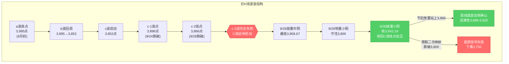
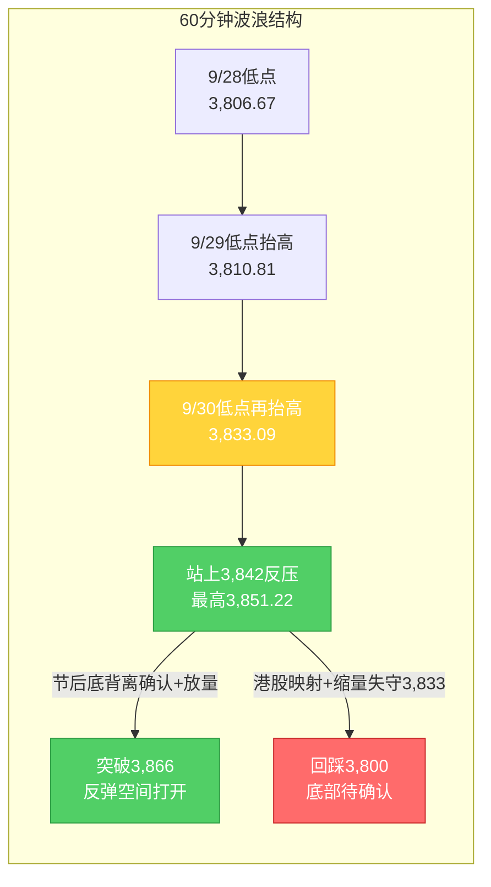

# A股晨报 - 2026年10月05日（国庆休市特刊·假期全球市场追踪）

> 数据截止时间：2026年10月5日 08:45（北京时间）；美股/欧股数据截至10月2日（周五）收盘，港股为10月5日开盘/10月2日收盘，日股为10月5日盘中，大宗为10月2日收盘及10月5日盘中
> 报告类型：国庆休市特刊 —— 上一交易日（9/30）晚报复盘 + 假期全球市场追踪（10/2-10/5）+ 节后（10/8）开盘策略
> 核心观点：A股国庆长假休市第5日（10月1日-10月7日休市，**10月8日周四复市**）。上一交易日（9/30）上证指数红盘收官**+0.31%收3,842.19点**，放量收回3,842点（C浪低点反压），"C浪延伸末段寻底"初步确认。假期外盘呈**"利好为主、港股失真扰动"的分化格局**：①**假期最大边际利好=美国9月非农意外"爆冷"**——9月非农仅新增**2.9万人**（预期8.4万，前值修正后更低）、失业率升至**4.2%**，**美联储10月加息预期由约70%骤降至约14%**（维持利率概率升至约86%），10年期美债收益率回落近6bp至约5.16%-5.18%，美股10/2三大指数集体收涨（道指+0.49%/标普+0.73%/纳指+1.19%，纳指盘中创历史新高，英伟达盘中破纪录）、**半导体与光通信逆势大涨**（费半+1.59%、Coherent+10.94%、SK海力士+5.08%）；②欧股10/2集体收涨（DAX+1.21%）；③**亚太10/5日股大涨**（日经225盘中涨近2%、半导体领涨）、韩国休市；④**港股10/2领跌-2.60%**（恒指失守24,000点、恒生科技创两年新低）为假期最大利空，但系**南向通道暂停放大外围利空的失真效应**，10/5港股低开企稳（恒指开盘-0.04%、恒生科技-0.47%）。富时A50期货假期整体窄幅波动（10/5报13,830点、+0.14%）。国内政策面延续温和（央行下半年工作会议重申"适度宽松"、PSL利率降0.25个百分点、地产信贷新政落地、央行10/8净投放2,000亿），国庆消费平稳增长（商务部：前3日重点商圈客流/营业额同比+3.4%/+5.3%）。**综合看，节后（10/8）A股大概率"低开高走/先抑后扬"**——港股二次映射或致低开，但"加息预期骤降+美债收益率回落+海外科技链强势"构成成长股边际利好，机构主流预期"红十月"。操作建议：**节后不恐慌、低开可小幅试探**，核心观察**3,866点（c-2低点，周线底部反转确认位）**与**3,800点（20月均线，最后防线）**。

---

## ⚠️ 休市日特别说明

今日（2026年10月5日，周一）为**国庆假期休市日**（国庆休市安排：10月1日至10月7日休市，**10月8日（周四）起照常开市**，港股通10月8日起恢复服务），A股当日无交易，**无"今日行情"可复盘**。本晨报延续9月25日中秋节、10月2日国庆休市特刊的处理方式，采用**"上一交易日复盘 + 假期全球市场追踪 + 节后策略"**结构。所有A股行情数据为节前最后交易日（2026年9月30日）数据。

---

## 一、上一交易日（9/30）晚报复盘要点回顾

### 1. 9/30 核心判断回顾（节前最后交易日）

| 判断项目 | 9/30晨报预测 | 9/30实际结果 | 准确度 | 备注 |
|---------|------------|-------------|-------|------|
| 上证指数趋势 | 震荡（略偏多） | **+0.31%**收3,842.19 | ✓ | 方向精准，企稳微涨兑现 |
| 上证指数区间 | 3,815-3,868点 | 3,833.09-3,851.22点 | ✓ | 完全落在预测区间内 |
| 强支撑位 | 3,800点（20月均线） | 最低3,833.09点（未触及） | ✓ | 支撑稳固，强于预期 |
| 强压力位 | 3,866点（c-2低点） | 最高3,851.22点（未触及） | ✓ | 压力有效 |
| 北向资金 | 净流入0-30亿元 | **净买入9.71亿元** | ✓ | 方向与幅度均命中 |
| 成交量 | 平量/小幅缩量1.35-1.45万亿 | **1.45万亿** | ✓ | 上沿命中，量能温和回升 |

**节前最后交易日（9/30）实际市况**：上证指数收3,842.19点（+0.31%），深证成指12,887.62（-0.11%），创业板指3,135.28（-0.23%），科创50 1,530.01（-2.51%）；两市成交约1.45万亿元；北向资金净买入9.71亿元。**"指数红、个股绿"背离**——医药生物+2.73%、食品饮料+1.68%、银行+1.47%等防御/红利占优，电子-2.38%、计算机-0.98%等科技成长承压（节前"高低切换"）。

### 2. 准确率量化评估（9/30复盘口径）

- 趋势判断准确率：**100%（1/1）**
- 点位预测准确率：**100%（4/4）**（区间、强支撑、强压力、弱压力反压全部命中）
- 板块预判准确率：**约17%（1/6）**（仅新型电池/固态电池命中，科技链与能源链误判）
- **综合准确率：约72%**——趋势与点位表现优异，**板块预判仍是最大短板**

### 3. 假期追踪复盘（9/30研判 vs 假期外盘 10/2-10/5）

> 说明：假期无当日晨报，复盘以"节前对节后/假期外盘的预判 vs 假期实际"为口径（参考10月2日晚报与10月4日第40周规律分析）。

| 判断项目 | 节前预判 | 假期实际（截至10/5 08:45） | 准确度 | 备注 |
|---------|---------|--------------------------|-------|------|
| 假期关键变量 | "节后方向取决于外盘累计表现，存二次映射风险" | 美股涨（偏多）、港股10/2领跌（偏空）、日股大涨（偏多） | ✓ | "二次映射"确为关键，呈分化 |
| 美联储加息预期 | "加息预期变化压制风险资产" | **非农爆冷→10月加息概率由约70%骤降至约14%** | ✗ | 超预期利好（降温），未充分预判 |
| 美债收益率 | "10年期维持5.2%上方压制成长股" | 冲高回落、**跌至约5.16%-5.18%** | ✗（偏保守） | 高压制出现缓和，利好成长股 |
| 大宗/油价 | "油价延续回落" | 10/1大涨后10/2回落，周线布油+5.44% | ✗ | 中东扰动推动油价反弹 |
| 港股（假期映射） | 未单独预判 | 10/2 **-2.60%**失守24,000点；10/5低开企稳 | — | 应新增"港股假期走势"一级指标 |

**追踪结论**：核心逻辑（节后方向取决于外盘累计表现）正确；假期最大超预期变量为**"美国非农爆冷→加息预期骤降"**（利好成长股），与**"港股10/2领跌"**（利空）形成对冲，**10月4日规律分析已据此将节后首日路径上调为"低开高走/先抑后扬"**。

### 4. 沉淀的规则/检查项（供今日及节后应用）

- **趋势分析**：长假期间"美国非农爆冷→美联储加息预期骤降+美债收益率回落"构成节后A股成长股的边际利好，其权重应与"港股领跌二次映射"利空做**净影响对冲**；二者并存时，节后首日更可能"低开高走/先抑后扬"，**不宜单向看空**
- **趋势分析**：长假期间**港股走势为A股节后开盘方向的一级前瞻指标**，但需识别"南向通道暂停→内资缺席→波动放大"的**失真效应**，不宜将港股单日跌幅线性外推至A股
- **点位计算**：日线底部信号确认后需上移至**周线级别验证**——节后首周关键验证位为c-2低点（**3,866点**，突破=周线底部反转确认）与20月均线（**3,800点**，跌破=底部信号失效），两位置构成**节后首周多空分水岭**
- **板块选择**：假期"海外半导体/光通信逆势活跃（美股映射）"与"国内加息预期降温（利率弹性修复）"**双因子共振**时，节后A股半导体/光通信/AI算力链存在"双因子修复"机会，优先级阶段性高于防御/红利板块，但需以**节后放量站上3,866点**为前置条件
- **风险识别**：长假期间地缘政治（美伊/霍尔木兹海峡）→国际油价存在突发大幅波动风险（假期油价先涨后跌、霍尔木兹重开悬念扰动油市）

### 5. 对节后（10/8）分析的启示

- **利多**：加息预期骤降+美债收益率回落（成长股利率弹性修复）+海外科技链强势（映射）+政策底（央行宽松/地产新政/10/8净投放2,000亿）+节后资金回流+国庆消费平稳
- **利空**：港股10/2领跌的二次映射（开盘低开压力）+周/月大周期均线仍空头排列+节后首周仅2个交易日+地缘/油价扰动+三季报预告窗口临近
- **核心观察**：节后首日（10/8）**低开幅度**与**3,833/3,842支撑有效性**；首周能否**放量站上3,866点**（周线底部反转确认）

---

## 二、假期全球市场动态（10/2收盘后至今，10/2-10/5）

### 1. 美股市场（10月2日周五收盘）

| 指数 | 收盘点位 | 涨跌幅 | 备注 |
|------|---------|--------|------|
| 道琼斯指数 | 51,176.96 | **+0.49%**（+250.40点） | 集体收涨 |
| 标普500指数 | 7,722.72 | **+0.73%**（+56.27点） | — |
| 纳斯达克指数 | 27,190.86 | **+1.19%**（+319.26点） | 纳指盘中创历史新高（一度升至27,353.68点） |

**关键板块与个股异动**：
- **半导体/存储多数上涨**：费城半导体指数**+1.59%**，SK海力士+5.08%、安森美+4.18%、泰瑞达+3.71%、拉姆研究+3.53%、应用材料+3.50%、科天半导体+2.77%、美光科技+3.03%
- **光通信板块大涨**：Coherent **+10.94%**、Credo+7%
- **龙头个股**：英伟达盘中创历史新高（盘中最高**237.88美元**，收233.95美元、+1.34%，市值一度突破5.7万亿美元）；特斯拉+4.65%
- **存储链分化（警示）**：受东芝供应扰动，希捷科技**-10.21%**、西部数据**-10.22%**

> 注：美股上涨的核心驱动为**"弱非农→加息预期骤降→利率敏感型成长股（科技/半导体）领涨"**，与9/30"科技跌、防御涨"的A股结构形成反差，对A股节后科技链构成**正向映射**。

### 2. 欧洲市场（10月2日收盘）

| 市场 | 收盘点位 | 涨跌幅 | 备注 |
|------|---------|--------|------|
| 德国DAX30 | 25,231.20 | **+1.21%** | 领涨，受益加息预期降温 |
| 英国富时100 | 约10,500 | **+0.30%** | — |
| 法国CAC40 | 7,897 | **+0.79%** | — |
| 欧洲斯托克50 | — | **+1.04%** | 集体收涨 |

**特点**：欧洲市场与非农数据后全球风险偏好回暖同步，10/2集体收涨，外围情绪对A股偏多。

### 3. 亚太市场（10月5日盘中）

| 市场 | 最新表现（10/5早间） | 方向 |
|------|---------------------|------|
| 日经225 | 开盘+1.18%→盘中涨幅扩大至约**+1.97%**（约69,653点） | **大涨** |
| 韩国综合指数 | **休市**（法定假日） | — |
| 恒生指数 | **开盘-0.04%** | 低开企稳 |
| 恒生科技指数 | **开盘-0.47%** | 小幅低开 |
| 富时中国A50期货 | 10/5 08:45约**13,830点（+0.14%）** | 窄幅波动 |

**亚太特征**：
- **日股领涨**：半导体（爱德万测试、瑞萨电子+4%）、精密机械（软银集团、东京电子+3%）等权重领涨；日经225自10/1（+3.33%）、10/2（回调）、10/5（大涨）**3个交易日累计涨约4.3%**，为假期亚太最强市场
- **港股低开企稳**：10/2国庆后首日领跌-2.60%（恒指23,972.29点、失守24,000点，恒生科技创两年新低），10/5低开幅度显著收窄（恒指-0.04%），显示10/2领跌更多为"南向通道暂停放大外围利空"的**失真冲击**而非趋势性走弱
- **A50期货假期窄幅波动**：由10/1夜盘13,939点至10/5报13,830点，累计微幅回落，反映外资对A股节后方向预期中性偏稳

### 4. 大宗商品

| 品种 | 最新价（10/2收盘/10/5盘中） | 涨跌幅 | 关键驱动 |
|------|----------------------------|--------|---------|
| WTI原油（11月） | 约91.11美元/桶（10/2） | **-1.9%** | 10/1大涨后回落，周线约-1.28% |
| 布伦特原油（12月） | 约102.25-102.70美元/桶（10/2） | 约-0.06%（周线**+5.44%**） | 中东局势+释储博弈，周线上涨 |
| 现货黄金 | 约4,139.28美元/盎司（10/2），10/5盘中**涨破4,150美元** | **-0.9%**（周线约-3.4%） | 非农后一度冲高4,226.51美元后回落 |
| COMEX黄金（12月） | 约4,162-4,172美元/盎司（10/2） | **-0.72%** | 避险与加息预期降温博弈 |

**驱动逻辑**：
- **油市**：假期先扬后抑——10/1受中东局势扰动大涨、10/2回落；10/5消息面（**霍尔木兹海峡重开悬念**+OPEC+推迟产能评估+欧洲同意释放柴油储备压油价）**油价转跌**。地缘与供应扰动仍是油价最大变量
- **贵金属**：非农爆冷公布后金价一度直线拉升逾1%至4,226.51美元，但受美债收益率盘中回升影响**冲高回落**，周线收跌约3.4%，处于4,100-4,200美元高位震荡区间

### 5. 汇率与利率

| 指标 | 数值 | 变化/说明 |
|------|------|----------|
| 美元指数（10/2） | 101.85 | **-0.18%**，非农后走弱 |
| 美债10年期收益率 | 约**5.16%-5.18%** | 非农后**下跌近6bp**，高位回落 |
| 美债2年期收益率 | 约4.73% | **下跌6bp**，对政策最敏感端回落 |
| 美债30年期收益率 | 约5.57% | 下跌3bp |
| **美联储10月加息概率** | **约14%（维持利率概率约86%）** | **由约70%骤降**（CME FedWatch） |
| 美联储12月维持利率概率 | 约27.4% | 累计加息25bp概率约63.1% |

**特征**：**加息预期骤降+美债收益率回落**是本轮假期最重要的边际变化——对全球高估值成长股由"压制"转为"边际利好"，构成节后A股成长板块（半导体/光通信/AI算力链）的利率弹性修复动能。

### 6. 重要海外事件

- **美国9月非农意外"爆冷"**（10/2 20:30公布）：新增就业仅**2.9万人**（预期8.4万人），7-8月合计下修6万人，失业率由4.1%升至**4.2%**；市场不再完全定价年内一次完整加息
- **美联储副主席等官员表态**：假期前官员讲话放鸽与鹰派拉锯，非农数据后市场预期重心转向"维持利率"
- **地缘与油市**：霍尔木兹海峡重开悬念扰动油价，OPEC+推迟产能评估；欧洲同意释放柴油储备以压低油价

---

## 三、今日（及节后）关注事项

### 1. 重要数据发布

| 时间 | 数据名称 | 预期值/前值 | 影响 |
|------|---------|------------|------|
| 10/5 全天 | 美国9月ISM非制造业PMI等 | — | 影响加息预期与美元 |
| 10/8 09:30 | A股复市首日集合竞价 | — | 观察低开幅度与3,833/3,842支撑 |
| 10月中旬起 | 三季报业绩预告密集披露 | — | 高位成长股业绩验证风险 |

### 2. 政策/监管动态（假期期间）

- **央行下半年工作会议**：重申**继续实施适度宽松的货币政策**，综合运用逆回购、MLF、买卖国债等工具保持流动性充裕；**下调抵押补充贷款（PSL）利率0.25个百分点至1.5%**，将水网、新型电网、算力网、新一代通信网、城市地下管网、物流网等**"六张网"**纳入PSL支持领域
- **房地产信贷新政**：央行、金融监管总局联合印发《关于改革完善房地产信贷管理 推动加快构建房地产发展新模式的意见》，优化开发贷款与个人住房贷款两项核心制度
- **证监会**：发布《关于资本市场支持构建房地产发展新模式的意见》，作为资本市场涉房地产融资业务指引
- **流动性呵护**：央行公告**10月8日开展1.2万亿元3个月期买断式逆回购**（当月到期1万亿），**净投放2,000亿元**，呵护中长期流动性

### 3. 假期消费与经济运行

- **消费平稳增长**（商务部商务大数据）：国庆假期前3日，重点监测的**78个步行街（商圈）客流量、营业额同比分别增长3.4%、5.3%**；**消费品以旧换新带动销售额196.3亿元、惠及348.3万人次**
- **出行热度高**：国庆"转场游"升温，多目的地串联旅程带动住宿/餐饮/文旅回暖

### 4. 机构观点（节后展望）

- **主流券商普遍看好"红十月"**：光大证券（张宇生）——受节后资金回流影响，A股10月大概率回温；申万宏源——看好四季度和跨年行情，科技成长有望延续趋势；东吴证券——长假后市场多呈"涨多跌少"格局
- **关注AI主线扩散**：十大券商研判"迎接红十月、聚焦AI行情扩散"，科技仍是中期主线
- **风险提示**：中银证券等提示美债问题显化或加剧短期交易难度，需看长端美债能否稳住

---

## 四、板块与个股分析（结合昨日复盘与假期信息）

### 1. 基于昨日复盘结论的板块调整

| 板块 | 节前（9/30）表现 | 假期新信息 | 节后（10/8）预期 |
|------|----------------|-----------|----------------|
| 半导体/光通信/CPO | 电子-2.38%领跌 | **美股半导体+1.59%、Coherent+10.94%、SK海力士+5.08%**；加息预期骤降 | **"双因子修复"机会**（映射+利率弹性），前置条件：放量站上3,866点 |
| PCB/元件 | 全天低迷 | 美股AI硬件强势映射延续 | 修复弹性，随科技链共振 |
| 医药生物/创新药 | +2.73%居首 | 资金高低切换+防御属性延续 | 维持配置价值，防御+成长兼具 |
| 新型电池/固态电池 | 活跃（政策催化） | 假期无新增利空，政策主线延续 | 政策催化延续 |
| 房地产链 | 盘中大逆转（深物业A三连板） | **地产信贷新政+证监会涉房融资意见** | 政策主线，但防"利好兑现"分化 |
| 银行/红利 | +1.47% | 高股息防御+央行宽松 | 攻守兼备，降低弹性 |
| 能源（油气/煤炭） | 三桶油上涨、煤炭+0.85% | **油价先涨后跌、周线布油+5.44%** | 震荡分化，地缘支撑与油价回落博弈 |

### 2. 假期信息驱动的板块机会

- **受益板块**：
  - （1）**半导体/光通信/AI算力链**（逻辑：假期海外半导体/光通信逆势大涨的**映射修复** + 加息预期骤降的**利率弹性修复**，双因子共振）
  - （2）**医药生物/创新药**（逻辑：节前资金高低切换+防御属性+主力净流入居首）
  - （3）**新型电池/固态电池**（逻辑：政策催化延续）
  - （4）**房地产链**（逻辑：地产信贷新政+证监会涉房融资意见，政策底明确）
  - （5）**消费/文旅/大消费**（逻辑：国庆消费平稳增长、以旧换新放量）
- **受损/回避板块**：
  - （1）**高位连板股/题材股**（逻辑：节后题材退潮+获利回吐）
  - （2）**退市风险/ST个股**（逻辑：波动风险）
  - （3）**三季报预告可能不及预期的高位成长股**（逻辑：10月中旬起业绩披露窗口）

### 3. 重点关注方向

- **半导体/光通信/AI算力链**：假期美股映射修复（Coherent/应用材料/SK海力士）+利率弹性修复，节后若放量站上3,866点，修复弹性优先
- **医药生物/创新药**：节前主力大幅净流入+防御属性，攻守兼备
- **房地产链**：政策主线（信贷新政+涉房融资意见），择机而非追高
- **新型电池/固态电池**：政策+产业催化延续
- **回避**：高位连板股、退市风险股、限售解禁个股

---

## 五、今日核心判断（面向节后10/8，结构化输出）

> 说明：今日休市，本部分为**节后（10月8日）复市首日及首周（10/8-10/9）**的市场判断。

### 1. 趋势判断
- 上证指数：**【震荡偏多】**（先抑后扬/低开高走概率偏高）
- 预测区间：**3,810点 - 3,900点**（节后首周）
- 核心逻辑：假期"加息预期骤降+美债收益率回落+海外科技链强势"构成成长股边际利好，与"港股10/2领跌二次映射"利空对冲；叠加政策底（央行宽松/地产新政/10/8净投放2,000亿）与节后资金回流，**节后首日更可能"低开高走"**；但周/月大周期均线仍空头排列、节后首周仅2个交易日，反弹力度受量能约束。

### 2. 关键点位
- 强支撑位：**3,800点**（依据：20月均线，长期牛熊分界线，C浪延伸最后防线，节前已验证守住）
- 弱支撑位：**3,833点 / 3,842点**（依据：9/30盘中低点 / C浪低点反压，节前已放量收回转支撑，**首日低开后的第一承接位**）
- 强压力位：**3,898点**（依据：c-1高点，跌破后转强压力）
- 弱压力位：**3,866点**（依据：c-2低点，**节后首周核心观察位——放量站上=周线底部反转确认**）

### 3. 板块预判
- 看涨板块：
  - （1）**半导体/光通信/AI算力链**（逻辑：假期海外半导体/光通信大涨映射+加息预期降温的利率弹性修复，"双因子修复"）
  - （2）**医药生物/创新药**（逻辑：节前资金高低切换+防御属性+主力净流入居首）
  - （3）**新型电池/固态电池**（逻辑：政策催化延续）
  - （4）**房地产链**（逻辑：地产信贷新政+证监会涉房融资意见，政策主线）
- 看跌/谨慎板块：
  - （1）**高位连板股/题材股**（逻辑：节后题材退潮+获利回吐）
  - （2）**三季报预告可能不及预期的高位成长股**
- 风险板块：**退市风险/ST个股**（波动风险）、**限售解禁个股**（个股层面冲击）

### 4. 资金面判断
- 北向资金预期：**【恢复后小幅净流入】**约0-50亿元（逻辑：人民币资产强势+加息预期降温+节后资金回流；港股通10/8恢复，需观察外资承接力度）
- 成交量预期：**【温和放量修复】**约1.5-1.7万亿元（逻辑：节后资金回流、量能较节前地量1.45万亿修复；若持续低于1.4万亿则反弹力度受限）

### 5. 风险预警（按优先级排序）
- 高风险：
  - **港股二次映射低开风险**：10/2恒指领跌-2.60%，节后首日或承压低开；但需识别南向暂停的失真效应，**低开不恐慌、观察能否低开高走**
  - **3,800点（20月均线）有效性**：C浪延伸未确认结束，若有效跌破则底部信号失效、下看3,750点
- 中风险：
  - **美联储政策路径反复**：加息预期虽降温至约14%，但官员表态仍存分歧，10/27议息前预期可能反复
  - **地缘/油价扰动**：中东局势（美伊/霍尔木兹海峡）→油价与避险情绪突发波动
  - **节后首周交易日稀少**（仅2日）：单周涨跌幅参考权重应降低，以"缺口回补+量能修复"为主
- 低风险：
  - **三季报预告**：10月中旬起密集披露，高位成长股业绩验证风险
  - **限售解禁**：节后关注解禁个股冲击

### 6. 昨日复盘规则应用
- **应用规则1（趋势分析）**：非农爆冷→加息预期骤降构成成长股边际利好，与港股领跌利空对冲，节后首日"低开高走/先抑后扬"，**不单向看空**
- **应用规则2（点位计算/波浪）**：以**3,866点（突破=周线反转确认）**与**3,800点（跌破=信号失效）**作为节后首周多空分水岭
- **应用规则3（板块选择）**：海外科技链映射+国内加息预期降温"双因子共振"→半导体/光通信/AI算力链"双因子修复"优先，前置条件为放量站上3,866点
- **应用规则4（风险识别）**：地缘政治→油价突发波动风险，需纳入节后监控

---

## 六、投资策略建议（分短线+中线）

### 1. 短线策略（1-3个交易日，节后复市窗口）
- 适用场景：基于日K线和60分钟K线技术信号，节后首日以"观察低开+量能确认"为主
- 短线仓位：**5%**（较节前0-5%小幅提升，低开企稳可小幅试探，不追高）
- 买入条件（仅在满足以下条件时小幅试探）：
  - 节后首日低开后**守住3,833/3,842点**并向上回补缺口
  - **放量**（两市成交回升至1.6万亿以上）站上3,866点
  - 半导体/光通信板块在假期美股映射下放量走强
- 卖出条件：
  - 指数触及3,898点（c-1高点强压力）缩量滞涨
  - 科技板块高开冲高回落、量能萎缩
- 止损位：**3,795点**（收盘有效跌破3,800点即止损，等待3,750点附近再评估）
- 短线标的：
  - （1）**光通信/CPO**（逻辑：假期美股光通信大涨映射+利率弹性修复）
  - （2）**半导体设备/材料**（逻辑：费半+1.59%、应用材料+3.50%映射）
  - （3）**医药生物/创新药**（逻辑：节前主力净流入居首+防御属性）

### 2. 中线策略（1-4周）
- 适用场景：基于周K线波浪分析与第40周运行规律分析结论
- 中线仓位：**15-20%**（较节前10-15%小幅提升，但长假二次映射风险未消，控制加仓幅度）
- 方向判断：**【持有/小幅布局】**
- 目标区间：上证指数 **3,842点 - 3,898点**（周线底部反转确认后修复区间；**下沿支撑3,800点**）
- 中线布局板块：
  - （1）**半导体/光通信/AI算力链**（逻辑：海外映射+利率弹性"双因子修复"，以站上3,866点为前提）
  - （2）**医药生物/创新药**（逻辑：资金高低切换+防御+主力净流入）
  - （3）**新型电池/固态电池**（逻辑：政策+产业催化延续）
  - （4）**房地产链**（逻辑：地产信贷新政+涉房融资意见，注意"利好兑现"分化）
  - 维持：**银行/红利、能源（煤炭/油气）**（高股息+地缘/冬储支撑，攻守兼备）
- 止盈条件：指数放量站上3,898点并站稳3个交易日
- 止损条件：**指数收盘有效跌破3,800点**（底部信号失效，下看3,750点）

### 3. 仓位分配总览

| 策略类型 | 仓位比例 | 方向 | 重点板块 |
|---------|---------|------|---------|
| 短线 | 5% | 观望/低开小幅试探 | 光通信/半导体、医药生物 |
| 中线 | 15-20% | 持有/小幅布局 | 半导体/光通信、医药、新型电池、地产链 |
| 现金 | 75-80% | — | — |

### 4. 与节前策略对比
- 短线仓位调整：从0-5%**小幅提升至5%**（原因：加息预期降温+海外科技强势，节后低开企稳可小幅试探，但不追高）
- 中线仓位调整：从10-15%**提升至15-20%**（原因：假期边际利好（非农爆冷→加息预期骤降）增强，底部信号初步确认，但二次映射风险未消，控制加仓幅度）
- 板块调整：**半导体/光通信/AI算力链由"超跌修复观察"上调为"双因子修复优先"**（假期美股映射+利率弹性），**新增医药生物/创新药配置**（防御+资金流入），**地产链维持政策主线布局**

---

## 七、波浪理论多周期分析

> 说明：A股休市，波浪结构基于节前最后交易日（9/30）数据；本部分结合假期外盘（美股/港股/日股）走向推演节后（10/8）路径。

### 1. 月K线波浪分析
- 当前波浪位置：大周期第2浪C浪延伸**末段**，9月月K线收中阴线，月末收盘3,842.19点**站上20月均线（3,800-3,810点）**
- 浪型结构描述：
  - 大结构：2024年9月2,689点→2026年6月4,197点为第1浪上升
  - 第2浪ABC调整：4,197点→3,806.67点（9/28盘中最低）
  - 9月月K线收中阴（月跌约-3.8%），月线MACD死叉绿柱持续，但月末企稳使绿柱扩张动能减弱
- 关键目标位：
  - 月度强支撑：**3,800-3,810点**（20月均线，9月末已站稳上方）
  - 月度核心压力：3,866点（c-2低点）、3,898点（c-1高点）、3,980-3,985点（5月均线）
  - C浪延伸加速目标：3,750点（仅当有效跌破3,800点时启用）
- 验证条件：守住3,800点（20月均线）并站上3,842点，月度底部信号初现，待10月月K线确认

### 2. 周K线波浪分析
- 当前波浪位置：上周（第40周）周K线收**带长下影的小阴/十字星**，跌势放缓、企稳迹象增强
- 浪型结构描述：
  - 节前周（9/28-9/30，3个交易日）：9/28放量中阴探至3,806.67点→9/29地量小阳→9/30放量小阳收3,842.19点
  - 周线仍位于5周（3,900-3,910）、10周（3,885-3,895）均线下方，短期均线空头排列未改，但长下影显示下方支撑增强
- 关键目标位：
  - 周度支撑：3,833点（9/30低点）、3,800点（20月均线，核心）
  - 周度压力：**3,866点（c-2低点，核心）**、3,898点（c-1高点）、3,900-3,910点（5周均线）
- 验证条件：节后首周（仅2日）**能否放量站上3,866点**——站稳则周线底部反转信号增强；**假期外盘分化（美股/日股涨、港股10/2跌）使首周方向待10/8-10/9验证**

### 3. 日K线波浪分析（重点）
- 当前波浪位置：**C浪延伸末段寻底初步确认**——"放量中阴（9/28）+地量小阳（9/29）+放量收回C浪低点反压（9/30）"组合成立
- 浪型结构描述：
  - 9/28放量中阴-1.67%（最低3,806.67，"最后一跌"）→9/29地量小阳（1.40万亿一年新低）→9/30放量小阳+0.31%收3,842.19，成功收回3,842点（C浪低点反压）
  - 成交1.45万亿温和放量，量价配合良好，符合"C浪末端底部信号确认条件"，低点逐级抬高（3,806.67→3,810.81→3,833.09）
- 关键目标位：
  - 第一支撑：**3,842点（已收回转支撑）**、3,833点（9/30低点）
  - 强支撑：**3,800点（20月均线）**
  - 第一压力：**3,866点（c-2低点，节后核心观察位）**
  - 强压力：3,898点（c-1高点）
- 验证条件：
  - 向上确认：节后放量站上3,866点 → 底部反转确立，打开反弹空间至3,898点
  - 向下确认：节后跌破3,833点并失守3,800点 → 底部信号失效，下看3,750点
  - **假期变量**：港股10/2领跌或提升节后低开概率，但美股/日股走强+加息预期降温形成对冲，关注首日能否在3,833-3,842点区域止跌回升

### 4. 60分钟K线波浪分析
- 当前波浪位置：60分钟级别**底背离确认**，短期趋势转多（基于9/30收盘）
- 浪型结构描述：
  - 60分钟低点逐级抬高：3,806.67（9/28）→3,810.81（9/29）→3,833.09（9/30）
  - 60分钟MACD零轴下方绿柱持续缩短并逼近金叉，KDJ超卖区域金叉后向上
- 关键目标位：短期支撑3,842/3,833点；短期压力3,866点、3,898点
- 验证条件：60分钟底背离已确认+站上3,842点；**节后首个60分钟能否守住3,833点为短线转强/转弱分水岭**

### 5. 30分钟K线波浪分析
- 当前波浪位置：30分钟级别企稳回升，站上短期均线（基于9/30收盘）
- 浪型结构描述：
  - 30分钟级别9/30全天震荡上行，午后维持强势收于3,842.19点
  - 30分钟MACD金叉后红柱温和放大，KDJ中位区向上；但量能未显著放大，上攻动能需节后量能配合
- 关键目标位：关键支撑3,833/3,842点；短期压力3,851点（9/30高点）、3,866点
- 验证条件：节后30分钟能否放量突破3,851点并站稳3,842点

### 6. 波浪图（Mermaid绘制）

**日K线波浪结构图**：

**60分钟波浪结构图**：

### 7. 波浪理论综合判断

| 维度 | 判断 |
|------|------|
| 多周期共振状态 | 月K/周K仍偏空（均线空头排列），日K/60分钟/30分钟底部信号确认、共振转多；**假期"美股/日股走强（偏多）+港股10/2领跌（偏空）"分化，小周期修复节奏受外盘对冲影响** |
| 当前操作级别 | **日线级别**（C浪延伸末段寻底初步确认，关注3,866点突破与3,842/3,800点支撑） |
| 后续演变路径（节后10/8-10/9） | **45%乐观**（低开高走、放量站上3,866点→周线底部反转确认，反弹至3,898-3,920点，加息预期降温+海外科技映射助力）、**35%中性**（3,820-3,866区间震荡消化港股利空、量能温和修复）、**20%悲观**（港股续跌+外盘利空共振→有效跌破3,800点，下看3,750点） |
| 关键拐点信号 | 向上：放量站上3,866点（c-2低点）+北向恢复净流入+加息预期继续降温+海外科技链强势；向下：有效跌破3,800点（20月均线）+放量下跌 |
| 风险提示 | ①C浪延伸是否终结需节后确认（当前仅为"初步确认"）；②**港股10/2领跌-2.60%的"二次映射"风险**（需识别南向暂停的失真效应）；③美联储10月议息（10/27）前政策预期可能反复；④波浪理论在C浪延伸末段+地量整理阶段预测精度降低，需结合政策面、外盘与节后量能综合判断 |

> **规律分析引用（第40周运行规律分析）**：该报告预测节后首周（第41周，10/8-10/9）上证运行区间**3,810-3,900点**，判断"**震荡企稳、偏多修复（先抑后扬）**"，乐观/中性/悲观概率45%/35%/20%；并提示"3,866点为周线底部反转确认位、3,800点为最后防线"。本晨报沿用该框架，并结合假期最新外盘（美股/日股走强、港股10/2领跌后10/5企稳、加息预期骤降）予以确认。

---

## 八、信息来源

1. **官方数据来源**：上海证券交易所、深圳证券交易所（休市安排公告）、国家统计局、中国人民银行、中国外汇交易中心、证监会、金融监管总局、国务院、商务部
2. **权威财经媒体**：新华社（新华财经）、央视财经、中国证券报、上海证券报（中国证券网）、证券时报、证券日报、每日经济新闻、财联社、环球网、金融界、华尔街见闻
3. **数据平台**：东方财富（Choice数据）、同花顺、Wind资讯、CME FedWatch、Nasdaq.com、格隆汇
4. **海外信息源**：Reuters、Bloomberg、AP News、Morningstar、香港交易所（HKEX）、Fidelity、FXStreet

> 数据截止时间：2026年10月5日 08:45（北京时间）；美股/欧股/大宗数据截至10月2日（周五）收盘，港股为10月5日开盘及10月2日收盘，日股为10月5日盘中，10年期美债收益率为10月2日数据。

---

*本期晨报为国庆休市特刊（假期全球市场追踪版），由AI代理自动生成，仅供参考，不构成投资建议。投资有风险，入市需谨慎。*
*数据截止时间：2026年10月5日 08:45（北京时间）*