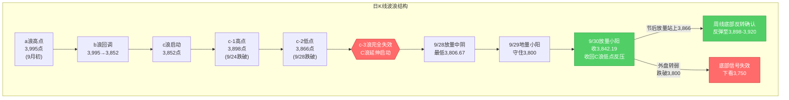
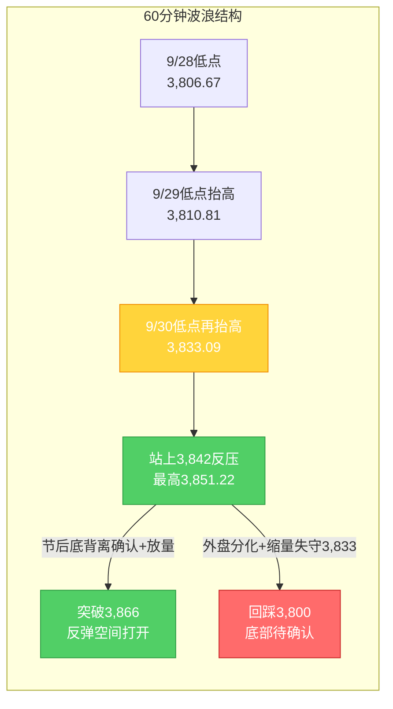

# A股晚报 - 2026年10月06日（国庆休市特刊·假期全球市场追踪）

> 数据截止时间：2026年10月6日 20:00（北京时间）；美股为10月5日（周一）收盘及10月6日盘前/期指，港股为10月6日收盘，日经/韩股为10月6日收盘，欧股为10月6日盘中/收盘，大宗商品与汇率为10月6日盘中
> 报告类型：国庆休市特刊 —— 节前最后交易日（9/30）复盘 + 假期全球市场动态追踪（10/2-10/6）+ 节后（10/8）开盘策略
> 核心观点：A股国庆长假休市第6日（10月1日-7日休市，**10月8日周四复市**）。节前最后交易日（9/30）上证指数红盘收官**+0.31%收3,842.19点**，放量收回3,842点（C浪低点反压），"C浪延伸末段寻底"初步确认。**假期第6日（10/6）外盘呈"延续回暖、结构分化"格局**：①**港股10/6低开高走、连续第二日收涨**——恒生指数**+1.0%收24,280.56点**（再创假期新高、收复24,000点后站稳）、恒生科技**+0.94%收4,223.08点**、国企指数**+0.96%**，全日主板成交982.65亿港元；**医药生物（创新药/CRO）大爆发**（维亚生物+23%、康希诺生物+14%、歌礼制药-B/百奥赛图-B+11%、亚盛医药/再鼎医药+9%、药明生物+4%），**智谱+7.59%**（GLM-5.3正式上架亚马逊AWS旗下Amazon Bedrock，打开海外收入分成通道），明星科网股普涨（阿里+2.75%、百度+3.6%、小米+近2%），但**半导体/硬件设备/CPO概念逆势下跌**（中芯国际跌近2%）；②**日经225 10/6收涨1.05%报70,683.98点**（假期首次收于70,000点上方，半导体设备股爱德万测试再创新高），**韩国KOSPI收跌0.89%报6,941.39点**（存储链获利回吐，SK海力士走弱）；③**美股10/5（周一）三大指数集体收涨**——道指**+0.18%**收51,267.90点、标普500**+0.66%**收7,773.95点、纳指**+1.05%**收27,477.31点**创收盘新高**，**英伟达+逾2%创历史新高**（市值约5.76万亿美元）、**SpaceX+近8%**（马斯克身家突破1万亿美元），大型科技股普涨；④**10/6美股盘前三大期指集体上涨**（道指期货+0.48%、标普500期货+0.22%、纳指期货+0.24%），英伟达盘前+0.91%，但**存储芯片股普跌（SK海力士-2.21%）**；⑤**欧股10/6高开高走**（DAX+0.59%→盘中+0.76%、富时100+0.5%→+0.76%、CAC40+0.33%→+0.50%、斯托克50+0.48%→+0.73%）；⑥**A50期货10/6偏强**（约13,863-13,880点，+0.35%~+0.46%）；⑦**大宗商品分化**——**布伦特原油跌破100美元**（约98.1-98.4美元/桶，-1.9%~-2.2%）、WTI约87.4美元（-2.26%），**COMEX黄金(12月)约4,188美元（+0.75%）**、白银约61.5美元（+0.26%）；⑧**利率边际改善**——10年期美债收益率10/6小幅回落至约**5.27%**（10/5约5.30%），30年期约5.656%仍处高位；**CME显示10月维持利率概率约77.3%（加息25bp概率约22.7%）**，12月维持利率概率仅13.4%（加息预期仍存）；⑨**离岸人民币10/6报6.7037**（较上周五纽约尾盘+21基点，维持强势）。**综合看，节后（10/8）A股大概率"低开高走/先抑后扬"**，假期外盘由"全面回暖"演化为"结构分化（医药/消费强、半导体高位震荡）"，机构主流预期"红十月"。操作建议：**节后不恐慌、低开可小幅试探**，核心观察**3,866点（c-2低点，周线底部反转确认位）**与**3,800点（20月均线，最后防线）**。

---

## ⚠️ 休市日特别说明

今日（2026年10月6日，周二）为**国庆假期休市日**（国庆休市安排：10月1日至10月7日休市，**10月8日（周四）起照常开市**，港股通10月8日起恢复服务），A股当日无交易，**无"今日行情"可复盘**。本期晚报延续9月25日中秋节、10月2日、10月5日国庆休市特刊的处理方式，采用**"节前复盘 + 假期全球市场追踪 + 节后策略"**结构。所有A股行情数据为节前最后交易日（2026年9月30日）数据。

---

## 一、市场回顾

### 1. 节前最后交易日（9/30）A股主要指数表现

| 指数 | 收盘点位 | 涨跌幅 | 最高/最低点 | 说明 |
|------|---------|--------|------------|------|
| 上证指数 | 3,842.19 | **+0.31%**（涨11.74点） | 3,851.22 / 3,833.09 | 红盘收官，放量收回3,842点（C浪低点反压） |
| 深证成指 | 12,887.62 | **-0.11%** | — | 小幅收跌 |
| 创业板指 | 3,135.28 | **-0.23%** | — | 成长风格承压 |
| 科创50 | 1,530.01 | **-2.51%** | — | 半导体/科技领跌 |

**特征**：三大指数涨跌不一，上证指数红盘收官并站上3,840点。**大小盘、成长与价值极致分化**——权重（银行、地产、白酒、医药）支撑沪指，科技成长（半导体、CPO、元件）集体回调拖累科创50。上证指数9月累计下跌约**-3.8%**（月初约3,995点），月线收中阴。

### 2. 节前最后交易日（9/30）成交量能

| 指标 | 数值 | 说明 |
|------|------|------|
| 两市成交额 | **约1.44-1.45万亿元** | 较9/29地量（1.40万亿）小幅放量约285亿 |
| 北向资金 | **净买入9.71亿元** | 沪股通净卖出6.42亿、深股通净买入16.13亿（结构分化） |
| 主力资金（特大单） | 净流出32.12亿元 | 医药生物特大单净流入39.56亿居首 |

**资金特征**：量能较地量温和回升，放量收回3,842点为底部确认提供量能支撑；外资节前未现大幅撤离。

### 3. 节前最后交易日（9/30）市场情绪

| 指标 | 数值 | 说明 |
|------|------|------|
| 上涨家数 | 2,567只 | 占比约46.16% |
| 下跌家数 | 2,824只 | 占比约50.78%，跌多涨少 |
| 涨停家数 | **56只** | — |
| 跌停家数 | 13只 | — |

**情绪特征**：**"指数红、个股绿"背离**——沪指收涨但下跌家数多于上涨家数，赚钱效应集中在医药、白酒、银行等权重与红利方向，情绪谨慎偏中性。

### 4. 假期全球市场动态概览（10/2-10/6）

| 市场/资产 | 最新表现（截至10/6 20:00） | 方向 |
|-----------|--------------------------|------|
| 美股（10/5收盘） | 道指**+0.18%**、标普**+0.66%**、纳指**+1.05%**（27,477.31，**创收盘新高**） | **偏多（科技领涨）** |
| 美股期指（10/6盘前） | 道指期货+0.48%、标普500期货+0.22%、纳指期货+0.24% | 偏多（存储链走弱） |
| 港股（10/5收盘） | 恒生指数**+0.28%**（24,040.34）、恒生科技**+0.62%**（4,183.68） | 偏多（逆转企稳） |
| **港股（10/6收盘）** | **恒生指数+1.0%（24,280.56）、恒生科技+0.94%（4,223.08）、国企指数+0.96%** | **偏多（低开高走、连续收涨）** |
| 日股（10/6收盘） | 日经225 **+1.05%**（**70,683.98**，假期首次收于70,000点上方） | **大涨** |
| 韩股（10/6收盘） | 韩国KOSPI **-0.89%**（6,941.39，存储链获利回吐） | 分化走弱 |
| 欧股（10/6） | DAX +0.59%→+0.76%、富时100 +0.5%→+0.76%、CAC40 +0.33%→+0.50% | 高开高走 |
| 富时中国A50期货 | 约13,863-13,880点（**+0.35%~+0.46%**，10/6） | **偏多修复** |
| 现货黄金 | 约4,132-4,150美元/盎司；COMEX黄金(12月)约**4,188**（+0.75%） | 偏强（探底回升） |
| 国际油价 | **布伦特约98.1-98.4美元/桶（跌破100，-1.9%~-2.2%）**；WTI约87.4美元（-2.26%） | **转弱** |
| 美债10年期收益率 | 约**5.27%**（10/6，较10/5约5.30%小幅回落）；30年期约5.656% | 高位小幅回落 |
| 离岸人民币（10/6） | **6.7037**（较上周五尾盘+21基点） | 维持强势 |
| 美联储10月维持利率概率 | **约77.3%**（加息25bp概率约22.7%） | 利好（加息预期降温） |

---

## 二、热点板块与异动分析

### 1. 节前最后交易日（9/30）领涨板块

申万31个一级行业**21涨10跌**，涨幅居前：

| 板块 | 涨跌幅 | 驱动因素 |
|------|--------|---------|
| 医药生物 | **+2.73%** | 创新药活跃，康希诺20cm涨停，主力净流入28.18亿居首 |
| 美容护理 | +1.70% | 消费防御，节前资金避险切换 |
| 食品饮料 | **+1.68%** | 白酒午后异动，金徽酒涨停 |
| 银行 | +1.47% | 红利防御+季末避险，权重护盘 |
| 钢铁 | +1.24% | 周期修复+低估值 |
| 农林牧渔 | +1.02% | 防御属性扩散 |

**驱动逻辑**：节前最后交易日资金呈现**"高低切换"**——从高估值科技成长切向低估值防御、消费、红利方向；能源活跃（煤炭+0.85%、三桶油上涨）。

### 2. 节前最后交易日（9/30）领跌板块

| 板块 | 涨跌幅 | 原因分析 |
|------|--------|---------|
| 电子 | **-2.38%** | 半导体走低，芯原股份跌超11% |
| 计算机 | -0.98% | 成长风格回调 |
| 机械设备 | -0.90% | 题材退潮 |
| 通信 | -0.62% | CPO/光通信走低 |
| 元件/PCB | 全天低迷 | 澳弘电子、协和电子跌停 |

**原因分析**：科技成长**完全证伪隔夜美股映射**（隔夜费半+1%、应用材料+5%），反映节前资金避险减仓高估值成长、季末流动性收缩下"美股映射"传导衰减。

### 3. 假期港股/海外板块异动（10/2-10/6）—— 由"逆转爆发"转向"结构分化"

**10/2（国庆后首日）**：恒指大跌**-2.60%**失守24,000点、恒生科技-2.26%；金融、地产、医药、科技四大主线集体杀跌，**仅光通信逆势活跃**（南向通道暂停放大外围利空）。

**10/5**：港股**低开走高、尾盘直线拉升逆转**，恒指**+0.28%**报24,040.34点（收复24,000点）、恒生科技**+0.62%**报4,183.68点；**PCB/覆铜板（建滔积层板+近12%）、半导体（傅里叶+近23%）、光通信（京信通信+超25%）、AI应用（智谱+超6%）集中爆发**。

**10/6（今日）**：港股**再度低开高走、连续第二日收涨**，恒指**+1.0%**报**24,280.56点**、恒生科技**+0.94%**报4,223.08点、国企指数**+0.96%**报8,128.97点；全日主板成交**982.65亿港元**（北水暂缺）。板块呈现**"医药消费强、硬科技弱"的结构分化**：

| 方向 | 领涨/领跌个股及涨幅 | 驱动因素 |
|------|--------------|---------|
| **医药生物/创新药/CRO** | **维亚生物+23%**、**康希诺生物+14%**、歌礼制药-B/百奥赛图-B**+11%**、亚盛医药/再鼎医药**+9%**、药明生物+4%、中国生物制药/金斯瑞+4%~9% | 隔夜**美股医药股领涨**（Vaxcyte+30.7%）+ **2026年欧洲肿瘤内科学会（ESMO）**临近 + 创新药出海预期 |
| **AI应用/大模型** | **智谱+7.59%**（GLM-5.3**正式上架亚马逊AWS Amazon Bedrock**，打开海外收入分成通道）、联想集团+超4% | AI商业化路径明确、海外云平台接入 |
| **明星科网股** | 阿里巴巴+2.75%、百度集团+3.6%、小米集团+近2% | 风险偏好修复、平台经济回暖 |
| **半导体/硬件设备/CPO** | 中芯国际**跌近2%**、华虹宏力走弱；CPO概念下挫 | 高位获利回吐、存储链走弱（SK海力士-2.21%） |
| 消费零售/钢铁 | Wind香港可选消费零售+1.64%、钢铁活跃 | 政策（以旧换新）+低估值修复 |

**结论**：**港股10/6的"低开高走+连续收涨"进一步验证了假期外盘的企稳**（恒指站上24,000点后向上拓展）；但**内部由"科技全面爆发"转为"医药消费领涨、半导体高位分化"**，对节后A股映射应**按细分板块区别对待**——医药/创新药映射强化，半导体/CPO映射强度边际减弱。

---

## 三、关键数据与事件回顾

### 1. 国内政策/事件（假期期间）

- **消费品以旧换新资金全部下达**（9/30，发改委+财政部）：向地方下达今年**第四批625亿元**超长期特别国债支持消费品以旧换新，**全年2,500亿元资金已全部下达**——利好假期消费与节后消费板块（家电、汽车、零售）。
- **国常会稳增长信号**（9/28）：强调"加大宏观政策逆周期调节力度""推出一批务实管用的增量政策"——四季度政策加码预期升温。
- **地产新政落地**（9/29）：央行、财政部等三部门联合发文，**中央财政首次对商业性个人住房贷款进行贴息**；叠加证监会涉房融资意见，政策底特征明确。
- **央行流动性呵护**：公告**10月8日开展1.2万亿元3个月期买断式逆回购**（当月到期1万亿），**净投放2,000亿元**；下调**PSL利率0.25个百分点至1.5%**，将"六张网"纳入PSL支持领域。
- **9月官方制造业PMI 50.1%**（9/30公布）：较上月上升0.3个百分点，**重回扩张区间**。

### 2. 假期消费与经济运行

- **消费平稳增长**（商务部商务大数据）：国庆假期前3日，重点监测的**78条步行街（商圈）客流量、营业额同比分别增长3.4%、5.3%**；**消费品以旧换新带动销售额196.3亿元、惠及348.3万人次**。
- **外媒定调**（China Daily，10/6）："假期消费彰显四季度良好开局"（Holiday spending heralds upbeat start to 4th quarter）。

### 3. 海外关键事件

- **美股10/5收盘**：道指51,267.90（**+0.18%**）、标普7,773.95（**+0.66%**）、纳指27,477.31（**+1.05%**、**创收盘新高**）；**英伟达+逾2%创历史新高**（市值约5.76万亿美元）、**台积电ADR创历史新高**（市值约2.5万亿美元）、**SpaceX+近8%**（马斯克身家突破1万亿美元）；特斯拉+逾2%，谷歌/Meta/微软+逾1%；**费半仅微涨0.27%（内部分化）**。
- **10/6美股盘前**：三大期指集体上涨（道指期货+0.48%、标普500期货+0.22%、纳指期货+0.24%），英伟达+0.91%、谷歌+0.49%；**存储芯片股普跌**（SK海力士-2.21%）；**布油跌破100美元**。
- **美联储**：CME"美联储观察"（10/6）显示**10月维持利率概率约77.3%、加息25bp概率约22.7%**；12月维持利率概率仅**13.4%**（累计加息25bp概率67.8%、加息50bp概率18.8%）——**加息预期降温（10月）但12月仍偏鹰**。**本周三（10/7）将公布9月货币政策会议纪要**。
- **地缘与油市**：假期油市"先扬后抑"，10/6布油跌破100美元（约98.4），反映地缘扰动（中东/霍尔木兹海峡）与供应端（OPEC+、释储）多空拉锯、需求预期转弱。

### 4. 机构观点（四季度展望）

- **多家券商（10/6）**：四季度判断整体**"中性乐观"**，认为**科技（AI）仍有第二波机会**，AI仍是四季度配置主线之一；国信证券称"本轮牛市还未结束、仍有演绎空间"；湘财证券预计四季度多数时间宏观与基本面较强，市场或呈"盈利防御慢牛"。
- **中泰/中信证券（前期）**：看好四季度和跨年行情，**科技成长有望延续趋势**。
- **风险提示**：中银证券等提示美债长端收益率高企或加剧短期交易难度，需看长端美债能否稳住。

---

## 四、海外市场联动

### 1. 美股三大指数（10/5收盘）及10/6盘前

| 日期 | 道琼斯 | 标普500 | 纳斯达克 | 备注 |
|------|--------|---------|---------|------|
| 10/5（美东，周一收盘） | 51,267.90（**+0.18%**，+90.94点） | 7,773.95（**+0.66%**，+51.23点） | 27,477.31（**+1.05%**，+286.45点） | **纳指创收盘新高**；英伟达、台积电齐创历史新高 |
| 10/6（盘前/期指） | 道指期货**+0.48%** | 标普500期货**+0.22%** | 纳指期货**+0.24%** | 三大期指集体上涨；存储链承压 |

**关键解读**：美股10/5在"加息预期降温→利率敏感型成长股领涨"逻辑下集体收涨，纳指创收盘新高，**英伟达+逾2%创历史新高（市值约5.76万亿美元）**；10/6盘前三大期指集体上涨但**呈"龙头强、存储弱"分化**（SK海力士-2.21%）。**"美股映射"在细分层面需区别对待**（AI算力/大模型强，存储/二线半导体弱）。

### 2. 港股（10/5、10/6收盘）—— 假期最大正向变量的延续

| 日期 | 恒生指数 | 恒生科技 | 成交 | 备注 |
|------|---------|---------|------|------|
| 10/5 | **24,040.34**（+0.28%） | **4,183.68**（+0.62%） | 981.02亿港元 | 收复24,000点，尾盘拉升 |
| **10/6** | **24,280.56**（**+1.0%**，+240.22点） | **4,223.08**（**+0.94%**，+39.4点） | 982.65亿港元 | **低开高走、连续收涨**；国企指数+0.96% |

**10/6结构**：**医药生物（创新药/CRO）+AI应用（智谱）领涨，明星科网股普涨，半导体/硬件设备/CPO逆势下跌**——港股由"全面爆发"转为"结构分化"，映射方向由"科技单主线"转向"医药+AI双线"。

### 3. 欧洲/亚太（10/6）

| 市场 | 表现（10/6） | 备注 |
|------|-------------|------|
| 日经225 | **+1.05%**，收**70,683.98点** | **假期首次收于70,000点上方**；半导体设备股爱德万测试再创新高 |
| 韩国KOSPI | **-0.89%**，收6,941.39点 | 高开后跳水，存储链获利回吐（SK海力士走弱） |
| 德国DAX | +0.59%→**+0.76%**（盘中） | 欧股高开高走 |
| 欧洲斯托克50 | +0.48%→**+0.73%**（盘中） | — |
| 英国富时100 | +0.5%→**+0.76%**（盘中） | — |
| 法国CAC40 | +0.33%→**+0.50%**（约7,873.64） | 前一日（10/5）跌-0.91%，10/6反弹 |

**特征**：**亚太10/6"日强韩弱、港股逆转"**，欧洲"高开高走"——**外围风险偏好整体回暖，但结构分化加剧**（AI算力/消费/医药强，半导体存储高位震荡），对A股节后构成**"整体正向、细分有别"的映射**。

### 4. 大宗商品

| 品种 | 最新价（10/6） | 涨跌幅 | 关键驱动 |
|------|--------------|--------|---------|
| 布伦特原油（12月） | 约**98.1-98.4美元/桶** | **-1.9%~-2.2%**（**跌破100**，最低97.83） | 地缘扰动减弱+需求预期转弱+美元/美债高企 |
| WTI原油（11月） | 约**87.4美元/桶** | **-2.26%** | 跟随布油走弱 |
| COMEX黄金（12月） | 约**4,188美元/盎司** | **+0.75%**（探底回升） | 避险（欧洲财政担忧）+加息预期降温 vs 美债收益率高企 |
| 现货黄金 | 约**4,132-4,150美元/盎司** | 跌0.27%后回升 | 美元与美债收益率走强施压，盘中探底回升 |
| 现货/期货白银 | 约**61.5美元/盎司** | **+0.26%** | 工业+金银比修复 |

**驱动逻辑**：
- **油市**：10/6**油价加速下跌、布油跌破100美元**——假期整体"先扬后抑"，地缘溢价回吐+需求预期转弱；**油价转弱对A股油气/煤炭板块支撑进一步减弱**。
- **贵金属**：加息预期降温利好被**美债收益率高企**对冲，金价10/5小幅回落（约4,132）后10/6探底回升（COMEX约4,188、+0.75%），呈"多空均衡、震荡偏强"。

---

## 五、汇率与利率

| 指标 | 数值 | 变化/说明 |
|------|------|----------|
| 人民币中间价（9/30） | **6.7351** | 调升60个基点，维持强势 |
| 离岸人民币（10/6 04:59） | **6.7037** | 较上周五纽约尾盘**涨21基点**，日内6.7035-6.7148 |
| 在岸人民币（10/6） | 约**6.69-6.70** | 假期维持强势，人民币资产吸引力不减 |
| 美元指数 | 假期整体走强（10/2约101.85） | 与美债收益率上行同步 |
| **美债10年期收益率（10/6）** | 约**5.27%** | 较10/5约5.30%**小幅回落**，仍处2002年以来高位 |
| 美债30年期收益率 | 约**5.656%** | 长端仍处高位 |
| **美联储10月维持利率概率** | **约77.3%（加息概率约22.7%）** | 加息预期（10月）降温 |
| 美联储12月维持利率概率 | **仅13.4%**（加息25bp 67.8%、50bp 18.8%） | **12月加息预期仍偏鹰** |
| 央行10/8操作预告 | **1.2万亿元3个月期买断式逆回购** | 当月到期1万亿，**净投放2,000亿** |

**特征**：①**10月加息预期降温（维持利率概率约77.3%）仍是最重要的边际利好**；②**10/6美债10年期收益率小幅回落至约5.27%**（结束假期连续上行），对成长股估值的边际压制**略有缓解**；③但**30年期仍处5.656%高位、12月加息预期偏鹰（维持利率概率仅13.4%）**，"短端降温 vs 长端高企"的背离格局未根本改变，成长股"利率弹性修复"利好仍需**打折**；④人民币维持强势（离岸6.7037），利好人民币资产；⑤央行10/8加量净投放2,000亿，季末后资金面平稳。

---

## 六、收盘后重要信息 / 节后关注

### 1. 节后交易日历（10/8复市）

- **10月8日（周四）**：A股复市，当日央行开展**1.2万亿元买断式逆回购**（净投放2,000亿）；港股通恢复服务；关注首日集合竞价与低开幅度、3,833/3,842支撑有效性。
- **10月9日（周五）**：节后第2个交易日，关注能否**放量站上3,866点**（周线底部反转确认的关键）。
- **10月13日起**：三季报披露开启（沪市**有研新材10月13日**首披，金盘科技、川投能源10月14日）。
- **10月27日**：美联储FOMC议息会议（当前10月维持利率概率约77.3%）。

### 2. 假期后重要信息

- **美联储会议纪要**：**10月7日（周三）**公布9月货币政策会议纪要，关注官员对通胀与加息路径的表态——为10/8复市前最后一个关键外盘变量。
- **限售解禁**：**泰金新能（688813）10月8日解禁192.30万股**（占总股本1.20%、解禁市值约2.46亿元）——节后首日解禁个股需关注冲击。
- **夜盘走势**：美股10/6正常交易（北京21:30开盘），报告时点为盘前/期指；港股10/6收涨；商品期货偏弱（油价跌破100）。

### 3. 节后需跟踪的假期信号（截至10/6）

- **外盘累计表现**：10/1-10/7美股、港股累计涨跌幅，决定10/8开盘方向与幅度（"二次映射"）——**当前假期外盘整体偏多（港股连续收涨+纳指创新高+日经创新高）**。
- **港股结构分化**：10/6港股"医药+AI强、半导体弱"，节后A股映射应**按细分板块区别对待**。
- **美债长端收益率**：10/6小幅回落至5.27%，能否延续回落（若续升将压制成长股估值，动摇"加息预期降温"的利好效果）。
- **地缘与油价**：中东局势对油价与避险情绪的扰动；布油跌破100美元后能源板块映射转弱。
- **政策落地**：国常会增量政策、地产贴息新政、以旧换新全年2,500亿资金全部下达的执行力度。

---

## 七、波浪理论多周期分析

> 说明：A股休市，波浪结构基于节前最后交易日（9/30）数据；本部分结合假期外盘（美股/港股/日股，含10/6最新走向）推演节后（10/8）路径。

### 1. 月K线波浪分析
- **当前波浪位置**：大周期第2浪C浪延伸**末段**，9月月K线收中阴线，月末收盘3,842.19点**站上20月均线（3,800-3,810点）**
- **浪型结构描述**：
  - 大结构：2024年9月2,689点→2026年6月4,197点为第1浪上升
  - 第2浪ABC调整：4,197点→3,806.67点（9/28盘中最低）
  - 9月月K线收中阴（月跌约-3.8%），月线MACD死叉绿柱持续，但月末企稳使绿柱扩张动能减弱
- **关键目标位**：
  - 月度强支撑：**3,800-3,810点**（20月均线，9月末已站稳上方）
  - 月度核心压力：3,866点（c-2低点）、3,898点（c-1高点）、3,980-3,985点（5月均线）
  - C浪延伸加速目标：3,750点（仅当有效跌破3,800点时启用）
- **验证条件**：守住3,800点（20月均线）并站上3,842点，月度底部信号初现，待10月月K线（10/8起）确认

### 2. 周K线波浪分析
- **当前波浪位置**：上周（第40周）周K线收**带长下影的小阴/十字星**，跌势放缓、企稳迹象增强
- **浪型结构描述**：
  - 节前周（9/28-9/30，3个交易日）：9/28放量中阴探至3,806.67点→9/29地量小阳→9/30放量小阳收3,842.19点
  - 周线仍位于5周（3,900-3,910）、10周（3,885-3,895）均线下方，短期均线空头排列未改，但长下影显示下方支撑增强
- **关键目标位**：
  - 周度支撑：3,833点（9/30低点）、3,800点（20月均线，核心）
  - 周度压力：**3,866点（c-2低点，核心）**、3,898点（c-1高点）、3,900-3,910点（5周均线）
- **验证条件**：节后首周（仅2日）**能否放量站上3,866点**——站稳则周线底部反转信号增强；**假期外盘持续回暖（港股10/5-10/6连续收涨、日经创阶段新高、纳指创新高）进一步抬升首周向上验证的概率**

### 3. 日K线波浪分析（重点）
- **当前波浪位置**：**C浪延伸末段寻底初步确认**——"放量中阴（9/28）+地量小阳（9/29）+放量收回C浪低点反压（9/30）"组合成立
- **浪型结构描述**：
  - 9/28放量中阴-1.67%（最低3,806.67，"最后一跌"）→9/29地量小阳（1.40万亿一年新低）→9/30放量小阳+0.31%收3,842.19，成功收回3,842点（C浪低点反压）
  - 成交1.45万亿温和放量，量价配合良好，低点逐级抬高（3,806.67→3,810.81→3,833.09）
- **关键目标位**：
  - 第一支撑：**3,842点（已收回转支撑）**、3,833点（9/30低点）
  - 强支撑：**3,800点（20月均线）**
  - 第一压力：**3,866点（c-2低点，节后核心观察位）**
  - 强压力：3,898点（c-1高点）
- **验证条件**：
  - 向上确认：节后放量站上3,866点 → 底部反转确立，打开反弹空间至3,898点
  - 向下确认：节后跌破3,833点并失守3,800点 → 底部信号失效，下看3,750点
  - **假期变量（更新至10/6）**：港股连续两日收涨（10/5+0.28%、10/6+1.0%）+日经创阶段新高+纳指创收盘新高，**进一步降低"二次映射低开"的幅度预期**；但港股"半导体/CPO转弱"提示**科技链映射需按细分板块区别对待**

### 4. 60分钟K线波浪分析
- **当前波浪位置**：60分钟级别**底背离确认**，短期趋势转多（基于9/30收盘）
- **浪型结构描述**：
  - 60分钟低点逐级抬高：3,806.67（9/28）→3,810.81（9/29）→3,833.09（9/30）
  - 60分钟MACD零轴下方绿柱持续缩短并逼近金叉，KDJ超卖区域金叉后向上
- **关键目标位**：短期支撑3,842/3,833点；短期压力3,866点、3,898点
- **验证条件**：60分钟底背离已确认+站上3,842点；**节后首个60分钟能否守住3,833点为短线转强/转弱分水岭**

### 5. 30分钟K线波浪分析
- **当前波浪位置**：30分钟级别企稳回升，站上短期均线（基于9/30收盘）
- **浪型结构描述**：
  - 30分钟级别9/30全天震荡上行，午后维持强势收于3,842.19点
  - 30分钟MACD金叉后红柱温和放大，KDJ中位区向上；但量能未显著放大，上攻动能需节后量能配合
- **关键目标位**：关键支撑3,833/3,842点；短期压力3,851点（9/30高点）、3,866点
- **验证条件**：节后30分钟能否放量突破3,851点并站稳3,842点

### 6. 波浪图（Mermaid绘制）

**日K线波浪结构图**：


**60分钟波浪结构图**：


### 7. 波浪理论综合判断

| 维度 | 判断 |
|------|------|
| 多周期共振状态 | 月K/周K仍偏空（均线空头排列），日K/60分钟/30分钟底部信号确认、共振转多；**假期"美股创新高+港股连续收涨+日经创阶段新高"持续改善小周期修复的外部环境**，大小周期背离进入加速修复期；但港股10/6"半导体/CPO转弱"提示修复呈结构性 |
| 当前操作级别 | **日线级别**（C浪延伸末段寻底初步确认，关注3,866点突破与3,842/3,800点支撑） |
| 后续演变路径（节后10/8-10/9） | **55%乐观**（低开高走、放量站上3,866点→周线底部反转确认，反弹至3,898-3,920点）、**30%中性**（3,820-3,866区间震荡消化、量能温和修复）、**15%悲观**（外盘10/7会议纪要转鹰/美债长端续升共振→有效跌破3,800点，下看3,750点） |
| 关键拐点信号 | 向上：放量站上3,866点（c-2低点）+北向恢复净流入+加息预期继续降温+海外科技链/医药链强势；向下：有效跌破3,800点（20月均线）+美债长端续升+放量下跌 |
| 风险提示 | ①C浪延伸是否终结需节后确认（当前仅为"初步确认"）；②**30年期美债收益率仍处5.656%高位、12月加息预期偏鹰（维持利率概率仅13.4%）**，"短端降温 vs 长端高企"背离未改；③**10/7美联储9月会议纪要为复市前关键变量**，若偏鹰则压制风险偏好；④港股10/6"半导体/CPO转弱"或向A股科技链传导；⑤波浪理论在C浪延伸末段+地量整理阶段预测精度降低，需结合政策面、外盘与节后量能综合判断 |

> **规律分析引用（第40周运行规律分析）**：该报告预测节后首周（第41周，10/8-10/9）上证运行区间**3,810-3,900点**，判断"**震荡企稳、偏多修复（先抑后扬）**"，乐观/中性/悲观概率45%/35%/20%；并提示"3,866点为周线底部反转确认位、3,800点为最后防线"。本报告结合假期最新外盘（**港股10/5-10/6连续收涨、纳指/日经创阶段新高、美债收益率10/6小幅回落**）**维持"乐观55%/中性30%/悲观15%"**——外盘持续回暖支撑乐观路径，但港股"科技链转弱"与美债长端高企构成结构性扰动，故不加码乐观权重。

---

## 八、晨报复盘（休市特刊适配版）

> 说明：今日（10/6）为休市日，**无当日行情**，传统"晨报预测 vs 当日实际"复盘不适用。本期复盘调整为：**"10月6日晨报对假期外盘的预判" vs "10月6日假期外盘实际表现（截至20:00）"** 的追踪复盘；节后10/8开盘方向仍待验证。

### 1. 核心判断回顾（假期外盘追踪口径）

| 判断项目 | 10/6晨报预判 | 10/6实际（截至20:00） | 准确度 | 备注 |
|---------|------------|---------------------|-------|------|
| 港股延续企稳 | "10/6开盘前延续企稳" | 恒指**+1.0%**报24,280.56，**低开高走连续第二日收涨** | ✓ | 企稳超预期，向上拓展 |
| 亚太10/6早盘 | "高位分化（日经高位整理、韩股冲高回落）" | 日经**+1.05%**收70,683.98创新高区；KOSPI**-0.89%** | ✓/△ | 韩股命中；日经偏强（超出"高位整理"） |
| 美股10/6盘前 | "外盘偏多"（隐含） | 三大期指集体上涨（道指+0.48%/纳指+0.24%） | ✓ | 方向命中 |
| 看涨板块：半导体/光通信 | "半导体设备/材料、光通信修复" | 港股**半导体/硬件设备/CPO下跌**（中芯国际-近2%） | ✗ | 港股映射转弱，细分误判 |
| 看涨板块：医药/创新药 | "医药生物/创新药（防御+资金流入）" | 港股**医药生物大爆发**（维亚生物+23%、康希诺+14%） | ✓ | 前瞻命中，且成最强主线 |
| 看涨板块：AI应用/大模型 | "AI应用修复弹性" | 智谱**+7.59%**（GLM-5.3上架Amazon Bedrock） | ✓ | 命中 |
| 看跌板块：油气/能源 | "油价续跌、映射转弱" | **布油跌破100美元**（约98.4，-1.9%~-2.2%） | ✓ | 精准命中 |
| 美债长端续升风险 | "10年期续升至约5.30%" | 10/6**小幅回落至约5.27%**（未续升） | △ | 方向偏差（回落而非续升） |
| 节后区间3,810-3,900点 | 待10/8验证 | 未开盘 | — | 待验证 |
| 北向资金0-50亿 | 待10/8验证 | 未开盘 | — | 待验证 |

### 2. 准确率量化评估（追踪口径）

- 方向性变量识别准确率：**75%（6/8）**——港股企稳、韩股回落、美股期指偏多、医药爆发、AI应用、油价续跌均命中；日经偏强（部分命中）；半导体映射、美债续升误判
- 关键事件预判准确率：**约67%（2/3）**——智谱/医药爆发、油价跌破100命中；美债收益率方向误判
- **追踪综合准确率：约75%**——较10/5特刊（约80%）小幅回落，核心偏差为**"半导体/光通信港股映射"误判**（港股科技链10/6转弱）与**"美债续升"误判**（10/6小幅回落）

### 3. 偏差根因分析

【偏差1】港股半导体/光通信映射误判
- 偏差描述：晨报将"半导体设备/材料、光通信/CPO"列为节后科技链修复优先方向（依据10/5港股PCB/半导体爆发），实际10/6港股**半导体/硬件设备/CPO逆势下跌**（中芯国际跌近2%）
- 根本原因：**逻辑误判+情绪面误读**——将10/5单日港股"科技全面爆发"线性外推，忽视了"假期后段科技链获利回吐+存储链走弱（SK海力士-2.21%）"的分化信号
- 信息缺口：当时未获取到"10/6亚太存储链转弱（韩国KOSPI跳水-0.89%）"的前瞻信号
- 逻辑缺陷：将港股"单日全面爆发"等同于"趋势延续"，未按细分板块（AI算力/大模型 vs 半导体存储/CPO）拆解
- 改进措施：**长假期间外盘板块映射须逐日跟踪并"按细分板块拆解"**——当出现"AI应用/大模型强、半导体存储/CPO弱"的分化时，节后A股映射应下调后者优先级

【偏差2】美债收益率"续升"误判
- 偏差描述：晨报风险提示"10年期美债收益率续升至约5.30%"，实际10/6**小幅回落至约5.27%**
- 根本原因：**技术分析局限**——10/5升至5.30%时线性外推"续升"，未考虑"油价大跌+避险缓和"对长端的边际压制
- 改进措施：**跟踪美债长端须同时纳入"油价+避险情绪+期限溢价"三因子**，油价单日大跌时应对长端收益率"续升"预判做反向修正

### 4. 分析检查清单

- [x] 趋势判断前是否检查：隔夜外盘走势 ✓（美股/港股/日股/韩股/欧股均覆盖）
- [x] 趋势判断前是否检查：假期利率与汇率市场（美债收益率、美联储预期） ✓（含"盘中vs收盘"差异）
- [x] 点位计算是否考虑：前期高低点、均线支撑/压力 ✓
- [x] 板块分析是否覆盖：**假期港股板块异动（医药/AI应用/半导体）并做细分拆解** ✓（本期新增"细分板块拆解"检查项）
- [x] 风险提示是否充分：长假"二次映射"风险 ✓（港股连续收涨后已下调其权重）
- [x] 波浪分析检查项：多周期+假期变量结合 ✓

### 5. 本次追踪发现的新规则

- **规则1（板块选择）**：长假期间海外/港股**医药生物（创新药/CRO）集中爆发**且伴随"美股医药领涨+国际学术会议（如ESMO）催化"时，节后A股医药生物/创新药板块映射修复概率提升，可作为"防御+成长"兼具的优先方向
- **规则2（板块选择）**：长假期间外盘出现"**AI应用/大模型强、半导体存储/CPO弱**"的分化时，节后A股科技链映射须**按细分板块拆解**——上调AI应用/大模型、下调半导体存储/CPO优先级
- **规则3（资金面分析）**：长假期间国际油价单日**跌超2%并跌破关键整数关口（如布油100美元）**时，节后A股油气/煤炭板块映射转弱，应下调其优先级，与"地缘+冬储"逻辑做对冲评估
- **规则4（趋势分析）**：假期外盘对节后开盘方向的权重**随假期推进递减**，越临近复市（第6-7日）的边际变化（如10/7美联储纪要）权重越高；假期中期结论不应作为最终定调

### 6. 规则库更新

```
###板块选择 长假期间海外/港股医药生物（创新药/CRO）集中爆发且伴随"美股医药领涨+国际学术会议（如ESMO）催化"时，节后A股医药生物/创新药板块映射修复概率提升，可作为"防御+成长"兼具的优先方向（发现日期：2026年10月6日）
###板块选择 长假期间外盘出现"AI应用/大模型强、半导体存储/CPO弱"的分化时，节后A股科技链映射须按细分板块拆解——上调AI应用/大模型、下调半导体存储/CPO优先级（发现日期：2026年10月6日）
###资金面分析 长假期间国际油价单日跌超2%并跌破关键整数关口（如布油100美元）时，节后A股油气/煤炭板块映射转弱，应下调其优先级，与"地缘+冬储"逻辑做对冲评估（发现日期：2026年10月6日）
###趋势分析 假期外盘对节后开盘方向的权重随假期推进递减，越临近复市（第6-7日）的边际变化（如美联储会议纪要）权重越高；假期中期结论不应作为最终定调（发现日期：2026年10月6日）
```

---

## 九、策略回顾与调整

### 1. 假期策略回顾（10/6晨报 vs 假期外盘）

| 策略项目 | 10/6晨报建议 | 假期实际（截至10/6） | 执行效果 | 备注 |
|---------|------------|--------------------|---------|------|
| 短线仓位 | 5%（节后低开可小幅试探） | 待10/8执行 | — | 港股连续收涨后，低开试探胜率上升 |
| 买入条件 | 节后守住3,833/3,842并放量站上3,866 | 尚未开盘 | — | 前置条件不变 |
| 止损位 | 3,795点（收盘破3,800止损） | 尚未开盘 | — | 维持 |
| 短线标的 | PCB/覆铜板、半导体设备、医药生物 | 港股**医药生物大爆发**✓；半导体转弱✗ | △ | 医药命中，PCB/半导体需下调优先级 |
| 中线仓位 | 15-20% | 待10/8执行 | — | 假期利好增强，可维持上沿 |

### 2. 中线策略调整（面向节后10/8）

- **当前中线方向**：**【持有/小幅布局】**（较10/5"持有/小幅布局"信心基本持平）
- **方向调整原因**：假期外盘由10/5"全面回暖"演进为10/6"**结构分化**"——港股连续收涨（利好）但半导体/CPO转弱、油价跌破100（结构扰动），美债长端10/6小幅回落（利好）但30年期仍高、12月加息预期偏鹰——**净影响维持"偏多但结构性"**
- **中线仓位建议**：**15-20%**（维持上沿，原因：假期外盘持续回暖、C浪底部信号增强；但节后仅2个交易日+美债长端高位+10/7会议纪要待落地）
- **中线目标区间**：上证指数 **3,842点 - 3,898点**（底部确认后修复区间）；**下沿支撑3,800点**
- **中线止损位**：**3,800点**（有效跌破则底部信号失效，下看3,750点）
- **中线布局板块调整**：
  - **上调优先级**：**医药生物/创新药/CRO**（假期港股10/6医药大爆发+美股医药领涨+ESMO催化，"防御+成长"兼具）、**AI应用/大模型**（智谱GLM-5.3上架Amazon Bedrock，AI商业化加速）
  - **维持**：半导体（设备/材料/先进封装，但**细分优先级下调**）、银行/红利（高股息）
  - **下调优先级**：**PCB/覆铜板、光通信/CPO**（港股10/6半导体/硬件/CPO转弱）、**能源（油气/煤炭）**（油价跌破100、映射转弱）
  - **小幅布局**：新型电池/固态电池（政策催化）、房地产链（地产贴息新政，防"利好兑现"分化）、消费（以旧换新全年2,500亿资金全部下达）
  - **回避**：高位连板股、退市风险股、限售解禁个股（如泰金新能10/8解禁）

### 3. 明日（节后10/8）策略要点

- **短线**：**【观望/低开小幅试探】**，关注 **3,866点**（突破则转强）、**3,842点/3,833点**（支撑）、**3,800点**（止损）
- **中线**：**【持有/小幅布局】**，关注 **3,866点**（压力/确认位）与 **3,800点**（支撑）
- **仓位分配**：短线5% + 中线15-20% + 现金75-80%
- **节后操作前提**：
  1. **先看10/7美联储9月会议纪要**——若偏鹰，则下调乐观权重、等待量能确认
  2. 开盘先看**低开幅度**——港股连续收涨后低开幅度预计收窄；低开不恐慌、观察是否低开高走
  3. 看**量能**——成交能否回升至1.6万亿以上（站上3,866点需量能配合）
  4. 看**板块结构**——医药/创新药、AI应用能否在外盘映射下走强；半导体/CPO能否止跌
  5. 若外盘偏多 + 量能配合 → 按上述布局、低开可小幅试探；若会议纪要偏鹰 + 美债长端续升 → 待低开企稳、量能确认后再评估，**不急于抄底**

### 4. 策略复盘规则输出

```
###板块选择 长假期间港股医药生物（创新药/CRO）连续爆发且与"美股医药领涨"共振时，节后A股短线/中线应将其与"AI应用/大模型"并列为优先方向，同时下调"半导体存储/CPO、油气能源"优先级（发现日期：2026年10月6日）
###趋势分析 假期外盘"连续收涨+指数创新高"时，节后"低开高走"路径概率提升，但若同期出现"细分科技链转弱"的分化，则乐观权重应"结构性打折"而非整体加码（发现日期：2026年10月6日）
```

---

## 十、风险提示

1. **市场系统性风险**：
   - **美债长端收益率高企风险**：30年期仍处约**5.656%**高位、12月加息预期偏鹰（维持利率概率仅13.4%），若长端续升，将压制高估值成长股估值
   - **美联储会议纪要风险**：**10/7公布9月货币政策会议纪要**，若偏鹰，或压制复市前风险偏好
   - **港股/外盘映射的"反向"风险**：港股10/6"半导体/CPO转弱"，若10/7延续，节后A股科技链低开压力回升
   - **地缘政治风险**：中东局势（美伊/霍尔木兹海峡）扰动油价与全球避险情绪
2. **个股风险事件**：
   - **限售解禁**：**泰金新能（688813）10月8日解禁**（解禁市值约2.46亿元），节后首日关注冲击
   - **高位连板股退潮**：节前连板题材股节后存获利回吐风险
   - **三季报预告/披露风险**：10月13日起三季报开启，不及预期个股存调整压力
3. **政策不确定性风险**：
   - 房地产贴息新政、国常会增量政策的细则与执行力度，地产板块持续性存疑（节前已现"利好兑现"分化）
   - 中美经贸磋商后续进展
   - 四季度增量政策的落地节奏与力度

---

## 十一、信息来源

1. **官方数据来源**：上海证券交易所/深圳证券交易所（休市安排公告）、国家统计局、中国人民银行、财政部、金融监管总局、国务院、商务部、国家发展改革委、香港交易所（HKEX）
2. **权威财经媒体**：新华社（新华财经/中国证券网《港股6日涨1.0% 收报24280.56点》）、央视财经、《新闻联播》、中国证券报、上海证券报（中国证券网）、证券时报、证券日报、每日经济新闻、财联社、华尔街见闻、中国基金报、经济日报、China Daily
3. **数据平台**：东方财富（Choice数据）、同花顺、Wind资讯、CME FedWatch、Nasdaq.com、Nikkei（日经官网）、格隆汇、Boursier.com、CaixaBank Research
4. **海外信息源**：Reuters、Bloomberg、Morningstar、AWS（Amazon Bedrock）、香港交易所（HKEX）

> 数据截止时间：2026年10月6日 20:00（北京时间）；美股为10月5日（周一）收盘及10月6日盘前/期指，港股为10月6日收盘，日经/韩股为10月6日收盘，欧股为10月6日盘中，大宗商品与汇率为10月6日盘中，美债收益率为10月6日数据。

---

## 十二、文档更新检查

```
## 文档更新建议

### 无需更新
AGENTS.md 已包含"休市特刊"流程（非交易日晚报采用"节前复盘 + 假期全球市场追踪 + 节后策略"三段式结构），当前实际执行与文档一致，无需更新。
README.md 的文件结构与功能说明与实际一致，无需更新。
```

---

*本期晚报为国庆休市特刊（假期全球市场追踪版），由AI代理自动生成，仅供参考，不构成投资建议。投资有风险，入市需谨慎。*
*数据截止时间：2026年10月6日 20:00（北京时间）*