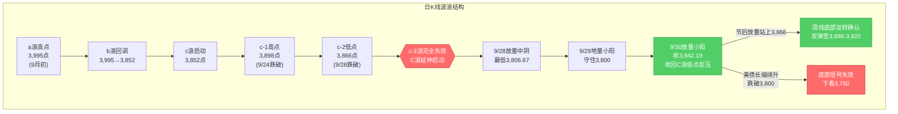
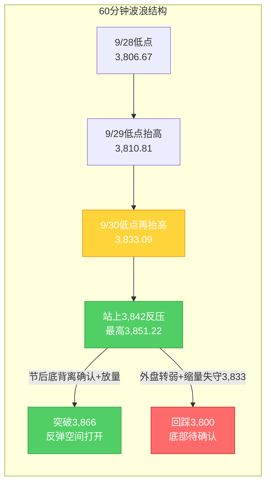

# A股晨报 - 2026年10月06日（国庆休市特刊·假期全球市场追踪）

> 数据截止时间：2026年10月6日 08:45（北京时间）；美股为10月5日（周一）收盘，港股为10月5日收盘及10月6日开盘前，日股/韩股为10月6日早盘，大宗商品与汇率为10月5日收盘及10月6日早间
> 报告类型：国庆休市特刊 —— 上一交易日晚报复盘 + 假期全球市场追踪（10/2-10/6）+ 节后（10/8）开盘策略
> 核心观点：A股国庆长假休市第6日（10月1日-10月7日休市，**10月8日周四复市**）。上一交易日（9/30）上证指数红盘收官**+0.31%收3,842.19点**，放量收回3,842点（C浪低点反压），"C浪延伸末段寻底"初步确认。**假期第6日（10/5美股+10/6亚太早盘）延续"全面回暖、科技领涨"格局**：①**美股10/5（周一）三大指数集体收涨**——道指**+0.18%**收51,267.90点、标普500**+0.66%**收7,773.95点、纳指**+1.05%**收27,477.31点**创收盘新高**（盘中最高27,544.07点）；**英伟达+2.12%创历史新高**（市值升至5.76万亿美元）、**台积电+约2.8%创历史新高**（美股ADR市值达2.5万亿美元，台湾股价10/5亦+3%创新高），大型科技股普涨（特斯拉+2%、谷歌/Meta/微软+1%），中概股大涨；②**假期最大边际利好仍为"美国9月非农爆冷"**——9月非农仅新增**2.9万人**（预期8.4万），**美联储10月维持利率概率约77.3%-77.9%（加息概率约22.1%-22.7%）**，较一周前约70%的加息预期大幅回落；9月ISM非制造业PMI 54.9（前值55.4，大致符合预期）；③**港股10/5逆转**——恒生指数**+0.28%**收**24,040.34点**（收复24,000点）、恒生科技**+0.62%**收4,183.68点，**PCB/半导体/光通信/AI应用集中爆发**；④**10/6亚太早盘分化**——日经225高开0.01%报69,954.61点（前一日+2.40%），韩国KOSPI开盘+0.58%后跳水转跌（三星电子-0.18%、SK海力士-1.36%）；⑤**唯一扰动=美债长端续升**——10年期美债收益率10/5升2.34bp至约**5.30%**、30年期升2.64bp至约**5.656%**（均处2002年以来高位），对高估值成长股构成边际压制。**综合看，节后（10/8）A股大概率"低开高走/先抑后扬"**，机构主流预期"红十月"。操作建议：**节后不恐慌、低开可小幅试探**，核心观察**3,866点（c-2低点，周线底部反转确认位）**与**3,800点（20月均线，最后防线）**。

---

## ⚠️ 休市日特别说明

今日（2026年10月6日，周二）为**国庆假期休市日**（国庆休市安排：10月1日至10月7日休市，**10月8日（周四）起照常开市**，港股通10月8日起恢复服务），A股当日无交易，**无"今日行情"可复盘**。本晨报延续9月25日中秋节、10月2日、10月5日国庆休市特刊的处理方式，采用**"上一交易日复盘 + 假期全球市场追踪 + 节后策略"**结构。所有A股行情数据为节前最后交易日（2026年9月30日）数据。

---

## 一、上一交易日晚报复盘要点回顾

> 说明：假期无A股交易，本节以最近一期晚报（**10月5日休市特刊**）及其追踪口径为基础，并回溯节前最后交易日（9/30）的复盘结论。

### 1. 9/30 核心判断回顾（节前最后交易日）

| 判断项目 | 9/30晨报预测 | 9/30实际结果 | 准确度 | 备注 |
|---------|------------|-------------|-------|------|
| 上证指数趋势 | 震荡（略偏多） | **+0.31%**收3,842.19 | ✓ | 方向精准，企稳微涨兑现 |
| 上证指数区间 | 3,815-3,868点 | 3,833.09-3,851.22点 | ✓ | 完全落在预测区间内 |
| 强支撑位 | 3,800点（20月均线） | 最低3,833.09点（未触及） | ✓ | 支撑稳固，强于预期 |
| 强压力位 | 3,866点（c-2低点） | 最高3,851.22点（未触及） | ✓ | 压力有效 |
| 北向资金 | 净流入0-30亿元 | **净买入9.71亿元** | ✓ | 方向与幅度均命中 |
| 成交量 | 平量/小幅缩量1.35-1.45万亿 | **1.45万亿** | ✓ | 上沿命中，量能温和回升 |

- 趋势判断准确率：**100%（1/1）**；点位预测准确率：**100%（4/4）**；板块预判准确率：**约17%（1/6）**（科技链与能源链误判为主因）；**综合准确率约72%**。
- **最大短板仍是板块预判**——节前"高低切换"（防御占优、科技承压）虽方向捕捉，但具体板块命中率偏低。

### 2. 10/5 晚报复盘/追踪结论（假期外盘追踪口径）

- 10/5晨报（及第40周规律分析）对假期外盘的预判 **追踪综合准确率约80%**：港股失真企稳、外盘回暖、加息预期降温、科技链映射、油价波动、A50窄幅均命中；主要偏差为**"美债收益率回落"方向误判**（实际10/2收约5.27%、全周累升约11bp）。
- **10/5晚报核心更新**：假期外盘由"分化"转为**"全面回暖"**（港股10/5逆转+日股大涨+欧股普涨+海外科技链爆发），据此**将节后乐观路径概率由45%上调至55%、悲观由20%下调至15%**。

### 3. 沉淀的规则/检查项（供今日及节后应用）

- **趋势分析**：长假中段港股由"领跌"转为"逆转收复关键整数关口"时，应**动态下调"节后二次映射低开"风险权重**，上调"低开高走/先抑后扬"概率。
- **趋势分析**：长假外盘由"分化"转为**"全面回暖"**（港股逆转+日股/欧股大涨+海外科技链爆发）时，节后"低开高走"乐观路径概率应上调。
- **资金面分析**：长假期间美债收益率跟踪须以**"每日收盘定盘价"**为准，并区分短端（政策预期主导）与长端（通胀/财政供给主导）——当**"短端下行（加息预期降温）"与"长端回升"背离**时，成长股"利率弹性修复"利好的权重应打折。
- **板块选择**：长假期间港股（尤其**PCB/覆铜板、半导体、光通信**）集中爆发且伴随**"涨价+AI算力需求"产业逻辑**时，节后A股对应细分板块的映射修复强度**高于仅"单日美股映射"**，可作为节后板块前瞻的高优先级信号。
- **点位计算**：日线底部信号确认后需上移至**周线级别验证**——节后首周关键验证位为c-2低点（**3,866点**，突破=周线底部反转确认）与20月均线（**3,800点**，跌破=底部信号失效）。

### 4. 对今日（面向节后10/8）分析的启示

- **利多**：加息预期降温（10月加息概率约22%）+ 海外科技链全面走强（美股半导体/台积电/英伟达创新高、港股PCB/半导体/光通信爆发）+ 政策底（央行10/8净投放2,000亿、地产贴息新政、国常会增量政策）+ 节后资金回流 + 国庆消费平稳增长。
- **利空/扰动**：**美债长端续升（10年期升至约5.30%、30年期5.656%）**压制高估值成长股；周/月大周期均线仍空头排列；节后首周仅2个交易日；地缘/油价扰动；三季报预告窗口临近。
- **核心观察**：节后首日（10/8）**低开幅度**与**3,833/3,842支撑有效性**；首周能否**放量站上3,866点**（周线底部反转确认）。

---

## 二、假期全球市场动态（10/5收盘后至今）

### 1. 美股市场（10月5日周一收盘）—— 纳指、英伟达齐创历史新高

| 指数 | 收盘点位 | 涨跌幅 | 备注 |
|------|---------|--------|------|
| 道琼斯指数 | 51,267.90 | **+0.18%**（+90.94点） | 三大指数集体收涨 |
| 标普500指数 | 7,773.95 | **+0.66%**（+51.23点） | 逼近历史新高 |
| 纳斯达克指数 | 27,477.31 | **+1.05%**（+286.45点） | **创收盘新高**（盘中最高27,544.07点） |

**关键板块与个股异动**：
- **龙头个股创新高**：**英伟达 +2.12%**，股价创历史新高，**市值升至5.76万亿美元**；**台积电 +约2.8%**（ADR，市值达2.5万亿美元）创历史新高，台湾股市台积电10/5亦**+3%创历史新高**（收2,575新台币，市值约14万亿元人民币）
- **大型科技股普涨**：万得美国科技七巨头指数+1.11%，特斯拉涨超2%，谷歌-C、Meta、微软均涨超1%，亚马逊、苹果微跌
- **半导体内部分化**：费城半导体指数盘中一度下跌约1%，**收盘仅微涨0.27%**；超威半导体、英特尔、美光科技等部分回调；**存储概念分化**（西部数据涨超6%，此前10/2曾重挫超10%）
- **中概股大涨**；SpaceX涨超7%（特斯拉关联交易消息扰动）
- **经济数据**：美国9月ISM非制造业PMI **54.9**（前值55.4，大致符合预期）

> 注：美股10/5上涨的核心驱动仍为**"弱非农→加息预期降温→利率敏感型成长股（科技/半导体/龙头）领涨"**；但**费半分化、半导体未随大盘走强**，提示"美股映射"在细分层面需**区别对待**（龙头强、二线弱）。

### 2. 港股（10月5日收盘）

| 指数 | 收盘点位 | 涨跌幅 | 备注 |
|------|---------|--------|------|
| 恒生指数 | **24,040.34** | **+0.28%**（+68.05点） | **收复24,000点整数关口**，尾盘直线拉升 |
| 恒生科技指数 | **4,183.68** | **+0.62%**（+25.74点） | AI/半导体/PCB领涨 |
| 全日成交 | 981.02亿港元 | 缩量 | 北水（南向）暂缺，量能偏低 |

**假期港股板块异动（10/5集中爆发）**：

| 方向 | 领涨个股及涨幅 | 驱动因素 |
|------|--------------|---------|
| **PCB/覆铜板** | 建滔积层板+近12%、景旺电子+超9%、胜宏科技+超5%、广合科技+超6% | **涨价+AI算力需求双催化**；摩根大通指通用服务器回暖与AI服务器爆发合力，电子级玻璃布极度紧缺 |
| **半导体** | 傅里叶+近23%、华虹宏力+超4%、中芯国际+近2% | 海外半导体映射+国产替代 |
| **光通信** | 京信通信+超25% | 海外AI硬件/算力链映射 |
| **AI应用/大模型** | 智谱+超6%（市值超3,000亿）、联想集团+超4% | 高盛上调智谱评级至"买入"（目标价1,560港元） |

### 3. 亚太市场（10月6日早盘）

| 市场 | 表现（10/6早盘） | 方向 |
|------|-----------------|------|
| 日经225 | 高开0.01%报**69,954.61点**（前一交易日+2.40%收69,946.86，盘中曾破70,000） | 高位整理 |
| 韩国KOSPI | 开盘+0.58%报7,044.67点后**跳水转跌**（三星电子-0.18%、SK海力士-1.36%） | 冲高回落 |
| 港股 | 10/5收涨，10/6开盘前；南向10/8恢复 | 延续企稳 |
| 富时中国A50期货 | 假期整体窄幅波动（10/5约13,821点、+0.08%） | 中性/窄幅 |

**特征**：**亚太10/6早盘由"全面大涨"转为"高位分化"**（日经高位整理、韩股冲高回落），显示假期后段获利回吐压力显现，但整体仍处高位，对A股节后**维持正向映射但强度边际减弱**。

### 4. 大宗商品（10月5日）

| 品种 | 最新价（10/5） | 涨跌幅 | 关键驱动 |
|------|--------------|--------|---------|
| 布伦特原油 | 约**101.4美元/桶** | **-0.55%~-0.80%** | 地缘扰动与释储博弈，续跌（10/5盘中冲高103后回落） |
| WTI原油 | 约**89.4美元/桶**（生意社基准价89.38） | 偏弱 | 跟随布油走弱 |
| 现货黄金 | 约**4,150美元/盎司** | **+0.24%** | 美元走强+美债收益率高位 vs 加息预期降温，多空均衡、偏强震荡 |
| 现货白银 | 约61-62美元/盎司 | 偏强 | 工业+金银比修复 |

**驱动逻辑**：
- **油市**：假期整体"先扬后抑"——10/1受中东局势扰动大涨、10/2回落、10/5续跌至约101.4美元；地缘（霍尔木兹海峡重开悬念）与供应端（OPEC+推迟评估、欧洲释储）多空拉锯，**油价转弱对A股油气板块支撑减弱**。
- **贵金属**：非农爆冷后一度冲高，但受美债长端收益率续升压制，10/5呈"多空均衡、窄幅震荡"（约4,150美元），**"加息预期降温"与"长端收益率回升"的背离令金价短期趋于平稳**。

### 5. 汇率与利率

| 指标 | 数值 | 变化/说明 |
|------|------|----------|
| 人民币中间价（9/30） | **6.7351** | 调升60个基点，维持强势 |
| 在岸人民币（10/5） | 约**6.69-6.73** | 假期维持强势，人民币资产吸引力不减 |
| 美元指数（10/2） | 101.85 | **-0.18%**；10/5美元走强（与美债收益率上行同步） |
| **美债10年期收益率（10/5）** | 约**5.30%** | **升2.34bp**，处2002年以来高位 |
| 美债30年期收益率（10/5） | 约**5.656%** | **升2.64bp**，长端续升 |
| **美联储10月维持利率概率** | **约77.3%-77.9%（加息概率约22.1%-22.7%）** | 较一周前约70%的加息预期大幅回落 |
| 美联储12月加息概率 | 累计加息25bp约67.8%、加息50bp约18.8% | 中长期加息预期仍存 |

**特征**：①**"加息预期降温"（10月加息概率约22%）是本轮假期最重要的边际利好**，对全球成长股由"压制"转为"边际利好"；②**但美债长端收益率续升至5.30%/30年期5.656%**，与短端（政策预期）形成**背离**——据规则，此时"成长股利率弹性修复"利好权重应**打折**，是节后需重点跟踪的信号；③人民币维持强势（约6.69-6.73），利好人民币资产；④央行10/8加量净投放流动性2,000亿，季末后资金面平稳。

### 6. 重要海外事件与本周前瞻

- **美国9月非农意外"爆冷"**（10/2公布）：新增就业仅2.9万人（预期8.4万），失业率升至4.2%，市场已基本"price out"10月加息。
- **本周三（10/7）**：美联储将公布**9月货币政策会议纪要**，关注官员对通胀与加息路径的表态。
- **下周**：美国大型银行将拉开**三季度财报季**帷幕。
- **10/27**：美联储10月FOMC议息会议（当前维持利率概率约77.3%）。
- **地缘与油市**：中东局势（美伊/霍尔木兹海峡）、OPEC+产能评估仍是油价与避险情绪的扰动源。

---

## 三、今日（及节后）关注事项

### 1. 重要数据/事件（按时间排序）

| 时间 | 事件 | 影响 |
|------|------|------|
| 10/7（周三） | **美联储9月货币政策会议纪要** | 影响加息预期与美债收益率 |
| 10/8（周四）09:30 | **A股复市首日集合竞价** | 观察低开幅度与3,833/3,842支撑 |
| 10/8（周四） | 央行开展**1.2万亿元3个月期买断式逆回购**（净投放2,000亿）；港股通恢复服务 | 流动性呵护，利好资金面 |
| 10/9（周五） | 节后第2个交易日 | 能否放量站上3,866点（周线反转确认关键） |
| 10/13起 | 三季报披露开启（沪市有研新材10/13首披） | 高位成长股业绩验证风险 |
| 10/27 | 美联储10月FOMC | 维持利率概率约77.3% |

### 2. 政策/监管动态（假期期间）

- **国常会稳增长信号**（9/28）：强调"加大宏观政策逆周期调节力度""推出一批务实管用的增量政策"。
- **地产新政落地**（9/29）：央行、财政部等三部门联合发文，**中央财政首次对商业性个人住房贷款进行贴息**；叠加证监会涉房融资意见，政策底特征明确。
- **央行流动性呵护**：公告**10月8日开展1.2万亿元3个月期买断式逆回购**（当月到期1万亿），**净投放2,000亿元**；下调**PSL利率0.25个百分点至1.5%**，将"六张网"纳入PSL支持领域。
- **国家发改委**：推进新型政策性金融工具，重点支持数字经济、人工智能、低空经济、绿色低碳等新兴产业。
- **9月官方制造业PMI 50.1%**（9/30公布）：较上月上升0.3个百分点，**重回扩张区间**。

### 3. 假期消费与经济运行

- **消费平稳增长**（商务部商务大数据）：国庆假期前3日（10/1-10/3），重点监测的**78条步行街（商圈）客流量、营业额同比分别增长3.4%、5.3%**；**消费品以旧换新带动销售额196.3亿元、惠及348.3万人次**。
- **出行热度高**：中秋与国庆仅隔3个工作日，"请3休13"拼假走红，**2,000公里以上航线预订量同比增长超四成**，长线游成亮点，带动文旅/餐饮/住宿回暖。

### 4. 机构观点（节后展望）

- **中证网（综合分析）**：节后活跃资金或将再度集结，**A股有望迎来"开门红"**，结构性机会增多；**科技仍是核心主线**，中国科技产业处于向上突破关键节点，"中国资产重估"逻辑持续强化。
- **多家公募（四季度研判）**：整体维持**震荡偏乐观**；万家基金认为四季度有望在行情扩散轮动基础上震荡缓步上行；博时基金提示反弹推进中需面对重要外事预期兑现压力与节前缩量效应，**震荡调整反而是较好布局机会**。
- **光大证券（张宇生）**：受节后资金回流影响，**A股10月大概率回温**。
- **风险提示**：中银证券等提示美债问题显化或加剧短期交易难度，需看长端美债能否稳住。

---

## 四、板块与个股分析（结合昨日复盘与假期信息）

### 1. 基于昨日复盘结论的板块调整

| 板块 | 节前（9/30）表现 | 假期新信息（10/5-10/6） | 节后（10/8）预期 |
|------|----------------|----------------------|----------------|
| 半导体/光通信/CPO | 电子-2.38%领跌 | **美股英伟达/台积电创新高、港股半导体/光通信爆发**；但费半仅微涨0.27%分化 | **"双因子修复"**（映射+利率弹性），前置条件：放量站上3,866点；**细分优先** |
| PCB/覆铜板 | 全天低迷（澳弘电子、协和电子跌停） | **港股PCB集中爆发**（建滔积层板+近12%），涨价+AI算力需求 | **映射修复强度最高**，随科技链共振 |
| AI应用/大模型 | 计算机-0.98% | 港股智谱+超6%、联想+超4%；高盛上调智谱评级 | 修复弹性，情绪驱动、波动大 |
| 医药生物/创新药 | +2.73%居首 | 假期无新增利空，资金高低切换延续 | 维持配置价值（防御+成长兼具） |
| 新型电池/固态电池 | 活跃（政策催化） | 政策主线延续 | 政策催化延续 |
| 房地产链 | 盘中大逆转（深物业A三连板） | 地产信贷新政+涉房融资意见 | 政策主线，但防"利好兑现"分化 |
| 银行/红利 | +1.47% | 高股息防御+央行宽松 | 攻守兼备，降低弹性 |
| 能源（油气/煤炭） | 三桶油上涨、煤炭+0.85% | **油价续跌至约101.4美元（-0.8%）** | **映射转弱**，地缘/冬储支撑但弹性受限 |

### 2. 隔夜/假期信息驱动的板块机会

- **受益板块**：
  - （1）**PCB/覆铜板**（逻辑：港股10/5集中爆发+涨价+AI算力需求，**映射修复强度高于单日美股映射**）
  - （2）**半导体设备/材料/先进封装**（逻辑：美股英伟达/台积电创新高的映射，国产替代逻辑强、独立性高）
  - （3）**光通信/CPO、AI算力链**（逻辑：海外AI硬件强势+加息预期降温，但需以站上3,866点为前提）
  - （4）**医药生物/创新药**（逻辑：节前资金高低切换+防御属性+主力净流入居首）
  - （5）**新型电池/固态电池**（逻辑：政策催化延续）
- **受损/回避板块**：
  - （1）**油气/能源**（逻辑：油价续跌、映射转弱）
  - （2）**高位连板股/题材股**（逻辑：节后题材退潮+获利回吐）
  - （3）**三季报预告可能不及预期的高位成长股**（逻辑：10月中旬起业绩披露窗口）
  - （4）**退市风险/ST个股、限售解禁个股**（个股层面冲击）

### 3. 重点关注方向

- **PCB/覆铜板**：假期港股最强映射方向，若A股开市放量走强，修复弹性优先
- **半导体（设备/材料/先进封装）**：美股龙头创新的映射 + 国产替代，**需与"AI应用"细分区别对待**（美股费半分化提示二线半导体弹性有限）
- **光通信/CPO、AI算力链**：海外映射+利率弹性"双因子"，以站上3,866点为前提
- **医药生物/创新药**：攻守兼备
- **回避**：油气/能源（油价转弱）、高位连板股、退市风险股、限售解禁个股

---

## 五、今日核心判断（面向节后10/8，结构化输出）

> 说明：今日休市，本部分为**节后（10月8日）复市首日及首周（10/8-10/9）**的市场判断。

### 1. 趋势判断
- 上证指数：**【震荡偏多】**（先抑后扬/低开高走概率偏高）
- 预测区间：**3,810点 - 3,900点**（节后首周）
- 核心逻辑：假期"加息预期降温（10月加息概率约22%）+ 海外科技链全面走强（美股龙头创新高、港股PCB/半导体/光通信爆发）"构成成长股边际利好，与"美债长端续升至5.30%"+ "港股二次映射残留扰动"形成对冲；叠加政策底（央行10/8净投放2,000亿、地产新政）与节后资金回流，**节后首日更可能"低开高走"**；但周/月大周期均线仍空头排列、节后首周仅2个交易日，反弹力度受量能约束。

### 2. 关键点位
- 强支撑位：**3,800点**（依据：20月均线，长期牛熊分界线，C浪延伸最后防线，节前已验证守住）
- 弱支撑位：**3,833点 / 3,842点**（依据：9/30盘中低点 / C浪低点反压，节前已放量收回转支撑，**首日低开后的第一承接位**）
- 强压力位：**3,898点**（依据：c-1高点，跌破后转强压力）
- 弱压力位：**3,866点**（依据：c-2低点，**节后首周核心观察位——放量站上=周线底部反转确认**）

### 3. 板块预判
- 看涨板块：
  - （1）**PCB/覆铜板**（逻辑：港股10/5集中爆发+涨价+AI算力需求，映射修复强度最高）
  - （2）**半导体设备/材料/先进封装**（逻辑：美股英伟达/台积电创新高的映射+国产替代）
  - （3）**光通信/CPO、AI算力链**（逻辑：海外映射+加息预期降温的利率弹性修复）
  - （4）**医药生物/创新药**（逻辑：节前资金高低切换+防御属性+主力净流入居首）
- 看跌/谨慎板块：
  - （1）**油气/能源**（逻辑：油价续跌至约101.4美元、映射转弱）
  - （2）**高位连板股/题材股、三季报可能不及预期的高位成长股**
- 风险板块：**退市风险/ST个股**（波动风险）、**限售解禁个股**（个股层面冲击）

### 4. 资金面判断
- 北向资金预期：**【恢复后小幅净流入】**约0-50亿元（逻辑：人民币资产强势+加息预期降温+节后资金回流；港股通10/8恢复，需观察外资承接力度）
- 成交量预期：**【温和放量修复】**约1.5-1.7万亿元（逻辑：节后资金回流、量能较节前地量1.45万亿修复；若持续低于1.4万亿则反弹力度受限）

### 5. 风险预警（按优先级排序）
- 高风险：
  - **美债长端收益率续升风险**：10年期升至约**5.30%**、30年期**5.656%**（2002年以来高位），若节后续升，将压制高估值成长股估值，削弱"加息预期降温"的利好效果
  - **3,800点（20月均线）有效性**：C浪延伸未确认结束，若有效跌破则底部信号失效、下看3,750点
- 中风险：
  - **港股/外盘映射的"反向"风险**：港股10/5逆转后若10/6-10/7再度转弱，节后低开压力回升
  - **美联储政策路径反复**：10月维持利率概率约77.3%，10/27议息前预期可能反复（10/7公布9月会议纪要）
  - **地缘/油价扰动**：中东局势（美伊/霍尔木兹海峡）→油价与避险情绪突发波动
  - **节后首周交易日稀少**（仅2日）：单周涨跌幅参考权重应降低，以"缺口回补+量能修复"为主
- 低风险：
  - **三季报预告**：10月中旬起密集披露，高位成长股业绩验证风险
  - **限售解禁**：节后关注解禁个股冲击

### 6. 昨日复盘规则应用
- **应用规则1（趋势分析）**：假期外盘"全面回暖"+港股中段逆转，**下调"二次映射低开"风险权重**，上调"低开高走"概率，**不单向看空**。
- **应用规则2（资金面分析）**：美债"短端下行（加息预期降温）vs 长端回升（5.30%）"背离时，**成长股"利率弹性修复"利好权重应打折**——故科技链判断须以"放量站上3,866点"为前置条件，不可仅凭加息预期降温满仓看多。
- **应用规则3（板块选择）**：港股PCB/半导体/光通信"集中爆发+涨价+AI算力逻辑"，**映射修复强度高于单日美股映射**→PCB/覆铜板、半导体设备、光通信为节后科技链修复的**优先方向**。
- **应用规则4（点位计算）**：以**3,866点（突破=周线反转确认）**与**3,800点（跌破=信号失效）**作为节后首周多空分水岭。

---

## 六、投资策略建议（分短线+中线）

### 1. 短线策略（1-3个交易日，节后复市窗口）
- 适用场景：基于日K线和60分钟K线技术信号，节后首日以"观察低开+量能确认"为主
- 短线仓位：**5%**（低开企稳可小幅试探，不追高）
- 买入条件（仅在满足以下条件时小幅试探）：
  - 节后首日低开后**守住3,833/3,842点**并向上回补缺口
  - **放量**（两市成交回升至1.6万亿以上）站上3,866点
  - **PCB/覆铜板、半导体、光通信**在假期映射下放量走强
- 卖出条件：
  - 指数触及3,898点（c-1高点强压力）缩量滞涨
  - 科技板块高开冲高回落、量能萎缩
- 止损位：**3,795点**（收盘有效跌破3,800点即止损，等待3,750点附近再评估）
- 短线标的：
  - （1）**PCB/覆铜板**（逻辑：港股假期最强映射+涨价+AI算力需求）
  - （2）**半导体设备/材料**（逻辑：美股英伟达/台积电创新高映射+国产替代）
  - （3）**医药生物/创新药**（逻辑：节前主力净流入居首+防御属性）

### 2. 中线策略（1-4周）
- 适用场景：基于周K线波浪分析与第40周运行规律分析结论
- 中线仓位：**15-20%**（维持上沿，假期利好兑现、底部信号增强；但美债长端扰动，暂不加至上沿之上）
- 方向判断：**【持有/小幅布局】**
- 目标区间：上证指数 **3,842点 - 3,898点**（周线底部反转确认后修复区间；**下沿支撑3,800点**）
- 中线布局板块：
  - （1）**PCB/覆铜板、半导体（设备/材料/先进封装）、光通信/AI算力链**（逻辑：海外映射+利率弹性"双因子修复"，以站上3,866点为前提）
  - （2）**医药生物/创新药**（逻辑：资金高低切换+防御+主力净流入）
  - （3）**新型电池/固态电池**（逻辑：政策+产业催化延续）
  - （4）**房地产链**（逻辑：地产信贷新政+涉房融资意见，注意"利好兑现"分化）
  - 维持：**银行/红利**（高股息+央行宽松，攻守兼备）
  - **下调优先级**：能源（煤炭/油气）（油价续跌映射转弱）
- 止盈条件：指数放量站上3,898点并站稳3个交易日
- 止损条件：**指数收盘有效跌破3,800点**（底部信号失效，下看3,750点）

### 3. 仓位分配总览

| 策略类型 | 仓位比例 | 方向 | 重点板块 |
|---------|---------|------|---------|
| 短线 | 5% | 观望/低开小幅试探 | PCB/覆铜板、半导体 |
| 中线 | 15-20% | 持有/小幅布局 | 半导体/光通信/PCB、医药、新型电池 |
| 现金 | 75-80% | — | — |

### 4. 与昨日策略对比
- 短线仓位调整：**维持5%**（原因：假期科技链映射进一步增强（美股龙头创新高+港股PCB爆发），但美债长端续升构成扰动，不追高）
- 中线仓位调整：**维持15-20%**（原因：假期利好兑现、底部信号增强；但美债长端收益率回升至5.30%，暂不加至上沿之上）
- 板块调整：**新增PCB/覆铜板为科技链修复优先方向**（港股爆发映射），**下调能源（油气/煤炭）优先级**（油价续跌映射转弱），维持医药/新型电池/地产链

---

## 七、波浪理论多周期分析

> 说明：A股休市，波浪结构基于节前最后交易日（9/30）数据；本部分结合假期外盘（美股/港股/日股）走向推演节后（10/8）路径。

### 1. 月K线波浪分析
- 当前波浪位置：大周期第2浪C浪延伸**末段**，9月月K线收中阴线，月末收盘3,842.19点**站上20月均线（3,800-3,810点）**
- 浪型结构描述：
  - 大结构：2024年9月2,689点→2026年6月4,197点为第1浪上升
  - 第2浪ABC调整：4,197点→3,806.67点（9/28盘中最低）
  - 9月月K线收中阴（月跌约-3.8%），月线MACD死叉绿柱持续，但月末企稳使绿柱扩张动能减弱
- 关键目标位：
  - 月度强支撑：**3,800-3,810点**（20月均线，9月末已站稳上方）
  - 月度核心压力：3,866点（c-2低点）、3,898点（c-1高点）、3,980-3,985点（5月均线）
  - C浪延伸加速目标：3,750点（仅当有效跌破3,800点时启用）
- 验证条件：守住3,800点（20月均线）并站上3,842点，月度底部信号初现，待10月月K线确认

### 2. 周K线波浪分析
- 当前波浪位置：上周（第40周）周K线收**带长下影的小阴/十字星**，跌势放缓、企稳迹象增强
- 浪型结构描述：
  - 节前周（9/28-9/30，3个交易日）：9/28放量中阴探至3,806.67点→9/29地量小阳→9/30放量小阳收3,842.19点
  - 周线仍位于5周（3,900-3,910）、10周（3,885-3,895）均线下方，短期均线空头排列未改，但长下影显示下方支撑增强
- 关键目标位：
  - 周度支撑：3,833点（9/30低点）、3,800点（20月均线，核心）
  - 周度压力：**3,866点（c-2低点，核心）**、3,898点（c-1高点）、3,900-3,910点（5周均线）
- 验证条件：节后首周（仅2日）**能否放量站上3,866点**——站稳则周线底部反转信号增强；**假期外盘全面回暖（美股龙头创新高+港股10/5逆转）显著提升首周向上验证的概率**

### 3. 日K线波浪分析（重点）
- 当前波浪位置：**C浪延伸末段寻底初步确认**——"放量中阴（9/28）+地量小阳（9/29）+放量收回C浪低点反压（9/30）"组合成立
- 浪型结构描述：
  - 9/28放量中阴-1.67%（最低3,806.67，"最后一跌"）→9/29地量小阳（1.40万亿一年新低）→9/30放量小阳+0.31%收3,842.19，成功收回3,842点（C浪低点反压）
  - 成交1.45万亿温和放量，量价配合良好，低点逐级抬高（3,806.67→3,810.81→3,833.09）
- 关键目标位：
  - 第一支撑：**3,842点（已收回转支撑）**、3,833点（9/30低点）
  - 强支撑：**3,800点（20月均线）**
  - 第一压力：**3,866点（c-2低点，节后核心观察位）**
  - 强压力：3,898点（c-1高点）
- 验证条件：
  - 向上确认：节后放量站上3,866点 → 底部反转确立，打开反弹空间至3,898点
  - 向下确认：节后跌破3,833点并失守3,800点 → 底部信号失效，下看3,750点
  - **假期变量**：美股龙头创新高+港股10/5逆转，**显著降低"二次映射低开"幅度预期**，关注首日能否在3,833-3,842点区域止跌回升

### 4. 60分钟K线波浪分析
- 当前波浪位置：60分钟级别**底背离确认**，短期趋势转多（基于9/30收盘）
- 浪型结构描述：
  - 60分钟低点逐级抬高：3,806.67（9/28）→3,810.81（9/29）→3,833.09（9/30）
  - 60分钟MACD零轴下方绿柱持续缩短并逼近金叉，KDJ超卖区域金叉后向上
- 关键目标位：短期支撑3,842/3,833点；短期压力3,866点、3,898点
- 验证条件：60分钟底背离已确认+站上3,842点；**节后首个60分钟能否守住3,833点为短线转强/转弱分水岭**

### 5. 30分钟K线波浪分析
- 当前波浪位置：30分钟级别企稳回升，站上短期均线（基于9/30收盘）
- 浪型结构描述：
  - 30分钟级别9/30全天震荡上行，午后维持强势收于3,842.19点
  - 30分钟MACD金叉后红柱温和放大，KDJ中位区向上；但量能未显著放大，上攻动能需节后量能配合
- 关键目标位：关键支撑3,833/3,842点；短期压力3,851点（9/30高点）、3,866点
- 验证条件：节后30分钟能否放量突破3,851点并站稳3,842点

### 6. 波浪图（Mermaid绘制）

**日K线波浪结构图**：

**60分钟波浪结构图**：

### 7. 波浪理论综合判断

| 维度 | 判断 |
|------|------|
| 多周期共振状态 | 月K/周K仍偏空（均线空头排列），日K/60分钟/30分钟底部信号确认、共振转多；**假期"美股龙头创新高+港股10/5逆转+日股大涨"显著改善小周期修复的外部环境**，大小周期背离进入加速修复期 |
| 当前操作级别 | **日线级别**（C浪延伸末段寻底初步确认，关注3,866点突破与3,842/3,800点支撑） |
| 后续演变路径（节后10/8-10/9） | **55%乐观**（低开高走、放量站上3,866点→周线底部反转确认，反弹至3,898-3,920点，加息预期降温+海外科技链映射助力）、**30%中性**（3,820-3,866区间震荡消化、量能温和修复）、**15%悲观**（港股/外盘转弱 + 美债长端续升共振→有效跌破3,800点，下看3,750点） |
| 关键拐点信号 | 向上：放量站上3,866点（c-2低点）+北向恢复净流入+加息预期继续降温+海外科技链强势；向下：有效跌破3,800点（20月均线）+美债长端续升+放量下跌 |
| 风险提示 | ①C浪延伸是否终结需节后确认（当前仅为"初步确认"）；②**美债长端收益率续升至5.30%（30年期5.656%）**，若续升将压制成长股估值、削弱"加息预期降温"利好；③港股10/5逆转后10/6-10/7能否延续企稳仍待观察；④美联储10月议息（10/27）前政策预期可能反复（10/7公布9月会议纪要）；⑤波浪理论在C浪延伸末段+地量整理阶段预测精度降低，需结合政策面、外盘与节后量能综合判断 |

> **规律分析引用（第40周运行规律分析）**：该报告预测节后首周（第41周，10/8-10/9）上证运行区间**3,810-3,900点**，判断"**震荡企稳、偏多修复（先抑后扬）**"，乐观/中性/悲观概率45%/35%/20%；并提示"3,866点为周线底部反转确认位、3,800点为最后防线"。本晨报结合假期最新外盘（**美股10/5纳指/英伟达/台积电齐创新高、港股10/5逆转、加息预期降温**）**维持"乐观55%/中性30%/悲观15%"**——港股"二次映射"担忧缓解、海外科技链映射强化，但美债长端续升构成新增扰动，故不加码乐观权重。

---

## 八、信息来源

1. **官方数据来源**：上海证券交易所/深圳证券交易所（休市安排公告）、国家统计局、中国人民银行、财政部、金融监管总局、国务院、商务部、中国外汇交易中心、香港交易所（HKEX）
2. **权威财经媒体**：新华社（新华网《纽约股市三大股指5日上涨》）、央视财经、《新闻联播》、中国证券报、上海证券报（中国证券网）、证券时报、证券日报、每日经济新闻、财联社、华尔街见闻、中国基金报
3. **数据平台**：东方财富（Choice数据）、同花顺、Wind资讯、CME FedWatch、Nasdaq.com、Nikkei（日经官网）、格隆汇、生意社
4. **海外信息源**：Reuters、Bloomberg、MarketBeat、香港交易所（HKEX）

> 数据截止时间：2026年10月6日 08:45（北京时间）；美股为10月5日（周一）收盘，港股为10月5日收盘及10月6日开盘前，日股/韩股为10月6日早盘，大宗商品与汇率为10月5日收盘及10月6日早间，美债收益率为10月5日数据。

---

*本期晨报为国庆休市特刊（假期全球市场追踪版），由AI代理自动生成，仅供参考，不构成投资建议。投资有风险，入市需谨慎。*
*数据截止时间：2026年10月6日 08:45（北京时间）*