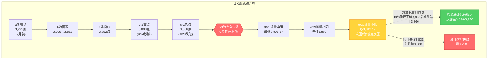
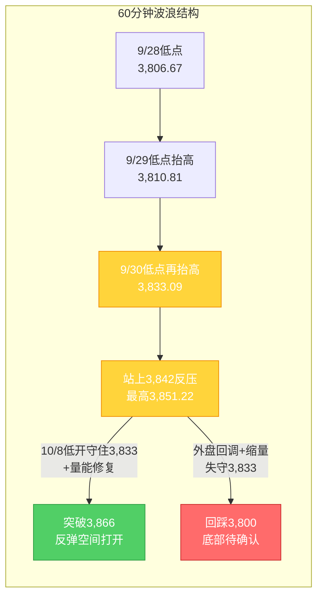

# A股晚报 - 2026年10月07日（国庆休市特刊·假期全球市场追踪）

> 数据截止时间：2026年10月7日 20:00（北京时间）；美股为10月6日（周二）收盘及10月7日盘前/期指，港股为10月7日收盘，日经/韩股为10月7日收盘，欧股为10月7日盘中（欧洲交易时段），大宗商品、汇率与美债收益率为10月7日盘中
> 报告类型：国庆休市特刊 —— 节前最后交易日（9/30）复盘 + 假期全球市场动态追踪（10/2-10/7）+ 节后（10/8）开盘策略
> 核心观点：A股国庆长假**休市最后一日**（10月1日-10月7日休市，**10月8日周四复市**，港股通同步恢复）。节前最后交易日（9/30）上证指数红盘收官**+0.31%收3,842.19点**，放量收回3,842点（C浪低点反压），"C浪延伸末段寻底"初步确认。**假期收官日（10/7）外盘由"延续回暖"急转为"全线回调"**，**复市前夜风险偏好明显转弱**：①**港股10/7全线收跌、全天低位盘整**——恒生指数**-0.62%收24,130.50点**（跌150.06点）、恒生科技**-0.68%收4,194.49点**（跌28.59点）、国企指数**-0.57%收8,082.40点**，全日主板成交**947.0亿港元**（南向通道仍关闭）；**前期领涨的生物医药领跌**（金斯瑞生物科技**-12.70%**、晶泰控股/英矽智能跌超10%、歌礼制药/亚盛医药/和铂医药/云顶新药/再鼎医药跌超5%、康希诺生物跌近6%），**半导体/存储集体大跌**（澜起科技跌超6%、爱芯元智跌近6%、兆易创新跌超3%、江波龙跌超2%、华虹宏力跌超2%、中芯国际跌超1%），**大型科网股走弱**（阿里巴巴跌超2%、百度集团跌逾2%、美团/小米跌超1%）；**防御/低位方向逆势活跃**——机械板块全天领涨（**潍柴动力+4.68%收30.86港元**）、汽车电子指数一度涨超8%后收涨超4%（新焦点涨超6%）、SaaS（白鸽在线+15.28%）、地产/交运/纺织服装走强，**药明康德盘中触及219.20港元历史新高**（收218.4港元、约-0.09%），**现代中药集团尾盘直线拉升+14.75%**；②**亚太10/7全线杀跌**——日经225**-0.92%收70,035.71点**（险守7万点）、韩国KOSPI**-1.98%收6,803.90点**；③**欧洲10/7开盘下挫**——德国DAX30跌超1%、英国富时100 -0.52%、法国CAC40 -0.89%；④**美股10/7盘前/期指全线下挫**——道指期货跌超200点、标普500指数期货**-0.3%**、纳斯达克100指数期货**-0.7%**；⑤**美债长端再创2002年以来新高**——10年期收益率升破**5.30%**（逼近10/5的5.349%）、30年期升至约**5.7041%**（日内涨逾6bp）；⑥**美元指数走强**至约**102.30**（2025年4月以来高位），**现货黄金承压下挫**（日内先涨后跌、失守4,120美元，17:06跌约1%、收段报**4,124.89美元、-0.93%**，现货白银**-1.60%报60.35**）；⑦**国际油价逆势走高**——布伦特约**101.54美元/桶**（+0.90）、WTI约**90.17美元/桶**（+0.48），中东冲突推升通胀与避险；⑧**富时中国A50期货由早盘+0.09%转为收跌**（约**13,812点、-0.28%**）；⑨**今晚（10/8凌晨）两大关键变量**——北京时间**10/8 01:00** 390亿美元10年期美债拍卖、**10/8 02:00** 美联储9月货币政策会议纪要，CME显示10月维持利率概率约**79.5%**（加息25bp约20.5%）。**综合看，节后（10/8）A股"低开"概率较晨报时点明显上升**，操作建议：**节后不恐慌、低开不急于抄底**，核心观察**3,833/3,842点（首日承接位）**与**3,866点（c-2低点，周线底部反转确认位）**，**3,800点（20月均线）为最后防线**。

---

## ⚠️ 休市日特别说明

今日（2026年10月7日，周三）为**国庆假期休市最后一日**（国庆休市安排：10月1日至10月7日休市，**10月8日（周四）起照常开市**，港股通10月8日起恢复服务），A股当日无交易，**无"今日行情"可复盘**。本期晚报延续10月2日、10月5日、10月6日国庆休市特刊的处理方式，采用**"节前复盘 + 假期全球市场追踪 + 节后策略"**结构。所有A股行情数据为节前最后交易日（2026年9月30日）数据。

---

## 一、市场回顾

### 1. 节前最后交易日（9/30）A股主要指数表现

| 指数 | 收盘点位 | 涨跌幅 | 最高/最低点 | 说明 |
|------|---------|--------|------------|------|
| 上证指数 | 3,842.19 | **+0.31%**（涨11.74点） | 3,851.22 / 3,833.09 | 红盘收官，放量收回3,842点（C浪低点反压） |
| 深证成指 | 12,887.62 | **-0.11%** | — | 小幅收跌 |
| 创业板指 | 3,135.28 | **-0.23%** | — | 成长风格承压 |
| 科创50 | 1,530.01 | **-2.51%** | 1,569.34 / 1,530.01 | 半导体/科技领跌 |

**特征**：三大指数涨跌不一，上证指数红盘收官并站上3,840点。**大小盘、成长与价值极致分化**——权重（银行、地产、白酒、医药）支撑沪指，科技成长（半导体、CPO、元件）集体回调拖累科创50（周跌约5.7%）。上证指数9月累计下跌约**-3.8%**（月初约3,995点），月线收中阴。

### 2. 节前最后交易日（9/30）成交量能

| 指标 | 数值 | 说明 |
|------|------|------|
| 两市成交额 | **约1.44-1.45万亿元** | 较9/29地量（1.40万亿）小幅放量约285亿 |
| 北向资金 | **净买入9.71亿元** | 沪股通净卖出6.42亿、深股通净买入16.13亿（结构分化） |
| 主力资金（特大单） | 净流出32.12亿元 | 医药生物特大单净流入39.56亿居首 |

**资金特征**：量能较地量温和回升，放量收回3,842点为底部确认提供量能支撑；外资节前未现大幅撤离。

### 3. 节前最后交易日（9/30）市场情绪

| 指标 | 数值 | 说明 |
|------|------|------|
| 上涨家数 | 2,567只 | 占比约46.16% |
| 下跌家数 | 2,824只 | 占比约50.78%，跌多涨少 |
| 涨停家数 | **56只** | — |
| 跌停家数 | 13只 | — |

**情绪特征**：**"指数红、个股绿"背离**——沪指收涨但下跌家数多于上涨家数，赚钱效应集中在医药、白酒、银行等权重与红利方向，情绪谨慎偏中性。

### 4. 假期全球市场动态概览（10/2-10/7，重点更新10/7）

| 市场/资产 | 最新表现（截至10/7 20:00） | 方向 |
|-----------|--------------------------|------|
| 美股（10/6收盘） | 道指**+0.49%**（51,521.28）、标普**+0.58%**（7,818.93）、纳指**+0.45%**（27,599.79，**标普/纳指续创新高**） | 偏多（科技领涨） |
| **美股期指（10/7盘前）** | **道指期货跌超200点、标普500期指-0.3%、纳指100期指-0.7%** | **全线转弱** |
| 港股（10/6收盘） | 恒生指数**+1.0%**（24,280.56）、恒生科技**+0.94%**（4,223.08） | 偏多（低开高走、连续第二日收涨） |
| **港股（10/7收盘）** | **恒生指数-0.62%（24,130.50）、恒生科技-0.68%（4,194.49）、国企指数-0.57%（8,082.40）** | **全线回调（低位盘整）** |
| 日股（10/6→10/7） | 10/6 **+1.05%**（70,683.98）；**10/7 -0.92%（70,035.71）** | **冲高回落、险守7万点** |
| 韩股（10/6→10/7） | 10/6 **-0.89%**（6,941.39）；**10/7 -1.98%（6,803.90）** | **重挫** |
| 欧股（10/7盘中，欧洲交易时段） | **德国DAX30跌超1%、英国富时100 -0.52%、法国CAC40 -0.89%** | **开盘下挫** |
| 富时中国A50期货（10/7） | 早盘**+0.09%**→收盘约**13,812点（-0.28%）** | **由强转弱** |
| 现货黄金（10/7） | 约**4,124.89美元/盎司（-0.93%）**，失守4,120美元；现货白银**-1.60%（60.35）** | **承压下挫** |
| 国际油价（10/7） | **布伦特约101.54美元/桶（+0.90）**、WTI约**90.17美元/桶（+0.48）** | **逆势走高** |
| 美债10年期收益率（10/7） | 升破**5.30%**（逼近10/5的5.349%、2002年以来高位）；30年期约**5.70%** | **长端再创新高** |
| 美元指数（10/7） | 约**102.30**（2025年4月以来高位） | **走强** |
| 美联储10月维持利率概率 | **约79.5%**（加息25bp约20.5%） | 加息预期仍存 |

---

## 二、热点板块与异动分析

### 1. 节前最后交易日（9/30）领涨板块

申万31个一级行业**21涨10跌**，涨幅居前：

| 板块 | 涨跌幅 | 驱动因素 |
|------|--------|---------|
| 医药生物 | **+2.73%** | 创新药活跃，康希诺20cm涨停，主力净流入28.18亿居首 |
| 美容护理 | +1.70% | 消费防御，节前资金避险切换 |
| 食品饮料 | **+1.68%** | 白酒午后异动，金徽酒涨停 |
| 银行 | +1.47% | 红利防御+季末避险，权重护盘 |
| 钢铁 | +1.24% | 周期修复+低估值 |
| 农林牧渔 | +1.02% | 防御属性扩散 |

**驱动逻辑**：节前最后交易日资金呈现**"高低切换"**——从高估值科技成长切向低估值防御、消费、红利方向；能源活跃（煤炭+0.85%、三桶油上涨）。

### 2. 节前最后交易日（9/30）领跌板块

| 板块 | 涨跌幅 | 原因分析 |
|------|--------|---------|
| 电子 | **-2.38%** | 半导体走低，芯原股份跌超11% |
| 计算机 | -0.98% | 成长风格回调 |
| 机械设备 | -0.90% | 题材退潮 |
| 通信 | -0.62% | CPO/光通信走低 |
| 元件/PCB | 全天低迷 | 澳弘电子、协和电子跌停 |

### 3. 假期港股/海外板块异动（10/2-10/7）—— 由"全面回暖→结构分化→收官回调"

**10/2（国庆后首日）**：恒指大跌**-2.60%**失守24,000点、恒生科技-2.26%；金融、地产、医药、科技四大主线集体杀跌，**仅光通信逆势活跃**（南向通道暂停放大外围利空）。

**10/5**：港股**低开走高、尾盘直线拉升逆转**，恒指**+0.28%**报24,040.34点（收复24,000点）、恒生科技**+0.62%**；**PCB/覆铜板、半导体、光通信、AI应用集中爆发**；日经+2.40%。

**10/6**：港股**再度低开高走、连续第二日收涨**，恒指**+1.0%**报24,280.56点、恒生科技**+0.94%**报4,223.08点；**医药生物（创新药/CRO）大爆发**（维亚生物+23%、康希诺生物+14%）、**智谱+7.59%**（GLM-5.3上架Amazon Bedrock）；但**半导体/硬件设备/CPO逆势下跌**（中芯国际跌近2%）。

**10/7（收官日）**：港股**低开后全天低位盘整、主要指数全线收跌**，恒指**-0.62%**报**24,130.50点**、恒生科技**-0.68%**报4,194.49点、国企指数**-0.57%**报8,082.40点，主板成交**947.0亿港元**（南向暂停，缩量）。板块呈现**"前期强势股获利回吐、防御/低位方向逆势活跃"**：

| 方向 | 领涨/领跌个股及涨幅 | 驱动因素 |
|------|--------------|---------|
| **医药生物/创新药/CRO（领跌）** | **金斯瑞生物科技-12.70%**、晶泰控股/英矽智能**跌超10%**、歌礼制药/亚盛医药/和铂医药/云顶新药/再鼎医药**跌超5%**、康希诺生物**跌近6%**；**药明康德逆势触及219.20港元历史新高**（收218.4、约-0.09%） | 隔夜**美股医药/疫苗股走弱**（Moderna等承压）映射 + 金斯瑞增发/配售扰动 + 10/6大涨后获利回吐 |
| **半导体/存储（领跌）** | **澜起科技跌超6%**、爱芯元智跌近6%、兆易创新跌超3%、江波龙跌超2%、华虹宏力跌超2%、中芯国际跌超1% | **三星电子、SK海力士即将公布Q3财报**，分析师下调营收/利润预期（受韩元走强影响）+ 存储链高位回吐 |
| **大型科网股（走弱）** | 阿里巴巴**跌超2%**、百度集团**跌逾2%**、美团/小米**跌超1%**、MINIMAX-W走弱 | 风险偏好回落、前期涨幅兑现 |
| **机械（领涨）** | **潍柴动力+4.68%**（收30.86港元，主力净流入3,936.73万港元）、KFM金德、本末科技走高 | 工程机械/动力设备订单稳定性 + 机构上调目标价，成避险方向 |
| **汽车电子（活跃）** | 汽车电子指数一度**+8%**、收涨超4%（新焦点+6%、潍柴动力+逾4%） | 智能汽车产业链催化 |
| **SaaS/软件** | 白鸽在线**+15.28%**（月内累涨超35%，拟实施内资股转H股）、百融智能-W+10% | 资金追逐低位软件标的 |
| **地产/交运/纺服 + 现代中药** | 地产、部分交运、纺织服装走强；**现代中药集团尾盘直线拉升+14.75%** | 防御性资金集中 + 个股事件驱动 |

**结论**：港股10/7的**"全线回调、前期强势股（医药/半导体）领跌、防御方向承接"**，标志着假期外盘由10/6的"结构分化"进一步转向**"收官回调"**；**对节后A股映射应以下跌后的最新方向定价**——医药/半导体/科网的映射强度边际转弱，机械/汽车电子等低位方向吸引避险资金。

---

## 三、关键数据与事件回顾

### 1. 国内政策/事件（假期期间）

- **消费品以旧换新资金全部下达**（9/30，发改委+财政部）：2026年第4批**625亿元**超长期特别国债支持消费品以旧换新资金已全部拨付，**全年2,500亿元资金全部下达**——利好节后家电、汽车、零售。
- **国常会稳增长信号**（9/28）：强调"加大宏观政策逆周期调节力度""推出一批务实管用的增量政策"，并研究出台稳定房地产市场政策措施。
- **上海稳楼市新政落地**（9/28）：上海市住建委等四部门联合印发商品住房销售制度改革相关文件，房地产政策底特征明确。
- **央行流动性呵护**：公告**10月8日开展1.2万亿元3个月期买断式逆回购**（当月到期1万亿），**净投放2,000亿元**；下调**PSL利率0.25个百分点至1.5%**。
- **9月官方制造业PMI 50.1%**（9/30公布）：较上月上升0.3个百分点，**重回扩张区间**。

### 2. 假期消费与经济运行

- **上海消费（9/30-10/6）**：上海市商务委10/7披露，国庆假期**线上线下消费金额762.4亿元，同比增长9.9%**（线下400.4亿元、同比+15.1%；线上362亿元、同比+4.7%）；监测的19个市级商圈消费金额56.2亿元；**离境退税销售额同比大增47%**——线下增幅高于线上，消费动能温和修复。
- **全国以旧换新**：假期前3日，全国消费品以旧换新活动累计带动销售额**196.3亿元**、惠及**348.3万人次**。
- **政策定调**（China Daily，10/6）："假期消费彰显四季度良好开局"。

### 3. 海外关键事件

- **美股10/6（周二）收盘**：道指51,521.28（**+0.49%**）、标普500 7,818.93（**+0.58%**、**创新高**）、纳指27,599.79（**+0.45%**、**创新高**）；**光通信、储能概念涨幅居前，存储芯片股跌幅居前（希捷科技跌超9%、西部数据跌超5%）**；**纳斯达克中国金龙指数+0.31%**（智能未来、有道涨逾8%，万国数据、宝尊电商涨逾5%，蔚来、小鹏涨逾1%，**阿里巴巴下跌**）。
- **10/7盘前/盘中**：美股三大期指全线转弱（标普500期指-0.3%、纳指100期指-0.7%、道指期货跌超200点）；**10年期美债收益率升破5.30%、30年期升至约5.70%（2002年以来最高）**，美债收益率走高压制风险资产。
- **美联储**：**9月货币政策会议纪要**将于北京时间**10/8 02:00**公布（9/15-16会议，当时加息25bp至3.75%-4.00%）；CME显示美联储**10月维持利率概率约79.5%、加息25bp概率约20.5%**；下次FOMC为**10月27-28日**。
- **美债拍卖**：北京时间**10/8 01:00**，美国财政部拍卖**390亿美元10年期国债**，为本周首次重大考验（检验长端需求）。
- **地缘与油市**：中东冲突（霍尔木兹海峡航运风险）推高油价与通胀预期，布油10/7回升至约101.5美元，与"美债长端走高"形成"通胀担忧→收益率上行"的负反馈。

### 4. 机构观点（节后展望）

- **历史统计（证券时报·数据宝）**：2000年以来**节后首日上证指数17次收涨、上涨概率65.38%**；沪深300上涨概率66.67%、创业板指62.5%。
- **中国银河证券**：节后前期压制市场的交投因素缓解，市场预期有望逐步修复，但**海外扰动偏多，行情更偏向结构性轮动**；10月进入**三季报业绩验证窗口**。
- **国泰基金**：节前市场缩量至极，**节后"开门红"概率较高、小盘成长弹性占优**，但需警惕假期海外市场扰动。
- **部分券商**：国庆后大盘可能**快速上行至T+5日附近**；科技仍是四季度核心主线之一。
- **风险提示**：中银证券等提示**美债问题显化或加剧短期交易难度**，需看长端美债能否稳住。

---

## 四、海外市场联动

### 1. 美股三大指数（10/6收盘）及10/7盘前/期指

| 日期 | 道琼斯 | 标普500 | 纳斯达克 | 备注 |
|------|--------|---------|---------|------|
| 10/5（周一收盘） | 51,267.90（**+0.18%**） | 7,773.95（**+0.66%**） | 27,477.31（**+1.05%**，创收盘新高） | 英伟达、台积电齐创历史新高 |
| 10/6（周二收盘） | 51,521.28（**+0.49%**） | 7,818.93（**+0.58%**，**创新高**） | 27,599.79（**+0.45%**，**创新高**） | 光通信/储能强、存储链弱（希捷-9%）；中概金龙+0.31% |
| **10/7（盘前/期指）** | **道指期货跌超200点** | **标普500期指-0.3%** | **纳斯达克100期指-0.7%** | **美债收益率走高压制，市场等待美联储纪要** |

**关键解读**：美股10/5-10/6在"加息预期降温→利率敏感型成长股领涨"逻辑下连续收涨、标普/纳指续创新高；但**10/7盘前三大期指全线下挫**，主因**美债长端收益率再创2002年以来新高**（通胀担忧+财政赤字+AI相关债券发行激增）压制估值，市场转向等待**美联储9月会议纪要**。**"美股映射"由"偏多"转为"偏空"，科技链（存储/半导体）先行转弱**。

### 2. 港股（10/2-10/7）—— 假期最大"过山车"变量

| 日期 | 恒生指数 | 恒生科技 | 成交 | 备注 |
|------|---------|---------|------|------|
| 10/2 | 失守24,000（**-2.60%**） | -2.26% | — | 四大主线集体杀跌，南向暂停放大波动 |
| 10/5 | **24,040.34**（+0.28%） | 4,183.68（+0.62%） | 981.02亿港元 | 低开高走逆转，收复24,000点 |
| 10/6 | **24,280.56**（+1.0%） | 4,223.08（+0.94%） | 982.65亿港元 | 低开高走、连续第二日收涨；医药/AI应用爆发 |
| **10/7** | **24,130.50**（**-0.62%**） | **4,194.49**（**-0.68%**） | **947.0亿港元** | **全线回调、低位盘整**；医药/半导体领跌，机械/汽车电子逆势活跃 |

**10/7结构**：**医药生物（创新药/CRO）与半导体/存储领跌，大型科网走弱，机械/汽车电子/地产/SaaS等防御与低位方向逆势活跃**——港股由"结构分化"转为"收官回调"，映射方向由"医药+AI双线"转向**"防御+低位补涨"**。

### 3. 欧洲/亚太（10/7）

| 市场 | 表现（10/7） | 备注 |
|------|-------------|------|
| 日经225 | **-0.92%**，收**70,035.71点** | 冲高回落，**险守7万点整数关口**（铠侠-4.46%、瑞穗-2.4%、东京电子-2.38%） |
| 韩国KOSPI | **-1.98%**，收**6,803.90点** | **重挫**（存储链与三星/SK海力士财报预期拖累） |
| 德国DAX30 | **跌超1%**（10/7欧洲交易时段） | 欧股开盘下挫 |
| 英国富时100 | **-0.52%** | — |
| 法国CAC40 | **-0.89%** | — |

**特征**：**亚太10/7"日韩普跌、港股回调"**，欧洲"开盘下挫"——**外围风险偏好由10/6的"结构分化"进一步转向"收官回调"**，对A股节后构成**"整体偏空、低开压力上升"**的映射。

### 4. 大宗商品

| 品种 | 最新价（10/7） | 涨跌幅 | 关键驱动 |
|------|--------------|--------|---------|
| 布伦特原油（12月） | 约**101.54美元/桶** | **+0.90** | **重回100美元上方**；中东冲突（霍尔木兹海峡）推升风险溢价与通胀预期 |
| WTI原油（11月） | 约**90.17美元/桶** | **+0.48** | 跟随布油走高 |
| 现货黄金 | 约**4,124.89美元/盎司** | **-0.93%**（失守4,120美元） | **美元指数走强（约102.30）+ 美债收益率续升**施压；日内先涨后跌 |
| 现货白银 | 约**60.35美元/盎司** | **-1.60%** | 跟随黄金走弱 |

**驱动逻辑**：
- **油市**：10/7油价**逆势走高**（重回100美元上方）——地缘（中东/霍尔木兹）风险溢价再起，与美债长端走高的"通胀担忧"形成共振；**油价回升对A股油气/煤炭板块压制边际减弱**，但通胀预期上行反压制成长股估值。
- **贵金属**：**"美元走强+美债收益率续升"双杀**，黄金10/7承压下挫（-0.93%），与10/6"探底回升"口径反转，**避险资产亦未能提供支撑**。

---

## 五、汇率与利率

| 指标 | 数值 | 变化/说明 |
|------|------|----------|
| 人民币中间价（9/30） | **6.7351** | 调升60个基点，维持强势 |
| 离岸人民币（10/6） | **6.7037** | 较上周五纽约尾盘涨21基点，日内6.7035-6.7148 |
| **美元指数（10/7）** | 约**102.30** | **走强**，徘徊于2025年4月以来高位附近（10/6约101.833） |
| **美债10年期收益率（10/7）** | 升破**5.30%** | 逼近10/5盘中高点5.349%（**2002年以来最高**）；10/6曾小幅回落至约5.27% |
| 美债30年期收益率（10/7） | 约**5.70%**（日内一度**5.7041%**） | **再创2002年以来新高**，长端压力未减 |
| 美联储10月维持利率概率 | **约79.5%**（加息25bp约20.5%） | 加息预期仍存 |
| 债市策略师调查（10/7） | 预计10年期3个月内降至5.00%、6个月内4.90%、1年内4.75% | 中期方向偏下行，但短期仍高企 |

**特征**：①**10/7美债长端"再创2002年以来新高"（30年期约5.70%、10年期升破5.30%）**，是对成长股估值的直接压制；②**美元指数走强至约102.30**，人民币（离岸6.7037）承压但整体仍偏强；③**"短端（加息预期）未进一步降温、长端（通胀/财政）续升"格局延续甚至强化**，晨报"成长股利率弹性修复利好需打折"的判断被进一步验证——**当前应继续下调该利好权重**；④央行10/8加量净投放2,000亿，季末后资金面平稳；⑤**今晚（10/8凌晨）10年期美债拍卖 + 9月会议纪要为复市前最后变量**。

---

## 六、收盘后重要信息 / 节后关注

### 1. 节后交易日历（10/8复市）

- **10月8日（周四）**：A股复市，当日央行开展**1.2万亿元买断式逆回购**（净投放2,000亿）；港股通恢复服务；关注首日**低开幅度**与**3,833/3,842支撑**有效性；**01:00** 美国10年期美债拍卖、**02:00** 美联储9月会议纪要（复市前最后外盘变量）。
- **10月9日（周五）**：节后第2个交易日，关注能否**放量站上3,866点**（周线底部反转确认的关键）。
- **10月13日起**：三季报披露开启（沪市**有研新材10月13日**首披，金盘科技、川投能源10月14日）。
- **10月27-28日**：美联储FOMC议息会议（当前10月维持利率概率约79.5%）。

### 2. 假期后重要信息

- **美联储会议纪要**：**北京时间10/8 02:00**公布9月货币政策会议纪要，关注官员对通胀与加息路径的表态——为10/8复市前最后一个关键外盘变量。
- **限售解禁**：**泰金新能（688813）10月8日解禁192.30万股**（占总股本1.20%、解禁市值约2.46亿元）——节后首日解禁个股需关注冲击。
- **夜盘走势**：美股10/7正常交易（北京21:30开盘），报告时点为盘前/期指（全线转弱）；港股10/7收跌；商品（油价走强、黄金走弱）。
- **假期消费收官**：上海国庆消费（9/30-10/6）同比+9.9%、离境退税+47%，全国以旧换新前3日带动196.3亿元——为节后消费板块提供基本面支撑。

### 3. 节后需跟踪的假期信号（截至10/7）

- **外盘累计表现**：**假期"先扬后抑"**——10/2港股领跌→10/5-10/6连续收涨→**10/7全线回调**；美股10/5-10/6续创新高但10/7期指转弱。**收官日转弱使节后"低开"概率上升**，但假期整体外盘仍略偏多，低开幅度或有限。
- **港股结构**：10/7港股"医药/半导体领跌、机械/汽车电子逆势活跃"，节后A股映射应**以下跌后的最新方向定价**（下调医药/半导体，关注机械/汽车电子等低位方向）。
- **美债长端收益率**：**10/7再创2002年以来新高（30年期约5.70%）**，能否在美债拍卖后稳住是节后成长股估值的关键。
- **地缘与油价**：中东冲突对油价（布油重回100上方）与通胀预期的扰动；**"油价涨→通胀预期升→美债长端升"**的传导链需警惕。
- **政策落地**：国常会增量政策、上海稳楼市新政、以旧换新全年2,500亿元资金全部下达的执行力度。

---

## 七、波浪理论多周期分析

> 说明：A股休市，波浪结构基于节前最后交易日（9/30）数据；本部分结合假期外盘（美股/港股/日股/欧股，含**10/7收官日转弱**最新走向）推演节后（10/8）路径。

### 1. 月K线波浪分析
- **当前波浪位置**：大周期第2浪C浪延伸**末段**，9月月K线收中阴线，月末收盘3,842.19点**站上20月均线（3,800-3,810点）**
- **浪型结构描述**：
  - 大结构：2024年9月2,689点→2026年6月4,197点为第1浪上升
  - 第2浪ABC调整：4,197点→3,806.67点（9/28盘中最低）
  - 9月月K线收中阴（月跌约-3.8%），月线MACD死叉绿柱持续，但月末企稳使绿柱扩张动能减弱
- **关键目标位**：
  - 月度强支撑：**3,800-3,810点**（20月均线，9月末已站稳上方）
  - 月度核心压力：3,866点（c-2低点）、3,898点（c-1高点）、3,980-3,985点（5月均线）
  - C浪延伸加速目标：3,750点（仅当有效跌破3,800点时启用）
- **验证条件**：守住3,800点（20月均线）并站上3,842点，月度底部信号初现，待10月月K线（10/8起）确认

### 2. 周K线波浪分析
- **当前波浪位置**：上周（第40周）周K线收**带长下影的小阴/十字星**，跌势放缓、企稳迹象增强
- **浪型结构描述**：
  - 节前周（9/28-9/30，3个交易日）：9/28放量中阴探至3,806.67点→9/29地量小阳→9/30放量小阳收3,842.19点
  - 周线仍位于5周（3,900-3,910）、10周（3,885-3,895）均线下方，短期均线空头排列未改，但长下影显示下方支撑增强
- **关键目标位**：
  - 周度支撑：3,833点（9/30低点）、3,800点（20月均线，核心）
  - 周度压力：**3,866点（c-2低点，核心）**、3,898点（c-1高点）、3,900-3,910点（5周均线）
- **验证条件**：节后首周（仅2日）**能否放量站上3,866点**——站稳则周线底部反转信号增强；**假期外盘"先扬后抑、收官日转弱（10/7亚太普跌+美债续升+美股期指下挫）"使首周向上验证的难度上升**，需以量能修复为先决条件

### 3. 日K线波浪分析（重点）
- **当前波浪位置**：**C浪延伸末段寻底初步确认**——"放量中阴（9/28）+地量小阳（9/29）+放量收回C浪低点反压（9/30）"组合成立
- **浪型结构描述**：
  - 9/28放量中阴-1.67%（最低3,806.67，"最后一跌"）→9/29地量小阳（1.40万亿一年新低）→9/30放量小阳+0.31%收3,842.19，成功收回3,842点（C浪低点反压）
  - 成交1.45万亿温和放量，量价配合良好，低点逐级抬高（3,806.67→3,810.81→3,833.09）
- **关键目标位**：
  - 第一支撑：**3,842点（已收回转支撑）**、3,833点（9/30低点）
  - 强支撑：**3,800点（20月均线）**
  - 第一压力：**3,866点（c-2低点，节后核心观察位）**
  - 强压力：3,898点（c-1高点）
- **验证条件**：
  - 向上确认：节后放量站上3,866点 → 底部反转确立，打开反弹空间至3,898点
  - 向下确认：节后跌破3,833点并失守3,800点 → 底部信号失效，下看3,750点
  - **假期变量（更新至10/7收官日）**：外盘由"10/6结构分化"转为**"10/7全线回调"**（港股-0.62%、日经-0.92%、韩股-1.98%、欧股跌超1%、美股期指-0.3%~-0.7%、美债长端创新高），**节后"低开"概率上升**；同时A50期货10/7由早盘+0.09%转为收跌-0.28%，**提示首日或低开于3,833点附近**，需重点观察低开后的承接与量能

### 4. 60分钟K线波浪分析
- **当前波浪位置**：60分钟级别**底背离确认**，短期趋势转多（基于9/30收盘）
- **浪型结构描述**：
  - 60分钟低点逐级抬高：3,806.67（9/28）→3,810.81（9/29）→3,833.09（9/30）
  - 60分钟MACD零轴下方绿柱持续缩短并逼近金叉，KDJ超卖区域金叉后向上
- **关键目标位**：短期支撑3,842/3,833点；短期压力3,866点、3,898点
- **验证条件**：60分钟底背离已确认+站上3,842点；**节后首个60分钟能否守住3,833点为短线转强/转弱分水岭**——外盘收官日转弱使其承压

### 5. 30分钟K线波浪分析
- **当前波浪位置**：30分钟级别企稳回升，站上短期均线（基于9/30收盘）
- **浪型结构描述**：
  - 30分钟级别9/30全天震荡上行，午后维持强势收于3,842.19点
  - 30分钟MACD金叉后红柱温和放大，KDJ中位区向上；但量能未显著放大，上攻动能需节后量能配合
- **关键目标位**：关键支撑3,833/3,842点；短期压力3,851点（9/30高点）、3,866点
- **验证条件**：节后30分钟能否放量突破3,851点并站稳3,842点

### 6. 波浪图（Mermaid绘制）

**日K线波浪结构图**：


**60分钟波浪结构图**：


### 7. 波浪理论综合判断

| 维度 | 判断 |
|------|------|
| 多周期共振状态 | 月K/周K仍偏空（均线空头排列），日K/60分钟/30分钟底部信号确认、共振转多；**但假期收官日（10/7）外盘全线回调（亚太普跌+欧股下挫+美股期指转弱+美债长端创新高）**，小周期修复的外部环境由"改善"转为"承压"，大小周期背离的修复节奏被打断；港股10/7"医药/半导体领跌"提示修复呈结构性 |
| 当前操作级别 | **日线级别**（C浪延伸末段寻底初步确认，关注3,866点突破与3,842/3,800点支撑） |
| 后续演变路径（节后10/8-10/9） | **40%乐观**（低开高走、放量站上3,866点→周线底部反转确认，反弹至3,898-3,920点）、**38%中性**（低开后3,820-3,866区间震荡消化、量能温和修复）、**22%悲观**（美联储纪要偏鹰/美债长端续升+外盘回调共振→有效跌破3,800点，下看3,750点） |
| 关键拐点信号 | 向上：放量站上3,866点（c-2低点）+北向恢复净流入+美债长端回落；向下：有效跌破3,800点（20月均线）+美债长端续升（30年期站稳5.70%上方）+放量下跌 |
| 风险提示 | ①C浪延伸是否终结需节后确认（当前仅为"初步确认"）；②**10/7外盘收官日全线回调，10/8"低开"概率上升**，且**10/8凌晨美债拍卖+美联储9月会议纪要为复市前最后变量**；③**30年期美债收益率10/7再创2002年以来新高（约5.70%）、10年期升破5.30%**，"通胀预期（油价涨）→长端上行→成长股估值受压"的负反馈需警惕；④港股10/7医药/半导体领跌，或对A股科技链/医药链形成低开扰动；⑤波浪理论在C浪延伸末段+地量整理阶段预测精度降低，需结合政策面、外盘与节后量能综合判断 |

> **规律分析引用（第40周运行规律分析）**：该报告预测节后首周（第41周，10/8-10/9）上证运行区间**3,810-3,900点**，判断"**震荡企稳、偏多修复（先抑后扬）**"，乐观/中性/悲观概率45%/35%/20%；并提示"3,866点为周线底部反转确认位、3,800点为最后防线"。本报告结合假期**收官日最新外盘（10/7港股全线回调、日经/韩股普跌、欧股下挫、美股期指转弱、美债长端再创2002年以来新高）**，**将路径概率下修为"乐观40%/中性38%/悲观22%"**——较10/7晨报"50%/33%/17%"**进一步下修乐观、上调悲观**，主因**收官日外盘由"结构分化"急转为"全线回调"**，且**10/8凌晨美债拍卖与会议纪要构成复市前最后变量**，故对乐观路径由"结构性打折"升级为"概率下修"。

---

## 八、晨报复盘（休市特刊适配版）

> 说明：今日（10/7）为休市日，**无当日行情**，传统"晨报预测 vs 当日实际"复盘不适用。本期复盘调整为：**"10月7日晨报对假期外盘/收官日的预判" vs "10月7日假期外盘实际表现（截至20:00）"** 的追踪复盘；节后10/8开盘方向仍待验证。

### 1. 核心判断回顾（假期外盘追踪口径）

| 判断项目 | 10/7晨报预判 | 10/7实际（截至20:00） | 准确度 | 备注 |
|---------|------------|---------------------|-------|------|
| 港股10/7 | "低开（-0.45%）、高位休整" | 恒指低开后**全天低位盘整、收跌-0.62%（24,130.50）** | ✓ | 方向命中，回调略超"休整" |
| 亚太10/7 | "先抑后扬（日经低开0.14%、韩股低开1.11%后双双翻红）" | **日经-0.92%（70,035.71）、韩股-1.98%（6,803.90）全线收跌** | ✗ | 早盘"翻红"未延续，尾盘杀跌 |
| 美股10/7盘前 | "外盘偏多（隐含）" | **三大期指全线下挫**（标普期指-0.3%、纳指100期指-0.7%） | ✗ | 方向误判 |
| 看涨板块：医药生物/创新药 | "映射修复（防御+成长兼具）" | 港股**医药生物领跌**（金斯瑞-12.70%、晶泰/英矽-10%+） | ✗ | 10/6爆发后10/7重挫 |
| 看涨板块：AI应用/平台经济 | "情绪修复弹性" | 智谱、阿里巴巴**走弱**（阿里跌超2%） | ✗ | 回调 |
| 看跌板块：半导体存储/CPO | "细分优先级下调、映射转弱" | 港股**半导体/存储集体大跌**（澜起-6%+、华虹-2%+） | ✓ | 精准命中 |
| 美债长端 | "30年期约5.64%高位，若续升压制成长股" | **10年期升破5.30%、30年期升至约5.70%（2002年以来新高）** | ✓ | 续升兑现（程度超预期） |
| 油价 | "重回100美元上方、压制边际减弱" | **布油约101.54（+0.90）** | ✓ | 命中 |
| 黄金 | "探底回升、多空均衡震荡偏强" | **现货黄金跌近1%（4,124.89）、失守4,120** | ✗ | 方向误判（美元+美债双杀） |
| A50期货 | "偏强（约13,869、+0.09%）" | **由早盘+0.09%转为收跌-0.28%（13,812）** | ✗ | 由强转弱 |
| 节后区间3,810-3,900点 | 待10/8验证 | 未开盘 | — | 待验证 |
| 北向资金0-50亿 | 待10/8验证 | 未开盘 | — | 待验证 |

### 2. 准确率量化评估（追踪口径）

- 方向性变量识别准确率：**约40%（4/10）**——港股回调、半导体/存储转弱、美债长端续升、油价回升命中；亚太"先抑后扬"、美股期指、医药、AI应用、黄金、A50期货误判
- 关键事件预判准确率：**约50%（2/4）**——美债长端续升、半导体转弱命中；医药爆发回落、黄金方向误判
- **追踪综合准确率：约42%**——较10/6特刊（约75%）**显著回落**，核心偏差为**"收官日外盘方向误判"**：晨报基于"假期中段回暖+10/6结构分化"线性外推"收官日偏多、亚太先抑后扬"，实际**收官日外盘全线回调**（外盘对节后方向的权重在"复市前一日"发生反转）
- **但需肯定**：晨报**风险预警部分高度有效**——"港股/外盘映射反向风险"（港股10/7低开延续调整）、"美债长端续升风险"、"美联储官员转鹰+今晚美债拍卖/纪要"三条中高风险提示**均在本日兑现**，使"对乐观路径结构性打折"的判断方向正确（本报告据此进一步下修乐观概率）

### 3. 偏差根因分析

【偏差1】"亚太10/7先抑后扬、日经/韩股翻红"误判
- 偏差描述：晨报依据10/7早盘数据判断"日经低开后翻红、韩股低开高走"，实际**日经-0.92%、韩股-1.98%全线收跌**（韩股重挫）
- 根本原因：**逻辑误判+信息缺失**——将"早盘翻红"等同于"全天收涨"，未充分纳入"三星/SK海力士财报预期下调→存储链杀跌"与"美债长端晨间续升"的全天压制
- 信息缺口：当时未获取到"存储链Q3财报预期下调"的当日利空
- 逻辑缺陷：**"复市前一日"的外盘方向应由全天资金面（美债/美元）决定，而非开盘动能**；晨报将早盘"翻红"线性外推全天
- 改进措施：**长假"复市前一日"（第7日）的外盘判断，应以"美债长端收益率+美元指数+当日实时财经快讯"为全天方向锚**，不采信早盘"翻红"作为全天定调

【偏差2】"医药生物/创新药映射修复"误判（10/7口径）
- 偏差描述：晨报将医药生物/创新药列为节后A股映射修复优先方向（依据10/6港股医药大爆发），实际**10/7港股医药生物领跌**（金斯瑞-12.70%）
- 根本原因：**逻辑误判（单日线性外推）**——将假期中段（10/6）的强势板块直接外推至收官日与节后，忽视"前期强势股在收官日集中获利回吐"
- 改进措施：**假期板块映射须每日滚动更新，并以"收官日（复市前一日）最新方向"作为节后定价基准**——当中段强势板块在收官日出现"获利回吐式大跌"时，节后映射应下调其优先级

【偏差3】"黄金探底回升/偏强"误判
- 偏差描述：晨报判断黄金"多空均衡、震荡偏强"，实际**10/7现货黄金-0.93%、失守4,120美元**
- 根本原因：**技术分析局限**——10/6黄金"探底回升"被线性外推，忽视"美元指数走强（约102.30）+美债收益率续升"对金价的**双杀**效应
- 改进措施：**跟踪金价须以"美元指数+实际利率（美债名义收益率-通胀预期）"为核心驱动**，当二者同步走高时，应对短期反弹预判做反向修正

### 4. 分析检查清单

- [x] 趋势判断前是否检查：隔夜外盘走势 ✓（美股/港股/日股/韩股/欧股均覆盖）
- [x] 趋势判断前是否检查：假期利率与汇率市场（美债收益率、美元指数、美联储预期） ✓（含"盘中vs收盘"差异）
- [x] 点位计算是否考虑：前期高低点、均线支撑/压力 ✓（3,800/3,833/3,842/3,866/3,898）
- [x] 板块分析是否覆盖：**假期港股板块异动的逐日跟踪与"收官日最新方向"定价** ✓（本期新增"收官日定价"检查项）
- [x] 风险提示是否充分：长假"二次映射/反向映射"风险 ✓（晨报风险预警本日兑现）
- [x] 波浪分析检查项：多周期+假期变量结合 ✓

### 5. 本次追踪发现的新规则

- **规则1（趋势分析）**：长假**"复市前一日（第7日）"的外盘方向对节后开盘具有决定性影响**——当收官日出现"美债长端续升+美股期指下挫+亚太普跌"的全线回调时，节后"低开"概率显著上升，乐观路径权重应由"结构性打折"升级为"概率下修"
- **规则2（板块选择）**：假期中段强势板块若在**收官日出现"获利回吐式大跌"**，则节后A股映射应**以收官日最新方向定价**，不可用中段强势板块线性外推（如10/6医药大爆发→10/7医药领跌）
- **规则3（资金面分析）**：长假期间"**油价上涨→通胀预期升温→美债长端收益率上行**"的传导链一旦形成，将同时压制成长股估值与贵金属（黄金），应下调"加息预期降温利好"与"黄金偏强"两类预判的权重
- **规则4（点位计算）**：复市前一日外盘转弱时，节后首周区间预测中枢应**下移至区间下沿（如3,810-3,870点）**，并强化"3,833点为短线强弱分水岭"的观察

### 6. 规则库更新

```
###趋势分析 长假"复市前一日（第7日）"的外盘方向对节后开盘具有决定性影响——当收官日出现"美债长端续升+美股期指下挫+亚太普跌"的全线回调时，节后"低开"概率显著上升，乐观路径权重应由"结构性打折"升级为"概率下修"（发现日期：2026年10月7日）
###板块选择 假期中段强势板块若在收官日出现"获利回吐式大跌"，则节后A股映射应以收官日最新方向定价，不可用中段强势板块线性外推（发现日期：2026年10月7日）
###资金面分析 长假期间"油价上涨→通胀预期升温→美债长端收益率上行"的传导链一旦形成，将同时压制成长股估值与贵金属（黄金），应下调"加息预期降温利好"与"黄金偏强"两类预判的权重（发现日期：2026年10月7日）
###点位计算 复市前一日外盘转弱时，节后首周区间预测中枢应下移至区间下沿（如3,810-3,870点），并强化"3,833点为短线强弱分水岭"的观察（发现日期：2026年10月7日）
```

---

## 九、策略回顾与调整

### 1. 假期策略回顾（10/7晨报 vs 假期收官日实际）

| 策略项目 | 10/7晨报建议 | 假期实际（截至10/7） | 执行效果 | 备注 |
|---------|------------|--------------------|---------|------|
| 短线仓位 | 5%（节后低开可小幅试探） | 待10/8执行 | — | 收官日外盘转弱，低开试探胜率下降 |
| 买入条件 | 节后守住3,833/3,842并放量站上3,866 | 尚未开盘 | — | 前置条件不变，但难度上升 |
| 止损位 | 3,795点（收盘破3,800止损） | 尚未开盘 | — | 维持 |
| 短线标的 | 医药生物、AI应用/平台经济、半导体设备 | 港股**医药/AI应用/半导体齐跌**（仅机械/汽车电子逆势） | ✗ | 需下调医药/AI/半导体优先级，关注机械/汽车电子 |
| 中线仓位 | 15-20% | 待10/8执行 | — | 收官日转弱，宜维持下沿 |

### 2. 中线策略调整（面向节后10/8）

- **当前中线方向**：**【持有/观望】**（较10/7晨报"持有/小幅布局"**下调半档**）
- **方向调整原因**：假期外盘由10/6"结构分化"演进为**10/7"全线回调"**——港股收跌、亚太普跌、欧股下挫、美股期指转弱、**美债长端再创2002年以来新高（30年期约5.70%）**，且**10/8凌晨美债拍卖+美联储纪要为最后变量**——**净影响由"偏多但结构性"转为"中性偏谨慎"**
- **中线仓位建议**：**15%**（维持下沿，原因：外盘收官日转弱+C浪底部信号待验证+美债长端高企；待10/8量能与美债拍卖/纪要落地后再评估是否上修）
- **中线目标区间**：上证指数 **3,810点 - 3,898点**（兑现顺序转"先抑"）；**下沿支撑3,800点**
- **中线止损位**：**3,800点**（有效跌破则底部信号失效，下看3,750点）
- **中线布局板块调整**：
  - **下调优先级**：**医药生物/创新药/CRO**（10/7港股领跌）、**半导体/存储**（10/7港股集体大跌）、**AI应用/平台经济**（10/7走弱）——均因"收官日获利回吐"
  - **维持**：**半导体设备/材料/先进封装**（细致分拆，优先于存储/CPO）、**银行/红利**（高股息+央行宽松，攻守兼备）
  - **上调优先级（防御/低位）**：**机械/工程机械、汽车电子**（10/7港股逆势领涨）、**房地产链**（上海稳楼市新政，防"利好兑现"分化）、**消费（家电/汽车/零售）**（上海国庆消费+9.9%、以旧换新全年2,500亿）
  - **小幅上修**：**能源（油气/煤炭）**（布油重回100上方，压制边际减弱）
  - **回避**：高位连板股、退市风险/ST个股、限售解禁个股（如泰金新能10/8解禁）、三季报或不及预期的高位成长股

### 3. 明日（节后10/8）策略要点

- **短线**：**【观望为主】**，关注 **3,833点**（短线强弱分水岭）、**3,842点**（支撑）、**3,866点**（转强确认）、**3,800点**（止损）
- **中线**：**【持有/观望】**，关注 **3,866点**（压力/确认位）与 **3,800点**（支撑）
- **仓位分配**：短线5% + 中线15% + 现金80%
- **节后操作前提**：
  1. **先看10/8凌晨（01:00美债拍卖、02:00美联储纪要）**——若偏鹰/美债长端续升，则**不急于抄底**、等待量能确认
  2. 开盘先看**低开幅度**——外盘收官日转弱，低开概率上升；**低开不恐慌**，观察3,833点是否守住、是否低开高走
  3. 看**量能**——成交能否回升至1.6万亿以上（站上3,866点需量能配合）
  4. 看**板块结构**——医药/半导体/AI应用能否止跌；**机械/汽车电子/地产/消费**等防御与低位方向能否承接
  5. 若会议纪要偏鹰 + 美债长端续升 + 量能不足 → **维持低仓位、待企稳**；若低开守住3,833并放量 → 可按上述结构小幅布局

### 4. 策略复盘规则输出

```
###趋势分析 节后首日方向应"以复市前一日（收官日）外盘全天方向为锚"，当收官日外盘全线回调（美债长端续升+美股期指下挫+亚太普跌）时，应下调乐观路径概率、提高低开与区间下沿的权重（发现日期：2026年10月7日）
###板块选择 当假期"中段强势板块"在收官日获利回吐式领跌时，节后A股应下调该板块映射优先级，转而关注收官日"逆势活跃的防御/低位方向"（如机械、汽车电子）（发现日期：2026年10月7日）
```

---

## 十、风险提示

1. **市场系统性风险**：
   - **美债长端收益率续创2002年以来新高风险**：10年期升破**5.30%**、30年期约**5.70%**，若续升将压制高估值成长股估值；**"油价涨→通胀预期升→长端升"负反馈**需警惕
   - **美联储纪要与美债拍卖风险**：**10/8 01:00** 390亿美元10年期美债拍卖、**10/8 02:00** 9月会议纪要，若偏鹰或需求不佳，或压制复市前风险偏好
   - **假期收官日外盘转弱风险**：港股10/7收跌、亚太普跌、美股期指转弱，**节后A股低开压力上升**
   - **地缘政治风险**：中东局势（美伊/霍尔木兹海峡）扰动油价与全球通胀预期
2. **个股风险事件**：
   - **限售解禁**：**泰金新能（688813）10月8日解禁**（解禁市值约2.46亿元），节后首日关注冲击
   - **三季报披露风险**：10月13日起三季报开启，**高位成长股（尤其医药/半导体）业绩验证风险**（10/7港股医药/半导体已现回调）
   - **高位连板股退潮**：节前连板题材股节后存获利回吐风险
3. **政策不确定性风险**：
   - 房地产（上海稳楼市新政）、国常会增量政策的细则与执行力度，地产板块持续性存疑（节前已现"利好兑现"分化）
   - 中美经贸磋商后续进展
   - 四季度增量政策的落地节奏与力度

---

## 十一、信息来源

1. **官方数据来源**：上海证券交易所/深圳证券交易所（休市安排公告）、国家统计局、中国人民银行、财政部、金融监管总局、国务院、商务部、交通运输部、国家发展改革委、上海市商务委、美国联邦储备委员会（FOMC）、美国财政部（Treasury）、香港交易所（HKEX）
2. **权威财经媒体**：新华社（新华网《港股7日跌0.62% 收报24130.5点》《美元指数6日下跌》）、央视财经、中国证券报、上海证券报（中国证券网）、证券时报（人民财讯/e公司/数据宝）、证券日报、每日经济新闻、财联社、华尔街见闻、中国基金报、经济日报、21世纪经济报道、China Daily
3. **数据平台**：东方财富（Choice数据）、同花顺、Wind资讯、CME FedWatch、Nasdaq.com、Nikkei（日经官网）、FRED（圣路易斯联储）、格隆汇、证券之星、Boursier.com、report.az
4. **海外信息源**：Reuters、Bloomberg、Sharecast、Fidelity UK、Morningstar、香港交易所（HKEX）

> 数据截止时间：2026年10月7日 20:00（北京时间）；美股为10月6日（周二）收盘及10月7日盘前/期指，港股为10月7日收盘，日经/韩股为10月7日收盘，欧股为10月7日盘中（欧洲交易时段），大宗商品、汇率与美债收益率为10月7日盘中。

---

## 十二、文档更新检查

```
## 文档更新建议

### 无需更新
AGENTS.md 已包含"休市特刊"流程（非交易日晚报采用"节前复盘 + 假期全球市场追踪 + 节后策略"三段式结构），当前实际执行与文档一致，无需更新。
README.md 的文件结构与功能说明与实际一致，无需更新。
```

---

*本期晚报为国庆休市特刊（假期全球市场追踪版·节后开盘前瞻），由AI代理自动生成，仅供参考，不构成投资建议。投资有风险，入市需谨慎。*
*数据截止时间：2026年10月7日 20:00（北京时间）*