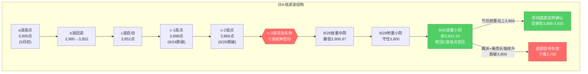
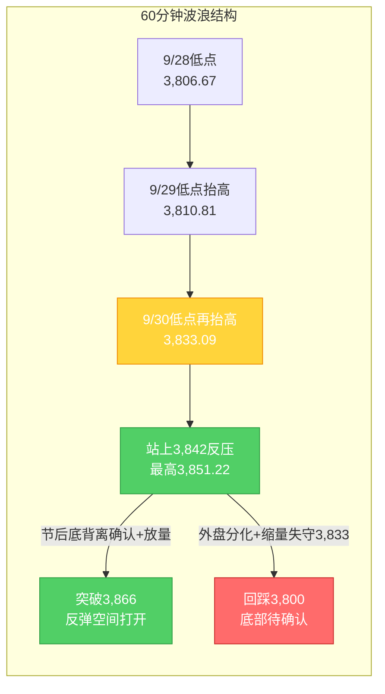

# A股晨报 - 2026年10月07日（国庆休市特刊·假期全球市场追踪）

> 数据截止时间：2026年10月7日 09:40（北京时间）；美股为10月6日（周二）收盘，港股为10月6日收盘及10月7日开盘/盘中，日经/韩股为10月7日早盘，欧股为10月6日收盘，大宗商品、汇率与美债收益率为10月6日收盘
> 报告类型：国庆休市特刊 —— 上一期（10/6）休市晚报追踪复盘 + 假期全球市场追踪（10/2-10/7）+ 节后（10/8）开盘策略
> 核心观点：A股国庆长假**休市最后一日**（10月1日-10月7日休市，**10月8日周四复市**，港股通同步恢复）。节前最后交易日（9/30）上证指数红盘收官**+0.31%收3,842.19点**，放量收回3,842点（C浪低点反压），"C浪延伸末段寻底"初步确认。**假期最后阶段（10/6美股收盘+10/7亚太早盘）呈"美股续创新高、港股高位休整、美联储官员转鹰"三线交织格局**：①**美股10/6（周二）三大指数集体续涨**——道指**+0.49%**收**51,521.28点**、标普500**+0.58%**收**7,818.93点**、纳指**+0.45%**收**27,599.79点**（连续第二日收于历史新高区），亚马逊+1.95%、微软+0.78%、特斯拉+0.51%，**英伟达盘中涨超1%续创新高**，费城半导体指数**+0.34%**（Astera Labs+逾7%、迈威尔+逾5%、博通+逾3%、AMD+逾2%），**中概股走强**（纳斯达克中国金龙指数+0.31%、万得中概科技龙头+3.17%，阿里+4.68%、拼多多+3.34%、腾讯ADR+3.26%、百度+3.17%）；②**港股10/7低开**——恒生指数**开盘-0.45%报24,172.29点**、恒生科技**-0.33%报4,209.14点**（阿里-1.39%、美团/京东-近1%），盘中窄幅震荡、一度翻红（10/6收24,280.56点、+1.0%后高位休整）；③**亚太10/7先抑后扬**——日经225低开0.14%报70,582.11点、韩国KOSPI低开1.11%报6,864.25点后**双双翻红**（隔夜美股普涨带动）；④**美债收益率小幅回落**——10年期**收于约5.27%**（10/5曾升至5.31%、创52周新高）、30年期约**5.64%**，长端高企格局未改；⑤**美元指数10/6下跌0.33%报101.833**，**离岸人民币报6.7037**（+21基点）维持强势；⑥**美联储官员10/7清晨集体转鹰**——堪萨斯城联储主席施密德称"通胀重拾升势、必要时需加息"，戴利、卡什卡利（预计年内再加息一次）、库克、古尔斯比、威廉姆斯均偏鹰；**CME显示10月维持利率概率约74%-79.5%（加息概率约20.5%-26%）、12月加息已被市场基本计入（维持概率仅约15.5%）**；⑦**大宗商品**——**布伦特原油回到100美元上方**（12月合约约100.58美元、+0.26%；WTI 11月约89.44美元、+0.01%，霍尔木兹海峡航运风险仍存）；**COMEX黄金12月约4,187美元（+0.73%）**、白银约61.6美元（+0.47%）；⑧**A50期货10/7偏强**（约13,869点、+0.09%，夜盘收涨0.12%）。**综合看，节后（10/8）A股大概率"低开高走/先抑后扬"**，假期外盘"美股强、港股高位休整"，但**美联储官员鹰派表态 + 今晚美债拍卖与9月会议纪要**构成复市前最后扰动。操作建议：**节后不恐慌、低开可小幅试探**，核心观察**3,866点（c-2低点，周线底部反转确认位）**与**3,800点（20月均线，最后防线）**。

---

## ⚠️ 休市日特别说明

今日（2026年10月7日，周三）为**国庆假期休市最后一日**（国庆休市安排：10月1日至10月7日休市，**10月8日（周四）起照常开市**，港股通10月8日起恢复服务），A股当日无交易，**无"今日行情"可复盘**。本晨报延续9月25日中秋节、10月2日、10月5日、10月6日国庆休市特刊的处理方式，采用**"上一期复盘 + 假期全球市场追踪 + 节后策略"**结构。所有A股行情数据为节前最后交易日（2026年9月30日）数据。

---

## 一、上一期晚报复盘要点回顾

> 说明：假期无A股交易，本节以最近一期晚报（**10月6日休市特刊**）及其追踪口径为基础，并回溯节前最后交易日（9/30）的复盘结论。

### 1. 9/30 核心判断回顾（节前最后交易日）

| 判断项目 | 9/30晨报预测 | 9/30实际结果 | 准确度 | 备注 |
|---------|------------|-------------|-------|------|
| 上证指数趋势 | 震荡（略偏多） | **+0.31%**收3,842.19 | ✓ | 方向精准，企稳微涨兑现 |
| 上证指数区间 | 3,815-3,868点 | 3,833.09-3,851.22点 | ✓ | 完全落在预测区间内 |
| 强支撑位 | 3,800点（20月均线） | 最低3,833.09点（未触及） | ✓ | 支撑稳固，强于预期 |
| 强压力位 | 3,866点（c-2低点） | 最高3,851.22点（未触及） | ✓ | 压力有效 |
| 北向资金 | 净流入0-30亿元 | **净买入9.71亿元** | ✓ | 方向与幅度均命中 |
| 成交量 | 平量/小幅缩量1.35-1.45万亿 | **1.45万亿** | ✓ | 上沿命中，量能温和回升 |

- 趋势判断准确率：**100%（1/1）**；点位预测准确率：**100%（4/4）**；板块预判准确率：**约17%（1/6）**；**综合准确率约72%**。
- **最大短板仍是板块预判**——节前"高低切换"（防御占优、科技承压）虽方向捕捉，但具体板块命中率偏低。

### 2. 10/6 晚报追踪复盘结论（假期外盘追踪口径）

- 10/6晚报对假期外盘的**追踪综合准确率约75%（较10/5特刊约80%小幅回落）**：港股延续企稳、韩股回落、美股期指偏多、医药生物爆发、AI应用（智谱）、油价走弱均命中；**主要偏差**为①"港股半导体/光通信映射"误判（10/6港股半导体/硬件/CPO逆势下跌）、②"美债收益率续升"误判（10/6实际小幅回落）。
- **10/6晚报核心更新**：假期外盘由"全面回暖"演进为**"结构分化（医药/AI强、半导体存储/CPO弱）"**；据此维持节后"**乐观55%/中性30%/悲观15%**"。

### 3. 沉淀的规则/检查项（供今日及节后应用）

- **趋势分析**：假期外盘对节后开盘方向的权重**随假期推进递减**，越临近复市（第6-7日）的边际变化（如美联储纪要、美债拍卖）权重越高；假期中期结论不应作为最终定调。
- **趋势分析**：假期外盘"连续收涨+指数创新高"时，节后"低开高走"路径概率提升，但若同期出现"细分科技链转弱"的分化，则乐观权重应"**结构性打折**"而非整体加码。
- **板块选择**：长假期间海外/港股**医药生物（创新药/CRO）集中爆发**且伴随"美股医药领涨+国际学术会议（如ESMO）催化"时，节后A股医药生物/创新药板块映射修复概率提升，可作为"防御+成长"兼具的优先方向。
- **板块选择**：长假期间外盘出现"**AI应用/大模型强、半导体存储/CPO弱**"的分化时，节后A股科技链映射须**按细分板块拆解**——上调AI应用/大模型、下调半导体存储/CPO优先级。
- **资金面分析**：长假期间国际油价单日跌超2%并跌破关键整数关口（如布油100美元）时，节后A股油气/煤炭板块映射转弱，应下调其优先级；反之油价重回关键关口上方时应**回升其权重**。
- **资金面分析**：美债"短端下行（加息预期降温）vs 长端高企"背离时，成长股"利率弹性修复"利好权重应**打折**。
- **点位计算**：日线底部信号确认后需上移至**周线级别验证**——节后首周关键验证位为c-2低点（**3,866点**，突破=周线底部反转确认）与20月均线（**3,800点**，跌破=底部信号失效）。

### 4. 对今日（面向节后10/8）分析的启示

- **利多**：假期外盘整体偏多（**美股三大指数续创新高、中概科技龙头+3.17%、日经创阶段新高、港股假期连续收涨**）+ 政策底（央行10/8净投放2,000亿、地产贴息新政、上海稳楼市新政、国常会增量政策）+ 节后资金回流 + 国庆消费平稳增长（步行街客流/营业额同比+3.4%/+5.3%）。
- **利空/扰动**：**美联储官员10/7集体转鹰**（施密德等喊话加息）+ **美债长端仍处5.27%/5.64%高位** + **今晚（10/8凌晨）10年期美债拍卖与9月会议纪要**构成复市前最后变量 + 港股高位休整（10/7低开）+ 周/月大周期均线仍空头排列 + 节后首周仅2个交易日。
- **核心观察**：节后首日（10/8）**低开幅度**与**3,833/3,842支撑有效性**；首周能否**放量站上3,866点**（周线底部反转确认）。

---

## 二、假期全球市场动态（10/6收盘后至今）

### 1. 美股市场（10月6日周二收盘）—— 三大指数续创新高、中概走强

| 指数 | 收盘点位 | 涨跌幅 | 备注 |
|------|---------|--------|------|
| 道琼斯指数 | 51,521.28 | **+0.49%**（+253.38点） | 续创阶段新高 |
| 标普500指数 | 7,818.93 | **+0.58%**（+44.98点） | 逼近历史新高 |
| 纳斯达克指数 | 27,599.79 | **+0.45%**（+122.48点） | **连续第二日创收盘新高区** |

**关键板块与个股异动**：
- **大型科技股普涨**：亚马逊+1.95%、微软+0.78%、特斯拉+0.51%，**英伟达盘中涨超1%续创历史新高**；谷歌与Constellation Energy签署890兆瓦核电产能协议（20年电力购买协议），Constellation Energy涨约9%-12%。
- **半导体延续修复但内部分化**：**费城半导体指数+0.34%**（较10/5的+0.27%小幅走强），Astera Labs+逾7%、迈威尔科技+逾5%、博通+逾3%、AMD+逾2%。
- **中概股集体走强**：**纳斯达克中国金龙指数+0.31%**、**万得中概科技龙头指数+3.17%**——阿里巴巴+4.68%、拼多多+3.34%、腾讯控股ADR+3.26%、百度集团+3.17%、美团ADR+2.88%、京东集团+2.25%、网易+1.85%。

> 注：美股10/6上涨的核心驱动仍为**"弱非农→加息预期降温→利率敏感型成长股领涨"**；半导体由10/5的"分化"转为10/6的"小幅普涨"，**中概科技龙头强势**对节后A股科技链（尤其平台经济/AI应用）构成正向映射。

### 2. 港股（10月6日收盘、10月7日开盘）

| 日期 | 恒生指数 | 恒生科技 | 备注 |
|------|---------|---------|------|
| 10/6（收盘） | **24,280.56**（+1.0%） | **4,223.08**（+0.94%） | 低开高走、连续第二日收涨；国企指数+0.96% |
| **10/7（开盘）** | **24,172.29**（**-0.45%**） | **4,209.14**（**-0.33%**） | 大型科网股走弱：阿里-1.39%、美团/京东-近1%；盘中窄幅震荡、一度翻红 |

**假期港股板块脉络（10/2-10/7）**：
- **10/2**：恒指**-2.60%**失守24,000点，四大主线集体杀跌（南向暂停放大外围利空）；
- **10/5**：**低开高走逆转**，恒指+0.28%收复24,000点，**PCB/覆铜板、半导体、光通信、AI应用集中爆发**；
- **10/6**：**低开高走、连续第二日收涨**，恒指+1.0%，**医药生物（创新药/CRO）大爆发**（维亚生物+23%、康希诺生物+14%、歌礼制药-B+11.84%、药明生物+4%）、**AI应用/大模型**（智谱+7.59%，GLM-5.3上架亚马逊Amazon Bedrock）、软件股（白鸽在线+15.71%），但**半导体/硬件/CPO逆势下跌**（中芯国际跌近2%）；
- **10/7**：**高位低开休整**（恒指开盘-0.45%），反映假期后段获利回吐与美联储鹰派表态扰动。

**结论**：港股假期**整体收涨（10/5-10/6连续两日反弹）**，但10/7低开显示**上行斜率放缓、结构由"科技全面爆发"转向"医药+AI领涨、半导体高位分化"**，对节后A股映射应**按细分板块区别对待**。

### 3. 亚太市场（10月7日早盘）

| 市场 | 表现（10/7早盘） | 方向 |
|------|-----------------|------|
| 日经225 | 低开0.14%报**70,582.11点**（10/6收70,683.98、+1.05%），开盘后**翻红**（一度+0.13%） | 先抑后扬 |
| 韩国KOSPI | 低开1.11%报**6,864.25点**（10/6收6,941.39、-0.89%），开盘后**拉升翻红**（一度+0.12%） | 低开高走 |
| 富时中国A50期货 | 约**13,869点**（**+0.09%**；夜盘收涨0.12%） | 偏强/窄幅 |
| 港股 | 10/7低开-0.45%（详见上节） | 高位休整 |

**特征**：**亚太10/7"低开高走"**——承接隔夜美股普涨，日经、韩股均由低开翻红，港股高位休整；**外围风险偏好整体仍偏暖，但强度较假期中段边际减弱**，对A股节后构成**"整体正向、细分有别"**的映射。

### 4. 欧洲市场（10月6日收盘）

| 市场 | 表现（10/6） | 备注 |
|------|-------------|------|
| 德国DAX | 约**+0.76%** | 欧股高开高走 |
| 欧洲斯托克50 | 约**+0.73%** | — |
| 英国富时100 | 约**+0.76%** | — |
| 法国CAC40 | 约**+0.50%** | — |

**特征**：欧洲10/6延续"高开高走"，全球风险偏好整体回暖。

### 5. 大宗商品（10月6日）

| 品种 | 最新价（10/6收盘） | 涨跌幅 | 关键驱动 |
|------|--------------|--------|---------|
| 布伦特原油（12月） | 约**100.58美元/桶** | **+0.26%** | **重回100美元上方**；霍尔木兹海峡航运风险仍存（10/6盘中一度约100.06美元） |
| WTI原油（11月） | 约**89.44美元/桶** | **+0.01%** | 基本持平（10/5曾跌1.84%收89.43） |
| COMEX黄金（12月） | 约**4,187美元/盎司** | **+0.73%** | 探底回升（美债收益率回落+加息预期降温 vs 美元走弱） |
| 现货黄金 | 约**4,150-4,170美元/盎司** | 偏强震荡 | 9月单月跌近10%后于4,150一带企稳 |
| 现货/期货白银（12月） | 约**61.6美元/盎司** | **+0.47%** | 工业+金银比修复 |

**驱动逻辑**：
- **油市**：假期整体"先扬后抑、围绕100美元震荡"——10/1受中东局势扰动大涨、10/2-10/5回落、**10/6小幅回升回到100美元上方**（地缘溢价与需求转弱多空拉锯）；**油价重回关键整数关口上方，对A股油气/煤炭板块的压制边际减弱**，但弹性仍受限。
- **贵金属**：美债收益率10/6小幅回落（10年期5.27%）+ 美元指数下跌0.33%，推动金价探底回升（COMEX约4,187、+0.73%），呈"多空均衡、震荡偏强"。

### 6. 汇率与利率

| 指标 | 数值 | 变化/说明 |
|------|------|----------|
| 人民币中间价（9/30） | **6.7351** | 调升60个基点，维持强势 |
| 离岸人民币（10/6） | **6.7037** | 较上周五纽约尾盘**涨21基点**，日内6.7035-6.7148 |
| 美元指数（10/6） | **101.833** | **-0.33%**（10/5曾+0.23%收102.167） |
| **美债10年期收益率（10/6）** | 约**5.27%** | 较10/5的**5.31%（52周新高）小幅回落**，仍处2002年以来高位 |
| 美债30年期收益率（10/6） | 约**5.64%** | 长端仍处高位 |
| **美联储10月维持利率概率** | **约74%-79.5%（加息概率约20.5%-26%）** | 加息预期存续（不等同于10/5的约22%） |
| 美联储12月维持利率概率 | **仅约15.5%**（加息25bp约68%、加息50bp约16.5%） | **12月加息已被市场基本计入** |

**特征**：①**10/6美债10年期收益率小幅回落至约5.27%（结束假期连续上行）**，对成长股估值的边际压制**略有缓解**；②但**30年期仍处5.64%高位、12月加息已被市场完全计入**，"短端降温 vs 长端高企"的背离格局未根本改变，成长股"利率弹性修复"利好仍需**打折**；③**美元指数10/6下跌0.33%**，离岸人民币维持强势（6.7037），利好人民币资产；④央行10/8加量净投放2,000亿，季末后资金面平稳。

### 7. 重要海外事件与今晚关键变量

- **美联储官员10/7清晨集体转鹰**：堪萨斯城联储主席**施密德**称"通胀已重拾升势，可用的政策工具就是上调政策利率……若不继续行动，美联储信誉岌岌可危"；旧金山联储主席**戴利**提AI芯片需求可能加剧通胀压力；**卡什卡利**预计今年再加息一次、2027年再加息一次；**库克**重申通胀已持续过高太久；**古尔斯比**直言长期维持高通胀是在"玩火"；**威廉姆斯**虽称"无需急于行动"但保留年内再加息一次可能。
- **今晚（10/8凌晨）两大关键事件（复市前最后外盘变量）**：
  - **北京时间10/8 01:00**：390亿美元**10年期美债拍卖**（本周第一次重大考验）；
  - **北京时间10/8 02:00**：**美联储9月货币政策会议纪要**（9/15-16会议，当时加息25bp至3.75%-4.00%、12-0赞成），关注官员对通胀与加息路径的表态。
- **下一次FOMC**：**10月27-28日**。

---

## 三、今日（及节后）关注事项

### 1. 重要数据/事件（按时间排序）

| 时间 | 事件 | 影响 |
|------|------|------|
| 10/8（周四）01:00 | **390亿美元10年期美债拍卖** | 检验长端需求，影响美债收益率与全球风险偏好 |
| 10/8（周四）02:00 | **美联储9月货币政策会议纪要** | 影响加息预期与美债收益率 |
| 10/8（周四）09:30 | **A股复市首日集合竞价** | 观察低开幅度与3,833/3,842支撑 |
| 10/8（周四） | 央行开展**1.2万亿元3个月期买断式逆回购**（净投放2,000亿）；港股通恢复服务 | 流动性呵护，利好资金面 |
| 10/9（周五） | 节后第2个交易日 | 能否放量站上3,866点（周线反转确认关键） |
| 10/13起 | 三季报披露开启（沪市有研新材10/13首披） | 高位成长股业绩验证风险 |
| 10/27-28 | 美联储10月FOMC | 维持利率概率约74%-79.5% |

### 2. 政策/监管动态（假期期间）

- **国常会稳增长信号**（9/28）：强调"加大宏观政策逆周期调节力度""推出一批务实管用的增量政策"，并**研究出台稳定房地产市场政策措施**。
- **上海稳楼市新政落地**：上海市住建委等四部门联合印发**商品住房销售制度改革**相关文件（9/28），房地产政策底特征明确（"地产股先涨、房企未必同步受益"，需关注三层传导与验证指标）。
- **消费品以旧换新资金全部下达**：2026年第4批**625亿元**超长期特别国债支持消费品以旧换新资金已全部拨付，**全年2,500亿元资金已全部下达**。
- **央行流动性呵护**：公告**10月8日开展1.2万亿元3个月期买断式逆回购**（当月到期1万亿），**净投放2,000亿元**；下调**PSL利率0.25个百分点至1.5%**。
- **9月官方制造业PMI 50.1%**（9/30公布）：较上月上升0.3个百分点，**重回扩张区间**。

### 3. 假期消费与经济运行

- **消费平稳增长**（商务部商务大数据）：国庆假期前3日（10/1-10/3），全国重点监测的**78条步行街（商圈）客流量、营业额同比分别增长3.4%、5.3%**。
- **人员流动高位**（交通运输部）：10/5（假期第5日）**全社会跨区域人员流动量30,333.7万人次**（环比-0.7%，同比+1.7%）；**10/7铁路预计发送旅客2,415万人次**（返程高峰，加开列车2,449列）。
- **黄金消费**：假期北京地区黄金珠宝市场多品牌推出优惠，金价单月跌近10%后刺激首饰金消费。

### 4. 机构观点（节后展望）

- **中证网（综合分析）**：节后活跃资金或将再度集结，A股有望迎来"开门红"，**科技仍是核心主线**。
- **光大证券**：受节后资金回流影响，**A股10月大概率回温**。
- **多家公募**：四季度整体**震荡偏乐观**；博时基金提示反弹推进中需面对重要外事预期兑现压力与节前缩量效应，震荡调整反而是较好布局机会。
- **风险提示**：中银证券等提示美债问题显化或加剧短期交易难度，需看长端美债能否稳住。

---

## 四、板块与个股分析（结合上一期复盘与假期信息）

### 1. 基于上一期复盘结论的板块调整

| 板块 | 节前（9/30）表现 | 假期新信息（10/6-10/7） | 节后（10/8）预期 |
|------|----------------|----------------------|----------------|
| 医药生物/创新药 | +2.73%居首 | **港股10/6医药大爆发**（维亚生物+23%、康希诺+14%）；10/7低开（药明生物、百济神州跌幅靠前） | **映射修复**（防御+成长兼具），但需防10/7回吐传导 |
| AI应用/大模型 | 计算机-0.98% | **智谱+7.59%（GLM-5.3上架Amazon Bedrock）**；美股中概科技龙头+3.17% | 修复弹性，情绪驱动、波动大 |
| 半导体/存储 | 电子-2.38%领跌 | 美股费半+0.34%（小幅修复）；**港股10/6半导体/硬件/CPO逆势跌、10/7中芯国际高开** | "双因子修复"（映射+利率弹性），前置条件：放量站上3,866点；**细分优先** |
| PCB/覆铜板、光通信/CPO | 全天低迷 | 港股10/5集中爆发后，10/6转弱 | **优先级下调**（假期后段映射转弱） |
| 平台经济/互联网 | 分化 | **中概科技龙头+3.17%**（阿里+4.68%、腾讯ADR+3.26%） | 正向映射，情绪修复 |
| 房地产链 | 盘中大逆转 | **上海稳楼市新政**（销售制度改革）+国常会稳房地产 | 政策主线，但防"利好兑现"分化 |
| 银行/红利 | +1.47% | 高股息防御+央行宽松 | 攻守兼备，降低弹性 |
| 能源（油气/煤炭） | 三桶油上涨、煤炭+0.85% | **布油重回100美元上方**（约100.58、+0.26%） | **压制边际减弱**（较10/6"跌破100"口径上修），但弹性仍受限 |

### 2. 假期信息驱动的板块机会

- **受益板块**：
  - （1）**医药生物/创新药**（逻辑：港股假期医药大爆发+ESMO催化+主力净流入居首，"防御+成长"兼具）
  - （2）**AI应用/大模型、平台经济/互联网**（逻辑：智谱GLM-5.3上架Amazon Bedrock、美股中概科技龙头+3.17%，AI商业化加速）
  - （3）**半导体设备/材料/先进封装**（逻辑：美股费半小幅修复+国产替代；**细分优先级高于存储/CPO**）
  - （4）**消费（家电/汽车/零售）**（逻辑：以旧换新全年2,500亿资金全部下达+国庆步行街客流/营业额同比+3.4%/+5.3%）
  - （5）**房地产链**（逻辑：上海销售制度改革+国常会稳房地产，注意"利好兑现"分化）
- **受损/回避板块**：
  - （1）**高位连板股/题材股**（逻辑：节后题材退潮+获利回吐）
  - （2）**PCB/覆铜板、光通信/CPO**（逻辑：港股假期后段映射转弱）
  - （3）**三季报预告可能不及预期的高位成长股**（逻辑：10月中旬起业绩披露窗口）
  - （4）**退市风险/ST个股、限售解禁个股**（个股层面冲击，如泰金新能10/8解禁）

### 3. 重点关注方向

- **医药生物/创新药**：假期港股最强映射方向，攻守兼备，优先关注
- **AI应用/大模型、平台经济/互联网**：美股中概科技龙头强势映射，情绪修复弹性大
- **半导体（设备/材料/先进封装）**：美股费半小幅修复的映射 + 国产替代，**需与"存储/CPO"细分区别对待**
- **消费（家电/汽车/零售）**：政策+假期数据双支撑
- **回避**：高位连板股、退市风险股、限售解禁个股、PCB/光通信（假期后段映射转弱）

---

## 五、今日核心判断（面向节后10/8，结构化输出）

> 说明：今日休市，本部分为**节后（10月8日）复市首日及首周（10/8-10/9）**的市场判断。

### 1. 趋势判断
- 上证指数：**【震荡偏多】**（先抑后扬/低开高走概率偏高）
- 预测区间：**3,810点 - 3,900点**（节后首周）
- 核心逻辑：假期"美股续创新高（道指/标普/纳指集体收涨、中概科技龙头+3.17%）+ 港股连续收涨 + 加息预期降温"构成成长股边际利好，与"美联储官员10/7集体转鹰 + 美债长端5.27%/5.64%高位 + 港股10/7高位休整"形成对冲；叠加政策底（央行10/8净投放2,000亿、上海稳楼市新政）与节后资金回流，**节后首日更可能"低开高走"**；但周/月大周期均线仍空头排列、节后首周仅2个交易日，反弹力度受量能约束。

### 2. 关键点位
- 强支撑位：**3,800点**（依据：20月均线，长期牛熊分界线，C浪延伸最后防线，节前已验证守住）
- 弱支撑位：**3,833点 / 3,842点**（依据：9/30盘中低点 / C浪低点反压，节前已放量收回转支撑，**首日低开后的第一承接位**）
- 强压力位：**3,898点**（依据：c-1高点，跌破后转强压力）
- 弱压力位：**3,866点**（依据：c-2低点，**节后首周核心观察位——放量站上=周线底部反转确认**）

### 3. 板块预判
- 看涨板块：
  - （1）**医药生物/创新药**（逻辑：港股假期医药大爆发+ESMO催化，防御+成长兼具）
  - （2）**AI应用/大模型、平台经济/互联网**（逻辑：智谱上架Amazon Bedrock+美股中概科技龙头+3.17%）
  - （3）**半导体设备/材料/先进封装**（逻辑：美股费半小幅修复+国产替代，细分优先）
  - （4）**消费（家电/汽车/零售）**（逻辑：以旧换新资金全部下达+假期消费数据回暖）
- 看跌/谨慎板块：
  - （1）**PCB/覆铜板、光通信/CPO**（逻辑：港股假期后段映射转弱）
  - （2）**高位连板股/题材股、三季报可能不及预期的高位成长股**
- 风险板块：**退市风险/ST个股**（波动风险）、**限售解禁个股**（个股层面冲击）

### 4. 资金面判断
- 北向资金预期：**【恢复后小幅净流入】**约0-50亿元（逻辑：人民币资产强势+加息预期降温+节后资金回流；港股通10/8恢复，需观察外资承接力度）
- 成交量预期：**【温和放量修复】**约1.5-1.7万亿元（逻辑：节后资金回流、量能较节前地量1.45万亿修复；若持续低于1.4万亿则反弹力度受限）

### 5. 风险预警（按优先级排序）
- 高风险：
  - **美联储政策转鹰风险**：10/7清晨多位官员喊话加息（施密德、卡什卡利等），**今晚（10/8凌晨）10年期美债拍卖 + 9月会议纪要**若偏鹰，将压制复市前风险偏好
  - **美债长端高企风险**：10年期约**5.27%**、30年期**5.64%**（2002年以来高位），若节后续升，将压制高估值成长股估值，削弱"加息预期降温"的利好效果
  - **3,800点（20月均线）有效性**：C浪延伸未确认结束，若有效跌破则底部信号失效、下看3,750点
- 中风险：
  - **港股/外盘映射的"反向"风险**：港股10/7低开（恒指-0.45%），若延续调整，节后低开压力回升
  - **地缘/油价扰动**：中东局势（霍尔木兹海峡航运风险）→油价跳涨与避险情绪波动
  - **节后首周交易日稀少**（仅2日）：单周涨跌幅参考权重应降低，以"缺口回补+量能修复"为主
- 低风险：
  - **三季报预告**：10月中旬起密集披露，高位成长股业绩验证风险
  - **限售解禁**：节后关注解禁个股冲击（**泰金新能10/8解禁192.30万股**）

### 6. 上一期复盘规则应用
- **应用规则1（趋势分析）**：假期外盘"美股续创新高+港股连续收涨"支撑"低开高走"路径，但港股10/7低开+"细分科技链分化"提示**乐观权重应"结构性打折"而非整体加码**。
- **应用规则2（资金面分析）**：美债"短端下行（加息预期降温）vs 长端高企（5.27%）"背离、且美联储官员转鹰时，**成长股"利率弹性修复"利好权重应打折**——故科技链判断须以"放量站上3,866点"为前置条件。
- **应用规则3（板块选择）**：港股/美股"医药强、AI应用强、半导体存储/CPO弱"的分化，**映射须按细分板块拆解**——上调医药、AI应用/平台经济，下调PCB/光通信/CPO优先级。
- **应用规则4（资金面分析）**：油价**重回100美元上方**（布油约100.58），较10/6"跌破100"口径**上修**能源板块优先级（压制边际减弱），但仍需与"地缘+冬储"逻辑对冲评估。
- **应用规则5（点位计算）**：以**3,866点（突破=周线反转确认）**与**3,800点（跌破=信号失效）**作为节后首周多空分水岭。

---

## 六、投资策略建议（分短线+中线）

### 1. 短线策略（1-3个交易日，节后复市窗口）
- 适用场景：基于日K线和60分钟K线技术信号，节后首日以"观察低开+量能确认"为主
- 短线仓位：**5%**（低开企稳可小幅试探，不追高）
- 买入条件（仅在满足以下条件时小幅试探）：
  - 节后首日低开后**守住3,833/3,842点**并向上回补缺口
  - **放量**（两市成交回升至1.6万亿以上）站上3,866点
  - **医药、AI应用/平台经济、半导体设备**在假期映射下放量走强
- 卖出条件：
  - 指数触及3,898点（c-1高点强压力）缩量滞涨
  - 科技/医药板块高开冲高回落、量能萎缩
- 止损位：**3,795点**（收盘有效跌破3,800点即止损，等待3,750点附近再评估）
- 短线标的：
  - （1）**医药生物/创新药**（逻辑：港股假期最强映射+ESMO催化+防御属性）
  - （2）**AI应用/大模型、平台经济**（逻辑：智谱上架Amazon Bedrock+美股中概科技龙头+3.17%）
  - （3）**半导体设备/材料**（逻辑：美股费半小幅修复映射+国产替代）

### 2. 中线策略（1-4周）
- 适用场景：基于周K线波浪分析与第40周运行规律分析结论
- 中线仓位：**15-20%**（维持上沿，假期利好兑现、底部信号增强；但美联储转鹰+美债长端扰动，暂不加至上沿之上）
- 方向判断：**【持有/小幅布局】**
- 目标区间：上证指数 **3,842点 - 3,898点**（周线底部反转确认后修复区间；**下沿支撑3,800点**）
- 中线布局板块：
  - （1）**医药生物/创新药、AI应用/大模型**（逻辑：假期外盘最强映射+海外商业化催化，防御+成长兼具）
  - （2）**半导体设备/材料/先进封装**（逻辑：美股费半修复+国产替代，细分优先级高于存储/CPO）
  - （3）**消费（家电/汽车/零售）**（逻辑：以旧换新资金全部下达+假期消费回暖）
  - （4）**房地产链**（逻辑：上海稳楼市新政+国常会稳房地产，注意"利好兑现"分化）
  - **维持**：**银行/红利**（高股息+央行宽松，攻守兼备）
  - **下调优先级**：**PCB/覆铜板、光通信/CPO**（港股假期后段映射转弱）
  - **小幅上修**：**能源（油气/煤炭）**（油价重回100美元上方，压制边际减弱）
- 止盈条件：指数放量站上3,898点并站稳3个交易日
- 止损条件：**指数收盘有效跌破3,800点**（底部信号失效，下看3,750点）

### 3. 仓位分配总览

| 策略类型 | 仓位比例 | 方向 | 重点板块 |
|---------|---------|------|---------|
| 短线 | 5% | 观望/低开小幅试探 | 医药、AI应用/平台经济 |
| 中线 | 15-20% | 持有/小幅布局 | 医药/AI应用、半导体设备、消费 |
| 现金 | 75-80% | — | — |

### 4. 与上一期策略对比
- 短线仓位调整：**维持5%**（原因：假期外盘偏多但美联储官员转鹰、今晚美债拍卖/纪要待落地，不追高）
- 中线仓位调整：**维持15-20%**（原因：假期利好兑现、底部信号增强；但美债长端仍处5.27%/5.64%高位，暂不加至上沿之上）
- 板块调整：**上调医药生物/创新药、AI应用/平台经济为优先方向**（假期港股医药大爆发+美股中概科技龙头强势），**下调PCB/覆铜板、光通信/CPO优先级**（港股假期后段映射转弱），**小幅上修能源**（油价重回100美元上方）

---

## 七、波浪理论多周期分析

> 说明：A股休市，波浪结构基于节前最后交易日（9/30）数据；本部分结合假期外盘（美股/港股/日股，含10/7最新走向）推演节后（10/8）路径。

### 1. 月K线波浪分析
- 当前波浪位置：大周期第2浪C浪延伸**末段**，9月月K线收中阴线，月末收盘3,842.19点**站上20月均线（3,800-3,810点）**
- 浪型结构描述：
  - 大结构：2024年9月2,689点→2026年6月4,197点为第1浪上升
  - 第2浪ABC调整：4,197点→3,806.67点（9/28盘中最低）
  - 9月月K线收中阴（月跌约-3.8%），月线MACD死叉绿柱持续，但月末企稳使绿柱扩张动能减弱
- 关键目标位：
  - 月度强支撑：**3,800-3,810点**（20月均线，9月末已站稳上方）
  - 月度核心压力：3,866点（c-2低点）、3,898点（c-1高点）、3,980-3,985点（5月均线）
  - C浪延伸加速目标：3,750点（仅当有效跌破3,800点时启用）
- 验证条件：守住3,800点（20月均线）并站上3,842点，月度底部信号初现，待10月月K线（10/8起）确认

### 2. 周K线波浪分析
- 当前波浪位置：上周（第40周）周K线收**带长下影的小阴/十字星**，跌势放缓、企稳迹象增强
- 浪型结构描述：
  - 节前周（9/28-9/30，3个交易日）：9/28放量中阴探至3,806.67点→9/29地量小阳→9/30放量小阳收3,842.19点
  - 周线仍位于5周（3,900-3,910）、10周（3,885-3,895）均线下方，短期均线空头排列未改，但长下影显示下方支撑增强
- 关键目标位：
  - 周度支撑：3,833点（9/30低点）、3,800点（20月均线，核心）
  - 周度压力：**3,866点（c-2低点，核心）**、3,898点（c-1高点）、3,900-3,910点（5周均线）
- 验证条件：节后首周（仅2日）**能否放量站上3,866点**——站稳则周线底部反转信号增强；**假期外盘偏多（美股续创新高、港股假期连续收涨、中概科技龙头强势）抬升首周向上验证的概率，但港股10/7低开+"细分科技链分化"提示概率提升呈结构性**

### 3. 日K线波浪分析（重点）
- 当前波浪位置：**C浪延伸末段寻底初步确认**——"放量中阴（9/28）+地量小阳（9/29）+放量收回C浪低点反压（9/30）"组合成立
- 浪型结构描述：
  - 9/28放量中阴-1.67%（最低3,806.67，"最后一跌"）→9/29地量小阳（1.40万亿一年新低）→9/30放量小阳+0.31%收3,842.19，成功收回3,842点（C浪低点反压）
  - 成交1.45万亿温和放量，量价配合良好，低点逐级抬高（3,806.67→3,810.81→3,833.09）
- 关键目标位：
  - 第一支撑：**3,842点（已收回转支撑）**、3,833点（9/30低点）
  - 强支撑：**3,800点（20月均线）**
  - 第一压力：**3,866点（c-2低点，节后核心观察位）**
  - 强压力：3,898点（c-1高点）
- 验证条件：
  - 向上确认：节后放量站上3,866点 → 底部反转确立，打开反弹空间至3,898点
  - 向下确认：节后跌破3,833点并失守3,800点 → 底部信号失效，下看3,750点
  - **假期变量（更新至10/7）**：美股续创新高+港股假期连续收涨，**进一步降低"二次映射低开"幅度预期**；但港股10/7低开+"半导体存储/CPO分化"提示**科技链映射需按细分板块区别对待**，且美联储官员转鹰为新增扰动

### 4. 60分钟K线波浪分析
- 当前波浪位置：60分钟级别**底背离确认**，短期趋势转多（基于9/30收盘）
- 浪型结构描述：
  - 60分钟低点逐级抬高：3,806.67（9/28）→3,810.81（9/29）→3,833.09（9/30）
  - 60分钟MACD零轴下方绿柱持续缩短并逼近金叉，KDJ超卖区域金叉后向上
- 关键目标位：短期支撑3,842/3,833点；短期压力3,866点、3,898点
- 验证条件：60分钟底背离已确认+站上3,842点；**节后首个60分钟能否守住3,833点为短线转强/转弱分水岭**

### 5. 30分钟K线波浪分析
- 当前波浪位置：30分钟级别企稳回升，站上短期均线（基于9/30收盘）
- 浪型结构描述：
  - 30分钟级别9/30全天震荡上行，午后维持强势收于3,842.19点
  - 30分钟MACD金叉后红柱温和放大，KDJ中位区向上；但量能未显著放大，上攻动能需节后量能配合
- 关键目标位：关键支撑3,833/3,842点；短期压力3,851点（9/30高点）、3,866点
- 验证条件：节后30分钟能否放量突破3,851点并站稳3,842点

### 6. 波浪图（Mermaid绘制）

**日K线波浪结构图**：

**60分钟波浪结构图**：

### 7. 波浪理论综合判断

| 维度 | 判断 |
|------|------|
| 多周期共振状态 | 月K/周K仍偏空（均线空头排列），日K/60分钟/30分钟底部信号确认、共振转多；**假期"美股续创新高+港股连续收涨+中概科技龙头强势"改善小周期修复的外部环境**，大小周期背离进入修复期；但港股10/7低开+美联储官员转鹰使修复呈结构性 |
| 当前操作级别 | **日线级别**（C浪延伸末段寻底初步确认，关注3,866点突破与3,842/3,800点支撑） |
| 后续演变路径（节后10/8-10/9） | **50%乐观**（低开高走、放量站上3,866点→周线底部反转确认，反弹至3,898-3,920点）、**33%中性**（3,820-3,866区间震荡消化、量能温和修复）、**17%悲观**（美联储纪要偏鹰/美债长端续升 + 港股转弱共振→有效跌破3,800点，下看3,750点） |
| 关键拐点信号 | 向上：放量站上3,866点（c-2低点）+北向恢复净流入+加息预期继续降温+海外科技链/医药链强势；向下：有效跌破3,800点（20月均线）+美债长端续升+放量下跌 |
| 风险提示 | ①C浪延伸是否终结需节后确认（当前仅为"初步确认"）；②**10/7美联储官员集体转鹰，今晚（10/8凌晨）10年期美债拍卖+9月会议纪要**为复市前最后变量；③**30年期美债收益率仍处5.64%高位、12月加息已被市场完全计入**，"短端降温 vs 长端高企"背离未改；④港股10/7低开（恒指-0.45%），或对A股科技链形成扰动；⑤波浪理论在C浪延伸末段+地量整理阶段预测精度降低，需结合政策面、外盘与节后量能综合判断 |

> **规律分析引用（第40周运行规律分析）**：该报告预测节后首周（第41周，10/8-10/9）上证运行区间**3,810-3,900点**，判断"**震荡企稳、偏多修复（先抑后扬）**"，乐观/中性/悲观概率45%/35%/20%；并提示"3,866点为周线底部反转确认位、3,800点为最后防线"。本期晨报结合假期最新外盘（**美股三大指数续创新高、中概科技龙头+3.17%、港股假期连续收涨、美债收益率10/6小幅回落**）**将路径定为"乐观50%/中性33%/悲观17%"**——较10/6"55%/30%/15%"**小幅下调乐观、上调悲观**，主因**美联储官员10/7集体转鹰 + 今晚美债拍卖/会议纪要 + 港股10/7低开**构成复市前新增扰动，故对乐观路径做"结构性打折"。

---

## 八、信息来源

1. **官方数据来源**：上海证券交易所/深圳证券交易所（休市安排公告）、国家统计局、中国人民银行、财政部、金融监管总局、国务院、商务部、交通运输部、国家发展改革委、美国联邦储备委员会（FOMC）、美国财政部（Treasury）、香港交易所（HKEX）
2. **权威财经媒体**：新华社（新华网《纽约股市三大股指6日上涨》《港股6日涨1.0%》《美元指数6日下跌》）、央视财经（央视网《全国铁路10月7日预计发送旅客2415万人次》）、中国证券报、上海证券报（中国证券网）、证券时报（e公司）、证券日报、每日经济新闻、财联社、华尔街见闻、中国基金报、中国经济网、新华财经
3. **数据平台**：东方财富（Choice数据）、同花顺、Wind资讯、CME FedWatch、Nasdaq.com、Nikkei（日经官网）、FRED（圣路易斯联储）、Morningstar、格隆汇、汇通财经
4. **海外信息源**：Reuters、Bloomberg、AP News、Anadolu Agency、Investing.com

> 数据截止时间：2026年10月7日 09:40（北京时间）；美股为10月6日（周二）收盘，港股为10月6日收盘及10月7日开盘/盘中，日经/韩股为10月7日早盘，欧股为10月6日收盘，大宗商品、汇率与美债收益率为10月6日收盘。

---

*本期晨报为国庆休市特刊（假期全球市场追踪版·节后开盘前瞻），由AI代理自动生成，仅供参考，不构成投资建议。投资有风险，入市需谨慎。*
*数据截止时间：2026年10月7日 09:40（北京时间）*
