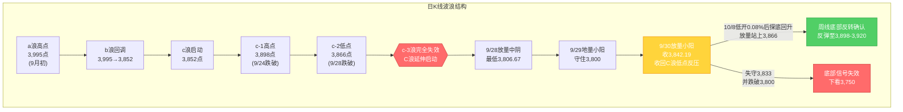
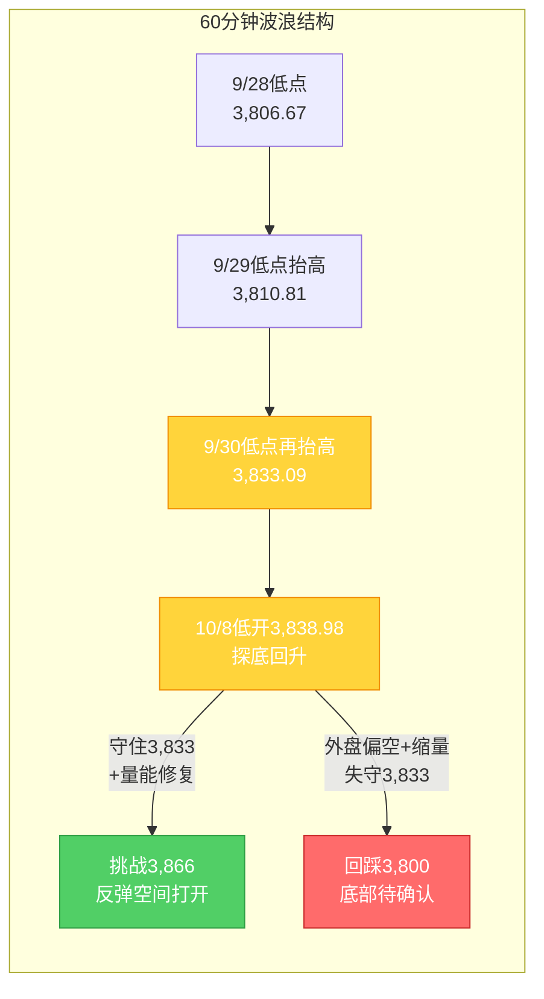

# A股晨报 - 2026年10月08日

> 数据截止时间：2026年10月8日 10:30（北京时间）；美股为10月7日（周三）收盘，欧股为10月7日收盘，港股为10月7日收盘，日经/韩股为10月7日收盘，大宗商品、汇率与美债收益率为10月7日收盘/10月8日凌晨美债拍卖后
> 报告性质：**国庆长假后首个交易日（10/8）开盘晨报** —— 以10/7休市特刊晚报的"节后开盘前瞻"为基础 + 隔夜外盘（10/7美股/欧股/港股收盘、10/8凌晨美债拍卖与美联储纪要）+ 今日早盘跟踪
> 核心观点：**A股10/8复市，三大指数低开高走、探底回升**。开盘沪指低开0.08%报3,838.98点，随后震荡回升（9:43涨约+0.4%），**医药/疫苗、海运、石油化工领涨，房地产盘中拉升，贵金属/半导体/通信设备承压**。隔夜外盘"美股收跌+欧股普跌+美联储纪要偏鹰"构成压制，但**10/8凌晨390亿美元10年期美债拍卖需求强劲（投标倍数2.77倍创2016年以来新高）致长端收益率回吐涨幅**，外盘扰动边际缓和；叠加**央行10/8加量净投放2,000亿**与历史"节后首日上涨概率65%"统计，**"低开高走/先抑后扬"路径正在兑现**。核心观察：**3,866点（c-2低点，周线底部反转确认位）**与**3,833点（短线强弱分水岭）**，**3,800点（20月均线）为最后防线**。

---

## 一、昨日晚报复盘要点回顾

> 说明：10/7为国庆休市最后一日，晚报为"休市特刊（假期全球市场追踪版）"，本期晨报以其"节后开盘前瞻"为分析基础。以下复盘口径为"10/7晨报对假期外盘预判 vs 假期收官日实际"。

### 1. 昨日判断回顾
- **方向性变量识别准确率：约40%（4/10）** —— 命中：港股回调、半导体/存储转弱、美债长端续升、油价回升；误判：亚太"先抑后扬"、美股期指、医药/AI应用映射、黄金方向、A50期货
- **关键事件预判准确率：约50%（2/4）** —— 命中：美债长端续升、半导体转弱
- **追踪综合准确率：约42%** —— 较10/6特刊（约75%）显著回落
- **风险预警高度有效**：港股反向映射、美债长端续升、美联储转鹰+美债拍卖/纪要三条中高风险提示**均在本日兑现**

### 2. 关键偏差及原因
- **偏差1（收官日外盘方向误判·核心）**：将10/7早盘"翻红"线性外推为全天偏多，实际收盘全线回调。根因：**逻辑误判+信息缺失**——"复市前一日"外盘方向应由全天资金面（美债/美元）决定，而非开盘动能
- **偏差2（中段强势板块线性外推）**：将10/6港股医药爆发外推至收官日与节后，实际10/7医药领跌（金斯瑞-12.70%）。根因：**逻辑误判（单日线性外推）**——忽视"前期强势股收官日集中获利回吐"
- **偏差3（黄金"探底回升"误判）**：忽视"美元走强+美债续升"双杀。根因：**技术分析局限**

### 3. 沉淀的规则/检查项（来自10/7复盘，本次直接应用）
- **规则1（趋势分析）**：长假"复市前一日（第7日）"外盘方向对节后开盘具决定性影响——收官日全线回调时，乐观路径权重应由"结构性打折"升级为"概率下修"
- **规则2（板块选择）**：假期中段强势板块若在收官日出现"获利回吐式大跌"，节后A股映射应**以收官日最新方向定价**，不可用中段强势板块线性外推
- **规则3（资金面分析）**："油价涨→通胀预期升→美债长端升"传导链一旦形成，同时压制成长股估值与贵金属，应下调"加息预期降温利好"与"黄金偏强"预判权重
- **规则4（点位计算）**：复市前一日外盘转弱时，节后首周区间预测中枢应**下移至区间下沿（3,810-3,870点）**，并强化"3,833点为短线强弱分水岭"的观察

### 4. 对今日分析的启示
- **需要关注的风险点**：①美联储9月纪要偏鹰（多数倾向年内再加息）对成长股估值的压制；②美债长端仍处历史高位（10年期盘中触及5.364%）；③节后首日大额限售解禁（中国能建、中国神华等，321亿元）
- **需要调整的分析逻辑**：①**以"复市前一日（10/7）收官日外盘最新方向"为锚**（港股全线回调、医药/半导体领跌）；②但**须纳入"10/8凌晨美债拍卖需求强劲→长端回吐涨幅"的最新边际变化**，对外盘压制做"缓和"修正；③**关注收官日"逆势活跃的防御/低位方向"（机械、汽车电子）与新晨盘"医药/海运/石化"承接**

---

## 二、隔夜市场动态（10/7收盘后至10/8凌晨）

### 1. 美股市场（10月7日周三收盘）
| 指数 | 收盘点位 | 涨跌幅 | 说明 |
|------|---------|--------|------|
| 道琼斯工业指数 | 51,179.87 | **-0.66%**（-341.41点） | **领跌**，投资者获利了结+纪要偏鹰 |
| 标普500指数 | 7,801.77 | **-0.22%**（-17.16点） | 从纪录高位小幅回落 |
| 纳斯达克综合指数 | 27,538.69 | **-0.22%**（-61.20点） | 科技股表现分化，美光逆势涨超4% |

**解读**：美股10/7三大指数**集体收跌、脱离盘中低点**（"收盘跌幅远小于盘中低位"）。**隔夜（10/8凌晨）两条关键变量落地**：①**390亿美元10年期美债拍卖中标利率5.30%、投标倍数2.77倍（2016年以来最高）、非交易商获配97.5%（创纪录）**，需求强劲，**拍卖后10年期收益率从盘中高点5.364%跳水至约5.276%**；②**美联储9月会议纪要偏鹰**——9月加息获一致支持，**多数与会者倾向年内再加一次**，数位与会者认为"当时政策利率限制性不足"。**净影响：外盘由"收官日全线回调"转为"拍卖缓和+纪要偏鹰"的多空交织，对A股映射由"整体偏空"边际缓和为"结构性偏空"。**

### 2. 欧洲/亚太市场（10月7日收盘）
| 市场 | 表现（10/7收盘） | 备注 |
|------|-----------------|------|
| 德国DAX30 | **-1.26%** | 领跌欧股 |
| 法国CAC40 | **-1.22%**（收7,769.21点） | — |
| 英国富时100 | **-0.74%** | — |
| 欧洲斯托克50 | **-1.39%** | — |
| 意大利富时MIB | **-2.44%** | 跌幅居前 |
| 西班牙IBEX35 | -1.63% | — |
| 恒生指数（10/7） | **-0.62%**（收24,130.50点） | 全天低位盘整，主板成交947.0亿港元 |
| 恒生科技（10/7） | **-0.68%**（收4,194.49点） | 创新药概念领跌（金斯瑞、晶泰控股跌超12%） |
| 国企指数（10/7） | -0.57%（收8,082.40点） | — |

**情绪判断**：**欧美股市10/7集体收跌，欧股跌幅明显大于美股**；港股收官日全线回调、医药/半导体领跌。**外部风险偏好整体偏空**，但需注意"美股收盘脱离盘中低位+美债拍卖需求强劲"的边际缓和信号。

### 3. 大宗商品（10月7日收盘）
| 品种 | 收盘价 | 涨跌幅 | 关键驱动 |
|------|--------|--------|---------|
| WTI原油（11月） | 88.28美元/桶 | **-1.30%**（-1.16美元） | 需求担忧+美元走强 |
| 布伦特原油（12月） | 100.20美元/桶 | **-0.38%**（-0.38美元） | 险守100美元关口 |
| 现货黄金 | 约4,099.91美元/盎司 | **-1.53%**（跌破4,100） | **美元走强+美债收益率高企双杀** |
| 现货白银 | 约59.75美元/盎司 | **-2.50%**（失守60） | 跟随黄金跳水 |

**驱动逻辑**：**"美元指数走强（102.24）+ 美债长端处于2002年以来高位"共同施压贵金属**——黄金10/7跌1.53%、白银跌超2.5%失守60美元，**贵金属板块今日A股承压（早盘贵金属下挫已兑现）**；油价小幅回落但**布伦特仍险守100美元上方**，油气板块受"高油价+地缘"支撑（早盘石油化工走强）。

### 4. 汇率与利率（10月7日收盘 / 10月8日凌晨）
| 指标 | 数值 | 变化/说明 |
|------|------|----------|
| 美元指数（10/7） | **102.242** | **+0.4%**，盘中最高一度升至约102.50，**逼近10/5创下的年内新高102.5361** |
| 美元/人民币（在岸） | 约**6.7050** | 人民币维持偏强，承压但幅度有限 |
| 美债10年期收益率 | 盘中最高**5.364%**（2002年以来新高）→ **拍卖后回落至约5.276%** | 拍卖需求强劲致长端回吐涨幅 |
| 美债30年期收益率 | 触及**约5.70%（24年最高）** | 长端压力仍处历史高位区 |
| 美联储政策预期 | 9月纪要**偏鹰**，多数与会者倾向**年内再加一次** | 下次FOMC：10月27-28日 |

**特征**：①**"短端偏鹰（纪要）+ 长端高位"格局延续**，但**10/8凌晨10年期拍卖需求强劲（投标倍数2.77倍创2016年以来新高）使长端回吐日内涨幅**，是隔夜**最关键的边际缓和信号**；②**美元指数走强至102.24、逼近年内高位**，对成长股估值与贵金属构成压制；③人民币汇率维持偏强（约6.7050），对A股资金面中性偏正面。

### 5. 重要海外事件
- **390亿美元10年期美债拍卖（10/8 01:00）**：中标利率5.30%，投标倍数2.77倍（2016年以来最高），非交易商获配97.5%（创纪录）——**需求强劲，缓解长端融资担忧**
- **美联储9月货币政策会议纪要（10/8 02:00）**：**偏鹰**——9月加息获一致支持，**多数与会者倾向年内再加息**，通胀风险偏上行
- **地缘与油市**：中东局势（霍尔木兹海峡）风险溢价仍在，布伦特险守100美元

---

## 三、今日关注事项

### 1. 重要数据发布 / 政策（按时间排序）
- **央行公开市场操作**：10/8开展**1.2万亿元3个月期买断式逆回购**（当月到期1万亿），**净投放2,000亿元**；下调**PSL利率0.25个百分点至1.5%**——季末后流动性呵护明确
- **2026年中央金融机构注资特别国债发行**（今日看点）
- **9月官方制造业PMI 50.1%**（节前已公布）：重回扩张区间，基本面支撑延续

### 2. 限售股解禁（今日重点）
- **10/8当日**：共**10家公司**限售股解禁，合计解禁量**31.85亿股**，按最新收盘价合计解禁市值**321.36亿元**；解禁量居前为**中国能建（25.49亿股、约60.92亿元）、中国神华、哈尔斯**
- **10月全月**：共**124家公司**解禁，合计约**122.26亿股**，解禁规模**3,047.11亿元**（环比+62.82%、同比+20.61%）；**电子、公用事业、煤炭**解禁市值居前，**西安奕材、中船特气**规模居前——**解禁压力为10月需持续跟踪的风险点**

### 3. 公司公告 / 业绩
- **三季报披露窗口临近**：10月13日起三季报开启（沪市**有研新材10/13**首披，金盘科技、川投能源10/14）——**10月进入业绩验证窗口**，高位成长股（医药/半导体）业绩不及预期风险需警惕

### 4. 其他关注
- **今日为国庆后首个交易日**，港股通同步恢复服务，**北向资金恢复交易**
- **新股申购**：本日暂无重大新股申购安排（合则留意交易所公告）
- **本周仅2个交易日**（10/8-10/9），随后10/10（周六）休市

---

## 四、板块与个股分析（结合昨日复盘）

### 1. 基于昨日复盘结论的板块调整
- **昨日看涨板块（医药生物/创新药、AI应用/平台经济、半导体设备）今日预期**：①**医药生物**——收官日港股领跌（金斯瑞-12.70%），但**A股今日早盘疫苗/医疗逆势走强**（流感概念催化），呈"外盘回调、内盘结构走强"背离，**应上调疫苗/流感方向、下调纯创新药映射**；②**AI应用/平台经济**——收官日走弱，映射转弱；③**半导体设备/材料**——收官日港股半导体大跌，**边际转弱，需细分（设备材料优先于存储/CPO）**
- **昨日看跌/谨慎板块（PCB/覆铜板、光通信/CPO）今日预期**：维持谨慎，外盘科技链（存储/半导体）转弱映射压制
- **昨日偏差板块修正逻辑**：**医药**（10/7误判领跌）→ 今日以"疫苗/流感内需主线"替代"创新药外盘映射"；**贵金属**（10/7误判偏强）→ 10/7已跌1.53%，**今日贵金属板块承压已在早盘兑现，维持回避**

### 2. 隔夜信息驱动的板块机会
- **受益板块**：
  - （1）**石油化工/油气**（逻辑：布伦特险守100美元上方+地缘风险溢价，早盘石化走强）
  - （2）**海运/航运**（逻辑：节后运价与低位补涨，早盘**中远海能涨停**、招商轮船等跟涨）
  - （3）**医药/疫苗/流感**（逻辑：秋冬流感高发期催化，早盘疫苗板块涨幅居前）
  - （4）**房地产及产业链**（逻辑：上海稳楼市新政+国常会增量政策，早盘**盘中拉升、深物业A/陆家嘴涨停**）
- **受损板块**：
  - （1）**贵金属/黄金**（逻辑：金价跳水-1.53%+美元走强，早盘贵金属下挫）
  - （2）**半导体/通信设备**（逻辑：收官日港股半导体领跌+外盘映射转弱，早盘半导体、通信设备下跌）

### 3. 重点关注个股（今日早盘异动）
- **中远海能**：海运龙头，早盘涨停，关注理由=集运/油运运价+低位补涨；技术位置=突破前期平台
- **深物业A / 陆家嘴**：房地产政策主线，早盘涨停，关注理由=稳楼市政策催化；风险=防"利好兑现"分化
- **中国能建 / 中国神华**：今日大额解禁（合计超60亿元），关注理由=解禁冲击评估；**回避或谨慎**
- **药明康德**：CRO龙头，10/7港股盘中触及219.20港元历史新高，A股映射需观察

---

## 五、今日核心判断（结构化输出，用于晚报复盘）

### 1. 趋势判断
- **上证指数：【震荡偏多】**（先抑后扬/低开高走）
- **预测区间：3,820点 - 3,890点**
- **核心逻辑**：隔夜外盘"美股收跌+美联储纪要偏鹰"构成压制（低开兑现），但**10/8凌晨10年期美债拍卖需求强劲致长端收益率回吐涨幅**、**央行加量净投放2,000亿**、**历史"节后首日上涨概率65%"统计**叠加**早盘探底回升、医药/海运/地产多点开花**，**"先抑后扬"路径正在兑现**；上方受美债长端高位与解禁压力约束，预计**震荡消化为主、结构性机会优于指数空间**。

### 2. 关键点位
- **强支撑位：3,800点**（依据：20月均线，前报"最后防线"，跌破则下看3,750点）
- **弱支撑位：3,833点**（依据：9/30低点，短线强弱分水岭）；**次级支撑3,842点**（9/30收盘/C浪低点反压）
- **强压力位：3,898点**（依据：c-1高点）
- **弱压力位：3,866点**（依据：c-2低点，**周线底部反转确认位**，突破需放量配合）

### 3. 板块预判
- **看涨板块**：（1）**医药/疫苗/流感**（逻辑：秋冬流感催化+内需防御，早盘领涨）（2）**海运/航运**（逻辑：低位补涨+运价，早盘涨停潮）（3）**石油化工/油气**（逻辑：布油险守100+地缘）（4）**房地产及产业链**（逻辑：稳楼市政策+早盘拉升）
- **看跌板块**：（1）**贵金属/黄金**（逻辑：金价跳水-1.53%+美元走强）（2）**半导体/通信设备**（逻辑：收官日港股领跌+外盘映射转弱）
- **风险板块**：①**今日大额解禁个股**（中国能建、中国神华、哈尔斯等，321亿元）；②**三季报可能不及预期的高位成长股**（医药/半导体，10/13起披露）；③**高位连板题材股**（节后获利回吐）；④**退市风险/ST个股**

### 4. 资金面判断
- **北向资金预期：【净流入】0 - 50亿元**（依据：港股通恢复首日，节后外资回补+人民币偏强；但外盘偏空或限制流入规模）
- **成交量预期：【放量】**（依据：节后首日资金回流，预计两市成交回升至**1.5-1.7万亿元**，较节前1.45万亿温和放量；若低开高走放量则强化反转确认）

### 5. 风险预警（按优先级排序）
- **高风险**：①**美联储9月纪要偏鹰（多数倾向年内再加息）**——压制高估值成长股估值；②**美债长端仍处2002年以来高位（10年期盘中5.364%、30年期约5.70%）**——"通胀预期→长端上行"负反馈未消；③**节后首日大额限售解禁（321亿元）**——局部个股冲击
- **中风险**：①**欧股10/7普跌（DAX-1.26%）+美股收跌**——外部风险偏好偏空；②**港股收官日医药/半导体领跌**——对A股科技链/医药链的低开扰动；③**地缘政治（霍尔木兹海峡）**——油价突发波动风险
- **低风险**：①**本周仅2个交易日**——短期量能修复受限；②**10月解禁规模3,047亿元（环比+62.82%）**——需持续跟踪

### 6. 昨日复盘规则应用
- **应用规则1（复市前一日外盘定价）**：以10/7收官日"港股全线回调、医药/半导体领跌"为节后定价基准——**今日下调医药创新药/半导体的外盘映射优先级**，早盘已现"贵金属/半导体下跌"
- **应用规则2（收官日逆势方向承接）**：关注收官日"逆势活跃的防御/低位方向"（机械、汽车电子）以及**新晨盘"医药/海运/石化/地产"承接**——**以早盘实际领涨方向为短线主线**
- **应用规则3（美债长端权重）**：**纳入"10/8凌晨10年期拍卖需求强劲→长端回吐涨幅"的边际缓和**，但**美债长端绝对水平仍处历史高位**，故对"加息预期降温利好"仅做"缓和"而非"反转"修正
- **应用规则4（区间下移）**：节后首周区间预测中枢维持偏下沿（**3,820-3,890点**），**3,833点为短线强弱分水岭**

---

## 六、波浪理论多周期分析

> 说明：基于节前最后交易日（9/30）K线结构 + 假期外盘（含10/7收官日及10/8凌晨美债拍卖/美联储纪要）推演，并结合今日早盘（低开高走、探底回升）实际表现。

### 1. 月K线波浪分析
- **当前波浪位置**：大周期第2浪C浪延伸**末段**，9月月K线收中阴线（月跌约-3.8%），月末收盘3,842.19点**站上20月均线（3,800-3,810点）**
- **浪型结构描述**：2024年9月2,689点→2026年6月4,197点为第1浪上升；第2浪ABC调整：4,197点→3,806.67点（9/28盘中最低）；月线MACD死叉绿柱持续，但月末企稳使绿柱扩张动能减弱
- **关键目标位**：月度强支撑**3,800-3,810点（20月均线）**；月度核心压力3,866点、3,898点、3,980-3,985点（5月均线）；加速目标3,750点（仅当有效跌破3,800点时启用）
- **验证条件**：守住3,800点并站上3,842点，月度底部信号初现，待10月月K线（10/8起）确认

### 2. 周K线波浪分析
- **当前波浪位置**：上周（第40周）周K线收**带长下影的小阴/十字星**，跌势放缓、企稳迹象增强
- **浪型结构描述**：节前周（9/28-9/30，3个交易日）先放量中阴探至3,806.67点、再地量小阳、最后放量小阳收3,842.19点；周线仍在5周（3,900-3,910）、10周（3,885-3,895）均线下方，短期均线空头排列未改，但长下影显示下方支撑增强
- **关键目标位**：周度支撑3,833点、3,800点（核心）；周度压力**3,866点（c-2低点，核心）**、3,898点、3,900-3,910点（5周均线）
- **验证条件**：节后首周（仅2日）**能否放量站上3,866点**——站稳则周线底部反转信号增强；外盘"收官日转弱+纪要偏鹰"使向上验证难度上升，需以量能修复为先决条件

### 3. 日K线波浪分析（重点）
- **当前波浪位置**：**C浪延伸末段寻底初步确认**——"放量中阴（9/28）+地量小阳（9/29）+放量收回C浪低点反压（9/30）"组合成立
- **浪型结构描述**：9/28放量中阴-1.67%（最低3,806.67）→9/29地量小阳（1.40万亿一年新低）→9/30放量小阳+0.31%收3,842.19，成功收回3,842点（C浪低点反压）；低点逐级抬高（3,806.67→3,810.81→3,833.09）
- **关键目标位**：第一支撑3,842点（已收回转支撑）、3,833点；强支撑**3,800点（20月均线）**；第一压力**3,866点（c-2低点，核心观察位）**；强压力3,898点（c-1高点）
- **验证条件**：
  - 向上确认：**放量站上3,866点** → 底部反转确立，打开反弹空间至3,898点
  - 向下确认：跌破3,833点并失守3,800点 → 底部信号失效，下看3,750点
  - **今日早盘变量**：**10/8低开0.08%（3,838.98点）后探底回升，9:43涨约+0.4%**——**"低开守住3,833点并回升"符合"先抑后扬"路径**；后续需观察能否**放量挑战3,866点**

### 4. 60分钟K线波浪分析
- **当前波浪位置**：60分钟级别**底背离确认**，短期趋势转多（基于9/30收盘），今日低开高走延续修复
- **浪型结构描述**：60分钟低点逐级抬高：3,806.67（9/28）→3,810.81（9/29）→3,833.09（9/30）→今日低开3,838.98未破前低；60分钟MACD零轴下方绿柱缩短并逼近金叉，KDJ超卖区金叉后向上
- **关键目标位**：短期支撑3,842/3,833点；短期压力3,866点、3,898点
- **验证条件**：**今日首个60分钟守住3,833点为短线转强/转弱分水岭**——早盘已守住并回升，短线偏多

### 5. 30分钟K线波浪分析
- **当前波浪位置**：30分钟级别企稳回升，站上短期均线
- **浪型结构描述**：30分钟级别今日低开后快速拉升，午后能否维持强势待观察；30分钟MACD金叉后红柱温和放大，KDJ中位区向上；量能需放大配合上攻
- **关键目标位**：关键支撑3,833/3,842点；短期压力3,851点（9/30高点）、3,866点
- **验证条件**：**30分钟能否放量突破3,851点并站稳3,842点**

### 6. 波浪图（Mermaid绘制）

**日K线波浪结构图**：

**60分钟波浪结构图**：

### 7. 波浪理论综合判断

| 维度 | 判断 |
|------|------|
| 多周期共振状态 | 月K/周K仍偏空（均线空头排列），日K/60分钟/30分钟底部信号确认、共振转多；**今日开盘低开高走、探底回升**使小周期修复延续，但**隔夜外盘"美股收跌+纪要偏鹰"构成外部承压**，共振修复呈"结构性"而非"全面" |
| 当前操作级别 | **日线级别**（C浪延伸末段寻底初步确认，关注3,866点突破与3,833/3,800点支撑） |
| 后续演变路径（10/8-10/9） | **45%乐观**（低开高走、放量站上3,866点→周线底部反转确认，反弹至3,898-3,920点）、**38%中性**（3,820-3,866区间震荡消化、量能温和修复）、**17%悲观**（纪要偏鹰发酵/美债长端续升→有效跌破3,800点，下看3,750点） |
| 关键拐点信号 | 向上：放量站上3,866点（c-2低点）+北向恢复净流入+美债长端回落；向下：有效跌破3,800点（20月均线）+美债长端续升（30年期站稳5.70%上方）+放量下跌 |
| 风险提示 | ①C浪延伸是否终结仍需本周量价确认（当前仅为"初步确认"）；②**美联储9月纪要偏鹰（多数倾向年内再加息）**为中期估值压制；③**美债长端绝对水平仍处2002年以来高位**，"通胀预期→长端上行"负反馈未消；④节后首日大额解禁（321亿元）+10月解禁3,047亿元；⑤波浪理论在C浪延伸末段+地量整理阶段预测精度降低，需结合政策面、外盘与量能综合判断 |

> **规律分析引用（第40周运行规律分析）**：该报告预测节后首周（第41周，10/8-10/9）上证运行区间**3,810-3,900点**，判断"**震荡企稳、偏多修复（先抑后扬）**"，乐观/中性/悲观概率45%/35%/20%；并提示"3,866点为周线底部反转确认位、3,800点为最后防线"。本报告结合**10/8凌晨美债拍卖（需求强劲、长端回吐涨幅）与美联储纪要（偏鹰）**及**今日早盘低开高走**的最新变化，维持"先抑后扬"基准判断，路径概率微调为"**乐观45%/中性38%/悲观17%**"（较10/7晚报的"40%/38%/22%"**小幅上修乐观、下调悲观**，主因美债拍卖需求强劲缓和长端压力+早盘低开高走兑现）。

---

## 七、投资策略建议（分短线+中线）

### 1. 短线策略（1-3个交易日）
- **适用场景**：基于日K线和60分钟K线技术信号
- **短线仓位：10%**（节后首日低开高走，可小幅试探，较10/7晚报的5%**小幅上调**）
- **买入条件**：指数**守住3,833点**且**放量（成交回升至1.6万亿以上）挑战3,866点**；或强势板块（医药/海运/石化）回踩不破关键均线时低吸
- **卖出条件**：指数触及**3,866-3,898点压力区**滞涨、或量能萎缩、或跌破3,833点
- **止损位：3,795点**（收盘破3,800止损）或个股跌幅7%
- **短线标的**：（1）**医药/疫苗/流感**（逻辑：秋冬流感催化+内需防御，早盘领涨）（2）**海运/航运**（逻辑：低位补涨+运价，早盘中远海能涨停）（3）**石油化工/油气**（逻辑：布油险守100+地缘）

### 2. 中线策略（1-4周）
- **适用场景**：基于周K线波浪分析和运行规律分析结论
- **中线仓位：15-20%**（维持10/7晚报建议，待放量站上3,866点后再上修）
- **方向判断：【持有/观望】**
- **目标区间**：上证指数 **3,810点 - 3,898点**
- **中线布局板块**：（1）**银行/红利**（逻辑：高股息+央行宽松，攻守兼备）（2）**医药生物/疫苗**（逻辑：防御+流感催化）（3）**机械/工程机械、汽车电子**（逻辑：收官日港股逆势领涨、低位方向承接）（4）**消费（家电/汽车/零售）**（逻辑：以旧换新2,500亿资金全部下达+上海国庆消费+9.9%）
- **止盈条件**：指数到达3,898-3,920点或波段涨幅达标
- **止损条件**：指数**有效跌破3,800点**（20月均线）或趋势确认反转

### 3. 仓位分配总览
| 策略类型 | 仓位比例 | 方向 | 重点板块 |
|---------|---------|------|---------|
| 短线 | 10% | 试探/持有 | 医药/疫苗、海运、石油化工 |
| 中线 | 15-20% | 持有/观望 | 银行/红利、医药、机械/汽车电子、消费 |
| 现金 | 70-75% | — | — |

### 4. 与昨日策略对比
- **短线仓位调整**：从**5%上调至10%**（原因：早盘低开高走、探底回升，美债拍卖需求强劲缓和外盘压制，"先抑后扬"兑现）
- **中线仓位调整**：维持**15-20%**（原因：美债长端仍处历史高位+解禁压力，待放量站上3,866点确认后再上修）
- **板块调整**：**上调**医药/疫苗/流感（内需+流感催化）、海运（低位补涨）、石油化工；**下调**医药创新药（外盘映射转弱）、半导体存储/CPO（收官日领跌）；**维持**银行/红利、机械/汽车电子、消费

---

## 八、信息来源

1. **官方数据来源**：上海证券交易所/深圳证券交易所（休市安排公告）、国家统计局、中国人民银行、财政部、美国联邦储备委员会（FOMC）、美国财政部（Treasury）、香港交易所（HKEX）
2. **权威财经媒体**：新华社/新华网（《纽约股市三大股指7日下跌》《国际油价7日下跌》《恒生指数7日跌0.62% 收报24130.5点》）、央视财经、中国证券报、上海证券报（中国证券网）、证券时报（人民财讯/数据宝）、证券日报、财联社、21世纪经济报道、中新经纬、新浪财经、东方财富Choice数据
3. **数据平台**：东方财富（Choice数据）、同花顺（10jqka）、Wind资讯、CME FedWatch、Nasdaq.com、Euronext、格隆汇、证券之星、中国金融信息网（新华财经）
4. **海外信息源**：Reuters、Bloomberg、Nasdaq.com、Euronext、Westpac（WBC Morning Report）、연합인포맥스

> 数据截止时间：2026年10月8日 10:30（北京时间）；美股为10月7日（周三）收盘，欧股为10月7日收盘，港股为10月7日收盘，大宗商品、汇率与美债收益率为10月7日收盘及10月8日凌晨美债拍卖后。

---

*本晨报由AI代理自动生成，仅供参考，不构成投资建议。投资有风险，入市需谨慎。*