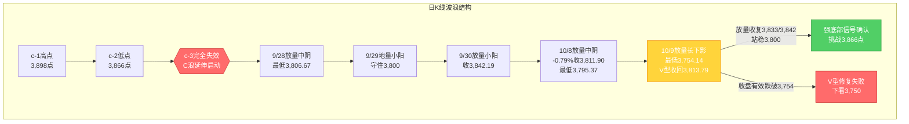
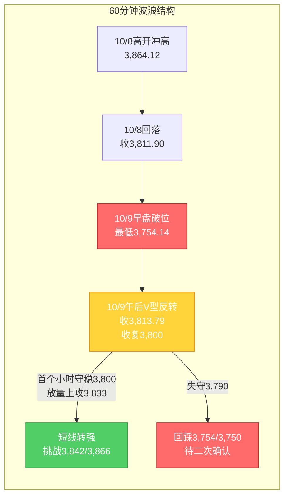

# A股晚报 - 2026年10月09日

> 数据截止时间：2026年10月9日 20:00（北京时间）；美股为10月8日（周四）收盘，欧股为10月9日盘中/收盘，日经为10月9日收盘，港股为10月9日收盘，大宗商品/汇率为10月9日盘后
> 报告性质：**国庆长假后第2个交易日（10/9，周五）收盘晚报 + 10/8晨报盘前判断复盘** —— 本周最后一个交易日（明日10/10周六休市）
> 核心观点：**A股10/9上演"深V反转"**：上证指数**低开跌破3,800点（早盘最低3,754.14点，一度下探至20月均线下方约46点），午后探底回升、3800点失而复得，收3,813.79点、涨0.05%**；深证成指+0.17%、创业板指+0.22%（盘中一度跌破3,000点）、科创50+0.07%、科创综指-0.34%，**北证50放量涨逾2%**。两市成交**1.90万亿元（放量2,184亿元）**，全市场**3,297只上涨/2,145只下跌、涨停72只**，但**主力资金净流出116.88亿元（连续3日净流出）、电子行业单行业净流出119.23亿元居首**。结构呈**"AI硬件杀跌→AI应用爆发"的高低切换**——**影视传媒掀涨停潮（传媒+5.28%居首）**（中文在线、上海电影、芒果超媒20cm、新华传媒9连板等），**券商、创新药、农业/种业、贵金属（金价重回4,200美元上方）、有色金属、数字货币**活跃；**半导体/存储早盘重挫、PCB/覆铜板-2.48%、国防军工/电子/银行收跌超1%**。隔夜（10/8）外盘**"AI收入端利空"**（OpenAI年化营收约500亿美元低于预期700亿），纳指-1.25%、费半-3.39%；但**10/9亚洲市场企稳、港股大涨（恒指+1.79%、恒生科技+3.06%，小米+9.72%）、欧股午后拉升（DAX+1.24%）、人民币中间价升37基点至6.7330**。**综合判断：10/9"放量V型反转、收复20月均线（3,800点）"，日线底部结构由"受挫"转为"V型修复待确认"，下一交易日（10/12，周一）关键看能否放量收复3,833/3,842点（C浪低点反压）。**

---

## 一、市场回顾

### 1. 主要指数表现

| 指数 | 收盘点位 | 涨跌幅 | 涨跌点数 | 最高点 | 最低点 |
|------|---------|--------|---------|--------|--------|
| 上证指数 | 3,813.79 | **+0.05%** | +1.89 | 3,824.71 | **3,754.14** |
| 深证成指 | 12,641.86 | **+0.17%** | +20.96 | — | — |
| 创业板指 | 3,043.33 | **+0.22%** | +6.67 | — | — |
| 科创50 | 1,457.27 | **+0.07%** | +1.02 | — | — |
| 科创综指 | — | **-0.34%** | — | — | — |
| 北证50 | — | **约+2%以上** | — | — | — |

**特征**：**三大指数"低开低走→午后深V反转→集体翻红"**，走出典型的**"探底回升/带长下影小阳线"**。上证指数早盘一度重挫（半日收跌1.21%），**最低下探3,754.14点，一举跌破3,800点（20月均线）整数与"最后防线"**；午后在券商、创新药、AI应用等板块带动下逐级回升，**"3800点关口失而复得"**，最终微涨0.05%收于3,813.79点。深证成指、创业板指盘中分别跌超2%、一度失守3,000点，收盘均翻红。**大小盘分化**——北证50放量涨逾2%（1,000点附近获支撑后反弹），科创综指微跌0.34%，科创50微涨0.07%。**上证指数本周（第41周，10/8-10/9）累计下跌约-0.74%**（较9/30收盘3,842.19点）。

### 2. 成交量能

| 指标 | 数值 | 变化 | 说明 |
|------|------|------|------|
| 沪深两市成交额 | **19,006亿元（约1.90万亿）** | **放量2,184亿元** | 较10/8的1.68万亿显著放大 |
| 沪深北三市成交额 | **约1.92万亿元** | 放量2,224亿元 | 半日已达11,783亿元 |
| 北向资金成交额 | **2,967.35亿元** | 占两市15.61% | **净额数据交易所已不实时披露，以成交口径跟踪** |
| 主力资金 | **净流出116.88亿元** | 连续3日净流出 | 创业板净流出39.51亿、科创板净流出49.37亿、沪深300净流出27.19亿 |
| 特大单（主力） | 净流出68.84亿元 | — | 宁德时代特大单净流入15.98亿居首 |

**资金特征**：**量能"大幅放量"是今日最大特征之一（1.90万亿，放量2,184亿）**，显著超出晨报"平量至小幅缩量1.5-1.7万亿"的预期——盘中**破位引发的恐慌盘出逃 + 午后V型反转引发的抄底盘涌入**共同推高成交。**但主力资金仍净流出116.88亿元（连续3日）**，其中**电子行业单行业净流出119.23亿元居首**（通信、机械设备居前），显示**指数翻红主要由题材（传媒/计算机/有色）与宽基ETF护盘驱动，权重与硬科技仍在流出**。行业资金流向：**12个行业净流入**（电力设备+31.35亿居首，传媒、有色均超10亿）；**19个行业净流出**（电子居首）。

### 3. 市场情绪

| 指标 | 数值 | 说明 |
|------|------|------|
| 上涨家数 | **3,297只** | 占多数 |
| 下跌家数 | **2,145只** | — |
| 涨停家数 | **72只**（沪深两市；含ST/北交所口径约89-100只） | 午后快速扩容 |
| 封板率 | **71.43%** | 40股封板未遂 |
| 连板股 | 12只（三连板及以上4只） | 九阳股份、时代万恒双双5连板；新华传媒9连板 |

**情绪特征**：**"早盘恐慌→午后修复"的情绪大逆转**——早盘全市场一度**逾4,300只个股下跌**、创业板指失守3,000点，恐慌情绪集中释放；午后随指数V型反转，**上涨家数回升至3,297只、涨停快速扩容至72只**，**影视传媒掀涨停潮**、赚钱效应显著改善。**但需注意"指数红、资金流出"的背离**——主力资金连续3日净流出且电子净流出居首，情绪修复的持续性仍待下一交易日验证。

---

## 二、热点板块与异动分析

### 1. 当日领涨板块及驱动因素

申万31个一级行业**23涨8跌**，涨幅居前：

| 板块 | 涨跌幅 | 驱动因素 |
|------|--------|---------|
| 传媒（影视/娱乐） | **+5.28%（居首）** | **AI短剧/AI视频应用加速落地** + **国庆档票房11.65亿元收官** + 行业基本面边际改善；掀涨停潮 |
| 计算机 | **涨超2%** | AI应用、数字货币概念活跃，资金高低切换 |
| 商贸零售 | **涨超2%** | 消费题材活跃，国庆消费数据提振 |
| 有色金属 | **涨超2%** | **现货黄金盘中重回4,200美元/盎司上方**、避险升温，贵金属+铜活跃 |
| 非银金融（券商） | 涨幅居前 | **午后集体发力护盘**，"牛市旗手"情绪修复 |
| 医药生物（创新药） | 涨幅居前 | 众生药业涨停，防御资金回流+高低切换 |
| 电力设备（电池） | 涨幅居前 | **领湃科技20%涨停**，固态/动力电池延续强势，主力净流入居首 |
| 农林牧渔（种业） | 涨幅居前 | 种业主题活跃 |

**驱动逻辑**：①**AI产业链内部"硬件→应用"高低切换**——隔夜（10/8）外盘**"AI收入端质疑"（OpenAI年化营收约500亿美元 vs 预期700亿）**压制AI硬件（半导体/存储/CPO），但催化**AI应用端（短剧/视频/游戏/传媒）**独立走强；②**事件催化**：**国庆档票房11.65亿元收官 + AI短剧落地提速**驱动影视传媒行情；③**避险升温**：现货黄金重回4,200美元上方，带动**贵金属/黄金股**；④**券商午后护盘**推动指数V型反转。

### 2. 当日领跌板块及原因分析

| 板块 | 表现 | 原因分析 |
|------|------|---------|
| 电子（半导体/存储） | **跌超1%（领跌，主力净流出119.23亿居首）** | **OpenAI收入端利空 + 隔夜费半-3.39%（英伟达-2.94%、美光-4.79%）**直接映射；早盘重挫、午后随指数收敛 |
| 国防军工 | **跌超1%** | 资金高低切换，前期强势方向获利回吐 |
| 银行 | **跌超1%** | 10/8创历史新高后**获利回吐**，资金"高切低"流向题材 |
| PCB/覆铜板 | **-2.48%（主力净流出73.93亿）** | AI硬件链承压，胜宏科技/生益科技等净流出居前 |
| 通信（光模块/CPO） | 走弱 | AI算力可持续性质疑，隔夜光通信链跟随AI回调 |
| 房地产服务/光刻胶 | 早盘跌幅居前 | 题材退潮+高位调整 |

**结论**：今日领跌集中在**"前期强势的AI硬件（电子/PCB/光模块）+ 权重（银行）"**，本质是**"获利回吐 + 外盘AI收入端利空的映射 + 资金高低切换至题材（传媒/计算机/有色）"**三重作用。**但半导体早盘重挫后午后随指数收敛**，显示破位后被承接。

### 3. 个股异动复盘

- **影视传媒涨停潮**：中文在线、上海电影、龙版传媒、**芒果超媒（300413，尾盘20cm涨停）**、掌阅科技、川网传媒、新华网、吉视传媒、文投控股、欢瑞世纪等批量涨停；**新华传媒（600825）连续9日一字涨停**；**九阳股份5连板、时代万恒5连板**（连板股12只，三连板以上4只）
- **有机硅/业绩预喜**：**东岳硅材20cm涨停**（10/8晚披露前三季度净利同比预增约190倍至198倍），主力净流入6.37亿元居前；中文在线主力净流入3.92亿元
- **次新股**：**云汉芯城午后拉升收涨40.89%**（盘中涨幅一度超67%，触发二次临停），成交额超13亿元
- **创新药**：**众生药业涨停**（深股通净买入8,158万元）
- **跌停/回调**：天顺风能跌停；高位科技股（光通信/PCB方向）资金流出居前（东山精密、中际旭创、天孚通信、光迅科技净流出居前）

---

## 三、关键数据与事件回顾

### 1. 国内重要经济数据

- 今日无重磅月度数据发布；市场聚焦**三季报披露窗口开启**（详见"六、收盘后重要信息"）
- **央行流动性**：延续10/8的大额投放（10/8开展1.2万亿元3个月期买断式逆回购、净投放2,000亿元，并下调PSL利率至1.5%），季末后资金面平稳

### 2. 政策消息

- **三部门发文（10/9）**：国家卫生健康委、国家中医药局、国家疾控局联合印发**《加快提供优质高效眼健康服务工作方案（2026—2030年）》**，聚焦重点人群与重点眼病，完善"防筛诊治康"全链条服务
- **三季报披露安排**：**沃华医药将于10月10日（周六）披露A股首份2026年三季报**；10月20日前多家龙头企业（川投能源、宇通客车等）将陆续披露

### 3. 公司公告（要点）

- **三季报预告/业绩**：截至10/9，A股已有**20家**披露2026年前三季度业绩预告；**东岳硅材**预计前三季度归母净利5.47亿-5.67亿元（同比+约190倍~198倍），当日20cm涨停
- **回购**：某存储芯片龙头宣布实施回购（早间消息）
- **消费数据**：**2026年国庆档票房11.65亿元收官**（影视传媒行情的重要催化）

---

## 四、海外市场联动

### 1. 美股三大指数（10月8日 周四收盘）

| 指数 | 收盘点位 | 涨跌幅 | 说明 |
|------|---------|--------|------|
| 道琼斯工业指数 | 51,231.64 | **+0.10%** | 能源权重支撑 |
| 标普500指数 | 7,765.36 | **-0.47%** | 两连跌，科技拖累 |
| 纳斯达克综合指数 | 27,193.34 | **-1.25%** | 两连跌，AI/半导体链重挫 |

**解读**：**"OpenAI利空"是隔夜核心催化**——OpenAI在投资者文件中显示截至9月底年化营收"接近500亿美元"，**远低于市场广泛引用的700亿美元预期**，引发AI资本开支可持续性质疑：**费城半导体指数-3.39%**（英伟达-2.94%、英特尔-5.34%、博通-4.35%、美光-4.79%、ARM-6.48%），甲骨文-5.6%、CoreWeave-7.77%。**但10/9 A股"AI硬件杀跌、AI应用爆发"的分化，是对该利空"结构性消化"而非单向跟随。**

### 2. 欧洲/亚太市场（10月9日）

| 市场 | 表现（10/9） | 备注 |
|------|-------------|------|
| 德国DAX30 | **+1.24%** | 欧股午后涨幅扩大 |
| 英国富时100 | **+0.91%** | — |
| 法国CAC40 | **+0.90%** | — |
| 富时意大利MIB | +1.09% | — |
| 日经225 | **69,030.92（-0.02%，微跌）** | 基本持平，弱势企稳 |
| 韩国KOSPI | **休市** | — |
| 恒生指数（10/9） | **24,211.35（+1.79%，+425.56点）** | 全天成交**2,091.99亿港元** |
| 恒生科技（10/9） | **+3.06%** | 科网股大幅走高 |
| 国企指数（10/9） | **+1.71%** | 港股三大指数本周齐涨 |

**情绪判断**：**亚太10/9"港股大涨、日经微跌"，欧洲"集体上涨"**——外围风险偏好在10/8回调后**明显回暖**。**港股成为最强映射**：科网股集体走高（**小米集团+9.72%**、快手+5.47%、网易+3.75%、腾讯控股+3.26%、美团+3%以上），**恒生科技+3.06%**，与A股午后的"AI应用/科技题材"行情形成共振；欧洲股市午后在美股期指企稳带动下涨幅扩大。**外部风险偏好整体转向中性偏多，对A股午后V型反转形成正向助攻。**

### 3. 大宗商品

| 品种 | 价格 | 涨跌 | 关键驱动 |
|------|------|------|---------|
| WTI原油（10/8收） | 91.49美元/桶 | **+3.64%** | 中东地缘（美军或重启对伊作战传闻） |
| 布伦特原油（10/8收） | 104.28美元/桶 | **+4.07%** | 重回100美元上方 |
| 原油（10/9盘中） | 约103.7美元/桶 | **约-1.7%（回落）** | **地缘降温（加沙停火/美伊谈判）+ 需求担忧**，油价回吐 |
| 现货黄金（10/9） | **重回4,200美元/盎司上方** | 盘中直线拉升 | **避险情绪升温**，带动贵金属/黄金股 |
| 现货黄金（10/8收） | 约4,133.65美元/盎司 | +0.58% | 从两月低点反弹 |

**驱动逻辑**：①**油价10/9回落**（地缘降温 + "亚洲股市涨跌不一、原油价格回落"），使A股**油气板块获利回吐**（晨报"看涨油气"落空）；②**金价10/9盘中直线拉升重回4,200美元上方**，避险升温，成为**贵金属/黄金股领涨**的核心催化。

---

## 五、汇率与利率

| 指标 | 数值 | 变化/说明 |
|------|------|----------|
| 人民币中间价（10/9） | **6.7330** | **调升37个基点**（前值6.7367），连续偏强 |
| 离岸人民币 | 维持偏强 | 前期已升破6.70附近 |
| 美元指数（10/8） | 102.138 | -0.1%（冲高回落） |
| 美债10年期收益率（10/8） | 5.235% | **-5.1BP**（长端回落） |
| 美债30年期收益率（10/8） | 5.607% | **-6.6BP**（绝对水平仍处2002年以来高位区） |
| 央行公开市场 | 10/8净投放2,000亿元 + PSL利率下调至1.5% | 季末后流动性呵护明确 |

**特征**：①**人民币中间价连续调升（10/9升37基点至6.7330）**，对A股资金面与情绪面形成**边际正面提振**；②**美债收益率10/8回落（长端-5.1至-6.6bp）**，叠加地缘降温，是**成长股估值端的关键边际缓和**；③但**长端绝对水平仍处5.2%+高位**，"油价波动→通胀预期→长端"的传导链未消。

---

## 六、收盘后重要信息

### 1. 盘后公告

- **三季报披露启幕**：**沃华医药将于10月10日披露A股首份三季报**；10月20日前川投能源、宇通客车等行业龙头陆续披露；截至目前已有20家披露前三季度业绩预告（**业绩验证窗口正式开启**）
- 部分涨停个股（芒果超媒、众生药业等）登上龙虎榜，机构与深股通现分歧（芒果超媒机构净卖出1.05亿、深股通净卖出4,697万）

### 2. 夜盘/盘前走势

- **欧股**10/9午后涨幅扩大（DAX+1.24%、富时100+0.91%）
- **原油**10/9盘中回落约-1.7%（地缘降温），**黄金**盘中重回4,200美元上方
- **美股期指**10/9走势偏稳（等待美股10/9开盘）

### 3. 次日关注（下一交易日为10月12日，周一；10/10-10/11周末休市）

- **数据/事件**：10/10（周六）**沃华医药披露A股首份三季报**；下周起三季报进入密集披露期
- **市场**：**关注A股能否延续10/9的V型修复、放量收复3,833/3,842点（C浪低点反压）**；港股能否延续强势（恒指/恒生科技）
- **限售解禁**：10月全月解禁约3,047亿元（环比+62.82%），下周继续跟踪电子、公用事业等解禁压力
- **交易安排**：**10/10（周六）、10/11（周日）休市，10/12（周一）恢复正常交易**

---

## 七、波浪理论多周期分析

### 1. 月K线波浪分析

- **当前波浪位置**：大周期**第2浪C浪延伸末段寻底**，10月月K线（10/8-10/9）呈**"先抑后扬、长下影"**雏形，**10/9盘中跌破20月均线（约3,800点）后迅速收回**
- **浪型结构描述**：2024年9月2,689点→2026年6月4,197点为**第1浪上升**；第2浪ABC调整：4,197点→3,806.67点（9/28盘中最低）；10月开局（10/8）下探3,795.37点，10/9进一步下探**3,754.14点（再创阶段新低）后V型收回3,813.79点**；月线MACD死叉绿柱扩张动能减弱
- **关键目标位**：月度强支撑**3,800点（20月均线，10/9假跌破后收回）**、3,754点（10/9低点）；月度核心压力3,842点、3,866点、3,898点
- **验证条件**：**10月月K线能否收盘站稳3,800点**——10/9已收复；若月内有效跌破3,750点，则月度底部证伪

### 2. 周K线波浪分析

- **当前波浪位置**：第41周（10/8-10/9，仅2个交易日）周K线收**"带长下影的小阴/十字星"**，跌势放缓、下方承接增强
- **浪型结构描述**：周开3,838.98点（10/8）→周内最低**3,754.14点（10/9）**→周收3,813.79点；**下影线长约59.65点**，实体约-28.4点（周跌-0.74%），**下影线远大于实体**，显示3,750-3,800区域承接有力；周线仍处5周（约3,900）、10周（约3,885）均线下方
- **关键目标位**：周度支撑**3,800点（20月均线，核心）**、3,754点（10/9低点）；周度压力**3,833点**、**3,866点（c-2低点，周线底部反转确认位）**
- **验证条件**：**本周（2个交易日）已收出长下影十字星/小阴**，属"周线底部初步信号"；下周**放量站稳3,833点并挑战3,866点**为周线反转确认前提，跌破3,754点则信号失效

### 3. 日K线波浪分析（重点）

- **当前波浪位置**：**C浪延伸末段"V型修复待确认"**——10/8放量中阴（收3,811.90、最低3,795.37）打破原"底部初步确认"结构；**10/9放量下探3,754.14点（再创新低）后V型收回3,813.79点，重新站上3,800点（20月均线）**，形成**"放量+长下影+收复最后防线"**组合
- **浪型结构描述**：9/28放量中阴（最低3,806.67）→9/29地量小阳→9/30放量小阳收3,842.19→**10/8放量中阴-0.79%收3,811.90**→**10/9放量长下影小阳+0.05%收3,813.79（最低3,754.14）**；**低点序列仍在创新低（3,806.67→…→3,795.37→3,754.14）**，但**收盘连续两日稳于3,810-3,814区间、且V型收回3,800**，显示**3,750-3,800为强承接区**
- **关键目标位**：第一压力**3,833点（9/30低点）**、3,842点（C浪低点反压）；**强压力3,866点（c-2低点）**；第一支撑**3,800点（20月均线，"最后防线"，10/9假跌破后收回）**、3,754点（10/9低点）；**下方目标3,750点（仅当收盘有效跌破3,754点时启用）**
- **验证条件**：
  - **向上修复**：下一交易日**放量收复3,833点并站稳3,842点** → **"假跌破+V型反转+放量收阳"**的强底部信号确认，方有挑战3,866点可能
  - **向下确认**：**收盘有效跌破3,754-3,760点** → V型修复失败，下看3,750点及以下
  - **今日变量（10/9）**：隔夜外盘AI硬件利空 → 早盘破位；**港股大涨+欧股走强+人民币偏强+金价拉升** → 午后V型反转；**"外盘利空开盘定价、内因利好午后修复"**是本日V型反转的核心机制

### 4. 60分钟K线波浪分析

- **当前波浪位置**：60分钟级别**"破位下行→深V反转"**，短线由弱转平/略偏强
- **浪型结构描述**：60分钟10/9早盘单边下行至**3,754.14点**，量能放大（恐慌盘出逃）；午后逐级回升，**60分钟MACD在零轴下方形成"底背离"，绿柱持续收缩**，KDJ自超卖区回升，尾盘收于日内高位附近
- **关键目标位**：短期支撑**3,800/3,790点**；短期压力3,824点（10/9高点）、3,833点
- **验证条件**：**下一交易日首个60分钟能否守稳3,800点并放量上攻3,824-3,833点**——守稳则短线转强，跌破3,790则V型反转级别降级

### 5. 30分钟K线波浪分析

- **当前波浪位置**：30分钟级别**午后放量反转、超卖修复**
- **浪型结构描述**：30分钟10/9呈"低开破位→午后放量上行修复"，**MACD在低位金叉、红柱温和放大，KDJ中位区向上**；量能集中在午后修复段（放量回升特征）
- **关键目标位**：关键支撑3,800/3,790点；短期压力3,824点、3,833点
- **验证条件**：**30分钟能否放量站稳3,824点并向3,833点推进**，否则维持3,790-3,824区间震荡

### 6. 波浪图（Mermaid绘制）

**日K线波浪结构图**：


**60分钟波浪结构图**：


### 7. 波浪理论综合判断

| 维度 | 判断 |
|------|------|
| 多周期共振状态 | **月/周/日/60分钟/30分钟由"全偏空"转为"底部修复分歧"**——10/9长下影+V型收回3,800，**月K/周K/日K出现"长下影+收复最后防线"的底部信号雏形**；但**低点序列仍创新低（3,754.14）、主力资金连续3日净流出**，尚未形成多周期向上共振 |
| 当前操作级别 | **日线级别**（V型修复待确认；3,800为多空分水岭，3,833/3,842为确认位，3,754为关键防守） |
| 后续演变路径（下一交易日10/12） | **40%乐观**（外盘回暖/港股强势延续→放量收复3,833并站稳3,842→底部信号确认，挑战3,866）、**40%中性**（3,790-3,833区间震荡消化，题材轮动）、**20%悲观**（量能不济/外盘转弱→再度回踩3,754，破位下看3,750） |
| 关键拐点信号 | 向上：**放量收复3,833点并站稳3,842点** + 主力资金转净流入 + 电子/半导体止跌；向下：**收盘有效跌破3,754点** + 科技链放量再杀跌 + 港股回落 |
| 风险提示 | ①**C浪延伸是否终结仍未确认**，10/9"V型收回"需下一交易日放量站稳3,833/3,842才算底部信号确认；②**主力资金连续3日净流出、电子单行业净流出119亿**，"指数翻红"由题材与ETF驱动，权重/硬科技仍在流出；③**油价波动（10/9回落）与地缘降温**削弱能源板块映射；④**三季报披露窗口开启**，高位成长股业绩不及预期风险；⑤波浪理论在C浪延伸末段+放量震荡阶段预测精度降低，需结合政策面、外盘与量能综合判断 |

> **规律分析引用（第40周运行规律分析）**：该报告预测节后首周（第41周，10/8-10/9）上证运行区间**3,810-3,900点**，判断"**震荡企稳、偏多修复（先抑后扬）**"，乐观/中性/悲观概率45%/35%/20%，并强调"**3,833点为短线强弱分水岭**、**3,800点（20月均线）为最后防线**"。**10/8-10/9实际运行（周内3,754.14-3,864.12、周收3,813.79）验证了"偏多修复/先抑后扬"路径（10/9 V型反转）与"3,800最后防线（假跌破后收回）"，但下沿被小幅突破（3,754.14<3,810）**。本报告结合10/9 V型反转，将下一交易日路径定为"乐观40%/中性40%/悲观20%"。

---

## 八、晨报复盘

### 1. 核心判断回顾

| 判断项目 | 晨报预测 | 实际结果 | 准确度 | 备注 |
|---------|---------|---------|-------|------|
| 上证指数趋势 | **震荡偏弱** | **探底回升、收涨0.05%（V型反转）** | ✓ | 方向"震荡"命中；但收盘由"偏弱"转为微涨，**强于预期** |
| 上证指数区间 | 3,785-3,850点 | 3,754.14-3,824.71点 | ✗ | **下沿被跌破**（最低3,754.14<3,785），上沿未及 |
| 强支撑位 | 3,800点 | 最低3,754.14点 | ✗→✓ | **盘中大幅假跌破（-46点）后V型收回**，按"收盘有效"口径支撑守住 |
| 弱压力位 | 3,833点 | 最高3,824.71点（未触及） | ✓ | 压力有效，收盘距3,833仅约19点 |
| 强压力位 | 3,866点 | 最高3,824.71点（未触及） | ✓ | 压力有效 |
| 北向资金 | 净流出/结构分化0-30亿 | **成交2,967.35亿、占15.61%（净额未实时披露）** | ~ | 净额口径不可评估，成交活跃度维持高位 |
| 成交量 | 平量至小幅缩量1.5-1.7万亿 | **1.90万亿（放量2,184亿）** | ✗ | **大幅放量超预期**（破位恐慌盘+午后抄底盘） |

### 2. 板块预判回顾

| 板块 | 预判方向 | 实际涨跌幅 | 准确度 | 原因分析 |
|-----|---------|-----------|-------|---------|
| 石油石化/油气 | 看涨 | 调整/走弱（油价10/9回落-1.7%） | ✗ | 地缘降温+油价回吐，映射逻辑落空 |
| 航运/油运 | 看涨 | 沪指早盘航运港口涨幅居前 | ✓ | BDTI高位+前期油价大涨支撑 |
| 银行/红利 | 看涨 | 银行**跌超1%（领跌）** | ✗ | 10/8新高后获利回吐，资金"高切低"至题材 |
| 煤炭/燃气/电力 | 看涨 | 分化（电力设备净流入居首） | ~ | 电池/电力强，煤炭一般 |
| 固态电池/电池 | 看涨 | 电池延续强势（领湃科技20cm） | ✓ | 政策催化+资金流入 |
| 半导体/存储 | 看跌 | 早盘重挫，**电子收跌超1%（领跌）** | ✓ | OpenAI利空+费半-3.39%映射 |
| CPO/光模块/AI算力 | 看跌 | **PCB-2.48%**、光通信弱 | ✓ | AI硬件承压（但AI应用端大涨，需拆分） |
| 创新药/生物制品 | 看跌 | **创新药涨幅居前**（众生药业涨停） | ✗ | 防御资金回流+高低切换，映射误判 |
| （未预判）影视传媒/AI应用 | — | **传媒+5.28%居首、涨停潮** | — | AI短剧催化+国庆档票房，**最大遗漏** |
| （未预判）券商/非银 | — | 午后发力领涨（护盘） | — | 情绪修复，V型反转关键推手 |
| （未预判）贵金属/黄金 | — | 领涨（金价重回4,200上方） | — | 避险升温驱动 |

### 3. 准确率量化评估

- **趋势判断准确率：100%（1/1）**——预判"震荡偏弱"，实际"探底回升+0.05%"（方向"震荡"命中，力度偏强）
- **点位预测准确率：约50%（2/4）**——强压力、弱压力命中（压力有效）；区间下沿被跌破、强支撑盘中大幅假跌破（收盘口径守住），合计打平
- **板块预判准确率：约50%（4/8）**——航运/油运、固态电池、半导体/存储、CPO/光模块命中；油气、银行、创新药误判，煤炭/燃气/电力分化
- **综合准确率：约67%**（(100%+50%+50%)/3），**趋势判断精准，点位与板块预判两极分化**
- **最大遗漏**：**影视传媒/AI应用、券商、贵金属**三大领涨方向未预判（合计贡献当日主要赚钱效应）

### 4. 偏差根因分析

【偏差1】成交量预判偏差（核心）
- 偏差描述：预判"平量至小幅缩量1.5-1.7万亿"，实际**放量至1.90万亿（放量2,184亿）**
- 根本原因：**逻辑误判**——机械套用"本周仅2个交易日、明日休市→观望缩量"的节前/周末效应，**低估"破位引发的恐慌盘出逃 + 午后V型反转引发的抄底盘涌入"对成交的放大效应**
- 信息缺口：未充分评估"20月均线（3,800点）整数关口假跌破"引发的高波动与换手激增
- 逻辑缺陷：缩量规律不适用于"关键防线破位+日内V型反转"的高波动日
- 改进措施：**当指数处于关键防线（如20月均线）附近时，成交量预测须设"破位放量"情景**，不可简单外推"缩量观望"

【偏差2】板块结构偏差（核心）
- 偏差描述：预判"银行/红利、油气看涨、创新药看跌"，实际**银行领跌、油气走弱、创新药上涨**；且**影视传媒/AI应用、券商、贵金属**三大领涨方向完全遗漏
- 根本原因：**逻辑误判 + 信息缺失**——过度外推10/8"防御/红利/能源占优"的结构，**忽视10/9"资金高低切换至AI应用/题材（传媒/计算机/券商/有色）"的新特征**；未纳入"AI短剧落地+国庆档票房11.65亿+金价重回4,200"等事件催化
- 信息缺口：未前瞻"AI产业链由硬件→应用的高切低"与"避险升温驱动贵金属"
- 逻辑缺陷："隔夜外盘AI利空"仅单向推导为"科技链全面承压"，未拆分**"AI硬件（半导体/CPO）承压 vs AI应用（传媒/游戏）受益"**
- 改进措施：**科技链预判须按"AI硬件 vs AI应用"拆分**；**指数逼近关键防线时，须同步评估"资金高低切换"的题材方向（传媒/券商/有色）**；建立"事件催化清单"（票房、金价、政策）

【偏差3】区间下沿与强支撑口径偏差
- 偏差描述：预判区间下沿3,785、强支撑3,800，实际最低3,754.14（**跌破约46点**）、收盘收回3,813.79
- 根本原因：**技术分析局限**——"3,800为最后防线"的判断方向正确，但**未预留"放量破位下探（-1.5%）后V型收回"的波动空间**
- 逻辑缺陷：把"最后防线"理解为"刚性支撑"，未考虑"假跌破诱空"的极端波动
- 改进措施：**关键防线点位预测应给出"下探容错区间"（如3,800±50点）**，并区分"盘中假跌破"与"收盘有效跌破"

### 5. 分析检查清单

- [x] 趋势判断前是否检查：隔夜外盘走势 ✓（费半-3.39%、纳指-1.25%，正确预判科技承压）
- [x] 趋势判断前是否检查：北向资金流向 ✓（净额不可得，以成交口径跟踪）
- [x] 趋势判断前是否检查：技术指标状态 ✓（识别3,800为最后防线）
- [x] 趋势判断前是否检查：重大政策/事件 ✓（三季报窗口、长假安排）
- [ ] 点位计算是否考虑：**关键防线的"下探容错/假跌破"情景**（**未预留3,800下方波动空间**）
- [x] 点位计算是否考虑：均线支撑/压力 ✓（20月均线3,800为核心）
- [ ] 板块分析是否覆盖：**"AI硬件 vs AI应用"的内部拆分**（**未拆分，导致传媒/AI应用遗漏**）
- [ ] 板块分析是否覆盖：**资金"高低切换"的题材方向**（**未预判传媒/券商/有色**）
- [x] 板块分析是否覆盖：事件催化因素 ✓（三季报，但漏了票房/AI短剧/金价）
- [x] 风险提示是否充分：系统性风险、个股风险、政策风险 ✓
- [x] 波浪分析检查项：多周期验证 ✓，底部信号条件（放量收复3,833/3,842）✓

### 6. 本次复盘发现的新规则

- **规则1（趋势分析）**：**关键防线（如20月均线）"放量大幅假跌破（-1.5%以上）+ 当日V型反转收阳"**，属强底部信号——恐慌盘一次性出清后被快速承接，"T+1反转"的概率高于"次日再确认"；此类交易日应上调"日内反转"概率权重
- **规则2（板块选择）**：**AI产业链内部存在"硬件↔应用"高低切换**——当AI硬件（半导体/存储/CPO）因"收入端质疑/外盘映射"承压时，**AI应用（影视传媒/短剧/游戏）可能因"落地催化+事件驱动"独立走强**，科技链预判须按"AI硬件 vs AI应用"拆分
- **规则3（板块选择）**：**指数逼近关键防线、资金"高切低"时，题材方向（券商/传媒/有色/贵金属）易成为V型反转的推手**；"避险升温（金价重回高位）→贵金属领涨"与"情绪修复→券商护盘"应纳入防御性预判清单
- **规则4（资金面分析）**：**"指数翻红"不等于"资金转多"**——当放量V型反转日**主力资金仍连续净流出、且单一行业（如电子）净流出居首**时，说明指数由题材与ETF护盘驱动，**结构分化下应保持谨慎，勿将指数翻红直接外推为趋势反转**
- **规则5（点位计算）**：**成交量预测在"关键防线破位+日内V型反转"日应设"破位放量"情景**，不可简单套用"周末/节前缩量观望"规律

### 7. 规则库更新

```
###趋势分析 关键防线（如20月均线）"放量大幅假跌破（-1.5%以上）+当日V型反转收阳"属强底部信号——恐慌盘一次性出清后被快速承接，"T+1反转"概率高于"次日再确认"；此类交易日应上调"日内反转"概率权重（发现日期：2026年10月9日）
###板块选择 AI产业链内部存在"硬件↔应用"高低切换——当AI硬件（半导体/存储/CPO）因"收入端质疑/外盘映射"承压时，AI应用（影视传媒/短剧/游戏）可能因"落地催化+事件驱动"独立走强，科技链预判须按"AI硬件 vs AI应用"拆分（发现日期：2026年10月9日）
###板块选择 指数逼近关键防线、资金"高切低"时，题材方向（券商/传媒/有色/贵金属）易成为V型反转推手；"避险升温→贵金属领涨"与"情绪修复→券商护盘"应纳入防御性预判清单（发现日期：2026年10月9日）
###资金面分析 "指数翻红"不等于"资金转多"——放量V型反转日若主力资金仍连续净流出、且单一行业（如电子）净流出居首，说明指数由题材与ETF护盘驱动，结构分化下应保持谨慎，勿将指数翻红直接外推为趋势反转（发现日期：2026年10月9日）
###点位计算 成交量预测在"关键防线破位+日内V型反转"日应设"破位放量"情景，不可简单套用"周末/节前缩量观望"规律；关键防线点位预测应给出"下探容错区间"（如3,800±50点）并区分"盘中假跌破"与"收盘有效跌破"（发现日期：2026年10月9日）
```

---

## 九、策略回顾与调整

### 1. 短线策略回顾

| 策略项目 | 晨报建议 | 今日实际 | 执行效果 | 备注 |
|---------|---------|---------|---------|------|
| 短线仓位 | 5% | 维持 | ✓ | 低仓位规避早盘破位风险 |
| 买入条件 | 守住3,800且放量收复3,833 | 盘中破3,800、未收复3,833 | ~ | **买入条件未完全触发**（收复3,833未实现） |
| 卖出条件 | 反弹至3,833-3,866滞涨 | 最高3,824.71未触及压力区 | ✓ | 未触发 |
| 止损位 | 3,790点 | **最低3,754.14（盘中破位）** | ✗ | **盘中跌破止损位后V型收回**，若严格执行则被"假摔"止损 |
| 短线标的 | 航运/油运、油气/煤炭、银行/红利 | 航运/油运✓、油气✗、银行✗ | ~ | 仅航运/油运有效，未能捕捉题材（传媒/券商） |

### 2. 中线策略调整
- **当前中线方向**：**【持有 / 观望（略偏积极）】**
- **方向调整原因**：10/9**放量V型反转、收复20月均线（3,800点）**，叠加**港股大涨、欧股走强、人民币偏强、金价回升**，日线底部结构由"受挫"转为"V型修复待确认"，下行风险边际缓和；但**主力资金连续3日净流出、低点仍创新低**，尚未放量收复3,833/3,842，暂不宜大幅加仓
- **中线仓位建议**：**15-20%**（维持上限，原因：V型修复初现但确认条件未达，待放量站稳3,842点再上修）
- **中线目标区间**：上证指数 **3,800点 - 3,866点**（底部修复区间）
- **中线止损位**：**3,750点**（收盘有效跌破则V型修复失败）
- **中线布局板块调整**：
  - **增持**：**传媒/AI应用**（逻辑：AI短剧/AI视频落地+票房催化，资金高低切换主线）、**券商**（逻辑：情绪修复+护盘）、**贵金属/黄金**（逻辑：避险升温+金价重回4,200）
  - **增持**：**固态电池/电力设备**（逻辑：政策催化+资金净流入居首）
  - **维持**：**银行/红利、能源**（逻辑：高股息防御，但短期获利回吐，回调后布局）
  - **谨慎/回避**：AI硬件（半导体/存储/CPO/PCB，逻辑：外盘AI收入端质疑未消）、高位连板股、三季报不及预期的高位成长股

### 3. 明日策略要点（下一交易日10月12日，周一；10/10-10/11休市）
- **短线**：**【观望→小幅试探】**，关注**3,833点**（放量收复则转强）和**3,800点/3,754点**（支撑）
- **中线**：**【持有/观望】**，关注**3,842点/3,866点**（压力）和**3,800点**（支撑）
- **仓位分配**：短线10% + 中线15-20% + 现金70-75%
- **操作前提**：观察周末外盘（美股10/9收盘）与港股表现；若外盘平稳、A股放量收复3,833则按上述布局；若再度跌破3,754则降至低仓观望

### 4. 策略复盘规则输出

```
###趋势分析 关键防线"放量假跌破+V型反转收阳"后，中线策略可维持仓位并偏向"小幅试探"，但需以"放量站稳C浪低点反压（如3,842点）"为加仓前置条件；在主力资金未转净流入前不宜大幅加仓（发现日期：2026年10月9日）
###板块选择 放量V型反转日，短线标的选择应从"前期防御/红利（银行/油气）"转向"资金高低切换的题材主线（传媒/AI应用/券商/贵金属）"，避免沿用前一日的防御结构（发现日期：2026年10月9日）
```

---

## 十、风险提示

1. **市场系统性风险**：
   - **V型修复的确认风险**：10/9"放量V型反转"尚未放量收复3,833/3,842（C浪低点反压），若下一交易日无法延续，存在**"假反转/二次探底"**风险；收盘有效跌破3,754点则下看3,750点
   - **主力资金持续净流出**：连续3日净流出、电子单行业净流出119.23亿元，"指数翻红由题材与ETF驱动"，权重与硬科技仍在流出，结构脆弱
   - **外盘AI收入端质疑未消**：OpenAI年化营收低于预期引发的AI资本开支可持续性质疑，对半导体/存储/CPO/AI算力链构成持续压制
   - **美债长端高位**：10年期5.235%、30年期5.607%，绝对水平仍处2002年以来高位区
2. **个股风险事件**：
   - **三季报验证风险**：10/10起（沃华医药首份）三季报密集披露，**AI/半导体/创新药等高位成长股业绩不及预期风险**
   - **高位连板股退潮**：新华传媒9连板、九阳股份/时代万恒5连板，连板股存获利回吐风险
   - **限售解禁**：10月全月解禁约3,047亿元（环比+62.82%），下周继续跟踪电子、公用事业等方向
   - **退市/ST风险**：相关风险警示股波动风险
3. **政策不确定性风险**：
   - 三季报业绩预告与正式披露的"预期差"
   - 地产等增量政策的落地力度与持续性
   - **地缘与大宗**：美伊/霍尔木兹海峡局势降温使油价回落（10/9约-1.7%），能源板块映射波动；金价高位波动

---

## 十一、信息来源

1. **官方数据来源**：上海证券交易所（上证指数10/9收盘3,813.79、最高3,824.71、最低3,754.14、开盘3,804.09）、深圳证券交易所（深证成指10/9收盘12,641.86）、中证指数有限公司（科创50）、中国人民银行/中国外汇交易中心（10/9人民币中间价6.7330）、香港交易所（恒生指数10/9）、Nikkei（日经225）、美国财政部（Treasury）
2. **权威财经媒体**：新华社（Chinese shares close higher Friday）、央广财经、上海证券报·中国证券网、证券时报（数据宝/e公司/涨停揭秘）、证券日报、第一财经、界面新闻、每日经济新闻、21世纪经济报道、中国新闻网、中国经济网
3. **数据平台**：东方财富（Choice数据）、同花顺（10jqka）、Wind资讯、证券之星、龙虎榜（深交所公开信息）
4. **海外信息源**：Reuters、Euronext、Nasdaq.com、CME FedWatch、金投网（大宗商品）

> 数据截止时间：2026年10月9日 20:00（北京时间）；美股为10月8日收盘，欧股为10月9日盘中/收盘，日经为10月9日收盘，港股为10月9日收盘，大宗商品/汇率为10月9日盘后。

---

## 十二、文档更新检查

```
## 文档更新建议

### AGENTS.md更新
无需更新。晨报/晚报流程与输出格式要求（波浪分析5周期、复盘结构化、策略回顾、规则库输出）与实际执行一致。

### README.md更新
无需更新。文件结构与功能说明与实际一致（report/、history/、monthly/、yearly/、analysis/目录结构未变）。

### 无需更新
AGENTS.md 与 README.md 均无需更新。
```

---

*本期晚报由AI代理自动生成，仅供参考，不构成投资建议。投资有风险，入市需谨慎。*
*数据截止时间：2026年10月9日 20:00（北京时间）*