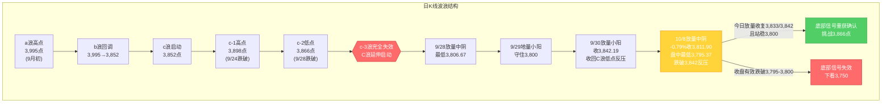
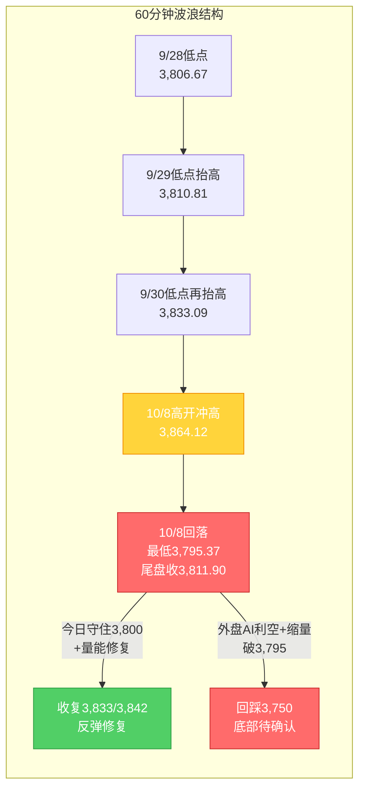

# A股晨报 - 2026年10月09日

> 数据截止时间：2026年10月9日 09:00（北京时间）；美股/欧股/日韩为10月8日（周四）收盘，港股为10月8日收盘，大宗商品/汇率/美债为10月8日收盘及10月9日凌晨
> 报告性质：**国庆长假后第2个交易日（10/9，周五）开盘晨报** —— 以10/8节后首日"放量调整"复盘为基础 + 隔夜外盘（10/8美股/欧股/日韩/港股收盘）+ 今日早盘前瞻
> 核心观点：**A股10/8节后首日放量调整、冲高回落**：上证指数**高开冲高3,864.12后回落，最低3,795.37（盘中一度失守3,800"最后防线"），收3,811.90、跌0.79%**；深证成指-2.07%、创业板指-3.15%、科创综指-4.55%，两市成交**1.68万亿元（放量2,442亿元）**，全市场**3,748只下跌/1,698只上涨、涨停45/跌停15**，主力资金**净流出超260亿元**。结构呈极致**"高切低"**——**半导体/存储/CPO/光模块、创新药、AI应用领跌**（CPO/光通信龙头源杰科技、长光华芯20%跌停），**银行（工行/中行创历史新高）、航运油运（中远海能涨停、招商轮船+9.33%）、石油石化/煤炭/燃气/电力、固态电池涨停潮**逆势走强。隔夜（10/8）外盘**"美股分化+AI链重挫"**：**OpenAI年化营收仅约500亿美元（较市场预期700亿美元低约200亿）**引发AI资本开支可持续性质疑，**纳指-1.25%两连跌、费城半导体指数-3.39%（英伟达-2.94%、英特尔-5.34%、博通-4.35%、美光-4.79%）**；**欧股普跌、日经-1.42%（失守7万点）、韩股-2.3%、港股恒生科技-2.89%创2024年9月26日以来新低（MINIMAX-W-13%）**。**油价因中东地缘飙升（WTI+3.64%报91.49、布油+4.07%报104.28）**，黄金反弹+0.58%（4,133.65），**美债收益率集体回落（10年期-5.1bp报5.235%）**，美元指数-0.1%（102.138），人民币中间价6.7367、离岸盘中升破6.70。**综合判断：今日（10/9）上证大概率【震荡偏弱】、权重（银行/能源）相对抗跌而成长（半导体/AI）继续承压**，核心观察**3,800点（20月均线，"最后防线"，10/8盘中已假跌破）**与**3,833/3,866点（反压）**。

---

## 一、昨日晚报复盘要点回顾

> 说明：上一交易日（10/8，周四）为国庆长假后**首个交易日**，其**晚报尚未生成**（`report/20261008/` 下仅有 `morning_report_20261008.md` 与 `day_summary_20261008.md`，无 `evening_report_20261008.md`）。故本节以**10/8晨报的盘前判断 vs 10/8实际收盘**作为复盘口径，并承接10/7休市特刊沉淀的规则。

### 1. 昨日（10/8）判断回顾
- **方向判断：✗** —— 晨报预判"震荡偏多（先抑后扬/低开高走）、区间3,820-3,890点"，实际**震荡偏弱、冲高回落收跌-0.79%**：低开0.08%报3,838.98 → 盘中冲高3,864.12（一度涨约+0.57%）→ 午后回落，**最低3,795.37（盘中跌破3,800最后防线）** → 收3,811.90，**收盘失守预判区间下沿（3,820点）**
- **点位预测**：强支撑3,800 → **盘中假跌破（最低3,795.37）后收盘收回**（部分✓但弱于"守住"预期）；弱支撑3,833 → **收盘失守**（✗）；弱压力3,866 → **未触及**（最高3,864.12，差约2点，~）；强压力3,898 → 未触及（~）
- **成交量预测：✓** —— 预判"放量至1.5-1.7万亿元"，实际两市成交**1.68万亿元**（较9/30放量2,442亿元），**量能预判精准**
- **板块预判**：**海运/航运✓**（中远海能涨停、招商轮船+9.33%、招商南油涨停）、**石油化工/油气✓**（油价飙升驱动石油股逆势上涨）、**半导体/通信设备看跌✓**（CPO/光模块/存储领跌）；**医药/疫苗/创新药看涨✗**（创新药、生物制品**领跌**）；房地产未现板块级行情（~）
- **综合**：**趋势方向误判（偏多→实际偏弱）为核心偏差**；量能预判精准、"半导体看跌"精准，但"医药看涨、指数偏多"出现明显偏差

### 2. 关键偏差及原因
- **偏差1（方向误判·核心）**：将10/8早盘"低开高走、探底回升"线性外推为"震荡偏多收涨"，忽视**午后科技成长（半导体/CPO/存储/创新药/AI应用）集体杀跌**与**主力资金净流出超260亿元**。根因：**信息缺失+逻辑误判**——低估"节后首日获利回吐 + 外盘科技链转弱（10/7港股半导体已领跌）"对内需科技板块的传导
- **偏差2（结构误判）**：将"医药/疫苗"列为看涨主线，实际**创新药、生物制品领跌**。根因：**逻辑误判（假期中段强势板块线性外推）**——10/7港股医药（金斯瑞生物科技-12.70%）已领跌，节后A股映射未及时下调优先级
- **偏差3（区间下沿失守）**：预判区间下沿3,820点，实际最低3,795.37、收3,811.90。根因：**技术分析局限**——"3,833/3,842点为支撑"的假设在节后放量调整中失效，把"盘中假跌破"误读为"支撑有效"

### 3. 沉淀的规则/检查项（本次直接应用）
- **规则1（趋势分析）**：节后首日"低开高走"若**午后不能维持、且量能放大而指数回落（放量滞涨/放量下跌）**，应按"冲高回落"定价，**放量调整日的早盘冲高不具方向指示性**
- **规则2（点位计算）**：**20月均线与前低共同构成的"最后防线"（如山证3,800点）盘中假跌破后收盘收回，属"多空激烈争夺"而非"底部确认"**；需以"连续2-3日收盘站稳"为前提，不可单日判定支撑有效
- **规则3（板块选择）**：**假期中段强势板块（医药）在收官日/复市首日连续领跌时，节后映射应进一步下调其优先级**（10/7金斯瑞领跌 → 10/8 A股创新药领跌，连续验证）
- **规则4（风险识别）**：**外盘"AI收入端质疑"（如OpenAI年化营收不及预期）为新一轮科技成长杀跌的独立催化**，应纳入科技链（半导体/存储/算力/AI应用）风险清单，其权重高于"美股单日涨跌"

### 4. 对今日（10/9）分析的启示
- **需要关注的风险点**：①**OpenAI年化营收约500亿美元（低于市场预期700亿美元约200亿）**→AI资本开支可持续性质疑，隔夜**费半-3.39%、纳指-1.25%**，**A股AI/算力/半导体链今日承压概率高**；②港股**恒生科技-2.89%创2024年9月26日以来新低**（大模型股MINIMAX-W-13%、智谱-7%、半导体华虹宏力-9%），对A股科技链形成低开扰动；③**3,800点（20月均线）10/8盘中已假跌破（最低3,795.37）**，今日需确认能否**收盘有效站稳**
- **需要调整的分析逻辑**：①**以10/8"放量调整、科技领跌、防御/红利/能源逆势"的结构为今日基准**；②纳入**"油价飙升（WTI+3.64%、布油+4.07%）"对油气/煤炭/油运的利好**与**"美债收益率回落（10年期-5.1bp）"、"地缘降温（加沙停火、美伊谈判）"**的边际缓和；③关注**航运（BDTI飙升）+银行（历史新高）+固态电池**等10/8强势主线的延续性

---

## 二、隔夜市场动态（10/8收盘至10/9凌晨）

### 1. 美股市场（10月8日 周四收盘）
| 指数 | 收盘点位 | 涨跌幅 | 说明 |
|------|---------|--------|------|
| 道琼斯工业指数 | 51,231.64 | **+0.10%**（+51.77点） | 能源权重（雪佛龙/埃克森美孚涨超2%）支撑 |
| 标普500指数 | 7,765.36 | **-0.47%**（-36.41点） | **两连跌**，科技拖累 |
| 纳斯达克综合指数 | 27,193.34 | **-1.25%**（-345.35点） | **两连跌**，AI/半导体链重挫 |

**解读**：**"OpenAI利空"是隔夜核心催化**——OpenAI在最新投资者文件中显示截至9月底**年化营收"接近500亿美元"，远低于上月末市场广泛引用的700亿美元预期（低约200亿）**，为**本轮AI行情启动以来首次来自"收入端"的公开质疑**，引发AI概念股大规模抛售：**费城半导体指数-3.39%**（**英伟达-2.94%、单日市值蒸发超1,684亿美元**；英特尔-5.34%、ARM-6.48%、博通-4.35%、美光科技-4.79%、台积电-3.00%、AMD-3.90%），**甲骨文-5.6%、CoreWeave-7.77%**，存储链（闪迪-4.9%）普跌。**净影响：外盘由10/7的"纪要偏鹰压制"转为"AI产业链个股（收入端）利空——道指微涨、纳指/标普续跌的结构性分化"，对A股映射由"整体偏空"转为"科技链定向偏空、能源/价值相对占优"。**

### 2. 欧洲/亚太市场（10月8日收盘）
| 市场 | 表现（10/8收盘） | 备注 |
|------|-----------------|------|
| 德国DAX30 | **-1.12% ~ -1.18%**（约24,806.97） | 领跌欧股 |
| 法国CAC40 | **-0.51%**（收7,729.69点） | — |
| 英国富时100 | **-0.16%** | 相对抗跌 |
| 欧洲斯托克600 | **-0.72%** | — |
| 日经225 | **-1.42%**（收69,042.11点） | **失守7万点**（较10/7再下台阶） |
| 韩国KOSPI | **约-2.35%**（收6,644.27点） | 存储链/半导体拖累重挫 |
| 恒生指数（10/8） | **-1.43%**（收23,785.79点） | 全日主板成交**2,072.55亿港元**（南向恢复） |
| 恒生科技（10/8） | **-2.89%**（收4,073.38点） | **创2024年9月26日以来新低** |
| 国企指数（10/8） | -0.89% | — |

**情绪判断**：**亚太10/8"日韩普跌、港股续跌"，欧洲"普跌"**——外围风险偏好延续10/7的偏空基调，且**港股科技（大模型/半导体）成为重灾区**（MINIMAX-W-13%、智谱-7%、壁仞科技-11%、华虹宏力-9%、联想集团-8%），但**港股石油股集体上涨**。**外部风险偏好整体偏空，且"AI/半导体定向利空"突出。**

### 3. 大宗商品（10月8日收盘）
| 品种 | 收盘价 | 涨跌幅 | 关键驱动 |
|------|--------|--------|---------|
| WTI原油（11月） | **91.49美元/桶** | **+3.64%**（+3.21美元） | **中东地缘（美军或重启对伊作战）+霍尔木兹海峡风险** |
| 布伦特原油（12月） | **104.28美元/桶** | **+4.07%**（+4.08美元） | **重回100美元上方并加速** |
| 现货黄金 | 约**4,133.65美元/盎司** | **+0.58%** | 从两个月低点反弹（债务/政策不确定性） |
| COMEX黄金（12月） | 约**4,158.30美元/盎司** | **+0.43%** | — |
| COMEX白银 | 约**59.43美元/盎司** | **-1.43%** | 跟随工业属性走弱 |

**驱动逻辑**：①**油价飙升**——"美军或重启对伊朗大规模作战"传闻 + 伊朗提出"七日内重开霍尔木兹海峡"方案，地缘风险溢价再起，**对A股油气、油运、煤炭板块形成强正向映射**；②**黄金反弹**——美元走弱（美元指数-0.1%）+ 美债收益率回落 + 避险，但**白银偏弱**；③需警惕**"油价飙升→通胀预期升温→美债长端上行"**的负反馈（虽10/8美债收益率回落，但油价续涨或重新扰动）。

### 4. 汇率与利率（10月8日收盘 / 10月9日凌晨）
| 指标 | 数值 | 变化/说明 |
|------|------|----------|
| 美元指数（10/8） | **102.138** | **-0.1%**（10/7为102.242，冲高回落） |
| 人民币中间价（10/8） | **6.7367** | **下调16个基点**（前值6.7351） |
| 离岸人民币 | **盘中升破6.70** | 在岸开盘6.7033、日内最高升值至6.70附近，**整体偏强** |
| 美债2年期收益率 | **4.76%** | -1BP（短端稳中偏强） |
| 美债5年期收益率 | **4.992%** | -3.6BP |
| 美债10年期收益率 | **5.235%** | **-5.1BP**（长端回落，拍卖稳健+地缘降温） |
| 美债30年期收益率 | **5.607%** | **-6.6BP**（绝对水平仍处2002年以来高位区） |
| 美联储政策预期 | 10月**维持利率概率超82%**、12月加息25bp概率约72.8% | 下次FOMC：**10月27-28日** |

**特征**：①**美债收益率"集体回落"**（10年期-5.1bp、30年期-6.6bp）——主因**10/7 390亿美元10年期拍卖需求强劲 + 10/8地缘降温（加沙停火、美伊谈判）**，是隔夜**对成长股估值最关键的边际缓和信号**；②**美元指数小幅走弱（102.138）**、**人民币维持偏强（离岸升破6.70）**，对A股资金面中性偏正面；③但**长端绝对水平仍处5.2%+高位**，"油价续涨→通胀预期升"的负反馈未消。

### 5. 重要海外事件
- **OpenAI营收利空（10/8）**：年化营收"接近500亿美元"，**低于市场700亿美元预期约200亿**，引发AI资本开支可持续性担忧——**本轮AI行情以来首次"收入端"质疑**
- **地缘降温（10/8-10/9）**：**加沙停火协议已达成**（10/9消息）；**美伊谈判推进**（伊朗外长称"仍在继续、几天内回复美方"）；**特朗普称美伊会谈"富有成效"、"中期选举前不会打击伊朗"**——地缘风险溢价边际回落（但油价因前期作战传闻一度飙升）
- **美债拍卖/收益率**：10/7 390亿美元10年期拍卖需求强劲（投标倍数2.77倍），叠加10/8地缘降温，**长端收益率冲高回落**

---

## 三、今日关注事项

### 1. 重要数据发布 / 政策（按时间排序）
- **央行公开市场操作延续**：10/8已开展**1.2万亿元3个月期买断式逆回购（净投放2,000亿元）**，并**下调PSL利率0.25个百分点至1.5%**——季末后流动性呵护明确，关注今日续作与资金价格
- **财政部**：10/8招标发行**2026年中央金融机构注资特别国债（一期）**（5年期固定利率附息债）——利好银行板块资本与估值
- **指数发布**：**上证光伏科创领先指数今日（10/9）发布**；中证指数公司发布样本调整安排
- **9月官方制造业PMI 50.1%**（节前公布）：重回扩张区间，基本面支撑延续

### 2. 限售股解禁（今日重点）
- **10/9当日**：共**5只个股**解禁（Wind口径，10/8-10/9合计17只、约33.38亿股、解禁市值超382亿元）；解禁规模居前为**湖南裕能（301358，8,253.75万股、解禁市值约41.84亿元）**、新威凌（920634，约715.64万元）
- **10月全月**：共**124家**解禁，合计约**122.26亿股**、解禁市值**3,047.11亿元**（环比+62.82%、同比+20.61%）；**电子、公用事业、煤炭**解禁市值居前，**西安奕材、中船特气**规模居前——**解禁压力为10月需持续跟踪的风险点**

### 3. 公司公告 / 业绩（三季报窗口临近）
- **三季报预告密集披露**：截至10/8晚，A股已有**27家**发布2026年前三季度业绩预告，预喜为主——**东岳硅材**预计前三季度归母净利5.47亿-5.67亿元、**同比+19,050%~19,750%**（目前增幅最大）；广汇能源预计净利27亿-28亿元（+166.83%~176.71%）
- **三季报正式开启**：**10月13日**有研新材、聚灿光电、冀东装备等首披；10/14金盘科技、川投能源；10/15宇通客车、一鸣食品等——**10月进入业绩验证窗口**
- **风险提示**：高位成长股（AI/半导体/创新药）三季报不及预期风险需警惕

### 4. 其他关注
- **新股**：**宇特光电（920157，北交所）今日上市**（发行价13.75元/股）；**通则康威（301718，创业板）今日申购**（发行价26.88元/股，发行市盈率44.72倍）
- **交易安排**：**本周仅2个交易日（10/8-10/9）**，**明日10/10（周六）休市**，下周一起恢复正常交易

---

## 四、板块与个股分析（结合昨日复盘）

### 1. 基于昨日（10/8）复盘结论的板块调整
- **10/8强势板块（防御/红利/能源/低位）今日预期**：①**银行/红利**——10/8工行、中行、杭州银行创历史新高，叠加**中央金融机构注资特别国债发行**，**资金"高切低"+政策催化**，防御属性延续；②**航运/油运**——**BDTI（原油运输指数）假期快速拉涨**，中远海能涨停、招商轮船+9.33%，**油运景气+油价飙升**双驱动；③**石油石化/煤炭/燃气/电力**——油价飙升（WTI+3.64%）直接利好，防御+涨价逻辑
- **10/8领跌板块（科技成长）今日预期**：①**半导体/存储**——隔夜**OpenAI利空+费半-3.39%+美光-4.79%**，**定向偏空，继续承压**；②**CPO/光模块/光芯片**——10/8源杰科技、长光华芯20%跌停，隔夜美股光通信链跟随AI回调，**回避**；③**AI应用/大模型/算力**——港股MINIMAX-W-13%、智谱-7%，**外盘映射继续转弱**；④**创新药/生物制品**——港股医药链未止跌，**映射继续下调**
- **偏差板块修正逻辑**：**医药（10/8误判看涨）**→ 今日明确**下调**，仅保留"防御性中药/流通"观察；**地产（10/8未兑现）**→ 维持"政策催化+防利好兑现分化"双面判断

### 2. 隔夜信息驱动的板块机会
- **受益板块**：
  - （1）**石油石化/油气、油服工程**（逻辑：**WTI+3.64%、布油+4.07%**，地缘风险溢价；油价单日大涨对A股油气板块正向映射强）
  - （2）**航运/油运**（逻辑：BDTI飙升 + 中远海能/招商轮船涨停示范 + 油价上行提振运价预期）
  - （3）**煤炭/燃气/电力/公用事业**（逻辑：能源涨价 + 高股息防御 + 资金高低切换）
  - （4）**银行/红利**（逻辑：注资特别国债 + 历史新高示范 + 防御抱团）
  - （5）**固态电池/锂电新技术**（逻辑：10/8涨停潮、事件驱动活跃，但需防高位波动）
- **受损板块**：
  - （1）**半导体/存储/芯片**（逻辑：**OpenAI收入端利空 + 费半-3.39% + 美光-4.79% + 港股半导体重挫**）
  - （2）**CPO/光模块/光芯片、AI算力/大模型**（逻辑：AI资本开支可持续性质疑，港股大模型股暴跌映射）
  - （3）**消费电子/汽车/商用车、创新药/生物制品**（逻辑：风险偏好回落 + 高位股获利回吐）

### 3. 重点关注个股（结合10/8异动与隔夜信息）
- **中远海能 / 招商轮船**：油运双龙头，10/8涨停/+9.33%，关注理由=**BDTI飙升+油价上行**；风险=连续涨停后获利回吐
- **工商银行 / 中国银行**：10/8创历史新高，关注理由=**注资特别国债+高股息防御+资金高低切换**；技术位置=历史高位强势
- **东岳硅材 / 广汇能源**：三季报大幅预喜，关注理由=**业绩验证窗口开启**；风险=预喜兑现后的"见光死"
- **湖南裕能（301358）**：今日解禁约41.84亿元，关注理由=**解禁冲击评估**；**回避或谨慎**
- **源杰科技 / 长光华芯**：10/8 20%跌停，关注理由=**CPO/光芯片超跌后能否企稳**；**回避**

---

## 五、今日核心判断（结构化输出，用于晚报复盘）

### 1. 趋势判断
- **上证指数：【震荡偏弱】**（权重相对抗跌、成长继续承压；关注3,800点有效性）
- **预测区间：3,785点 - 3,850点**
- **核心逻辑**：隔夜**"OpenAI收入端利空→纳指-1.25%/费半-3.39%/港股恒科创近两年新低"**对A股**科技成长（半导体/算力/AI应用）构成定向压制**（预计低开），叠加10/8放量调整、主力净流出260亿+、**3,800点已被盘中假跌破**；但**美债收益率集体回落（10年期-5.1bp）、地缘降温、人民币偏强、油价飙升利好能源、银行/红利历史新高**共同提供支撑，预计**上证在3,800点附近震荡消化、权重抗跌而成长承压**，"指数震荡、结构分化"特征延续。

### 2. 关键点位
- **强支撑位：3,800点**（依据：**20月均线，"最后防线"**；10/8盘中最低3,795.37已短暂失守，收盘收回——**今日能否收盘站稳为核心**）
- **弱支撑位：3,785点**（依据：盘中下沿/短线下探空间）
- **强压力位：3,866点**（依据：c-2低点，**周线底部反转确认位**；10/8盘中最高3,864.12**仅差约2点未破**）
- **弱压力位：3,833点**（依据：9/30低点，**前支撑转压力**）；次级压力3,842点（9/30收盘/C浪低点反压）

### 3. 板块预判
- **看涨板块**：（1）**石油石化/油气、油服**（逻辑：油价飙升WTI+3.64%、布油+4.07%）（2）**航运/油运**（逻辑：BDTI飙升+涨停示范）（3）**银行/红利**（逻辑：注资特别国债+历史新高+高低切换）（4）**煤炭/燃气/电力**（逻辑：能源涨价+高股息防御）（5）**固态电池**（逻辑：涨停潮+事件驱动）
- **看跌板块**：（1）**半导体/存储/芯片**（逻辑：OpenAI利空+费半-3.39%+美光-4.79%）（2）**CPO/光模块/光芯片、AI算力/大模型**（逻辑：AI资本开支质疑+港股大模型股暴跌）（3）**消费电子/汽车/商用车**（逻辑：风险偏好回落）（4）**创新药/生物制品**（逻辑：港股医药映射继续转弱）
- **风险板块**：①**今日大额解禁个股**（湖南裕能等）；②**高估值AI/半导体成长股**（三季报验证+外盘定向利空）；③**三季报可能不及预期的高位成长股**；④**连续涨停后的高位题材股**（获利回吐）；⑤**退市风险/ST个股**

### 4. 资金面判断
- **北向资金预期：【小幅净流出 / 结构分化】0 - 30亿元**（依据：10/8北向成交2,771.55亿元、占两市16.48%，**净额数据交易所已不实时披露，以成交口径跟踪**；外围风险偏好偏空或抑制流入，但人民币偏强+美债回落提供支撑）
- **成交量预期：【平量至小幅缩量】1.5 - 1.7万亿元**（依据：10/8已达1.68万亿，**今日为本周最后一个交易日、明日休市，观望情绪或使量能小幅回落**；若盘中surge破位则可能放量）

### 5. 风险预警（按优先级排序）
- **高风险**：①**OpenAI年化营收不及预期引发AI资本开支可持续性质疑**——A股AI/算力/半导体链**定向杀跌风险**；②**3,800点（20月均线）"最后防线"10/8盘中已假跌破**——若今日**收盘有效跌破，则下看3,750点**（C浪延伸加速）；③**港股恒生科技创2024年9月26日以来新低**——对A股科技链联动压制
- **中风险**：①**美债长端仍处5.2%+高位**（30年期5.607%）——"油价续涨→通胀预期升→长端上行"负反馈未消；②**地缘（美伊/霍尔木兹、加沙停火执行）**——油价与风险溢价突发波动；③**今日解禁（湖南裕能等）+ 三季报验证开启**——局部个股冲击
- **低风险**：①**本周仅2个交易日、明日休市**——量能修复受限；②**10月解禁规模3,047亿元（环比+62.82%）**——需持续跟踪

### 6. 昨日复盘规则应用
- **应用规则1（放量日的早盘冲高不具方向指示性）**：10/8"高开冲高3,864后回落收跌"验证本规则——**今日若早盘冲高（如快速上探3,833/3,842），需以"能否放量站稳"为确认，不因早盘冲高转多**
- **应用规则2（"最后防线"假跌破≠底部确认）**：3,800点10/8盘中假跌破（3,795.37）后收回，**今日以"收盘能否站稳3,800"为多空分水岭**，不单日判定支撑有效
- **应用规则3（收官日/复市首日领跌板块的下调）**：**创新药/半导体**连续两个交易日（10/7港股、10/8 A股）领跌，今日**继续下调其映射优先级**，转向**能源/红利/航运**等10/8强势方向
- **应用规则4（AI收入端质疑为独立催化）**：将**OpenAI营收利空**作为今日**科技链（半导体/算力/AI应用）首要风险因子**，其权重高于"美股单日涨跌"

---

## 六、波浪理论多周期分析

> 说明：基于10/8（节后首日）实际K线结构 + 隔夜外盘（10/8美股/欧股/日韩/港股收盘）推演今日（10/9）路径。**10/8放量中阴、盘中失守3,800后收回，使原"日线C浪延伸末段寻底初步确认"信号受挫、需重新确认。**

### 1. 月K线波浪分析
- **当前波浪位置**：大周期第2浪C浪延伸**末段**，10月开局（10/8）月K线转阴，**20月均线（3,800-3,810点）本月开盘即受考验**
- **浪型结构描述**：2024年9月2,689点→2026年6月4,197点为第1浪上升；第2浪ABC调整：4,197点→3,806.67点（9/28盘中最低）；9月月K线收中阴（月跌约-3.8%），10月首日（10/8）下探3,795.37再创阶段新低，月线MACD死叉绿柱未收敛
- **关键目标位**：月度强支撑**3,800-3,810点（20月均线）**；月度核心压力3,842点、3,866点、3,898点（5月均线区）；**加速目标3,750点（仅当有效跌破3,800点时启用）**
- **验证条件**：**10月月K线（10/8起）能否收盘站稳3,800点**——若月内有效跌破，则月度底部证伪、下看3,750点

### 2. 周K线波浪分析
- **当前波浪位置**：第41周（10/8-10/9，仅2个交易日）周K线**开局放量中阴**，跌势未止
- **浪型结构描述**：上周（第40周，9/28-9/30）周K线为"带长下影的小阴/十字星"（底部初步信号）；本周开局10/8放量中阴（-0.79%）**吞没上周企稳结构**，周线重回5周（3,900-3,910）、10周（3,885-3,895）均线下方，**短期均线空头排列延续**
- **关键目标位**：周度支撑**3,800点（20月均线，核心）**、3,795点（10/8低点）；周度压力**3,833点**、**3,866点（c-2低点，周线底部反转确认位）**
- **验证条件**：**本周仅剩今日1个交易日，周线收在3,800点上方为"勉强企稳"、收在3,800点下方则为"破位中阴"**——周线级别的多空分水岭仍是3,800与3,866

### 3. 日K线波浪分析（重点）
- **当前波浪位置**：**C浪延伸末段寻底"受挫"**——10/8放量中阴**跌破3,842点反压、并盘中跌破3,800点（最低3,795.37）**，**原"放量收回3,842反压 → 底部初步确认"的结构被打断**
- **浪型结构描述**：9/28放量中阴（最低3,806.67）→9/29地量小阳→9/30放量小阳收3,842.19（收回C浪低点反压）→**10/8放量中阴-0.79%收3,811.90（最低3,795.37）**；**低点抬高序列（3,806.67→3,810.81→3,833.09→3,795.37）被打破**，出现**新的阶段低点**
- **关键目标位**：第一压力**3,833点（9/30低点，前支撑转压力）**、3,842点（C浪低点反压）；**强压力3,866点（c-2低点）**；第一支撑**3,800点（20月均线，"最后防线"）**、3,795点（10/8低点）；**下方目标3,750点（C浪延伸加速）**
- **验证条件**：
  - **向上修复**：今日**放量收复3,833点并站稳3,842点** → 底部信号重获确认，方有挑战3,866点可能
  - **向下确认**：**收盘有效跌破3,795-3,800点** → 底部信号失效，下看3,750点
  - **今日变量（10/9）**：隔夜**外盘AI链定向利空（费半-3.39%）**，预计**科技成长低开拖累指数**；但**美债收益率回落+油价飙升+银行/红利强势**对冲，**关注"低开后3,800点能否守住、权重能否护盘"**

### 4. 60分钟K线波浪分析
- **当前波浪位置**：60分钟级别**转弱**，10/8午后冲高回落后走弱，短期趋势偏空
- **浪型结构描述**：60分钟10/8高开冲高3,864.12后逐级回落至3,795.37，**盘尾虽小幅反弹收3,811.90，但60分钟MACD零轴上方死叉、绿柱扩张，KDJ自高位回落**；短期均线（60分钟）转空
- **关键目标位**：短期支撑**3,800/3,795点**；短期压力3,833点、3,842点
- **验证条件**：**今日首个60分钟能否守住3,800点为短线转强/转弱分水岭**——若低开后快速跌破且不能收回，短线转弱概率高

### 5. 30分钟K线波浪分析
- **当前波浪位置**：30分钟级别弱势整理，10/8尾盘反弹力度有限
- **浪型结构描述**：30分钟10/8呈"高开→冲高→回落→尾盘小幅修复"，**MACD零轴附近反复、KDJ低位钝化**；量能集中在早盘冲高段（放量滞涨特征）
- **关键目标位**：关键支撑3,800/3,795点；短期压力3,833点、3,851点
- **验证条件**：**30分钟能否放量收复3,833点并站稳**，否则维持弱势震荡

### 6. 波浪图（Mermaid绘制）

**日K线波浪结构图**：

**60分钟波浪结构图**：

### 7. 波浪理论综合判断

| 维度 | 判断 |
|------|------|
| 多周期共振状态 | **月K/周K/日K/60分钟/30分钟均偏空**——10/8放量中阴跌破3,842反压并盘中失守3,800，打破"日线底部初步确认"，**多周期转弱势共振**；仅"银行/红利/能源"呈结构性强势，与指数弱势背离 |
| 当前操作级别 | **日线级别**（C浪延伸末段寻底"受挫"，关注3,800点有效性；3,795/3,800为多空分水岭，3,833/3,866为反压） |
| 后续演变路径（10/9） | **28%乐观**（权重护盘、守住3,800并放量收复3,833→修复至3,842/3,866）、**42%中性**（3,785-3,850区间震荡消化，权重抗跌、成长继续回调）、**30%悲观**（AI利空发酵/外盘续跌→收盘有效跌破3,795，下看3,750） |
| 关键拐点信号 | 向上：**放量收复3,833点并站稳3,800** + 北向净流入 + 美债长端继续回落；向下：**收盘有效跌破3,795-3,800** + 科技链放量杀跌 + 港股恒科续创新低 |
| 风险提示 | ①C浪延伸是否终结仍未确认，**10/8已打破原"底部初步确认"结构**，当前处于"重新寻底/确认支撑"阶段；②**OpenAI收入端利空为科技链新增的独立风险因子**（费半-3.39%、纳指-1.25%）；③**美债长端绝对水平仍处高位（30年期5.607%）**，油价飙升或重启"通胀预期→长端上行"负反馈；④港股恒生科技创近两年新低，联动压制；⑤波浪理论在C浪延伸末段+放量调整阶段预测精度降低，需结合政策面、外盘与量能综合判断 |

> **规律分析引用（第40周运行规律分析）**：该报告预测节后首周（第41周，10/8-10/9）上证运行区间**3,810-3,900点**，判断"**震荡企稳、偏多修复（先抑后扬）**"，乐观/中性/悲观概率45%/35%/20%。**10/8实际运行（3,795.37-3,864.12、收3,811.90）落在区间下沿并短暂下破**，验证"下沿"判断但"偏多修复"未兑现。本报告结合**10/8放量调整、OpenAI收入端利空、港股科技创近两年新低、油价飙升**等最新变化，**将今日路径概率进一步下修为"乐观28%/中性42%/悲观30%"**，主因**日线底部初步确认结构被打破 + 科技链外盘定向利空**。

---

## 七、投资策略建议（分短线+中线）

### 1. 短线策略（1-3个交易日）
- **适用场景**：基于日K线和60分钟K线技术信号
- **短线仓位：5%**（较10/8晨报的10%**下调5个百分点**——10/8放量调整、科技领跌、3,800受考验，短线胜率下降）
- **买入条件**：**指数守住3,800点且放量收复3,833点**；或强势方向（航运/油运、油气/煤炭、银行/红利）**回踩不破关键均线时低吸**
- **卖出条件**：指数反弹至**3,833-3,866点压力区滞涨**、或量能萎缩、或收盘跌破3,800点
- **止损位：3,790点**（收盘破3,795-3,800止损）或个股跌幅7%
- **短线标的**：（1）**航运/油运**（逻辑：BDTI飙升+油价上行，10/8涨停示范）（2）**石油石化/油气、煤炭**（逻辑：油价飙升WTI+3.64%）（3）**银行/红利**（逻辑：注资特别国债+历史新高+防御）——**回避**半导体/存储/CPO/AI应用等外盘定向利空方向

### 2. 中线策略（1-4周）
- **适用场景**：基于周K线波浪分析和运行规律分析结论
- **中线仓位：15%**（维持10/8晨报下沿，**待收盘有效站稳3,800点、并放量收复3,866点后再上修**）
- **方向判断：【持有 / 观望】**
- **目标区间**：上证指数 **3,780点 - 3,898点**
- **中线布局板块**：（1）**银行/红利**（逻辑：高股息+注资特别国债+央行宽松，攻守兼备）（2）**能源（油气/煤炭/燃气）**（逻辑：油价上行+高股息防御）（3）**航运/油运**（逻辑：BDTI景气+油价支撑）（4）**消费（家电/汽车/零售）**（逻辑：以旧换新2,500亿资金全部下达+上海国庆消费+9.9%）
- **止盈条件**：指数到达3,866-3,898点或波段涨幅达标
- **止损条件**：指数**收盘有效跌破3,795点**（20月均线下方）或趋势确认反转

### 3. 仓位分配总览
| 策略类型 | 仓位比例 | 方向 | 重点板块 |
|---------|---------|------|---------|
| 短线 | 5% | 观望/低吸 | 航运/油运、油气/煤炭、银行/红利 |
| 中线 | 15% | 持有/观望 | 银行/红利、能源、航运、消费 |
| 现金 | 80% | — | — |

### 4. 与昨日（10/8）策略对比
- **短线仓位调整**：从**10%下调至5%**（原因：10/8放量调整收跌、科技链领跌、外盘AI定向利空、3,800点受考验，短线操作环境转差）
- **中线仓位调整**：维持**15%**（原因：日线底部初步确认受挫，需待站稳3,800并收复3,866再评估上修）
- **板块调整**：**上调**航运/油运（BDTI+油价）、能源（油价飙升）、银行/红利（注资国债+新高）；**下调**半导体/存储/CPO/AI应用（OpenAI利空+费半-3.39%）、创新药/生物制品（连续领跌）、消费电子/汽车；**维持**煤炭/燃气/电力、消费

---

## 八、信息来源

1. **官方数据来源**：上海证券交易所（上证指数10/8收盘3,811.90、最低3,795.37、最高3,864.12）、深圳证券交易所（深证成指10/8收盘12,620.90）、国家统计局、中国人民银行（10/8净投放2,000亿元、PSL利率下调至1.5%）、财政部（中央金融机构注资特别国债一期）、中国外汇交易中心（10/8人民币中间价6.7367）、香港交易所（恒生指数10/8）、日经（Nikkei 225）、美国财政部（Treasury）、美国联邦储备委员会（FOMC）
2. **权威财经媒体**：新华社/新华网（《纽约股市三大股指8日涨跌不一》《伦敦股市8日下跌》）、央视财经、中国证券报、上海证券报（中国证券网）、证券时报（人民财讯/数据宝/e公司）、证券日报、财联社、每日经济新闻、21世纪经济报道、环球时报、央广财经、中国日报（Chinadaily）
3. **数据平台**：东方财富（Choice数据）、同花顺（10jqka）、Wind资讯、CME FedWatch、Nasdaq.com、格隆汇、证券之星、中国金融信息网（新华财经）、中国货币网
4. **海外信息源**：Reuters、Bloomberg、Nikkei、解（和讯/汇通财经）、证券时报e公司

> 数据截止时间：2026年10月9日 09:00（北京时间）；美股/欧股/日韩为10月8日收盘，港股为10月8日收盘，大宗商品/汇率/美债为10月8日收盘及10月9日凌晨。

---

*本晨报由AI代理自动生成，仅供参考，不构成投资建议。投资有风险，入市需谨慎。*